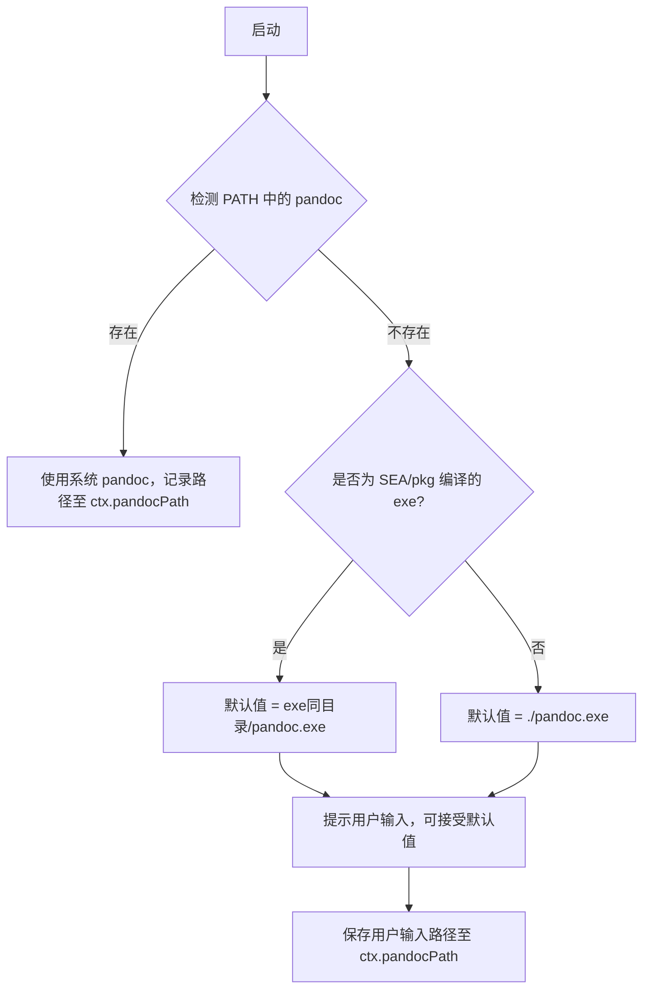

# Design Document: cli-task-tool

## Overview

`cli-task-tool` 是 `doc2xml-cli` 项目中的交互式 CLI 任务流水线模块，基于 listr2 构建。它将 Word 文档（.docx）转换为 Markdown 的完整流程拆分为若干有序任务，通过共享 Context 对象在任务间传递数据，并支持编译为单一可执行文件（exe）在无 Node.js 环境中运行。

核心设计目标：
- 任务模块化，每个任务独立文件，易于扩展
- 统一 Context 贯穿所有任务
- 编译为 exe 后，优先在 exe 同目录查找 `pandoc.exe`
- TypeScript 严格模式 + ESLint + Prettier

---

## Architecture

```mermaid
graph TD
    A[main.ts / CLI Entry] --> B[TaskRunner]
    B --> C[Docx_Input_Task]
    B --> D[Pandoc_Check_Task]
    B --> E[Convert_Task]
    C -- writes docxPath --> F[Context]
    D -- writes pandocPath --> F
    E -- reads docxPath, pandocPath --> F
    D -- interactive prompt --> G[@inquirer/prompts via listr2 prompt adapter]
    C -- interactive prompt --> G
```

任务按注册顺序串行执行，前序任务写入 Context，后续任务从 Context 读取。

---

## Directory Structure

```
src/
├── main.ts                  # CLI 入口，组装并运行任务流水线
├── context.ts               # Context 类型定义
├── runner.ts                # TaskRunner 封装（listr2 实例化与配置）
└── tasks/
    ├── docxInput.ts         # Docx_Input_Task
    ├── pandocCheck.ts       # Pandoc_Check_Task
    └── convert.ts           # Convert_Task
```

---

## Components and Interfaces

### TaskRunner（runner.ts）

封装 listr2 实例，提供统一的任务注册与执行接口。

```typescript
import { Listr } from 'listr2';
import type { AppContext } from './context';

export function createRunner(ctx: AppContext) {
  return new Listr<AppContext>([], {
    ctx,
    rendererOptions: { collapseSubtasks: false },
  });
}
```

新任务通过 `runner.add(task)` 注册，无需修改核心执行逻辑。

### Docx_Input_Task（tasks/docxInput.ts）

负责收集用户输入的 `.docx` 路径，并确认公式格式。

```typescript
import type { ListrTask } from 'listr2';
import type { AppContext } from '../context';

export const docxInputTask: ListrTask<AppContext> = {
  title: '输入文档路径',
  task: async (ctx, task) => { /* ... */ },
};
```

### Pandoc_Check_Task（tasks/pandocCheck.ts）

检测系统 PATH 中的 pandoc，若不存在则提示用户输入自定义路径。

```typescript
export const pandocCheckTask: ListrTask<AppContext> = {
  title: '检测 Pandoc 环境',
  task: async (ctx, task) => { /* ... */ },
};
```

### Convert_Task（tasks/convert.ts）

调用 pandoc 执行 docx → markdown 转换。

```typescript
export const convertTask: ListrTask<AppContext> = {
  title: '转换文档',
  task: async (ctx, task) => { /* ... */ },
};
```

---

## Data Models

### AppContext（context.ts）

所有任务共享的数据载体，贯穿整个流水线。

```typescript
export interface AppContext {
  /** 用户输入的 .docx 文件绝对路径 */
  docxPath: string;

  /** 解析后的 pandoc 可执行文件路径 */
  pandocPath: string;

  /** 传递给 pandoc 的额外参数（可选） */
  pandocArgs?: string[];

  /** 转换输出的 Markdown 文件路径（可选，由 Convert_Task 写入） */
  outputPath?: string;
}
```

初始值为空对象，各任务按需填充：

```typescript
const ctx: AppContext = {
  docxPath: '',
  pandocPath: '',
};
```

### Pandoc 路径解析逻辑

运行时按以下优先级解析 pandoc 路径：



**exe 同目录检测方式**（Node.js SEA）：

```typescript
import { executablePath } from 'node:sea'; // SEA API
// 或通过 process.execPath 获取 exe 路径
const exeDir = path.dirname(process.execPath);
const defaultPandoc = path.join(exeDir, 'pandoc.exe');
```

### 编译方案选型

| 方案 | 优点 | 缺点 | 推荐度 |
|------|------|------|--------|
| Node.js SEA（v20+） | 官方支持，无额外依赖 | 需 Node 20+，配置稍复杂 | ★★★★★ |
| pkg | 成熟稳定，支持旧版 Node | 已停止维护 | ★★★ |
| nexe | 支持多平台 | 构建慢，社区活跃度低 | ★★ |

**推荐使用 Node.js SEA**（Single Executable Application），配合 `esbuild` 先打包为单文件 JS，再通过 SEA 注入为 exe：

```
pnpm build
  └─ esbuild src/main.ts → dist/bundle.cjs
  └─ node --experimental-sea-config sea-config.json
  └─ node -e "require('postject').inject(...)"
```

`sea-config.json` 示例：

```json
{
  "main": "dist/bundle.cjs",
  "output": "dist/sea-prep.blob",
  "disableExperimentalSEAWarning": true
}
```

---

## Correctness Properties

*A property is a characteristic or behavior that should hold true across all valid executions of a system — essentially, a formal statement about what the system should do. Properties serve as the bridge between human-readable specifications and machine-verifiable correctness guarantees.*

### Property 1: 空路径输入被拒绝

*For any* 用户输入，若输入字符串为空或仅含空白字符，Docx_Input_Task 的路径验证函数应返回错误（非 undefined），且 Context 中的 `docxPath` 不应被更新。

**Validates: Requirements 1.5**

---

### Property 2: 有效路径写入 Context

*For any* 非空的文件路径字符串，当用户确认公式格式后，该路径应被完整写入 `ctx.docxPath`，且写入值与输入值相等。

**Validates: Requirements 1.1, 1.3**

---

### Property 3: 拒绝确认时流水线终止

*For any* 任务流水线实例，当用户在公式确认提示中选择"否"时，任务应抛出错误（或调用 `task.skip`/`task.cancel`），使后续任务不再执行。

**Validates: Requirements 1.4**

---

### Property 4: pandoc 路径始终非空

*For any* 执行路径（系统 PATH 存在或不存在 pandoc），Pandoc_Check_Task 完成后 `ctx.pandocPath` 应为非空字符串。

**Validates: Requirements 2.2, 2.4**

---

### Property 5: exe 同目录 pandoc 默认值

*For any* 编译后的 exe 运行环境，当系统 PATH 中不存在 pandoc 时，交互提示的默认值应等于 `path.join(path.dirname(process.execPath), 'pandoc.exe')`。

**Validates: Requirements 5.2**

---

### Property 6: 转换成功时任务状态为完成

*For any* 有效的 `ctx.docxPath` 和 `ctx.pandocPath`，当 pandoc 进程以退出码 0 结束时，Convert_Task 应正常完成（不抛出异常）。

**Validates: Requirements 3.1, 3.2**

---

### Property 7: 转换失败时错误被捕获

*For any* pandoc 调用，若进程以非零退出码结束或抛出异常，Convert_Task 应捕获该错误并重新抛出包含错误信息的 Error，使 listr2 将该任务标记为失败。

**Validates: Requirements 3.3**

---

### Property 8: 任务按注册顺序执行

*For any* 注册到 TaskRunner 的任务序列，任务的实际执行顺序应与注册顺序一致，且前序任务写入 Context 的数据对后续任务可见。

**Validates: Requirements 4.4**

---

## Error Handling

| 场景 | 处理方式 |
|------|----------|
| 用户输入空路径 | 验证函数返回错误提示字符串，inquirer 重新提示 |
| 用户拒绝确认公式格式 | 抛出 `Error('请先完成公式转换')`，listr2 标记任务失败并停止流水线 |
| pandoc 不在 PATH 且用户未提供路径 | 使用默认值 `./pandoc.exe`（或 exe 同目录），继续执行 |
| pandoc 路径无效（执行失败） | 捕获 `spawn` 错误，抛出包含 stderr 的 Error |
| pandoc 转换失败（非零退出码） | 捕获 stderr，抛出 `Error(stderr)`，listr2 展示错误详情 |
| 未知异常 | 冒泡至 listr2 顶层，由 listr2 统一展示错误 |

---

## Testing Strategy

### 单元测试（Unit Tests）

使用 **Vitest** 作为测试框架，针对以下内容编写具体示例测试：

- `validateDocxPath(input)` — 空字符串、纯空白、有效路径
- `resolvePandocDefault(execPath)` — 验证默认路径拼接逻辑
- `buildPandocArgs(ctx)` — 验证参数构造正确性
- Convert_Task 的错误捕获逻辑（mock `child_process.spawn`）

### 属性测试（Property-Based Tests）

使用 **fast-check** 作为属性测试库，每个属性测试运行最少 **100 次**迭代。

每个测试用注释标注对应设计属性：

```typescript
// Feature: cli-task-tool, Property 1: 空路径输入被拒绝
it('rejects empty or whitespace-only paths', () => {
  fc.assert(
    fc.property(fc.stringMatching(/^\s*$/), (input) => {
      expect(validateDocxPath(input)).not.toBeUndefined();
    }),
    { numRuns: 100 }
  );
});
```

各属性对应测试：

| 属性 | 测试描述 | 类型 |
|------|----------|------|
| Property 1 | 任意空白字符串均被验证函数拒绝 | property |
| Property 2 | 任意非空路径写入 ctx 后值不变 | property |
| Property 3 | 拒绝确认时后续任务不执行 | example |
| Property 4 | 任意执行路径下 pandocPath 非空 | property |
| Property 5 | exe 路径变化时默认值随之变化 | property |
| Property 6 | pandoc 成功退出时任务不抛异常 | property |
| Property 7 | pandoc 失败退出时错误被捕获 | property |
| Property 8 | 任意任务序列按注册顺序执行 | property |
