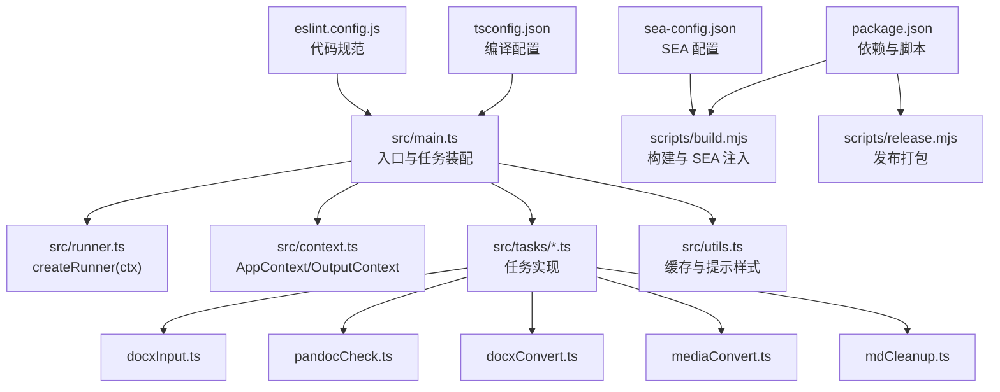
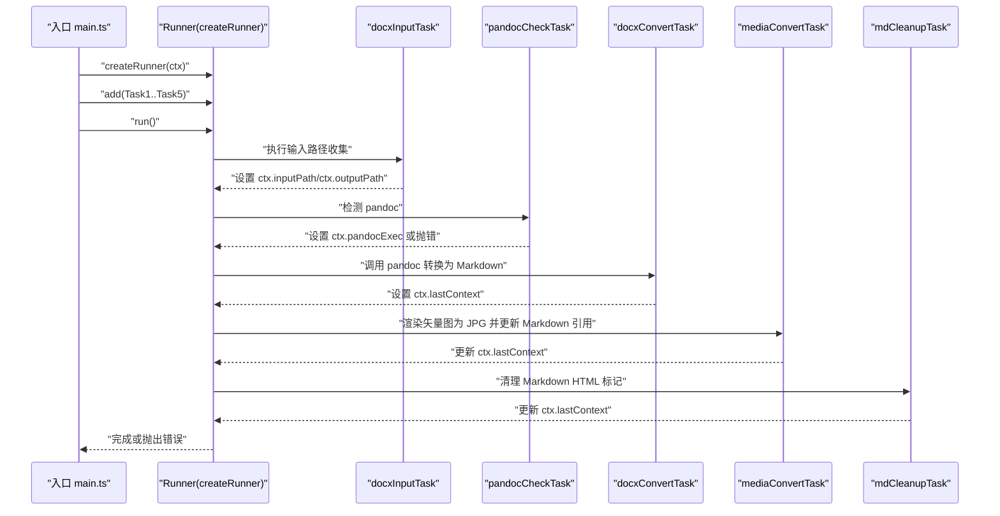
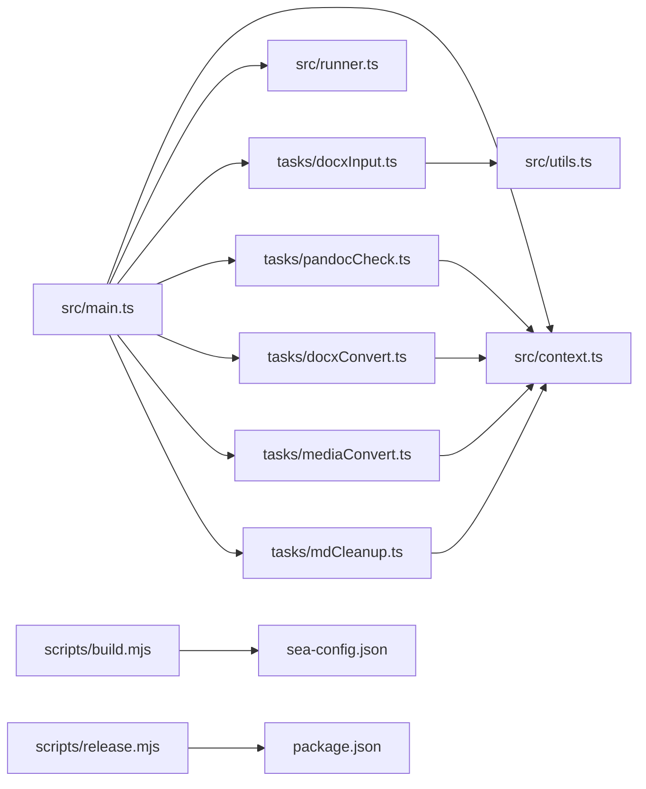

# API 参考文档

<cite>
**本文引用的文件**
- [src/main.ts](file://src/main.ts)
- [src/context.ts](file://src/context.ts)
- [src/runner.ts](file://src/runner.ts)
- [src/utils.ts](file://src/utils.ts)
- [src/tasks/docxInput.ts](file://src/tasks/docxInput.ts)
- [src/tasks/pandocCheck.ts](file://src/tasks/pandocCheck.ts)
- [src/tasks/docxConvert.ts](file://src/tasks/docxConvert.ts)
- [src/tasks/mediaConvert.ts](file://src/tasks/mediaConvert.ts)
- [src/tasks/mdCleanup.ts](file://src/tasks/mdCleanup.ts)
- [package.json](file://package.json)
- [tsconfig.json](file://tsconfig.json)
- [eslint.config.js](file://eslint.config.js)
- [scripts/build.mjs](file://scripts/build.mjs)
- [scripts/release.mjs](file://scripts/release.mjs)
- [sea-config.json](file://sea-config.json)
</cite>

## 目录
1. [简介](#简介)
2. [项目结构](#项目结构)
3. [核心组件](#核心组件)
4. [架构总览](#架构总览)
5. [详细组件分析](#详细组件分析)
6. [依赖关系分析](#依赖关系分析)
7. [性能考量](#性能考量)
8. [故障排查指南](#故障排查指南)
9. [结论](#结论)
10. [附录](#附录)

## 简介
本文件为 Doc2XML CLI 的完整 API 参考文档，覆盖应用上下文、任务定义、工具函数与配置参数的规范说明。内容包括：
- AppContext 接口与输出上下文 OutputContext 的字段与语义
- 任务接口 ListrTask<AppContext> 的职责与数据流
- 工具函数（缓存、确认提示样式等）
- 配置项（包配置、TypeScript 编译、ESLint 规则、构建与发布脚本、SEA 配置）
- 错误处理与调试建议
- 版本兼容性、废弃策略与迁移指南

## 项目结构
项目采用模块化组织，入口在 main.ts，核心上下文与运行器在 context.ts 与 runner.ts，任务在 src/tasks 下，通用工具在 utils.ts。

图表来源
- [src/main.ts:1-41](file://src/main.ts#L1-L41)
- [src/runner.ts:1-10](file://src/runner.ts#L1-L10)
- [src/context.ts:1-21](file://src/context.ts#L1-L21)
- [src/tasks/docxInput.ts:1-52](file://src/tasks/docxInput.ts#L1-L52)
- [src/tasks/pandocCheck.ts:1-24](file://src/tasks/pandocCheck.ts#L1-L24)
- [src/tasks/docxConvert.ts:1-64](file://src/tasks/docxConvert.ts#L1-L64)
- [src/tasks/mediaConvert.ts:1-112](file://src/tasks/mediaConvert.ts#L1-L112)
- [src/tasks/mdCleanup.ts:1-373](file://src/tasks/mdCleanup.ts#L1-L373)
- [src/utils.ts:1-50](file://src/utils.ts#L1-L50)
- [package.json:1-40](file://package.json#L1-L40)
- [scripts/build.mjs:1-53](file://scripts/build.mjs#L1-L53)
- [scripts/release.mjs:1-42](file://scripts/release.mjs#L1-L42)
- [tsconfig.json:1-19](file://tsconfig.json#L1-L19)
- [eslint.config.js:1-26](file://eslint.config.js#L1-L26)
- [sea-config.json:1-6](file://sea-config.json#L1-L6)

章节来源
- [src/main.ts:1-41](file://src/main.ts#L1-L41)
- [package.json:1-40](file://package.json#L1-L40)

## 核心组件
- AppContext：CLI 运行期全局上下文，承载输入路径、输出路径、pandoc 可执行文件位置以及最后一次输出上下文。
- OutputContext：某阶段任务产生的输出产物上下文，包含最终文件名、输出路径与媒体目录。
- createRunner(ctx)：基于 listr2 创建任务运行器，支持链式任务执行与进度展示。
- 工具函数：缓存读写（loadCache/saveCache）、确认提示默认答案样式（confirmDefaultAnswer）。

章节来源
- [src/context.ts:1-21](file://src/context.ts#L1-L21)
- [src/runner.ts:1-10](file://src/runner.ts#L1-L10)
- [src/utils.ts:1-50](file://src/utils.ts#L1-L50)

## 架构总览
Doc2XML CLI 以“任务流水线”为核心，通过 AppContext 在各任务间传递状态；任务由 listr2 执行，具备良好的可视化与错误传播能力。

图表来源
- [src/main.ts:9-16](file://src/main.ts#L9-L16)
- [src/tasks/docxInput.ts:27-52](file://src/tasks/docxInput.ts#L27-L52)
- [src/tasks/pandocCheck.ts:14-24](file://src/tasks/pandocCheck.ts#L14-L24)
- [src/tasks/docxConvert.ts:10-64](file://src/tasks/docxConvert.ts#L10-L64)
- [src/tasks/mediaConvert.ts:104-112](file://src/tasks/mediaConvert.ts#L104-L112)
- [src/tasks/mdCleanup.ts:331-373](file://src/tasks/mdCleanup.ts#L331-L373)

## 详细组件分析

### AppContext 与 OutputContext
- 字段与语义
  - inputPath：用户输入的 .docx 文件绝对路径（由 docxInputTask 设置）
  - outputPath：总输出目录（通常位于输入同级 out 目录）
  - pandocExec：解析后的 pandoc 可执行文件路径（默认为系统命令）
  - lastContext：最近一次任务生成的输出上下文，包含 outFilename、outputPath、mediaPath
- 使用要点
  - lastContext 作为任务间的数据桥接，下游任务可读取其 mediaPath 与 outFilename
  - 若输入为相对路径，入口会将其转为绝对路径并设置 outputPath

章节来源
- [src/context.ts:1-21](file://src/context.ts#L1-L21)
- [src/tasks/docxInput.ts:43-49](file://src/tasks/docxInput.ts#L43-L49)
- [src/tasks/docxConvert.ts:52-56](file://src/tasks/docxConvert.ts#L52-L56)
- [src/tasks/mediaConvert.ts:95-99](file://src/tasks/mediaConvert.ts#L95-L99)
- [src/tasks/mdCleanup.ts:362-366](file://src/tasks/mdCleanup.ts#L362-L366)

### 任务接口与职责
- ListrTask<AppContext>：listr2 的任务单元，包含 title 与 task 函数
- 任务顺序与依赖
  - 输入收集 → 环境检测 → 文档转换 → 媒体转换与路径修复 → Markdown 清理
- 任务间数据流
  - docxInputTask 设置 inputPath 与 outputPath
  - pandocCheckTask 设置 pandocExec
  - docxConvertTask 产出 lastContext（含 outFilename、outputPath、mediaPath）
  - mediaConvertTask 更新 lastContext 的 mediaPath 与 outputPath
  - mdCleanupTask 复制 lastContext 的 mediaPath 并更新 outputPath

章节来源
- [src/tasks/docxInput.ts:27-52](file://src/tasks/docxInput.ts#L27-L52)
- [src/tasks/pandocCheck.ts:14-24](file://src/tasks/pandocCheck.ts#L14-L24)
- [src/tasks/docxConvert.ts:10-64](file://src/tasks/docxConvert.ts#L10-L64)
- [src/tasks/mediaConvert.ts:104-112](file://src/tasks/mediaConvert.ts#L104-L112)
- [src/tasks/mdCleanup.ts:331-373](file://src/tasks/mdCleanup.ts#L331-L373)

### 工具函数 API
- confirmDefaultAnswer(defaultYes: boolean): string
  - 功能：生成带样式的确认提示文本，默认答案高亮绿色，非默认答案半亮显示
  - 参数：defaultYes 是否默认选择“是”
  - 返回：字符串，用于 inquirer 的 message/default 组合
  - 注意：该函数仅用于 UI 展示，不涉及业务逻辑
- loadCache(): Promise<InputCache>
  - 功能：从用户主目录下的缓存文件读取输入缓存
  - 返回：InputCache 对象（若文件不存在或不可读则返回空对象）
- saveCache(partial: Partial<InputCache>): Promise<void>
  - 功能：合并并写回缓存文件；写入失败静默忽略，不影响主流程
  - 参数：部分缓存对象
  - 注意：缓存文件位于用户主目录的特定子目录

章节来源
- [src/utils.ts:9-15](file://src/utils.ts#L9-L15)
- [src/utils.ts:28-35](file://src/utils.ts#L28-L35)
- [src/utils.ts:40-49](file://src/utils.ts#L40-L49)

### 验证与输入处理
- validateDocxPath(value: string): Promise<string | undefined>
  - 功能：校验 .docx 路径是否为空、是否存在
  - 返回：错误消息或 undefined
  - 用途：在 docxInputTask 的 prompt 校验中使用

章节来源
- [src/tasks/docxInput.ts:13-25](file://src/tasks/docxInput.ts#L13-L25)

### 环境检测
- testGlobalInstall(): boolean
  - 功能：尝试执行 pandoc --version，判断系统是否已安装 pandoc
  - 返回：布尔值
  - 用途：pandocCheckTask 中设置 pandocExec 或抛出错误

章节来源
- [src/tasks/pandocCheck.ts:5-12](file://src/tasks/pandocCheck.ts#L5-L12)

### 文档转换（pandoc）
- 任务行为
  - 创建输出目录（按层命名）
  - 以指定参数调用 pandoc，提取媒体资源
  - 成功后设置 lastContext，失败则将 stderr 作为错误信息抛出
- 关键参数
  - 输入：ctx.inputPath
  - 输出：outdir/outFilename
  - 媒体：outdir/media
  - 转换参数：from/to、媒体提取、标题风格等
- 注意事项
  - 若 pandoc 未安装或不可执行，任务会抛出错误
  - 转换过程中的标准错误会被收集并作为错误详情

章节来源
- [src/tasks/docxConvert.ts:10-64](file://src/tasks/docxConvert.ts#L10-L64)

### 媒体转换与路径修复
- 子任务
  - 渲染 EMF/WMF 为 JPG：遍历媒体目录，调用 MetafileConverter.exe 转换
  - 更新 Markdown 引用：将 media/xxx.emf(wmf) 替换为 media/xxx.jpg
- 可执行文件定位
  - SEA 运行时：process.execPath 同级 module/ 目录
  - 开发模式：项目根 module/MetafileConverter/.../bin/Release/net8.0
- 错误处理
  - 转换器返回非零退出码时抛出错误，包含退出码与错误信息
  - 无 EMF/WMF 文件时跳过转换

章节来源
- [src/tasks/mediaConvert.ts:13-24](file://src/tasks/mediaConvert.ts#L13-L24)
- [src/tasks/mediaConvert.ts:29-40](file://src/tasks/mediaConvert.ts#L29-L40)
- [src/tasks/mediaConvert.ts:43-72](file://src/tasks/mediaConvert.ts#L43-L72)
- [src/tasks/mediaConvert.ts:75-102](file://src/tasks/mediaConvert.ts#L75-L102)
- [src/tasks/mediaConvert.ts:104-112](file://src/tasks/mediaConvert.ts#L104-L112)

### Markdown 清理（HTML 标记移除与重构）
- 状态机与规则
  - State 枚举：NORMAL、IN_ZHENGWEN、IN_HEADING、IN_FIGURE、IN_TABLE、IN_IMG
  - HEADING_MAP：中文序号到 ATX 标题前缀映射
  - 正则规则：匹配 div/custom-style、figure/img、表格、行内 img 等
- 主要功能
  - 移除正文段落容器标签
  - 将中文级标题映射为 ATX 标题
  - 保留表格原样
  - 将行内与多行  标签转换为 Markdown 语法
  - 处理图注 caption 与图片引用
- 错误与告警
  - 未知标题样式发出警告
  - 无法识别的块结构在 EOF 时按原样输出避免数据丢失
  - 多行  无 src 时保留原文并告警

章节来源
- [src/tasks/mdCleanup.ts:6-24](file://src/tasks/mdCleanup.ts#L6-L24)
- [src/tasks/mdCleanup.ts:26-58](file://src/tasks/mdCleanup.ts#L26-L58)
- [src/tasks/mdCleanup.ts:60-72](file://src/tasks/mdCleanup.ts#L60-L72)
- [src/tasks/mdCleanup.ts:77-327](file://src/tasks/mdCleanup.ts#L77-L327)
- [src/tasks/mdCleanup.ts:331-373](file://src/tasks/mdCleanup.ts#L331-L373)

### 类型与接口定义
- AppContext
  - 字段：inputPath: string, outputPath: string, pandocExec: string, lastContext?: OutputContext
- OutputContext
  - 字段：outFilename: string, outputPath: string, mediaPath: string
- ListrTask<AppContext>
  - 字段：title: string, task: (ctx, task) => Promise<void> | Listr2 实例
- InputCache
  - 字段：docxInputPath?: string

章节来源
- [src/context.ts:1-21](file://src/context.ts#L1-L21)
- [src/utils.ts:20-22](file://src/utils.ts#L20-L22)
- [src/tasks/docxInput.ts:27-52](file://src/tasks/docxInput.ts#L27-L52)
- [src/tasks/pandocCheck.ts:14-24](file://src/tasks/pandocCheck.ts#L14-L24)
- [src/tasks/docxConvert.ts:10-64](file://src/tasks/docxConvert.ts#L10-L64)
- [src/tasks/mediaConvert.ts:104-112](file://src/tasks/mediaConvert.ts#L104-L112)
- [src/tasks/mdCleanup.ts:331-373](file://src/tasks/mdCleanup.ts#L331-L373)

### 配置参数与构建发布
- 包配置（package.json）
  - 名称、版本、描述、入口、脚本（开发、构建、发布、测试、格式化、lint）
  - 依赖：listr2、@inquirer/prompts、@listr2/prompt-adapter-inquirer
  - 开发依赖：TypeScript、ESLint、esbuild、prettier、vitest 等
- TypeScript 编译配置（tsconfig.json）
  - ES2022 目标、NodeNext 模块与解析、严格模式、声明文件生成
- ESLint 规则（eslint.config.js）
  - TypeScript 推荐规则、禁用 any、强制函数返回类型、分号风格等
- 构建脚本（scripts/build.mjs）
  - esbuild 打包入口为 dist/bundle.cjs
  - 生成 SEA blob，注入到可执行文件
  - 复制 .NET 模块至 dist/module
- 发布脚本（scripts/release.mjs）
  - 校验产物存在性，拷贝到 release/<version>/<name>，压缩为 zip
- SEA 配置（sea-config.json）
  - 指定 main、output 与禁用实验性 SEA 警告

章节来源
- [package.json:1-40](file://package.json#L1-L40)
- [tsconfig.json:1-19](file://tsconfig.json#L1-L19)
- [eslint.config.js:1-26](file://eslint.config.js#L1-L26)
- [scripts/build.mjs:1-53](file://scripts/build.mjs#L1-L53)
- [scripts/release.mjs:1-42](file://scripts/release.mjs#L1-L42)
- [sea-config.json:1-6](file://sea-config.json#L1-L6)

## 依赖关系分析
- 组件耦合
  - main.ts 仅负责装配与运行，低耦合
  - 各任务通过 AppContext 间接耦合，降低直接依赖
  - utils.ts 为纯工具模块，被多个任务复用
- 外部依赖
  - listr2：任务执行与渲染
  - @inquirer/prompts：交互式输入
  - child_process：调用 pandoc 与 MetafileConverter.exe
  - fs/promises：文件系统操作
- 潜在循环依赖
  - 无直接循环依赖；任务间通过 lastContext 单向传递

图表来源
- [src/main.ts:1-16](file://src/main.ts#L1-L16)
- [src/context.ts:1-21](file://src/context.ts#L1-L21)
- [src/runner.ts:1-10](file://src/runner.ts#L1-L10)
- [src/utils.ts:1-50](file://src/utils.ts#L1-L50)
- [src/tasks/docxInput.ts:1-52](file://src/tasks/docxInput.ts#L1-L52)
- [src/tasks/pandocCheck.ts:1-24](file://src/tasks/pandocCheck.ts#L1-L24)
- [src/tasks/docxConvert.ts:1-64](file://src/tasks/docxConvert.ts#L1-L64)
- [src/tasks/mediaConvert.ts:1-112](file://src/tasks/mediaConvert.ts#L1-L112)
- [src/tasks/mdCleanup.ts:1-373](file://src/tasks/mdCleanup.ts#L1-L373)
- [scripts/build.mjs:1-53](file://scripts/build.mjs#L1-L53)
- [scripts/release.mjs:1-42](file://scripts/release.mjs#L1-L42)
- [sea-config.json:1-6](file://sea-config.json#L1-L6)
- [package.json:1-40](file://package.json#L1-L40)

## 性能考量
- I/O 优化
  - 使用递归创建目录减少多次调用
  - 批量读取与写入，避免频繁小块 I/O
- 进程调用
  - pandoc 与 MetafileConverter.exe 串行执行，避免资源竞争
  - stderr 收集用于快速定位问题，避免阻塞主线程
- 缓存
  - 输入路径缓存减少重复输入，提高交互效率

## 故障排查指南
- 常见错误与处理
  - 未检测到 pandoc：检查系统 PATH 或手动指定 pandocExec
  - .docx 路径无效：确认路径存在且可访问
  - pandoc 转换失败：查看 stderr 输出，核对输入文档格式与公式转换
  - MetafileConverter 退出码非零：检查输入 EMF/WMF 文件完整性
  - 缓存写入失败：不影响主流程，检查用户主目录权限
- 调试建议
  - 在任务中打印中间状态（如 task.output）
  - 使用最小化输入文档复现问题
  - 查看构建产物与 SEA 注入是否成功

章节来源
- [src/tasks/pandocCheck.ts:17-21](file://src/tasks/pandocCheck.ts#L17-L21)
- [src/tasks/docxInput.ts:13-25](file://src/tasks/docxInput.ts#L13-L25)
- [src/tasks/docxConvert.ts:40-61](file://src/tasks/docxConvert.ts#L40-L61)
- [src/tasks/mediaConvert.ts:29-40](file://src/tasks/mediaConvert.ts#L29-L40)
- [src/utils.ts:46-48](file://src/utils.ts#L46-L48)

## 结论
本 API 参考文档梳理了 Doc2XML CLI 的上下文模型、任务流水线、工具函数与配置体系。通过清晰的任务边界与上下文传递机制，系统实现了从 .docx 到 Markdown 的自动化处理，并提供了稳健的错误处理与调试支持。建议在扩展新任务时遵循现有模式，保持对 AppContext 的最小侵入式使用与一致的错误传播。

## 附录

### 版本兼容性、废弃策略与迁移指南
- 版本兼容性
  - 项目使用 ES2022 目标与 NodeNext 模块解析，需 Node.js 运行环境满足要求
  - listr2 与 @inquirer/prompts 为外部依赖，升级时需关注 API 变更
- 废弃策略
  - 当前代码未声明废弃 API；新增功能优先向后兼容
- 迁移指南
  - 如需更换任务执行器，需实现 ListrTask<AppContext> 接口并适配 ctx/lastContext
  - 如需调整 pandoc 参数，修改对应任务的参数数组与工作目录

章节来源
- [tsconfig.json:2-14](file://tsconfig.json#L2-L14)
- [package.json:21-37](file://package.json#L21-L37)

### 错误码与异常处理
- 错误来源
  - 环境检测失败：抛出明确错误信息
  - 文件 I/O 失败：包装为 Error 并包含原始信息
  - 进程退出码非零：抛出包含退出码与 stderr 的错误
- 异常处理
  - 入口捕获错误并输出消息，支持 Ctrl+C 优雅退出（退出码 130）

章节来源
- [src/tasks/pandocCheck.ts:17-21](file://src/tasks/pandocCheck.ts#L17-L21)
- [src/tasks/docxConvert.ts:48-61](file://src/tasks/docxConvert.ts#L48-L61)
- [src/tasks/mediaConvert.ts:34-37](file://src/tasks/mediaConvert.ts#L34-L37)
- [src/main.ts:31-40](file://src/main.ts#L31-L40)