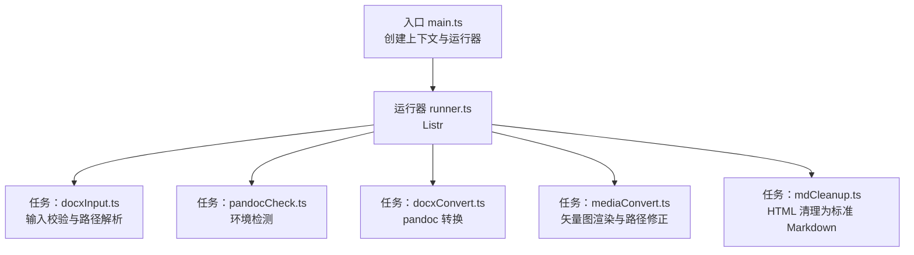
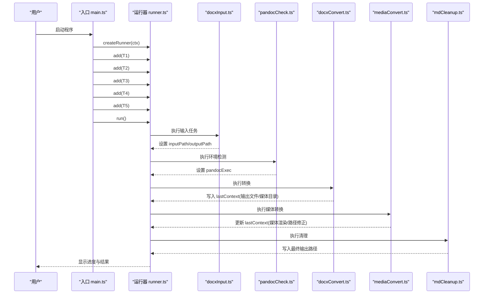
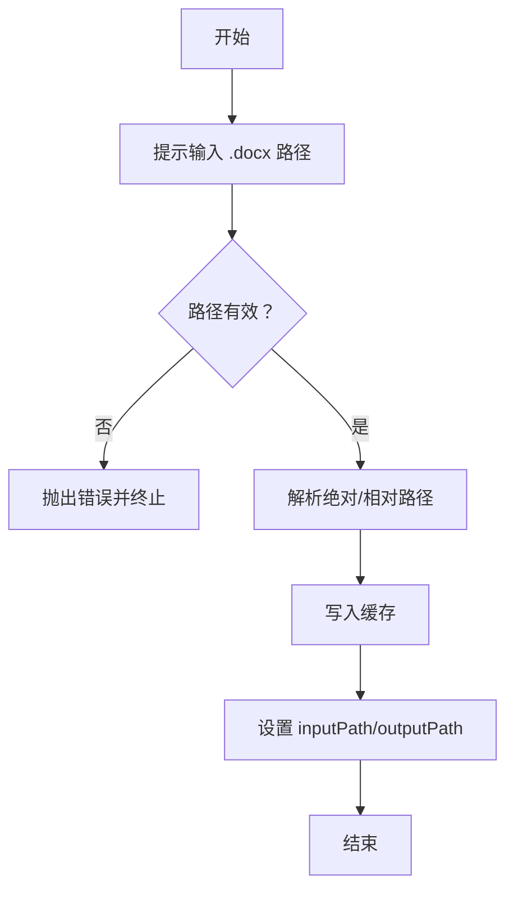
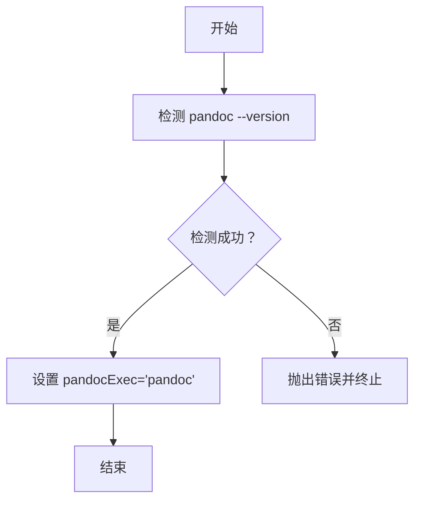
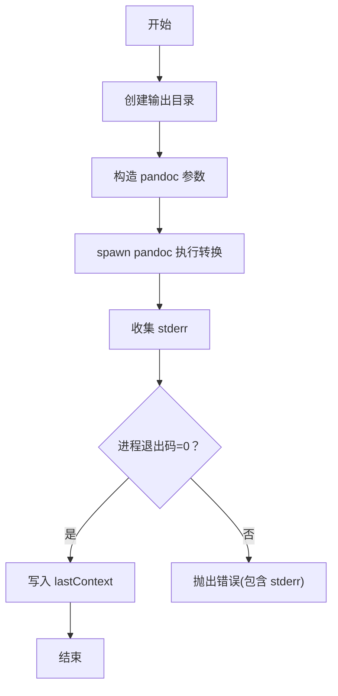
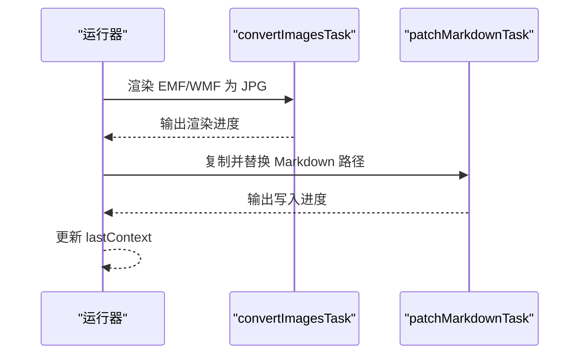
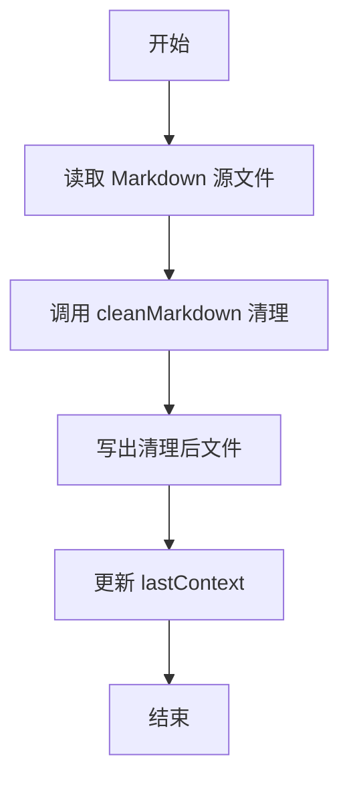
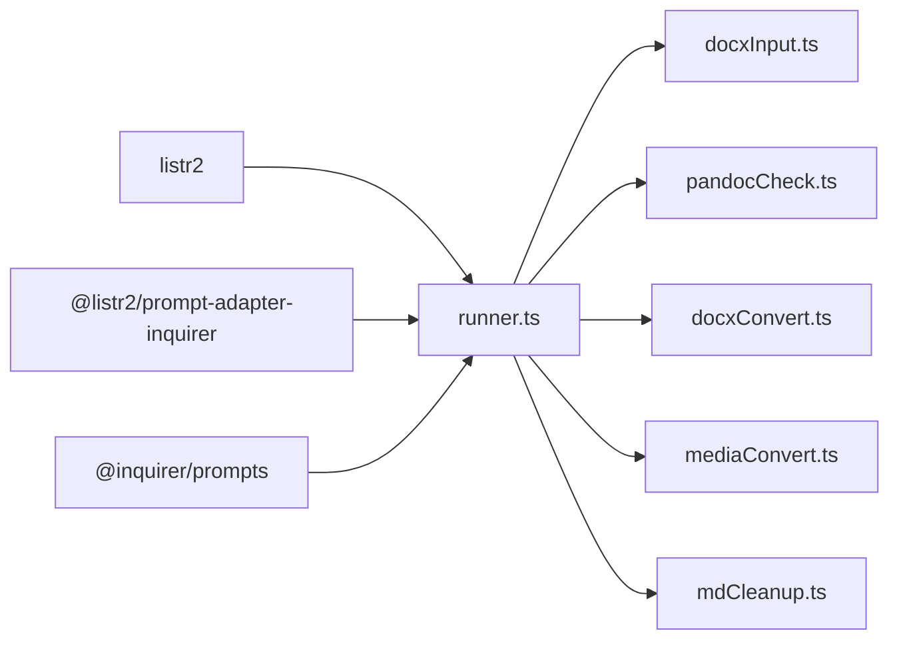

# 任务接口规范

<cite>
**本文引用的文件**
- [src/main.ts](file://src/main.ts)
- [src/runner.ts](file://src/runner.ts)
- [src/context.ts](file://src/context.ts)
- [src/utils.ts](file://src/utils.ts)
- [src/tasks/docxInput.ts](file://src/tasks/docxInput.ts)
- [src/tasks/pandocCheck.ts](file://src/tasks/pandocCheck.ts)
- [src/tasks/docxConvert.ts](file://src/tasks/docxConvert.ts)
- [src/tasks/mediaConvert.ts](file://src/tasks/mediaConvert.ts)
- [src/tasks/mdCleanup.ts](file://src/tasks/mdCleanup.ts)
- [package.json](file://package.json)
- [out/docxConvert/test.md](file://out/docxConvert/test.md)
- [out/mediaConvert/test.md](file://out/mediaConvert/test.md)
- [out/mdCleanup/test.md](file://out/mdCleanup/test.md)
- [.kiro/specs/cli-task-tool/tasks.md](file://.kiro/specs/cli-task-tool/tasks.md)
- [.kiro/specs/md-html-cleanup/tasks.md](file://.kiro/specs/md-html-cleanup/tasks.md)
</cite>

## 目录
1. [简介](#简介)
2. [项目结构](#项目结构)
3. [核心组件](#核心组件)
4. [架构总览](#架构总览)
5. [详细组件分析](#详细组件分析)
6. [依赖关系分析](#依赖关系分析)
7. [性能考量](#性能考量)
8. [故障排查指南](#故障排查指南)
9. [结论](#结论)
10. [附录](#附录)

## 简介
本规范面向任务系统的完整API文档，覆盖任务注册机制、任务间依赖与状态管理、生命周期与执行顺序、并发控制策略、配置项、错误处理与回调、以及自定义任务开发指南与最佳实践。系统基于 listr2 实现交互式CLI流水线，将 .docx 文档转换为 Markdown，并在转换过程中进行媒体渲染与 Markdown 清理。

## 项目结构
- 入口与编排
  - 入口文件负责创建上下文与运行器，注册并启动任务流水线。
  - 运行器封装 listr2，提供统一的渲染与上下文传递。
- 上下文与工具
  - AppContext 定义全局状态，包括输入路径、输出目录、pandoc 可执行文件路径等。
  - 工具模块提供缓存读写与命令行提示样式辅助。
- 任务层
  - 任务以 ListrTask 形式实现，彼此通过 AppContext 串联，形成顺序流水线。
  - 任务之间通过 lastContext 传递中间产物路径与媒体目录，实现隐式依赖。

**图表来源**
- [src/main.ts:1-41](file://src/main.ts#L1-L41)
- [src/runner.ts:1-10](file://src/runner.ts#L1-L10)
- [src/tasks/docxInput.ts:27-52](file://src/tasks/docxInput.ts#L27-L52)
- [src/tasks/pandocCheck.ts:14-24](file://src/tasks/pandocCheck.ts#L14-L24)
- [src/tasks/docxConvert.ts:10-64](file://src/tasks/docxConvert.ts#L10-L64)
- [src/tasks/mediaConvert.ts:104-112](file://src/tasks/mediaConvert.ts#L104-L112)
- [src/tasks/mdCleanup.ts:331-373](file://src/tasks/mdCleanup.ts#L331-L373)

**章节来源**
- [src/main.ts:1-41](file://src/main.ts#L1-L41)
- [src/runner.ts:1-10](file://src/runner.ts#L1-L10)
- [src/context.ts:1-21](file://src/context.ts#L1-L21)
- [src/utils.ts:1-50](file://src/utils.ts#L1-L50)

## 核心组件
- 上下文接口与工厂
  - AppContext：定义输入路径、输出目录、pandoc 可执行文件路径、lastContext 等。
  - createContext：返回默认上下文，pandocExec 初始值为可执行名。
- 运行器
  - createRunner：基于 listr2 创建 Listr<AppContext>，开启子任务展开显示。
- 工具函数
  - confirmDefaultAnswer：用于 inquirer 提示的默认答案样式。
  - loadCache/saveCache：持久化输入缓存，失败静默不影响主流程。

**章节来源**
- [src/context.ts:1-21](file://src/context.ts#L1-L21)
- [src/runner.ts:1-10](file://src/runner.ts#L1-L10)
- [src/utils.ts:1-50](file://src/utils.ts#L1-L50)

## 架构总览
系统采用顺序流水线架构，任务按注册顺序串行执行。每个任务通过 AppContext 读取前置状态，必要时写入中间结果（lastContext），供下游任务使用。媒体转换阶段包含两个子任务，通过 newListr 串行执行，确保 EMF/WMF 渲染与 Markdown 路径替换的原子性。

**图表来源**
- [src/main.ts:9-16](file://src/main.ts#L9-L16)
- [src/tasks/docxInput.ts:27-52](file://src/tasks/docxInput.ts#L27-L52)
- [src/tasks/pandocCheck.ts:14-24](file://src/tasks/pandocCheck.ts#L14-L24)
- [src/tasks/docxConvert.ts:10-64](file://src/tasks/docxConvert.ts#L10-L64)
- [src/tasks/mediaConvert.ts:104-112](file://src/tasks/mediaConvert.ts#L104-L112)
- [src/tasks/mdCleanup.ts:331-373](file://src/tasks/mdCleanup.ts#L331-L373)

## 详细组件分析

### 任务：输入文档路径（docxInput）
- 作用
  - 交互式收集 .docx 输入路径，支持缓存默认值与路径有效性校验。
- 关键行为
  - 使用 Inquirer prompt 获取路径，校验文件存在性。
  - 将绝对/相对路径解析为 inputPath 与 outputPath。
  - 写入缓存，便于下次使用。
- 配置与回调
  - 无外部配置项；通过 validate 回调返回错误消息。
- 错误处理
  - 空输入或无效路径抛出错误，中断流水线。
- 生命周期
  - 注册即执行；无子任务。
- 并发控制
  - 串行执行，无并发。

**图表来源**
- [src/tasks/docxInput.ts:27-52](file://src/tasks/docxInput.ts#L27-L52)
- [src/utils.ts:28-49](file://src/utils.ts#L28-L49)

**章节来源**
- [src/tasks/docxInput.ts:1-52](file://src/tasks/docxInput.ts#L1-L52)
- [src/utils.ts:17-49](file://src/utils.ts#L17-L49)

### 任务：检测 Pandoc 环境（pandocCheck）
- 作用
  - 检测系统是否已安装 pandoc，若未安装则抛出错误。
- 关键行为
  - 通过命令行版本检测；成功则设置 pandocExec 为可执行名。
- 配置与回调
  - 无外部配置项。
- 错误处理
  - 未检测到 pandoc 抛出错误，中断流水线。
- 生命周期
  - 注册即执行；无子任务。
- 并发控制
  - 串行执行，无并发。

**图表来源**
- [src/tasks/pandocCheck.ts:14-24](file://src/tasks/pandocCheck.ts#L14-L24)

**章节来源**
- [src/tasks/pandocCheck.ts:1-24](file://src/tasks/pandocCheck.ts#L1-L24)

### 任务：将文档转换为 Markdown（docxConvert）
- 作用
  - 使用 pandoc 将 .docx 转换为 Markdown，并抽取媒体资源。
- 关键行为
  - 创建输出目录与媒体目录。
  - 构造 pandoc 参数并异步调用，监听 stderr 与进程事件。
  - 成功时写入 lastContext（文件名、输出路径、媒体路径）。
- 配置与回调
  - 无外部配置项；内部固定转换参数。
- 错误处理
  - 目录创建失败、进程错误、非零退出码均抛出错误。
- 生命周期
  - 注册即执行；无子任务。
- 并发控制
  - 串行执行，无并发。

**图表来源**
- [src/tasks/docxConvert.ts:10-64](file://src/tasks/docxConvert.ts#L10-L64)

**章节来源**
- [src/tasks/docxConvert.ts:1-64](file://src/tasks/docxConvert.ts#L1-L64)

### 任务：渲染矢量图并更新 Markdown 路径（mediaConvert）
- 作用
  - 将 media 目录中的 EMF/WMF 渲染为 JPG，并更新 Markdown 中的引用路径。
- 子任务
  - convertImagesTask：遍历媒体目录，筛选 EMF/WMF，逐一调用本地转换器。
  - patchMarkdownTask：复制 Markdown 至新目录，替换媒体引用为 JPG。
- 配置与回调
  - 无外部配置项；内部定位转换器路径，兼容 SEA 与开发环境。
- 错误处理
  - 转换器返回非零退出码时抛出错误；找不到文件时跳过。
- 生命周期
  - 通过 newListr 串行执行两个子任务。
- 并发控制
  - concurrent=false，串行执行子任务。

**图表来源**
- [src/tasks/mediaConvert.ts:104-112](file://src/tasks/mediaConvert.ts#L104-L112)
- [src/tasks/mediaConvert.ts:43-72](file://src/tasks/mediaConvert.ts#L43-L72)
- [src/tasks/mediaConvert.ts:75-102](file://src/tasks/mediaConvert.ts#L75-L102)

**章节来源**
- [src/tasks/mediaConvert.ts:1-112](file://src/tasks/mediaConvert.ts#L1-L112)

### 任务：清理 Markdown HTML 标记（mdCleanup）
- 作用
  - 对 pandoc 输出的 Markdown 进行 HTML 清理，输出标准 Markdown。
- 关键行为
  - 读取上一步输出文件，调用纯函数 cleanMarkdown 进行清理。
  - 写入最终输出路径与媒体目录至 lastContext。
- 配置与回调
  - 无外部配置项；内部维护标题映射与状态机规则。
- 错误处理
  - 文件读取失败抛出错误；清理过程中的警告通过回调输出。
- 生命周期
  - 注册即执行；无子任务。
- 并发控制
  - 串行执行，无并发。

**图表来源**
- [src/tasks/mdCleanup.ts:331-373](file://src/tasks/mdCleanup.ts#L331-L373)

**章节来源**
- [src/tasks/mdCleanup.ts:1-373](file://src/tasks/mdCleanup.ts#L1-L373)

## 依赖关系分析
- 运行时依赖
  - listr2：任务运行与渲染。
  - @listr2/prompt-adapter-inquirer：将 Inquirer 提示适配为 listr2 的 prompt。
  - @inquirer/prompts：命令行交互提示。
- 构建与打包
  - esbuild：打包入口文件为 CJS。
  - SEA/postject：生成 SEA 可执行文件。
- 任务间依赖
  - 顺序依赖：docxInput → pandocCheck → docxConvert → mediaConvert → mdCleanup。
  - 隐式依赖：mediaConvert 与 mdCleanup 通过 lastContext 传递中间产物。

**图表来源**
- [package.json:21-38](file://package.json#L21-L38)
- [src/runner.ts:1-10](file://src/runner.ts#L1-L10)

**章节来源**
- [package.json:1-40](file://package.json#L1-L40)

## 性能考量
- I/O 与并发
  - 任务整体为串行执行，避免资源竞争；媒体转换阶段通过串行子任务保证一致性。
- 进程与子进程
  - pandoc 与本地转换器均为外部进程，建议在资源充足的环境中运行。
- 缓存与复用
  - 输入路径缓存减少重复输入；输出目录结构清晰，便于增量处理与调试。

## 故障排查指南
- 常见问题与处理
  - 输入路径为空或无效：检查输入任务的校验逻辑与缓存文件。
  - 未检测到 pandoc：确认系统 PATH 或手动指定可执行文件路径。
  - pandoc 转换失败：查看 stderr 输出，确认 .docx 中公式是否已转换为 Office Math。
  - 媒体转换器错误：检查转换器可执行文件是否存在与权限。
  - Markdown 清理报错：检查源文件读取权限与内容编码。
- 错误传播
  - 顶层捕获错误并输出，支持 Ctrl+C 优雅退出。

**章节来源**
- [src/main.ts:31-40](file://src/main.ts#L31-L40)
- [src/tasks/docxConvert.ts:48-61](file://src/tasks/docxConvert.ts#L48-L61)
- [src/tasks/mediaConvert.ts:29-40](file://src/tasks/mediaConvert.ts#L29-L40)
- [src/tasks/mdCleanup.ts:340-348](file://src/tasks/mdCleanup.ts#L340-L348)

## 结论
该任务系统以 listr2 为核心，通过明确的上下文传递与顺序流水线实现了 .docx 到 Markdown 的完整转换链路。任务间通过 lastContext 隐式依赖，媒体转换与 Markdown 清理分别承担渲染与语义规范化职责。系统具备良好的可扩展性与可维护性，适合进一步引入更多任务与配置项。

## 附录

### 任务注册与执行顺序
- 注册顺序即执行顺序，由入口文件统一管理。
- 任务间通过 AppContext 与 lastContext 传递状态。

**章节来源**
- [src/main.ts:12-16](file://src/main.ts#L12-L16)

### 输出示例路径
- docxConvert 输出示例：[out/docxConvert/test.md](file://out/docxConvert/test.md)
- mediaConvert 输出示例：[out/mediaConvert/test.md](file://out/mediaConvert/test.md)
- mdCleanup 输出示例：[out/mdCleanup/test.md](file://out/mdCleanup/test.md)

**章节来源**
- [out/docxConvert/test.md:1-222](file://out/docxConvert/test.md#L1-L222)
- [out/mediaConvert/test.md:1-222](file://out/mediaConvert/test.md#L1-L222)
- [out/mdCleanup/test.md:1-128](file://out/mdCleanup/test.md#L1-L128)

### 自定义任务开发指南与最佳实践
- 设计原则
  - 任务应为纯函数或幂等操作，便于测试与复用。
  - 通过 AppContext 读取前置状态，必要时写入 lastContext。
  - 使用 task.output 输出进度，便于用户感知。
- 并发与顺序
  - 默认串行；需要并行时使用 listr2 的并发选项，但需确保资源互斥。
- 错误处理
  - 明确区分可恢复与不可恢复错误；不可恢复时抛出带上下文的错误。
- 配置与回调
  - 将可配置项抽象为常量或外部配置，避免硬编码。
  - 回调用于日志与警告，不改变任务状态。
- 参考实现
  - 参考现有任务的结构与命名约定，保持一致性。

**章节来源**
- [.kiro/specs/cli-task-tool/tasks.md:37-100](file://.kiro/specs/cli-task-tool/tasks.md#L37-L100)
- [.kiro/specs/md-html-cleanup/tasks.md:44-56](file://.kiro/specs/md-html-cleanup/tasks.md#L44-L56)