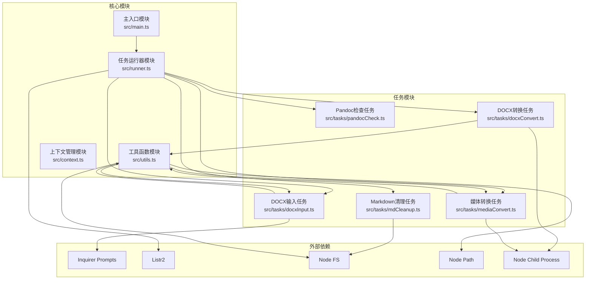
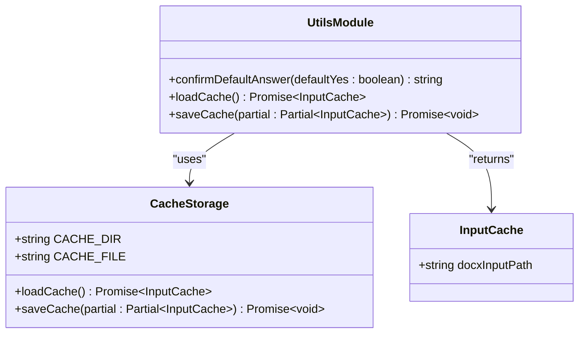
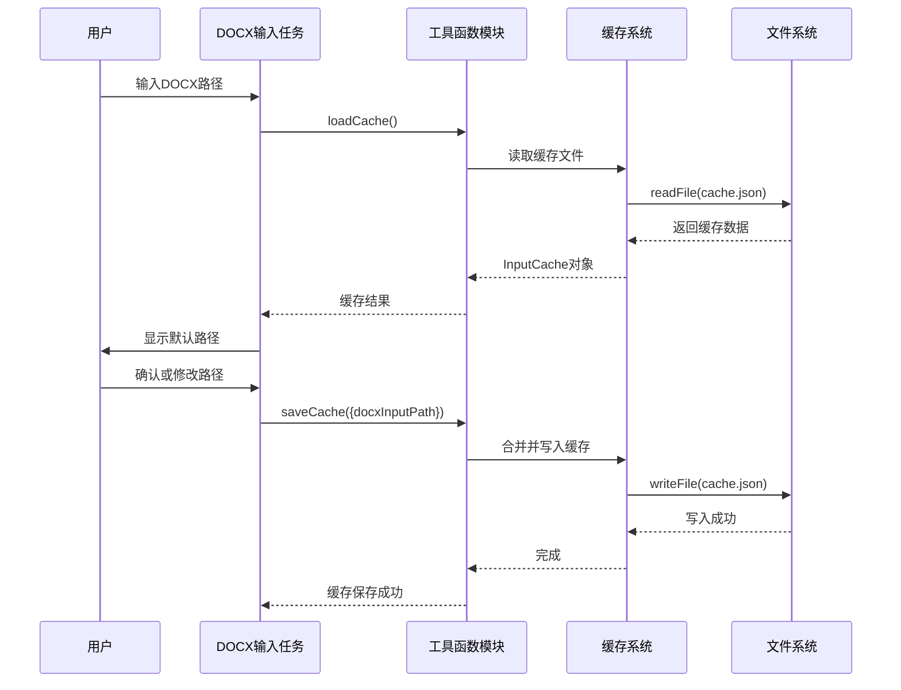
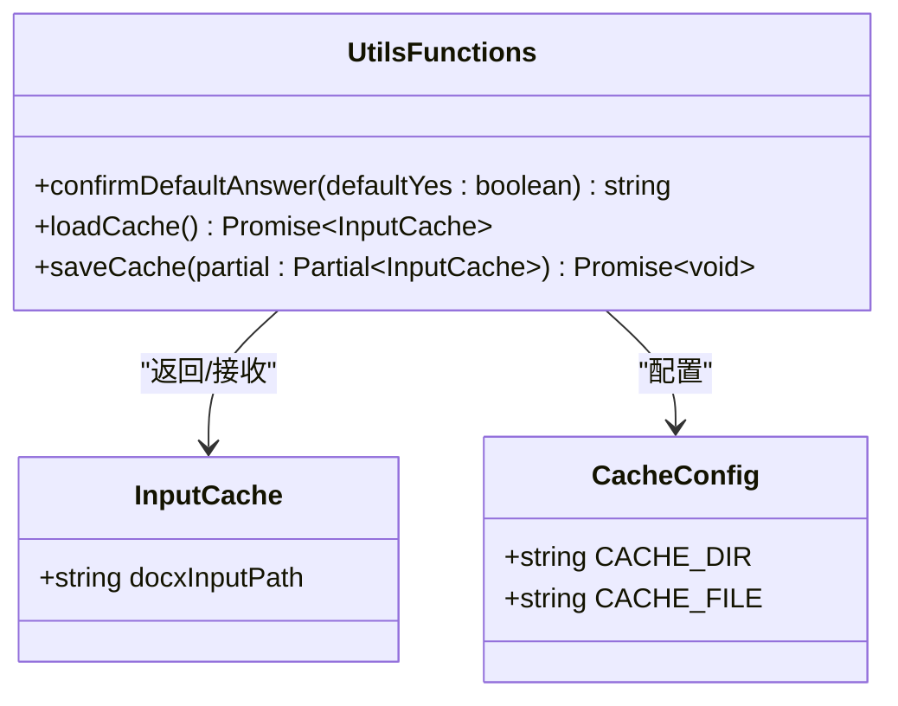

# 工具函数API

<cite>
**本文档引用的文件**
- [src/utils.ts](file://src/utils.ts)
- [src/context.ts](file://src/context.ts)
- [src/main.ts](file://src/main.ts)
- [src/runner.ts](file://src/runner.ts)
- [src/tasks/docxInput.ts](file://src/tasks/docxInput.ts)
- [src/tasks/pandocCheck.ts](file://src/tasks/pandocCheck.ts)
- [src/tasks/docxConvert.ts](file://src/tasks/docxConvert.ts)
- [src/tasks/mediaConvert.ts](file://src/tasks/mediaConvert.ts)
- [src/tasks/mdCleanup.ts](file://src/tasks/mdCleanup.ts)
- [package.json](file://package.json)
</cite>

## 目录
1. [简介](#简介)
2. [项目结构](#项目结构)
3. [核心组件](#核心组件)
4. [架构概览](#架构概览)
5. [详细组件分析](#详细组件分析)
6. [依赖分析](#依赖分析)
7. [性能考虑](#性能考虑)
8. [故障排除指南](#故障排除指南)
9. [结论](#结论)

## 简介

本文件提供了doc2xml-cli项目中工具函数模块的完整API参考文档。该工具集主要包含用户输入缓存函数、文件操作函数和辅助工具函数，用于将DOCX文档转换为Markdown格式的交互式CLI管道。

项目采用TypeScript编写，使用现代Node.js特性，包括ES模块、异步函数和Promise。工具函数模块设计简洁，功能明确，具有良好的错误处理和调试支持。

## 项目结构

项目采用模块化架构，主要由以下核心模块组成：



**图表来源**
- [src/main.ts:1-41](file://src/main.ts#L1-L41)
- [src/runner.ts:1-10](file://src/runner.ts#L1-L10)
- [src/utils.ts:1-50](file://src/utils.ts#L1-L50)

**章节来源**
- [src/main.ts:1-41](file://src/main.ts#L1-L41)
- [src/runner.ts:1-10](file://src/runner.ts#L1-L10)
- [src/utils.ts:1-50](file://src/utils.ts#L1-L50)

## 核心组件

### 工具函数模块概述

工具函数模块位于[src/utils.ts](file://src/utils.ts)，提供以下核心功能：

1. **用户输入缓存系统** - 持久化用户最近的DOCX输入路径
2. **终端样式化工具** - 为确认提示提供彩色显示支持
3. **文件操作辅助** - 简化常见的文件系统操作

### 缓存系统架构



**图表来源**
- [src/utils.ts:20-50](file://src/utils.ts#L20-L50)

**章节来源**
- [src/utils.ts:1-50](file://src/utils.ts#L1-L50)

## 架构概览

整个工具函数系统围绕三个核心概念构建：



**图表来源**
- [src/tasks/docxInput.ts:27-52](file://src/tasks/docxInput.ts#L27-L52)
- [src/utils.ts:28-50](file://src/utils.ts#L28-L50)

## 详细组件分析

### 1. 用户输入缓存函数

#### 函数签名与类型定义



**图表来源**
- [src/utils.ts:20-50](file://src/utils.ts#L20-L50)

#### confirmDefaultAnswer函数

**函数用途**: 为Inquirer确认提示生成带样式的默认答案字符串，突出显示默认选项并淡化其他选项。

**参数说明**:
- `defaultYes`: boolean - 默认选择是否为"是"
  - `true`: 显示"(Y/n)"格式，Y为粗体绿色
  - `false`: 显示"(y/N)"格式，N为粗体绿色

**返回值**: string - 格式化的确认提示字符串

**使用场景**:
- 用户输入验证中的确认提示
- 需要强调默认选项的交互界面
- 命令行工具的用户确认流程

**实现细节**:
- 使用ANSI转义序列实现颜色控制
- 支持粗体和淡色效果
- 动态生成大小写敏感的提示格式

**章节来源**
- [src/utils.ts:5-15](file://src/utils.ts#L5-L15)

#### loadCache函数

**函数用途**: 从磁盘读取持久化的用户输入缓存，如果文件不存在或不可读则返回空对象。

**参数说明**: 无

**返回值**: Promise~InputCache~ - 包含缓存数据的Promise对象

**异常处理**:
- 文件不存在：返回空对象{}
- 文件读取失败：捕获异常并返回空对象
- JSON解析失败：捕获异常并返回空对象

**性能特性**:
- 异步I/O操作，非阻塞
- 单次文件读取操作
- JSON解析开销最小

**使用场景**:
- 应用启动时恢复用户设置
- 为输入表单提供默认值
- 减少重复输入

**章节来源**
- [src/utils.ts:24-35](file://src/utils.ts#L24-L35)

#### saveCache函数

**函数用途**: 将部分缓存数据与现有缓存合并，然后写入磁盘。

**参数说明**:
- `partial`: Partial~InputCache~ - 部分缓存数据
  - 当前实现支持`docxInputPath`字段
  - 类型安全的属性合并

**返回值**: Promise~void~ - 写入操作完成的Promise

**处理流程**:
1. 读取现有缓存内容
2. 合并新旧数据
3. 确保缓存目录存在
4. 写入JSON格式文件

**异常处理**:
- 目录创建失败：静默忽略，不影响主流程
- 文件写入失败：静默忽略，不影响主流程
- JSON序列化失败：静默忽略，不影响主流程

**性能特性**:
- 异步操作，非阻塞
- 最小化文件I/O次数
- 递归目录创建一次

**使用场景**:
- 用户输入后的状态持久化
- 应用退出时的数据保存
- 设置变更的实时存储

**章节来源**
- [src/utils.ts:37-50](file://src/utils.ts#L37-L50)

### 2. 文件操作辅助函数

#### validateDocxPath函数

**函数用途**: 验证DOCX文件路径的有效性，检查路径存在性和文件类型。

**参数说明**:
- `value`: string - 待验证的文件路径

**返回值**: Promise~string | undefined~ - 验证结果
- `undefined`: 验证通过
- `string`: 错误消息字符串

**验证规则**:
1. 检查输入是否为空字符串
2. 使用文件系统访问权限检查路径存在性
3. 支持相对路径和绝对路径

**使用场景**:
- 用户输入验证
- 文件选择对话框
- 批处理脚本的输入检查

**错误处理**:
- 空输入：返回"请输入有效的 .docx 文件路径"
- 路径不存在：返回"路径不存在，请确认后重新输入"
- 访问权限问题：返回相同的错误消息

**章节来源**
- [src/tasks/docxInput.ts:10-25](file://src/tasks/docxInput.ts#L10-L25)

### 3. 辅助工具函数

#### testGlobalInstall函数

**函数用途**: 检测系统中是否已安装Pandoc可执行文件。

**参数说明**: 无

**返回值**: boolean - 安装状态
- `true`: Pandoc已安装
- `false`: Pandoc未安装

**实现机制**:
- 使用子进程执行`pandoc --version`
- 通过标准输出忽略模式判断安装状态
- 非阻塞的进程调用

**使用场景**:
- 应用启动时的环境检查
- 任务执行前的前置条件验证
- 用户友好的错误提示

**章节来源**
- [src/tasks/pandocCheck.ts:5-12](file://src/tasks/pandocCheck.ts#L5-L12)

## 依赖分析

### 外部依赖关系

```mermaid
graph TB
subgraph "内部模块依赖"
Utils[utils.ts]
Context[context.ts]
Runner[runner.ts]
Tasks[tasks/*]
end
subgraph "外部库依赖"
Inquirer[@inquirer/prompts]
Listr[listr2]
Adapter[@listr2/prompt-adapter-inquirer]
end
subgraph "Node.js内置模块"
FS[node:fs/promises]
Path[node:path]
OS[node:os]
ChildProc[node:child_process]
end
Utils --> FS
Utils --> Path
Utils --> OS
Tasks --> Utils
Tasks --> FS
Tasks --> Path
Tasks --> ChildProc
Runner --> Listr
Runner --> Context
Tasks --> Inquirer
Runner --> Adapter
```

**图表来源**
- [src/utils.ts:1-3](file://src/utils.ts#L1-L3)
- [src/tasks/docxInput.ts:1-8](file://src/tasks/docxInput.ts#L1-L8)
- [src/runner.ts:1](file://src/runner.ts#L1)

### 内部模块耦合度分析

| 模块 | 耦合度 | 主要依赖 | 影响范围 |
|------|--------|----------|----------|
| utils.ts | 低 | FS, Path, OS | 仅缓存和样式化功能 |
| context.ts | 极低 | 无 | 类型定义和工厂函数 |
| runner.ts | 极低 | Listr2 | 任务运行器包装 |
| tasks/* | 中等 | utils.ts, Node FS, Path, Child Process | 各种业务逻辑 |

**章节来源**
- [package.json:21-25](file://package.json#L21-L25)

## 性能考虑

### 缓存系统性能特性

1. **I/O优化**:
   - 单文件缓存，减少磁盘访问
   - 异步操作避免阻塞主线程
   - JSON序列化开销最小化

2. **内存使用**:
   - 缓存数据结构简单，占用空间小
   - 异步函数避免大量中间变量
   - 自动垃圾回收机制

3. **错误处理成本**:
   - 静默失败策略降低异常处理开销
   - 快速失败机制减少无效操作
   - 异常捕获最小化影响范围

### 文件操作性能

1. **路径验证**:
   - 使用`access()`方法进行轻量级文件存在性检查
   - 避免昂贵的文件读取操作
   - 支持异步验证，不阻塞用户输入

2. **目录创建**:
   - 递归创建避免多次系统调用
   - 目录存在时快速返回
   - 批量操作减少I/O次数

## 故障排除指南

### 缓存系统问题

**问题**: 缓存文件损坏或格式错误
- **症状**: 应用启动时出现异常或缓存数据丢失
- **解决方案**: 删除缓存文件，应用会自动重建
- **预防措施**: 定期备份重要配置

**问题**: 权限不足导致缓存写入失败
- **症状**: 用户输入后无法记住上次路径
- **解决方案**: 检查用户目录写入权限
- **预防措施**: 使用管理员权限运行或调整目录权限

### 文件操作问题

**问题**: DOCX文件路径验证失败
- **症状**: 输入路径时出现"路径不存在"错误
- **解决方案**: 
  1. 检查文件路径是否正确
  2. 验证文件是否存在且可访问
  3. 确认文件扩展名为.docx
- **预防措施**: 使用文件浏览器选择文件而非手动输入

**问题**: Pandoc环境检测失败
- **症状**: 应用提示未检测到Pandoc
- **解决方案**:
  1. 安装Pandoc到系统PATH
  2. 重启命令行会话
  3. 验证Pandoc版本兼容性
- **预防措施**: 在部署前进行环境检查

### 调试信息收集

1. **启用详细日志**:
   ```bash
   export DEBUG=doc2xml-cli
   node src/main.ts
   ```

2. **缓存调试**:
   - 检查用户主目录下的`.doc2xml-cli/cache.json`文件
   - 验证JSON格式的有效性
   - 确认文件权限设置正确

3. **文件系统调试**:
   - 使用`ls -la`检查目标目录权限
   - 验证磁盘空间充足
   - 检查文件锁定状态

**章节来源**
- [src/utils.ts:46-49](file://src/utils.ts#L46-L49)
- [src/tasks/docxInput.ts:36-40](file://src/tasks/docxInput.ts#L36-L40)

## 结论

工具函数模块为doc2xml-cli项目提供了简洁而强大的基础功能支持。其设计特点包括：

1. **模块化设计**: 功能分离清晰，职责单一
2. **错误容忍**: 静默失败策略确保应用稳定性
3. **异步优先**: 充分利用现代JavaScript的异步特性
4. **类型安全**: 完整的TypeScript类型定义
5. **用户友好**: 提供直观的交互体验和调试支持

这些工具函数为整个DOCX到Markdown转换管道奠定了坚实的基础，通过可靠的缓存系统、健壮的文件操作和优雅的错误处理，确保了用户体验的一致性和可靠性。