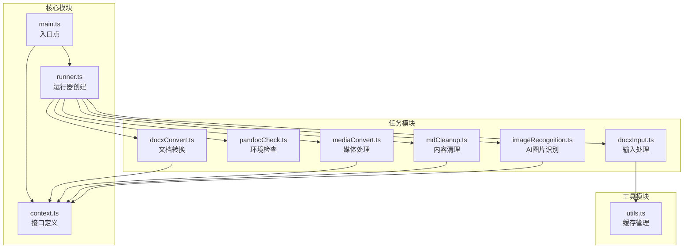
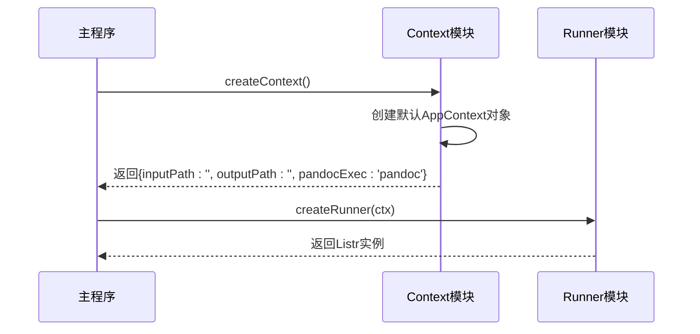
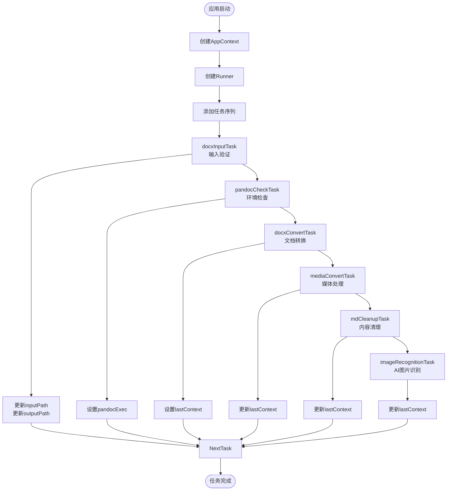
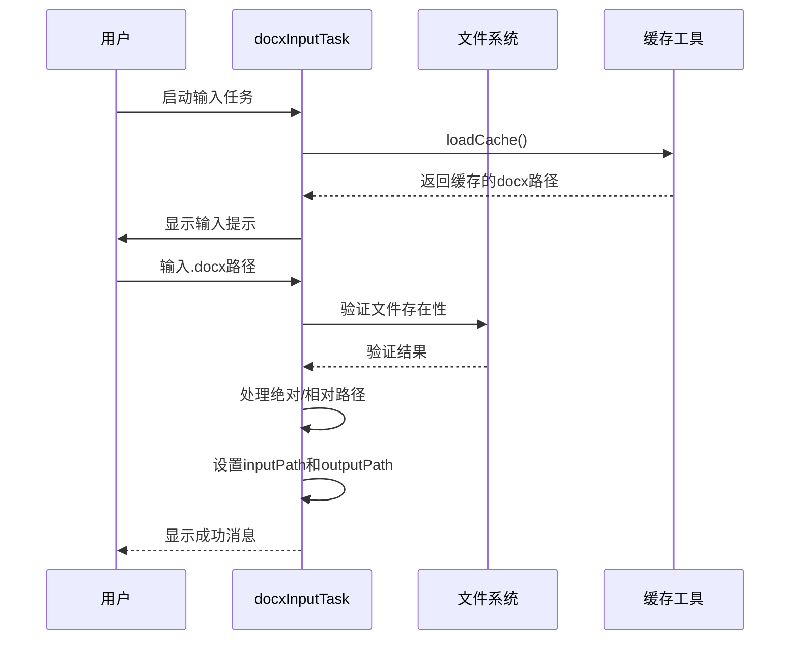
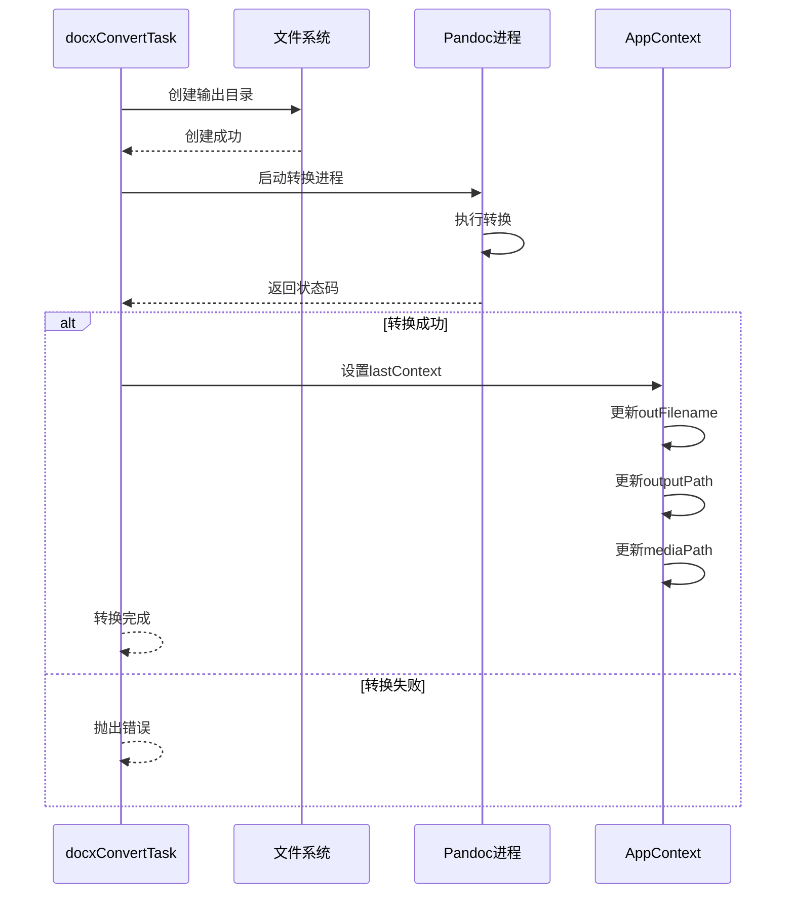
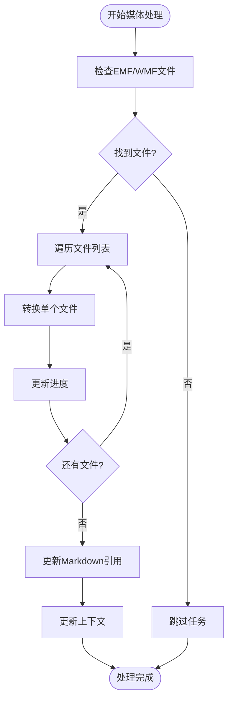
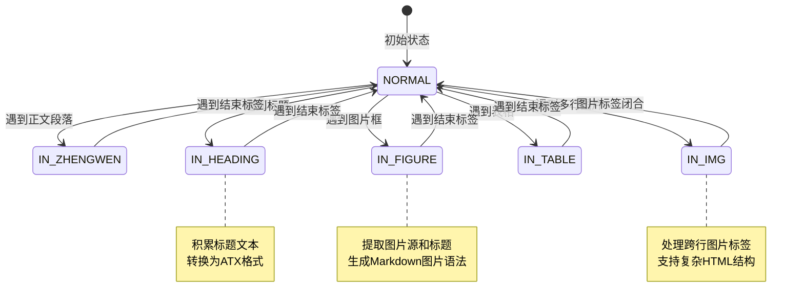
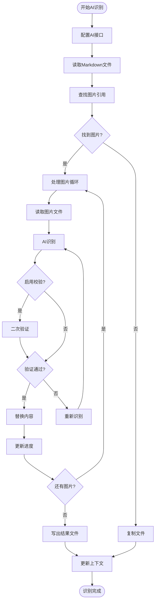

# 核心接口定义

<cite>
**本文档引用的文件**
- [context.ts](file://src/context.ts)
- [main.ts](file://src/main.ts)
- [runner.ts](file://src/runner.ts)
- [docxInput.ts](file://src/tasks/docxInput.ts)
- [docxConvert.ts](file://src/tasks/docxConvert.ts)
- [mediaConvert.ts](file://src/tasks/mediaConvert.ts)
- [mdCleanup.ts](file://src/tasks/mdCleanup.ts)
- [pandocCheck.ts](file://src/tasks/pandocCheck.ts)
- [imageRecognition.ts](file://src/tasks/imageRecognition.ts)
- [utils.ts](file://src/utils.ts)
- [package.json](file://package.json)
</cite>

## 更新摘要
**变更内容**
- 新增 AI 图片识别与替换任务，增强上下文管理能力
- 改进数据流和任务协调机制，支持更复杂的处理流程
- 扩展 OutputContext 接口以支持 AI 识别结果
- 增强上下文状态管理，支持多阶段数据传递

## 目录
1. [简介](#简介)
2. [项目结构](#项目结构)
3. [核心组件](#核心组件)
4. [架构概览](#架构概览)
5. [详细组件分析](#详细组件分析)
6. [依赖分析](#依赖分析)
7. [性能考虑](#性能考虑)
8. [故障排除指南](#故障排除指南)
9. [结论](#结论)

## 简介

本文档详细说明了 doc2xml-cli 项目中的核心接口定义，特别是 AppContext 和 OutputContext 接口的设计理念、属性定义、类型系统以及在实际工作流中的使用方式。该工具是一个交互式的 CLI 管道，用于将 .docx 文档转换为 Markdown 格式，同时处理媒体文件、清理生成的 Markdown 内容，并集成 AI 图片识别功能。

## 项目结构

该项目采用模块化设计，主要由以下核心部分组成：



**图表来源**
- [main.ts:1-10](file://src/main.ts#L1-L10)
- [context.ts:1-21](file://src/context.ts#L1-L21)
- [runner.ts:1-10](file://src/runner.ts#L1-L10)

**章节来源**
- [package.json:1-42](file://package.json#L1-L42)
- [main.ts:1-57](file://src/main.ts#L1-L57)

## 核心组件

### AppContext 接口

AppContext 是整个系统的核心上下文接口，定义了应用程序运行所需的所有状态信息。

#### 属性定义

| 属性名 | 类型 | 必填 | 默认值 | 描述 |
|--------|------|------|--------|------|
| inputPath | string | 是 | 空字符串 | 用户输入的 .docx 文件绝对路径 |
| outputPath | string | 是 | 空字符串 | 总输出目录，与输入在同一级目录下的out目录 |
| pandocExec | string | 是 | 'pandoc' | 解析后的 pandoc 可执行文件路径 |
| lastContext | OutputContext | 否 | undefined | 上一个任务的输出上下文 |

#### 初始化方法



**图表来源**
- [context.ts:18-20](file://src/context.ts#L18-L20)
- [runner.ts:4-9](file://src/runner.ts#L4-L9)

**章节来源**
- [context.ts:7-16](file://src/context.ts#L7-L16)
- [context.ts:18-20](file://src/context.ts#L18-L20)

### OutputContext 接口

OutputContext 接口定义了单个任务的输出状态，用于在任务间传递数据。

#### 属性定义

| 属性名 | 类型 | 必填 | 描述 |
|--------|------|------|------|
| outFilename | string | 是 | 输出文件名 |
| outputPath | string | 是 | 输出文件的完整路径 |
| mediaPath | string | 是 | 媒体文件目录路径 |

#### 使用场景

OutputContext 主要用于以下场景：
- 在文档转换任务完成后，记录转换结果的文件信息
- 在媒体处理任务中，传递处理后的媒体文件路径
- 在内容清理任务中，维护最终输出文件的状态
- 在 AI 图片识别任务中，传递识别结果和处理后的文件信息

**章节来源**
- [context.ts:1-5](file://src/context.ts#L1-L5)

## 架构概览

系统采用流水线架构，通过 Listr2 库实现任务编排。每个任务都可以访问和修改 AppContext 中的状态。新增的 AI 图片识别任务进一步增强了系统的智能化处理能力。



**图表来源**
- [main.ts:14-19](file://src/main.ts#L14-L19)
- [docxInput.ts:50-56](file://src/tasks/docxInput.ts#L50-L56)
- [pandocCheck.ts:15-26](file://src/tasks/pandocCheck.ts#L15-L26)
- [docxConvert.ts:67-74](file://src/tasks/docxConvert.ts#L67-L74)
- [mediaConvert.ts:122-126](file://src/tasks/mediaConvert.ts#L122-L126)
- [mdCleanup.ts:377-381](file://src/tasks/mdCleanup.ts#L377-L381)
- [imageRecognition.ts:606-610](file://src/tasks/imageRecognition.ts#L606-L610)

## 详细组件分析

### 输入处理任务 (docxInputTask)

输入处理任务负责获取用户输入的 .docx 文件路径，并设置基础的上下文信息。



**图表来源**
- [docxInput.ts:28-59](file://src/tasks/docxInput.ts#L28-L59)

**章节来源**
- [docxInput.ts:28-59](file://src/tasks/docxInput.ts#L28-L59)

### 文档转换任务 (docxConvertTask)

文档转换任务使用 pandoc 将 .docx 文件转换为 Markdown 格式。



**图表来源**
- [docxConvert.ts:13-82](file://src/tasks/docxConvert.ts#L13-L82)
- [docxConvert.ts:67-74](file://src/tasks/docxConvert.ts#L67-L74)

**章节来源**
- [docxConvert.ts:13-82](file://src/tasks/docxConvert.ts#L13-L82)

### 媒体处理任务 (mediaConvertTask)

媒体处理任务负责将 EMF/WMF 矢量图转换为 JPG 格式，并更新 Markdown 文件中的引用。



**图表来源**
- [mediaConvert.ts:56-135](file://src/tasks/mediaConvert.ts#L56-L135)

**章节来源**
- [mediaConvert.ts:56-135](file://src/tasks/mediaConvert.ts#L56-L135)

### 内容清理任务 (mdCleanupTask)

内容清理任务使用状态机算法清理 pandoc 生成的 Markdown 中的 HTML 标记。



**图表来源**
- [mdCleanup.ts:7-15](file://src/tasks/mdCleanup.ts#L7-L15)
- [mdCleanup.ts:78-328](file://src/tasks/mdCleanup.ts#L78-L328)

**章节来源**
- [mdCleanup.ts:7-15](file://src/tasks/mdCleanup.ts#L7-L15)
- [mdCleanup.ts:78-328](file://src/tasks/mdCleanup.ts#L78-L328)

### AI 图片识别任务 (imageRecognitionTask)

AI 图片识别任务使用 OpenAI Vision API 对图片进行智能识别，并将识别结果嵌入到 Markdown 中。



**图表来源**
- [imageRecognition.ts:371-610](file://src/tasks/imageRecognition.ts#L371-L610)

**章节来源**
- [imageRecognition.ts:371-610](file://src/tasks/imageRecognition.ts#L371-L610)

## 依赖分析

系统的关键依赖关系如下：

```mermaid
graph LR
subgraph "外部依赖"
LISTR[listr2<br/>任务编排]
INQUIRER[@inquirer/prompts<br/>交互式提示]
ADAPTER[@listr2/prompt-adapter-inquirer<br/>适配器]
AI[@ai-sdk/openai<br/>AI接口]
OPENAI[ai<br/>OpenAI SDK]
END
subgraph "内部模块"
CONTEXT[context.ts<br/>接口定义]
RUNNER[runner.ts<br/>运行器]
TASKS[tasks/*<br/>业务逻辑]
UTILS[utils.ts<br/>工具函数]
end
LISTR --> RUNNER
INQUIRER --> TASKS
ADAPTER --> TASKS
AI --> TASKS
OPENAI --> TASKS
RUNNER --> TASKS
TASKS --> CONTEXT
TASKS --> UTILS
CONTEXT -.-> TASKS
```

**图表来源**
- [package.json:21-27](file://package.json#L21-L27)
- [runner.ts:1-2](file://src/runner.ts#L1-L2)
- [imageRecognition.ts:6-11](file://src/tasks/imageRecognition.ts#L6-L11)

**章节来源**
- [package.json:21-27](file://package.json#L21-L27)

## 性能考虑

### 类型安全最佳实践

1. **可选属性处理**: 使用 `!` 操作符时要确保在访问前进行检查
2. **类型守卫**: 在访问 `lastContext` 之前进行类型检查
3. **接口约束**: 通过严格的接口定义防止意外的数据结构变化
4. **AI 识别结果验证**: 对 AI 返回的结果进行严格的数据验证

### 常见错误避免

1. **空值访问**: 始终检查 `ctx.lastContext` 是否存在
2. **路径处理**: 区分绝对路径和相对路径的处理逻辑
3. **异步操作**: 正确处理 Promise 的错误情况
4. **AI 识别失败**: 处理 AI 服务不可用或返回格式异常的情况
5. **文件权限**: 确保有足够的权限读取和写入文件

## 故障排除指南

### 常见问题及解决方案

| 问题类型 | 症状 | 解决方案 |
|----------|------|----------|
| Pandoc未安装 | 环境检查失败 | 安装pandoc并确保在PATH中 |
| 文件路径错误 | 输入验证失败 | 检查文件路径是否正确 |
| 权限不足 | 文件操作失败 | 检查目录权限设置 |
| 缓存损坏 | 输入缓存读取失败 | 删除缓存文件重新开始 |
| AI服务不可用 | 图片识别失败 | 检查AI接口地址和网络连接 |
| AI模型列表为空 | 无法获取可用模型 | 检查AI服务配置和模型加载状态 |
| MetafileConverter错误 | 矢量图转换失败 | 确认.NET运行时和转换器文件存在 |

**章节来源**
- [pandocCheck.ts:15-26](file://src/tasks/pandocCheck.ts#L15-L26)
- [docxInput.ts:14-26](file://src/tasks/docxInput.ts#L14-L26)
- [imageRecognition.ts:397-419](file://src/tasks/imageRecognition.ts#L397-L419)
- [mediaConvert.ts:31-54](file://src/tasks/mediaConvert.ts#L31-L54)

## 结论

AppContext 和 OutputContext 接口为整个 doc2xml-cli 工具提供了清晰的数据流架构。通过严格的类型定义和明确的职责分离，系统实现了高度的可维护性和扩展性。新增的 AI 图片识别功能进一步增强了系统的智能化处理能力，通过增强的上下文管理接口实现了多阶段的数据传递和处理协调。这些接口不仅定义了数据结构，更重要的是建立了任务间的协作机制，确保了整个转换流程的可靠性和一致性。