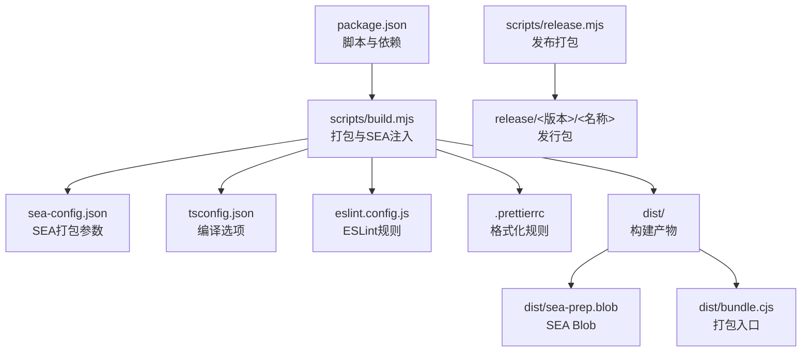
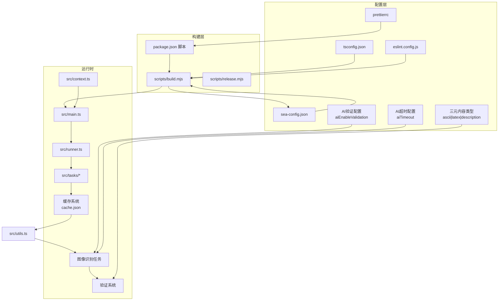
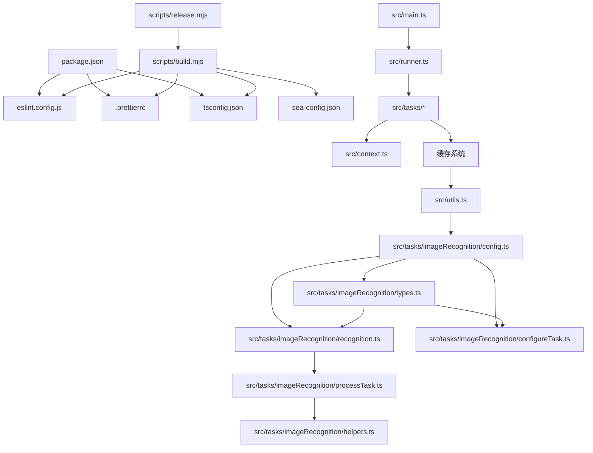

# 配置选项API

<cite>
**本文档引用的文件**
- [.prettierrc](file://.prettierrc)
- [eslint.config.js](file://eslint.config.js)
- [tsconfig.json](file://tsconfig.json)
- [sea-config.json](file://sea-config.json)
- [package.json](file://package.json)
- [scripts/build.mjs](file://scripts/build.mjs)
- [scripts/release.mjs](file://scripts/release.mjs)
- [src/context.ts](file://src/context.ts)
- [src/main.ts](file://src/main.ts)
- [src/runner.ts](file://src/runner.ts)
- [src/tasks/docxInput.ts](file://src/tasks/docxInput.ts)
- [src/tasks/imageRecognition/config.ts](file://src/tasks/imageRecognition/config.ts)
- [src/tasks/imageRecognition/configureTask.ts](file://src/tasks/imageRecognition/configureTask.ts)
- [src/tasks/imageRecognition/constants.ts](file://src/tasks/imageRecognition/constants.ts)
- [src/tasks/imageRecognition/helpers.ts](file://src/tasks/imageRecognition/helpers.ts)
- [src/tasks/imageRecognition/processTask.ts](file://src/tasks/imageRecognition/processTask.ts)
- [src/tasks/imageRecognition/recognition.ts](file://src/tasks/imageRecognition/recognition.ts)
- [src/tasks/imageRecognition/types.ts](file://src/tasks/imageRecognition/types.ts)
- [src/tasks/pandocCheck.ts](file://src/tasks/pandocCheck.ts)
- [src/utils.ts](file://src/utils.ts)
</cite>

## 更新摘要
**变更内容**
- 新增AI验证配置选项API章节，详细说明AI识别结果二次验证功能
- 更新缓存系统章节，包含新的AI验证配置项
- 增强图像识别任务章节，说明AI验证功能的实现细节
- 新增三元内容类型识别系统，支持ascii、latex、description三种类型
- 改进验证开关和超时设置，新增aiTimeout配置项
- 添加AI验证配置的优先级和覆盖规则说明

## 目录
1. [简介](#简介)
2. [项目结构](#项目结构)
3. [核心配置组件](#核心配置组件)
4. [架构总览](#架构总览)
5. [详细组件分析](#详细组件分析)
6. [依赖关系分析](#依赖关系分析)
7. [性能考量](#性能考量)
8. [故障排查指南](#故障排查指南)
9. [结论](#结论)
10. [附录](#附录)

## 简介
本文件为该仓库的配置系统完整API参考，涵盖以下配置域：
- TypeScript 编译配置（tsconfig.json）
- ESLint 规则配置（eslint.config.js）
- Prettier 格式化配置（.prettierrc）
- SEA 打包配置（sea-config.json）
- 构建与发布脚本（scripts/build.mjs、scripts/release.mjs）
- 包管理与脚本（package.json）
- **新增** AI验证配置选项API（图像识别任务中的二次验证功能）
- **新增** 三元内容类型识别系统（支持ascii、latex、description三种类型）

文档重点说明各配置项的含义、默认值、优先级与覆盖规则，并给出开发与生产环境的差异建议、配置验证方法、常见问题诊断与最佳实践。

## 项目结构
该仓库采用"配置即代码"的组织方式，配置文件与构建脚本集中于根目录，源码位于 src，构建产物输出至 dist，发布产物位于 release。

**图表来源**
- [package.json:1-42](file://package.json#L1-L42)
- [scripts/build.mjs:1-53](file://scripts/build.mjs#L1-L53)
- [sea-config.json:1-6](file://sea-config.json#L1-L6)
- [tsconfig.json:1-19](file://tsconfig.json#L1-L19)
- [eslint.config.js:1-26](file://eslint.config.js#L1-L26)
- [.prettierrc:1-8](file://.prettierrc#L1-L8)

**章节来源**
- [package.json:1-42](file://package.json#L1-L42)
- [scripts/build.mjs:1-53](file://scripts/build.mjs#L1-L53)
- [scripts/release.mjs:1-42](file://scripts/release.mjs#L1-L42)

## 核心配置组件
本节对每个配置文件进行逐项解读，说明其作用、关键字段、默认行为与可选覆盖项。

- TypeScript 编译配置（tsconfig.json）
  - 目标与模块系统：目标语言版本、模块与解析策略、输出目录、根目录等
  - 严格性与映射：严格模式、ES模块互操作、跳过库检查、大小写一致性、声明与SourceMap生成
  - 包含与排除：仅包含 src 下的类型安全文件，排除 node_modules 与 dist
  - 默认值与覆盖：可通过命令行或IDE设置覆盖部分编译选项；严格模式与映射建议保持默认以提升质量
  - 关键字段路径：[tsconfig.json:1-19](file://tsconfig.json#L1-L19)

- ESLint 配置（eslint.config.js）
  - 解析器与插件：TypeScript 解析器与 ESLint 插件，基于 tsconfig.json 进行语言选项
  - 规则集：继承推荐规则，自定义未使用变量、显式返回类型、any 类型、分号风格等
  - 文件匹配：仅对 src 下的 TypeScript 文件生效
  - 默认值与覆盖：可通过本地 .eslintrc 或 IDE 设置覆盖单条规则；建议在团队内统一规则
  - 关键字段路径：[eslint.config.js:1-26](file://eslint.config.js#L1-L26)

- Prettier 配置（.prettierrc）
  - 字符串引号：单引号
  - 分号：禁用分号
  - 行宽：100字符
  - 制表符宽度：2空格
  - 尾随逗号：按 ES5 规范
  - 默认值与覆盖：可通过 .prettierrc.toml、.prettierrc.yaml 或 Prettier 配置文件覆盖；建议与团队统一
  - 关键字段路径：[.prettierrc:1-8](file://.prettierrc#L1-L8)

- SEA 打包配置（sea-config.json）
  - 主入口：dist/bundle.cjs
  - 输出：dist/sea-prep.blob
  - 实验性警告：禁用 SEA 实验性警告
  - 默认值与覆盖：可通过命令行参数或环境变量覆盖；建议保持默认以避免兼容性问题
  - 关键字段路径：[sea-config.json:1-6](file://sea-config.json#L1-L6)

- 构建与发布脚本（scripts/build.mjs、scripts/release.mjs）
  - 构建步骤：esbuild 打包、生成 SEA Blob、复制 Node 可执行文件、注入 Blob、复制 .NET 模块
  - 发布步骤：校验产物、清理/重建解包目录、拷贝产物、压缩为 ZIP
  - 默认值与覆盖：可通过命令行参数或环境变量覆盖；建议在 CI 中固定版本
  - 关键字段路径：
    - [scripts/build.mjs:1-53](file://scripts/build.mjs#L1-L53)
    - [scripts/release.mjs:1-42](file://scripts/release.mjs#L1-L42)

- **新增** AI验证配置选项API（src/tasks/imageRecognition/config.ts）
  - AI配置接口：AiConfig - 包含baseURL、apiKey、model、enableValidation、timeout五个核心配置项
  - 默认值：baseURL为空字符串、apiKey为空字符串、model为空字符串、enableValidation为false、timeout为0
  - 配置项说明：
    - baseURL：AI视觉识别接口地址
    - apiKey：API密钥（可选）
    - model：视觉识别模型名称
    - enableValidation：是否启用识别结果校验（默认false）
    - timeout：模型识别超时时间（秒，0表示无限制）
  - 关键字段路径：[src/tasks/imageRecognition/config.ts:1-16](file://src/tasks/imageRecognition/config.ts#L1-L16)

- **新增** 三元内容类型识别系统（src/tasks/imageRecognition/types.ts）
  - 内容类型枚举：ContentType = 'ascii' | 'latex' | 'description'
  - 识别结果接口：RecognitionResult - 包含contentType和content两个字段
  - 验证结果接口：ValidationResult - 包含isCorrect和reason两个字段
  - 关键字段路径：[src/tasks/imageRecognition/types.ts:1-31](file://src/tasks/imageRecognition/types.ts#L1-L31)

**章节来源**
- [tsconfig.json:1-19](file://tsconfig.json#L1-L19)
- [eslint.config.js:1-26](file://eslint.config.js#L1-L26)
- [.prettierrc:1-8](file://.prettierrc#L1-L8)
- [sea-config.json:1-6](file://sea-config.json#L1-L6)
- [scripts/build.mjs:1-53](file://scripts/build.mjs#L1-L53)
- [scripts/release.mjs:1-42](file://scripts/release.mjs#L1-L42)
- [src/tasks/imageRecognition/config.ts:1-16](file://src/tasks/imageRecognition/config.ts#L1-L16)
- [src/tasks/imageRecognition/types.ts:1-31](file://src/tasks/imageRecognition/types.ts#L1-L31)

## 架构总览
下图展示配置系统在构建与运行时的交互关系，以及配置项的优先级与覆盖顺序。

**图表来源**
- [tsconfig.json:1-19](file://tsconfig.json#L1-L19)
- [eslint.config.js:1-26](file://eslint.config.js#L1-L26)
- [.prettierrc:1-8](file://.prettierrc#L1-L8)
- [sea-config.json:1-6](file://sea-config.json#L1-L6)
- [package.json:1-42](file://package.json#L1-L42)
- [scripts/build.mjs:1-53](file://scripts/build.mjs#L1-L53)
- [scripts/release.mjs:1-42](file://scripts/release.mjs#L1-L42)
- [src/main.ts:1-41](file://src/main.ts#L1-L41)
- [src/context.ts:1-21](file://src/context.ts#L1-L21)
- [src/runner.ts:1-10](file://src/runner.ts#L1-L10)
- [src/utils.ts:20-26](file://src/utils.ts#L20-L26)
- [src/tasks/imageRecognition/config.ts:1-16](file://src/tasks/imageRecognition/config.ts#L1-L16)
- [src/tasks/imageRecognition/types.ts:1-31](file://src/tasks/imageRecognition/types.ts#L1-L31)

## 详细组件分析

### TypeScript 配置（tsconfig.json）
- 作用与范围
  - 定义编译目标、模块系统、解析策略、输出与根目录
  - 控制严格性、映射与声明文件生成
  - 指定包含与排除路径，确保类型检查聚焦于业务代码
- 关键字段与默认值
  - 目标语言版本：ES2022
  - 模块与解析：NodeNext
  - 输出目录：dist
  - 根目录：src
  - 严格模式：开启
  - ES 模块互操作：开启
  - 跳过库检查：开启
  - 强制文件名大小写一致：开启
  - 声明文件与映射：启用
- 优先级与覆盖
  - 命令行参数可覆盖部分编译选项
  - IDE/编辑器可覆盖严格性与映射设置
  - 团队内建议统一配置，避免 CI 与本地差异
- 使用建议
  - 保持严格模式与映射启用，提升类型安全
  - 在 CI 中固定 TypeScript 版本，避免升级导致的类型差异

**章节来源**
- [tsconfig.json:1-19](file://tsconfig.json#L1-L19)

### ESLint 配置（eslint.config.js）
- 作用与范围
  - 通过 TypeScript 解析器与插件实现语法与类型规则检查
  - 继承推荐规则并定制团队规范
  - 仅对 src 下的 TypeScript 文件生效
- 关键字段与默认值
  - 解析器：@typescript-eslint/parser
  - 插件：@typescript-eslint/eslint-plugin
  - 规则集：继承推荐规则
  - 自定义规则：
    - 未使用变量：忽略以下划线开头的参数
    - 显式函数返回类型：警告
    - 禁止显式 any：错误
    - 分号：禁用分号
- 优先级与覆盖
  - 本地 .eslintrc 或 IDE 设置可覆盖单条规则
  - 团队内建议统一规则，避免冲突
- 使用建议
  - 在 CI 中强制执行 ESLint，确保代码风格一致
  - 结合 Prettier，避免格式化冲突

**章节来源**
- [eslint.config.js:1-26](file://eslint.config.js#L1-L26)

### Prettier 配置（.prettierrc）
- 作用与范围
  - 统一代码格式，减少团队分歧
  - 与 ESLint 协作，避免格式化冲突
- 关键字段与默认值
  - 单引号：true
  - 分号：false
  - 行宽：100
  - 制表符宽度：2
  - 尾随逗号：es5
- 优先级与覆盖
  - 可通过 .prettierrc.toml、.prettierrc.yaml 或 Prettier 配置文件覆盖
  - 团队内建议统一配置，避免 CI 与本地差异
- 使用建议
  - 在提交前自动格式化，结合 pre-commit 钩子
  - 与 ESLint 的分号规则保持一致

**章节来源**
- [.prettierrc:1-8](file://.prettierrc#L1-L8)

### SEA 打包配置（sea-config.json）
- 作用与范围
  - 定义 SEA 打包的主入口、输出与实验性警告
  - 用于将 Node.js 可执行文件与打包 Blob 合并
- 关键字段与默认值
  - 主入口：dist/bundle.cjs
  - 输出：dist/sea-prep.blob
  - 实验性警告：禁用
- 优先级与覆盖
  - 可通过命令行参数或环境变量覆盖
  - 建议保持默认以避免兼容性问题
- 使用建议
  - 在 CI 中固定 Node 版本与 SEA 工具链版本
  - 发布前验证 SEA Blob 注入成功

**章节来源**
- [sea-config.json:1-6](file://sea-config.json#L1-L6)

### 构建与发布脚本（scripts/build.mjs、scripts/release.mjs）
- 作用与范围
  - 构建：esbuild 打包、生成 SEA Blob、复制 Node 可执行文件、注入 Blob、复制 .NET 模块
  - 发布：校验产物、清理/重建解包目录、拷贝产物、压缩为 ZIP
- 关键字段与默认值
  - 构建：输出 dist/bundle.cjs 与 dist/sea-prep.blob
  - 发布：产物目录 release/<版本>/<名称>
- 优先级与覆盖
  - 可通过命令行参数或环境变量覆盖
  - 建议在 CI 中固定版本与缓存策略
- 使用建议
  - 在 CI 中分阶段执行构建与发布，确保产物完整性
  - 发布前进行完整性校验

**章节来源**
- [scripts/build.mjs:1-53](file://scripts/build.mjs#L1-L53)
- [scripts/release.mjs:1-42](file://scripts/release.mjs#L1-L42)

### 运行时配置与上下文（src/context.ts、src/main.ts、src/runner.ts）
- 作用与范围
  - 定义应用上下文与运行器，承载输入路径、输出路径、pandoc 可执行文件等运行时配置
  - 通过任务管线串联各处理步骤
- 关键字段与默认值
  - AppContext：inputPath、outputPath、pandocExec（默认 pandoc）
  - OutputContext：outFilename、outputPath、mediaPath
- 优先级与覆盖
  - 运行时由任务动态设置，优先级高于默认值
  - 建议在任务中明确设置并传递上下文
- 使用建议
  - 在任务间共享上下文，避免重复计算
  - 对外部工具路径进行校验与容错

**章节来源**
- [src/context.ts:1-21](file://src/context.ts#L1-L21)
- [src/main.ts:1-41](file://src/main.ts#L1-L41)
- [src/runner.ts:1-10](file://src/runner.ts#L1-L10)

### 任务与配置交互（src/tasks/docxInput.ts、src/tasks/pandocCheck.ts）
- 作用与范围
  - 输入验证与缓存：读取用户输入并持久化缓存，便于后续任务复用
  - 环境检测：检测 pandoc 是否可用，决定可执行文件路径
- 关键字段与默认值
  - 缓存文件：~/.doc2md-cli/cache.json
  - 默认 pandoc 可执行文件：pandoc
- 优先级与覆盖
  - 任务会覆盖上下文中的路径与工具路径
  - 建议在任务失败时提供清晰的错误信息
- 使用建议
  - 对用户输入进行严格校验，避免无效路径
  - 对外部工具进行降级处理与提示

**章节来源**
- [src/tasks/docxInput.ts:1-52](file://src/tasks/docxInput.ts#L1-L52)
- [src/tasks/pandocCheck.ts:1-24](file://src/tasks/pandocCheck.ts#L1-L24)

### **新增** AI验证配置选项API（src/tasks/imageRecognition/config.ts）
- 作用与范围
  - 提供AI识别结果的二次验证功能，通过配置系统启用或禁用
  - 支持用户交互式配置，包括AI接口地址、API Key、模型选择和验证开关
  - 集成到缓存系统，支持持久化配置
- 关键字段与默认值
  - AiConfig接口：包含baseURL、apiKey、model、enableValidation、timeout五个核心配置项
  - 默认值：baseURL为空字符串、apiKey为空字符串、model为空字符串、enableValidation为false、timeout为0
  - 验证流程：当enableValidation为true时，识别结果会经过严格验证，不通过则重新识别
  - 最大重试次数：3次
  - 超时设置：timeout字段控制每次AI调用的超时时间（秒）
- 优先级与覆盖
  - 用户交互配置优先级最高，会覆盖缓存中的默认值
  - 缓存系统会持久化用户的配置选择
  - 默认值：false（为了性能考虑，默认禁用验证）
- 使用建议
  - 对于高精度要求的场景，建议启用AI验证功能
  - 验证功能会增加处理时间和AI调用成本
  - 建议在CI环境中根据需求调整验证开关
  - 设置合理的超时时间以避免长时间阻塞

**章节来源**
- [src/tasks/imageRecognition/config.ts:1-16](file://src/tasks/imageRecognition/config.ts#L1-L16)

### **新增** 三元内容类型识别系统（src/tasks/imageRecognition/types.ts）
- 作用与范围
  - 定义三种内容类型的识别标准和处理逻辑
  - 支持ascii（简单字符）、latex（数学公式）、description（复杂描述）三种类型
  - 为AI验证提供明确的内容类型判断依据
- 关键字段与默认值
  - ContentType枚举：'ascii' | 'latex' | 'description'
  - RecognitionResult接口：contentType（内容类型）+ content（内容文本）
  - ValidationResult接口：isCorrect（验证结果）+ reason（验证原因）
- 优先级与覆盖
  - 内容类型在识别过程中自动确定，无需用户配置
  - 验证规则针对不同内容类型有不同的判断标准
- 使用建议
  - ascii类型适用于简单字符和符号，如字母、数字、基本运算符
  - latex类型适用于数学公式和表达式，需要正确的LaTeX语法
  - description类型适用于复杂图表、流程图、说明文字等非公式内容

**章节来源**
- [src/tasks/imageRecognition/types.ts:1-31](file://src/tasks/imageRecognition/types.ts#L1-L31)

### **新增** AI验证配置与缓存集成（src/utils.ts）
- 作用与范围
  - 提供用户配置的持久化存储，支持多任务间的配置共享
  - 集成AI配置项，包括AI接口地址、API Key、模型和验证开关
  - 支持aiEnableValidation和aiTimeout等新配置项
- 关键字段与默认值
  - InputCache接口：包含所有AI相关配置项
  - 缓存文件位置：~/.doc2md-cli/cache.json
  - 默认值：空对象，所有AI配置项都可选
- 优先级与覆盖
  - 用户交互配置会覆盖缓存中的默认值
  - 缓存系统会自动合并现有配置与新配置
  - 配置项支持部分更新，不会影响其他配置
- 使用建议
  - 缓存系统会自动处理配置的读取和写入
  - 建议定期备份缓存文件以防数据丢失
  - 缓存写入失败会被静默忽略，不影响主流程

**章节来源**
- [src/utils.ts:20-26](file://src/utils.ts#L20-L26)
- [src/utils.ts:32-53](file://src/utils.ts#L32-L53)

### **新增** AI验证流程与超时控制（src/tasks/imageRecognition/recognition.ts）
- 作用与范围
  - 实现带超时控制的AI识别功能
  - 支持识别结果的二次验证和自动重试
  - 提供TimeoutError异常处理机制
- 关键字段与默认值
  - withTimeout函数：通用超时控制包装器
  - TimeoutError类：自定义超时异常类型
  - 最大重试次数：3次
  - 超时时间：从aiConfig.timeout获取（秒转换为毫秒）
- 优先级与覆盖
  - 超时设置来自aiConfig.timeout配置
  - 验证流程根据enableValidation配置动态启用
  - 重试机制在验证失败时自动触发
- 使用建议
  - 设置合理的超时时间避免长时间阻塞
  - 在网络不稳定环境下适当增加重试次数
  - 监控超时错误以优化AI服务性能

**章节来源**
- [src/tasks/imageRecognition/recognition.ts:1-267](file://src/tasks/imageRecognition/recognition.ts#L1-L267)

### **新增** AI配置交互与用户界面（src/tasks/imageRecognition/configureTask.ts）
- 作用与范围
  - 提供完整的AI配置交互界面
  - 支持模型列表获取、验证开关设置、超时时间配置
  - 集成缓存系统实现配置持久化
- 关键字段与默认值
  - 模型列表获取：自动从AI接口获取可用模型
  - 验证开关：用户可选择是否启用识别结果校验
  - 超时时间：用户可设置识别超时时间（秒）
  - 缓存持久化：配置完成后自动保存到cache.json
- 优先级与覆盖
  - 用户输入优先级最高，覆盖缓存中的默认值
  - 缓存系统提供默认值回退机制
  - 配置验证确保输入的有效性
- 使用建议
  - 确保AI接口地址和模型名称的正确性
  - 合理设置超时时间以平衡性能和准确性
  - 在配置过程中提供清晰的反馈信息

**章节来源**
- [src/tasks/imageRecognition/configureTask.ts:1-126](file://src/tasks/imageRecognition/configureTask.ts#L1-L126)

## 依赖关系分析
下图展示配置文件之间的依赖关系与相互影响。

**图表来源**
- [package.json:1-42](file://package.json#L1-L42)
- [eslint.config.js:1-26](file://eslint.config.js#L1-L26)
- [.prettierrc:1-8](file://.prettierrc#L1-L8)
- [tsconfig.json:1-19](file://tsconfig.json#L1-L19)
- [scripts/build.mjs:1-53](file://scripts/build.mjs#L1-L53)
- [scripts/release.mjs:1-42](file://scripts/release.mjs#L1-L42)
- [src/main.ts:1-41](file://src/main.ts#L1-L41)
- [src/runner.ts:1-10](file://src/runner.ts#L1-L10)
- [src/utils.ts:20-26](file://src/utils.ts#L20-L26)
- [src/tasks/imageRecognition/config.ts:1-16](file://src/tasks/imageRecognition/config.ts#L1-L16)
- [src/tasks/imageRecognition/types.ts:1-31](file://src/tasks/imageRecognition/types.ts#L1-L31)
- [src/tasks/imageRecognition/recognition.ts:1-267](file://src/tasks/imageRecognition/recognition.ts#L1-L267)
- [src/tasks/imageRecognition/configureTask.ts:1-126](file://src/tasks/imageRecognition/configureTask.ts#L1-L126)
- [src/tasks/imageRecognition/processTask.ts:1-298](file://src/tasks/imageRecognition/processTask.ts#L1-L298)
- [src/tasks/imageRecognition/helpers.ts:1-119](file://src/tasks/imageRecognition/helpers.ts#L1-L119)

## 性能考量
- 构建性能
  - esbuild 打包：启用最小化与并发构建，缩短构建时间
  - SEA Blob 注入：一次性注入，避免重复构建
- 运行性能
  - 严格模式与映射：提升类型安全，减少运行时错误
  - 缓存机制：持久化用户输入，减少重复输入与IO
  - **新增** AI验证性能：启用验证会增加处理时间和AI调用成本，建议根据需求权衡
  - **新增** 超时控制：合理的超时设置可以避免长时间阻塞，提高系统响应性
- CI/CD 建议
  - 固定 Node 与工具链版本，避免性能波动
  - 合理利用缓存与并行任务，缩短流水线时间
  - **新增** AI验证测试：在CI中可选择性启用验证功能进行质量保证
  - **新增** 超时监控：监控AI调用超时情况，优化配置参数

## 故障排查指南
- TypeScript 编译错误
  - 症状：类型检查失败或编译报错
  - 排查：检查 tsconfig.json 的严格模式与映射设置；确认 IDE 与 CI 使用相同版本
  - 参考路径：[tsconfig.json:1-19](file://tsconfig.json#L1-L19)
- ESLint 规则冲突
  - 症状：格式化与规则冲突
  - 排查：统一 Prettier 与 ESLint 的分号规则；在 IDE 中启用保存时自动修复
  - 参考路径：[eslint.config.js:1-26](file://eslint.config.js#L1-L26)，[.prettierrc:1-8](file://.prettierrc#L1-L8)
- Prettier 格式化异常
  - 症状：格式化结果与预期不符
  - 排查：检查 .prettierrc 配置；确认编辑器插件正确加载
  - 参考路径：[.prettierrc:1-8](file://.prettierrc#L1-L8)
- SEA 打包失败
  - 症状：生成 SEA Blob 失败或运行时报错
  - 排查：确认 sea-config.json 的主入口与输出路径；检查 Node 版本与 SEA 工具链版本
  - 参考路径：[sea-config.json:1-6](file://sea-config.json#L1-L6)，[scripts/build.mjs:1-53](file://scripts/build.mjs#L1-L53)
- 构建产物缺失
  - 症状：发布脚本报错缺少产物
  - 排查：先执行构建脚本，再执行发布脚本；检查 dist 与 release 目录权限
  - 参考路径：[scripts/release.mjs:1-42](file://scripts/release.mjs#L1-L42)
- 运行时错误
  - 症状：pandoc 未找到或路径错误
  - 排查：在任务中检测 pandoc 并提供清晰错误信息；必要时降级处理
  - 参考路径：[src/tasks/pandocCheck.ts:1-24](file://src/tasks/pandocCheck.ts#L1-L24)
- **新增** AI验证功能问题
  - 症状：AI识别结果质量不稳定或处理时间过长
  - 排查：检查 aiEnableValidation 配置；确认AI服务可用性；调整最大重试次数
  - 参考路径：[src/tasks/imageRecognition/config.ts:1-16](file://src/tasks/imageRecognition/config.ts#L1-L16)，[src/tasks/imageRecognition/recognition.ts:1-267](file://src/tasks/imageRecognition/recognition.ts#L1-L267)
- **新增** 缓存配置问题
  - 症状：配置无法持久化或丢失
  - 排查：检查 ~/.doc2md-cli/cache.json 权限；确认缓存文件格式正确
  - 参考路径：[src/utils.ts:32-53](file://src/utils.ts#L32-L53)
- **新增** 三元内容类型识别问题
  - 症状：识别结果不符合预期的内容类型
  - 排查：检查AI模型的识别能力；确认输入图片的质量；查看验证提示词配置
  - 参考路径：[src/tasks/imageRecognition/types.ts:1-31](file://src/tasks/imageRecognition/types.ts#L1-L31)，[src/tasks/imageRecognition/constants.ts:1-66](file://src/tasks/imageRecognition/constants.ts#L1-L66)
- **新增** 超时设置问题
  - 症状：AI调用频繁超时或响应过慢
  - 排查：检查aiTimeout配置；确认网络连接稳定性；监控AI服务性能
  - 参考路径：[src/tasks/imageRecognition/config.ts:1-16](file://src/tasks/imageRecognition/config.ts#L1-L16)，[src/tasks/imageRecognition/recognition.ts:1-267](file://src/tasks/imageRecognition/recognition.ts#L1-L267)

## 结论
本配置系统通过 tsconfig.json、eslint.config.js、.prettierrc、sea-config.json 与构建/发布脚本形成完整的工程化闭环。**新增的AI验证配置选项API**和**三元内容类型识别系统**进一步增强了应用的功能性和可靠性，通过配置系统实现了灵活的AI识别结果验证控制和精确的内容类型分类。**新增的超时控制机制**确保了系统的稳定性和响应性。建议团队统一配置、在 CI 中固定版本、在任务中做好运行时校验与容错，以确保开发与发布的稳定性与一致性。

## 附录
- 开发环境与生产环境差异建议
  - 开发环境：启用严格模式与映射，便于早期发现问题；使用本地工具链
  - 生产环境：固定 Node 与工具链版本，启用最小化与 SEA 打包，确保产物体积与运行效率
  - **新增** AI验证环境：开发环境可启用验证功能进行质量保证，生产环境可根据性能需求调整
  - **新增** 超时配置：开发环境可设置较短的超时时间以便快速反馈，生产环境应设置更合理的超时值
- 配置验证清单
  - TypeScript：编译通过且无严重类型错误
  - ESLint：无新增规则冲突，CI 通过
  - Prettier：格式化一致，IDE 自动修复
  - SEA：Blob 注入成功，可执行文件可运行
  - 构建：dist 产物完整，权限正确
  - 发布：release 目录存在，ZIP 可解压
  - **新增** AI验证：验证功能正常工作，配置持久化成功
  - **新增** 缓存系统：缓存文件读写正常，配置项完整
  - **新增** 三元内容类型：内容类型识别准确，验证规则有效
  - **新增** 超时控制：超时设置合理，系统响应稳定