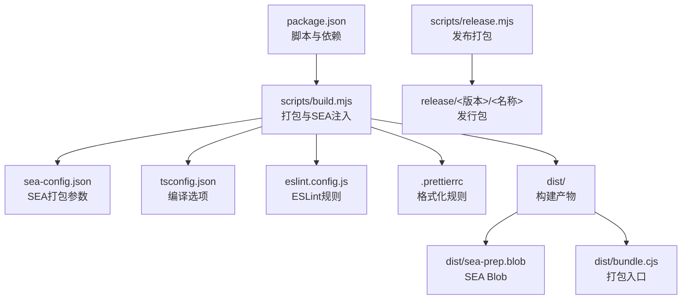
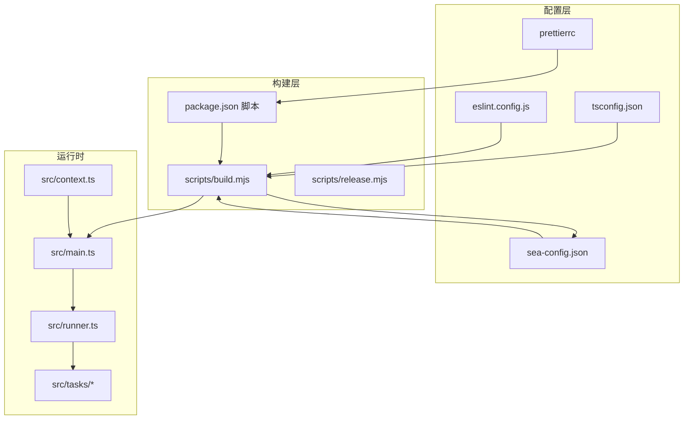
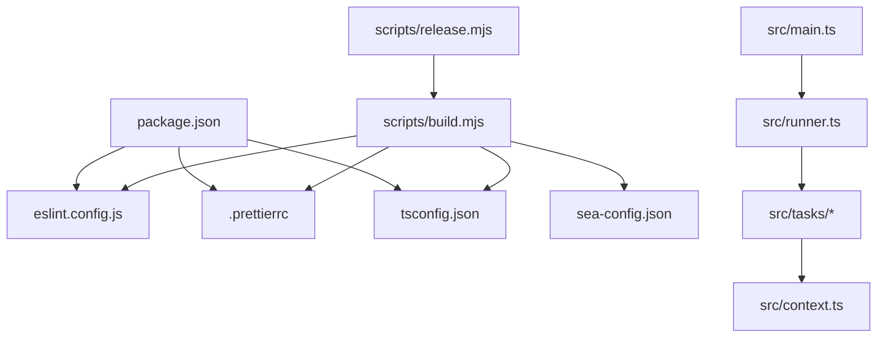

# 配置选项API

<cite>
**本文档引用的文件**
- [.prettierrc](file://.prettierrc)
- [eslint.config.js](file://eslint.config.js)
- [tsconfig.json](file://tsconfig.json)
- [sea-config.json](file://sea-config.json)
- [package.json](file://package.json)
- [scripts/build.mjs](file://scripts/build.mjs)
- [scripts/release.mjs](file://scripts/release.mjs)
- [src/context.ts](file://src/context.ts)
- [src/main.ts](file://src/main.ts)
- [src/runner.ts](file://src/runner.ts)
- [src/tasks/docxInput.ts](file://src/tasks/docxInput.ts)
- [src/tasks/pandocCheck.ts](file://src/tasks/pandocCheck.ts)
- [src/utils.ts](file://src/utils.ts)
</cite>

## 目录
1. [简介](#简介)
2. [项目结构](#项目结构)
3. [核心配置组件](#核心配置组件)
4. [架构总览](#架构总览)
5. [详细组件分析](#详细组件分析)
6. [依赖关系分析](#依赖关系分析)
7. [性能考量](#性能考量)
8. [故障排查指南](#故障排查指南)
9. [结论](#结论)
10. [附录](#附录)

## 简介
本文件为该仓库的配置系统完整API参考，涵盖以下配置域：
- TypeScript 编译配置（tsconfig.json）
- ESLint 规则配置（eslint.config.js）
- Prettier 格式化配置（.prettierrc）
- SEA 打包配置（sea-config.json）
- 构建与发布脚本（scripts/build.mjs、scripts/release.mjs）
- 包管理与脚本（package.json）

文档重点说明各配置项的含义、默认值、优先级与覆盖规则，并给出开发与生产环境的差异建议、配置验证方法、常见问题诊断与最佳实践。

## 项目结构
该仓库采用“配置即代码”的组织方式，配置文件与构建脚本集中于根目录，源码位于 src，构建产物输出至 dist，发布产物位于 release。

图表来源
- [package.json:1-40](file://package.json#L1-L40)
- [scripts/build.mjs:1-53](file://scripts/build.mjs#L1-L53)
- [sea-config.json:1-6](file://sea-config.json#L1-L6)
- [tsconfig.json:1-19](file://tsconfig.json#L1-L19)
- [eslint.config.js:1-26](file://eslint.config.js#L1-L26)
- [.prettierrc:1-8](file://.prettierrc#L1-L8)

章节来源
- [package.json:1-40](file://package.json#L1-L40)
- [scripts/build.mjs:1-53](file://scripts/build.mjs#L1-L53)
- [scripts/release.mjs:1-42](file://scripts/release.mjs#L1-L42)

## 核心配置组件
本节对每个配置文件进行逐项解读，说明其作用、关键字段、默认行为与可选覆盖项。

- TypeScript 编译配置（tsconfig.json）
  - 目标与模块系统：目标语言版本、模块与解析策略、输出目录、根目录等
  - 严格性与映射：严格模式、ES模块互操作、跳过库检查、大小写一致性、声明与SourceMap生成
  - 包含与排除：仅包含 src 下的类型安全文件，排除 node_modules 与 dist
  - 默认值与覆盖：可通过命令行或IDE设置覆盖部分编译选项；严格模式与映射建议保持默认以提升质量
  - 关键字段路径：[tsconfig.json:1-19](file://tsconfig.json#L1-L19)

- ESLint 配置（eslint.config.js）
  - 解析器与插件：TypeScript 解析器与 ESLint 插件，基于 tsconfig.json 进行语言选项
  - 规则集：继承推荐规则，自定义未使用变量、显式返回类型、any 类型、分号风格等
  - 文件匹配：仅对 src 下的 TypeScript 文件生效
  - 默认值与覆盖：可通过本地 .eslintrc 或 IDE 设置覆盖单条规则；建议在团队内统一规则
  - 关键字段路径：[eslint.config.js:1-26](file://eslint.config.js#L1-L26)

- Prettier 配置（.prettierrc）
  - 字符串引号：单引号
  - 分号：禁用分号
  - 行宽：100字符
  - 制表符宽度：2空格
  - 尾随逗号：按 ES5 规范
  - 默认值与覆盖：可通过 .prettierrc.toml、.prettierrc.yaml 或 Prettier 配置文件覆盖；建议与团队统一
  - 关键字段路径：[.prettierrc:1-8](file://.prettierrc#L1-L8)

- SEA 打包配置（sea-config.json）
  - 主入口：dist/bundle.cjs
  - 输出：dist/sea-prep.blob
  - 实验性警告：禁用 SEA 实验性警告
  - 默认值与覆盖：可通过命令行参数或环境变量覆盖；建议保持默认以避免兼容性问题
  - 关键字段路径：[sea-config.json:1-6](file://sea-config.json#L1-L6)

- 构建与发布脚本（scripts/build.mjs、scripts/release.mjs）
  - 构建步骤：esbuild 打包、生成 SEA Blob、复制 Node 可执行文件、注入 Blob、复制 .NET 模块
  - 发布步骤：校验产物、清理/重建解包目录、拷贝产物、压缩为 ZIP
  - 默认值与覆盖：可通过命令行参数或环境变量覆盖；建议在 CI 中固定版本
  - 关键字段路径：
    - [scripts/build.mjs:1-53](file://scripts/build.mjs#L1-L53)
    - [scripts/release.mjs:1-42](file://scripts/release.mjs#L1-L42)

章节来源
- [tsconfig.json:1-19](file://tsconfig.json#L1-L19)
- [eslint.config.js:1-26](file://eslint.config.js#L1-L26)
- [.prettierrc:1-8](file://.prettierrc#L1-L8)
- [sea-config.json:1-6](file://sea-config.json#L1-L6)
- [scripts/build.mjs:1-53](file://scripts/build.mjs#L1-L53)
- [scripts/release.mjs:1-42](file://scripts/release.mjs#L1-L42)

## 架构总览
下图展示配置系统在构建与运行时的交互关系，以及配置项的优先级与覆盖顺序。

图表来源
- [tsconfig.json:1-19](file://tsconfig.json#L1-L19)
- [eslint.config.js:1-26](file://eslint.config.js#L1-L26)
- [.prettierrc:1-8](file://.prettierrc#L1-L8)
- [sea-config.json:1-6](file://sea-config.json#L1-L6)
- [package.json:1-40](file://package.json#L1-L40)
- [scripts/build.mjs:1-53](file://scripts/build.mjs#L1-L53)
- [scripts/release.mjs:1-42](file://scripts/release.mjs#L1-L42)
- [src/main.ts:1-41](file://src/main.ts#L1-L41)
- [src/context.ts:1-21](file://src/context.ts#L1-L21)
- [src/runner.ts:1-10](file://src/runner.ts#L1-L10)
- [src/tasks/docxInput.ts:1-52](file://src/tasks/docxInput.ts#L1-L52)
- [src/tasks/pandocCheck.ts:1-24](file://src/tasks/pandocCheck.ts#L1-L24)

## 详细组件分析

### TypeScript 配置（tsconfig.json）
- 作用与范围
  - 定义编译目标、模块系统、解析策略、输出与根目录
  - 控制严格性、映射与声明文件生成
  - 指定包含与排除路径，确保类型检查聚焦于业务代码
- 关键字段与默认值
  - 目标语言版本：ES2022
  - 模块与解析：NodeNext
  - 输出目录：dist
  - 根目录：src
  - 严格模式：开启
  - ES 模块互操作：开启
  - 跳过库检查：开启
  - 强制文件名大小写一致：开启
  - 声明文件与映射：启用
- 优先级与覆盖
  - 命令行参数可覆盖部分编译选项
  - IDE/编辑器可覆盖严格性与映射设置
  - 团队内建议统一配置，避免 CI 与本地差异
- 使用建议
  - 保持严格模式与映射启用，提升类型安全
  - 在 CI 中固定 TypeScript 版本，避免升级导致的类型差异

章节来源
- [tsconfig.json:1-19](file://tsconfig.json#L1-L19)

### ESLint 配置（eslint.config.js）
- 作用与范围
  - 通过 TypeScript 解析器与插件实现语法与类型规则检查
  - 继承推荐规则并定制团队规范
  - 仅对 src 下的 TypeScript 文件生效
- 关键字段与默认值
  - 解析器：@typescript-eslint/parser
  - 插件：@typescript-eslint/eslint-plugin
  - 规则集：继承推荐规则
  - 自定义规则：
    - 未使用变量：忽略以下划线开头的参数
    - 显式函数返回类型：警告
    - 禁止显式 any：错误
    - 分号：禁用分号
- 优先级与覆盖
  - 本地 .eslintrc 或 IDE 设置可覆盖单条规则
  - 团队内建议统一规则，避免冲突
- 使用建议
  - 在 CI 中强制执行 ESLint，确保代码风格一致
  - 结合 Prettier，避免格式化冲突

章节来源
- [eslint.config.js:1-26](file://eslint.config.js#L1-L26)

### Prettier 配置（.prettierrc）
- 作用与范围
  - 统一代码格式，减少团队分歧
  - 与 ESLint 协作，避免格式化冲突
- 关键字段与默认值
  - 单引号：true
  - 分号：false
  - 行宽：100
  - 制表符宽度：2
  - 尾随逗号：es5
- 优先级与覆盖
  - 可通过 .prettierrc.toml、.prettierrc.yaml 或 Prettier 配置文件覆盖
  - 团队内建议统一配置，避免 CI 与本地差异
- 使用建议
  - 在提交前自动格式化，结合 pre-commit 钩子
  - 与 ESLint 的分号规则保持一致

章节来源
- [.prettierrc:1-8](file://.prettierrc#L1-L8)

### SEA 打包配置（sea-config.json）
- 作用与范围
  - 定义 SEA 打包的主入口、输出与实验性警告
  - 用于将 Node.js 可执行文件与打包 Blob 合并
- 关键字段与默认值
  - 主入口：dist/bundle.cjs
  - 输出：dist/sea-prep.blob
  - 实验性警告：禁用
- 优先级与覆盖
  - 可通过命令行参数或环境变量覆盖
  - 建议保持默认以避免兼容性问题
- 使用建议
  - 在 CI 中固定 Node 版本与 SEA 工具链版本
  - 发布前验证 SEA Blob 注入成功

章节来源
- [sea-config.json:1-6](file://sea-config.json#L1-L6)

### 构建与发布脚本（scripts/build.mjs、scripts/release.mjs）
- 作用与范围
  - 构建：esbuild 打包、生成 SEA Blob、复制 Node 可执行文件、注入 Blob、复制 .NET 模块
  - 发布：校验产物、清理/重建解包目录、拷贝产物、压缩为 ZIP
- 关键字段与默认值
  - 构建：输出 dist/bundle.cjs 与 dist/sea-prep.blob
  - 发布：产物目录 release/<版本>/<名称>
- 优先级与覆盖
  - 可通过命令行参数或环境变量覆盖
  - 建议在 CI 中固定版本与缓存策略
- 使用建议
  - 在 CI 中分阶段执行构建与发布，确保产物完整性
  - 发布前进行完整性校验

章节来源
- [scripts/build.mjs:1-53](file://scripts/build.mjs#L1-L53)
- [scripts/release.mjs:1-42](file://scripts/release.mjs#L1-L42)

### 运行时配置与上下文（src/context.ts、src/main.ts、src/runner.ts）
- 作用与范围
  - 定义应用上下文与运行器，承载输入路径、输出路径、pandoc 可执行文件等运行时配置
  - 通过任务管线串联各处理步骤
- 关键字段与默认值
  - AppContext：inputPath、outputPath、pandocExec（默认 pandoc）
  - OutputContext：outFilename、outputPath、mediaPath
- 优先级与覆盖
  - 运行时由任务动态设置，优先级高于默认值
  - 建议在任务中明确设置并传递上下文
- 使用建议
  - 在任务间共享上下文，避免重复计算
  - 对外部工具路径进行校验与容错

章节来源
- [src/context.ts:1-21](file://src/context.ts#L1-L21)
- [src/main.ts:1-41](file://src/main.ts#L1-L41)
- [src/runner.ts:1-10](file://src/runner.ts#L1-L10)

### 任务与配置交互（src/tasks/docxInput.ts、src/tasks/pandocCheck.ts）
- 作用与范围
  - 输入验证与缓存：读取用户输入并持久化缓存，便于后续任务复用
  - 环境检测：检测 pandoc 是否可用，决定可执行文件路径
- 关键字段与默认值
  - 缓存文件：~/.doc2xml-cli/cache.json
  - 默认 pandoc 可执行文件：pandoc
- 优先级与覆盖
  - 任务会覆盖上下文中的路径与工具路径
  - 建议在任务失败时提供清晰的错误信息
- 使用建议
  - 对用户输入进行严格校验，避免无效路径
  - 对外部工具进行降级处理与提示

章节来源
- [src/tasks/docxInput.ts:1-52](file://src/tasks/docxInput.ts#L1-L52)
- [src/tasks/pandocCheck.ts:1-24](file://src/tasks/pandocCheck.ts#L1-L24)

## 依赖关系分析
下图展示配置文件之间的依赖关系与相互影响。

图表来源
- [package.json:1-40](file://package.json#L1-L40)
- [eslint.config.js:1-26](file://eslint.config.js#L1-L26)
- [.prettierrc:1-8](file://.prettierrc#L1-L8)
- [tsconfig.json:1-19](file://tsconfig.json#L1-L19)
- [scripts/build.mjs:1-53](file://scripts/build.mjs#L1-L53)
- [scripts/release.mjs:1-42](file://scripts/release.mjs#L1-L42)
- [src/main.ts:1-41](file://src/main.ts#L1-L41)
- [src/runner.ts:1-10](file://src/runner.ts#L1-L10)
- [src/tasks/docxInput.ts:1-52](file://src/tasks/docxInput.ts#L1-L52)
- [src/tasks/pandocCheck.ts:1-24](file://src/tasks/pandocCheck.ts#L1-L24)
- [src/context.ts:1-21](file://src/context.ts#L1-L21)

## 性能考量
- 构建性能
  - esbuild 打包：启用最小化与并发构建，缩短构建时间
  - SEA Blob 注入：一次性注入，避免重复构建
- 运行性能
  - 严格模式与映射：提升类型安全，减少运行时错误
  - 缓存机制：持久化用户输入，减少重复输入与IO
- CI/CD 建议
  - 固定 Node 与工具链版本，避免性能波动
  - 合理利用缓存与并行任务，缩短流水线时间

## 故障排查指南
- TypeScript 编译错误
  - 症状：类型检查失败或编译报错
  - 排查：检查 tsconfig.json 的严格模式与映射设置；确认 IDE 与 CI 使用相同版本
  - 参考路径：[tsconfig.json:1-19](file://tsconfig.json#L1-L19)
- ESLint 规则冲突
  - 症状：格式化与规则冲突
  - 排查：统一 Prettier 与 ESLint 的分号规则；在 IDE 中启用保存时自动修复
  - 参考路径：[eslint.config.js:1-26](file://eslint.config.js#L1-L26)，[.prettierrc:1-8](file://.prettierrc#L1-L8)
- Prettier 格式化异常
  - 症状：格式化结果与预期不符
  - 排查：检查 .prettierrc 配置；确认编辑器插件正确加载
  - 参考路径：[.prettierrc:1-8](file://.prettierrc#L1-L8)
- SEA 打包失败
  - 症状：生成 SEA Blob 失败或运行时报错
  - 排查：确认 sea-config.json 的主入口与输出路径；检查 Node 版本与 SEA 工具链版本
  - 参考路径：[sea-config.json:1-6](file://sea-config.json#L1-L6)，[scripts/build.mjs:1-53](file://scripts/build.mjs#L1-L53)
- 构建产物缺失
  - 症状：发布脚本报错缺少产物
  - 排查：先执行构建脚本，再执行发布脚本；检查 dist 与 release 目录权限
  - 参考路径：[scripts/release.mjs:1-42](file://scripts/release.mjs#L1-L42)
- 运行时错误
  - 症状：pandoc 未找到或路径错误
  - 排查：在任务中检测 pandoc 并提供清晰错误信息；必要时降级处理
  - 参考路径：[src/tasks/pandocCheck.ts:1-24](file://src/tasks/pandocCheck.ts#L1-L24)

## 结论
本配置系统通过 tsconfig.json、eslint.config.js、.prettierrc、sea-config.json 与构建/发布脚本形成完整的工程化闭环。建议团队统一配置、在 CI 中固定版本、并在任务中做好运行时校验与容错，以确保开发与发布的稳定性与一致性。

## 附录
- 开发环境与生产环境差异建议
  - 开发环境：启用严格模式与映射，便于早期发现问题；使用本地工具链
  - 生产环境：固定 Node 与工具链版本，启用最小化与 SEA 打包，确保产物体积与运行效率
- 配置验证清单
  - TypeScript：编译通过且无严重类型错误
  - ESLint：无新增规则冲突，CI 通过
  - Prettier：格式化一致，IDE 自动修复
  - SEA：Blob 注入成功，可执行文件可运行
  - 构建：dist 产物完整，权限正确
  - 发布：release 目录存在，ZIP 可解压