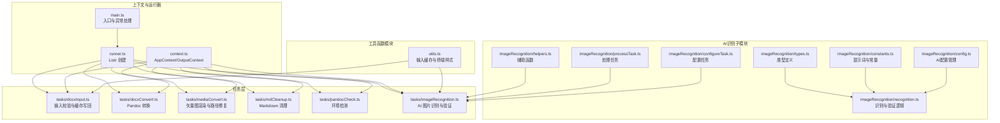
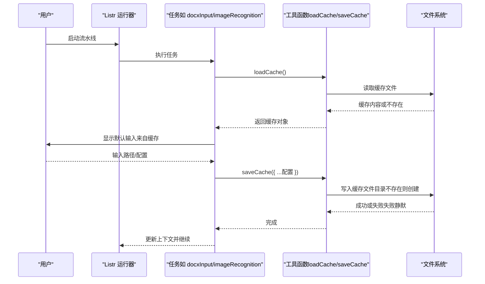
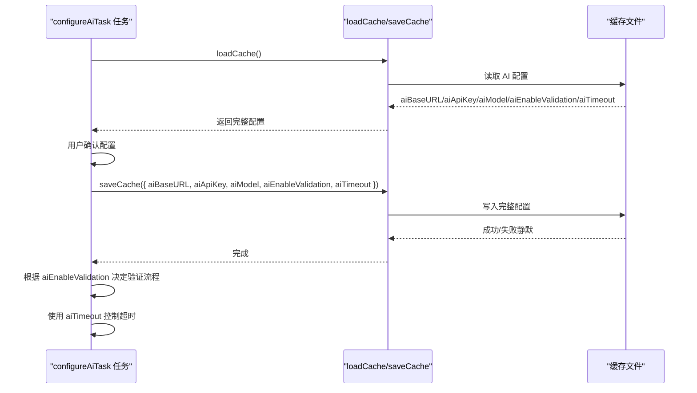
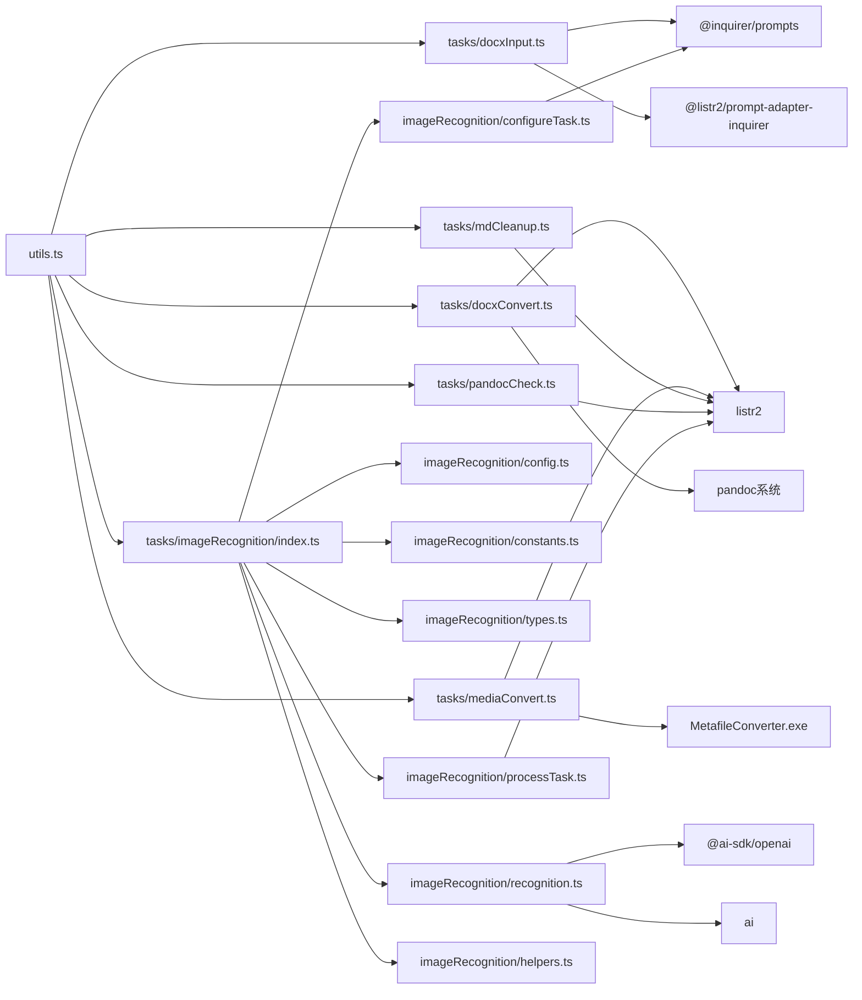

# 工具函数模块

<cite>
**本文引用的文件**
- [src/utils.ts](file://src/utils.ts)
- [src/context.ts](file://src/context.ts)
- [src/tasks/docxInput.ts](file://src/tasks/docxInput.ts)
- [src/tasks/docxConvert.ts](file://src/tasks/docxConvert.ts)
- [src/tasks/mediaConvert.ts](file://src/tasks/mediaConvert.ts)
- [src/tasks/mdCleanup.ts](file://src/tasks/mdCleanup.ts)
- [src/tasks/pandocCheck.ts](file://src/tasks/pandocCheck.ts)
- [src/tasks/imageRecognition/index.ts](file://src/tasks/imageRecognition/index.ts)
- [src/tasks/imageRecognition/config.ts](file://src/tasks/imageRecognition/config.ts)
- [src/tasks/imageRecognition/constants.ts](file://src/tasks/imageRecognition/constants.ts)
- [src/tasks/imageRecognition/types.ts](file://src/tasks/imageRecognition/types.ts)
- [src/tasks/imageRecognition/recognition.ts](file://src/tasks/imageRecognition/recognition.ts)
- [src/tasks/imageRecognition/configureTask.ts](file://src/tasks/imageRecognition/configureTask.ts)
- [src/tasks/imageRecognition/processTask.ts](file://src/tasks/imageRecognition/processTask.ts)
- [src/tasks/imageRecognition/helpers.ts](file://src/tasks/imageRecognition/helpers.ts)
- [src/runner.ts](file://src/runner.ts)
- [src/main.ts](file://src/main.ts)
- [package.json](file://package.json)
</cite>

## 更新摘要
**变更内容**
- 新增三元内容类型识别验证机制，支持ASCII字符、LaTeX公式和描述文本三种类型的智能识别
- 增强AI验证功能，实现多轮验证和错误处理逻辑，支持最多3次重试机制
- 改进超时控制机制，通过withTimeout函数实现AI操作的超时管理
- 新增ContentType枚举类型定义，规范内容类型识别标准
- 优化错误处理逻辑，提供详细的验证反馈和重试机制

## 目录
1. [简介](#简介)
2. [项目结构](#项目结构)
3. [核心组件](#核心组件)
4. [架构总览](#架构总览)
5. [详细组件分析](#详细组件分析)
6. [依赖关系分析](#依赖关系分析)
7. [性能考量](#性能考量)
8. [故障排查指南](#故障排查指南)
9. [结论](#结论)
10. [附录](#附录)

## 简介
本文件聚焦于工具函数模块，系统性阐述用户输入缓存机制的实现原理、缓存策略与数据持久化方案；解释文件系统操作、错误处理与调试辅助功能；提供每个工具函数的 API 参考、参数说明与使用示例；并给出缓存管理最佳实践、性能优化建议与安全注意事项，以及如何扩展工具函数以满足新增功能需求。

**更新** 本次更新反映了应用对AI验证功能的技术实现增强，新增了三元内容类型识别的验证机制，支持ASCII字符、LaTeX公式和描述文本三种类型的智能识别。该功能通过多轮验证和错误处理逻辑显著提升了AI图片识别的准确性和可靠性，同时改进了超时控制机制，为用户提供更加稳定和可控的AI识别体验。

## 项目结构
该工具函数模块位于 src/utils.ts，围绕用户输入缓存与终端交互辅助展开，主要被任务层（tasks）复用，贯穿整个 CLI 流水线。

**图表来源**
- [src/utils.ts:1-55](file://src/utils.ts#L1-L55)
- [src/tasks/docxInput.ts:1-61](file://src/tasks/docxInput.ts#L1-L61)
- [src/tasks/docxConvert.ts:1-64](file://src/tasks/docxConvert.ts#L1-L64)
- [src/tasks/mediaConvert.ts:1-112](file://src/tasks/mediaConvert.ts#L1-L112)
- [src/tasks/mdCleanup.ts:1-373](file://src/tasks/mdCleanup.ts#L1-L373)
- [src/tasks/pandocCheck.ts:1-24](file://src/tasks/pandocCheck.ts#L1-L24)
- [src/tasks/imageRecognition/index.ts:1-11](file://src/tasks/imageRecognition/index.ts#L1-L11)
- [src/tasks/imageRecognition/config.ts:1-16](file://src/tasks/imageRecognition/config.ts#L1-L16)
- [src/tasks/imageRecognition/constants.ts:1-66](file://src/tasks/imageRecognition/constants.ts#L1-L66)
- [src/tasks/imageRecognition/types.ts:1-31](file://src/tasks/imageRecognition/types.ts#L1-L31)
- [src/tasks/imageRecognition/recognition.ts:1-267](file://src/tasks/imageRecognition/recognition.ts#L1-L267)
- [src/tasks/imageRecognition/configureTask.ts:1-126](file://src/tasks/imageRecognition/configureTask.ts#L1-L126)
- [src/tasks/imageRecognition/processTask.ts:1-298](file://src/tasks/imageRecognition/processTask.ts#L1-L298)
- [src/tasks/imageRecognition/helpers.ts:1-119](file://src/tasks/imageRecognition/helpers.ts#L1-L119)
- [src/context.ts:1-21](file://src/context.ts#L1-L21)
- [src/runner.ts:1-10](file://src/runner.ts#L1-L10)
- [src/main.ts:1-41](file://src/main.ts#L1-L41)

**章节来源**
- [src/utils.ts:1-55](file://src/utils.ts#L1-L55)
- [src/tasks/docxInput.ts:1-61](file://src/tasks/docxInput.ts#L1-L61)
- [src/tasks/docxConvert.ts:1-64](file://src/tasks/docxConvert.ts#L1-L64)
- [src/tasks/mediaConvert.ts:1-112](file://src/tasks/mediaConvert.ts#L1-L112)
- [src/tasks/mdCleanup.ts:1-373](file://src/tasks/mdCleanup.ts#L1-L373)
- [src/tasks/pandocCheck.ts:1-24](file://src/tasks/pandocCheck.ts#L1-L24)
- [src/tasks/imageRecognition/index.ts:1-11](file://src/tasks/imageRecognition/index.ts#L1-L11)
- [src/tasks/imageRecognition/config.ts:1-16](file://src/tasks/imageRecognition/config.ts#L1-L16)
- [src/tasks/imageRecognition/constants.ts:1-66](file://src/tasks/imageRecognition/constants.ts#L1-L66)
- [src/tasks/imageRecognition/types.ts:1-31](file://src/tasks/imageRecognition/types.ts#L1-L31)
- [src/tasks/imageRecognition/recognition.ts:1-267](file://src/tasks/imageRecognition/recognition.ts#L1-L267)
- [src/tasks/imageRecognition/configureTask.ts:1-126](file://src/tasks/imageRecognition/configureTask.ts#L1-L126)
- [src/tasks/imageRecognition/processTask.ts:1-298](file://src/tasks/imageRecognition/processTask.ts#L1-L298)
- [src/tasks/imageRecognition/helpers.ts:1-119](file://src/tasks/imageRecognition/helpers.ts#L1-L119)
- [src/context.ts:1-21](file://src/context.ts#L1-L21)
- [src/runner.ts:1-10](file://src/runner.ts#L1-L10)
- [src/main.ts:1-41](file://src/main.ts#L1-L41)

## 核心组件
- 输入缓存与持久化
  - 类型定义：InputCache，当前包含 docxInputPath、aiBaseURL、aiApiKey、aiModel、aiEnableValidation、aiTimeout 字段，用于记录用户的各种配置信息。
  - 加载缓存：loadCache，异步读取用户主目录下的缓存文件，解析 JSON；若文件不存在或不可读则返回空对象。
  - 保存缓存：saveCache，合并传入的部分缓存与现有缓存，确保缓存目录存在后写回 JSON 文件；写入失败静默忽略，不影响主流程。
- 终端交互样式
  - confirmDefaultAnswer：根据默认值生成带颜色与样式的 (Y/n) 或 (y/N) 文本，便于 inquirer 提示中突出默认选项。
- 超时控制机制
  - withTimeout：执行带超时控制的任务，超时后通过 AbortController 取消底层请求，支持 AI 识别和验证操作的超时管理。
- 三元内容类型识别
  - ContentType枚举：定义'ascii'、'latex'、'description'三种内容类型，支持智能识别和分类。
  - validateRecognition：实现严格的验证机制，基于contentType类型进行针对性检查。
  - recognizeWithValidation：多轮验证流程，支持最多3次重试和详细的错误反馈。

**更新** 新增的三元内容类型识别验证机制显著增强了AI图片识别功能的准确性和可靠性。该机制通过三个维度的内容识别（ASCII字符、LaTeX公式、描述文本）和严格的验证规则，确保识别结果的质量。配合多轮验证和错误处理逻辑，系统能够在识别失败时自动重试并提供详细的反馈信息，大大提升了用户体验和识别成功率。

**章节来源**
- [src/utils.ts:20-27](file://src/utils.ts#L20-L27)
- [src/utils.ts:28-39](file://src/utils.ts#L28-L39)
- [src/utils.ts:41-53](file://src/utils.ts#L41-L53)
- [src/utils.ts:5-15](file://src/utils.ts#L5-L15)
- [src/tasks/imageRecognition/recognition.ts:8-37](file://src/tasks/imageRecognition/recognition.ts#L8-L37)
- [src/tasks/imageRecognition/types.ts:5](file://src/tasks/imageRecognition/types.ts#L5)
- [src/tasks/imageRecognition/recognition.ts:139-200](file://src/tasks/imageRecognition/recognition.ts#L139-L200)
- [src/tasks/imageRecognition/recognition.ts:233-266](file://src/tasks/imageRecognition/recognition.ts#L233-L266)

## 架构总览
工具函数模块在流水线中的位置如下：

**图表来源**
- [src/tasks/docxInput.ts:30-48](file://src/tasks/docxInput.ts#L30-L48)
- [src/tasks/imageRecognition/configureTask.ts:109-115](file://src/tasks/imageRecognition/configureTask.ts#L109-L115)
- [src/utils.ts:28-53](file://src/utils.ts#L28-L53)
- [src/main.ts:31-40](file://src/main.ts#L31-L40)

## 详细组件分析

### 输入缓存与持久化（utils.ts）
- 设计要点
  - 缓存位置：用户主目录下的隐藏目录，文件名为 cache.json。
  - 数据模型：InputCache 为可选字段对象，包含 docxInputPath、aiBaseURL、aiApiKey、aiModel、aiEnableValidation、aiTimeout 等字段。
  - 并发安全：采用一次性读取/写入策略，避免并发写冲突；写入失败静默，保证健壮性。
  - 可扩展性：通过 Partial<InputCache> 支持增量更新，便于后续扩展字段。
- 关键流程
  - 加载：读取文件并 JSON 解析；异常时返回空对象，确保任务可继续。
  - 保存：先加载现有缓存，浅合并传入部分缓存，再写回；确保目录存在。
- 错误处理
  - 读取失败：捕获异常并返回空对象，不中断任务。
  - 写入失败：捕获异常并静默忽略，不影响主流程。
- 复杂度
  - 时间复杂度：O(n)（n 为缓存 JSON 字符串长度）。
  - 空间复杂度：O(n)（缓存对象大小）。
- 使用示例（路径）
  - 读取缓存：[src/tasks/docxInput.ts:32](file://src/tasks/docxInput.ts#L32)
  - 写入缓存：[src/tasks/docxInput.ts:47](file://src/tasks/docxInput.ts#L47)

**图表来源**
- [src/utils.ts:41-53](file://src/utils.ts#L41-L53)

**章节来源**
- [src/utils.ts:20-27](file://src/utils.ts#L20-L27)
- [src/utils.ts:28-39](file://src/utils.ts#L28-L39)
- [src/utils.ts:41-53](file://src/utils.ts#L41-L53)

### 终端交互样式（utils.ts）
- 功能：生成带颜色与样式的提示文本，突出默认选择，提升用户体验。
- 参数：defaultYes（是否默认 Y）。
- 返回：形如 "(Y/n)" 或 "(y/N)" 的字符串。
- 使用示例（路径）
  - [src/utils.ts:9-15](file://src/utils.ts#L9-L15)

**章节来源**
- [src/utils.ts:5-15](file://src/utils.ts#L5-L15)

### 超时控制机制（recognition.ts）
- 功能：执行带超时控制的任务，超时后通过 AbortController 取消底层请求。
- 参数：fn（执行函数）、timeoutMs（超时毫秒数）、operation（操作名称）。
- 返回：Promise<T>，在超时情况下抛出 TimeoutError。
- 使用场景：AI识别和验证操作的超时控制。
- 使用示例（路径）
  - [src/tasks/imageRecognition/recognition.ts:18-37](file://src/tasks/imageRecognition/recognition.ts#L18-L37)

**章节来源**
- [src/tasks/imageRecognition/recognition.ts:8-37](file://src/tasks/imageRecognition/recognition.ts#L8-L37)

### 三元内容类型识别机制（types.ts）
- 功能：定义三种内容类型，支持智能识别和分类。
- 类型定义：ContentType = 'ascii' | 'latex' | 'description'
- 应用场景：AI图片识别结果的分类和验证。
- 使用示例（路径）
  - [src/tasks/imageRecognition/types.ts:5](file://src/tasks/imageRecognition/types.ts#L5)

**章节来源**
- [src/tasks/imageRecognition/types.ts:5](file://src/tasks/imageRecognition/types.ts#L5)

### AI验证功能的技术实现（recognition.ts）
- 功能：实现严格的验证机制，基于contentType类型进行针对性检查。
- 验证规则：
  - ASCII类型：检查是否仅包含简单字符，字符必须与图像内容完全匹配
  - LaTeX类型：检查LaTeX语法正确性，包括括号平衡、有效命令、数学模式语法
  - 描述类型：检查描述的详细程度、关键信息捕捉、语言要求
- 错误处理：验证失败时返回具体原因，支持最多3次重试。
- 使用示例（路径）
  - [src/tasks/imageRecognition/recognition.ts:139-200](file://src/tasks/imageRecognition/recognition.ts#L139-L200)

**章节来源**
- [src/tasks/imageRecognition/recognition.ts:139-200](file://src/tasks/imageRecognition/recognition.ts#L139-L200)

### 多轮验证与错误处理（recognition.ts）
- 功能：实现多轮验证流程，支持最多3次重试和详细的错误反馈。
- 重试机制：识别失败时根据验证反馈构建重试提示，重新识别。
- 超时处理：验证超时会停止重试并返回当前识别结果。
- 降级策略：验证异常时返回isCorrect: true的结果，确保流程不被中断。
- 使用示例（路径）
  - [src/tasks/imageRecognition/recognition.ts:233-266](file://src/tasks/imageRecognition/recognition.ts#L233-L266)

**章节来源**
- [src/tasks/imageRecognition/recognition.ts:233-266](file://src/tasks/imageRecognition/recognition.ts#L233-L266)

### AI配置管理（configureTask.ts）
- 功能：管理AI基础URL、API密钥、模型ID、验证开关和超时设置等配置。
- 缓存集成：从缓存中读取AI配置作为默认值，支持用户自定义修改。
- 配置持久化：用户确认配置后，将完整AI配置写回缓存文件。
- 验证控制：根据 aiEnableValidation 决定是否启用识别结果的二次验证。
- 超时控制：根据 aiTimeout 决定AI操作的超时时间。
- 使用示例（路径）
  - [src/tasks/imageRecognition/configureTask.ts:109-115](file://src/tasks/imageRecognition/configureTask.ts#L109-L115)

**图表来源**
- [src/tasks/imageRecognition/configureTask.ts:40-115](file://src/tasks/imageRecognition/configureTask.ts#L40-L115)
- [src/utils.ts:28-53](file://src/utils.ts#L28-L53)

**章节来源**
- [src/tasks/imageRecognition/configureTask.ts:35-126](file://src/tasks/imageRecognition/configureTask.ts#L35-L126)

### AI图片识别处理（processTask.ts）
- 功能：处理图片识别任务，支持验证和重试机制。
- 识别流程：读取图片 -> 识别内容 -> 验证结果 -> 替换Markdown内容。
- 错误处理：支持最多3次重试，失败图片单独处理。
- 性能监控：实时显示识别进度和超时状态。
- 使用示例（路径）
  - [src/tasks/imageRecognition/processTask.ts:21-64](file://src/tasks/imageRecognition/processTask.ts#L21-L64)

**章节来源**
- [src/tasks/imageRecognition/processTask.ts:66-298](file://src/tasks/imageRecognition/processTask.ts#L66-L298)

### AI识别辅助函数（helpers.ts）
- 功能：提供AI识别相关的辅助函数。
- MIME类型处理：根据文件扩展名确定正确的媒体类型。
- 图片路径解析：支持相对路径和媒体目录两种查找方式。
- 替换构建：根据contentType类型构建合适的Markdown替换内容。
- 使用示例（路径）
  - [src/tasks/imageRecognition/helpers.ts:81-118](file://src/tasks/imageRecognition/helpers.ts#L81-L118)

**章节来源**
- [src/tasks/imageRecognition/helpers.ts:7-119](file://src/tasks/imageRecognition/helpers.ts#L7-L119)

### AI提示词与常量（constants.ts）
- 功能：定义AI识别和验证所需的提示词和常量。
- 识别提示词：指导AI按照三个步骤进行内容类型判断。
- 验证提示词：严格验证识别结果的准确性。
- 常量定义：MAX_RECOGNITION_ATTEMPTS（最大重试次数）。
- 使用示例（路径）
  - [src/tasks/imageRecognition/constants.ts:6](file://src/tasks/imageRecognition/constants.ts#L6)

**章节来源**
- [src/tasks/imageRecognition/constants.ts:1-66](file://src/tasks/imageRecognition/constants.ts#L1-L66)

### AI配置状态管理（config.ts）
- 功能：管理AI配置的状态和默认值。
- 配置结构：包含baseURL、apiKey、model、enableValidation、timeout等字段。
- 默认值：所有配置项都有合理的默认值。
- 使用示例（路径）
  - [src/tasks/imageRecognition/config.ts:9-15](file://src/tasks/imageRecognition/config.ts#L9-L15)

**章节来源**
- [src/tasks/imageRecognition/config.ts:1-16](file://src/tasks/imageRecognition/config.ts#L1-L16)

## 依赖关系分析
- 模块内依赖
  - utils.ts 仅依赖 Node 内置模块（fs/promises、path、os），无第三方依赖。
  - 任务层通过相对导入使用 utils.ts。
- 外部依赖
  - @inquirer/prompts 与 @listr2/prompt-adapter-inquirer 用于交互式提示。
  - listr2 用于流水线编排。
  - @ai-sdk/openai 与 ai 用于 AI 图片识别功能。
- 运行时依赖
  - pandoc 用于 DOCX 转 Markdown。
  - MetafileConverter.exe 用于矢量图渲染。

**图表来源**
- [src/utils.ts:1-55](file://src/utils.ts#L1-L55)
- [src/tasks/docxInput.ts:1-8](file://src/tasks/docxInput.ts#L1-L8)
- [src/tasks/docxConvert.ts:1-5](file://src/tasks/docxConvert.ts#L1-L5)
- [src/tasks/mediaConvert.ts:1-7](file://src/tasks/mediaConvert.ts#L1-L7)
- [src/tasks/mdCleanup.ts:1-4](file://src/tasks/mdCleanup.ts#L1-L4)
- [src/tasks/pandocCheck.ts:1-3](file://src/tasks/pandocCheck.ts#L1-L3)
- [src/tasks/imageRecognition/index.ts:1-11](file://src/tasks/imageRecognition/index.ts#L1-L11)
- [src/tasks/imageRecognition/config.ts:1-16](file://src/tasks/imageRecognition/config.ts#L1-L16)
- [src/tasks/imageRecognition/constants.ts:1-66](file://src/tasks/imageRecognition/constants.ts#L1-L66)
- [src/tasks/imageRecognition/types.ts:1-31](file://src/tasks/imageRecognition/types.ts#L1-L31)
- [src/tasks/imageRecognition/recognition.ts:1-267](file://src/tasks/imageRecognition/recognition.ts#L1-L267)
- [src/tasks/imageRecognition/configureTask.ts:1-126](file://src/tasks/imageRecognition/configureTask.ts#L1-L126)
- [src/tasks/imageRecognition/processTask.ts:1-298](file://src/tasks/imageRecognition/processTask.ts#L1-L298)
- [src/tasks/imageRecognition/helpers.ts:1-119](file://src/tasks/imageRecognition/helpers.ts#L1-L119)
- [package.json:21-37](file://package.json#L21-L37)

**章节来源**
- [src/utils.ts:1-55](file://src/utils.ts#L1-L55)
- [src/tasks/docxInput.ts:1-8](file://src/tasks/docxInput.ts#L1-L8)
- [src/tasks/docxConvert.ts:1-5](file://src/tasks/docxConvert.ts#L1-L5)
- [src/tasks/mediaConvert.ts:1-7](file://src/tasks/mediaConvert.ts#L1-L7)
- [src/tasks/mdCleanup.ts:1-4](file://src/tasks/mdCleanup.ts#L1-L4)
- [src/tasks/pandocCheck.ts:1-3](file://src/tasks/pandocCheck.ts#L1-L3)
- [src/tasks/imageRecognition/index.ts:1-11](file://src/tasks/imageRecognition/index.ts#L1-L11)
- [src/tasks/imageRecognition/config.ts:1-16](file://src/tasks/imageRecognition/config.ts#L1-L16)
- [src/tasks/imageRecognition/constants.ts:1-66](file://src/tasks/imageRecognition/constants.ts#L1-L66)
- [src/tasks/imageRecognition/types.ts:1-31](file://src/tasks/imageRecognition/types.ts#L1-L31)
- [src/tasks/imageRecognition/recognition.ts:1-267](file://src/tasks/imageRecognition/recognition.ts#L1-L267)
- [src/tasks/imageRecognition/configureTask.ts:1-126](file://src/tasks/imageRecognition/configureTask.ts#L1-L126)
- [src/tasks/imageRecognition/processTask.ts:1-298](file://src/tasks/imageRecognition/processTask.ts#L1-L298)
- [src/tasks/imageRecognition/helpers.ts:1-119](file://src/tasks/imageRecognition/helpers.ts#L1-L119)
- [package.json:21-37](file://package.json#L21-L37)

## 性能考量
- 缓存读写
  - 采用同步 JSON 解析/序列化，适合小体积缓存文件；若未来扩展字段增多，可考虑分片写入或延迟写入。
  - 写入失败静默，避免阻塞主流程，但可能丢失缓存更新；可在关键节点增加重试或日志记录。
- 文件系统
  - mkdir 递归创建目录，避免重复检查；在高并发场景建议引入互斥锁或原子写入。
- I/O 与子进程
  - 文档转换与媒体转换涉及大量文件读写与外部进程调用，建议批量处理与并发控制（当前媒体转换为串行，避免资源竞争）。
  - AI图片识别涉及网络请求和外部API调用，建议合理控制并发数量和添加超时机制。
- 内存占用
  - Markdown 清理为纯函数，按行处理；大文件建议流式处理或分块读取以降低内存峰值。
  - AI识别任务需要处理图像缓冲区，注意内存使用量和垃圾回收。
- **更新** 三元内容类型识别性能考量
  - 内容类型验证增加了额外的计算开销，但显著提升了识别准确性。
  - 多轮验证机制最多进行3次重试，平衡了准确性和性能。
  - 超时控制机制避免了长时间等待，提高了系统响应性。
  - 建议根据文档复杂度调整验证开关，复杂文档启用验证，简单文档禁用验证以提升性能。

## 故障排查指南
- 缓存读取失败
  - 现象：提示框未显示默认值或首次输入为空。
  - 排查：确认用户主目录权限、缓存文件是否存在且可读；检查 JSON 格式合法性。
  - 参考路径：[src/utils.ts:28-39](file://src/utils.ts#L28-L39)
- 缓存写入失败
  - 现象：输入后下次启动仍无默认值。
  - 排查：检查缓存目录权限、磁盘空间；写入失败会被静默忽略，必要时手动重建缓存文件。
  - 参考路径：[src/utils.ts:41-53](file://src/utils.ts#L41-L53)
- 输入路径校验失败
  - 现象：提示"请输入有效的 .docx 文件路径"或"路径不存在"。
  - 排查：确认路径存在且为 .docx；相对路径会基于当前工作目录解析。
  - 参考路径：[src/tasks/docxInput.ts:14-26](file://src/tasks/docxInput.ts#L14-L26)
- AI配置加载失败
  - 现象：AI图片识别任务无法读取缓存的配置信息。
  - 排查：确认缓存文件中包含 aiBaseURL、aiApiKey、aiModel、aiEnableValidation、aiTimeout 字段；检查JSON格式。
  - 参考路径：[src/tasks/imageRecognition/configureTask.ts:40](file://src/tasks/imageRecognition/configureTask.ts#L40)
- AI超时设置异常
  - 现象：aiTimeout 字段未正确保存或读取。
  - 排查：确认任务中正确调用了 saveCache({ aiTimeout })；检查缓存文件中的数字格式。
  - 参考路径：[src/tasks/imageRecognition/configureTask.ts:109-115](file://src/tasks/imageRecognition/configureTask.ts#L109-L115)
- AI超时控制异常
  - 现象：设置超时后识别仍然无响应或超时处理不当。
  - 排查：检查 `withTimeout` 函数是否正确调用；确认超时值转换为毫秒；查看超时错误处理逻辑。
  - 参考路径：[src/tasks/imageRecognition/recognition.ts:18-37](file://src/tasks/imageRecognition/recognition.ts#L18-L37)
- AI验证设置异常
  - 现象：aiEnableValidation 字段未正确保存或读取。
  - 排查：确认任务中正确调用了 saveCache({ aiEnableValidation })；检查缓存文件中的布尔值格式。
  - 参考路径：[src/tasks/imageRecognition/configureTask.ts:109-115](file://src/tasks/imageRecognition/configureTask.ts#L109-L115)
- AI验证功能异常
  - 现象：启用验证后识别失败或处理时间过长。
  - 排查：检查AI服务连接状态、模型可用性；确认验证循环正常执行；查看验证反馈信息。
  - 参考路径：[src/tasks/imageRecognition/recognition.ts:233-266](file://src/tasks/imageRecognition/recognition.ts#L233-L266)
- 三元内容类型识别异常
  - 现象：识别结果contentType不在['ascii','latex','description']范围内。
  - 排查：检查AI返回格式是否符合JSON规范；确认contentType字段正确；查看parseRecognitionResponse函数。
  - 参考路径：[src/tasks/imageRecognition/recognition.ts:41-74](file://src/tasks/imageRecognition/recognition.ts#L41-L74)
- 验证规则检查失败
  - 现象：验证结果显示isCorrect: false且提供具体原因。
  - 排查：根据验证原因调整识别内容；检查LaTeX语法正确性；确认描述内容的详细程度。
  - 参考路径：[src/tasks/imageRecognition/recognition.ts:139-200](file://src/tasks/imageRecognition/recognition.ts#L139-L200)
- Pandoc 环境缺失
  - 现象：任务报错"未检测到已安装的 pandoc"。
  - 排查：安装 pandoc 并确保其在 PATH 中；或在系统层面修复 PATH。
  - 参考路径：[src/tasks/pandocCheck.ts:14-23](file://src/tasks/pandocCheck.ts#L14-L23)
- 媒体转换失败
  - 现象：EMF/WMF 渲染失败或找不到可执行文件。
  - 排查：确认 MetafileConverter.exe 存在且可执行；检查运行时依赖是否齐全。
  - 参考路径：[src/tasks/mediaConvert.ts:19-24](file://src/tasks/mediaConvert.ts#L19-L24)
- Markdown 清理异常
  - 现象：清理阶段抛出错误或输出不符合预期。
  - 排查：检查源文件编码与内容完整性；关注警告输出定位问题。
  - 参考路径：[src/tasks/mdCleanup.ts:331-373](file://src/tasks/mdCleanup.ts#L331-L373)

**更新** 新增的三元内容类型识别故障排查：
- 三元内容类型识别异常：检查AI返回格式是否符合JSON规范；确认contentType字段正确；查看parseRecognitionResponse函数。
- 验证规则检查失败：根据验证原因调整识别内容；检查LaTeX语法正确性；确认描述内容的详细程度。
- 多轮验证机制异常：检查MAX_RECOGNITION_ATTEMPTS常量设置；确认重试提示构建逻辑；查看buildRetryPrompt函数。
- 超时处理异常：检查TimeoutError类的处理逻辑；确认超时发生时的降级策略正常执行。

**章节来源**
- [src/utils.ts:28-53](file://src/utils.ts#L28-L53)
- [src/tasks/docxInput.ts:14-26](file://src/tasks/docxInput.ts#L14-L26)
- [src/tasks/imageRecognition/configureTask.ts:40](file://src/tasks/imageRecognition/configureTask.ts#L40)
- [src/tasks/imageRecognition/configureTask.ts:109-115](file://src/tasks/imageRecognition/configureTask.ts#L109-L115)
- [src/tasks/imageRecognition/recognition.ts:18-37](file://src/tasks/imageRecognition/recognition.ts#L18-L37)
- [src/tasks/imageRecognition/recognition.ts:233-266](file://src/tasks/imageRecognition/recognition.ts#L233-L266)
- [src/tasks/imageRecognition/recognition.ts:41-74](file://src/tasks/imageRecognition/recognition.ts#L41-L74)
- [src/tasks/imageRecognition/recognition.ts:139-200](file://src/tasks/imageRecognition/recognition.ts#L139-L200)
- [src/tasks/pandocCheck.ts:14-23](file://src/tasks/pandocCheck.ts#L14-L23)
- [src/tasks/mediaConvert.ts:19-24](file://src/tasks/mediaConvert.ts#L19-L24)
- [src/tasks/mdCleanup.ts:331-373](file://src/tasks/mdCleanup.ts#L331-L373)

## 结论
工具函数模块以极简设计实现了可靠的用户输入缓存与终端交互增强，具备良好的可扩展性与健壮性。通过在任务层统一使用缓存接口，既提升了用户体验，又降低了重复输入成本。本次更新扩展了缓存功能以支持AI超时设置的持久化，为AI图片识别功能提供了完整的配置管理能力。新增的三元内容类型识别验证机制显著提升了AI图片识别的准确性和可靠性，通过多轮验证和错误处理逻辑确保识别结果的质量。超时控制机制和性能优化建议为用户提供了更加稳定和可控的AI识别体验。

**更新** 新增的三元内容类型识别验证机制为AI图片识别功能带来了质的飞跃。该机制通过ASCII字符、LaTeX公式和描述文本三种类型的智能识别和严格验证，显著提升了识别结果的准确性和可靠性。配合多轮验证、错误处理和超时控制机制，系统能够在各种复杂场景下提供高质量的识别服务。这一技术实现不仅增强了用户体验，也为后续的功能扩展奠定了坚实的基础。

## 附录

### API 参考与使用示例

- 函数：confirmDefaultAnswer
  - 功能：生成带颜色与样式的提示文本，突出默认选项。
  - 参数：defaultYes（boolean）。
  - 返回：字符串（例如 "(Y/n)" 或 "(y/N)"）。
  - 示例路径：[src/utils.ts:9-15](file://src/utils.ts#L9-L15)

- 函数：loadCache
  - 功能：从磁盘读取并解析用户输入缓存。
  - 返回：Promise<InputCache>（若文件不存在或不可读则返回空对象）。
  - 示例路径：[src/utils.ts:28-39](file://src/utils.ts#L28-L39)
  - 使用示例（任务层）：[src/tasks/docxInput.ts:32](file://src/tasks/docxInput.ts#L32)

- 函数：saveCache
  - 功能：合并传入的部分缓存并与现有缓存合并后写回磁盘。
  - 参数：partial（Partial<InputCache>）。
  - 返回：Promise<void>。
  - 示例路径：[src/utils.ts:41-53](file://src/utils.ts#L41-L53)
  - 使用示例（任务层）：[src/tasks/docxInput.ts:47](file://src/tasks/docxInput.ts#L47)

- 函数：withTimeout
  - 功能：执行带超时控制的任务，超时后通过 AbortController 取消底层请求。
  - 参数：fn（执行函数）、timeoutMs（超时毫秒数）、operation（操作名称）。
  - 返回：Promise<T>。
  - 示例路径：[src/tasks/imageRecognition/recognition.ts:18-37](file://src/tasks/imageRecognition/recognition.ts#L18-L37)

- 类型：InputCache
  - 字段：docxInputPath（可选字符串）、aiBaseURL（可选字符串）、aiApiKey（可选字符串）、aiModel（可选字符串）、aiEnableValidation（可选布尔值）、aiTimeout（可选数字）。
  - 示例路径：[src/utils.ts:20-27](file://src/utils.ts#L20-L27)

- 类型：ContentType
  - 值：'ascii' | 'latex' | 'description'
  - 示例路径：[src/tasks/imageRecognition/types.ts:5](file://src/tasks/imageRecognition/types.ts#L5)

- 类型：RecognitionResult
  - 字段：contentType（ContentType）、content（string）。
  - 示例路径：[src/tasks/imageRecognition/types.ts:7-10](file://src/tasks/imageRecognition/types.ts#L7-L10)

- 类型：ValidationResult
  - 字段：isCorrect（boolean）、reason（string）。
  - 示例路径：[src/tasks/imageRecognition/types.ts:12-15](file://src/tasks/imageRecognition/types.ts#L12-L15)

- 类型：AppContext / OutputContext
  - AppContext：inputPath、outputPath、pandocExec、lastContext（可选）。
  - OutputContext：outFilename、outputPath、mediaPath。
  - 示例路径：[src/context.ts:1-21](file://src/context.ts#L1-L21)

- 任务：docxInputTask
  - 功能：交互式输入 .docx 路径，应用缓存默认值，校验路径有效性，写回缓存并更新上下文。
  - 示例路径：[src/tasks/docxInput.ts:28-60](file://src/tasks/docxInput.ts#L28-L60)

- 任务：docxConvertTask
  - 功能：调用 pandoc 转换 DOCX 为 Markdown，并提取媒体资源。
  - 示例路径：[src/tasks/docxConvert.ts:10-64](file://src/tasks/docxConvert.ts#L10-L64)

- 任务：mediaConvertTask
  - 功能：渲染 EMF/WMF 为 JPG，并更新 Markdown 中的图片引用路径。
  - 示例路径：[src/tasks/mediaConvert.ts:104-112](file://src/tasks/mediaConvert.ts#L104-L112)

- 任务：mdCleanupTask
  - 功能：清理 Pandoc 输出的 HTML 标记，生成规范 Markdown。
  - 示例路径：[src/tasks/mdCleanup.ts:331-373](file://src/tasks/mdCleanup.ts#L331-L373)

- 任务：pandocCheckTask
  - 功能：检测系统是否安装 pandoc。
  - 示例路径：[src/tasks/pandocCheck.ts:14-23](file://src/tasks/pandocCheck.ts#L14-L23)

- 任务：imageRecognitionTask
  - 功能：配置AI图片识别参数，支持可选的识别结果验证和超时控制，自动读取和保存缓存配置。
  - 示例路径：[src/tasks/imageRecognition/index.ts:6-10](file://src/tasks/imageRecognition/index.ts#L6-L10)

- 任务：configureAiTask
  - 功能：配置AI视觉识别接口，包括基础URL、API密钥、模型选择、验证开关和超时设置。
  - 示例路径：[src/tasks/imageRecognition/configureTask.ts:35-126](file://src/tasks/imageRecognition/configureTask.ts#L35-L126)

- 任务：processImagesTask
  - 功能：处理图片识别任务，支持验证、重试和替换Markdown内容。
  - 示例路径：[src/tasks/imageRecognition/processTask.ts:66-298](file://src/tasks/imageRecognition/processTask.ts#L66-L298)

- 函数：validateRecognition
  - 功能：验证识别结果的准确性，基于contentType类型进行针对性检查。
  - 参数：provider、modelId、imageBuffer、mimeType、recognition。
  - 返回：Promise<ValidationResult>。
  - 示例路径：[src/tasks/imageRecognition/recognition.ts:139-200](file://src/tasks/imageRecognition/recognition.ts#L139-L200)

- 函数：recognizeWithValidation
  - 功能：多轮验证流程，支持最多3次重试和详细的错误反馈。
  - 参数：provider、modelId、imageBuffer、mimeType、onStatus。
  - 返回：Promise<RecognitionResult>。
  - 示例路径：[src/tasks/imageRecognition/recognition.ts:233-266](file://src/tasks/imageRecognition/recognition.ts#L233-L266)

### 最佳实践
- 缓存管理
  - 仅存储必要字段，避免缓存膨胀；定期清理无效缓存。
  - 对写入失败进行告警或降级处理（如临时文件回退）。
  - AI配置字段应包含适当的默认值和验证逻辑。
- 性能优化
  - 大文件 I/O 采用流式处理；批量化文件操作减少系统调用。
  - 子进程调用尽量串行化，避免资源争用。
  - AI识别任务建议添加超时控制和重试机制。
  - 考虑AI验证设置对性能的影响，为复杂文档启用验证，简单文档禁用验证。
  - **更新** 三元内容类型识别性能优化
    - 根据文档复杂度调整验证开关，复杂文档启用验证，简单文档禁用验证以提升性能。
    - 合理设置aiTimeout，避免过短或过长的超时时间影响用户体验。
    - 监控验证失败率，及时调整验证规则和重试策略。
    - 优化LaTeX语法检查算法，减少不必要的计算开销。
- 安全考虑
  - 验证用户输入路径的有效性与可访问性；限制缓存文件权限。
  - 外部可执行文件路径应明确且受控，避免路径注入。
  - AI API密钥等敏感信息应妥善保护，避免泄露。
- 扩展建议
  - 新增缓存字段时，保持向后兼容；提供默认值与迁移逻辑。
  - 将通用文件系统操作抽象为独立函数，统一错误处理与日志记录。
  - 引入配置中心或环境变量，便于在不同部署环境下调整行为。
  - 为AI相关配置添加更完善的错误处理和重试机制。
  - 考虑为AI验证设置添加性能监控和统计功能，帮助用户优化使用体验。
  - 实现AI验证结果的统计分析，帮助用户了解验证效果和性能表现。
  - **更新** 三元内容类型识别扩展建议
    - 实现验证规则的动态调整功能，根据历史数据优化验证策略。
    - 添加验证结果的可视化报告，帮助用户理解验证过程和结果。
    - 提供验证规则的自定义配置界面，支持高级用户的个性化需求。
    - 实现验证失败的自动学习机制，持续改进验证准确性。
    - 考虑添加验证结果的版本管理，支持历史对比和趋势分析。