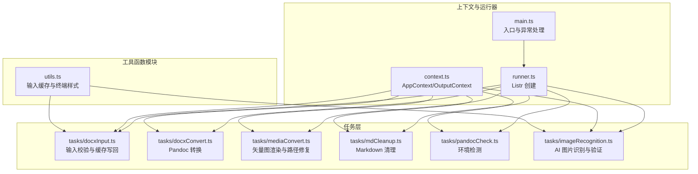
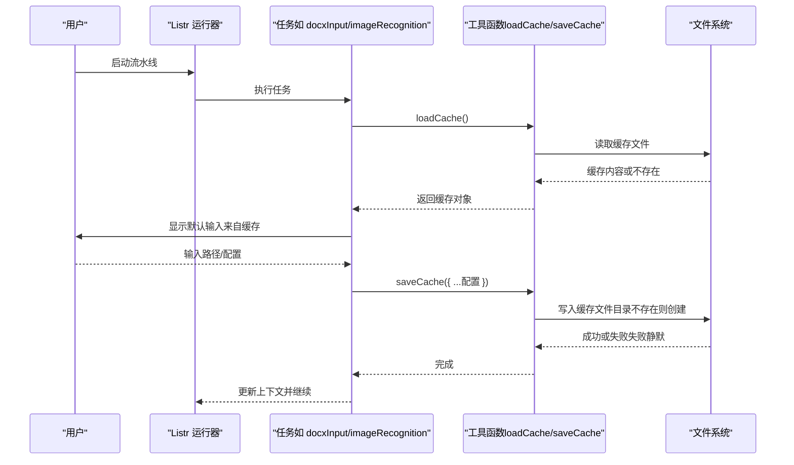
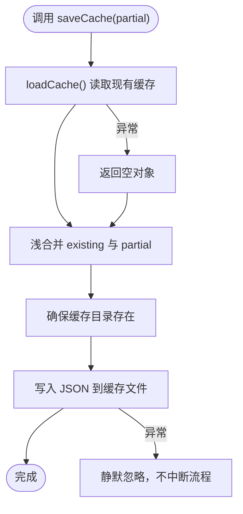
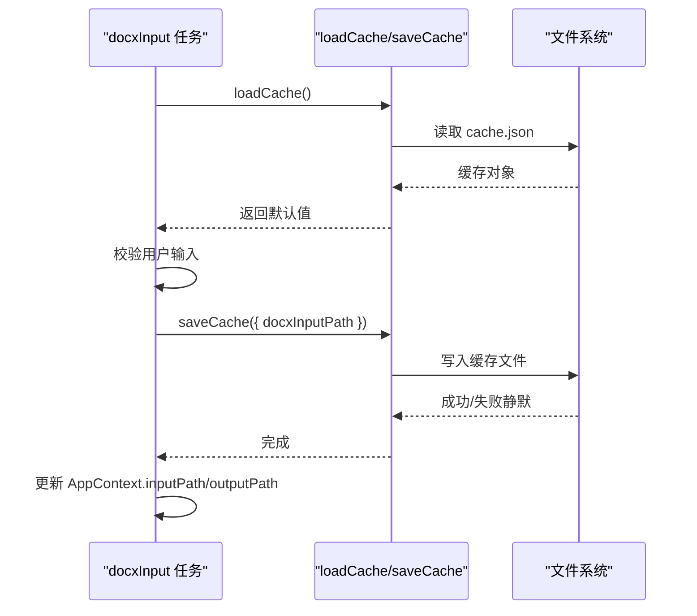
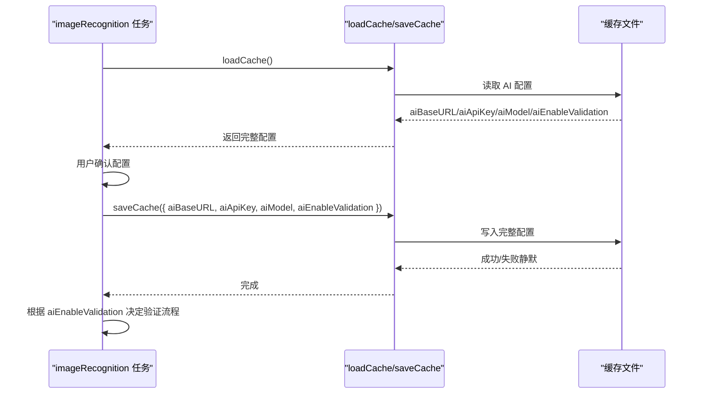
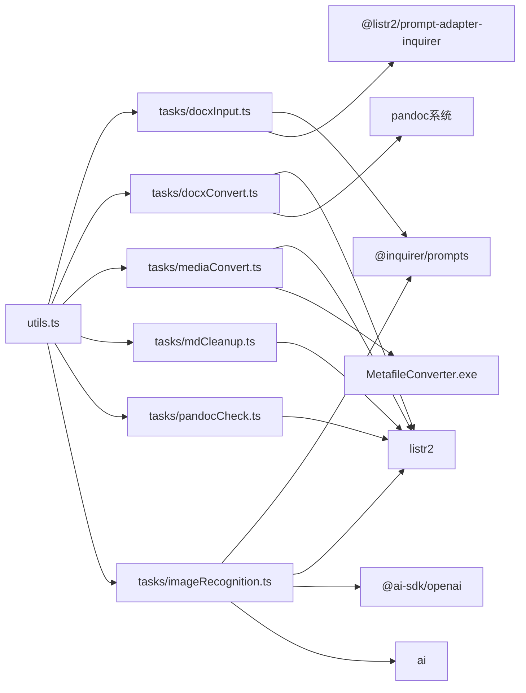

# 工具函数模块

<cite>
**本文引用的文件**
- [src/utils.ts](file://src/utils.ts)
- [src/context.ts](file://src/context.ts)
- [src/tasks/docxInput.ts](file://src/tasks/docxInput.ts)
- [src/tasks/docxConvert.ts](file://src/tasks/docxConvert.ts)
- [src/tasks/mediaConvert.ts](file://src/tasks/mediaConvert.ts)
- [src/tasks/mdCleanup.ts](file://src/tasks/mdCleanup.ts)
- [src/tasks/pandocCheck.ts](file://src/tasks/pandocCheck.ts)
- [src/tasks/imageRecognition.ts](file://src/tasks/imageRecognition.ts)
- [src/runner.ts](file://src/runner.ts)
- [src/main.ts](file://src/main.ts)
- [package.json](file://package.json)
</cite>

## 更新摘要
**变更内容**
- 扩展缓存类型定义，新增 `aiEnableValidation` 字段支持AI验证设置的持久化存储
- 更新 `InputCache` 类型定义以包含AI相关的配置字段
- 增强缓存功能以支持AI图片识别任务的配置持久化
- 更新相关任务层文档以反映AI验证设置的使用

## 目录
1. [简介](#简介)
2. [项目结构](#项目结构)
3. [核心组件](#核心组件)
4. [架构总览](#架构总览)
5. [详细组件分析](#详细组件分析)
6. [依赖关系分析](#依赖关系分析)
7. [性能考量](#性能考量)
8. [故障排查指南](#故障排查指南)
9. [结论](#结论)
10. [附录](#附录)

## 简介
本文件聚焦于工具函数模块，系统性阐述用户输入缓存机制的实现原理、缓存策略与数据持久化方案；解释文件系统操作、错误处理与调试辅助功能；提供每个工具函数的 API 参考、参数说明与使用示例；并给出缓存管理最佳实践、性能优化建议与安全注意事项，以及如何扩展工具函数以满足新增功能需求。

**更新** 本次更新反映了应用对AI验证设置的扩展支持，新增了 `aiEnableValidation` 字段以持久化AI图片识别的验证配置，增强了AI图片识别任务的用户体验和可靠性。

## 项目结构
该工具函数模块位于 src/utils.ts，围绕用户输入缓存与终端交互辅助展开，主要被任务层（tasks）复用，贯穿整个 CLI 流水线。

**图表来源**
- [src/utils.ts:1-54](file://src/utils.ts#L1-L54)
- [src/tasks/docxInput.ts:1-52](file://src/tasks/docxInput.ts#L1-L52)
- [src/tasks/docxConvert.ts:1-64](file://src/tasks/docxConvert.ts#L1-L64)
- [src/tasks/mediaConvert.ts:1-112](file://src/tasks/mediaConvert.ts#L1-L112)
- [src/tasks/mdCleanup.ts:1-373](file://src/tasks/mdCleanup.ts#L1-L373)
- [src/tasks/pandocCheck.ts:1-24](file://src/tasks/pandocCheck.ts#L1-L24)
- [src/tasks/imageRecognition.ts:1-548](file://src/tasks/imageRecognition.ts#L1-L548)
- [src/context.ts:1-21](file://src/context.ts#L1-L21)
- [src/runner.ts:1-10](file://src/runner.ts#L1-L10)
- [src/main.ts:1-41](file://src/main.ts#L1-L41)

**章节来源**
- [src/utils.ts:1-54](file://src/utils.ts#L1-L54)
- [src/tasks/docxInput.ts:1-52](file://src/tasks/docxInput.ts#L1-L52)
- [src/tasks/docxConvert.ts:1-64](file://src/tasks/docxConvert.ts#L1-L64)
- [src/tasks/mediaConvert.ts:1-112](file://src/tasks/mediaConvert.ts#L1-L112)
- [src/tasks/mdCleanup.ts:1-373](file://src/tasks/mdCleanup.ts#L1-L373)
- [src/tasks/pandocCheck.ts:1-24](file://src/tasks/pandocCheck.ts#L1-L24)
- [src/tasks/imageRecognition.ts:1-548](file://src/tasks/imageRecognition.ts#L1-L548)
- [src/context.ts:1-21](file://src/context.ts#L1-L21)
- [src/runner.ts:1-10](file://src/runner.ts#L1-L10)
- [src/main.ts:1-41](file://src/main.ts#L1-L41)

## 核心组件
- 输入缓存与持久化
  - 类型定义：InputCache，当前包含 docxInputPath、aiBaseURL、aiApiKey、aiModel、aiEnableValidation 字段，用于记录用户的各种配置信息。
  - 加载缓存：loadCache，异步读取用户主目录下的缓存文件，解析 JSON；若文件不存在或不可读则返回空对象。
  - 保存缓存：saveCache，合并传入的部分缓存与现有缓存，确保缓存目录存在后写回 JSON 文件；写入失败静默忽略，不影响主流程。
- 终端交互样式
  - confirmDefaultAnswer：根据默认值生成带颜色与样式的 (Y/n) 或 (y/N) 文本，便于 inquirer 提示中突出默认选项。

**更新** 缓存类型现已扩展支持AI相关的配置字段，包括基础URL、API密钥、模型ID和验证开关等。其中 `aiEnableValidation` 字段专门用于持久化AI图片识别的验证设置。

**章节来源**
- [src/utils.ts:20-26](file://src/utils.ts#L20-L26)
- [src/utils.ts:28-39](file://src/utils.ts#L28-L39)
- [src/utils.ts:41-53](file://src/utils.ts#L41-L53)
- [src/utils.ts:5-15](file://src/utils.ts#L5-L15)

## 架构总览
工具函数模块在流水线中的位置如下：

**图表来源**
- [src/tasks/docxInput.ts:27-51](file://src/tasks/docxInput.ts#L27-L51)
- [src/tasks/imageRecognition.ts:408-416](file://src/tasks/imageRecognition.ts#L408-L416)
- [src/utils.ts:28-53](file://src/utils.ts#L28-L53)
- [src/main.ts:31-40](file://src/main.ts#L31-L40)

## 详细组件分析

### 输入缓存与持久化（utils.ts）
- 设计要点
  - 缓存位置：用户主目录下的隐藏目录，文件名为 cache.json。
  - 数据模型：InputCache 为可选字段对象，包含 docxInputPath、aiBaseURL、aiApiKey、aiModel、aiEnableValidation 等字段。
  - 并发安全：采用一次性读取/写入策略，避免并发写冲突；写入失败静默，保证健壮性。
  - 可扩展性：通过 Partial<InputCache> 支持增量更新，便于后续扩展字段。
- 关键流程
  - 加载：读取文件并 JSON 解析；异常时返回空对象，确保任务可继续。
  - 保存：先加载现有缓存，浅合并传入部分缓存，再写回；确保目录存在。
- 错误处理
  - 读取失败：捕获异常并返回空对象，不中断任务。
  - 写入失败：捕获异常并静默忽略，不影响主流程。
- 复杂度
  - 时间复杂度：O(n)（n 为缓存 JSON 字符串长度）。
  - 空间复杂度：O(n)（缓存对象大小）。
- 使用示例（路径）
  - 读取缓存：[src/tasks/docxInput.ts:30](file://src/tasks/docxInput.ts#L30)
  - 写入缓存：[src/tasks/docxInput.ts:41](file://src/tasks/docxInput.ts#L41)

**图表来源**
- [src/utils.ts:41-53](file://src/utils.ts#L41-L53)

**章节来源**
- [src/utils.ts:20-26](file://src/utils.ts#L20-L26)
- [src/utils.ts:28-39](file://src/utils.ts#L28-L39)
- [src/utils.ts:41-53](file://src/utils.ts#L41-L53)

### 终端交互样式（utils.ts）
- 功能：生成带颜色与样式的提示文本，突出默认选择，提升用户体验。
- 参数：defaultYes（是否默认 Y）。
- 返回：形如 "(Y/n)" 或 "(y/N)" 的字符串。
- 使用示例（路径）
  - [src/utils.ts:9-15](file://src/utils.ts#L9-L15)

**章节来源**
- [src/utils.ts:5-15](file://src/utils.ts#L5-L15)

### 任务层对工具函数的使用（docxInput.ts）
- 输入校验：validateDocxPath 对空值与路径存在性进行校验。
- 默认值：从缓存中读取 docxInputPath 作为默认输入。
- 写回缓存：用户输入有效后，写回 docxInputPath。
- 上下文更新：根据输入路径设置 inputPath 与 outputPath。
- 使用示例（路径）
  - 读取缓存：[src/tasks/docxInput.ts:30](file://src/tasks/docxInput.ts#L30)
  - 设置默认值：[src/tasks/docxInput.ts:35](file://src/tasks/docxInput.ts#L35)
  - 写回缓存：[src/tasks/docxInput.ts:41](file://src/tasks/docxInput.ts#L41)
  - 更新上下文：[src/tasks/docxInput.ts:43-49](file://src/tasks/docxInput.ts#L43-L49)

**图表来源**
- [src/tasks/docxInput.ts:27-51](file://src/tasks/docxInput.ts#L27-L51)
- [src/utils.ts:28-53](file://src/utils.ts#L28-L53)

**章节来源**
- [src/tasks/docxInput.ts:10-25](file://src/tasks/docxInput.ts#L10-L25)
- [src/tasks/docxInput.ts:27-51](file://src/tasks/docxInput.ts#L27-L51)

### AI图片识别任务中的缓存使用（imageRecognition.ts）
- AI配置管理：管理AI基础URL、API密钥、模型ID和验证开关等配置。
- 缓存集成：从缓存中读取AI配置作为默认值，支持用户自定义修改。
- 配置持久化：用户确认配置后，将完整AI配置写回缓存文件。
- 验证控制：根据 aiEnableValidation 决定是否启用识别结果的二次验证。
- 使用示例（路径）
  - 读取缓存配置：[src/tasks/imageRecognition.ts:408-416](file://src/tasks/imageRecognition.ts#L408-L416)
  - 设置默认验证开关：[src/tasks/imageRecognition.ts:409-411](file://src/tasks/imageRecognition.ts#L409-L411)
  - 写回完整配置：[src/tasks/imageRecognition.ts:413](file://src/tasks/imageRecognition.ts#L413)
  - 条件执行验证：[src/tasks/imageRecognition.ts:475-487](file://src/tasks/imageRecognition.ts#L475-L487)

**图表来源**
- [src/tasks/imageRecognition.ts:408-416](file://src/tasks/imageRecognition.ts#L408-L416)
- [src/tasks/imageRecognition.ts:475-487](file://src/tasks/imageRecognition.ts#L475-L487)
- [src/utils.ts:28-53](file://src/utils.ts#L28-L53)

**章节来源**
- [src/tasks/imageRecognition.ts:12-16](file://src/tasks/imageRecognition.ts#L12-L16)
- [src/tasks/imageRecognition.ts:408-416](file://src/tasks/imageRecognition.ts#L408-L416)
- [src/tasks/imageRecognition.ts:475-487](file://src/tasks/imageRecognition.ts#L475-L487)

### AI验证配置的实现细节
- 配置字段：`aiEnableValidation` 是一个可选的布尔值字段，用于控制是否启用AI识别结果的二次验证。
- 默认值：当缓存中不存在此字段时，默认为 `false`，即不启用验证。
- 用户界面：在AI配置过程中，用户提供是否开启验证的确认，系统会将其保存到缓存中。
- 验证逻辑：当启用验证时，系统会使用 `recognizeWithValidation` 函数进行多轮验证，最多尝试3次。

**章节来源**
- [src/utils.ts:20-26](file://src/utils.ts#L20-L26)
- [src/tasks/imageRecognition.ts:409-412](file://src/tasks/imageRecognition.ts#L409-L412)
- [src/tasks/imageRecognition.ts:475-487](file://src/tasks/imageRecognition.ts#L475-L487)

### 其他任务中的文件系统与错误处理（参考）
- 文档转换（docxConvert.ts）
  - 创建输出目录并调用 pandoc 进行转换；错误通过进程事件上报。
  - 使用场景：文件系统写入、子进程调用、错误传播。
- 媒体转换（mediaConvert.ts）
  - 定位并调用 .NET 可执行文件，渲染 EMF/WMF 为 JPG；读写媒体目录与日志输出。
  - 使用场景：文件系统读写、子进程调用、路径解析。
- Markdown 清理（mdCleanup.ts）
  - 读取、清理、写出 Markdown；状态机与正则处理，错误通过 Promise 拒绝上报。
  - 使用场景：纯函数清理、文件读写、状态机与正则。
- 环境检测（pandocCheck.ts）
  - 通过命令行检测 pandoc 是否可用；不可用时抛出错误。
  - 使用场景：外部命令检测、错误抛出。

**章节来源**
- [src/tasks/docxConvert.ts:10-64](file://src/tasks/docxConvert.ts#L10-L64)
- [src/tasks/mediaConvert.ts:1-112](file://src/tasks/mediaConvert.ts#L1-L112)
- [src/tasks/mdCleanup.ts:1-373](file://src/tasks/mdCleanup.ts#L1-L373)
- [src/tasks/pandocCheck.ts:1-24](file://src/tasks/pandocCheck.ts#L1-L24)

## 依赖关系分析
- 模块内依赖
  - utils.ts 仅依赖 Node 内置模块（fs/promises、path、os），无第三方依赖。
  - 任务层通过相对导入使用 utils.ts。
- 外部依赖
  - @inquirer/prompts 与 @listr2/prompt-adapter-inquirer 用于交互式提示。
  - listr2 用于流水线编排。
  - @ai-sdk/openai 与 ai 用于 AI 图片识别功能。
- 运行时依赖
  - pandoc 用于 DOCX 转 Markdown。
  - MetafileConverter.exe 用于矢量图渲染。

**图表来源**
- [src/utils.ts:1-54](file://src/utils.ts#L1-L54)
- [src/tasks/docxInput.ts:1-8](file://src/tasks/docxInput.ts#L1-L8)
- [src/tasks/docxConvert.ts:1-5](file://src/tasks/docxConvert.ts#L1-L5)
- [src/tasks/mediaConvert.ts:1-7](file://src/tasks/mediaConvert.ts#L1-L7)
- [src/tasks/mdCleanup.ts:1-4](file://src/tasks/mdCleanup.ts#L1-L4)
- [src/tasks/pandocCheck.ts:1-3](file://src/tasks/pandocCheck.ts#L1-L3)
- [src/tasks/imageRecognition.ts:1-10](file://src/tasks/imageRecognition.ts#L1-L10)
- [package.json:21-37](file://package.json#L21-L37)

**章节来源**
- [src/utils.ts:1-54](file://src/utils.ts#L1-L54)
- [src/tasks/docxInput.ts:1-8](file://src/tasks/docxInput.ts#L1-L8)
- [src/tasks/docxConvert.ts:1-5](file://src/tasks/docxConvert.ts#L1-L5)
- [src/tasks/mediaConvert.ts:1-7](file://src/tasks/mediaConvert.ts#L1-L7)
- [src/tasks/mdCleanup.ts:1-4](file://src/tasks/mdCleanup.ts#L1-L4)
- [src/tasks/pandocCheck.ts:1-3](file://src/tasks/pandocCheck.ts#L1-L3)
- [src/tasks/imageRecognition.ts:1-10](file://src/tasks/imageRecognition.ts#L1-L10)
- [package.json:21-37](file://package.json#L21-L37)

## 性能考量
- 缓存读写
  - 采用同步 JSON 解析/序列化，适合小体积缓存文件；若未来扩展字段增多，可考虑分片写入或延迟写入。
  - 写入失败静默，避免阻塞主流程，但可能丢失缓存更新；可在关键节点增加重试或日志记录。
- 文件系统
  - mkdir 递归创建目录，避免重复检查；在高并发场景建议引入互斥锁或原子写入。
- I/O 与子进程
  - 文档转换与媒体转换涉及大量文件读写与外部进程调用，建议批量处理与并发控制（当前媒体转换为串行，避免资源竞争）。
  - AI图片识别涉及网络请求和外部API调用，建议合理控制并发数量和添加超时机制。
- 内存占用
  - Markdown 清理为纯函数，按行处理；大文件建议流式处理或分块读取以降低内存峰值。
  - AI识别任务需要处理图像缓冲区，注意内存使用量和垃圾回收。

## 故障排查指南
- 缓存读取失败
  - 现象：提示框未显示默认值或首次输入为空。
  - 排查：确认用户主目录权限、缓存文件是否存在且可读；检查 JSON 格式合法性。
  - 参考路径：[src/utils.ts:28-39](file://src/utils.ts#L28-L39)
- 缓存写入失败
  - 现象：输入后下次启动仍无默认值。
  - 排查：检查缓存目录权限、磁盘空间；写入失败会被静默忽略，必要时手动重建缓存文件。
  - 参考路径：[src/utils.ts:41-53](file://src/utils.ts#L41-L53)
- 输入路径校验失败
  - 现象：提示"请输入有效的 .docx 文件路径"或"路径不存在"。
  - 排查：确认路径存在且为 .docx；相对路径会基于当前工作目录解析。
  - 参考路径：[src/tasks/docxInput.ts:13-25](file://src/tasks/docxInput.ts#L13-L25)
- AI配置加载失败
  - 现象：AI图片识别任务无法读取缓存的配置信息。
  - 排查：确认缓存文件中包含 aiBaseURL、aiApiKey、aiModel、aiEnableValidation 字段；检查JSON格式。
  - 参考路径：[src/tasks/imageRecognition.ts:408-416](file://src/tasks/imageRecognition.ts#L408-L416)
- AI验证设置异常
  - 现象：aiEnableValidation 字段未正确保存或读取。
  - 排查：确认任务中正确调用了 saveCache({ aiEnableValidation })；检查缓存文件中的布尔值格式。
  - 参考路径：[src/tasks/imageRecognition.ts:413](file://src/tasks/imageRecognition.ts#L413)
- Pandoc 环境缺失
  - 现象：任务报错"未检测到已安装的 pandoc"。
  - 排查：安装 pandoc 并确保其在 PATH 中；或在系统层面修复 PATH。
  - 参考路径：[src/tasks/pandocCheck.ts:14-23](file://src/tasks/pandocCheck.ts#L14-L23)
- 媒体转换失败
  - 现象：EMF/WMF 渲染失败或找不到可执行文件。
  - 排查：确认 MetafileConverter.exe 存在且可执行；检查运行时依赖是否齐全。
  - 参考路径：[src/tasks/mediaConvert.ts:19-24](file://src/tasks/mediaConvert.ts#L19-L24)
- Markdown 清理异常
  - 现象：清理阶段抛出错误或输出不符合预期。
  - 排查：检查源文件编码与内容完整性；关注警告输出定位问题。
  - 参考路径：[src/tasks/mdCleanup.ts:331-373](file://src/tasks/mdCleanup.ts#L331-L373)

**章节来源**
- [src/utils.ts:28-53](file://src/utils.ts#L28-L53)
- [src/tasks/docxInput.ts:13-25](file://src/tasks/docxInput.ts#L13-L25)
- [src/tasks/imageRecognition.ts:408-416](file://src/tasks/imageRecognition.ts#L408-L416)
- [src/tasks/pandocCheck.ts:14-23](file://src/tasks/pandocCheck.ts#L14-L23)
- [src/tasks/mediaConvert.ts:19-24](file://src/tasks/mediaConvert.ts#L19-L24)
- [src/tasks/mdCleanup.ts:331-373](file://src/tasks/mdCleanup.ts#L331-L373)

## 结论
工具函数模块以极简设计实现了可靠的用户输入缓存与终端交互增强，具备良好的可扩展性与健壮性。通过在任务层统一使用缓存接口，既提升了用户体验，又降低了重复输入成本。本次更新扩展了缓存功能以支持AI验证设置的持久化，为AI图片识别功能提供了完整的配置管理能力。新增的 `aiEnableValidation` 字段使得用户可以持久化AI验证偏好，系统会在后续使用中自动应用这些设置，显著提升了AI图片识别任务的可靠性和用户体验。

## 附录

### API 参考与使用示例

- 函数：confirmDefaultAnswer
  - 功能：生成带颜色与样式的提示文本，突出默认选项。
  - 参数：defaultYes（boolean）。
  - 返回：字符串（例如 "(Y/n)" 或 "(y/N)"）。
  - 示例路径：[src/utils.ts:9-15](file://src/utils.ts#L9-L15)

- 函数：loadCache
  - 功能：从磁盘读取并解析用户输入缓存。
  - 返回：Promise<InputCache>（若文件不存在或不可读则返回空对象）。
  - 示例路径：[src/utils.ts:28-39](file://src/utils.ts#L28-L39)
  - 使用示例（任务层）：[src/tasks/docxInput.ts:30](file://src/tasks/docxInput.ts#L30)

- 函数：saveCache
  - 功能：合并传入的部分缓存并与现有缓存合并后写回磁盘。
  - 参数：partial（Partial<InputCache>）。
  - 返回：Promise<void>。
  - 示例路径：[src/utils.ts:41-53](file://src/utils.ts#L41-L53)
  - 使用示例（任务层）：[src/tasks/docxInput.ts:41](file://src/tasks/docxInput.ts#L41)

- 类型：InputCache
  - 字段：docxInputPath（可选字符串）、aiBaseURL（可选字符串）、aiApiKey（可选字符串）、aiModel（可选字符串）、aiEnableValidation（可选布尔值）。
  - 示例路径：[src/utils.ts:20-26](file://src/utils.ts#L20-L26)

- 类型：AppContext / OutputContext
  - AppContext：inputPath、outputPath、pandocExec、lastContext（可选）。
  - OutputContext：outFilename、outputPath、mediaPath。
  - 示例路径：[src/context.ts:1-21](file://src/context.ts#L1-L21)

- 任务：docxInputTask
  - 功能：交互式输入 .docx 路径，应用缓存默认值，校验路径有效性，写回缓存并更新上下文。
  - 示例路径：[src/tasks/docxInput.ts:27-51](file://src/tasks/docxInput.ts#L27-L51)

- 任务：docxConvertTask
  - 功能：调用 pandoc 转换 DOCX 为 Markdown，并提取媒体资源。
  - 示例路径：[src/tasks/docxConvert.ts:10-64](file://src/tasks/docxConvert.ts#L10-L64)

- 任务：mediaConvertTask
  - 功能：渲染 EMF/WMF 为 JPG，并更新 Markdown 中的图片引用路径。
  - 示例路径：[src/tasks/mediaConvert.ts:104-112](file://src/tasks/mediaConvert.ts#L104-L112)

- 任务：mdCleanupTask
  - 功能：清理 Pandoc 输出的 HTML 标记，生成规范 Markdown。
  - 示例路径：[src/tasks/mdCleanup.ts:331-373](file://src/tasks/mdCleanup.ts#L331-L373)

- 任务：pandocCheckTask
  - 功能：检测系统是否安装 pandoc。
  - 示例路径：[src/tasks/pandocCheck.ts:14-23](file://src/tasks/pandocCheck.ts#L14-L23)

- 任务：imageRecognitionTask
  - 功能：配置AI图片识别参数，支持可选的识别结果验证，自动读取和保存缓存配置。
  - 示例路径：[src/tasks/imageRecognition.ts:408-416](file://src/tasks/imageRecognition.ts#L408-L416)
  - 验证控制：[src/tasks/imageRecognition.ts:475-487](file://src/tasks/imageRecognition.ts#L475-L487)

### 最佳实践
- 缓存管理
  - 仅存储必要字段，避免缓存膨胀；定期清理无效缓存。
  - 对写入失败进行告警或降级处理（如临时文件回退）。
  - AI配置字段应包含适当的默认值和验证逻辑。
- 性能优化
  - 大文件 I/O 采用流式处理；批量化文件操作减少系统调用。
  - 子进程调用尽量串行化，避免资源争用。
  - AI识别任务建议添加超时控制和重试机制。
- 安全考虑
  - 验证用户输入路径的有效性与可访问性；限制缓存文件权限。
  - 外部可执行文件路径应明确且受控，避免路径注入。
  - AI API密钥等敏感信息应妥善保护，避免泄露。
- 扩展建议
  - 新增缓存字段时，保持向后兼容；提供默认值与迁移逻辑。
  - 将通用文件系统操作抽象为独立函数，统一错误处理与日志记录。
  - 引入配置中心或环境变量，便于在不同部署环境下调整行为。
  - 为AI相关配置添加更完善的错误处理和重试机制。