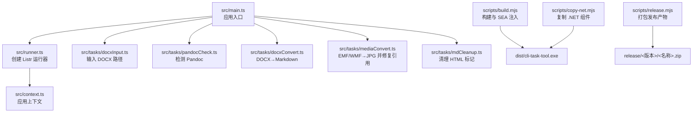
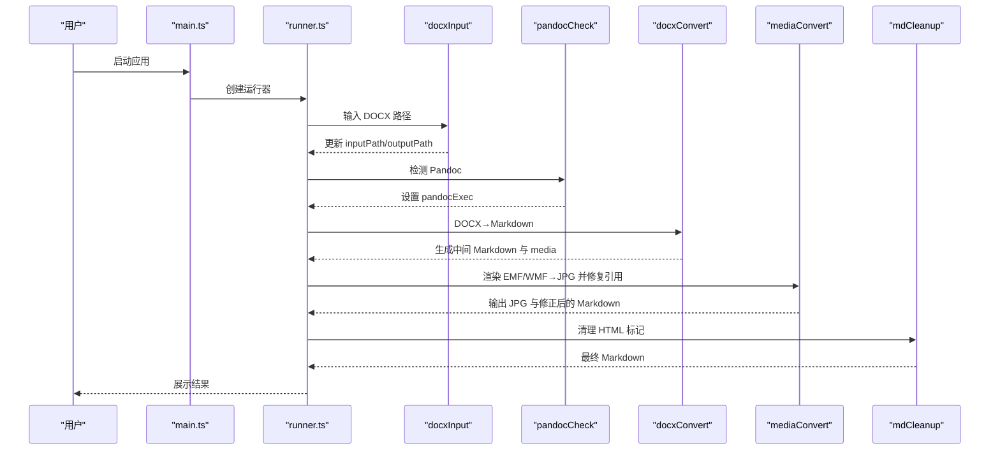
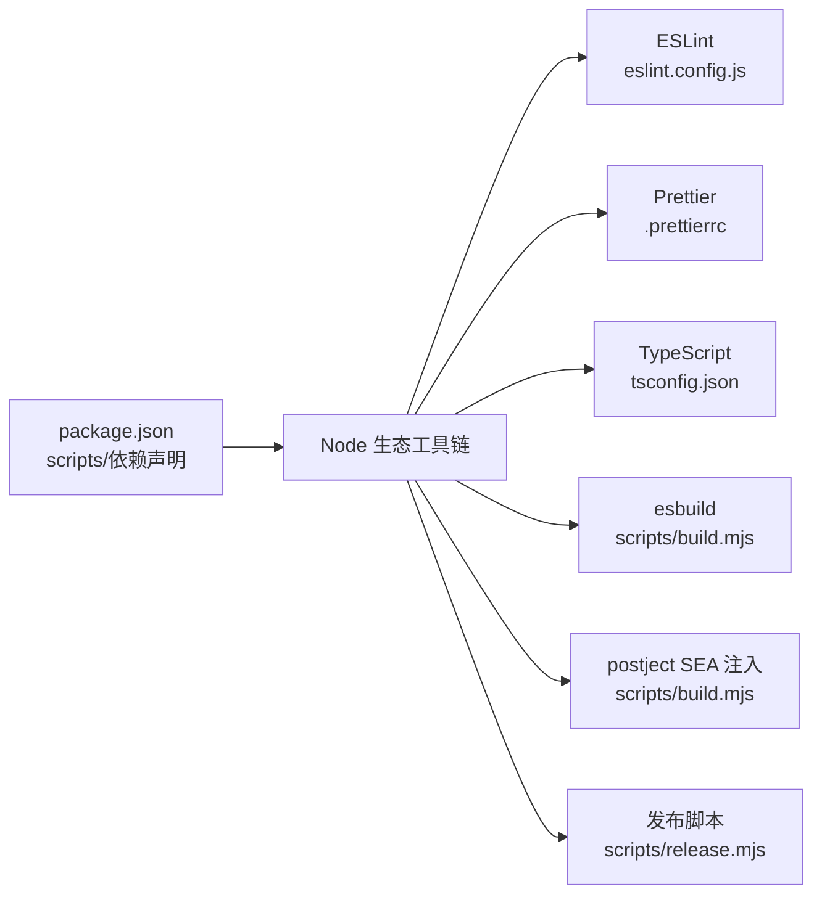

# 开发者指南

<cite>
**本文引用的文件**
- [package.json](file://package.json)
- [src/main.ts](file://src/main.ts)
- [src/context.ts](file://src/context.ts)
- [src/runner.ts](file://src/runner.ts)
- [src/utils.ts](file://src/utils.ts)
- [src/tasks/docxInput.ts](file://src/tasks/docxInput.ts)
- [src/tasks/pandocCheck.ts](file://src/tasks/pandocCheck.ts)
- [src/tasks/docxConvert.ts](file://src/tasks/docxConvert.ts)
- [src/tasks/mediaConvert.ts](file://src/tasks/mediaConvert.ts)
- [src/tasks/mdCleanup.ts](file://src/tasks/mdCleanup.ts)
- [scripts/build.mjs](file://scripts/build.mjs)
- [scripts/copy-net.mjs](file://scripts/copy-net.mjs)
- [scripts/release.mjs](file://scripts/release.mjs)
- [sea-config.json](file://sea-config.json)
- [eslint.config.js](file://eslint.config.js)
- [.prettierrc](file://.prettierrc)
- [tsconfig.json](file://tsconfig.json)
</cite>

## 目录
1. [简介](#简介)
2. [项目结构](#项目结构)
3. [核心组件](#核心组件)
4. [架构总览](#架构总览)
5. [详细组件分析](#详细组件分析)
6. [依赖关系分析](#依赖关系分析)
7. [性能考虑](#性能考虑)
8. [故障排除指南](#故障排除指南)
9. [结论](#结论)
10. [附录](#附录)

## 简介
本指南面向希望参与 doc2md-cli 项目开发的工程师，覆盖开发环境搭建、代码贡献流程、调试技巧、代码规范、测试策略、性能优化、扩展与自定义、故障排除以及项目维护与长期发展策略。项目采用 TypeScript 编写，使用 esbuild 打包为可执行程序，内置 .NET 元文件转换器以处理 EMF/WMF 矢量图。

## 项目结构
项目采用“功能模块化 + 任务管线”的组织方式：
- 核心入口负责创建上下文、初始化任务运行器并串行添加任务。
- 任务层按阶段拆分：输入收集、Pandoc 环境检查、DOCX 转 Markdown、媒体转换与路径修复、最终 Markdown 清理。
- 构建脚本负责 Node.js SEA 打包、注入 SEA Blob、复制 .NET 组件并产出独立可执行程序。
- 配置文件统一管理 ESLint、Prettier 和 TypeScript 编译选项。

图表来源
- [src/main.ts:1-41](file://src/main.ts#L1-L41)
- [src/runner.ts:1-10](file://src/runner.ts#L1-L10)
- [src/context.ts:1-21](file://src/context.ts#L1-L21)
- [src/tasks/docxInput.ts:1-52](file://src/tasks/docxInput.ts#L1-L52)
- [src/tasks/pandocCheck.ts:1-24](file://src/tasks/pandocCheck.ts#L1-L24)
- [src/tasks/docxConvert.ts:1-64](file://src/tasks/docxConvert.ts#L1-L64)
- [src/tasks/mediaConvert.ts:1-112](file://src/tasks/mediaConvert.ts#L1-L112)
- [src/tasks/mdCleanup.ts:1-373](file://src/tasks/mdCleanup.ts#L1-L373)
- [scripts/build.mjs:1-53](file://scripts/build.mjs#L1-L53)
- [scripts/copy-net.mjs:1-37](file://scripts/copy-net.mjs#L1-L37)
- [scripts/release.mjs:1-42](file://scripts/release.mjs#L1-L42)

章节来源
- [src/main.ts:1-41](file://src/main.ts#L1-L41)
- [src/runner.ts:1-10](file://src/runner.ts#L1-L10)
- [src/context.ts:1-21](file://src/context.ts#L1-L21)
- [scripts/build.mjs:1-53](file://scripts/build.mjs#L1-L53)
- [scripts/copy-net.mjs:1-37](file://scripts/copy-net.mjs#L1-L37)
- [scripts/release.mjs:1-42](file://scripts/release.mjs#L1-L42)

## 核心组件
- 应用上下文：封装输入路径、输出目录、Pandoc 可执行路径及中间态输出上下文。
- 任务运行器：基于 Listr2 创建串行任务流，支持子任务列表与进度提示。
- 任务集合：输入验证、环境检测、DOCX 转换、媒体转换与路径修复、Markdown 清理。
- 构建系统：esbuild 打包、Node SEA Blob 注入、.NET 组件复制、发布压缩。

章节来源
- [src/context.ts:1-21](file://src/context.ts#L1-L21)
- [src/runner.ts:1-10](file://src/runner.ts#L1-L10)
- [src/tasks/docxInput.ts:1-52](file://src/tasks/docxInput.ts#L1-L52)
- [src/tasks/pandocCheck.ts:1-24](file://src/tasks/pandocCheck.ts#L1-L24)
- [src/tasks/docxConvert.ts:1-64](file://src/tasks/docxConvert.ts#L1-L64)
- [src/tasks/mediaConvert.ts:1-112](file://src/tasks/mediaConvert.ts#L1-L112)
- [src/tasks/mdCleanup.ts:1-373](file://src/tasks/mdCleanup.ts#L1-L373)
- [scripts/build.mjs:1-53](file://scripts/build.mjs#L1-L53)
- [scripts/copy-net.mjs:1-37](file://scripts/copy-net.mjs#L1-L37)
- [scripts/release.mjs:1-42](file://scripts/release.mjs#L1-L42)

## 架构总览
应用以“任务驱动”的流水线方式工作：入口创建上下文与运行器，依次执行各阶段任务。每个任务可产生中间输出上下文，供后续任务复用；错误在顶层集中捕获并优雅提示或退出。

图表来源
- [src/main.ts:1-41](file://src/main.ts#L1-L41)
- [src/runner.ts:1-10](file://src/runner.ts#L1-L10)
- [src/tasks/docxInput.ts:1-52](file://src/tasks/docxInput.ts#L1-L52)
- [src/tasks/pandocCheck.ts:1-24](file://src/tasks/pandocCheck.ts#L1-L24)
- [src/tasks/docxConvert.ts:1-64](file://src/tasks/docxConvert.ts#L1-L64)
- [src/tasks/mediaConvert.ts:1-112](file://src/tasks/mediaConvert.ts#L1-L112)
- [src/tasks/mdCleanup.ts:1-373](file://src/tasks/mdCleanup.ts#L1-L373)

## 详细组件分析

### 应用入口与控制流
- 创建上下文与运行器，按顺序添加任务，异常在顶层捕获并区分用户中断与业务错误。
- 支持交互式暂停以便查看日志后退出。

章节来源
- [src/main.ts:1-41](file://src/main.ts#L1-L41)

### 任务运行器
- 基于 Listr2，启用子任务展开显示，便于观察中间步骤。

章节来源
- [src/runner.ts:1-10](file://src/runner.ts#L1-L10)

### 应用上下文
- 定义输入路径、输出目录、Pandoc 可执行路径与中间输出上下文，用于任务间数据传递。

章节来源
- [src/context.ts:1-21](file://src/context.ts#L1-L21)

### 输入阶段任务（docxInput）
- 交互式输入 .docx 路径，支持缓存读取与默认值，校验路径存在性，解析绝对/相对路径并设置输出目录。

章节来源
- [src/tasks/docxInput.ts:1-52](file://src/tasks/docxInput.ts#L1-L52)

### Pandoc 环境检查任务（pandocCheck）
- 通过系统命令检测 Pandoc 是否可用，不可用则抛出错误阻断流程。

章节来源
- [src/tasks/pandocCheck.ts:1-24](file://src/tasks/pandocCheck.ts#L1-L24)

### DOCX 转换任务（docxConvert）
- 使用 Pandoc 将 DOCX 转为 GitHub 风格 Markdown，提取媒体至独立目录，记录中间输出上下文。

章节来源
- [src/tasks/docxConvert.ts:1-64](file://src/tasks/docxConvert.ts#L1-L64)

### 媒体转换与路径修复任务（mediaConvert）
- 定位并调用 .NET 元文件转换器，批量将 EMF/WMF 渲染为 JPG，并修改 Markdown 中的图片引用为 JPG。

章节来源
- [src/tasks/mediaConvert.ts:1-112](file://src/tasks/mediaConvert.ts#L1-L112)

### Markdown 清理任务（mdCleanup）
- 基于状态机与正则规则，清理 Pandoc 输出中的 HTML 片段，转换行内图片标签，处理标题、表格、图片块等结构。

章节来源
- [src/tasks/mdCleanup.ts:1-373](file://src/tasks/mdCleanup.ts#L1-L373)

### 构建与发布脚本
- 构建脚本：esbuild 打包、生成 SEA Blob、复制 Node 可执行文件并注入 Blob、复制 .NET 组件。
- 复制脚本：将 .NET 运行时与依赖复制到 dist/module。
- 发布脚本：校验产物完整性、解包目录准备、压缩为 zip。

章节来源
- [scripts/build.mjs:1-53](file://scripts/build.mjs#L1-L53)
- [scripts/copy-net.mjs:1-37](file://scripts/copy-net.mjs#L1-L37)
- [scripts/release.mjs:1-42](file://scripts/release.mjs#L1-L42)
- [sea-config.json:1-6](file://sea-config.json#L1-L6)

### 工具函数（utils）
- 提供缓存加载与保存能力，用于持久化用户输入路径等信息。

章节来源
- [src/utils.ts](file://src/utils.ts)

## 依赖关系分析
- 运行时依赖：Listr2 任务运行、Inquirer 交互适配。
- 开发依赖：TypeScript、ESLint、Prettier、esbuild、postject、vitest。
- Node.js 版本与模块解析策略由 tsconfig 控制，构建产物输出至 dist。

图表来源
- [package.json:1-40](file://package.json#L1-L40)
- [eslint.config.js:1-26](file://eslint.config.js#L1-L26)
- [.prettierrc:1-8](file://.prettierrc#L1-L8)
- [tsconfig.json:1-19](file://tsconfig.json#L1-L19)
- [scripts/build.mjs:1-53](file://scripts/build.mjs#L1-L53)
- [scripts/release.mjs:1-42](file://scripts/release.mjs#L1-L42)

章节来源
- [package.json:1-40](file://package.json#L1-L40)
- [tsconfig.json:1-19](file://tsconfig.json#L1-L19)

## 性能考虑
- I/O 与进程调用
  - DOCX 转换与媒体渲染为 I/O 密集型，建议在任务内部并发控制为串行，避免磁盘争用与进程冲突。
  - 对大量媒体文件的处理，优先批量读取与顺序转换，减少多次进程启动开销。
- 正则与状态机
  - Markdown 清理使用多条正则与状态机，建议对大文件进行分块处理或流式读取，降低内存峰值。
- 构建与打包
  - esbuild 已启用最小化与 NodeNext 模式，建议保持模块化拆分，避免单文件过大。
  - SEA Blob 注入后可显著减少冷启动时间，但需注意发布包体积与依赖完整性。
- 缓存与复用
  - 利用缓存减少重复输入与路径解析成本，提升用户体验。

[本节为通用指导，无需列出章节来源]

## 故障排除指南
- Pandoc 未安装
  - 症状：环境检查失败并中断。
  - 处理：安装 Pandoc 并确保其在 PATH 中可用，再次运行。
  - 参考
    - [src/tasks/pandocCheck.ts:1-24](file://src/tasks/pandocCheck.ts#L1-L24)
- DOCX 路径无效
  - 症状：输入阶段提示路径不存在或为空。
  - 处理：确认路径存在且为 .docx 文件，支持绝对/相对路径。
  - 参考
    - [src/tasks/docxInput.ts:1-52](file://src/tasks/docxInput.ts#L1-L52)
- DOCX 转换失败
  - 症状：转换进程返回非零退出码，stderr 输出错误。
  - 处理：检查 Pandoc 版本与参数，确认输入文件无损坏。
  - 参考
    - [src/tasks/docxConvert.ts:1-64](file://src/tasks/docxConvert.ts#L1-L64)
- EMF/WMF 渲染失败
  - 症状：元文件转换器返回非零退出码。
  - 处理：确认 .NET 运行时与依赖已正确复制到 dist/module，检查目标文件权限。
  - 参考
    - [src/tasks/mediaConvert.ts:1-112](file://src/tasks/mediaConvert.ts#L1-L112)
- Markdown 清理异常
  - 症状：读取/写入失败或状态机未收敛。
  - 处理：检查中间文件完整性，关注警告输出，必要时分段调试。
  - 参考
    - [src/tasks/mdCleanup.ts:1-373](file://src/tasks/mdCleanup.ts#L1-L373)
- 构建/发布失败
  - 症状：缺少 dist/artifacts 或 ZIP 打包失败。
  - 处理：先执行构建，确保 dist/cli-task-tool.exe 与 dist/module 存在，再执行发布。
  - 参考
    - [scripts/build.mjs:1-53](file://scripts/build.mjs#L1-L53)
    - [scripts/release.mjs:1-42](file://scripts/release.mjs#L1-L42)

章节来源
- [src/tasks/pandocCheck.ts:1-24](file://src/tasks/pandocCheck.ts#L1-L24)
- [src/tasks/docxInput.ts:1-52](file://src/tasks/docxInput.ts#L1-L52)
- [src/tasks/docxConvert.ts:1-64](file://src/tasks/docxConvert.ts#L1-L64)
- [src/tasks/mediaConvert.ts:1-112](file://src/tasks/mediaConvert.ts#L1-L112)
- [src/tasks/mdCleanup.ts:1-373](file://src/tasks/mdCleanup.ts#L1-L373)
- [scripts/build.mjs:1-53](file://scripts/build.mjs#L1-L53)
- [scripts/release.mjs:1-42](file://scripts/release.mjs#L1-L42)

## 结论
本项目以清晰的任务管线与模块化设计实现了从 DOCX 到 Markdown 的端到端转换，并通过 SEA 打包与 .NET 组件集成保证了跨平台可执行性。遵循本文的开发与维护建议，可高效扩展新任务、优化性能并提升稳定性。

[本节为总结性内容，无需列出章节来源]

## 附录

### 开发环境搭建
- 安装 Node.js 与包管理器
  - 使用 pnpm 管理依赖，确保 Node 版本满足 tsconfig 目标。
- 安装 Pandoc
  - 确保 pandoc 可在命令行访问。
- 安装 .NET 8 运行时
  - 用于编译与运行元文件转换器。
- 初始化项目
  - 安装依赖后即可运行开发模式与构建脚本。

章节来源
- [package.json:1-40](file://package.json#L1-L40)
- [src/tasks/pandocCheck.ts:1-24](file://src/tasks/pandocCheck.ts#L1-L24)
- [scripts/copy-net.mjs:1-37](file://scripts/copy-net.mjs#L1-L37)

### 调试技巧
- 使用开发脚本
  - 通过开发模式启动，便于热调试与快速迭代。
- 逐步断点
  - 在任务内部关键节点设置断点，观察中间输出上下文。
- 日志与警告
  - 关注任务输出与清理阶段的警告，定位异常输入。

章节来源
- [package.json:7-16](file://package.json#L7-L16)
- [src/tasks/docxConvert.ts:1-64](file://src/tasks/docxConvert.ts#L1-L64)
- [src/tasks/mdCleanup.ts:1-373](file://src/tasks/mdCleanup.ts#L1-L373)

### 代码贡献流程
- 分支策略
  - 建议基于主分支创建特性分支，提交 PR 进行评审。
- 提交规范
  - 使用语义化提交信息，描述变更目的与影响范围。
- 本地验证
  - 运行格式化、静态检查与测试，确保通过后再提交。

章节来源
- [package.json:13-16](file://package.json#L13-L16)
- [eslint.config.js:1-26](file://eslint.config.js#L1-L26)
- [.prettierrc:1-8](file://.prettierrc#L1-L8)

### 代码规范
- ESLint 规则
  - 使用 TypeScript ESLint 插件，启用推荐规则，忽略未使用变量前缀，禁用分号。
- Prettier 规范
  - 单引号、无分号、100 字符行长、2 空格缩进、尾随逗号。
- TypeScript 配置
  - NodeNext 模块解析、严格模式、生成声明与 SourceMap。

章节来源
- [eslint.config.js:1-26](file://eslint.config.js#L1-L26)
- [.prettierrc:1-8](file://.prettierrc#L1-L8)
- [tsconfig.json:1-19](file://tsconfig.json#L1-L19)

### 测试策略
- 单元测试
  - 针对纯函数（如 Markdown 清理）编写测试，覆盖边界与异常路径。
- 集成测试
  - 使用真实文件与最小化依赖，验证端到端流程。
- 快速检查
  - 使用测试框架运行测试，确保回归问题及时发现。

章节来源
- [package.json:15-16](file://package.json#L15-L16)

### 性能优化建议
- I/O 与进程
  - 合理拆分任务，避免不必要的并发；对媒体处理采用顺序队列。
- 正则与状态机
  - 对大文件进行分块处理，减少一次性内存占用。
- 构建与打包
  - 保持模块粒度合理，利用 esbuild 与 SEA 减少启动与分发成本。

[本节为通用指导，无需列出章节来源]

### 扩展与自定义
- 添加新任务
  - 在 tasks 目录新增任务文件，遵循 ListrTask 接口，使用 ctx 传递数据。
  - 在入口中注册任务，确保顺序与依赖关系正确。
- 自定义转换规则
  - 在清理阶段增加正则或状态机分支，或引入外部工具链。
- 新增媒体类型
  - 在媒体转换任务中扩展类型识别与转换逻辑。

章节来源
- [src/tasks/docxInput.ts:1-52](file://src/tasks/docxInput.ts#L1-L52)
- [src/tasks/docxConvert.ts:1-64](file://src/tasks/docxConvert.ts#L1-L64)
- [src/tasks/mediaConvert.ts:1-112](file://src/tasks/mediaConvert.ts#L1-L112)
- [src/tasks/mdCleanup.ts:1-373](file://src/tasks/mdCleanup.ts#L1-L373)

### 故障排除清单
- 环境检查
  - Pandoc 是否安装并可执行。
  - .NET 运行时与依赖是否复制到 dist/module。
- 输入与路径
  - DOCX 路径是否存在，是否为 .docx 文件。
- 构建与发布
  - 构建脚本是否成功生成可执行文件与 SEA Blob。
  - 发布脚本是否校验通过并生成压缩包。

章节来源
- [src/tasks/pandocCheck.ts:1-24](file://src/tasks/pandocCheck.ts#L1-L24)
- [src/tasks/docxInput.ts:1-52](file://src/tasks/docxInput.ts#L1-L52)
- [scripts/build.mjs:1-53](file://scripts/build.mjs#L1-L53)
- [scripts/release.mjs:1-42](file://scripts/release.mjs#L1-L42)

### 社区支持与维护
- 社区资源
  - 通过仓库 issue/PR 参与讨论与贡献。
- 维护建议
  - 定期升级依赖与 Node/TypeScript 版本，保持兼容性。
  - 持续完善测试覆盖与文档，降低维护成本。

[本节为通用指导，无需列出章节来源]