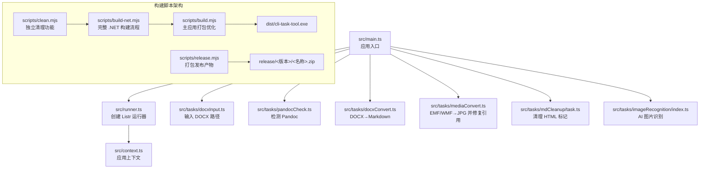
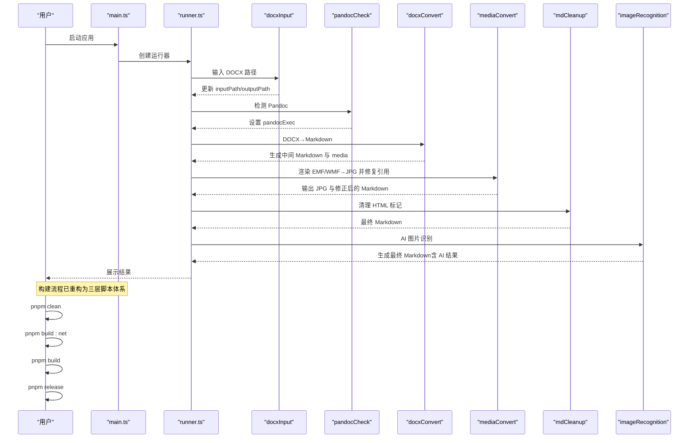
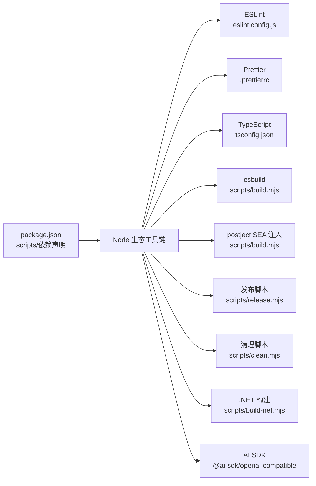

# 开发者指南

<cite>
**本文引用的文件**
- [README.md](file://README.md)
- [package.json](file://package.json)
- [src/main.ts](file://src/main.ts)
- [src/context.ts](file://src/context.ts)
- [src/runner.ts](file://src/runner.ts)
- [src/logger.ts](file://src/logger.ts)
- [src/utils.ts](file://src/utils.ts)
- [src/tasks/docxInput.ts](file://src/tasks/docxInput.ts)
- [src/tasks/pandocCheck.ts](file://src/tasks/pandocCheck.ts)
- [src/tasks/docxConvert.ts](file://src/tasks/docxConvert.ts)
- [src/tasks/mediaConvert.ts](file://src/tasks/mediaConvert.ts)
- [src/tasks/mdCleanup/task.ts](file://src/tasks/mdCleanup/task.ts)
- [src/tasks/imageRecognition/index.ts](file://src/tasks/imageRecognition/index.ts)
- [scripts/build.mjs](file://scripts/build.mjs)
- [scripts/build-net.mjs](file://scripts/build-net.mjs)
- [scripts/clean.mjs](file://scripts/clean.mjs)
- [scripts/release.mjs](file://scripts/release.mjs)
- [sea-config.json](file://sea-config.json)
- [eslint.config.js](file://eslint.config.js)
- [.prettierrc](file://.prettierrc)
- [tsconfig.json](file://tsconfig.json)
</cite>

## 目录
1. [简介](#简介)
2. [项目结构](#项目结构)
3. [核心组件](#核心组件)
4. [架构总览](#架构总览)
5. [详细组件分析](#详细组件分析)
6. [依赖关系分析](#依赖关系分析)
7. [性能考虑](#性能考虑)
8. [故障排除指南](#故障排除指南)
9. [结论](#结论)
10. [附录](#附录)

## 简介
本指南面向希望参与 doc2md-cli 项目开发的工程师，覆盖开发环境搭建、代码贡献流程、调试技巧、代码规范、测试策略、性能优化、扩展与自定义、故障排除以及项目维护与长期发展策略。项目采用 TypeScript 编写，使用 esbuild 打包为可执行程序，内置 .NET 元文件转换器以处理 EMF/WMF 矢量图，并集成了 AI 图像识别功能。

**重要更新**：项目现已完全转向以 README.md 为主要开发指南文档，替代了原有的 Kiro 规格文件结构。README.md 提供了完整的架构设计、使用说明、开发流程和项目结构信息。

## 项目结构
项目采用"功能模块化 + 任务管线"的组织方式，现已完全整合到 README.md 作为主要文档：
- 核心入口负责创建上下文、初始化任务运行器并串行添加任务
- 任务层按阶段拆分：输入收集、Pandoc 环境检查、DOCX 转 Markdown、媒体转换与路径修复、最终 Markdown 清理、AI 图像识别
- 构建脚本架构已重构为独立的清理、.NET 构建和主应用打包三个阶段，分别处理不同的构建需求
- 配置文件统一管理 ESLint、Prettier 和 TypeScript 编译选项

**图表来源**
- [src/main.ts:1-73](file://src/main.ts#L1-L73)
- [src/runner.ts:1-10](file://src/runner.ts#L1-L10)
- [src/context.ts:1-81](file://src/context.ts#L1-L81)
- [src/tasks/docxInput.ts:1-101](file://src/tasks/docxInput.ts#L1-L101)
- [src/tasks/pandocCheck.ts:1-28](file://src/tasks/pandocCheck.ts#L1-L28)
- [src/tasks/docxConvert.ts:1-85](file://src/tasks/docxConvert.ts#L1-L85)
- [src/tasks/mediaConvert.ts:1-170](file://src/tasks/mediaConvert.ts#L1-L170)
- [src/tasks/mdCleanup/task.ts:1-72](file://src/tasks/mdCleanup/task.ts#L1-L72)
- [src/tasks/imageRecognition/index.ts:1-11](file://src/tasks/imageRecognition/index.ts#L1-L11)
- [scripts/clean.mjs:1-23](file://scripts/clean.mjs#L1-L23)
- [scripts/build-net.mjs:1-45](file://scripts/build-net.mjs#L1-L45)
- [scripts/build.mjs:1-48](file://scripts/build.mjs#L1-L48)
- [scripts/release.mjs:1-42](file://scripts/release.mjs#L1-L42)

**章节来源**
- [src/main.ts:1-73](file://src/main.ts#L1-L73)
- [src/runner.ts:1-10](file://src/runner.ts#L1-L10)
- [src/context.ts:1-81](file://src/context.ts#L1-L81)
- [scripts/clean.mjs:1-23](file://scripts/clean.mjs#L1-L23)
- [scripts/build-net.mjs:1-45](file://scripts/build-net.mjs#L1-L45)
- [scripts/build.mjs:1-48](file://scripts/build.mjs#L1-L48)
- [scripts/release.mjs:1-42](file://scripts/release.mjs#L1-L42)

## 核心组件
- 应用上下文：封装输入路径、输出目录、Pandoc 可执行路径及中间态输出上下文，支持断点恢复机制
- 任务运行器：基于 Listr2 创建串行任务流，支持子任务列表与进度提示
- 任务集合：输入验证、环境检测、DOCX 转换、媒体转换与路径修复、Markdown 清理、AI 图像识别
- 日志系统：结构化日志记录，支持文件持久化和 TTY 输出
- **重构后的构建系统**：独立的清理脚本、.NET 构建脚本和主应用打包脚本，分别处理不同的构建阶段

**章节来源**
- [src/context.ts:1-81](file://src/context.ts#L1-L81)
- [src/runner.ts:1-10](file://src/runner.ts#L1-L10)
- [src/tasks/docxInput.ts:1-101](file://src/tasks/docxInput.ts#L1-L101)
- [src/tasks/pandocCheck.ts:1-28](file://src/tasks/pandocCheck.ts#L1-L28)
- [src/tasks/docxConvert.ts:1-85](file://src/tasks/docxConvert.ts#L1-L85)
- [src/tasks/mediaConvert.ts:1-170](file://src/tasks/mediaConvert.ts#L1-L170)
- [src/tasks/mdCleanup/task.ts:1-72](file://src/tasks/mdCleanup/task.ts#L1-L72)
- [src/tasks/imageRecognition/index.ts:1-11](file://src/tasks/imageRecognition/index.ts#L1-L11)
- [src/logger.ts:1-104](file://src/logger.ts#L1-L104)
- [scripts/clean.mjs:1-23](file://scripts/clean.mjs#L1-L23)
- [scripts/build-net.mjs:1-45](file://scripts/build-net.mjs#L1-L45)
- [scripts/build.mjs:1-48](file://scripts/build.mjs#L1-L48)
- [scripts/release.mjs:1-42](file://scripts/release.mjs#L1-L42)

## 架构总览
应用以"任务驱动"的流水线方式工作：入口创建上下文与运行器，依次执行各阶段任务。每个任务可产生中间输出上下文，供后续任务复用；错误在顶层集中捕获并优雅提示或退出。系统支持断点恢复机制，允许从任意步骤继续执行。

**更新**：构建架构已重构为三层分离的脚本体系，提供更精细的构建控制和更好的开发体验。

**图表来源**
- [src/main.ts:1-73](file://src/main.ts#L1-L73)
- [src/runner.ts:1-10](file://src/runner.ts#L1-L10)
- [src/tasks/docxInput.ts:1-101](file://src/tasks/docxInput.ts#L1-L101)
- [src/tasks/pandocCheck.ts:1-28](file://src/tasks/pandocCheck.ts#L1-L28)
- [src/tasks/docxConvert.ts:1-85](file://src/tasks/docxConvert.ts#L1-L85)
- [src/tasks/mediaConvert.ts:1-170](file://src/tasks/mediaConvert.ts#L1-L170)
- [src/tasks/mdCleanup/task.ts:1-72](file://src/tasks/mdCleanup/task.ts#L1-L72)
- [src/tasks/imageRecognition/index.ts:1-11](file://src/tasks/imageRecognition/index.ts#L1-L11)
- [scripts/clean.mjs:1-23](file://scripts/clean.mjs#L1-L23)
- [scripts/build-net.mjs:1-45](file://scripts/build-net.mjs#L1-L45)
- [scripts/build.mjs:1-48](file://scripts/build.mjs#L1-L48)
- [scripts/release.mjs:1-42](file://scripts/release.mjs#L1-L42)

## 详细组件分析

### 应用入口与控制流
- 创建上下文与运行器，按顺序添加任务，异常在顶层捕获并区分用户中断与业务错误
- 支持交互式暂停以便查看日志后退出
- 实现断点恢复机制，通过 `withSkipOnResume` 函数跳过已完成的任务

**章节来源**
- [src/main.ts:1-73](file://src/main.ts#L1-L73)

### 任务运行器
- 基于 Listr2，启用子任务展开显示，便于观察中间步骤
- 支持并发控制，某些任务（如 AI 图像识别）使用串行执行

**章节来源**
- [src/runner.ts:1-10](file://src/runner.ts#L1-L10)

### 应用上下文
- 定义输入路径、输出目录、Pandoc 可执行路径与中间输出上下文，用于任务间数据传递
- 支持断点恢复机制，包含恢复点映射和上下文持久化功能
- 提供输出上下文的保存和加载功能

**章节来源**
- [src/context.ts:1-81](file://src/context.ts#L1-L81)

### 日志系统
- 结构化日志记录，支持 DEBUG/INFO/WARN/ERROR 四种级别
- 自动创建带时间戳的日志文件，支持 TTY 和文件双重输出
- 提供日志路径查询和实例管理功能

**章节来源**
- [src/logger.ts:1-104](file://src/logger.ts#L1-L104)

### 输入阶段任务（docxInput）
- 交互式输入 .docx 路径，支持缓存读取与默认值，校验路径存在性，解析绝对/相对路径并设置输出目录
- 实现断点恢复功能，检测现有输出并提供从指定步骤继续的选项
- 支持多种恢复点：矢量图渲染、Markdown 清理、AI 图片识别

**章节来源**
- [src/tasks/docxInput.ts:1-101](file://src/tasks/docxInput.ts#L1-L101)

### Pandoc 环境检查任务（pandocCheck）
- 通过系统命令检测 Pandoc 是否可用，不可用则抛出错误阻断流程
- 支持全局安装检测和错误处理

**章节来源**
- [src/tasks/pandocCheck.ts:1-28](file://src/tasks/pandocCheck.ts#L1-L28)

### DOCX 转换任务（docxConvert）
- 使用 Pandoc 将 DOCX 转为 GitHub 风格 Markdown，提取媒体至独立目录，记录中间输出上下文
- 支持媒体文件提取和目录结构创建

**章节来源**
- [src/tasks/docxConvert.ts:1-85](file://src/tasks/docxConvert.ts#L1-L85)

### 媒体转换与路径修复任务（mediaConvert）
- 定位并调用 .NET 元文件转换器，批量将 EMF/WMF 渲染为 JPG，并修改 Markdown 中的图片引用为 JPG
- 支持不同运行环境（SEA vs 开发）下的可执行文件定位
- 实现矢量图转换和普通图片复制的双路径处理

**章节来源**
- [src/tasks/mediaConvert.ts:1-170](file://src/tasks/mediaConvert.ts#L1-L170)

### Markdown 清理任务（mdCleanup）
- 基于状态机与正则规则，清理 Pandoc 输出中的 HTML 片段，转换行内图片标签，处理标题、表格、图片块等结构
- 支持警告输出和错误处理

**章节来源**
- [src/tasks/mdCleanup/task.ts:1-72](file://src/tasks/mdCleanup/task.ts#L1-L72)

### AI 图像识别任务（imageRecognition）
- 集成 AI 图像识别功能，支持配置 AI 服务和处理图片识别任务
- 通过子任务实现配置和处理的分离

**章节来源**
- [src/tasks/imageRecognition/index.ts:1-11](file://src/tasks/imageRecognition/index.ts#L1-L11)

### 重构后的构建系统

#### 独立清理脚本（clean.mjs）
- **全新功能**：专门负责清理构建过程产生的临时目录和文件
- 支持清理 dist 目录、.NET 项目的 bin 和 obj 输出目录
- 提供详细的清理进度反馈和错误处理

**章节来源**
- [scripts/clean.mjs:1-23](file://scripts/clean.mjs#L1-L23)

#### .NET 构建脚本（build-net.mjs）
- **全新功能**：完整的 .NET 元文件转换器构建流程
- 自动编译 .NET 项目到 Release 模式
- 精确复制必要的运行时文件和依赖项到 dist/module
- 包含 Windows 平台特定的运行时实现文件

**章节来源**
- [scripts/build-net.mjs:1-45](file://scripts/build-net.mjs#L1-L45)

#### 主应用打包脚本（build.mjs）
- **优化更新**：专注于主应用的 esbuild 打包和 SEA Blob 注入
- 使用 esbuild 将 src/main.ts 打包为 dist/bundle.cjs
- 生成 SEA Blob 并注入到 Node.js 可执行文件
- 支持最小化和导入元信息替换

**章节来源**
- [scripts/build.mjs:1-48](file://scripts/build.mjs#L1-L48)

#### 发布脚本（release.mjs）
- 校验构建产物完整性，确保 dist/cli-task-tool.exe 和 dist/module 存在
- 解包目录准备和 ZIP 压缩
- 支持版本化的发布目录结构

**章节来源**
- [scripts/release.mjs:1-42](file://scripts/release.mjs#L1-L42)

### 工具函数（utils）
- 提供缓存加载与保存能力，用于持久化用户输入路径等信息
- 支持输入验证和提示样式等功能

**章节来源**
- [src/utils.ts](file://src/utils.ts)

## 依赖关系分析
- 运行时依赖：Listr2 任务运行、Inquirer 交互适配、AI SDK、OpenAI 兼容接口
- 开发依赖：TypeScript、ESLint、Prettier、esbuild、postject、vitest
- **重构后的构建依赖**：独立的清理、.NET 构建和主应用打包三个阶段的工具链
- Node.js 版本与模块解析策略由 tsconfig 控制，构建产物输出至 dist

**图表来源**
- [package.json:1-42](file://package.json#L1-L42)
- [eslint.config.js:1-26](file://eslint.config.js#L1-L26)
- [.prettierrc:1-8](file://.prettierrc#L1-L8)
- [tsconfig.json:1-19](file://tsconfig.json#L1-L19)
- [scripts/build.mjs:1-48](file://scripts/build.mjs#L1-L48)
- [scripts/build-net.mjs:1-45](file://scripts/build-net.mjs#L1-L45)
- [scripts/clean.mjs:1-23](file://scripts/clean.mjs#L1-L23)
- [scripts/release.mjs:1-42](file://scripts/release.mjs#L1-L42)

**章节来源**
- [package.json:1-42](file://package.json#L1-L42)
- [tsconfig.json:1-19](file://tsconfig.json#L1-L19)

## 性能考虑
- I/O 与进程调用
  - DOCX 转换与媒体渲染为 I/O 密集型，建议在任务内部并发控制为串行，避免磁盘争用与进程冲突
  - 对大量媒体文件的处理，优先批量读取与顺序转换，减少多次进程启动开销
- 正则与状态机
  - Markdown 清理使用多条正则与状态机，建议对大文件进行分块处理或流式读取，降低内存峰值
- **重构后的构建性能**
  - 独立清理脚本避免重复构建过程中的文件冲突
  - .NET 构建脚本仅处理必要的运行时文件，减少不必要的文件复制
  - 主应用打包脚本专注于核心应用逻辑，提高构建效率
- 缓存与复用
  - 利用缓存减少重复输入与路径解析成本，提升用户体验
- AI 处理
  - AI 图像识别任务可能耗时较长，建议在用户界面中提供进度反馈

## 故障排除指南
- Pandoc 未安装
  - 症状：环境检查失败并中断
  - 处理：安装 Pandoc 并确保其在 PATH 中可用，再次运行
  - 参考
    - [src/tasks/pandocCheck.ts:1-28](file://src/tasks/pandocCheck.ts#L1-L28)
- DOCX 路径无效
  - 症状：输入阶段提示路径不存在或为空
  - 处理：确认路径存在且为 .docx 文件，支持绝对/相对路径
  - 参考
    - [src/tasks/docxInput.ts:1-101](file://src/tasks/docxInput.ts#L1-L101)
- DOCX 转换失败
  - 症状：转换进程返回非零退出码，stderr 输出错误
  - 处理：检查 Pandoc 版本与参数，确认输入文件无损坏
  - 参考
    - [src/tasks/docxConvert.ts:1-85](file://src/tasks/docxConvert.ts#L1-L85)
- EMF/WMF 渲染失败
  - 症状：元文件转换器返回非零退出码
  - 处理：确认 .NET 运行时与依赖已正确复制到 dist/module，检查目标文件权限
  - 参考
    - [src/tasks/mediaConvert.ts:1-170](file://src/tasks/mediaConvert.ts#L1-L170)
- Markdown 清理异常
  - 症状：读取/写入失败或状态机未收敛
  - 处理：检查中间文件完整性，关注警告输出，必要时分段调试
  - 参考
    - [src/tasks/mdCleanup/task.ts:1-72](file://src/tasks/mdCleanup/task.ts#L1-L72)
- AI 图像识别失败
  - 症状：AI 服务连接失败或识别结果异常
  - 处理：检查 AI 服务配置，确认网络连接和认证信息
  - 参考
    - [src/tasks/imageRecognition/index.ts:1-11](file://src/tasks/imageRecognition/index.ts#L1-L11)
- **重构后的构建问题**
  - 清理失败：检查文件权限和锁定状态，确保没有进程占用目标目录
  - .NET 构建失败：确认 dotnet SDK 已安装，检查项目文件路径和依赖
  - 主应用打包失败：验证 esbuild 和 postject 版本兼容性
  - 发布失败：检查 dist 目录结构和文件完整性
  - 参考
    - [scripts/clean.mjs:1-23](file://scripts/clean.mjs#L1-L23)
    - [scripts/build-net.mjs:1-45](file://scripts/build-net.mjs#L1-L45)
    - [scripts/build.mjs:1-48](file://scripts/build.mjs#L1-L48)
    - [scripts/release.mjs:1-42](file://scripts/release.mjs#L1-L42)

**章节来源**
- [src/tasks/pandocCheck.ts:1-28](file://src/tasks/pandocCheck.ts#L1-L28)
- [src/tasks/docxInput.ts:1-101](file://src/tasks/docxInput.ts#L1-L101)
- [src/tasks/docxConvert.ts:1-85](file://src/tasks/docxConvert.ts#L1-L85)
- [src/tasks/mediaConvert.ts:1-170](file://src/tasks/mediaConvert.ts#L1-L170)
- [src/tasks/mdCleanup/task.ts:1-72](file://src/tasks/mdCleanup/task.ts#L1-L72)
- [src/tasks/imageRecognition/index.ts:1-11](file://src/tasks/imageRecognition/index.ts#L1-L11)
- [scripts/clean.mjs:1-23](file://scripts/clean.mjs#L1-L23)
- [scripts/build-net.mjs:1-45](file://scripts/build-net.mjs#L1-L45)
- [scripts/build.mjs:1-48](file://scripts/build.mjs#L1-L48)
- [scripts/release.mjs:1-42](file://scripts/release.mjs#L1-L42)

## 结论
本项目以清晰的任务管线与模块化设计实现了从 DOCX 到 Markdown 的端到端转换，并通过重构后的三层构建脚本体系保证了更好的开发体验和构建效率。新增的独立清理、.NET 构建和主应用打包脚本提供了更精细的构建控制，同时通过 SEA 打包与 .NET 组件集成保证了跨平台可执行性。新增的 AI 图像识别功能进一步提升了文档转换的质量。遵循本文的开发与维护建议，可高效扩展新任务、优化性能并提升稳定性。

## 附录

### 开发环境搭建
- 安装 Node.js 与包管理器
  - 使用 pnpm 管理依赖，确保 Node 版本满足 tsconfig 目标
- 安装 Pandoc
  - 确保 pandoc 可在命令行访问
- 安装 .NET 8 运行时
  - 用于编译与运行元文件转换器
- **新增**：安装 dotnet SDK
  - 用于 .NET 项目的构建和编译
- 初始化项目
  - 安装依赖后即可运行开发模式与构建脚本

**章节来源**
- [package.json:1-42](file://package.json#L1-L42)
- [src/tasks/pandocCheck.ts:1-28](file://src/tasks/pandocCheck.ts#L1-L28)
- [scripts/build-net.mjs:1-45](file://scripts/build-net.mjs#L1-L45)

### 调试技巧
- 使用开发脚本
  - 通过开发模式启动，便于热调试与快速迭代
- 逐步断点
  - 在任务内部关键节点设置断点，观察中间输出上下文
- 日志与警告
  - 关注任务输出与清理阶段的警告，定位异常输入
- 断点恢复测试
  - 利用断点恢复机制测试任务的幂等性和数据一致性
- **新增**：构建脚本调试
  - 使用独立的构建脚本进行分阶段调试，便于定位构建问题

**章节来源**
- [package.json:7-16](file://package.json#L7-L16)
- [src/tasks/docxConvert.ts:1-85](file://src/tasks/docxConvert.ts#L1-L85)
- [src/tasks/mdCleanup/task.ts:1-72](file://src/tasks/mdCleanup/task.ts#L1-L72)
- [scripts/clean.mjs:1-23](file://scripts/clean.mjs#L1-L23)
- [scripts/build-net.mjs:1-45](file://scripts/build-net.mjs#L1-L45)
- [scripts/build.mjs:1-48](file://scripts/build.mjs#L1-L48)

### 代码贡献流程
- 分支策略
  - 建议基于主分支创建特性分支，提交 PR 进行评审
- 提交规范
  - 使用语义化提交信息，描述变更目的与影响范围
- 本地验证
  - 运行格式化、静态检查与测试，确保通过后再提交
- **新增**：构建脚本贡献
  - 修改构建脚本时，确保向后兼容性并提供相应的清理脚本

**章节来源**
- [package.json:13-16](file://package.json#L13-L16)
- [eslint.config.js:1-26](file://eslint.config.js#L1-L26)
- [.prettierrc:1-8](file://.prettierrc#L1-L8)

### 代码规范
- ESLint 规则
  - 使用 TypeScript ESLint 插件，启用推荐规则，忽略未使用变量前缀，禁用分号
- Prettier 规范
  - 单引号、无分号、100 字符行长、2 空格缩进、尾随逗号
- TypeScript 配置
  - NodeNext 模块解析、严格模式、生成声明与 SourceMap
- **新增**：构建脚本规范
  - 使用标准的 Node.js 文件系统 API
  - 提供详细的错误处理和进度反馈

**章节来源**
- [eslint.config.js:1-26](file://eslint.config.js#L1-L26)
- [.prettierrc:1-8](file://.prettierrc#L1-L8)
- [tsconfig.json:1-19](file://tsconfig.json#L1-L19)

### 测试策略
- 单元测试
  - 针对纯函数（如 Markdown 清理）编写测试，覆盖边界与异常路径
- 集成测试
  - 使用真实文件与最小化依赖，验证端到端流程
- 快速检查
  - 使用测试框架运行测试，确保回归问题及时发现
- **新增**：构建脚本测试
  - 验证清理脚本的文件清理效果
  - 测试 .NET 构建脚本的文件复制完整性
  - 确认主应用打包脚本的 SEA Blob 注入成功

**章节来源**
- [package.json:15-16](file://package.json#L15-L16)

### 性能优化建议
- I/O 与进程
  - 合理拆分任务，避免不必要的并发；对媒体处理采用顺序队列
- 正则与状态机
  - 对大文件进行分块处理，减少一次性内存占用
- **重构后的构建优化**
  - 利用独立清理脚本避免重复构建的文件冲突
  - 优化 .NET 构建脚本的文件复制策略
  - 使用增量构建减少不必要的打包操作
- AI 处理
  - 考虑异步处理和超时控制，避免阻塞主线程

### 扩展与自定义
- 添加新任务
  - 在 tasks 目录新增任务文件，遵循 ListrTask 接口，使用 ctx 传递数据
  - 在入口中注册任务，确保顺序与依赖关系正确
- 自定义转换规则
  - 在清理阶段增加正则或状态机分支，或引入外部工具链
- 新增媒体类型
  - 在媒体转换任务中扩展类型识别与转换逻辑
- AI 集成
  - 通过 imageRecognition 目录结构扩展更多 AI 功能
- **新增**：构建脚本扩展
  - 在 scripts 目录添加新的构建阶段脚本
  - 遵循现有的清理、构建、打包模式

**章节来源**
- [src/tasks/docxInput.ts:1-101](file://src/tasks/docxInput.ts#L1-L101)
- [src/tasks/docxConvert.ts:1-85](file://src/tasks/docxConvert.ts#L1-L85)
- [src/tasks/mediaConvert.ts:1-170](file://src/tasks/mediaConvert.ts#L1-L170)
- [src/tasks/mdCleanup/task.ts:1-72](file://src/tasks/mdCleanup/task.ts#L1-L72)
- [src/tasks/imageRecognition/index.ts:1-11](file://src/tasks/imageRecognition/index.ts#L1-L11)

### 故障排除清单
- 环境检查
  - Pandoc 是否安装并可执行
  - .NET 运行时与依赖是否复制到 dist/module
  - **新增**：dotnet SDK 是否可用
- 输入与路径
  - DOCX 路径是否存在，是否为 .docx 文件
- 构建与发布
  - **重构后的构建检查清单**：
  - 清理脚本是否成功清理临时目录
  - .NET 构建脚本是否正确复制所有必需文件
  - 主应用打包脚本是否成功生成 SEA Blob
  - 发布脚本是否校验通过并生成压缩包
- 断点恢复
  - context.json 文件是否存在且格式正确
  - 恢复点映射是否正确

**章节来源**
- [src/tasks/pandocCheck.ts:1-28](file://src/tasks/pandocCheck.ts#L1-L28)
- [src/tasks/docxInput.ts:1-101](file://src/tasks/docxInput.ts#L1-L101)
- [scripts/clean.mjs:1-23](file://scripts/clean.mjs#L1-L23)
- [scripts/build-net.mjs:1-45](file://scripts/build-net.mjs#L1-L45)
- [scripts/build.mjs:1-48](file://scripts/build.mjs#L1-L48)
- [scripts/release.mjs:1-42](file://scripts/release.mjs#L1-L42)

### 社区支持与维护
- 社区资源
  - 通过仓库 issue/PR 参与讨论与贡献
- 维护建议
  - 定期升级依赖与 Node/TypeScript 版本，保持兼容性
  - 持续完善测试覆盖与文档，降低维护成本
  - **新增**：定期审查和优化构建脚本
- 文档维护
  - README.md 作为主要开发指南，确保文档与代码同步更新

### 重要更新说明
- **构建脚本架构重构**：项目已完全重构为三层独立的构建脚本体系
- 文档结构转变：项目已完全转向以 README.md 为主要开发指南，替代了原有的 Kiro 规格文件
- 新增 AI 功能：集成了 AI 图像识别功能，支持公式和图表的智能识别
- 断点恢复增强：改进了断点恢复机制，支持从多个关键步骤继续执行
- 日志系统优化：增强了日志记录功能，提供更好的调试体验
- **新增**：独立清理功能（clean.mjs）提供精确的构建环境清理
- **新增**：完整 .NET 构建流程（build-net.mjs）确保运行时依赖的完整性
- **新增**：优化的主应用打包（build.mjs）专注于核心应用逻辑的打包

**章节来源**
- [README.md:1-258](file://README.md#L1-L258)
- [src/main.ts:1-73](file://src/main.ts#L1-L73)
- [src/context.ts:1-81](file://src/context.ts#L1-L81)
- [src/logger.ts:1-104](file://src/logger.ts#L1-L104)
- [scripts/clean.mjs:1-23](file://scripts/clean.mjs#L1-L23)
- [scripts/build-net.mjs:1-45](file://scripts/build-net.mjs#L1-L45)
- [scripts/build.mjs:1-48](file://scripts/build.mjs#L1-L48)
- [scripts/release.mjs:1-42](file://scripts/release.mjs#L1-L42)