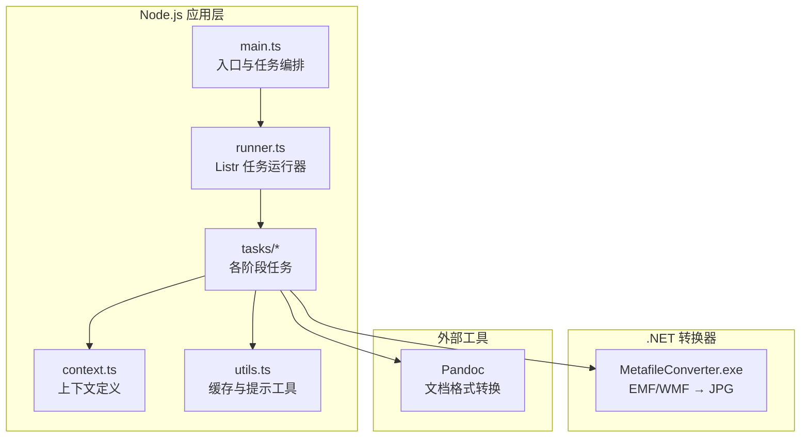
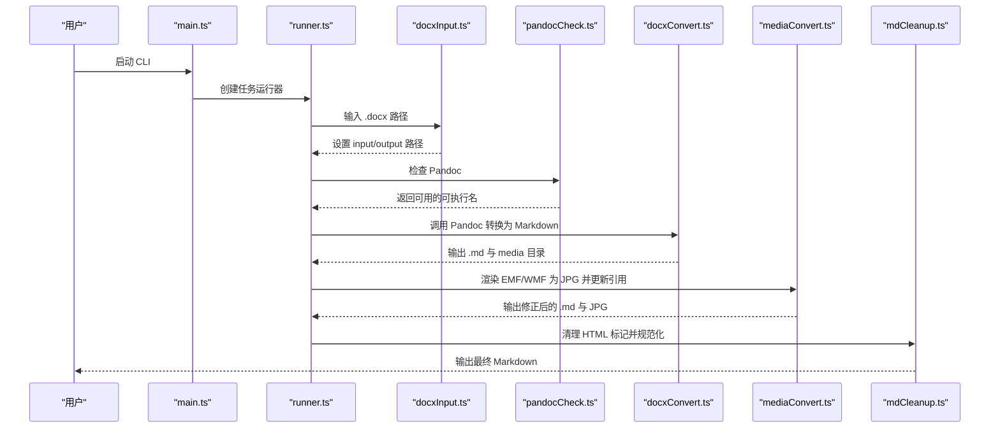
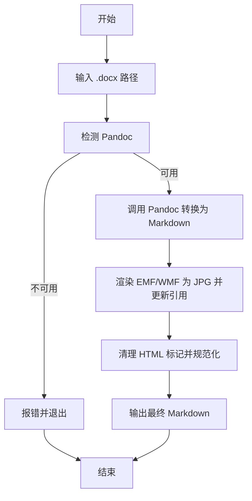
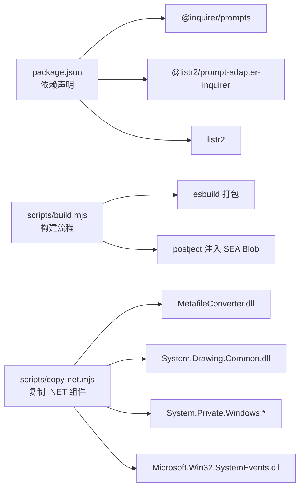

# 快速开始

<cite>
**本文引用的文件**
- [package.json](file://package.json)
- [src/main.ts](file://src/main.ts)
- [src/context.ts](file://src/context.ts)
- [src/runner.ts](file://src/runner.ts)
- [src/utils.ts](file://src/utils.ts)
- [src/tasks/docxInput.ts](file://src/tasks/docxInput.ts)
- [src/tasks/pandocCheck.ts](file://src/tasks/pandocCheck.ts)
- [src/tasks/docxConvert.ts](file://src/tasks/docxConvert.ts)
- [src/tasks/mediaConvert.ts](file://src/tasks/mediaConvert.ts)
- [src/tasks/mdCleanup.ts](file://src/tasks/mdCleanup.ts)
- [scripts/build.mjs](file://scripts/build.mjs)
- [scripts/copy-net.mjs](file://scripts/copy-net.mjs)
- [module/MetafileConverter/MetafileConverter/Program.cs](file://module/MetafileConverter/MetafileConverter/Program.cs)
- [out/docxConvert/test.md](file://out/docxConvert/test.md)
- [out/mediaConvert/test.md](file://out/mediaConvert/test.md)
- [out/mdCleanup/test.md](file://out/mdCleanup/test.md)
</cite>

## 目录
1. [简介](#简介)
2. [项目结构](#项目结构)
3. [核心组件](#核心组件)
4. [架构总览](#架构总览)
5. [详细组件分析](#详细组件分析)
6. [依赖分析](#依赖分析)
7. [性能考虑](#性能考虑)
8. [故障排除指南](#故障排除指南)
9. [结论](#结论)
10. [附录](#附录)

## 简介
本指南面向新手开发者，帮助你在约 10 分钟内完成 Doc2XML CLI 的安装与首次运行。你将学会：
- 安装 Node.js 与包管理器
- 安装 Pandoc 并确保其可用
- 准备必要的系统依赖（.NET 运行时与 Windows 图形相关组件）
- 使用交互式 CLI 完成从 .docx 到 Markdown 的转换
- 查看输出结果与常见问题排查

## 项目结构
该项目采用“前端 Node.js 任务编排 + 后端 .NET 元文件转换器”的混合架构：
- Node.js 层负责用户交互、任务编排、Pandoc 检测与调用、Markdown 清理与媒体处理
- .NET 层提供 EMF/WMF 到 JPG 的高质量渲染工具
- 构建脚本将 Node.js 打包为可执行文件，并内嵌 .NET 转换器

图表来源
- [src/main.ts:1-41](file://src/main.ts#L1-L41)
- [src/runner.ts:1-10](file://src/runner.ts#L1-L10)
- [src/context.ts:1-21](file://src/context.ts#L1-L21)
- [src/tasks/docxInput.ts:1-52](file://src/tasks/docxInput.ts#L1-L52)
- [src/tasks/pandocCheck.ts:1-24](file://src/tasks/pandocCheck.ts#L1-L24)
- [src/tasks/docxConvert.ts:1-64](file://src/tasks/docxConvert.ts#L1-L64)
- [src/tasks/mediaConvert.ts:1-112](file://src/tasks/mediaConvert.ts#L1-L112)
- [src/tasks/mdCleanup.ts:1-373](file://src/tasks/mdCleanup.ts#L1-L373)
- [module/MetafileConverter/MetafileConverter/Program.cs:1-88](file://module/MetafileConverter/MetafileConverter/Program.cs#L1-L88)

章节来源
- [src/main.ts:1-41](file://src/main.ts#L1-L41)
- [src/runner.ts:1-10](file://src/runner.ts#L1-L10)
- [src/context.ts:1-21](file://src/context.ts#L1-L21)

## 核心组件
- 任务编排器：使用 Listr2 管理串行任务流水线，支持子任务与进度输出
- 输入任务：交互式收集 .docx 路径，支持绝对/相对路径与缓存默认值
- Pandoc 检测：校验系统是否安装并可执行 Pandoc
- 文档转换：调用 Pandoc 将 .docx 转为 GitHub 风格 Markdown，并提取媒体资源
- 媒体转换：将 EMF/WMF 渲染为 JPG，并更新 Markdown 中的图片引用
- Markdown 清理：移除 HTML 特征标记、修复标题层级、保留表格与图片引用
- 构建脚本：打包 Node.js、注入 SEA Blob，并复制 .NET 转换器到 dist/module

章节来源
- [src/tasks/docxInput.ts:1-52](file://src/tasks/docxInput.ts#L1-L52)
- [src/tasks/pandocCheck.ts:1-24](file://src/tasks/pandocCheck.ts#L1-L24)
- [src/tasks/docxConvert.ts:1-64](file://src/tasks/docxConvert.ts#L1-L64)
- [src/tasks/mediaConvert.ts:1-112](file://src/tasks/mediaConvert.ts#L1-L112)
- [src/tasks/mdCleanup.ts:1-373](file://src/tasks/mdCleanup.ts#L1-L373)
- [scripts/build.mjs:1-53](file://scripts/build.mjs#L1-L53)
- [scripts/copy-net.mjs:1-37](file://scripts/copy-net.mjs#L1-L37)

## 架构总览
下面的序列图展示了从启动到生成最终 Markdown 的完整流程。

图表来源
- [src/main.ts:1-41](file://src/main.ts#L1-L41)
- [src/runner.ts:1-10](file://src/runner.ts#L1-L10)
- [src/tasks/docxInput.ts:1-52](file://src/tasks/docxInput.ts#L1-L52)
- [src/tasks/pandocCheck.ts:1-24](file://src/tasks/pandocCheck.ts#L1-L24)
- [src/tasks/docxConvert.ts:1-64](file://src/tasks/docxConvert.ts#L1-L64)
- [src/tasks/mediaConvert.ts:1-112](file://src/tasks/mediaConvert.ts#L1-L112)
- [src/tasks/mdCleanup.ts:1-373](file://src/tasks/mdCleanup.ts#L1-L373)

## 详细组件分析

### 安装与准备
- Node.js 与包管理器
  - 使用包管理器安装项目依赖，确保 Node.js 版本满足项目要求
  - 参考脚本与依赖声明了解运行与构建所需工具
- Pandoc
  - 系统需安装 Pandoc 并可在命令行直接调用
  - 任务会在启动时检测 Pandoc 是否可用
- .NET 与系统图形依赖
  - .NET 运行时与 Windows 图形相关组件用于 EMF/WMF 渲染
  - 构建脚本会复制必要 DLL 与运行时配置到 dist/module

章节来源
- [package.json:1-40](file://package.json#L1-L40)
- [src/tasks/pandocCheck.ts:1-24](file://src/tasks/pandocCheck.ts#L1-L24)
- [scripts/copy-net.mjs:1-37](file://scripts/copy-net.mjs#L1-L37)
- [module/MetafileConverter/MetafileConverter/Program.cs:1-88](file://module/MetafileConverter/MetafileConverter/Program.cs#L1-L88)

### 基本使用步骤
- 运行开发模式（自动构建 .NET 并启动）
  - 使用开发脚本启动应用，自动构建 .NET 模块并运行 TypeScript 入口
- 运行生产可执行文件
  - 构建完成后生成独立可执行文件，包含 Node.js SEA Blob 与 .NET 转换器
- 交互式输入 .docx 路径
  - 支持绝对/相对路径，会缓存最近使用的路径以便下次更快开始
- 查看输出
  - 转换结果位于与输入文件同级的 out 目录下，按阶段拆分子目录
  - 最终产物为规范化的 Markdown 文件与媒体资源

章节来源
- [package.json:7-16](file://package.json#L7-L16)
- [scripts/build.mjs:1-53](file://scripts/build.mjs#L1-L53)
- [src/tasks/docxInput.ts:1-52](file://src/tasks/docxInput.ts#L1-L52)
- [out/docxConvert/test.md:1-200](file://out/docxConvert/test.md#L1-L200)
- [out/mediaConvert/test.md:1-200](file://out/mediaConvert/test.md#L1-L200)
- [out/mdCleanup/test.md:1-128](file://out/mdCleanup/test.md#L1-L128)

### 常见命令与参数
- 开发模式
  - 运行开发脚本以自动构建 .NET 并启动 TypeScript 入口
- 构建可执行文件
  - 生成 SEA 包含的可执行文件，并复制 .NET 转换器
- 任务参数
  - Pandoc 调用参数由转换任务统一构造，包含输入输出、格式、媒体提取与标题风格
  - 媒体转换任务会扫描 media 目录中的 EMF/WMF 并渲染为 JPG
  - Markdown 清理任务基于状态机规则移除 HTML 特征并规范化标题与图片引用

章节来源
- [package.json:7-16](file://package.json#L7-L16)
- [scripts/build.mjs:1-53](file://scripts/build.mjs#L1-L53)
- [src/tasks/docxConvert.ts:28-38](file://src/tasks/docxConvert.ts#L28-L38)
- [src/tasks/mediaConvert.ts:42-72](file://src/tasks/mediaConvert.ts#L42-L72)
- [src/tasks/mdCleanup.ts:77-327](file://src/tasks/mdCleanup.ts#L77-L327)

### 转换流程可视化

图表来源
- [src/tasks/docxInput.ts:1-52](file://src/tasks/docxInput.ts#L1-L52)
- [src/tasks/pandocCheck.ts:1-24](file://src/tasks/pandocCheck.ts#L1-L24)
- [src/tasks/docxConvert.ts:1-64](file://src/tasks/docxConvert.ts#L1-L64)
- [src/tasks/mediaConvert.ts:1-112](file://src/tasks/mediaConvert.ts#L1-L112)
- [src/tasks/mdCleanup.ts:1-373](file://src/tasks/mdCleanup.ts#L1-L373)

## 依赖分析
- Node.js 依赖
  - 交互式提示与任务编排：@inquirer/prompts、@listr2/prompt-adapter-inquirer、listr2
- 构建与打包
  - esbuild 用于打包、postject 注入 SEA Blob、SEA 配置生成可执行文件
- .NET 转换器
  - 依赖 System.Drawing 与 Windows 平台特定组件，构建脚本复制运行时 DLL 与配置

图表来源
- [package.json:21-38](file://package.json#L21-L38)
- [scripts/build.mjs:1-53](file://scripts/build.mjs#L1-L53)
- [scripts/copy-net.mjs:14-34](file://scripts/copy-net.mjs#L14-L34)

章节来源
- [package.json:21-38](file://package.json#L21-L38)
- [scripts/build.mjs:1-53](file://scripts/build.mjs#L1-L53)
- [scripts/copy-net.mjs:14-34](file://scripts/copy-net.mjs#L14-L34)

## 性能考虑
- Pandoc 转换速度受文档大小与媒体数量影响，建议先简化 .docx 再转换
- 媒体转换阶段会逐个渲染 EMF/WMF，若媒体较多可考虑预处理或减少矢量图数量
- Markdown 清理为纯文本处理，性能瓶颈通常不在该阶段
- 构建阶段一次性复制 .NET 组件，后续运行无需重复拷贝

## 故障排除指南
- 未检测到 Pandoc
  - 现象：启动时报“未检测到已安装的 pandoc”
  - 处理：安装 Pandoc 并将其加入系统 PATH，重启终端后重试
  - 参考：任务检测逻辑与错误抛出位置
- .NET 组件缺失或版本不兼容
  - 现象：媒体转换阶段找不到 MetafileConverter.exe 或运行时报错
  - 处理：确保 Windows 系统具备相应图形运行时；使用构建脚本复制最新组件
  - 参考：构建脚本复制的 DLL 列表与运行时配置
- 权限不足
  - 现象：无法写入输出目录或访问 .docx 文件
  - 处理：以管理员权限运行或调整目录权限
- 路径问题
  - 现象：输入相对路径导致输出目录异常
  - 处理：优先使用绝对路径；或确认工作目录正确
- 交互中断
  - 现象：用户取消交互导致退出码变化
  - 处理：按提示重新运行，或检查缓存文件

章节来源
- [src/tasks/pandocCheck.ts:14-23](file://src/tasks/pandocCheck.ts#L14-L23)
- [scripts/copy-net.mjs:14-34](file://scripts/copy-net.mjs#L14-L34)
- [src/tasks/docxInput.ts:43-49](file://src/tasks/docxInput.ts#L43-L49)
- [src/main.ts:31-40](file://src/main.ts#L31-L40)

## 结论
通过本指南，你可以在 10 分钟内完成 Doc2XML CLI 的安装与首次运行。项目提供了完善的任务编排、交互式输入、Pandoc 集成与 .NET 媒体渲染能力，适合快速将 .docx 转换为高质量 Markdown。遇到问题时，可参考故障排除章节定位原因并解决。

## 附录

### 示例输出对比
- docxConvert 阶段：保留原始 Pandoc 输出，包含 HTML 特征与 EMF/WMF 引用
- mediaConvert 阶段：将 EMF/WMF 渲染为 JPG，并更新 Markdown 中的引用
- mdCleanup 阶段：移除 HTML 特征、规范化标题层级、保留表格与图片引用

章节来源
- [out/docxConvert/test.md:1-200](file://out/docxConvert/test.md#L1-L200)
- [out/mediaConvert/test.md:1-200](file://out/mediaConvert/test.md#L1-L200)
- [out/mdCleanup/test.md:1-128](file://out/mdCleanup/test.md#L1-L128)