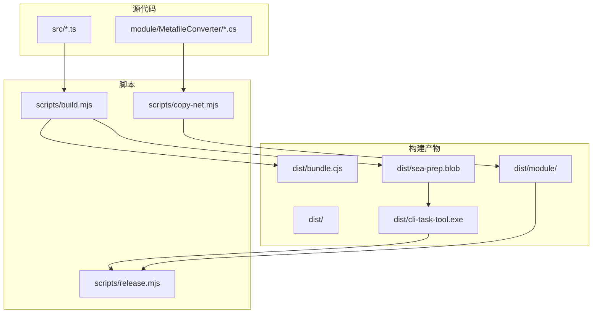
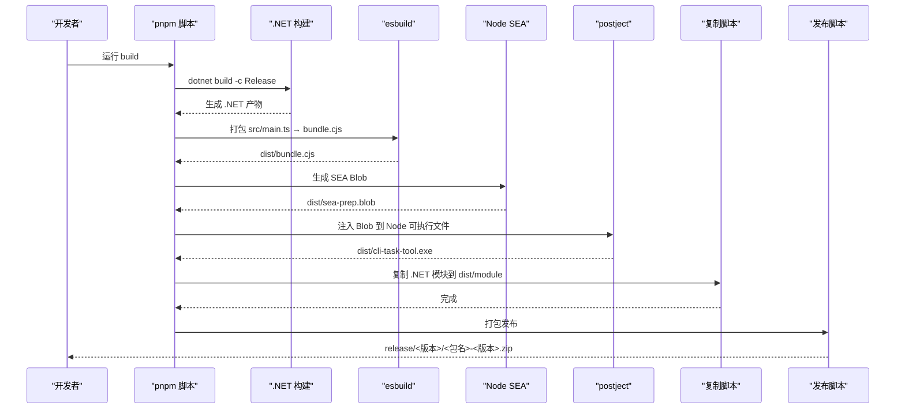
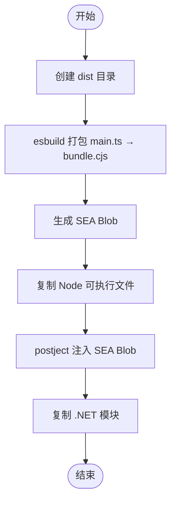
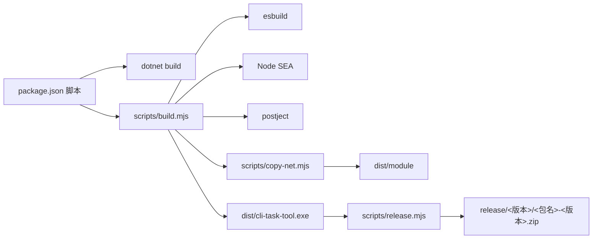

# 构建与部署

<cite>
**本文引用的文件**
- [package.json](file://package.json)
- [tsconfig.json](file://tsconfig.json)
- [sea-config.json](file://sea-config.json)
- [scripts/build.mjs](file://scripts/build.mjs)
- [scripts/copy-net.mjs](file://scripts/copy-net.mjs)
- [scripts/release.mjs](file://scripts/release.mjs)
- [src/main.ts](file://src/main.ts)
- [src/context.ts](file://src/context.ts)
- [src/runner.ts](file://src/runner.ts)
- [src/tasks/docxInput.ts](file://src/tasks/docxInput.ts)
- [eslint.config.js](file://eslint.config.js)
- [.prettierrc](file://.prettierrc)
- [.gitignore](file://.gitignore)
- [module/MetafileConverter/MetafileConverter/MetafileConverter.csproj](file://module/MetafileConverter/MetafileConverter/MetafileConverter.csproj)
- [module/MetafileConverter/MetafileConverter/Program.cs](file://module/MetafileConverter/MetafileConverter/Program.cs)
</cite>

## 目录
1. [简介](#简介)
2. [项目结构](#项目结构)
3. [核心组件](#核心组件)
4. [架构总览](#架构总览)
5. [详细组件分析](#详细组件分析)
6. [依赖关系分析](#依赖关系分析)
7. [性能考量](#性能考量)
8. [故障排查指南](#故障排查指南)
9. [结论](#结论)
10. [附录](#附录)

## 简介
本文件面向构建与部署流程，围绕以下目标展开：  
- 开发环境配置与工具链说明  
- TypeScript 编译设置与 ESLint/Prettier 规范  
- SEA（Single Executable Application）打包技术与多阶段构建流程  
- C# 依赖复制与最终发布产物组织  
- 构建脚本工作原理、可配置项与自定义方法  
- 跨平台部署建议、版本管理与发布策略  
- 构建性能优化与常见问题排查  

## 项目结构
该仓库采用“前端 TypeScript + Node.js 运行时 + esbuild 打包 + SEA 注入 + C# 模块复制”的混合架构。  
- Node.js 层：TypeScript 源码位于 src，编译输出至 dist；通过 esbuild 生成可执行的 bundle 并注入 SEA Blob，最终得到单文件可执行体。  
- C# 层：在 module/MetafileConverter 中维护 .NET 8 控制台应用，用于图片元文件转换等能力，构建产物复制到 dist/module 供运行时调用。  
- 脚本层：scripts 目录包含构建、复制 .NET 依赖、发布三个阶段脚本。

图表来源
- [scripts/build.mjs:1-53](file://scripts/build.mjs#L1-L53)
- [scripts/copy-net.mjs:1-37](file://scripts/copy-net.mjs#L1-L37)
- [scripts/release.mjs:1-42](file://scripts/release.mjs#L1-L42)
- [sea-config.json:1-6](file://sea-config.json#L1-L6)

章节来源
- [package.json:1-40](file://package.json#L1-L40)
- [tsconfig.json:1-19](file://tsconfig.json#L1-L19)
- [sea-config.json:1-6](file://sea-config.json#L1-L6)

## 核心组件
- 构建脚本（build.mjs）：负责 esbuild 打包、生成 SEA Blob、复制 Node 可执行文件、注入 Blob、复制 .NET 模块。  
- 复制脚本（copy-net.mjs）：清理并复制 .NET 构建产物及运行时依赖到 dist/module。  
- 发布脚本（release.mjs）：校验产物、解包目录准备、打包压缩、输出版本化发布包。  
- TypeScript 配置（tsconfig.json）：严格模式、NodeNext 模块解析、声明与 SourceMap 输出。  
- SEA 配置（sea-config.json）：指定入口 bundle 与输出 Blob。  
- 包管理与脚本（package.json）：定义 dev/build/release/lint/format/test 等命令。  
- C# 项目（MetafileConverter.csproj/Program.cs）：AOT 发布、System.Drawing.Common 使用、参数校验与异常处理。

章节来源
- [scripts/build.mjs:1-53](file://scripts/build.mjs#L1-L53)
- [scripts/copy-net.mjs:1-37](file://scripts/copy-net.mjs#L1-L37)
- [scripts/release.mjs:1-42](file://scripts/release.mjs#L1-L42)
- [tsconfig.json:1-19](file://tsconfig.json#L1-L19)
- [sea-config.json:1-6](file://sea-config.json#L1-L6)
- [package.json:1-40](file://package.json#L1-L40)
- [module/MetafileConverter/MetafileConverter/MetafileConverter.csproj:1-17](file://module/MetafileConverter/MetafileConverter/MetafileConverter.csproj#L1-L17)
- [module/MetafileConverter/MetafileConverter/Program.cs:1-88](file://module/MetafileConverter/MetafileConverter/Program.cs#L1-L88)

## 架构总览
整体构建与发布流程分为五步：  
1) 编译与打包：TypeScript 源码经 esbuild 打包为 CJS 入口 bundle。  
2) 生成 SEA Blob：基于 sea-config.json 生成 SEA Blob。  
3) 复制 Node 可执行文件并注入 Blob：将当前 Node 可执行文件复制为最终可执行体，并注入 SEA Blob。  
4) 复制 .NET 模块：将 .NET 构建产物与运行时依赖复制到 dist/module。  
5) 发布：将可执行体与模块打包为 zip，按版本号归档。

图表来源
- [package.json:7-16](file://package.json#L7-L16)
- [scripts/build.mjs:1-53](file://scripts/build.mjs#L1-L53)
- [scripts/copy-net.mjs:1-37](file://scripts/copy-net.mjs#L1-L37)
- [scripts/release.mjs:1-42](file://scripts/release.mjs#L1-L42)
- [sea-config.json:1-6](file://sea-config.json#L1-L6)

## 详细组件分析

### 构建脚本（build.mjs）
- 目标：串联 esbuild、Node SEA、postject 注入、.NET 模块复制。  
- 关键步骤与行为：  
  - 创建 dist 目录  
  - 使用 esbuild 将 src/main.ts 打包为 dist/bundle.cjs（CJS、最小化、带 banner 以兼容 import.meta.url）  
  - 执行 Node SEA 配置生成 dist/sea-prep.blob  
  - 复制当前 Node 可执行文件为 dist/cli-task-tool.exe  
  - 读取 SEA Blob 并通过 postject 注入到可执行文件  
  - 调用 copy-net.mjs 复制 .NET 模块  
- 可配置点：  
  - 入口文件、输出格式、banner/define、最小化开关、注入的 sentinel fuse  
  - SEA 配置文件路径与输出文件名  
  - 目标可执行文件名与输出目录  
- 自定义方法：  
  - 更换入口或输出格式时调整 esbuild 参数  
  - 修改 SEA 配置文件以改变 main/output  
  - 如需多语言或多平台，可在注入前进行条件判断或分发

图表来源
- [scripts/build.mjs:1-53](file://scripts/build.mjs#L1-L53)
- [sea-config.json:1-6](file://sea-config.json#L1-L6)

章节来源
- [scripts/build.mjs:1-53](file://scripts/build.mjs#L1-L53)

### 复制脚本（copy-net.mjs）
- 目标：清理并复制 .NET 构建产物与运行时依赖到 dist/module。  
- 行为：  
  - 清空 dist/module 后重建  
  - 复制核心文件：可执行文件、托管程序集、运行时配置、关键依赖 DLL  
  - 复制 Windows 平台特定实现（runtimes/win 下的 SystemEvents 实现）  
- 可配置点：  
  - 源目录与目标目录  
  - 需要复制的文件清单  
- 自定义方法：  
  - 新增依赖 DLL 时扩展文件列表  
  - 调整目录层级以适配不同发布布局

章节来源
- [scripts/copy-net.mjs:1-37](file://scripts/copy-net.mjs#L1-L37)

### 发布脚本（release.mjs）
- 目标：版本化发布产物，生成 zip 包。  
- 行为：  
  - 从 package.json 读取名称与版本  
  - 校验 dist/cli-task-tool.exe 与 dist/module 是否存在  
  - 清理并重建 release/<版本>/<包名> 解包目录  
  - 复制可执行体与模块到解包目录  
  - 使用 PowerShell Compress-Archive 打包为 zip  
  - 输出发布路径提示  
- 可配置点：  
  - 发布目录结构与 zip 名称模板  
  - 打包命令（当前为 Windows PowerShell）  
- 自定义方法：  
  - 在非 Windows 平台替换打包命令（如 zip/tar）  
  - 支持多平台产物时增加条件分支

章节来源
- [scripts/release.mjs:1-42](file://scripts/release.mjs#L1-L42)
- [package.json:1-40](file://package.json#L1-L40)

### TypeScript 编译与规范
- 编译配置（tsconfig.json）：  
  - 目标与模块：ES2022 + NodeNext  
  - 输出目录：dist，根目录：src  
  - 严格模式、跳过库检查、强制一致大小写  
  - 生成声明与 SourceMap，便于调试与发布  
- 代码风格与检查（eslint.config.js、.prettierrc）：  
  - ESLint 使用 TypeScript 解析器与插件，规则覆盖未使用变量、分号、显式返回类型、any 禁用等  
  - Prettier 单引号、无分号、列宽 100、Tab 宽度 2、尾逗号

章节来源
- [tsconfig.json:1-19](file://tsconfig.json#L1-L19)
- [eslint.config.js:1-26](file://eslint.config.js#L1-L26)
- [.prettierrc:1-8](file://.prettierrc#L1-L8)

### C# 模块（MetafileConverter）
- 项目特性：  
  - 目标框架 .NET 8，AOT 发布，禁用全球化以减小体积  
  - 引用 System.Drawing.Common，支持位图与元文件转换  
- 主程序逻辑要点：  
  - 参数校验：至少两个参数（输入路径、输出路径）  
  - 文件存在性检查与错误处理  
  - 元文件尺寸兜底策略（Bounds → Size → 默认值）  
  - 高质量渲染与 JPEG 90 质量编码  
  - 统一异常捕获与返回码  
- 与 Node.js 的集成：  
  - Node.js 运行时通过子进程调用 dist/module/MetafileConverter.exe  
  - 通过命令行参数传递输入输出路径

章节来源
- [module/MetafileConverter/MetafileConverter/MetafileConverter.csproj:1-17](file://module/MetafileConverter/MetafileConverter/MetafileConverter.csproj#L1-L17)
- [module/MetafileConverter/MetafileConverter/Program.cs:1-88](file://module/MetafileConverter/MetafileConverter/Program.cs#L1-L88)

### 入口与运行时（src/main.ts、src/context.ts、src/runner.ts、src/tasks/docxInput.ts）
- 入口职责：创建上下文、创建任务运行器、注册任务、异常处理与退出控制  
- 上下文：包含输入路径、输出路径、媒体路径、pandoc 可执行路径等  
- 任务：以 Listr2 任务形式组织，docxInput 任务负责交互式输入校验与缓存读写  
- 与 .NET 的协作：通过子进程调用 C# 可执行文件完成图片转换等操作

章节来源
- [src/main.ts:1-41](file://src/main.ts#L1-L41)
- [src/context.ts:1-21](file://src/context.ts#L1-L21)
- [src/runner.ts:1-10](file://src/runner.ts#L1-L10)
- [src/tasks/docxInput.ts:1-52](file://src/tasks/docxInput.ts#L1-L52)

## 依赖关系分析
- Node.js 侧：  
  - 构建阶段依赖 esbuild、postject、Node SEA  
  - 运行时依赖 @inquirer/prompts、listr2、@listr2/prompt-adapter-inquirer  
- C# 侧：  
  - System.Drawing.Common 用于图像处理  
  - AOT 发布减少运行时开销  
- 脚本间耦合：  
  - build.mjs 依赖 sea-config.json 与 copy-net.mjs  
  - release.mjs 依赖 dist 产物与 package.json 版本信息

图表来源
- [package.json:7-16](file://package.json#L7-L16)
- [scripts/build.mjs:1-53](file://scripts/build.mjs#L1-L53)
- [scripts/copy-net.mjs:1-37](file://scripts/copy-net.mjs#L1-L37)
- [scripts/release.mjs:1-42](file://scripts/release.mjs#L1-L42)

章节来源
- [package.json:1-40](file://package.json#L1-L40)

## 性能考量
- 构建性能优化建议：  
  - 使用 esbuild 的增量构建与并行任务（当前脚本为顺序执行，可评估拆分任务）  
  - 在 CI 中缓存 node_modules 与 .NET bin/obj 目录  
  - 对 SEA 注入与复制操作仅在必要时执行（例如变更检测）  
  - 将 .NET 产物缓存到 dist/module，避免重复复制  
- 运行时性能建议：  
  - AOT 发布减少启动时间与内存占用  
  - 图像处理参数（如 JPEG 质量）可根据场景权衡质量与体积  
- 资源与体积控制：  
  - 严格依赖清单，移除未使用的 .NET 依赖  
  - 合理选择 Node.js 与 SEA 版本，避免不必要的功能模块

## 故障排查指南
- 构建失败（缺少 dist 或产物）  
  - 确认先执行 .NET 构建再执行 Node 构建  
  - 检查 dist 目录是否被清理或权限不足  
- SEA 注入失败  
  - 检查 SEA Blob 是否生成成功  
  - 确认 postject 的 sentinel fuse 与 Node 版本匹配  
- .NET 模块缺失  
  - 确认 copy-net.mjs 已执行且 dist/module 存在  
  - 核对 System.Drawing.Common 与 Windows 平台特定 DLL 是否齐全  
- 发布失败  
  - 确认 dist/cli-task-tool.exe 与 dist/module 存在  
  - 非 Windows 平台需替换打包命令为对应平台工具  
- TypeScript/ESLint/Prettier  
  - 使用 lint 与 format 命令修复风格与规则问题  
  - 若规则冲突，可在 eslint.config.js 中调整规则级别

章节来源
- [scripts/build.mjs:1-53](file://scripts/build.mjs#L1-L53)
- [scripts/copy-net.mjs:1-37](file://scripts/copy-net.mjs#L1-L37)
- [scripts/release.mjs:1-42](file://scripts/release.mjs#L1-L42)
- [eslint.config.js:1-26](file://eslint.config.js#L1-L26)
- [.prettierrc:1-8](file://.prettierrc#L1-L8)

## 结论
本项目通过“TypeScript + esbuild + SEA + C# 模块”的组合，实现了跨平台可分发的单文件可执行体，并将 .NET 图像处理能力无缝集成到 Node.js 流程中。构建脚本清晰地串联了各阶段任务，发布脚本提供了版本化的打包流程。遵循本文的配置与优化建议，可进一步提升构建稳定性与效率。

## 附录
- 开发环境要求  
  - Node.js（支持 experimental SEA 与 postject）  
  - .NET SDK 8  
  - pnpm  
  - Windows 平台用于打包 zip（可替换为其他平台打包工具）  
- 常用命令参考  
  - 开发：pnpm dev  
  - 构建：pnpm build  
  - 发布：pnpm release  
  - Lint：pnpm lint  
  - 格式化：pnpm format  
  - 测试：pnpm test  
- 版本与发布策略建议  
  - 使用语义化版本（SemVer），在 release.mjs 中读取 package.json 版本  
  - 发布目录按 release/<版本>/<包名> 组织，便于回溯与分发  
  - 可在 CI 中自动执行构建、测试与发布，确保一致性