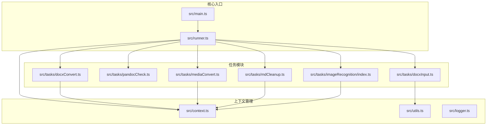
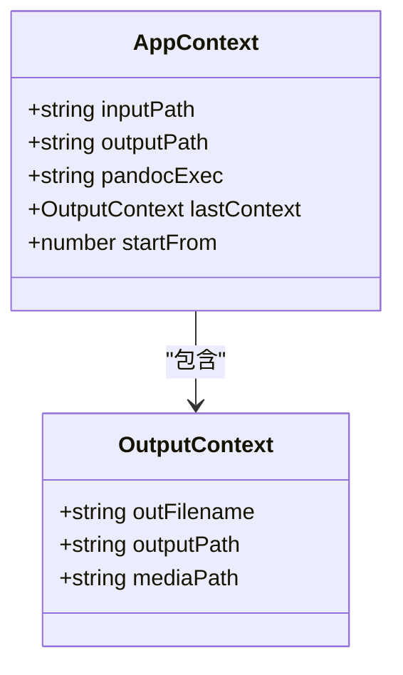
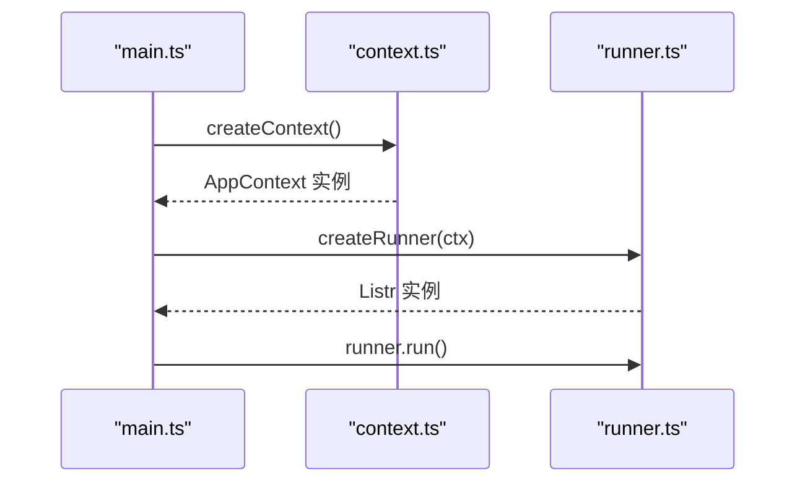
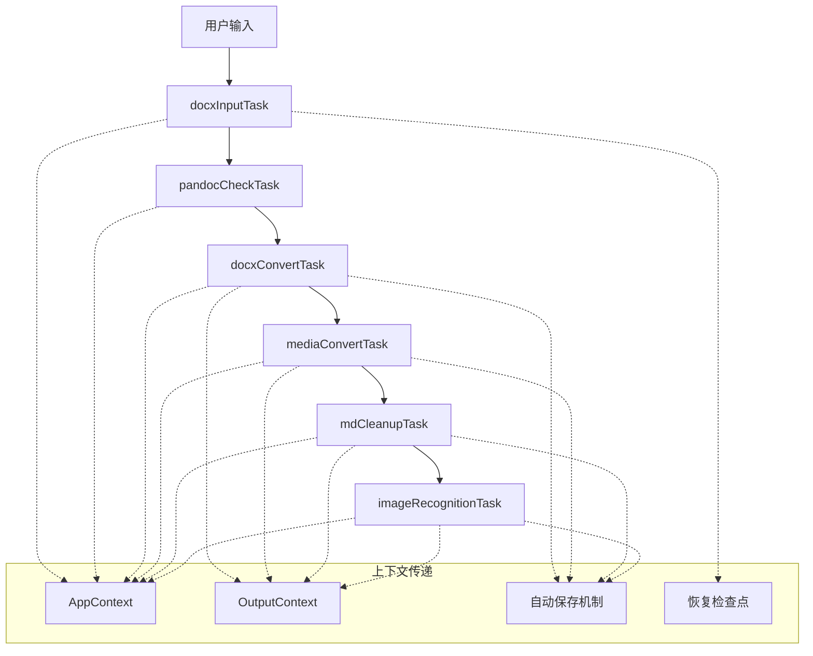
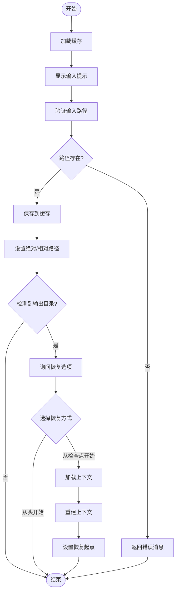
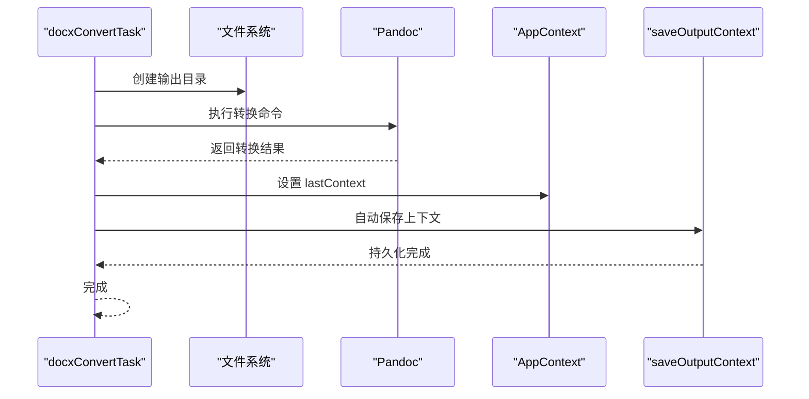
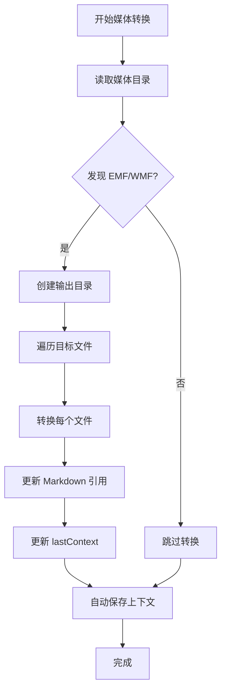
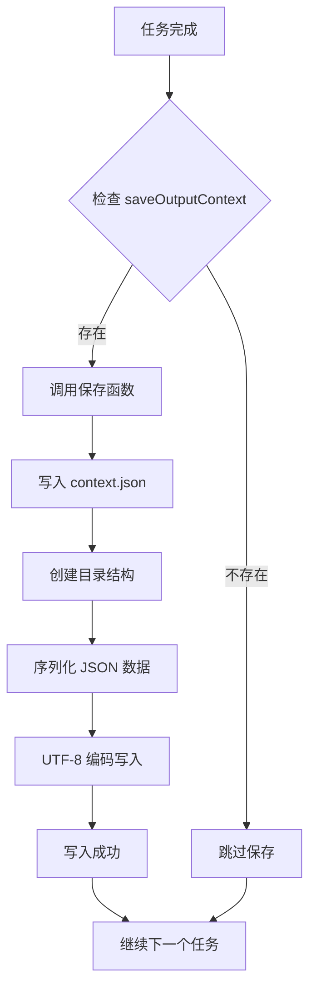
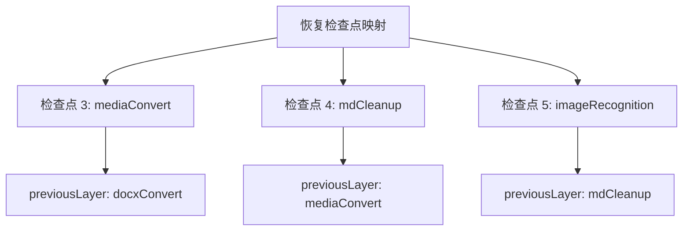
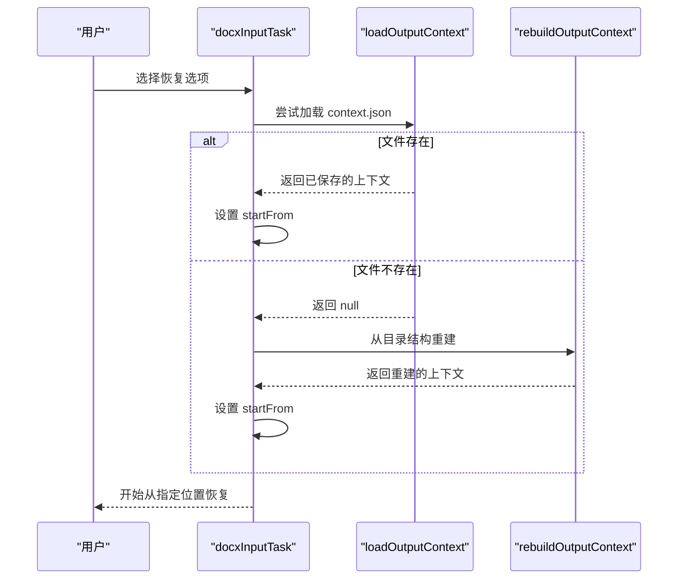

# 上下文管理系统

<cite>
**本文档引用的文件**
- [src/context.ts](file://src/context.ts)
- [src/main.ts](file://src/main.ts)
- [src/runner.ts](file://src/runner.ts)
- [src/utils.ts](file://src/utils.ts)
- [src/tasks/docxInput.ts](file://src/tasks/docxInput.ts)
- [src/tasks/pandocCheck.ts](file://src/tasks/pandocCheck.ts)
- [src/tasks/docxConvert.ts](file://src/tasks/docxConvert.ts)
- [src/tasks/mediaConvert.ts](file://src/tasks/mediaConvert.ts)
- [src/tasks/mdCleanup.ts](file://src/tasks/mdCleanup.ts)
- [src/tasks/imageRecognition/index.ts](file://src/tasks/imageRecognition/index.ts)
- [src/tasks/imageRecognition/configureTask.ts](file://src/tasks/imageRecognition/configureTask.ts)
- [src/tasks/imageRecognition/processTask.ts](file://src/tasks/imageRecognition/processTask.ts)
- [src/logger.ts](file://src/logger.ts)
- [package.json](file://package.json)
</cite>

## 更新摘要
**所做更改**
- 新增自动输出上下文保存功能说明
- 增强上下文持久化机制文档
- 改进恢复检查点功能详细说明
- 更新上下文保存和加载流程
- 添加 AI 图像识别任务的上下文管理

## 目录
1. [简介](#简介)
2. [项目结构](#项目结构)
3. [核心组件](#核心组件)
4. [架构概览](#架构概览)
5. [详细组件分析](#详细组件分析)
6. [上下文持久化机制](#上下文持久化机制)
7. [恢复检查点功能](#恢复检查点功能)
8. [依赖分析](#依赖分析)
9. [性能考虑](#性能考虑)
10. [故障排除指南](#故障排除指南)
11. [结论](#结论)

## 简介

Doc2MD CLI 是一个交互式命令行管道工具，用于将 .docx 文档转换为 Markdown 格式。该系统的核心是上下文管理系统，它负责在多个转换任务之间传递和持久化状态信息。

上下文管理系统基于两个主要接口设计：
- **AppContext**: 应用程序级别的全局上下文，存储输入路径、输出路径、Pandoc 可执行文件路径等核心配置
- **OutputContext**: 输出上下文，存储特定转换步骤产生的输出文件信息

系统采用 Listr2 任务运行器来管理任务执行流程，每个任务都可以访问和修改共享的上下文状态。**新增功能**：系统现在具备自动输出上下文保存功能，能够在每个转换步骤完成后自动持久化输出状态，确保转换过程的可靠性和可恢复性。

## 项目结构

项目采用模块化的架构设计，主要文件组织如下：



**图表来源**
- [src/main.ts:1-73](file://src/main.ts#L1-L73)
- [src/runner.ts:1-10](file://src/runner.ts#L1-L10)
- [src/context.ts:1-81](file://src/context.ts#L1-L81)

**章节来源**
- [src/main.ts:1-73](file://src/main.ts#L1-L73)
- [src/runner.ts:1-10](file://src/runner.ts#L1-L10)
- [src/context.ts:1-81](file://src/context.ts#L1-L81)

## 核心组件

### AppContext 接口

AppContext 是应用程序的主上下文接口，定义了转换过程所需的所有核心状态：



**图表来源**
- [src/context.ts:10-21](file://src/context.ts#L10-L21)
- [src/context.ts:4-8](file://src/context.ts#L4-L8)

**字段说明**:
- `inputPath`: 用户输入的 .docx 文件绝对路径
- `outputPath`: 总输出目录，与输入在同一级目录下的 out 目录
- `pandocExec`: 解析后的 pandoc 可执行文件路径
- `lastContext`: 上一个转换步骤产生的输出上下文
- `startFrom`: 恢复起始任务索引，undefined 表示从头开始

### 上下文初始化流程

上下文初始化是一个简单而直接的过程：



**图表来源**
- [src/main.ts:23-24](file://src/main.ts#L23-L24)
- [src/context.ts:23-25](file://src/context.ts#L23-L25)
- [src/runner.ts:4-9](file://src/runner.ts#L4-L9)

**章节来源**
- [src/context.ts:23-25](file://src/context.ts#L23-L25)
- [src/main.ts:23-24](file://src/main.ts#L23-L24)
- [src/runner.ts:4-9](file://src/runner.ts#L4-L9)

## 架构概览

系统采用流水线架构，通过 Listr2 任务运行器协调多个转换任务：



**图表来源**
- [src/main.ts:26-31](file://src/main.ts#L26-L31)
- [src/context.ts:10-21](file://src/context.ts#L10-L21)

系统的关键特性包括：
- **状态共享**: 所有任务都访问同一个 AppContext 实例
- **增量更新**: 每个任务只更新其关心的状态字段
- **自动持久化**: 每个转换步骤完成后自动保存输出上下文
- **错误传播**: 任何任务的错误都会中断整个流程
- **智能恢复**: 支持从指定检查点恢复执行
- **状态持久化**: 通过缓存机制持久化用户输入和转换状态

## 详细组件分析

### 输入任务 (docxInputTask)

输入任务负责收集用户输入并进行基本验证，同时实现智能恢复功能：



**图表来源**
- [src/tasks/docxInput.ts:30-99](file://src/tasks/docxInput.ts#L30-L99)

**验证规则**:
- 路径不能为空字符串
- 文件必须存在且可访问
- 支持绝对和相对路径两种格式

**恢复检查点**:
- 从「渲染矢量图并更新 Markdown 路径」开始
- 从「清理 Markdown HTML 标记」开始  
- 从「AI 图片识别与替换」开始

**章节来源**
- [src/tasks/docxInput.ts:13-28](file://src/tasks/docxInput.ts#L13-L28)
- [src/tasks/docxInput.ts:30-99](file://src/tasks/docxInput.ts#L30-L99)

### Pandoc 检测任务 (pandocCheckTask)

该任务检查系统中 Pandoc 的可用性：

**章节来源**
- [src/tasks/pandocCheck.ts:5-12](file://src/tasks/pandocCheck.ts#L5-L12)
- [src/tasks/pandocCheck.ts:14-23](file://src/tasks/pandocCheck.ts#L14-L23)

### 文档转换任务 (docxConvertTask)

这是第一个产生 OutputContext 的任务，负责将 .docx 转换为 Markdown，并实现自动上下文保存：



**图表来源**
- [src/tasks/docxConvert.ts:12-84](file://src/tasks/docxConvert.ts#L12-L84)

**输出上下文字段**:
- `outFilename`: 转换后的 Markdown 文件名
- `outputPath`: 转换后的文件路径
- `mediaPath`: 媒体文件目录路径

**自动保存机制**:
- 每个转换步骤完成后自动调用 `saveOutputContext`
- 保存到 `{outputPath}/{layer}/context.json`
- 写入失败不影响主流程，静默处理

**章节来源**
- [src/tasks/docxConvert.ts:12-84](file://src/tasks/docxConvert.ts#L12-L84)

### 媒体转换任务 (mediaConvertTask)

这个复杂的任务包含两个子任务，同样具备自动上下文保存功能：

1. **图像转换子任务**: 将 EMF/WMF 矢量图转换为 JPG
2. **Markdown 更新子任务**: 更新 Markdown 文件中的媒体引用



**图表来源**
- [src/tasks/mediaConvert.ts:165-169](file://src/tasks/mediaConvert.ts#L165-L169)

**章节来源**
- [src/tasks/mediaConvert.ts:165-169](file://src/tasks/mediaConvert.ts#L165-L169)

### Markdown 清理任务 (mdCleanupTask)

这是最后一个任务，负责清理转换过程中产生的 HTML 标记，并实现完整的上下文保存：

**章节来源**
- [src/tasks/mdCleanup.ts:333-393](file://src/tasks/mdCleanup.ts#L333-L393)

### AI 图像识别任务 (imageRecognitionTask)

这是最新的任务，负责使用 AI 模型识别图片内容并进行替换：

**章节来源**
- [src/tasks/imageRecognition/index.ts:6-10](file://src/tasks/imageRecognition/index.ts#L6-L10)
- [src/tasks/imageRecognition/configureTask.ts:35-125](file://src/tasks/imageRecognition/configureTask.ts#L35-L125)
- [src/tasks/imageRecognition/processTask.ts:67-299](file://src/tasks/imageRecognition/processTask.ts#L67-L299)

## 上下文持久化机制

### 自动保存功能

系统实现了完善的自动上下文保存机制：



**图表来源**
- [src/context.ts:34-49](file://src/context.ts#L34-L49)

### 持久化策略

1. **分层存储**: 每个转换层都有独立的上下文文件
2. **异步写入**: 保存操作不影响任务执行流程
3. **错误容错**: 写入失败不会中断转换过程
4. **结构化存储**: 使用标准 JSON 格式存储上下文信息

**章节来源**
- [src/context.ts:34-49](file://src/context.ts#L34-L49)
- [src/tasks/docxConvert.ts:76](file://src/tasks/docxConvert.ts#L76)
- [src/tasks/mediaConvert.ts:160](file://src/tasks/mediaConvert.ts#L160)
- [src/tasks/mdCleanup.ts:383](file://src/tasks/mdCleanup.ts#L383)
- [src/tasks/imageRecognition/processTask.ts:290](file://src/tasks/imageRecognition/processTask.ts#L290)

## 恢复检查点功能

### 检查点定义

系统定义了三个主要的恢复检查点：



**图表来源**
- [src/context.ts:27-32](file://src/context.ts#L27-L32)

### 恢复流程



**图表来源**
- [src/tasks/docxInput.ts:83-94](file://src/tasks/docxInput.ts#L83-L94)

**恢复策略**:
- **优先加载**: 首先尝试从 `context.json` 加载保存的上下文
- **智能重建**: 如果文件不存在，则根据目录结构重建上下文
- **无缝衔接**: 恢复后从指定检查点继续执行剩余任务

**章节来源**
- [src/context.ts:27-32](file://src/context.ts#L27-L32)
- [src/context.ts:51-62](file://src/context.ts#L51-L62)
- [src/context.ts:64-80](file://src/context.ts#L64-L80)
- [src/tasks/docxInput.ts:62-98](file://src/tasks/docxInput.ts#L62-L98)

## 依赖分析

系统的主要依赖关系如下：

```mermaid
graph TB
subgraph "外部依赖"
LISTR[listr2]
INQUIRER[@inquirer/prompts]
ADAPTER[@listr2/prompt-adapter-inquirer]
OPENAI[@ai-sdk/openai-compatible]
end
subgraph "内部模块"
CONTEXT[context.ts]
RUNNER[runner.ts]
MAIN[main.ts]
TASKS[tasks/*]
UTILS[utils.ts]
LOGGER[logger.ts]
end
LISTR --> RUNNER
INQUIRER --> TASKS
ADAPTER --> TASKS
OPENAI --> TASKS
MAIN --> RUNNER
RUNNER --> CONTEXT
TASKS --> CONTEXT
TASKS --> UTILS
TASKS --> LOGGER
```

**图表来源**
- [package.json:21-27](file://package.json#L21-L27)
- [src/main.ts:1-11](file://src/main.ts#L1-L11)

**依赖特点**:
- **最小依赖**: 仅使用必要的第三方库
- **类型安全**: 完全基于 TypeScript 类型系统
- **模块化**: 清晰的模块边界和职责分离
- **AI 集成**: 支持 OpenAI 兼容的视觉识别 API

**章节来源**
- [package.json:21-27](file://package.json#L21-L27)
- [src/main.ts:1-11](file://src/main.ts#L1-L11)

## 性能考虑

### 内存管理策略

1. **增量上下文更新**: 每个任务只更新必要的状态字段，避免不必要的内存占用
2. **流式处理**: 大文件处理采用流式读取，减少内存峰值
3. **及时释放**: 任务完成后立即释放临时变量
4. **异步持久化**: 上下文保存采用异步方式，不影响任务执行

### I/O 优化

1. **批量文件操作**: 相关的文件操作尽量批量执行
2. **缓存机制**: 使用本地缓存避免重复的用户输入
3. **并发控制**: 非关键任务使用并发执行提升性能
4. **智能恢复**: 通过检查点机制避免重复计算

### 错误处理优化

1. **早期失败**: 发现错误立即停止，避免浪费资源
2. **资源清理**: 确保在错误情况下正确清理临时文件
3. **用户反馈**: 提供清晰的错误信息帮助用户解决问题
4. **容错设计**: 上下文保存失败不影响主流程执行

## 故障排除指南

### 常见问题及解决方案

**Pandoc 未安装**
- 症状: `未检测到已安装的 pandoc，请安装后重试`
- 解决方案: 安装 Pandoc 并确保在 PATH 中可用

**输入文件路径无效**
- 症状: `路径不存在，请确认后重新输入`
- 解决方案: 检查文件路径是否正确，确认文件存在

**权限不足**
- 症状: 文件读写失败
- 解决方案: 检查文件权限，确保有足够的读写权限

**AI 识别失败**
- 症状: 图片识别超时或失败
- 解决方案: 检查 AI 服务连接，调整超时设置，确认模型可用性

### 恢复相关问题

**上下文文件损坏**
- 症状: `context.json` 无法解析
- 解决方案: 系统会自动重建上下文，从目录结构推导必要信息

**恢复点不匹配**
- 症状: 选择的恢复点缺少前置依赖
- 解决方案: 系统会自动加载 `previousLayer` 的上下文，确保数据完整性

### 调试技巧

1. **启用详细日志**: 在任务中添加适当的日志输出
2. **检查中间状态**: 验证每个任务的输出上下文
3. **隔离测试**: 单独测试每个任务的功能
4. **监控持久化**: 确认 `context.json` 文件正确生成

**章节来源**
- [src/tasks/pandocCheck.ts:17-21](file://src/tasks/pandocCheck.ts#L17-L21)
- [src/tasks/docxInput.ts:13-28](file://src/tasks/docxInput.ts#L13-L28)
- [src/context.ts:51-62](file://src/context.ts#L51-L62)

## 结论

Doc2MD CLI 的上下文管理系统展现了优秀的软件工程实践：

1. **清晰的职责分离**: 每个组件都有明确的职责和边界
2. **类型安全**: 完全基于 TypeScript 类型系统，提供编译时安全保障
3. **可扩展性**: 模块化设计使得添加新功能变得简单
4. **用户体验**: 通过缓存、交互式提示和智能恢复提供良好的用户体验
5. **可靠性**: 自动上下文保存和检查点恢复机制确保转换过程的可靠性
6. **智能化**: AI 集成和自动识别功能提升了文档处理的智能化水平

该系统为类似的文档转换工具提供了优秀的参考实现，特别是在上下文管理、任务编排和智能恢复方面。新增的自动上下文保存和恢复检查点功能进一步增强了系统的健壮性和用户友好性，使其能够处理复杂的转换场景并在意外中断后快速恢复执行。