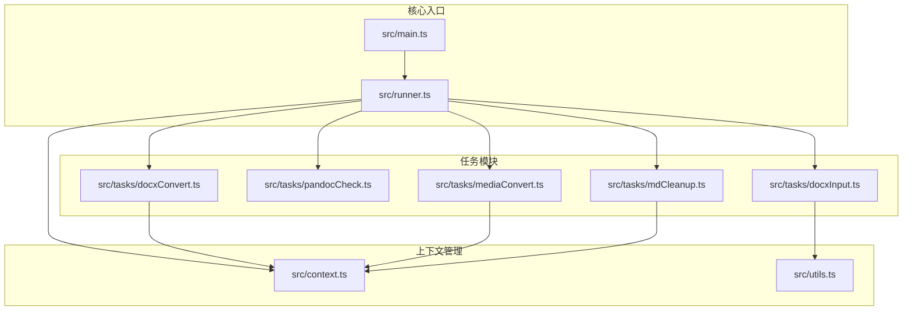
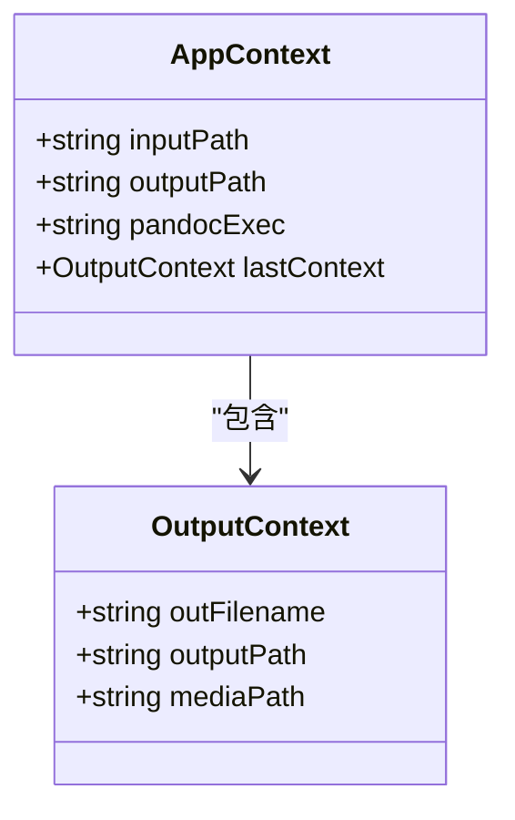
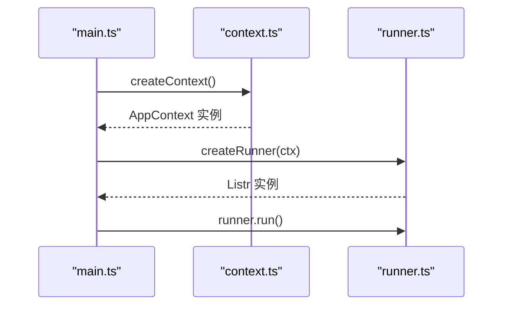
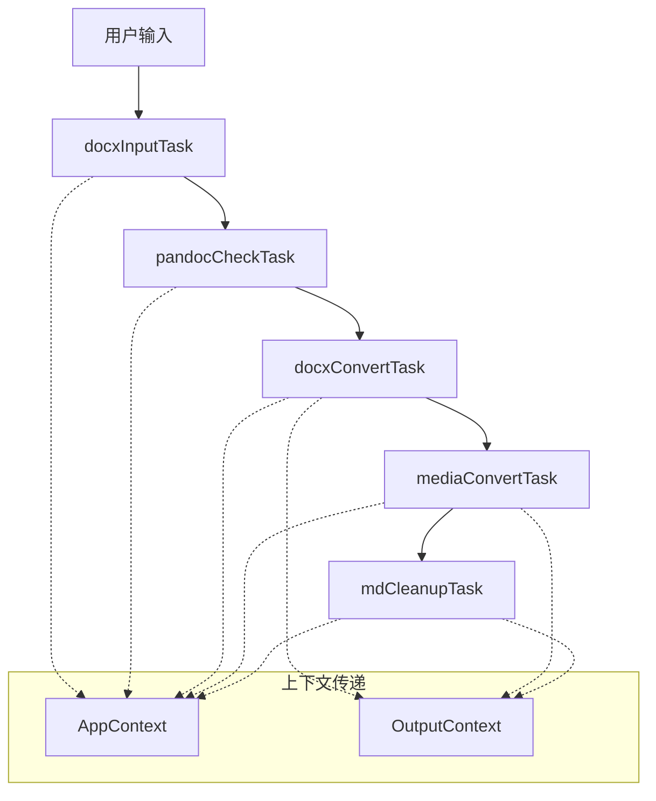
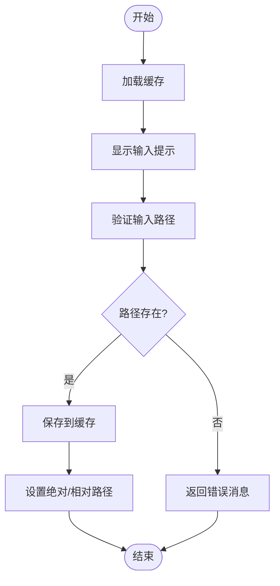
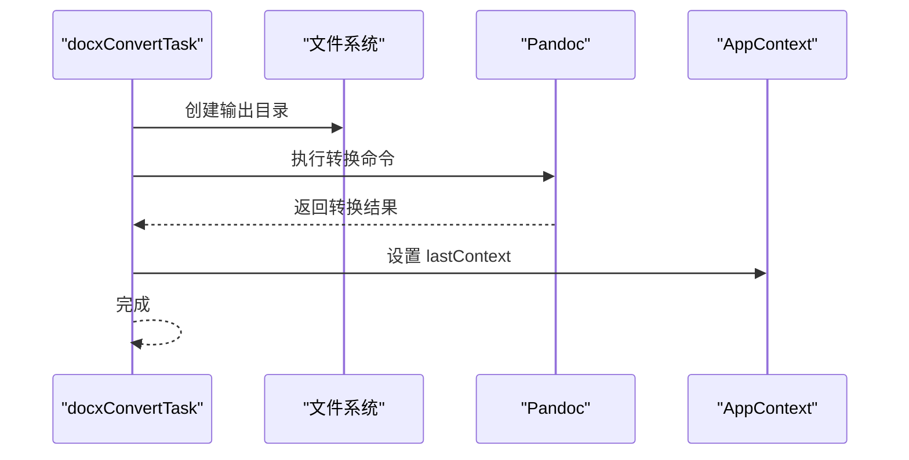
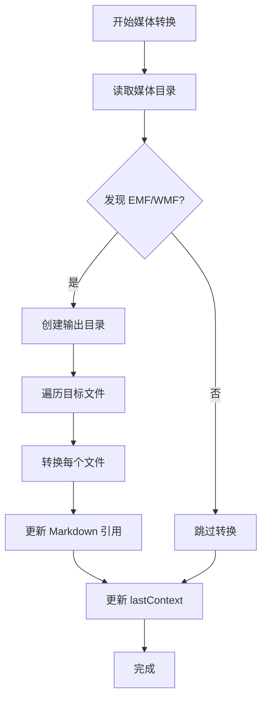

# 上下文管理系统

<cite>
**本文档引用的文件**
- [src/context.ts](file://src/context.ts)
- [src/main.ts](file://src/main.ts)
- [src/runner.ts](file://src/runner.ts)
- [src/utils.ts](file://src/utils.ts)
- [src/tasks/docxInput.ts](file://src/tasks/docxInput.ts)
- [src/tasks/pandocCheck.ts](file://src/tasks/pandocCheck.ts)
- [src/tasks/docxConvert.ts](file://src/tasks/docxConvert.ts)
- [src/tasks/mediaConvert.ts](file://src/tasks/mediaConvert.ts)
- [src/tasks/mdCleanup.ts](file://src/tasks/mdCleanup.ts)
- [package.json](file://package.json)
</cite>

## 目录
1. [简介](#简介)
2. [项目结构](#项目结构)
3. [核心组件](#核心组件)
4. [架构概览](#架构概览)
5. [详细组件分析](#详细组件分析)
6. [依赖分析](#依赖分析)
7. [性能考虑](#性能考虑)
8. [故障排除指南](#故障排除指南)
9. [结论](#结论)

## 简介

Doc2XML CLI 是一个交互式命令行管道工具，用于将 .docx 文档转换为 Markdown 格式。该系统的核心是上下文管理系统，它负责在多个转换任务之间传递和持久化状态信息。

上下文管理系统基于两个主要接口设计：
- **AppContext**: 应用程序级别的全局上下文，存储输入路径、输出路径、Pandoc 可执行文件路径等核心配置
- **OutputContext**: 输出上下文，存储特定转换步骤产生的输出文件信息

系统采用 Listr2 任务运行器来管理任务执行流程，每个任务都可以访问和修改共享的上下文状态。

## 项目结构

项目采用模块化的架构设计，主要文件组织如下：



**图表来源**
- [src/main.ts:1-41](file://src/main.ts#L1-L41)
- [src/runner.ts:1-10](file://src/runner.ts#L1-L10)
- [src/context.ts:1-21](file://src/context.ts#L1-L21)

**章节来源**
- [src/main.ts:1-41](file://src/main.ts#L1-L41)
- [src/runner.ts:1-10](file://src/runner.ts#L1-L10)
- [src/context.ts:1-21](file://src/context.ts#L1-L21)

## 核心组件

### AppContext 接口

AppContext 是应用程序的主上下文接口，定义了转换过程所需的所有核心状态：



**图表来源**
- [src/context.ts:7-16](file://src/context.ts#L7-L16)
- [src/context.ts:1-5](file://src/context.ts#L1-L5)

**字段说明**:
- `inputPath`: 用户输入的 .docx 文件绝对路径
- `outputPath`: 总输出目录，与输入在同一级目录下的 out 目录
- `pandocExec`: 解析后的 pandoc 可执行文件路径
- `lastContext`: 上一个转换步骤产生的输出上下文

### 上下文初始化流程

上下文初始化是一个简单而直接的过程：



**图表来源**
- [src/main.ts:9-10](file://src/main.ts#L9-L10)
- [src/context.ts:18-20](file://src/context.ts#L18-L20)
- [src/runner.ts:4-9](file://src/runner.ts#L4-L9)

**章节来源**
- [src/context.ts:18-20](file://src/context.ts#L18-L20)
- [src/main.ts:9-10](file://src/main.ts#L9-L10)
- [src/runner.ts:4-9](file://src/runner.ts#L4-L9)

## 架构概览

系统采用流水线架构，通过 Listr2 任务运行器协调多个转换任务：



**图表来源**
- [src/main.ts:12-16](file://src/main.ts#L12-L16)
- [src/context.ts:7-16](file://src/context.ts#L7-L16)

系统的关键特性包括：
- **状态共享**: 所有任务都访问同一个 AppContext 实例
- **增量更新**: 每个任务只更新其关心的状态字段
- **错误传播**: 任何任务的错误都会中断整个流程
- **状态持久化**: 通过缓存机制持久化用户输入

## 详细组件分析

### 输入任务 (docxInputTask)

输入任务负责收集用户输入并进行基本验证：



**图表来源**
- [src/tasks/docxInput.ts:27-51](file://src/tasks/docxInput.ts#L27-L51)

**验证规则**:
- 路径不能为空字符串
- 文件必须存在且可访问
- 支持绝对和相对路径两种格式

**章节来源**
- [src/tasks/docxInput.ts:13-25](file://src/tasks/docxInput.ts#L13-L25)
- [src/tasks/docxInput.ts:27-51](file://src/tasks/docxInput.ts#L27-L51)

### Pandoc 检测任务 (pandocCheckTask)

该任务检查系统中 Pandoc 的可用性：

**章节来源**
- [src/tasks/pandocCheck.ts:5-12](file://src/tasks/pandocCheck.ts#L5-L12)
- [src/tasks/pandocCheck.ts:14-23](file://src/tasks/pandocCheck.ts#L14-L23)

### 文档转换任务 (docxConvertTask)

这是第一个产生 OutputContext 的任务，负责将 .docx 转换为 Markdown：



**图表来源**
- [src/tasks/docxConvert.ts:10-63](file://src/tasks/docxConvert.ts#L10-L63)

**输出上下文字段**:
- `outFilename`: 转换后的 Markdown 文件名
- `outputPath`: 转换后的文件路径
- `mediaPath`: 媒体文件目录路径

**章节来源**
- [src/tasks/docxConvert.ts:10-63](file://src/tasks/docxConvert.ts#L10-L63)

### 媒体转换任务 (mediaConvertTask)

这个复杂的任务包含两个子任务：

1. **图像转换子任务**: 将 EMF/WMF 矢量图转换为 JPG
2. **Markdown 更新子任务**: 更新 Markdown 文件中的媒体引用



**图表来源**
- [src/tasks/mediaConvert.ts:43-111](file://src/tasks/mediaConvert.ts#L43-L111)

**章节来源**
- [src/tasks/mediaConvert.ts:43-111](file://src/tasks/mediaConvert.ts#L43-L111)

### Markdown 清理任务 (mdCleanupTask)

这是最后一个任务，负责清理转换过程中产生的 HTML 标记：

**章节来源**
- [src/tasks/mdCleanup.ts:331-372](file://src/tasks/mdCleanup.ts#L331-L372)

## 依赖分析

系统的主要依赖关系如下：

```mermaid
graph TB
subgraph "外部依赖"
LISTR[listr2]
INQUIRER[@inquirer/prompts]
ADAPTER[@listr2/prompt-adapter-inquirer]
end
subgraph "内部模块"
CONTEXT[context.ts]
RUNNER[runner.ts]
MAIN[main.ts]
TASKS[tasks/*]
UTILS[utils.ts]
end
LISTR --> RUNNER
INQUIRER --> TASKS
ADAPTER --> TASKS
MAIN --> RUNNER
RUNNER --> CONTEXT
TASKS --> CONTEXT
TASKS --> UTILS
```

**图表来源**
- [package.json:21-25](file://package.json#L21-L25)
- [src/main.ts:1-7](file://src/main.ts#L1-L7)

**依赖特点**:
- **最小依赖**: 仅使用必要的第三方库
- **类型安全**: 完全基于 TypeScript 类型系统
- **模块化**: 清晰的模块边界和职责分离

**章节来源**
- [package.json:21-25](file://package.json#L21-L25)
- [src/main.ts:1-7](file://src/main.ts#L1-L7)

## 性能考虑

### 内存管理策略

1. **增量上下文更新**: 每个任务只更新必要的状态字段，避免不必要的内存占用
2. **流式处理**: 大文件处理采用流式读取，减少内存峰值
3. **及时释放**: 任务完成后立即释放临时变量

### I/O 优化

1. **批量文件操作**: 相关的文件操作尽量批量执行
2. **缓存机制**: 使用本地缓存避免重复的用户输入
3. **并发控制**: 非关键任务使用并发执行提升性能

### 错误处理优化

1. **早期失败**: 发现错误立即停止，避免浪费资源
2. **资源清理**: 确保在错误情况下正确清理临时文件
3. **用户反馈**: 提供清晰的错误信息帮助用户解决问题

## 故障排除指南

### 常见问题及解决方案

**Pandoc 未安装**
- 症状: `未检测到已安装的 pandoc，请安装后重试`
- 解决方案: 安装 Pandoc 并确保在 PATH 中可用

**输入文件路径无效**
- 症状: `路径不存在，请确认后重新输入`
- 解决方案: 检查文件路径是否正确，确认文件存在

**权限不足**
- 症状: 文件读写失败
- 解决方案: 检查文件权限，确保有足够的读写权限

### 调试技巧

1. **启用详细日志**: 在任务中添加适当的日志输出
2. **检查中间状态**: 验证每个任务的输出上下文
3. **隔离测试**: 单独测试每个任务的功能

**章节来源**
- [src/tasks/pandocCheck.ts:17-21](file://src/tasks/pandocCheck.ts#L17-L21)
- [src/tasks/docxInput.ts:13-25](file://src/tasks/docxInput.ts#L13-L25)

## 结论

Doc2XML CLI 的上下文管理系统展现了优秀的软件工程实践：

1. **清晰的职责分离**: 每个组件都有明确的职责和边界
2. **类型安全**: 完全基于 TypeScript 类型系统，提供编译时安全保障
3. **可扩展性**: 模块化设计使得添加新功能变得简单
4. **用户体验**: 通过缓存和交互式提示提供良好的用户体验

该系统为类似的文档转换工具提供了优秀的参考实现，特别是在上下文管理和任务编排方面。