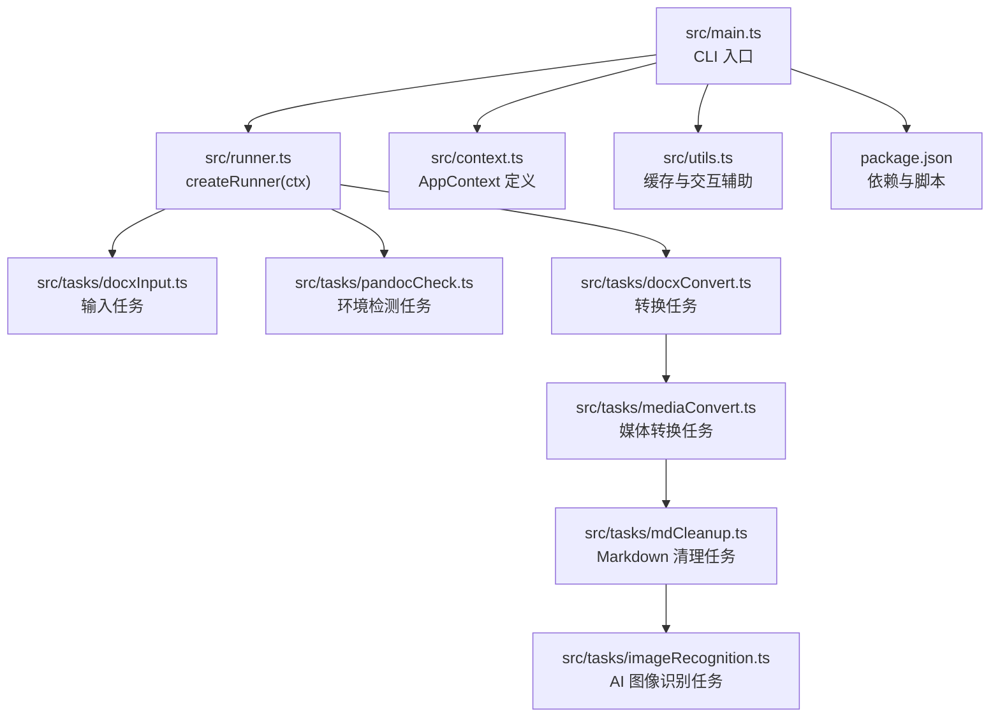
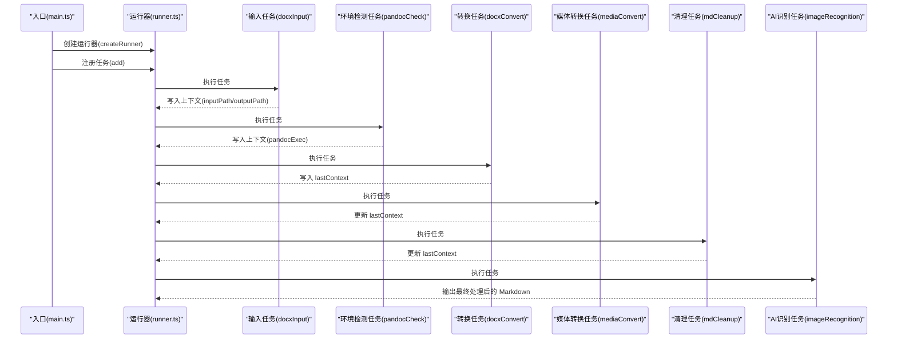
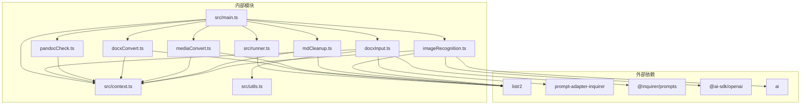

# 任务系统架构

<cite>
**本文引用的文件**
- [src/main.ts](file://src/main.ts)
- [src/runner.ts](file://src/runner.ts)
- [src/context.ts](file://src/context.ts)
- [src/utils.ts](file://src/utils.ts)
- [src/tasks/docxInput.ts](file://src/tasks/docxInput.ts)
- [src/tasks/pandocCheck.ts](file://src/tasks/pandocCheck.ts)
- [src/tasks/docxConvert.ts](file://src/tasks/docxConvert.ts)
- [src/tasks/mediaConvert.ts](file://src/tasks/mediaConvert.ts)
- [src/tasks/mdCleanup.ts](file://src/tasks/mdCleanup.ts)
- [src/tasks/imageRecognition.ts](file://src/tasks/imageRecognition.ts)
- [package.json](file://package.json)
- [.kiro/specs/cli-task-tool/design.md](file://.kiro/specs/cli-task-tool/design.md)
- [.kiro/specs/cli-task-tool/tasks.md](file://.kiro/specs/cli-task-tool/tasks.md)
</cite>

## 更新摘要
**变更内容**
- 新增AI图像识别任务，作为最后一个处理步骤集成到现有流水线
- 更新任务执行顺序，AI识别任务位于清理任务之后
- 增强任务间依赖关系，AI任务依赖前序任务生成的中间产物
- 新增AI视觉识别配置与验证机制
- 更新架构图和依赖关系图以反映新增任务

## 目录
1. [引言](#引言)
2. [项目结构](#项目结构)
3. [核心组件](#核心组件)
4. [架构总览](#架构总览)
5. [详细组件分析](#详细组件分析)
6. [依赖关系分析](#依赖关系分析)
7. [性能考量](#性能考量)
8. [故障排查指南](#故障排查指南)
9. [结论](#结论)
10. [附录](#附录)

## 引言
本文件面向 Doc2XML CLI 的任务系统，系统基于 Listr2 构建，围绕"任务注册、执行顺序控制、错误传播策略、生命周期管理、依赖关系与状态同步"展开。文档同时给出任务工厂模式的实现要点、任务配置选项与自定义任务开发指南，并提供调试技巧与可视化图示，帮助开发者快速理解与扩展任务流水线。

**更新** 本次更新新增了AI图像识别任务，该任务作为最后一个处理步骤集成到现有流水线中，为文档中的图片内容提供智能识别和替换功能。

## 项目结构
- 入口与运行器：入口文件负责创建上下文与运行器，随后按顺序注册任务并执行。
- 任务模块：每个任务独立文件，遵循 Listr2 的 ListrTask 接口规范，通过共享上下文在任务间传递数据。
- 上下文与工具：上下文定义了任务间共享的数据结构；工具模块提供缓存与交互提示辅助能力。
- 输出样例：仓库提供了中间与最终产物示例，便于理解任务链的阶段性输出。

**图表来源**
- [src/main.ts:1-43](file://src/main.ts#L1-L43)
- [src/runner.ts:1-10](file://src/runner.ts#L1-L10)
- [src/context.ts:1-21](file://src/context.ts#L1-L21)
- [src/tasks/imageRecognition.ts:1-548](file://src/tasks/imageRecognition.ts#L1-L548)
- [package.json:1-42](file://package.json#L1-L42)

**章节来源**
- [src/main.ts:1-43](file://src/main.ts#L1-L43)
- [src/runner.ts:1-10](file://src/runner.ts#L1-L10)
- [src/context.ts:1-21](file://src/context.ts#L1-L21)
- [src/tasks/imageRecognition.ts:1-548](file://src/tasks/imageRecognition.ts#L1-L548)
- [package.json:1-42](file://package.json#L1-L42)

## 核心组件
- 任务运行器（Runner）
  - 基于 Listr2 创建带上下文的运行器实例，配置渲染选项以保留子任务输出。
  - 提供 add 方法注册任务，run 方法执行流水线。
- 应用上下文（AppContext）
  - 定义输入路径、输出路径、pandoc 可执行文件路径等共享数据。
  - lastContext 用于在转换链中传递中间产物路径。
- 任务集合
  - 输入任务：收集用户输入并校验路径，写入上下文。
  - 环境检测任务：检测 pandoc 是否可用，决定后续转换任务的执行。
  - 转换任务：调用 pandoc 执行 docx 到 Markdown 的转换。
  - 媒体转换任务：将 EMF/WMF 渲染为 JPG，并更新 Markdown 中的引用。
  - Markdown 清理任务：去除 HTML 片段与冗余标记，输出标准 Markdown。
  - **AI 图像识别任务**：使用 OpenAI Vision API 分析图片内容，自动识别数学公式并替换为 LaTeX 格式，或生成中文描述。

**更新** 新增AI图像识别任务，提供智能图片内容分析功能，支持公式识别和图片描述生成。

**章节来源**
- [src/runner.ts:1-10](file://src/runner.ts#L1-L10)
- [src/context.ts:1-21](file://src/context.ts#L1-L21)
- [src/tasks/docxInput.ts:1-52](file://src/tasks/docxInput.ts#L1-L52)
- [src/tasks/pandocCheck.ts:1-24](file://src/tasks/pandocCheck.ts#L1-L24)
- [src/tasks/docxConvert.ts:1-64](file://src/tasks/docxConvert.ts#L1-L64)
- [src/tasks/mediaConvert.ts:1-112](file://src/tasks/mediaConvert.ts#L1-L112)
- [src/tasks/mdCleanup.ts:1-373](file://src/tasks/mdCleanup.ts#L1-L373)
- [src/tasks/imageRecognition.ts:1-548](file://src/tasks/imageRecognition.ts#L1-L548)

## 架构总览
任务系统采用"顺序流水线 + 共享上下文"的架构。入口文件创建上下文与运行器，按注册顺序将任务加入流水线，Listr2 依次执行。任务之间通过 AppContext 传递数据，部分任务会创建子任务列表以实现更细粒度的控制。

**更新** AI图像识别任务作为最后一个处理步骤，接收前序任务生成的中间产物，对图片内容进行智能分析和替换。

**图表来源**
- [src/main.ts:13-18](file://src/main.ts#L13-L18)
- [src/runner.ts:4-9](file://src/runner.ts#L4-L9)
- [src/tasks/docxInput.ts:27-51](file://src/tasks/docxInput.ts#L27-L51)
- [src/tasks/pandocCheck.ts:14-23](file://src/tasks/pandocCheck.ts#L14-L23)
- [src/tasks/docxConvert.ts:10-63](file://src/tasks/docxConvert.ts#L10-L63)
- [src/tasks/mediaConvert.ts:104-111](file://src/tasks/mediaConvert.ts#L104-L111)
- [src/tasks/mdCleanup.ts:331-372](file://src/tasks/mdCleanup.ts#L331-L372)
- [src/tasks/imageRecognition.ts:543-547](file://src/tasks/imageRecognition.ts#L543-L547)

## 详细组件分析

### 任务注册与执行顺序控制
- 注册顺序即执行顺序：入口文件按顺序调用 runner.add 注册任务，Listr2 严格按注册顺序串行执行。
- 顺序控制策略
  - 依赖前置：输入与环境检测必须在转换之前完成。
  - 数据依赖：转换任务依赖输入路径与 pandoc 可执行文件路径；媒体转换与清理任务依赖转换任务产生的中间产物路径；**AI识别任务依赖清理任务生成的最终 Markdown 文件**。
- 错误传播
  - 任一任务抛错，Listr2 将其标记为失败并停止后续任务；入口文件捕获顶层错误并输出提示与等待按键退出。

**更新** AI图像识别任务作为最后一个任务，确保在所有前序任务完成后才执行，保证对最终产物进行智能分析。

**章节来源**
- [src/main.ts:13-18](file://src/main.ts#L13-L18)
- [src/main.ts:33-42](file://src/main.ts#L33-L42)

### 任务生命周期管理
- 生命周期阶段
  - 初始化：创建上下文与运行器，注册任务。
  - 执行期：Listr2 驱动任务执行，任务通过 task.output 输出实时状态。
  - 结束：成功或失败，入口文件统一处理退出码与用户提示。
- 状态同步
  - 通过 AppContext 与 lastContext 在任务间传递路径与文件名，确保后续任务读取正确的中间产物。

**更新** AI图像识别任务通过 lastContext 获取最终的 Markdown 文件路径和媒体目录，确保对正确的文件进行分析。

**章节来源**
- [src/context.ts:7-16](file://src/context.ts#L7-L16)
- [src/tasks/docxConvert.ts:52-56](file://src/tasks/docxConvert.ts#L52-L56)
- [src/tasks/mediaConvert.ts:95-99](file://src/tasks/mediaConvert.ts#L95-L99)
- [src/tasks/mdCleanup.ts:362-366](file://src/tasks/mdCleanup.ts#L362-L366)
- [src/tasks/imageRecognition.ts:425-428](file://src/tasks/imageRecognition.ts#L425-L428)

### 任务间依赖关系
- 显式依赖
  - 输入任务 → 环境检测任务 → 转换任务 → 媒体转换任务 → 清理任务 → **AI识别任务**。
- 隐式依赖
  - 转换任务依赖 pandoc 可执行文件；媒体转换任务依赖转换任务生成的媒体目录；清理任务依赖媒体转换任务更新后的 Markdown 路径；**AI识别任务依赖清理任务生成的最终 Markdown 文件**。

**更新** AI图像识别任务依赖清理任务生成的最终 Markdown 文件，确保对经过清理的文档进行智能分析。

**图表来源**
- [src/tasks/docxInput.ts:27-51](file://src/tasks/docxInput.ts#L27-L51)
- [src/tasks/pandocCheck.ts:14-23](file://src/tasks/pandocCheck.ts#L14-L23)
- [src/tasks/docxConvert.ts:10-63](file://src/tasks/docxConvert.ts#L10-L63)
- [src/tasks/mediaConvert.ts:104-111](file://src/tasks/mediaConvert.ts#L104-L111)
- [src/tasks/mdCleanup.ts:331-372](file://src/tasks/mdCleanup.ts#L331-L372)
- [src/tasks/imageRecognition.ts:543-547](file://src/tasks/imageRecognition.ts#L543-L547)

### 错误传播策略
- 传播机制
  - 任务内部捕获异常并抛出 Error；Listr2 将失败任务标记为失败并停止后续任务。
  - 入口文件捕获顶层错误，区分用户中断（inquirer 提示）与其它错误，分别处理退出码与提示。
- 典型场景
  - 输入路径为空或不存在：输入任务验证失败，阻止后续任务。
  - pandoc 未安装：环境检测任务抛错，阻止转换。
  - pandoc 转换失败：转换任务读取 stderr 并抛错，阻止媒体转换与清理。
  - 子任务失败：媒体转换任务内部子任务失败，阻止清理任务。
  - **AI 识别失败**：AI图像识别任务对单个图片识别失败时，记录警告并继续处理其他图片，不影响整体流程。

**更新** AI图像识别任务具有容错机制，单个图片识别失败不会阻断整个流水线的执行。

**章节来源**
- [src/tasks/docxInput.ts:13-25](file://src/tasks/docxInput.ts#L13-L25)
- [src/tasks/pandocCheck.ts:16-21](file://src/tasks/pandocCheck.ts#L16-L21)
- [src/tasks/docxConvert.ts:48-61](file://src/tasks/docxConvert.ts#L48-L61)
- [src/tasks/mediaConvert.ts:29-39](file://src/tasks/mediaConvert.ts#L29-L39)
- [src/tasks/imageRecognition.ts:488-491](file://src/tasks/imageRecognition.ts#L488-L491)
- [src/main.ts:33-42](file://src/main.ts#L33-L42)

### 任务工厂模式与配置选项
- 工厂模式
  - 每个任务以 ListrTask 形式的常量导出，形成"任务工厂"，便于在入口文件中统一注册。
  - 子任务工厂：媒体转换任务和 AI 图像识别任务内部通过工厂函数返回子任务，实现模块化与复用。
- 配置选项
  - 运行器配置：渲染器选项关闭子任务折叠，便于观察子任务输出。
  - 任务配置：title 用于显示任务名称；task 回调中可通过 task.output 输出实时状态；prompt 适配器用于交互式输入。
  - **AI 识别配置**：支持配置 AI 接口地址、API Key、模型选择和识别结果校验开关。
- 自定义任务开发指南
  - 定义 ListrTask：包含 title 与 task 回调；在 task 回调中读写 AppContext。
  - 交互式输入：使用 @listr2/prompt-adapter-inquirer 与 @inquirer/prompts。
  - 子任务：通过 task.newListr 创建子任务列表，控制并发与顺序。
  - 错误处理：捕获异常并抛出 Error，确保错误被 Listr2 正确传播。
  - 状态输出：使用 task.output 输出进度与日志，提升可观测性。

**更新** 新增AI图像识别任务的配置选项，包括接口地址、API Key、模型选择和校验开关。

**章节来源**
- [src/runner.ts:4-9](file://src/runner.ts#L4-L9)
- [src/tasks/docxInput.ts:27-51](file://src/tasks/docxInput.ts#L27-L51)
- [src/tasks/mediaConvert.ts:104-111](file://src/tasks/mediaConvert.ts#L104-L111)
- [src/tasks/imageRecognition.ts:364-419](file://src/tasks/imageRecognition.ts#L364-L419)

### AI图像识别任务详解
- 功能概述
  - 使用 OpenAI Vision API 分析图片内容，自动识别数学公式并转换为 LaTeX 格式。
  - 对非公式图片生成中文描述，替换原有的图片引用。
  - 支持识别块级和行内图片，自动判断图片类型并生成相应格式。
- 核心特性
  - **多轮验证机制**：支持可选的结果校验，通过二次验证提高准确性。
  - **容错处理**：单个图片识别失败不影响整体流程，记录警告并继续处理。
  - **智能替换**：根据图片类型自动选择合适的 Markdown 格式。
  - **配置灵活**：支持自定义 AI 接口、模型和校验策略。
- 技术实现
  - 图片路径解析：支持相对路径和媒体目录两种查找方式。
  - 正则匹配：精确识别 Markdown 图片语法，支持块级和行内图片。
  - JSON 解析：从 AI 返回中提取结构化结果，处理模型返回的额外文本。
  - 状态反馈：实时输出识别进度和结果状态。

**新增** AI图像识别任务是本次更新的核心功能，提供智能化的图片内容分析能力。

**章节来源**
- [src/tasks/imageRecognition.ts:1-548](file://src/tasks/imageRecognition.ts#L1-L548)

### 任务执行过程中的调试技巧
- 观察输出
  - 使用 task.output 输出中间状态，例如"创建输出目录""调用 pandoc""渲染 EMF/WMF 为 JPG""**识别图片 (1/10): test.png**"等。
- 缓存与回放
  - 使用 utils.loadCache/saveCache 缓存输入路径，减少重复输入，便于快速回放。
- 日志与错误
  - 转换任务读取 pandoc 的 stderr 并抛出包含详细信息的 Error，便于定位问题。
  - **AI识别任务**：对单个图片识别失败时输出详细警告信息，包括图片名称和错误原因。
- 交互式调试
  - 输入任务使用交互式提示，可在验证失败时快速修正输入。
  - **AI配置任务**：支持重新连接 AI 接口，便于网络问题排查。
- 中间产物对比
  - 对比 out/docxConvert/test.md、out/mediaConvert/test.md、out/mdCleanup/test.md 和 out/imageRecognition/test.md，确认每一步的输出是否符合预期。

**更新** 新增AI图像识别任务的调试技巧，包括图片识别进度输出和配置重试功能。

**章节来源**
- [src/tasks/docxConvert.ts:22-26](file://src/tasks/docxConvert.ts#L22-L26)
- [src/tasks/docxConvert.ts:40-41](file://src/tasks/docxConvert.ts#L40-L41)
- [src/tasks/mediaConvert.ts:62-69](file://src/tasks/mediaConvert.ts#L62-L69)
- [src/tasks/mdCleanup.ts:354-357](file://src/tasks/mdCleanup.ts#L354-L357)
- [src/tasks/imageRecognition.ts:450-451](file://src/tasks/imageRecognition.ts#L450-L451)
- [src/tasks/imageRecognition.ts:392-395](file://src/tasks/imageRecognition.ts#L392-L395)
- [src/utils.ts:28-49](file://src/utils.ts#L28-L49)

## 依赖关系分析
- 外部依赖
  - listr2：任务编排与执行。
  - @listr2/prompt-adapter-inquirer：将 inquirer 适配为 Listr2 的 prompt 适配器。
  - @inquirer/prompts：提供交互式输入与确认。
  - **@ai-sdk/openai**：OpenAI API SDK，用于图像识别。
  - **ai**：AI 框架，提供 generateText 等核心功能。
- 内部依赖
  - main.ts 依赖 runner.ts、context.ts 与各任务模块。
  - 各任务模块依赖 context.ts 与 utils.ts（如需要）。
  - mediaConvert.ts 依赖本地可执行文件（MetafileConverter.exe）路径解析逻辑。
  - **imageRecognition.ts 依赖 AI 服务配置和图片处理功能**。

**更新** 新增AI相关依赖，包括 @ai-sdk/openai 和 ai 框架，用于图像识别功能。

**图表来源**
- [package.json:21-27](file://package.json#L21-L27)
- [src/main.ts:1-8](file://src/main.ts#L1-L8)
- [src/runner.ts:1-2](file://src/runner.ts#L1-L2)
- [src/tasks/imageRecognition.ts:1-10](file://src/tasks/imageRecognition.ts#L1-L10)

**章节来源**
- [package.json:21-27](file://package.json#L21-L27)
- [src/main.ts:1-8](file://src/main.ts#L1-L8)

## 性能考量
- I/O 与并发
  - 转换任务与媒体转换任务涉及大量文件读写与子进程调用，建议在磁盘与 CPU 充足的环境下执行。
  - 媒体转换任务内部子任务串行执行，避免并发导致的资源争用。
  - **AI图像识别任务**：图片识别可能涉及网络请求，建议合理配置超时和重试机制。
- 进程与资源
  - pandoc 与 MetafileConverter.exe 的调用开销较大，建议在转换前确保可执行文件路径正确，减少重试与失败。
  - **AI 服务调用**：OpenAI API 调用成本较高，建议合理控制并发数量和重试次数。
- 输出与日志
  - 通过 task.output 输出中间状态，有助于定位性能瓶颈与异常点。
  - **AI识别任务**：实时输出识别进度，便于监控长时间运行的识别任务。

**更新** 新增AI图像识别任务的性能考量，包括网络请求和API调用的成本控制。

## 故障排查指南
- 输入路径问题
  - 症状：输入任务验证失败或路径不存在。
  - 排查：检查路径有效性与权限；确认公式已转换为 Office Math 格式。
- pandoc 环境问题
  - 症状：环境检测任务抛错或转换任务失败。
  - 排查：确认 pandoc 已安装并可在系统 PATH 中访问；必要时手动指定 pandoc 可执行文件路径。
- 转换失败
  - 症状：转换任务读取 stderr 并抛错。
  - 排查：查看 stderr 输出，确认输入 .docx 是否损坏或包含不受支持的元素。
- 媒体转换失败
  - 症状：媒体转换任务内部子任务失败。
  - 排查：确认 media 目录存在且包含 EMF/WMF 文件；检查 MetafileConverter.exe 是否可执行。
- 清理任务失败
  - 症状：清理任务读取文件失败或正则替换异常。
  - 排查：检查中间产物路径是否正确；确认 Markdown 内容符合预期格式。
- **AI识别任务失败**
  - 症状：AI图像识别任务输出警告或识别结果不准确。
  - 排查：检查 AI 接口连接状态；确认 API Key 配置正确；尝试开启结果校验；检查图片文件是否可读且非空。

**更新** 新增AI图像识别任务的故障排查指南，包括网络连接、API配置和图片文件检查。

**章节来源**
- [src/tasks/docxInput.ts:13-25](file://src/tasks/docxInput.ts#L13-L25)
- [src/tasks/pandocCheck.ts:16-21](file://src/tasks/pandocCheck.ts#L16-L21)
- [src/tasks/docxConvert.ts:48-61](file://src/tasks/docxConvert.ts#L48-L61)
- [src/tasks/mediaConvert.ts:29-39](file://src/tasks/mediaConvert.ts#L29-L39)
- [src/tasks/mdCleanup.ts:340-348](file://src/tasks/mdCleanup.ts#L340-L348)
- [src/tasks/imageRecognition.ts:392-395](file://src/tasks/imageRecognition.ts#L392-L395)

## 结论
Doc2XML CLI 的任务系统以 Listr2 为核心，通过"顺序流水线 + 共享上下文"的设计实现了清晰的任务编排与稳定的错误传播。输入、环境检测、转换、媒体处理、清理和 **AI图像识别** 六个任务环环相扣，借助 AppContext 与 lastContext 实现状态同步。通过工厂模式与明确的配置选项，系统具备良好的可扩展性与可维护性。结合调试技巧与中间产物对比，开发者能够高效定位问题并持续优化任务链。

**更新** 新增的AI图像识别任务进一步增强了文档处理能力，为用户提供智能化的图片内容分析和替换功能，使整个任务系统更加完善和实用。

## 附录
- 设计文档与实现计划
  - 设计文档概述了任务系统的目标、架构与正确性属性，明确了任务顺序、错误处理与编译方案。
  - 实现计划列出了各任务的实现步骤与测试策略，便于对照与回归验证。

**章节来源**
- [.kiro/specs/cli-task-tool/design.md:1-314](file://.kiro/specs/cli-task-tool/design.md#L1-L314)
- [.kiro/specs/cli-task-tool/tasks.md:1-121](file://.kiro/specs/cli-task-tool/tasks.md#L1-L121)