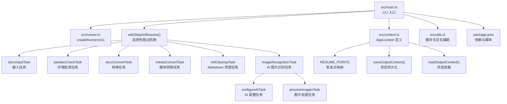
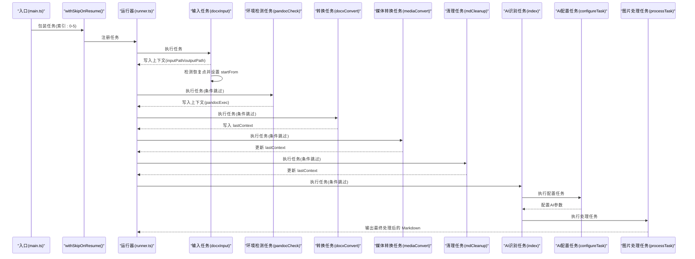
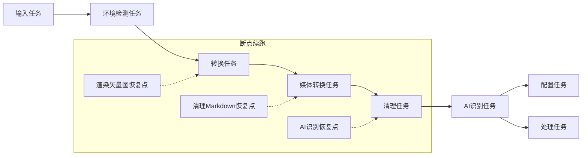
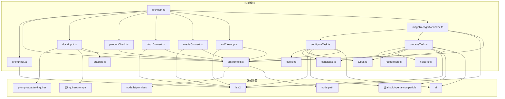

# 任务系统架构

<cite>
**本文引用的文件**
- [src/main.ts](file://src/main.ts)
- [src/runner.ts](file://src/runner.ts)
- [src/context.ts](file://src/context.ts)
- [src/utils.ts](file://src/utils.ts)
- [src/tasks/docxInput.ts](file://src/tasks/docxInput.ts)
- [src/tasks/pandocCheck.ts](file://src/tasks/pandocCheck.ts)
- [src/tasks/docxConvert.ts](file://src/tasks/docxConvert.ts)
- [src/tasks/mediaConvert.ts](file://src/tasks/mediaConvert.ts)
- [src/tasks/mdCleanup.ts](file://src/tasks/mdCleanup.ts)
- [src/tasks/imageRecognition/index.ts](file://src/tasks/imageRecognition/index.ts)
- [src/tasks/imageRecognition/config.ts](file://src/tasks/imageRecognition/config.ts)
- [src/tasks/imageRecognition/configureTask.ts](file://src/tasks/imageRecognition/configureTask.ts)
- [src/tasks/imageRecognition/processTask.ts](file://src/tasks/imageRecognition/processTask.ts)
- [src/tasks/imageRecognition/recognition.ts](file://src/tasks/imageRecognition/recognition.ts)
- [src/tasks/imageRecognition/helpers.ts](file://src/tasks/imageRecognition/helpers.ts)
- [src/tasks/imageRecognition/constants.ts](file://src/tasks/imageRecognition/constants.ts)
- [src/tasks/imageRecognition/types.ts](file://src/tasks/imageRecognition/types.ts)
- [package.json](file://package.json)
</cite>

## 更新摘要
**变更内容**
- 改进主执行流程，支持选择性任务跳过和断点续跑
- 新增断点续跑机制，通过 RESUME_POINTS 定义恢复点
- 增强错误处理和状态报告机制，支持任务级别的跳过显示
- 优化任务注册流程，通过 withSkipOnResume 函数实现条件跳过
- 新增上下文持久化机制，支持跨层状态恢复

## 目录
1. [引言](#引言)
2. [项目结构](#项目结构)
3. [核心组件](#核心组件)
4. [架构总览](#架构总览)
5. [详细组件分析](#详细组件分析)
6. [依赖关系分析](#依赖关系分析)
7. [性能考量](#性能考量)
8. [故障排查指南](#故障排查指南)
9. [结论](#结论)
10. [附录](#附录)

## 引言
本文档面向 Doc2MD CLI 的任务系统，系统基于 Listr2 构建，围绕"任务注册、执行顺序控制、错误传播策略、生命周期管理、依赖关系与状态同步"展开。文档同时给出任务工厂模式的实现要点、任务配置选项与自定义任务开发指南，并提供调试技巧与可视化图示，帮助开发者快速理解与扩展任务流水线。

**更新** 本次更新重点反映了主执行流程的重大改进，包括选择性任务跳过、断点续跑和增强的错误处理机制，显著提升了系统的灵活性和用户体验。

## 项目结构
- 入口与运行器：入口文件负责创建上下文与运行器，随后按顺序注册任务并执行。
- 任务模块：每个任务独立文件，遵循 Listr2 的 ListrTask 接口规范，通过共享上下文在任务间传递数据。
- **断点续跑机制**：AI图像识别任务现在支持从指定任务点恢复执行，通过 startFrom 属性控制跳过逻辑。
- 上下文与工具：上下文定义了任务间共享的数据结构；工具模块提供缓存与交互提示辅助能力。
- **状态持久化**：新增 OutputContext 持久化机制，支持跨层状态恢复和断点续跑。
- 输出样例：仓库提供了中间与最终产物示例，便于理解任务链的阶段性输出。

**图表来源**
- [src/main.ts:13-31](file://src/main.ts#L13-L31)
- [src/context.ts:27-32](file://src/context.ts#L27-L32)
- [src/context.ts:34-62](file://src/context.ts#L34-L62)
- [src/tasks/imageRecognition/index.ts:1-11](file://src/tasks/imageRecognition/index.ts#L1-L11)
- [src/tasks/imageRecognition/configureTask.ts:1-126](file://src/tasks/imageRecognition/configureTask.ts#L1-L126)
- [src/tasks/imageRecognition/processTask.ts:1-301](file://src/tasks/imageRecognition/processTask.ts#L1-L301)
- [package.json:1-42](file://package.json#L1-L42)

**章节来源**
- [src/main.ts:13-31](file://src/main.ts#L13-L31)
- [src/context.ts:27-32](file://src/context.ts#L27-L32)
- [src/context.ts:34-62](file://src/context.ts#L34-L62)
- [src/tasks/imageRecognition/index.ts:1-11](file://src/tasks/imageRecognition/index.ts#L1-L11)
- [src/tasks/imageRecognition/configureTask.ts:1-126](file://src/tasks/imageRecognition/configureTask.ts#L1-L126)
- [src/tasks/imageRecognition/processTask.ts:1-301](file://src/tasks/imageRecognition/processTask.ts#L1-L301)
- [package.json:1-42](file://package.json#L1-L42)

## 核心组件
- 任务运行器（Runner）
  - 基于 Listr2 创建带上下文的运行器实例，配置渲染选项以保留子任务输出。
  - 提供 add 方法注册任务，run 方法执行流水线。
- 应用上下文（AppContext）
  - 定义输入路径、输出路径、pandoc 可执行文件路径等共享数据。
  - lastContext 用于在转换链中传递中间产物路径。
  - **startFrom 属性**：控制断点续跑的起始任务索引，undefined 表示从头开始。
- 任务集合
  - 输入任务：收集用户输入并校验路径，写入上下文。
  - 环境检测任务：检测 pandoc 是否可用，决定后续转换任务的执行。
  - 转换任务：调用 pandoc 执行 docx 到 Markdown 的转换。
  - 媒体转换任务：将 EMF/WMF 渲染为 JPG，并更新 Markdown 中的引用。
  - Markdown 清理任务：去除 HTML 牅段与冗余标记，输出标准 Markdown。
  - **AI图像识别任务**：包含AI配置任务和图片处理任务两个子任务，提供智能图片内容分析功能。
- **断点续跑机制**
  - RESUME_POINTS 定义恢复点映射，支持从指定任务开始执行。
  - saveOutputContext/loadOutputContext 提供状态持久化和加载功能。
  - withSkipOnResume 函数实现条件跳过逻辑。

**更新** 新增断点续跑机制，通过 startFrom 属性和 RESUME_POINTS 实现选择性任务跳过和状态恢复。

**章节来源**
- [src/runner.ts:1-10](file://src/runner.ts#L1-L10)
- [src/context.ts:10-21](file://src/context.ts#L10-L21)
- [src/context.ts:27-32](file://src/context.ts#L27-L32)
- [src/context.ts:34-62](file://src/context.ts#L34-L62)
- [src/main.ts:13-21](file://src/main.ts#L13-L21)
- [src/tasks/docxInput.ts:62-98](file://src/tasks/docxInput.ts#L62-L98)

## 架构总览
任务系统采用"顺序流水线 + 共享上下文 + 断点续跑"的架构。入口文件创建上下文与运行器，通过 withSkipOnResume 函数包装任务以实现条件跳过，按注册顺序将任务加入流水线，Listr2 依次执行。任务之间通过 AppContext 传递数据，部分任务会创建子任务列表以实现更细粒度的控制。**断点续跑机制**允许用户从任意任务点恢复执行，提升系统的灵活性和用户体验。

**更新** 新架构集成了断点续跑功能，通过选择性任务跳过和状态持久化实现更灵活的任务执行控制。

**图表来源**
- [src/main.ts:13-31](file://src/main.ts#L13-L31)
- [src/main.ts:51-72](file://src/main.ts#L51-L72)
- [src/tasks/docxInput.ts:62-98](file://src/tasks/docxInput.ts#L62-L98)
- [src/tasks/imageRecognition/configureTask.ts:35-125](file://src/tasks/imageRecognition/configureTask.ts#L35-L125)
- [src/tasks/imageRecognition/processTask.ts:67-300](file://src/tasks/imageRecognition/processTask.ts#L67-L300)

## 详细组件分析

### 任务注册与执行顺序控制
- 注册顺序即执行顺序：入口文件按顺序调用 runner.add 注册任务，Listr2 严格按注册顺序串行执行。
- **选择性跳过机制**
  - withSkipOnResume 函数包装任务，根据 ctx.startFrom 和任务索引决定是否跳过。
  - 跳过时显示灰色任务标题，表示该任务已被跳过。
  - 支持从任意任务点开始执行，实现断点续跑功能。
- 顺序控制策略
  - 依赖前置：输入与环境检测必须在转换之前完成。
  - 数据依赖：转换任务依赖输入路径与 pandoc 可执行文件路径；媒体转换与清理任务依赖转换任务产生的中间产物路径；AI识别任务依赖清理任务生成的最终 Markdown 文件。
  - **模块化控制**：AI识别任务通过子任务列表控制配置任务先于处理任务执行。
- 错误传播
  - 任一任务抛错，Listr2 将其标记为失败并停止后续任务；入口文件捕获顶层错误并输出提示与等待按键退出。

**更新** 新增选择性跳过机制，通过 withSkipOnResume 函数实现条件跳过和断点续跑功能。

**章节来源**
- [src/main.ts:13-31](file://src/main.ts#L13-L31)
- [src/main.ts:51-72](file://src/main.ts#L51-L72)

### 断点续跑与状态持久化
- **断点续跑机制**
  - RESUME_POINTS 定义三个恢复点：渲染矢量图、清理Markdown、AI图片识别。
  - 输入任务检测现有输出目录，提供从指定任务开始的选项。
  - 设置 ctx.startFrom 控制后续任务的跳过行为。
- **状态持久化**
  - saveOutputContext 将 OutputContext 持久化到 {outputPath}/{layer}/context.json。
  - loadOutputContext 从文件系统加载持久化的上下文状态。
  - rebuildOutputContext 在 context.json 不存在时从目录结构推导 OutputContext。
- **状态恢复**
  - 从指定恢复点加载 lastContext，确保后续任务读取正确的中间产物。
  - 支持跨层状态恢复，mdCleanup 继承自 mediaConvert 的 mediaPath。

**更新** 新增断点续跑机制，通过 RESUME_POINTS 和状态持久化实现灵活的任务执行控制。

**章节来源**
- [src/context.ts:27-32](file://src/context.ts#L27-L32)
- [src/context.ts:34-62](file://src/context.ts#L34-L62)
- [src/context.ts:64-80](file://src/context.ts#L64-L80)
- [src/tasks/docxInput.ts:62-98](file://src/tasks/docxInput.ts#L62-L98)

### 任务生命周期管理
- 生命周期阶段
  - 初始化：创建上下文与运行器，注册任务。
  - **断点检测**：输入任务检测现有输出，提供恢复选项。
  - 执行期：Listr2 驱动任务执行，任务通过 task.output 输出实时状态。
  - **状态持久化**：各任务完成后保存 OutputContext，支持断点续跑。
  - 结束：成功或失败，入口文件统一处理退出码与用户提示。
- 状态同步
  - 通过 AppContext 与 lastContext 在任务间传递路径与文件名，确保后续任务读取正确的中间产物。
  - **模块化状态管理**：AI配置任务将配置参数存储在全局配置对象中，供处理任务使用。
  - **断点状态**：通过 context.json 实现跨层状态同步。

**更新** 新增断点检测和状态持久化阶段，通过上下文文件实现跨层状态同步。

**章节来源**
- [src/context.ts:10-21](file://src/context.ts#L10-L21)
- [src/context.ts:34-62](file://src/context.ts#L34-L62)
- [src/tasks/docxConvert.ts:70-77](file://src/tasks/docxConvert.ts#L70-L77)
- [src/tasks/mediaConvert.ts:155-161](file://src/tasks/mediaConvert.ts#L155-L161)
- [src/tasks/mdCleanup.ts:378-384](file://src/tasks/mdCleanup.ts#L378-L384)

### 任务间依赖关系
- 显式依赖
  - 输入任务 → 环境检测任务 → 转换任务 → 媒体转换任务 → 清理任务 → AI识别任务。
  - AI识别任务内部：配置任务 → 处理任务。
- 隐式依赖
  - 转换任务依赖 pandoc 可执行文件；媒体转换任务依赖转换任务生成的媒体目录；清理任务依赖媒体转换任务更新后的 Markdown 路径；AI识别任务依赖清理任务生成的最终 Markdown 文件。
  - **模块化依赖**：处理任务依赖配置任务提供的AI接口配置。
  - **断点依赖**：恢复点依赖 previousLayer 对应的输出层。

**更新** 新增断点依赖关系，恢复点需要加载 previousLayer 的输出上下文。

**图表来源**
- [src/tasks/docxInput.ts:62-98](file://src/tasks/docxInput.ts#L62-L98)
- [src/context.ts:27-32](file://src/context.ts#L27-L32)
- [src/tasks/imageRecognition/index.ts:6-10](file://src/tasks/imageRecognition/index.ts#L6-L10)

### 错误传播策略
- 传播机制
  - 任务内部捕获异常并抛出 Error；Listr2 将失败任务标记为失败并停止后续任务。
  - 入口文件捕获顶层错误，区分用户中断（inquirer 提示）与其它错误，分别处理退出码与提示。
  - **选择性跳过**：跳过的任务不会抛出错误，直接标记为跳过状态。
- 典型场景
  - 输入路径为空或不存在：输入任务验证失败，阻止后续任务。
  - pandoc 未安装：环境检测任务抛错，阻止转换。
  - pandoc 转换失败：转换任务读取 stderr 并抛错，阻止媒体转换与清理。
  - 子任务失败：媒体转换任务内部子任务失败，阻止清理任务。
  - **AI 配置失败**：AI配置任务连接AI接口失败时，记录错误并允许用户重试。
  - **AI 处理失败**：AI处理任务对单个图片识别失败时，记录警告并继续处理其他图片，不影响整体流程。
  - **断点续跑错误**：从恢复点开始执行时，跳过已完成的任务，只执行未完成的任务。

**更新** 新增断点续跑错误处理机制，跳过已完成的任务而不影响整体流程。

**章节来源**
- [src/main.ts:59-72](file://src/main.ts#L59-L72)
- [src/tasks/docxInput.ts:16-28](file://src/tasks/docxInput.ts#L16-L28)
- [src/tasks/pandocCheck.ts:15-27](file://src/tasks/pandocCheck.ts#L15-L27)
- [src/tasks/docxConvert.ts:68-83](file://src/tasks/docxConvert.ts#L68-L83)
- [src/tasks/mediaConvert.ts:32-54](file://src/tasks/mediaConvert.ts#L32-L54)
- [src/tasks/imageRecognition/configureTask.ts:63-83](file://src/tasks/imageRecognition/configureTask.ts#L63-L83)
- [src/tasks/imageRecognition/processTask.ts:179-188](file://src/tasks/imageRecognition/processTask.ts#L179-L188)

### 任务工厂模式与配置选项
- 工厂模式
  - 每个任务以 ListrTask 形式的常量导出，形成"任务工厂"，便于在入口文件中统一注册。
  - **模块化工厂**：AI图像识别任务通过工厂函数返回包含两个子任务的任务对象。
  - 子任务工厂：AI配置任务和处理任务内部通过工厂函数返回子任务，实现模块化与复用。
  - **包装工厂**：withSkipOnResume 函数作为任务包装器，实现条件跳过逻辑。
- 配置选项
  - 运行器配置：渲染器选项关闭子任务折叠，便于观察子任务输出。
  - 任务配置：title 用于显示任务名称；task 回调中可通过 task.output 输出实时状态；prompt 适配器用于交互式输入。
  - **AI 配置选项**：支持配置 AI 接口地址、API Key、模型选择、识别结果校验开关和超时时间。
  - **模块化配置**：配置参数存储在全局配置对象中，供处理任务使用。
  - **断点配置**：RESUME_POINTS 定义恢复点，previousLayer 指定需要加载上下文的前置层。
- 自定义任务开发指南
  - 定义 ListrTask：包含 title 与 task 回调；在 task 回调中读写 AppContext。
  - 交互式输入：使用 @listr2/prompt-adapter-inquirer 与 @inquirer/prompts。
  - 子任务：通过 task.newListr 创建子任务列表，控制并发与顺序。
  - 错误处理：捕获异常并抛出 Error，确保错误被 Listr2 正确传播。
  - 状态输出：使用 task.output 输出进度与日志，提升可观测性。
  - **模块化开发**：将复杂任务拆分为多个专门的子任务，通过工厂函数组合。
  - **断点兼容**：在任务中检查 ctx.startFrom，实现条件跳过逻辑。

**更新** 新增断点续跑相关的工厂模式和配置选项，支持选择性任务跳过和状态恢复。

**章节来源**
- [src/runner.ts:4-9](file://src/runner.ts#L4-L9)
- [src/main.ts:13-21](file://src/main.ts#L13-L21)
- [src/context.ts:27-32](file://src/context.ts#L27-L32)
- [src/tasks/docxInput.ts:30-100](file://src/tasks/docxInput.ts#L30-L100)
- [src/tasks/imageRecognition/index.ts:1-11](file://src/tasks/imageRecognition/index.ts#L1-L11)

### 模块化AI图像识别任务详解
- 功能概述
  - **模块化设计**：AI图像识别任务拆分为配置任务和处理任务两个子任务。
  - 配置任务：负责AI接口配置、模型选择和参数设置。
  - 处理任务：负责图片识别、替换和结果应用。
  - 使用 OpenAI Vision API 分析图片内容，自动识别数学公式并转换为 LaTeX 格式。
  - 对非公式图片生成中文描述，替换原有的图片引用。
  - 支持识别块级和行内图片，自动判断图片类型并生成相应格式。
  - **增强的错误处理**：支持超时控制、重试机制和结果校验。
- 核心特性
  - **模块化架构**：通过子任务列表实现配置与执行的分离。
  - **多轮验证机制**：支持可选的结果校验，通过二次验证提高准确性。
  - **容错处理**：单个图片识别失败不影响整体流程，记录警告并继续处理。
  - **智能替换**：根据图片类型自动选择合适的 Markdown 格式。
  - **配置灵活**：支持自定义 AI 接口、模型和校验策略。
  - **交互式配置**：通过命令行交互完成AI接口配置。
  - **超时控制**：支持可配置的识别超时时间，防止长时间阻塞。
  - **重试机制**：支持多次识别尝试，提高成功率。
- 技术实现
  - **模块化组织**：配置参数存储在全局配置对象中，供处理任务使用。
  - 图片路径解析：支持相对路径和媒体目录两种查找方式。
  - 正则匹配：精确识别 Markdown 图片语法，支持块级和行内图片。
  - JSON 解析：从 AI 返回中提取结构化结果，处理模型返回的额外文本。
  - 状态反馈：实时输出识别进度和结果状态。

**更新** 新增超时控制、重试机制和增强的错误处理，显著提升AI识别任务的稳定性和用户体验。

**章节来源**
- [src/tasks/imageRecognition/index.ts:1-11](file://src/tasks/imageRecognition/index.ts#L1-L11)
- [src/tasks/imageRecognition/config.ts:1-16](file://src/tasks/imageRecognition/config.ts#L1-L16)
- [src/tasks/imageRecognition/configureTask.ts:1-126](file://src/tasks/imageRecognition/configureTask.ts#L1-L126)
- [src/tasks/imageRecognition/processTask.ts:1-301](file://src/tasks/imageRecognition/processTask.ts#L1-L301)
- [src/tasks/imageRecognition/recognition.ts:18-37](file://src/tasks/imageRecognition/recognition.ts#L18-L37)
- [src/tasks/imageRecognition/recognition.ts:78-110](file://src/tasks/imageRecognition/recognition.ts#L78-L110)
- [src/tasks/imageRecognition/recognition.ts:235-268](file://src/tasks/imageRecognition/recognition.ts#L235-L268)

### 任务执行过程中的调试技巧
- 观察输出
  - 使用 task.output 输出中间状态，例如"创建输出目录""调用 pandoc""渲染 EMF/WMF 为 JPG""识别图片 (1/10): test.png"等。
  - **断点调试**：观察跳过任务的灰色显示，确认断点续跑的执行状态。
  - **模块化调试**：配置任务输出AI接口连接状态，处理任务输出图片识别进度。
- 缓存与回放
  - 使用 utils.loadCache/saveCache 缓存输入路径，减少重复输入，便于快速回放。
  - **AI配置缓存**：缓存AI接口地址、API Key、模型等配置参数。
- 日志与错误
  - 转换任务读取 pandoc 的 stderr 并抛出包含详细信息的 Error，便于定位问题。
  - **AI配置错误**：配置任务连接AI接口失败时输出详细错误信息。
  - **AI处理错误**：对单个图片识别失败时输出详细警告信息，包括图片名称和错误原因。
  - **断点错误**：从恢复点开始执行时，检查 context.json 的加载状态和 lastContext 的正确性。
- 交互式调试
  - 输入任务使用交互式提示，可在验证失败时快速修正输入。
  - **AI配置任务**：支持重新连接 AI 接口，便于网络问题排查。
  - **AI处理重试**：支持对失败的图片进行重试操作。
  - **断点选择**：在输入任务中选择不同的恢复点，测试断点续跑功能。
- 中间产物对比
  - 对比 out/docxConvert/test.md、out/mediaConvert/test.md、out/mdCleanup/test.md 和 out/imageRecognition/test.md，确认每一步的输出是否符合预期。
  - **断点验证**：从不同恢复点开始执行，验证状态恢复的正确性。

**更新** 新增断点续跑相关的调试技巧，包括恢复点选择和状态验证方法。

**章节来源**
- [src/tasks/docxConvert.ts:29-39](file://src/tasks/docxConvert.ts#L29-L39)
- [src/tasks/docxConvert.ts:68-83](file://src/tasks/docxConvert.ts#L68-L83)
- [src/tasks/mediaConvert.ts:85-126](file://src/tasks/mediaConvert.ts#L85-L126)
- [src/tasks/mdCleanup.ts:364-391](file://src/tasks/mdCleanup.ts#L364-L391)
- [src/tasks/imageRecognition/configureTask.ts:63-83](file://src/tasks/imageRecognition/configureTask.ts#L63-L83)
- [src/tasks/imageRecognition/processTask.ts:179-188](file://src/tasks/imageRecognition/processTask.ts#L179-L188)
- [src/tasks/imageRecognition/processTask.ts:190-250](file://src/tasks/imageRecognition/processTask.ts#L190-L250)
- [src/utils.ts:29-54](file://src/utils.ts#L29-L54)

## 依赖关系分析
- 外部依赖
  - listr2：任务编排与执行。
  - @listr2/prompt-adapter-inquirer：将 inquirer 适配为 Listr2 的 prompt 适配器。
  - @inquirer/prompts：提供交互式输入与确认。
  - **@ai-sdk/openai-compatible**：OpenAI API SDK，用于图像识别。
  - **ai**：AI 框架，提供 generateText 等核心功能。
  - **node:fs/promises**：文件系统操作，支持状态持久化。
  - **node:path**：路径解析，支持断点续跑。
- 内部依赖
  - main.ts 依赖 runner.ts、context.ts 与各任务模块。
  - 各任务模块依赖 context.ts 与 utils.ts（如需要）。
  - mediaConvert.ts 依赖本地可执行文件（MetafileConverter.exe）路径解析逻辑。
  - **imageRecognition.ts 依赖 AI 服务配置和图片处理功能**。
  - **模块化依赖**：配置任务依赖AI接口和模型列表获取；处理任务依赖配置任务提供的参数。
  - **断点依赖**：输入任务依赖 RESUME_POINTS 和上下文持久化功能。

**更新** 新增 node:fs/promises 和 node:path 内置模块依赖，支持状态持久化和断点续跑功能。

**图表来源**
- [package.json:21-27](file://package.json#L21-L27)
- [src/main.ts:1-11](file://src/main.ts#L1-L11)
- [src/runner.ts:1-2](file://src/runner.ts#L1-L2)
- [src/context.ts:1-3](file://src/context.ts#L1-L3)
- [src/tasks/imageRecognition/index.ts:1-11](file://src/tasks/imageRecognition/index.ts#L1-L11)
- [src/tasks/imageRecognition/configureTask.ts:1-126](file://src/tasks/imageRecognition/configureTask.ts#L1-L126)
- [src/tasks/imageRecognition/processTask.ts:1-301](file://src/tasks/imageRecognition/processTask.ts#L1-L301)

**章节来源**
- [package.json:21-27](file://package.json#L21-L27)
- [src/main.ts:1-11](file://src/main.ts#L1-L11)
- [src/context.ts:1-3](file://src/context.ts#L1-L3)

## 性能考量
- I/O 与并发
  - 转换任务与媒体转换任务涉及大量文件读写与子进程调用，建议在磁盘与 CPU 充足的环境下执行。
  - 媒体转换任务内部子任务串行执行，避免并发导致的资源争用。
  - **AI图像识别任务**：图片识别可能涉及网络请求，建议合理配置超时和重试机制。
  - **模块化性能**：配置任务和处理任务分离执行，避免重复的网络连接开销。
  - **断点续跑性能**：状态持久化避免重复计算，但需要考虑文件系统I/O开销。
- 进程与资源
  - pandoc 与 MetafileConverter.exe 的调用开销较大，建议在转换前确保可执行文件路径正确，减少重试与失败。
  - **AI 服务调用**：OpenAI API 调用成本较高，建议合理控制并发数量和重试次数。
  - **配置缓存**：利用缓存避免重复的AI接口连接和模型列表获取。
  - **断点优化**：从恢复点开始执行时，跳过已完成任务，显著减少执行时间。
- 输出与日志
  - 通过 task.output 输出中间状态，有助于定位性能瓶颈与异常点。
  - **AI识别任务**：实时输出识别进度，便于监控长时间运行的识别任务。
  - **模块化输出**：配置任务输出连接状态，处理任务输出图片识别进度。
  - **断点状态**：状态持久化日志，便于调试断点续跑功能。

**更新** 新增断点续跑相关的性能考量，包括状态持久化和选择性跳过对性能的影响。

## 故障排查指南
- 输入路径问题
  - 症状：输入任务验证失败或路径不存在。
  - 排查：检查路径有效性与权限；确认公式已转换为 Office Math 格式。
- pandoc 环境问题
  - 症状：环境检测任务抛错或转换任务失败。
  - 排查：确认 pandoc 已安装并可在系统 PATH 中访问；必要时手动指定 pandoc 可执行文件路径。
- 转换失败
  - 症状：转换任务读取 stderr 并抛错。
  - 排查：查看 stderr 输出，确认输入 .docx 是否损坏或包含不受支持的元素。
- 媒体转换失败
  - 症状：媒体转换任务内部子任务失败。
  - 排查：确认 media 目录存在且包含 EMF/WMF 文件；检查 MetafileConverter.exe 是否可执行。
- 清理任务失败
  - 症状：清理任务读取文件失败或正则替换异常。
  - 排查：检查中间产物路径是否正确；确认 Markdown 内容符合预期格式。
- **AI配置任务失败**
  - 症状：AI配置任务连接AI接口失败或模型列表获取失败。
  - 排查：检查AI接口地址和网络连接；确认API Key配置正确；尝试重新连接。
- **AI处理任务失败**
  - 症状：AI处理任务输出警告或识别结果不准确。
  - 排查：检查AI接口连接状态；确认API Key配置正确；尝试开启结果校验；检查图片文件是否可读且非空。
  - **模块化排查**：先检查配置任务是否成功，再检查处理任务的图片识别。
- **断点续跑问题**
  - 症状：从恢复点开始执行时状态不正确或任务跳过异常。
  - 排查：检查 context.json 文件是否存在和格式正确；确认 previousLayer 对应的输出层存在；验证 lastContext 的完整性。
  - **状态恢复**：确认 loadOutputContext 能正确加载持久化的上下文状态。
- **选择性跳过问题**
  - 症状：期望跳过的任务仍然执行或不应跳过的任务被跳过。
  - 排查：检查 ctx.startFrom 的值和任务索引的对应关系；确认 withSkipOnResume 函数的逻辑正确。

**更新** 新增断点续跑和选择性跳过相关的故障排查指南，包括状态持久化和跳过逻辑的调试方法。

**章节来源**
- [src/tasks/docxInput.ts:16-28](file://src/tasks/docxInput.ts#L16-L28)
- [src/tasks/pandocCheck.ts:15-27](file://src/tasks/pandocCheck.ts#L15-L27)
- [src/tasks/docxConvert.ts:68-83](file://src/tasks/docxConvert.ts#L68-L83)
- [src/tasks/mediaConvert.ts:32-54](file://src/tasks/mediaConvert.ts#L32-L54)
- [src/tasks/mdCleanup.ts:340-348](file://src/tasks/mdCleanup.ts#L340-L348)
- [src/tasks/imageRecognition/configureTask.ts:63-83](file://src/tasks/imageRecognition/configureTask.ts#L63-L83)
- [src/tasks/imageRecognition/processTask.ts:179-188](file://src/tasks/imageRecognition/processTask.ts#L179-L188)
- [src/context.ts:34-62](file://src/context.ts#L34-L62)
- [src/context.ts:64-80](file://src/context.ts#L64-L80)

## 结论
Doc2MD CLI 的任务系统以 Listr2 为核心，通过"顺序流水线 + 共享上下文 + 断点续跑"的设计实现了清晰的任务编排与稳定的错误传播。输入、环境检测、转换、媒体处理、清理和 AI图像识别六个任务环环相扣，借助 AppContext 与 lastContext 实现状态同步。**断点续跑机制**的引入显著提升了系统的灵活性和用户体验，用户可以从任意任务点恢复执行，避免重复工作。通过工厂模式与明确的配置选项，系统具备良好的可扩展性与可维护性。**模块化AI图像识别任务**进一步增强了文档处理能力，为用户提供智能化的图片内容分析和替换功能，使整个任务系统更加完善和实用。

**更新** 新集成的断点续跑机制和增强的错误处理显著提升了系统的实用性和用户体验，通过选择性任务跳过和状态持久化实现更灵活的任务执行控制。

## 附录
- 设计文档与实现计划
  - 设计文档概述了任务系统的目标、架构与正确性属性，明确了任务顺序、错误处理与编译方案。
  - 实现计划列出了各任务的实现步骤与测试策略，便于对照与回归验证。

**章节来源**
- [.kiro/specs/cli-task-tool/design.md:1-314](file://.kiro/specs/cli-task-tool/design.md#L1-L314)
- [.kiro/specs/cli-task-tool/tasks.md:1-121](file://.kiro/specs/cli-task-tool/tasks.md#L1-L121)