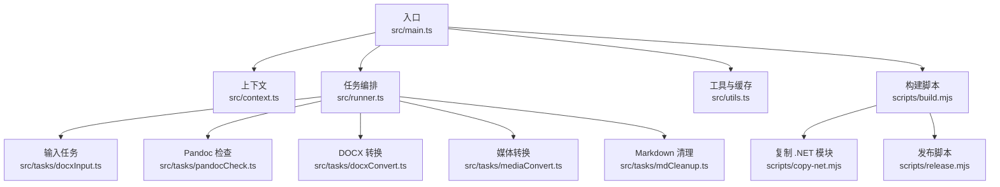
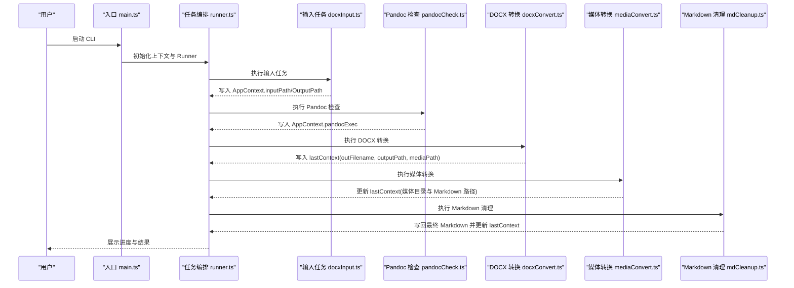
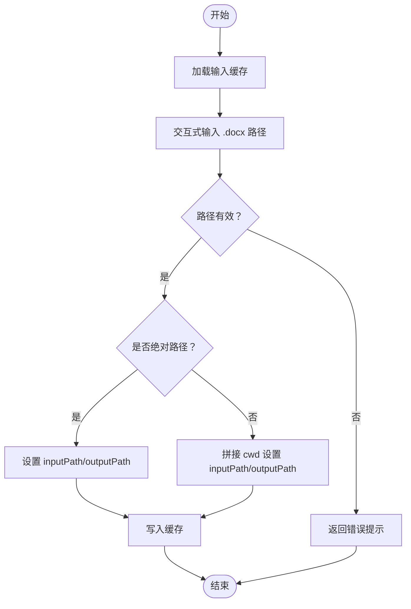
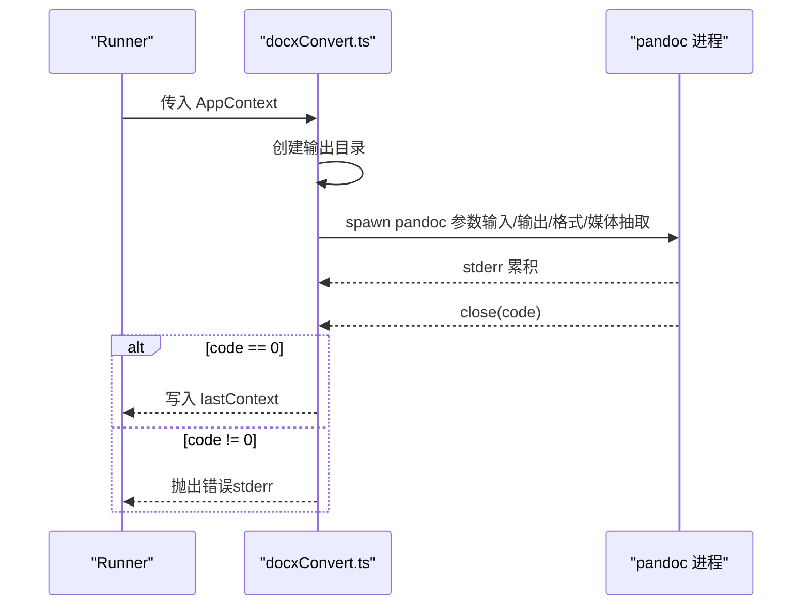
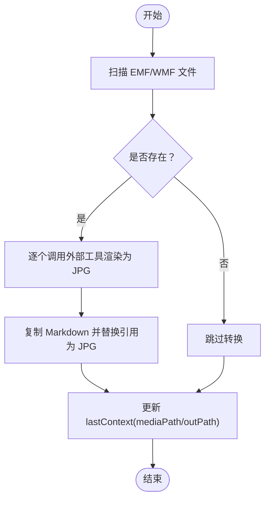
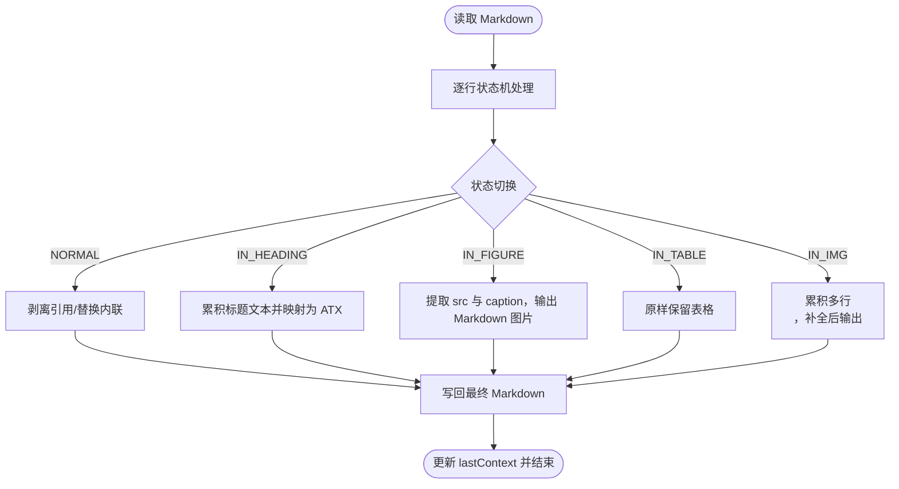
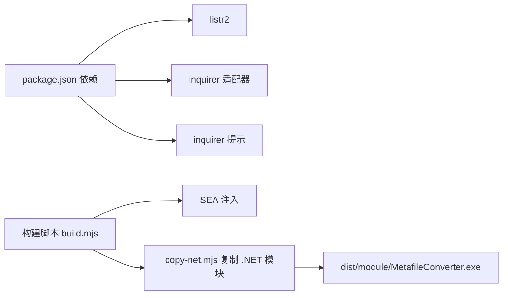

# 数据流架构

<cite>
**本文引用的文件**
- [src/main.ts](file://src/main.ts)
- [src/context.ts](file://src/context.ts)
- [src/runner.ts](file://src/runner.ts)
- [src/utils.ts](file://src/utils.ts)
- [src/tasks/docxInput.ts](file://src/tasks/docxInput.ts)
- [src/tasks/pandocCheck.ts](file://src/tasks/pandocCheck.ts)
- [src/tasks/docxConvert.ts](file://src/tasks/docxConvert.ts)
- [src/tasks/mediaConvert.ts](file://src/tasks/mediaConvert.ts)
- [src/tasks/mdCleanup.ts](file://src/tasks/mdCleanup.ts)
- [package.json](file://package.json)
- [tsconfig.json](file://tsconfig.json)
- [scripts/build.mjs](file://scripts/build.mjs)
- [scripts/copy-net.mjs](file://scripts/copy-net.mjs)
- [scripts/release.mjs](file://scripts/release.mjs)
</cite>

## 目录
1. [引言](#引言)
2. [项目结构](#项目结构)
3. [核心组件](#核心组件)
4. [架构总览](#架构总览)
5. [详细组件分析](#详细组件分析)
6. [依赖关系分析](#依赖关系分析)
7. [性能考量](#性能考量)
8. [故障排查指南](#故障排查指南)
9. [结论](#结论)
10. [附录](#附录)

## 引言
本文件面向 Doc2XML CLI 的数据流架构，系统性阐述从用户输入到最终输出的完整数据流转过程。文档覆盖数据验证、转换与清理的各阶段，说明数据在不同组件间的传递方式、格式转换与中间状态存储，并提供数据流图、关键数据节点与一致性保障机制。同时给出可定位的代码片段路径，便于读者在仓库中快速定位实现细节。

## 项目结构
项目采用“入口控制 + 任务编排 + 任务实现”的分层组织方式：
- 入口与编排：main.ts 创建上下文与任务调度器，按顺序注册任务；runner.ts 基于 listr2 实现串行任务编排；context.ts 定义应用级与输出级上下文。
- 任务层：tasks 目录下包含输入、环境检查、DOCX 转 Markdown、媒体转换、Markdown 清理等任务。
- 工具与缓存：utils.ts 提供输入缓存与提示样式工具。
- 构建与发布：scripts 目录包含打包、SEA 注入与 .NET 模块拷贝逻辑。

**图示来源**
- [src/main.ts:1-41](file://src/main.ts#L1-L41)
- [src/context.ts:1-21](file://src/context.ts#L1-L21)
- [src/runner.ts:1-10](file://src/runner.ts#L1-L10)
- [src/tasks/docxInput.ts:1-52](file://src/tasks/docxInput.ts#L1-L52)
- [src/tasks/pandocCheck.ts:1-24](file://src/tasks/pandocCheck.ts#L1-L24)
- [src/tasks/docxConvert.ts:1-64](file://src/tasks/docxConvert.ts#L1-L64)
- [src/tasks/mediaConvert.ts:1-112](file://src/tasks/mediaConvert.ts#L1-L112)
- [src/tasks/mdCleanup.ts:1-373](file://src/tasks/mdCleanup.ts#L1-L373)
- [src/utils.ts:1-50](file://src/utils.ts#L1-L50)
- [scripts/build.mjs:1-53](file://scripts/build.mjs#L1-L53)
- [scripts/copy-net.mjs:1-37](file://scripts/copy-net.mjs#L1-L37)
- [scripts/release.mjs:1-42](file://scripts/release.mjs#L1-L42)

**章节来源**
- [src/main.ts:1-41](file://src/main.ts#L1-L41)
- [src/context.ts:1-21](file://src/context.ts#L1-L21)
- [src/runner.ts:1-10](file://src/runner.ts#L1-L10)
- [src/utils.ts:1-50](file://src/utils.ts#L1-L50)
- [scripts/build.mjs:1-53](file://scripts/build.mjs#L1-L53)
- [scripts/copy-net.mjs:1-37](file://scripts/copy-net.mjs#L1-L37)
- [scripts/release.mjs:1-42](file://scripts/release.mjs#L1-L42)

## 核心组件
- 应用上下文 AppContext：承载输入路径、输出根目录、pandoc 可执行文件路径，以及 lastContext 输出上下文。
- 输出上下文 OutputContext：记录当前层生成的文件名、输出路径与媒体目录，作为后续任务的输入。
- 任务编排 Runner：基于 listr2 的串行任务执行器，负责按序调度各任务并共享上下文。
- 输入缓存：持久化用户最近一次输入的 .docx 路径，提升交互效率。

关键数据节点与一致性：
- 输入阶段将绝对/相对路径解析为绝对路径与输出目录，并写入 AppContext。
- DOCX 转换阶段产出 Markdown 与媒体目录，填充 lastContext。
- 媒体转换阶段渲染矢量图为位图并更新 Markdown 引用，更新 lastContext。
- 清理阶段对 Markdown 进行纯函数式清理，写回文件并更新 lastContext。
- 所有中间结果均通过 lastContext 串联，避免重复计算与状态散落。

**章节来源**
- [src/context.ts:1-21](file://src/context.ts#L1-L21)
- [src/tasks/docxInput.ts:27-52](file://src/tasks/docxInput.ts#L27-L52)
- [src/tasks/docxConvert.ts:10-64](file://src/tasks/docxConvert.ts#L10-L64)
- [src/tasks/mediaConvert.ts:104-112](file://src/tasks/mediaConvert.ts#L104-L112)
- [src/tasks/mdCleanup.ts:331-373](file://src/tasks/mdCleanup.ts#L331-L373)
- [src/utils.ts:17-50](file://src/utils.ts#L17-L50)

## 架构总览
下图展示从用户输入到最终输出的数据流全貌，标注了各阶段的数据载体与转换点。

**图示来源**
- [src/main.ts:9-16](file://src/main.ts#L9-L16)
- [src/runner.ts:4-9](file://src/runner.ts#L4-L9)
- [src/tasks/docxInput.ts:27-52](file://src/tasks/docxInput.ts#L27-L52)
- [src/tasks/pandocCheck.ts:14-23](file://src/tasks/pandocCheck.ts#L14-L23)
- [src/tasks/docxConvert.ts:10-64](file://src/tasks/docxConvert.ts#L10-L64)
- [src/tasks/mediaConvert.ts:104-112](file://src/tasks/mediaConvert.ts#L104-L112)
- [src/tasks/mdCleanup.ts:331-373](file://src/tasks/mdCleanup.ts#L331-L373)

## 详细组件分析

### 组件 A：输入与验证（docxInput.ts）
职责与流程：
- 使用交互式输入收集 .docx 路径，支持默认值（来自缓存）。
- 对输入进行存在性校验，错误时返回提示信息。
- 解析绝对/相对路径，设置 AppContext.inputPath 与 outputPath。
- 将输入路径写入本地缓存，便于下次启动使用。

关键数据节点：
- 输入缓存：用于默认值与历史记录。
- AppContext.inputPath/outputPath：作为后续任务的输入基础。

**图示来源**
- [src/tasks/docxInput.ts:13-25](file://src/tasks/docxInput.ts#L13-L25)
- [src/tasks/docxInput.ts:27-52](file://src/tasks/docxInput.ts#L27-L52)
- [src/utils.ts:28-49](file://src/utils.ts#L28-L49)

**章节来源**
- [src/tasks/docxInput.ts:1-52](file://src/tasks/docxInput.ts#L1-L52)
- [src/utils.ts:17-50](file://src/utils.ts#L17-L50)

### 组件 B：环境检测（pandocCheck.ts）
职责与流程：
- 检测系统是否全局安装 pandoc。
- 若未安装则抛出错误，中断流程；否则记录可执行文件名。

关键数据节点：
- AppContext.pandocExec：决定后续转换命令的可执行文件。

**章节来源**
- [src/tasks/pandocCheck.ts:1-24](file://src/tasks/pandocCheck.ts#L1-L24)

### 组件 C：DOCX 转换（docxConvert.ts）
职责与流程：
- 创建输出目录与媒体提取目录。
- 调用 pandoc 将 DOCX 转为 Markdown，并抽取媒体资源。
- 成功后写入 lastContext（文件名、输出路径、媒体目录）。

关键数据节点：
- lastContext：提供媒体路径与目标 Markdown 路径给后续任务。

**图示来源**
- [src/tasks/docxConvert.ts:10-64](file://src/tasks/docxConvert.ts#L10-L64)

**章节来源**
- [src/tasks/docxConvert.ts:1-64](file://src/tasks/docxConvert.ts#L1-L64)

### 组件 D：媒体转换与路径修复（mediaConvert.ts）
职责与流程：
- 子任务1：扫描媒体目录中的 EMF/WMF，调用外部工具渲染为 JPG，并输出到新媒体目录。
- 子任务2：复制 Markdown 到新目录，将其中的 EMF/WMF 引用替换为 JPG。
- 更新 lastContext，使后续清理任务使用最新 Markdown 与媒体路径。

关键数据节点：
- lastContext.mediaPath：输入媒体目录。
- 新媒体目录与更新后的 Markdown 路径。

**图示来源**
- [src/tasks/mediaConvert.ts:43-72](file://src/tasks/mediaConvert.ts#L43-L72)
- [src/tasks/mediaConvert.ts:75-102](file://src/tasks/mediaConvert.ts#L75-L102)
- [src/tasks/mediaConvert.ts:104-112](file://src/tasks/mediaConvert.ts#L104-L112)

**章节来源**
- [src/tasks/mediaConvert.ts:1-112](file://src/tasks/mediaConvert.ts#L1-L112)

### 组件 E：Markdown 清理（mdCleanup.ts）
职责与流程：
- 以纯函数形式清理 pandoc 生成的 Markdown，去除 HTML 片段、转换标题层级、处理图片与表格等。
- 逐行状态机处理，支持多行  标签与嵌套块。
- 写回最终 Markdown，并更新 lastContext。

关键数据节点：
- 最终 Markdown 输出路径与媒体目录。

**图示来源**
- [src/tasks/mdCleanup.ts:77-327](file://src/tasks/mdCleanup.ts#L77-L327)
- [src/tasks/mdCleanup.ts:331-373](file://src/tasks/mdCleanup.ts#L331-L373)

**章节来源**
- [src/tasks/mdCleanup.ts:1-373](file://src/tasks/mdCleanup.ts#L1-L373)

### 组件 F：上下文与缓存（context.ts, utils.ts）
职责与流程：
- AppContext：统一管理输入、输出、pandoc 可执行文件与 lastContext。
- OutputContext：记录每层输出的文件名、路径与媒体目录。
- 输入缓存：读取/合并/写入本地缓存文件，避免重复输入。

一致性与容错：
- 缓存读取失败时返回空对象，不影响主流程。
- lastContext 作为链式数据载体，确保各任务只依赖上一层结果。

**章节来源**
- [src/context.ts:1-21](file://src/context.ts#L1-L21)
- [src/utils.ts:17-50](file://src/utils.ts#L17-L50)

## 依赖关系分析
- 运行时依赖：listr2、@listr2/prompt-adapter-inquirer、@inquirer/prompts。
- 构建与打包：esbuild、postject、SEA（单可执行封装）。
- .NET 依赖：MetafileConverter.exe 依赖 Windows 平台库，构建脚本会复制必要 DLL 与运行时配置。

**图示来源**
- [package.json:21-38](file://package.json#L21-L38)
- [scripts/build.mjs:14-47](file://scripts/build.mjs#L14-L47)
- [scripts/copy-net.mjs:14-34](file://scripts/copy-net.mjs#L14-L34)

**章节来源**
- [package.json:1-40](file://package.json#L1-L40)
- [scripts/build.mjs:1-53](file://scripts/build.mjs#L1-L53)
- [scripts/copy-net.mjs:1-37](file://scripts/copy-net.mjs#L1-L37)

## 性能考量
- I/O 优化
  - 串行任务顺序执行，避免并发写冲突；媒体转换与清理阶段尽量复用已生成的中间文件，减少重复读写。
  - 使用递归创建目录与一次性写入，降低系统调用次数。
- 进程与外部工具
  - pandoc 与外部工具调用通过子进程执行，建议在任务内部聚合日志与错误，避免阻塞主线程。
- 缓存与交互
  - 输入缓存减少重复输入，提高用户体验；缓存写入失败静默忽略，不影响主流程。
- 并发策略
  - 当前任务串行执行，若未来扩展可评估将独立且无共享状态的任务改为并发执行，但需注意 I/O 与资源竞争。

[本节为通用性能建议，无需具体文件引用]

## 故障排查指南
常见问题与定位方法：
- Pandoc 未安装或不可执行
  - 症状：Pandoc 检查阶段抛出错误。
  - 处理：安装 pandoc 并确保其在 PATH 中可用。
  - 参考路径：[src/tasks/pandocCheck.ts:14-23](file://src/tasks/pandocCheck.ts#L14-L23)
- DOCX 路径无效或不存在
  - 症状：输入任务返回错误提示。
  - 处理：确认路径存在且为 .docx 文件；可使用缓存默认值。
  - 参考路径：[src/tasks/docxInput.ts:13-25](file://src/tasks/docxInput.ts#L13-L25)
- DOCX 转换失败
  - 症状：pandoc 子进程非零退出，stderr 被收集并抛出。
  - 处理：检查输入文档格式与公式是否符合要求；查看 stderr 输出。
  - 参考路径：[src/tasks/docxConvert.ts:40-61](file://src/tasks/docxConvert.ts#L40-L61)
- 媒体转换失败
  - 症状：外部工具返回非零退出码。
  - 处理：确认 dist/module 下的 .NET 组件完整；检查权限与磁盘空间。
  - 参考路径：[src/tasks/mediaConvert.ts:29-40](file://src/tasks/mediaConvert.ts#L29-L40)
- Markdown 清理异常
  - 症状：读取/写入失败或状态机异常。
  - 处理：检查中间文件完整性；查看清理阶段输出的警告信息。
  - 参考路径：[src/tasks/mdCleanup.ts:334-372](file://src/tasks/mdCleanup.ts#L334-L372)

**章节来源**
- [src/tasks/pandocCheck.ts:14-23](file://src/tasks/pandocCheck.ts#L14-L23)
- [src/tasks/docxInput.ts:13-25](file://src/tasks/docxInput.ts#L13-L25)
- [src/tasks/docxConvert.ts:40-61](file://src/tasks/docxConvert.ts#L40-L61)
- [src/tasks/mediaConvert.ts:29-40](file://src/tasks/mediaConvert.ts#L29-L40)
- [src/tasks/mdCleanup.ts:334-372](file://src/tasks/mdCleanup.ts#L334-L372)

## 结论
Doc2XML CLI 的数据流以“串行任务 + 上下文共享”为核心设计，通过 lastContext 将各层中间结果有序传递，确保数据一致性与可追溯性。输入缓存、纯函数清理与外部工具调用均围绕该数据流展开。未来可在保证一致性的前提下探索部分任务的并发化，进一步提升吞吐。

[本节为总结性内容，无需具体文件引用]

## 附录
- 关键数据节点一览
  - AppContext.inputPath/outputPath：输入与输出根路径。
  - AppContext.pandocExec：pandoc 可执行文件路径。
  - lastContext.outFilename：当前层输出文件名。
  - lastContext.outputPath：当前层输出路径。
  - lastContext.mediaPath：当前层媒体目录。
- 代码片段定位参考
  - [入口与任务注册:9-16](file://src/main.ts#L9-L16)
  - [上下文定义与创建:1-21](file://src/context.ts#L1-L21)
  - [Runner 初始化:4-9](file://src/runner.ts#L4-L9)
  - [输入与验证:13-52](file://src/tasks/docxInput.ts#L13-L52)
  - [Pandoc 检查:5-23](file://src/tasks/pandocCheck.ts#L5-L23)
  - [DOCX 转换:10-64](file://src/tasks/docxConvert.ts#L10-L64)
  - [媒体转换与路径修复:43-112](file://src/tasks/mediaConvert.ts#L43-L112)
  - [Markdown 清理:77-373](file://src/tasks/mdCleanup.ts#L77-L373)
  - [输入缓存:28-49](file://src/utils.ts#L28-L49)
  - [构建与发布:14-53](file://scripts/build.mjs#L14-L53), [scripts/copy-net.mjs#L14-L34], [scripts/release.mjs#L13-L42]

[本节为补充索引，无需具体文件引用]