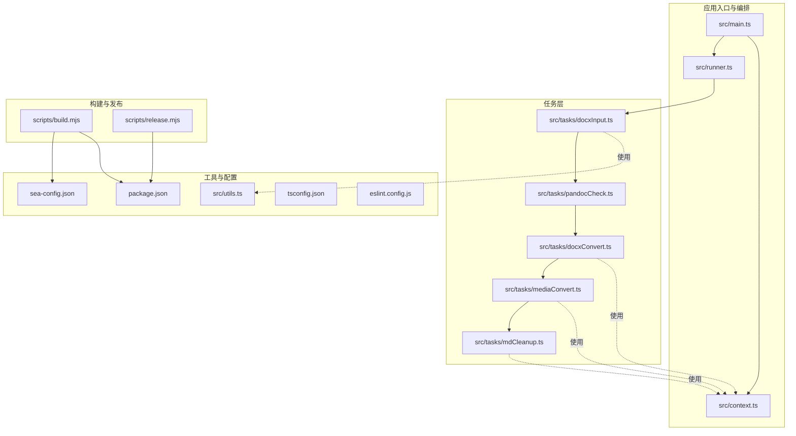
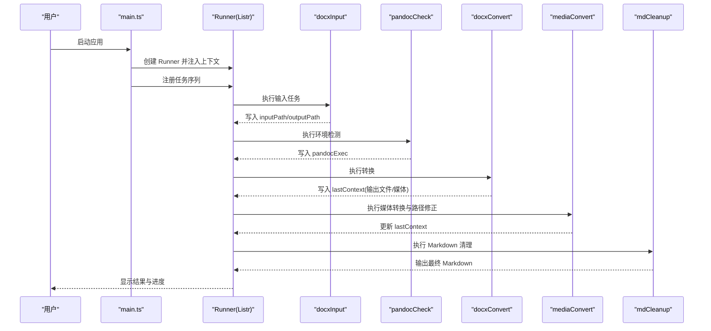
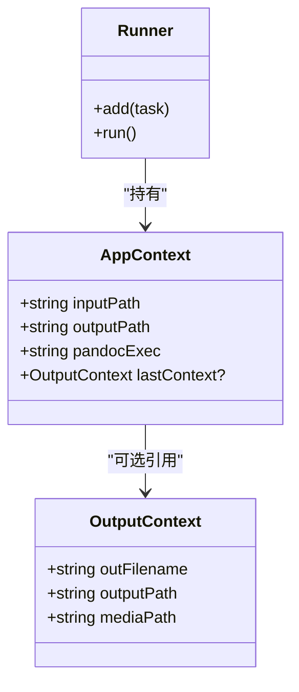
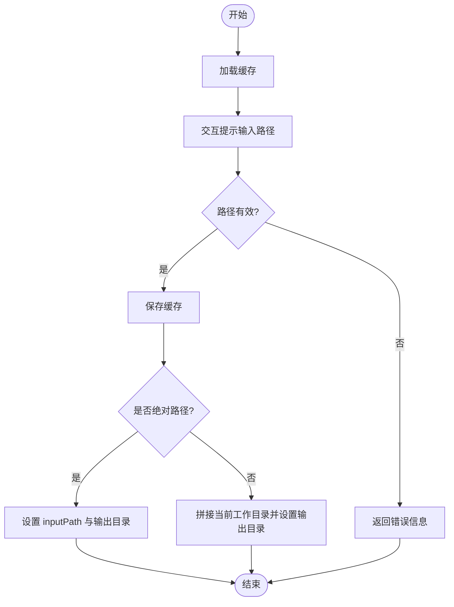
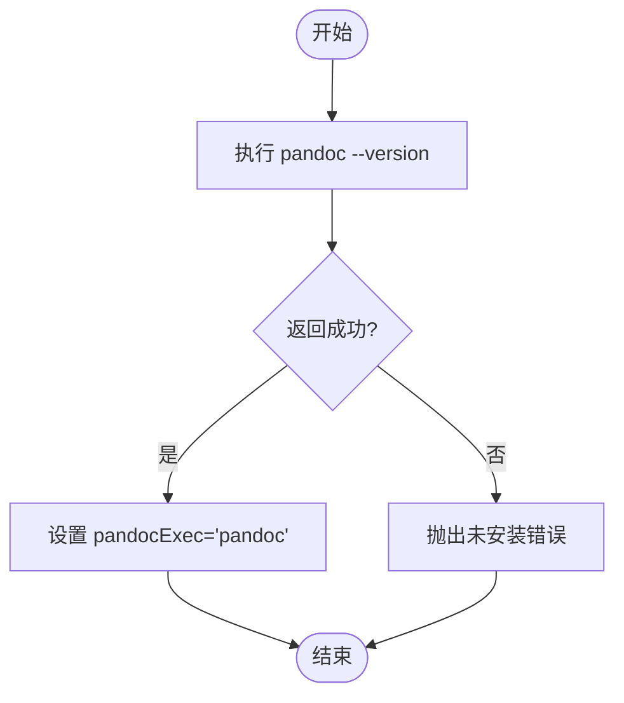
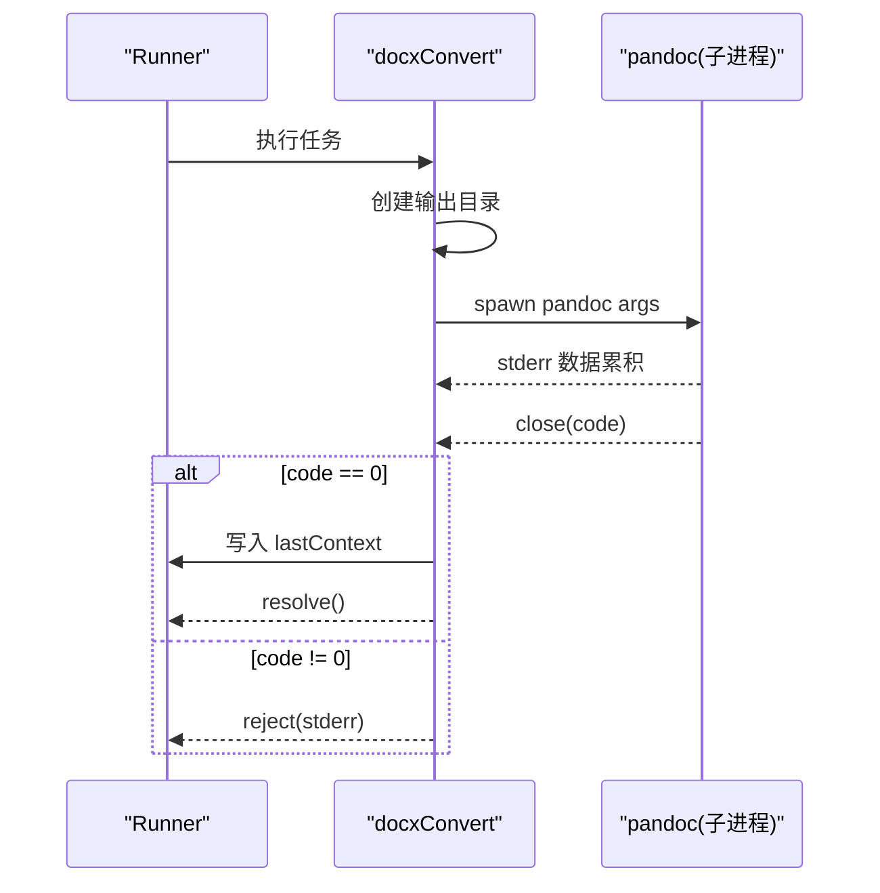
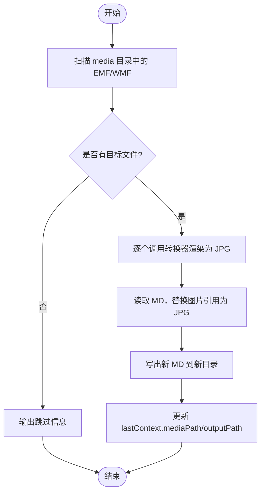
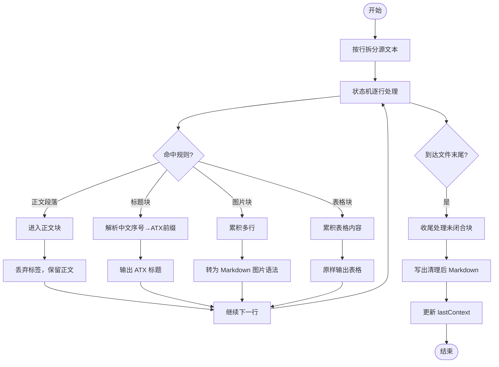
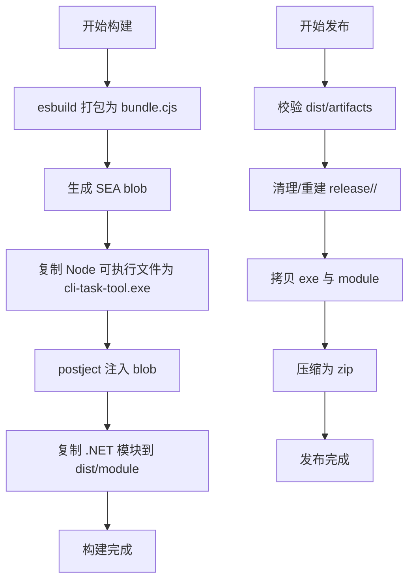
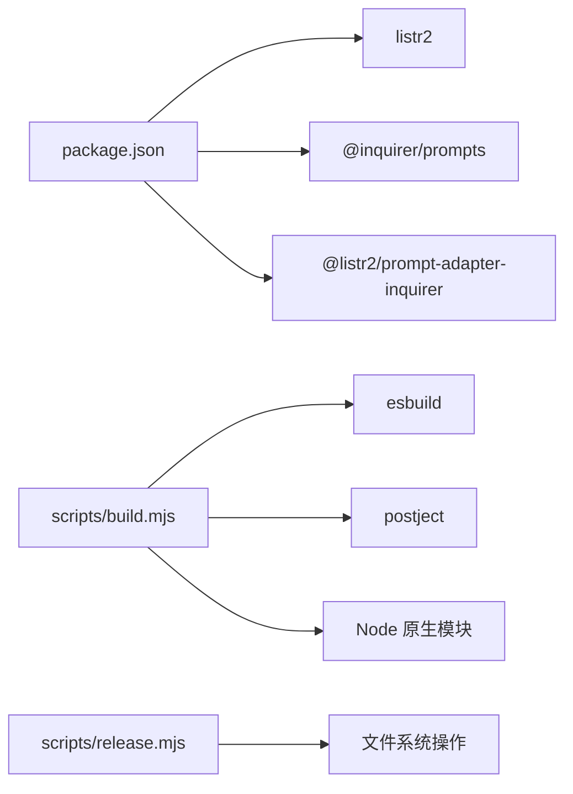

# 核心架构设计

<cite>
**本文引用的文件**
- [src/main.ts](file://src/main.ts)
- [src/context.ts](file://src/context.ts)
- [src/runner.ts](file://src/runner.ts)
- [src/tasks/docxInput.ts](file://src/tasks/docxInput.ts)
- [src/tasks/pandocCheck.ts](file://src/tasks/pandocCheck.ts)
- [src/tasks/docxConvert.ts](file://src/tasks/docxConvert.ts)
- [src/tasks/mediaConvert.ts](file://src/tasks/mediaConvert.ts)
- [src/tasks/mdCleanup.ts](file://src/tasks/mdCleanup.ts)
- [src/utils.ts](file://src/utils.ts)
- [scripts/build.mjs](file://scripts/build.mjs)
- [scripts/release.mjs](file://scripts/release.mjs)
- [sea-config.json](file://sea-config.json)
- [package.json](file://package.json)
- [tsconfig.json](file://tsconfig.json)
- [eslint.config.js](file://eslint.config.js)
</cite>

## 目录
1. [引言](#引言)
2. [项目结构](#项目结构)
3. [核心组件](#核心组件)
4. [架构总览](#架构总览)
5. [详细组件分析](#详细组件分析)
6. [依赖分析](#依赖分析)
7. [性能考虑](#性能考虑)
8. [故障排除指南](#故障排除指南)
9. [结论](#结论)
10. [附录](#附录)

## 引言
本文件面向高级开发者，系统性阐述 Doc2XML CLI 的核心架构设计。该应用以“任务驱动 + 列表器编排”的方式组织多阶段转换流程：从用户输入、环境检测、文档转换、矢量图渲染与路径修正，再到最终的 Markdown 清理与输出。整体采用基于 Listr2 的任务编排系统，结合上下文状态管理（AppContext/OutputContext）实现模块化、可扩展的任务流水线；同时通过 SEA 打包技术将 Node.js 可执行文件与资源一体化分发，提升部署一致性与运行时稳定性。

## 项目结构
项目采用“功能域 + 层次化”组织方式：
- 根入口与编排层：main.ts、runner.ts、context.ts
- 任务层：tasks/*.ts（每个任务封装为 Listr 任务对象）
- 工具与缓存：utils.ts（输入缓存、提示样式等）
- 构建与发布：scripts/build.mjs、scripts/release.mjs
- 配置：sea-config.json、package.json、tsconfig.json、eslint.config.js

**图表来源**
- [src/main.ts:1-41](file://src/main.ts#L1-L41)
- [src/runner.ts:1-10](file://src/runner.ts#L1-L10)
- [src/context.ts:1-21](file://src/context.ts#L1-L21)
- [src/tasks/docxInput.ts:1-52](file://src/tasks/docxInput.ts#L1-L52)
- [src/tasks/pandocCheck.ts:1-24](file://src/tasks/pandocCheck.ts#L1-L24)
- [src/tasks/docxConvert.ts:1-64](file://src/tasks/docxConvert.ts#L1-L64)
- [src/tasks/mediaConvert.ts:1-112](file://src/tasks/mediaConvert.ts#L1-L112)
- [src/tasks/mdCleanup.ts:1-373](file://src/tasks/mdCleanup.ts#L1-L373)
- [src/utils.ts:1-50](file://src/utils.ts#L1-L50)
- [scripts/build.mjs:1-53](file://scripts/build.mjs#L1-L53)
- [scripts/release.mjs:1-42](file://scripts/release.mjs#L1-L42)
- [sea-config.json:1-6](file://sea-config.json#L1-L6)
- [package.json:1-40](file://package.json#L1-L40)
- [tsconfig.json:1-19](file://tsconfig.json#L1-L19)
- [eslint.config.js:1-26](file://eslint.config.js#L1-L26)

**章节来源**
- [src/main.ts:1-41](file://src/main.ts#L1-L41)
- [src/runner.ts:1-10](file://src/runner.ts#L1-L10)
- [src/context.ts:1-21](file://src/context.ts#L1-L21)
- [package.json:1-40](file://package.json#L1-L40)

## 核心组件
- 应用入口与控制流：main.ts 负责创建上下文、创建 Runner 并注册任务，随后统一调度执行；异常处理对用户中断与错误进行区分处理。
- 任务编排器：runner.ts 基于 Listr2 创建 Runner 实例，配置渲染选项与上下文注入。
- 上下文模型：context.ts 定义 AppContext（输入路径、输出路径、pandoc 可执行路径）与 OutputContext（单轮输出产物的文件名、路径、媒体目录），用于任务间传递状态。
- 任务集合：tasks/*.ts 将各阶段封装为 Listr 任务对象，具备标题、任务体与子任务（如媒体转换中的两步子任务）。
- 工具与缓存：utils.ts 提供输入缓存（持久化到用户主目录）与提示样式辅助函数，改善用户体验。
- 构建与发布：scripts/build.mjs 生成 CJS bundle、SEA blob、注入 blob、复制 .NET 模块；scripts/release.mjs 组织发行包。
- 配置：sea-config.json 指定 SEA 主入口与输出；package.json 定义依赖与脚本；tsconfig.json/ eslint.config.js 规范工程化。

**章节来源**
- [src/main.ts:1-41](file://src/main.ts#L1-L41)
- [src/runner.ts:1-10](file://src/runner.ts#L1-L10)
- [src/context.ts:1-21](file://src/context.ts#L1-L21)
- [src/utils.ts:1-50](file://src/utils.ts#L1-L50)
- [scripts/build.mjs:1-53](file://scripts/build.mjs#L1-L53)
- [scripts/release.mjs:1-42](file://scripts/release.mjs#L1-L42)
- [sea-config.json:1-6](file://sea-config.json#L1-L6)
- [package.json:1-40](file://package.json#L1-L40)
- [tsconfig.json:1-19](file://tsconfig.json#L1-L19)
- [eslint.config.js:1-26](file://eslint.config.js#L1-L26)

## 架构总览
Doc2XML CLI 的架构围绕“任务驱动 + 上下文状态 + SEA 打包”展开：
- 任务驱动：每个阶段（输入、环境检测、转换、矢量图处理、清理）独立封装为 Listr 任务，便于测试、复用与扩展。
- 上下文状态：AppContext 作为全局上下文，OutputContext 作为每轮输出的局部上下文，任务通过修改上下文推进流程。
- 编排系统：Listr2 提供可视化进度、子任务嵌套、并发控制与错误传播。
- SEA 打包：将 Node.js 运行时与应用资源一体化，生成自包含可执行文件，降低部署复杂度。

**图表来源**
- [src/main.ts:9-16](file://src/main.ts#L9-L16)
- [src/tasks/docxInput.ts:27-51](file://src/tasks/docxInput.ts#L27-L51)
- [src/tasks/pandocCheck.ts:14-23](file://src/tasks/pandocCheck.ts#L14-L23)
- [src/tasks/docxConvert.ts:10-63](file://src/tasks/docxConvert.ts#L10-L63)
- [src/tasks/mediaConvert.ts:104-111](file://src/tasks/mediaConvert.ts#L104-L111)
- [src/tasks/mdCleanup.ts:331-372](file://src/tasks/mdCleanup.ts#L331-L372)

## 详细组件分析

### 任务编排器与上下文管理
- Runner 创建：通过 createRunner(ctx) 基于 Listr2 初始化，设置渲染选项与上下文注入，保证任务间共享状态。
- 上下文模型：
  - AppContext：输入路径、输出根目录、pandoc 可执行路径；lastContext 作为 OutputContext 的可选字段，承载最近一轮输出产物信息。
  - OutputContext：单轮输出的文件名、输出路径、媒体目录，便于后续任务复用。
- 设计要点：使用不可变的上下文对象，任务只读取/写入必要字段，避免耦合；通过 lastContext 实现“链式产出”，减少重复计算。

**图表来源**
- [src/context.ts:1-21](file://src/context.ts#L1-L21)
- [src/runner.ts:4-9](file://src/runner.ts#L4-L9)

**章节来源**
- [src/runner.ts:1-10](file://src/runner.ts#L1-L10)
- [src/context.ts:1-21](file://src/context.ts#L1-L21)

### 输入任务（docxInput）
- 功能：交互式收集 .docx 路径，校验存在性，支持缓存默认值；根据绝对/相对路径设置 inputPath 与输出目录。
- 交互：使用 Inquirer 与 Listr Inquirer 适配器，提供带颜色提示与默认值。
- 缓存：通过 utils.loadCache/saveCache 将最近一次输入持久化至用户主目录，提升可用性。
- 错误处理：路径为空或不存在时返回明确错误信息，交由 Runner 统一处理。

**图表来源**
- [src/tasks/docxInput.ts:27-51](file://src/tasks/docxInput.ts#L27-L51)
- [src/utils.ts:28-49](file://src/utils.ts#L28-L49)

**章节来源**
- [src/tasks/docxInput.ts:1-52](file://src/tasks/docxInput.ts#L1-L52)
- [src/utils.ts:1-50](file://src/utils.ts#L1-L50)

### 环境检测任务（pandocCheck）
- 功能：检测系统是否已安装 pandoc；若未安装则抛出错误，阻止后续流程。
- 设计：纯函数 testGlobalInstall，职责单一，便于测试与替换策略。

**图表来源**
- [src/tasks/pandocCheck.ts:5-23](file://src/tasks/pandocCheck.ts#L5-L23)

**章节来源**
- [src/tasks/pandocCheck.ts:1-24](file://src/tasks/pandocCheck.ts#L1-L24)

### 文档转换任务（docxConvert）
- 功能：调用 pandoc 将 .docx 转换为 Markdown，并提取媒体资源；成功后写入 lastContext。
- 关键点：使用子进程调用 pandoc，监听 stderr 收集错误；在 close 事件中根据退出码决定成功/失败；创建输出目录与媒体目录。
- 输出：设置 lastContext.outFilename、outputPath、mediaPath，供后续任务使用。

**图表来源**
- [src/tasks/docxConvert.ts:10-63](file://src/tasks/docxConvert.ts#L10-L63)

**章节来源**
- [src/tasks/docxConvert.ts:1-64](file://src/tasks/docxConvert.ts#L1-L64)

### 媒体转换任务（mediaConvert）
- 功能：将 EMF/WMF 矢量图渲染为 JPG，并更新 Markdown 中的图片引用路径；同时复制 MD 文件到新目录。
- 设计模式：采用“子任务列表 + 新建子编排”的方式，先渲染图片，再修补 Markdown，顺序严格且互不并发。
- 资源定位：根据运行时（SEA）与开发环境自动定位 .NET 转换器可执行文件，兼容不同部署形态。
- 状态更新：更新 lastContext.mediaPath 与 outputPath，确保后续清理任务使用最新路径。

**图表来源**
- [src/tasks/mediaConvert.ts:104-111](file://src/tasks/mediaConvert.ts#L104-L111)
- [src/tasks/mediaConvert.ts:43-72](file://src/tasks/mediaConvert.ts#L43-L72)
- [src/tasks/mediaConvert.ts:75-102](file://src/tasks/mediaConvert.ts#L75-L102)

**章节来源**
- [src/tasks/mediaConvert.ts:1-112](file://src/tasks/mediaConvert.ts#L1-L112)

### Markdown 清理任务（mdCleanup）
- 功能：移除 pandoc 生成 Markdown 中的 HTML 片段与冗余标记，修复标题层级与图片引用，输出干净的 Markdown。
- 设计模式：采用“有限状态机 + 正则匹配 + 分块处理”的纯函数清洗逻辑，便于单元测试与演进。
- 状态机：NORMAL/IN_ZHENGWEN/IN_HEADING/IN_FIGURE/IN_TABLE/IN_IMG 多状态切换，处理跨行与嵌套结构。
- 输出：创建输出目录，写出清理后的 Markdown，并更新 lastContext，保留媒体目录不变。

**图表来源**
- [src/tasks/mdCleanup.ts:331-372](file://src/tasks/mdCleanup.ts#L331-L372)
- [src/tasks/mdCleanup.ts:7-327](file://src/tasks/mdCleanup.ts#L7-L327)

**章节来源**
- [src/tasks/mdCleanup.ts:1-373](file://src/tasks/mdCleanup.ts#L1-L373)

### 构建与发布流程（SEA 打包）
- 构建步骤：
  1) 使用 esbuild 将入口打包为 dist/bundle.cjs；
  2) 生成 SEA blob（sea-config.json 指定主入口与输出）；
  3) 复制 Node 可执行文件为 dist/cli-task-tool.exe；
  4) 使用 postject 将 blob 注入可执行文件；
  5) 复制 .NET 模块到 dist/module。
- 发布步骤：校验产物完整性，拷贝到 release/<version>/<name>，压缩为 zip 包。
- SEA 优势：将 Node.js 运行时与应用资源一体化，避免运行时缺失依赖问题，简化分发与部署。

**图表来源**
- [scripts/build.mjs:13-53](file://scripts/build.mjs#L13-L53)
- [scripts/release.mjs:12-42](file://scripts/release.mjs#L12-L42)
- [sea-config.json:1-6](file://sea-config.json#L1-L6)

**章节来源**
- [scripts/build.mjs:1-53](file://scripts/build.mjs#L1-L53)
- [scripts/release.mjs:1-42](file://scripts/release.mjs#L1-L42)
- [sea-config.json:1-6](file://sea-config.json#L1-L6)

## 依赖分析
- 运行时依赖：listr2、@listr2/prompt-adapter-inquirer、@inquirer/prompts。
- 构建与打包：esbuild、postject、Node.js 原生命令（child_process、fs/promises、path）。
- 工程配置：TypeScript 编译、ESLint 规则、包管理脚本。

**图表来源**
- [package.json:21-38](file://package.json#L21-L38)
- [scripts/build.mjs:1-53](file://scripts/build.mjs#L1-L53)
- [scripts/release.mjs:1-42](file://scripts/release.mjs#L1-L42)

**章节来源**
- [package.json:1-40](file://package.json#L1-L40)
- [eslint.config.js:1-26](file://eslint.config.js#L1-L26)
- [tsconfig.json:1-19](file://tsconfig.json#L1-L19)

## 性能考虑
- I/O 优化：任务内部尽量批量读写与串行处理，避免不必要的并发导致磁盘争用；媒体转换阶段按需渲染，减少无效工作。
- 子进程管理：pandoc 与转换器均通过 spawn 启动，监听 stderr 与 close 事件，及时释放资源。
- 缓存策略：输入缓存减少重复交互；lastContext 避免重复计算与路径拼接。
- 构建优化：esbuild 最小化打包，禁用 sourcemap 与声明文件以缩短构建时间（生产构建建议开启）。

## 故障排除指南
- 用户中断：捕获 ExitPromptError，优雅退出并返回特定退出码，避免等待。
- pandoc 未安装：pandocCheck 抛错，提示安装后重试。
- 转换失败：docxConvert 捕获子进程错误输出，将 stderr 作为错误消息返回。
- 资源定位失败：mediaConvert 自动在 SEA 与开发路径间切换，若仍找不到转换器，检查 dist/module 是否正确复制。
- 权限问题：确保输出目录可写，媒体目录可读写。
- 缓存异常：loadCache/saveCache 对异常进行静默处理，不影响主流程。

**章节来源**
- [src/main.ts:31-40](file://src/main.ts#L31-L40)
- [src/tasks/pandocCheck.ts:17-21](file://src/tasks/pandocCheck.ts#L17-L21)
- [src/tasks/docxConvert.ts:48-61](file://src/tasks/docxConvert.ts#L48-L61)
- [src/tasks/mediaConvert.ts:19-24](file://src/tasks/mediaConvert.ts#L19-L24)
- [src/utils.ts:40-49](file://src/utils.ts#L40-L49)

## 结论
Doc2XML CLI 通过“任务驱动 + 上下文状态 + SEA 打包”的架构，实现了高内聚、低耦合的文档转换流水线。Listr2 提供了强大的可视化与错误传播能力；AppContext/OutputContext 的状态管理模式使任务间协作清晰可控；SEA 打包确保了运行时的一致性与可移植性。该设计既满足高级开发者的扩展需求，也为最终用户提供稳定可靠的转换体验。

## 附录
- 扩展建议：
  - 新增任务：遵循现有 Listr 任务接口，仅在需要时修改上下文字段；通过 Runner.add 注册。
  - 策略模式：对于可替换的外部工具（如 pandoc 替代方案），可在 Runner 初始化时注入策略函数。
  - 工厂模式：将任务对象的创建集中到工厂函数中，便于条件注册与测试替身。
  - 并发控制：在允许的场景下使用 newListr 的并发选项，但需注意 I/O 争用与资源限制。
- 配置参考：
  - TypeScript：严格类型检查、ESM/NodeNext 模块解析。
  - ESLint：推荐规则与禁用 any 类型，保持代码质量。
  - SEA：通过 sea-config.json 指定主入口与输出，构建脚本负责生成与注入。