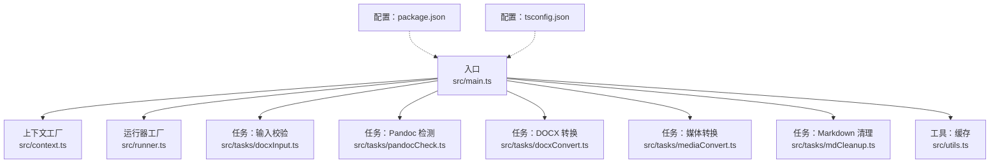
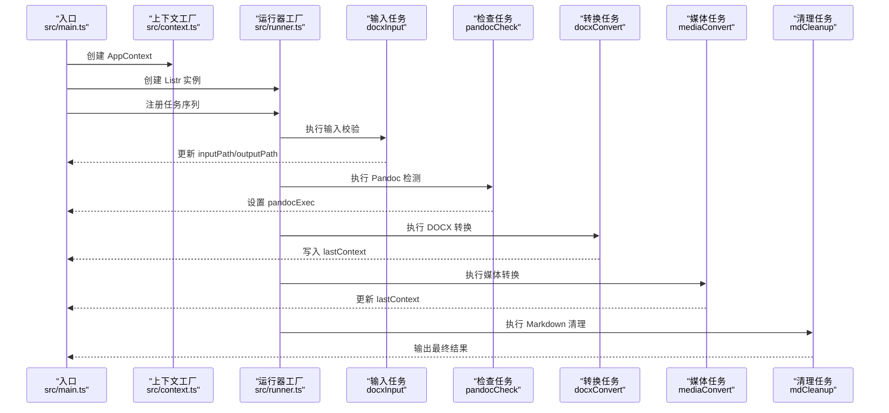
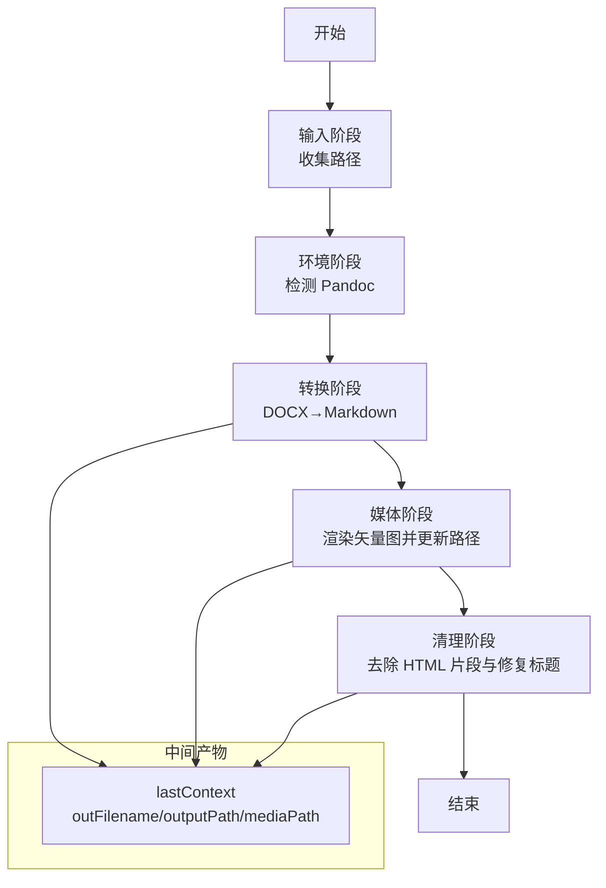
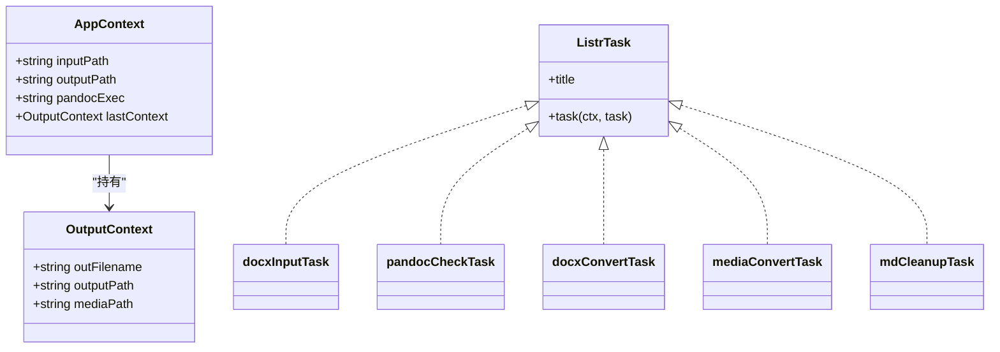
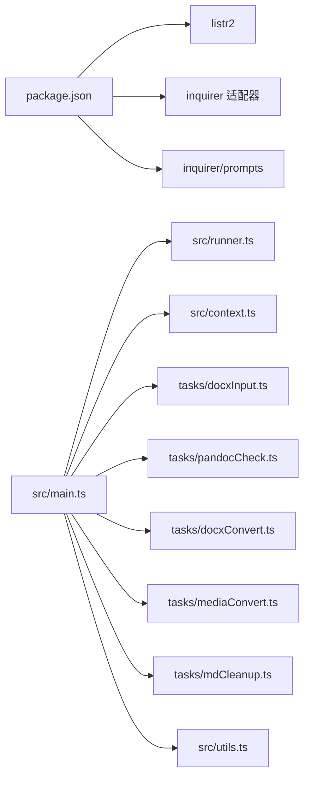

# 模块化设计模式

<cite>
**本文引用的文件**
- [src/main.ts](file://src/main.ts)
- [src/context.ts](file://src/context.ts)
- [src/runner.ts](file://src/runner.ts)
- [src/tasks/docxInput.ts](file://src/tasks/docxInput.ts)
- [src/tasks/pandocCheck.ts](file://src/tasks/pandocCheck.ts)
- [src/tasks/docxConvert.ts](file://src/tasks/docxConvert.ts)
- [src/tasks/mediaConvert.ts](file://src/tasks/mediaConvert.ts)
- [src/tasks/mdCleanup.ts](file://src/tasks/mdCleanup.ts)
- [src/utils.ts](file://src/utils.ts)
- [package.json](file://package.json)
- [tsconfig.json](file://tsconfig.json)
- [out/docxConvert/test.md](file://out/docxConvert/test.md)
- [out/mediaConvert/test.md](file://out/mediaConvert/test.md)
- [out/mdCleanup/test.md](file://out/mdCleanup/test.md)
</cite>

## 目录
1. [引言](#引言)
2. [项目结构](#项目结构)
3. [核心组件](#核心组件)
4. [架构总览](#架构总览)
5. [详细组件分析](#详细组件分析)
6. [依赖分析](#依赖分析)
7. [性能考量](#性能考量)
8. [故障排查指南](#故障排查指南)
9. [结论](#结论)
10. [附录](#附录)

## 引言
本文件围绕 Doc2XML CLI 的模块化设计展开，系统阐述其模块边界、解耦策略、接口规范与扩展点。重点解析以下设计模式的应用与落地：
- 工厂模式：在入口处统一创建上下文与运行器实例
- 策略模式：以 Listr 任务为策略单元，按顺序编排执行
- 依赖注入：通过上下文对象在各任务间传递共享状态
- 扩展点：新增任务只需遵循 Listr 任务接口，即可无缝接入流水线

该设计使得模块职责清晰、耦合度低、可测试性强、易于维护与演进。

## 项目结构
项目采用“功能域+任务模块”的组织方式：
- 入口与编排：src/main.ts 负责创建上下文与运行器，注册并执行任务
- 上下文与运行器：src/context.ts 定义应用上下文；src/runner.ts 提供工厂方法创建 Listr 实例
- 任务模块：src/tasks/* 下的每个文件是一个独立任务，遵循统一接口
- 工具与缓存：src/utils.ts 提供通用工具与用户输入缓存
- 配置与脚本：package.json 定义构建与运行脚本；tsconfig.json 规范编译选项

图表来源
- [src/main.ts:1-41](file://src/main.ts#L1-L41)
- [src/context.ts:1-21](file://src/context.ts#L1-L21)
- [src/runner.ts:1-10](file://src/runner.ts#L1-L10)
- [src/tasks/docxInput.ts:1-52](file://src/tasks/docxInput.ts#L1-L52)
- [src/tasks/pandocCheck.ts:1-24](file://src/tasks/pandocCheck.ts#L1-L24)
- [src/tasks/docxConvert.ts:1-64](file://src/tasks/docxConvert.ts#L1-L64)
- [src/tasks/mediaConvert.ts:1-112](file://src/tasks/mediaConvert.ts#L1-L112)
- [src/tasks/mdCleanup.ts:1-373](file://src/tasks/mdCleanup.ts#L1-L373)
- [src/utils.ts:1-50](file://src/utils.ts#L1-L50)
- [package.json:1-40](file://package.json#L1-L40)
- [tsconfig.json:1-19](file://tsconfig.json#L1-L19)

章节来源
- [src/main.ts:1-41](file://src/main.ts#L1-L41)
- [package.json:1-40](file://package.json#L1-L40)
- [tsconfig.json:1-19](file://tsconfig.json#L1-L19)

## 核心组件
- 应用上下文 AppContext：封装输入路径、输出路径、Pandoc 可执行文件路径以及上一阶段输出上下文
- 任务接口：ListrTask<AppContext>，统一的任务结构，包含标题与执行函数
- 运行器：基于 Listr2 的任务编排器，支持并发/串行子任务与进度输出
- 工具与缓存：提供输入缓存持久化与交互提示样式工具

章节来源
- [src/context.ts:1-21](file://src/context.ts#L1-L21)
- [src/runner.ts:1-10](file://src/runner.ts#L1-L10)
- [src/utils.ts:1-50](file://src/utils.ts#L1-L50)

## 架构总览
整体采用“入口编排 + 任务模块 + 共享上下文”的三层架构：
- 入口层：负责初始化上下文与运行器，注册任务并触发执行
- 任务层：每个任务独立实现自身业务，通过上下文传递状态
- 数据层：上下文作为共享状态容器，贯穿整个流水线

图表来源
- [src/main.ts:9-16](file://src/main.ts#L9-L16)
- [src/context.ts:18-20](file://src/context.ts#L18-L20)
- [src/runner.ts:4-9](file://src/runner.ts#L4-L9)
- [src/tasks/docxInput.ts:27-52](file://src/tasks/docxInput.ts#L27-L52)
- [src/tasks/pandocCheck.ts:14-24](file://src/tasks/pandocCheck.ts#L14-L24)
- [src/tasks/docxConvert.ts:10-64](file://src/tasks/docxConvert.ts#L10-L64)
- [src/tasks/mediaConvert.ts:104-112](file://src/tasks/mediaConvert.ts#L104-L112)
- [src/tasks/mdCleanup.ts:331-373](file://src/tasks/mdCleanup.ts#L331-L373)

## 详细组件分析

### 设计模式与模块化实践
- 工厂模式
  - 上下文工厂：在入口处集中创建 AppContext，便于统一初始化与后续扩展
  - 运行器工厂：通过 createRunner(ctx) 统一创建 Listr 实例，隐藏渲染器配置细节
- 策略模式
  - 每个任务以 ListrTask<AppContext> 为策略单元，彼此独立，可按序或并发组合
  - 通过任务注册与编排，形成可插拔的转换策略集合
- 依赖注入
  - 通过 AppContext 注入到每个任务，实现跨任务状态共享（如输出文件名、路径、媒体目录）
  - 任务之间通过 lastContext 传递中间产物，避免全局变量与隐式耦合

章节来源
- [src/main.ts:9-16](file://src/main.ts#L9-L16)
- [src/context.ts:18-20](file://src/context.ts#L18-L20)
- [src/runner.ts:4-9](file://src/runner.ts#L4-L9)
- [src/tasks/docxConvert.ts:52-56](file://src/tasks/docxConvert.ts#L52-L56)
- [src/tasks/mediaConvert.ts:95-99](file://src/tasks/mediaConvert.ts#L95-L99)
- [src/tasks/mdCleanup.ts:362-366](file://src/tasks/mdCleanup.ts#L362-L366)

### 模块边界与接口规范
- 模块边界
  - 输入模块：负责用户输入与路径校验，产出 inputPath 与 outputPath
  - 环境模块：负责 Pandoc 可用性检测，产出 pandocExec
  - 转换模块：负责 DOCX 到 Markdown 的转换，产出中间 Markdown 与媒体目录
  - 媒体模块：负责矢量图渲染与 Markdown 路径修正，产出最终 Markdown 与媒体目录
  - 清理模块：负责去除 HTML 片段与修复标题层级，产出最终 Markdown
- 接口规范
  - 任务统一实现 ListrTask<AppContext>，包含 title 与 task(ctx, task)
  - 任务通过 ctx 访问共享状态，通过 task.output 输出进度
  - 任务通过 ctx.lastContext 传递中间产物，保证数据流清晰

章节来源
- [src/tasks/docxInput.ts:27-52](file://src/tasks/docxInput.ts#L27-L52)
- [src/tasks/pandocCheck.ts:14-24](file://src/tasks/pandocCheck.ts#L14-L24)
- [src/tasks/docxConvert.ts:10-64](file://src/tasks/docxConvert.ts#L10-L64)
- [src/tasks/mediaConvert.ts:104-112](file://src/tasks/mediaConvert.ts#L104-L112)
- [src/tasks/mdCleanup.ts:331-373](file://src/tasks/mdCleanup.ts#L331-L373)

### 任务协作与数据流
- 数据流
  - 输入阶段：收集用户输入，确定输出目录
  - 环境阶段：检测 Pandoc 并设置可执行文件路径
  - 转换阶段：调用 Pandoc 生成 Markdown 与媒体目录，并记录 lastContext
  - 媒体阶段：渲染 EMF/WMF 为 JPG，更新 Markdown 中的媒体引用，再次记录 lastContext
  - 清理阶段：去除 HTML 片段、修复标题层级，输出最终 Markdown
- 协作方式
  - 串行执行：输入 → 环境 → 转换 → 媒体 → 清理
  - 子任务协作：媒体转换内部包含两个子任务，串行执行，确保渲染后再替换路径

图表来源
- [src/tasks/docxInput.ts:27-52](file://src/tasks/docxInput.ts#L27-L52)
- [src/tasks/pandocCheck.ts:14-24](file://src/tasks/pandocCheck.ts#L14-L24)
- [src/tasks/docxConvert.ts:10-64](file://src/tasks/docxConvert.ts#L10-L64)
- [src/tasks/mediaConvert.ts:104-112](file://src/tasks/mediaConvert.ts#L104-L112)
- [src/tasks/mdCleanup.ts:331-373](file://src/tasks/mdCleanup.ts#L331-L373)

### 代码级类图（任务与上下文）

图表来源
- [src/context.ts:1-21](file://src/context.ts#L1-L21)
- [src/tasks/docxInput.ts:27-52](file://src/tasks/docxInput.ts#L27-L52)
- [src/tasks/pandocCheck.ts:14-24](file://src/tasks/pandocCheck.ts#L14-L24)
- [src/tasks/docxConvert.ts:10-64](file://src/tasks/docxConvert.ts#L10-L64)
- [src/tasks/mediaConvert.ts:104-112](file://src/tasks/mediaConvert.ts#L104-L112)
- [src/tasks/mdCleanup.ts:331-373](file://src/tasks/mdCleanup.ts#L331-L373)

### 新增模块示例（步骤说明）
- 定义任务
  - 在 src/tasks/ 下新增一个文件，导出一个 ListrTask<AppContext> 对象
  - 在任务中使用 ctx 访问共享状态，使用 task.output 输出进度
- 注册任务
  - 在入口文件 src/main.ts 中导入新任务并调用 runner.add(...)
- 验证数据流
  - 如需中间产物，可在任务完成后设置 ctx.lastContext
  - 在后续任务中读取 ctx.lastContext 获取上一阶段输出

章节来源
- [src/main.ts:3-16](file://src/main.ts#L3-L16)
- [src/tasks/docxConvert.ts:52-56](file://src/tasks/docxConvert.ts#L52-L56)
- [src/tasks/mediaConvert.ts:95-99](file://src/tasks/mediaConvert.ts#L95-L99)
- [src/tasks/mdCleanup.ts:362-366](file://src/tasks/mdCleanup.ts#L362-L366)

### 模块化带来的维护优势
- 可测试性：每个任务独立，便于单元测试与模拟
- 可扩展性：新增任务无需修改既有任务，仅需遵循接口规范
- 可观察性：Listr 的进度输出与错误传播清晰可见
- 可移植性：上下文抽象屏蔽底层细节，便于替换实现

## 依赖分析
- 外部依赖
  - listr2：任务编排与渲染
  - @listr2/prompt-adapter-inquirer：与 inquirer 的交互适配
  - @inquirer/prompts：命令行交互
- 内部依赖
  - 任务之间通过 AppContext 与 lastContext 解耦
  - 工具模块提供缓存与样式工具，被多个任务复用

图表来源
- [package.json:21-38](file://package.json#L21-L38)
- [src/main.ts:1-7](file://src/main.ts#L1-L7)
- [src/runner.ts:1-9](file://src/runner.ts#L1-L9)
- [src/context.ts:1-21](file://src/context.ts#L1-L21)
- [src/tasks/docxInput.ts:1-52](file://src/tasks/docxInput.ts#L1-L52)
- [src/tasks/pandocCheck.ts:1-24](file://src/tasks/pandocCheck.ts#L1-L24)
- [src/tasks/docxConvert.ts:1-64](file://src/tasks/docxConvert.ts#L1-L64)
- [src/tasks/mediaConvert.ts:1-112](file://src/tasks/mediaConvert.ts#L1-L112)
- [src/tasks/mdCleanup.ts:1-373](file://src/tasks/mdCleanup.ts#L1-L373)
- [src/utils.ts:1-50](file://src/utils.ts#L1-L50)

章节来源
- [package.json:21-38](file://package.json#L21-L38)

## 性能考量
- I/O 与子进程
  - DOCX 转换与媒体渲染均涉及外部进程调用，建议在任务内部捕获错误并输出详细日志
- 并发策略
  - 当前媒体转换采用串行子任务，避免资源竞争；如需加速，可评估子任务间互斥关系后调整
- 缓存与复用
  - 使用用户输入缓存减少重复交互，提升用户体验

## 故障排查指南
- 常见问题
  - Pandoc 未安装：检查环境任务是否抛出异常，确认系统 PATH 中存在 pandoc
  - DOCX 路径无效：输入任务会进行路径校验，确认文件存在且路径正确
  - 媒体转换失败：检查 MetafileConverter.exe 是否可执行，以及媒体目录是否存在
- 错误处理
  - 任务内部通过 reject/new Error 抛出错误，入口层统一捕获并输出
  - Ctrl+C 时会抛出特定错误类型，入口层直接退出不等待

章节来源
- [src/tasks/pandocCheck.ts:14-24](file://src/tasks/pandocCheck.ts#L14-L24)
- [src/tasks/docxInput.ts:13-25](file://src/tasks/docxInput.ts#L13-L25)
- [src/tasks/mediaConvert.ts:29-40](file://src/tasks/mediaConvert.ts#L29-L40)
- [src/main.ts:31-40](file://src/main.ts#L31-L40)

## 结论
Doc2XML CLI 的模块化设计以“工厂 + 策略 + 依赖注入”为核心，实现了清晰的模块边界、稳定的接口规范与良好的扩展性。通过 Listr 任务编排，模块间以上下文为纽带进行松耦合协作，既保证了可维护性，也为未来新增转换算法与处理流程提供了坚实基础。

## 附录
- 输出样例对比
  - 转换阶段输出：包含原始 HTML 标签与媒体引用
  - 媒体阶段输出：EMF/WMF 已渲染为 JPG，Markdown 中的媒体引用已更新
  - 清理阶段输出：HTML 标签被移除，标题层级规范化，表格与图片引用修复

章节来源
- [out/docxConvert/test.md:1-200](file://out/docxConvert/test.md#L1-L200)
- [out/mediaConvert/test.md:1-200](file://out/mediaConvert/test.md#L1-L200)
- [out/mdCleanup/test.md:1-128](file://out/mdCleanup/test.md#L1-L128)