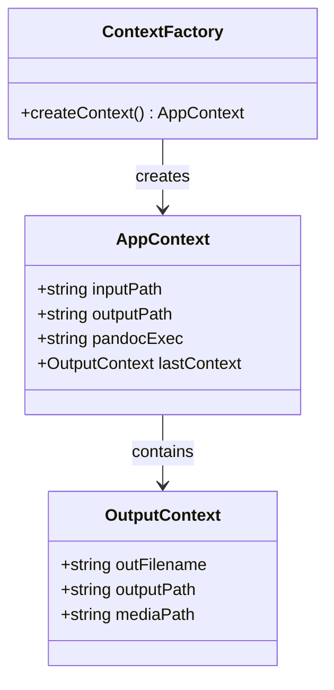
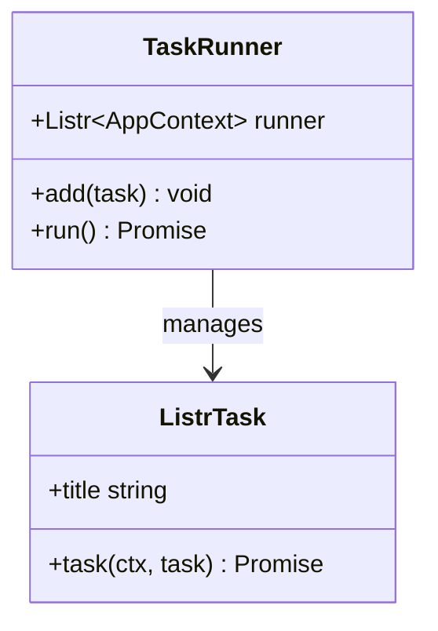
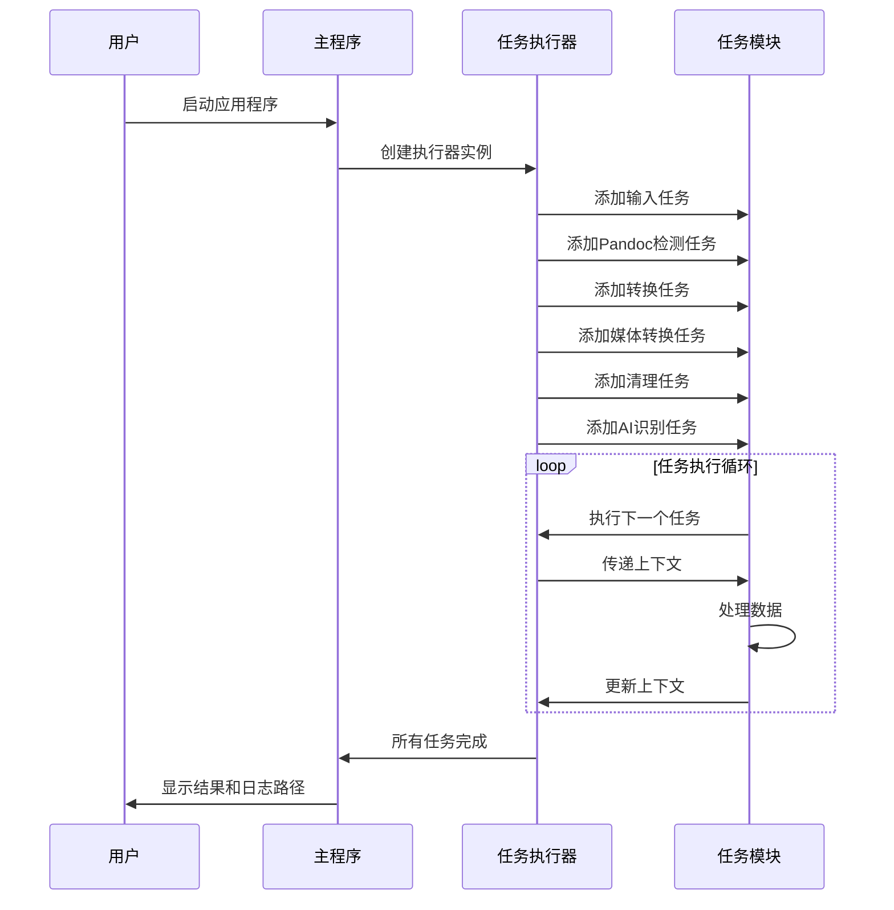
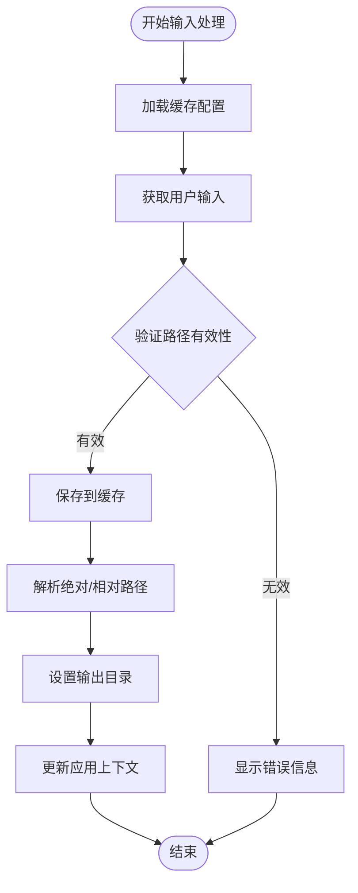
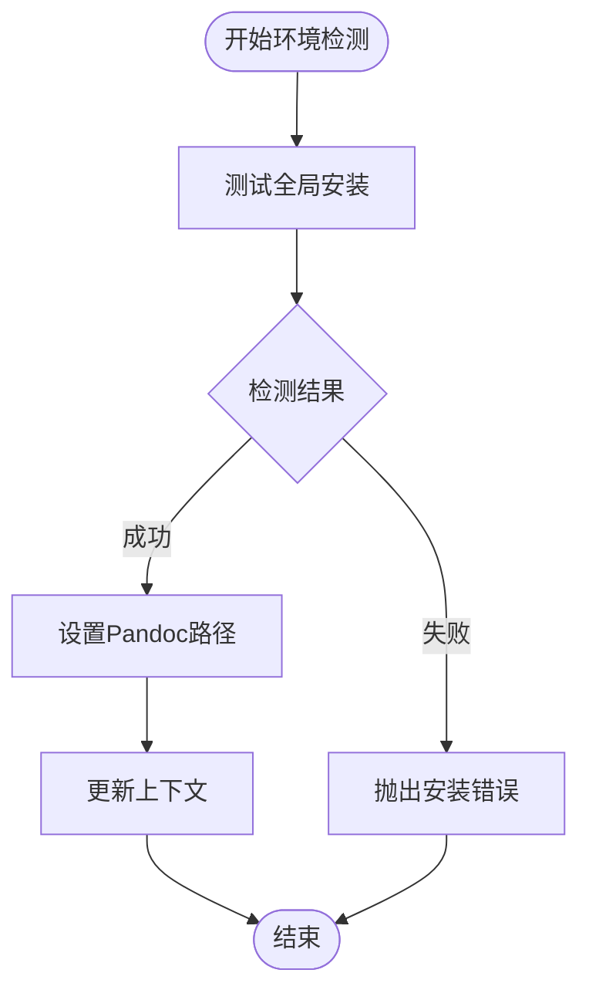
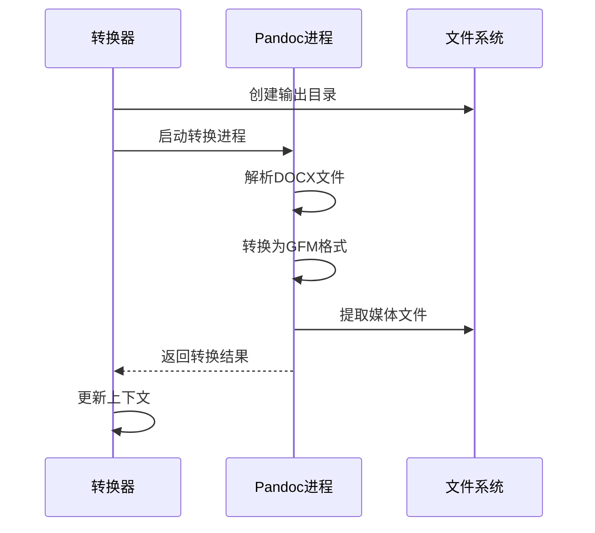
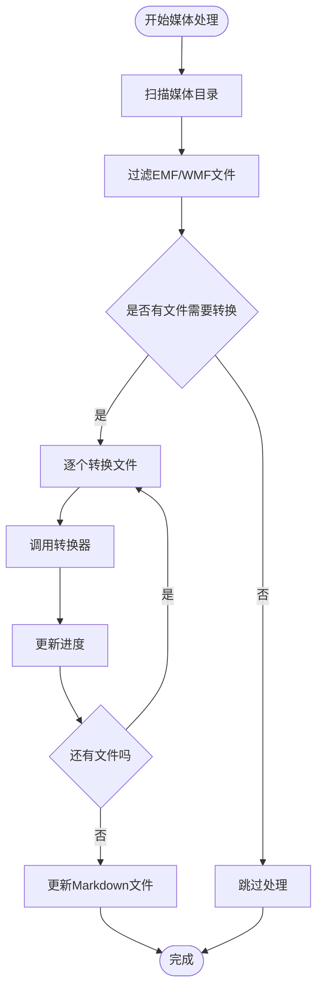
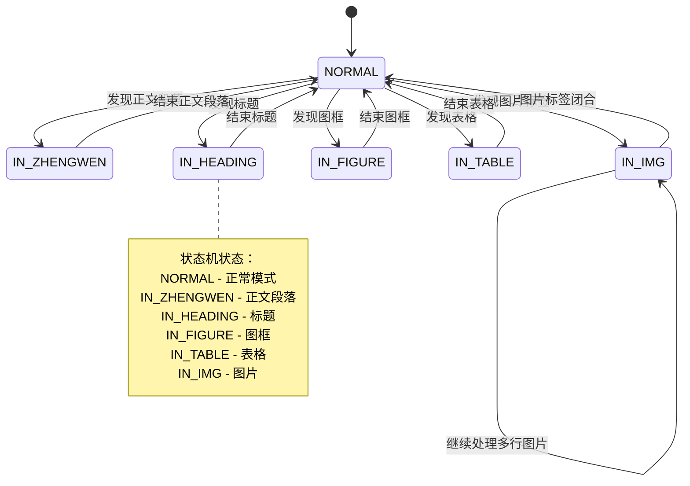
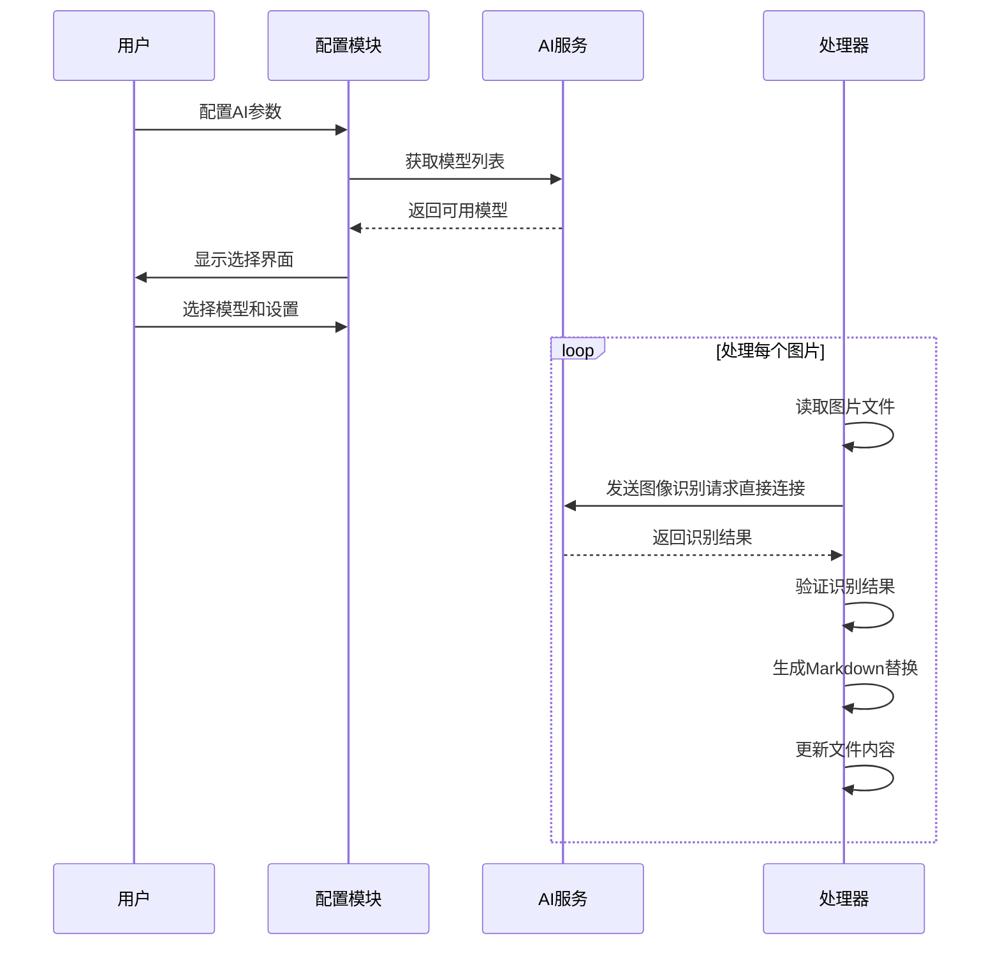

# 网络代理系统

<cite>
**本文档引用的文件**
- [src/main.ts](file://src/main.ts)
- [src/context.ts](file://src/context.ts)
- [src/runner.ts](file://src/runner.ts)
- [src/logger.ts](file://src/logger.ts)
- [src/utils.ts](file://src/utils.ts)
- [src/tasks/docxInput.ts](file://src/tasks/docxInput.ts)
- [src/tasks/pandocCheck.ts](file://src/tasks/pandocCheck.ts)
- [src/tasks/docxConvert.ts](file://src/tasks/docxConvert.ts)
- [src/tasks/mediaConvert.ts](file://src/tasks/mediaConvert.ts)
- [src/tasks/mdCleanup.ts](file://src/tasks/mdCleanup.ts)
- [src/tasks/imageRecognition.ts](file://src/tasks/imageRecognition.ts)
- [package.json](file://package.json)
</cite>

## 更新摘要
**所做更改**
- 移除了代理检测和 HTTP 客户端相关的所有内容
- 删除了 fetch.ts 和 proxy.ts 文件的相关引用
- 更新了 AI 图像识别模块的网络通信实现
- 简化了网络连接方式，移除了代理感知架构

## 目录
1. [简介](#简介)
2. [项目结构](#项目结构)
3. [核心组件](#核心组件)
4. [架构概览](#架构概览)
5. [详细组件分析](#详细组件分析)
6. [依赖关系分析](#依赖关系分析)
7. [性能考虑](#性能考虑)
8. [故障排除指南](#故障排除指南)
9. [结论](#结论)

## 简介

这是一个基于 Node.js 的文档转换网络代理系统，专门用于将 .docx 文档转换为 Markdown 格式。该系统集成了多种功能模块，包括文档输入处理、Pandoc 环境检测、矢量图形转换、Markdown 清理以及 AI 图像识别等功能。

系统采用流水线架构，通过 Listr2 库管理任务执行顺序，支持交互式用户界面和详细的日志记录功能。整个流程从用户输入开始，经过多个处理阶段，最终输出高质量的 Markdown 文档。

**更新** 系统现已简化为直接网络连接方式，移除了之前的代理感知架构和 undici 基于的 HTTP 客户端功能。

## 项目结构

项目采用模块化设计，主要包含以下核心目录和文件：

```mermaid
graph TB
subgraph "项目根目录"
A[src/main.ts] --> B[src/context.ts]
A --> C[src/runner.ts]
A --> D[src/logger.ts]
A --> E[src/utils.ts]
subgraph "任务模块"
F[src/tasks/docxInput.ts]
G[src/tasks/pandocCheck.ts]
H[src/tasks/docxConvert.ts]
I[src/tasks/mediaConvert.ts]
J[src/tasks/mdCleanup.ts]
K[src/tasks/imageRecognition.ts]
end
A --> F
A --> G
A --> H
A --> I
A --> J
A --> K
end
subgraph "外部依赖"
L[listr2]
M[@inquirer/prompts]
N[@ai-sdk/openai]
O[ai]
end
F --> M
G --> L
H --> L
I --> L
J --> L
K --> N
K --> O
```

**图表来源**
- [src/main.ts:1-57](file://src/main.ts#L1-L57)
- [src/context.ts:1-21](file://src/context.ts#L1-L21)
- [src/runner.ts:1-10](file://src/runner.ts#L1-L10)

**章节来源**
- [src/main.ts:1-57](file://src/main.ts#L1-L57)
- [package.json:1-42](file://package.json#L1-L42)

## 核心组件

### 应用上下文管理器

应用上下文负责管理整个转换过程中的状态信息，包括输入路径、输出路径、Pandoc 可执行文件路径以及中间处理结果。



**图表来源**
- [src/context.ts:1-21](file://src/context.ts#L1-L21)

### 任务执行器

系统使用 Listr2 库创建任务执行器，支持并行和串行任务执行，提供进度显示和错误处理功能。



**图表来源**
- [src/runner.ts:1-10](file://src/runner.ts#L1-L10)

**章节来源**
- [src/context.ts:1-21](file://src/context.ts#L1-L21)
- [src/runner.ts:1-10](file://src/runner.ts#L1-L10)

## 架构概览

系统采用流水线架构，将复杂的文档转换过程分解为多个独立的任务模块：



**图表来源**
- [src/main.ts:11-57](file://src/main.ts#L11-L57)
- [src/runner.ts:4-9](file://src/runner.ts#L4-L9)

系统架构特点：
- **模块化设计**：每个功能都封装在独立的任务模块中
- **状态管理**：通过上下文对象传递数据和状态
- **错误处理**：统一的日志记录和错误处理机制
- **用户交互**：支持命令行交互和配置

## 详细组件分析

### 文档输入处理模块

文档输入处理模块负责接收用户输入的 .docx 文件路径，进行路径验证和缓存管理。



**图表来源**
- [src/tasks/docxInput.ts:28-61](file://src/tasks/docxInput.ts#L28-L61)

**章节来源**
- [src/tasks/docxInput.ts:1-61](file://src/tasks/docxInput.ts#L1-L61)
- [src/utils.ts:20-54](file://src/utils.ts#L20-L54)

### Pandoc 环境检测模块

Pandoc 环境检测模块负责验证系统中 Pandoc 是否正确安装和可用。



**图表来源**
- [src/tasks/pandocCheck.ts:15-28](file://src/tasks/pandocCheck.ts#L15-L28)

**章节来源**
- [src/tasks/pandocCheck.ts:1-28](file://src/tasks/pandocCheck.ts#L1-L28)

### 文档转换模块

文档转换模块使用 Pandoc 将 .docx 文件转换为 Markdown 格式，并提取媒体文件。



**图表来源**
- [src/tasks/docxConvert.ts:11-83](file://src/tasks/docxConvert.ts#L11-L83)

**章节来源**
- [src/tasks/docxConvert.ts:1-83](file://src/tasks/docxConvert.ts#L1-L83)

### 媒体转换模块

媒体转换模块专门处理 EMF 和 WMF 矢量图形，将其转换为 JPG 格式，并更新 Markdown 文件中的引用路径。



**图表来源**
- [src/tasks/mediaConvert.ts:56-136](file://src/tasks/mediaConvert.ts#L56-L136)

**章节来源**
- [src/tasks/mediaConvert.ts:1-136](file://src/tasks/mediaConvert.ts#L1-L136)

### Markdown 清理模块

Markdown 清理模块使用状态机算法清理 Pandoc 生成的 HTML 标记，转换为标准的 Markdown 格式。



**图表来源**
- [src/tasks/mdCleanup.ts:7-15](file://src/tasks/mdCleanup.ts#L7-L15)

**章节来源**
- [src/tasks/mdCleanup.ts:1-392](file://src/tasks/mdCleanup.ts#L1-L392)

### AI 图像识别模块

AI 图像识别模块集成 OpenAI API，自动识别图片内容并替换为相应的 Markdown 格式。**更新** 现在使用原生 fetch API 进行网络通信，移除了代理感知功能。



**图表来源**
- [src/tasks/imageRecognition.ts:371-611](file://src/tasks/imageRecognition.ts#L371-L611)

**章节来源**
- [src/tasks/imageRecognition.ts:1-611](file://src/tasks/imageRecognition.ts#L1-L611)

## 依赖关系分析

系统依赖关系图展示了各个模块之间的依赖和交互：

```mermaid
graph TB
subgraph "核心模块"
Main[src/main.ts]
Context[src/context.ts]
Runner[src/runner.ts]
Logger[src/logger.ts]
Utils[src/utils.ts]
end
subgraph "任务模块"
DocxInput[src/tasks/docxInput.ts]
PandocCheck[src/tasks/pandocCheck.ts]
DocxConvert[src/tasks/docxConvert.ts]
MediaConvert[src/tasks/mediaConvert.ts]
MDCleanup[src/tasks/mdCleanup.ts]
ImageRec[src/tasks/imageRecognition.ts]
end
subgraph "外部依赖"
Listr2[listr2]
Inquirer[@inquirer/prompts]
OpenAI[@ai-sdk/openai]
AI[ai]
end
Main --> Context
Main --> Runner
Main --> Logger
Main --> Utils
Runner --> DocxInput
Runner --> PandocCheck
Runner --> DocxConvert
Runner --> MediaConvert
Runner --> MDCleanup
Runner --> ImageRec
DocxInput --> Inquirer
ImageRec --> OpenAI
ImageRec --> AI
PandocCheck --> Listr2
DocxConvert --> Listr2
MediaConvert --> Listr2
MDCleanup --> Listr2
ImageRec --> Listr2
```

**图表来源**
- [package.json:21-40](file://package.json#L21-L40)
- [src/main.ts:1-10](file://src/main.ts#L1-L10)

**章节来源**
- [package.json:1-42](file://package.json#L1-L42)

## 性能考虑

### 并行处理优化

系统在任务执行层面采用了合理的并行策略：
- **串行任务**：文档输入、Pandoc 检测、转换等任务必须按顺序执行
- **并行任务**：媒体转换和 AI 识别可以在某些情况下并行处理

### 内存管理

- **流式处理**：大文件处理采用流式读取，避免内存溢出
- **渐进式缓存**：使用磁盘缓存替代内存缓存，减少内存占用
- **及时释放**：处理完成后及时释放文件句柄和内存资源

### I/O 优化

- **批量操作**：媒体文件转换采用批量处理，减少系统调用次数
- **异步操作**：所有文件操作都是异步的，提高响应性
- **错误恢复**：单个文件处理失败不影响整体流程

### 网络连接优化

**更新** 网络连接已简化为直接连接方式：
- **移除代理检测**：不再检测系统代理设置
- **简化 HTTP 客户端**：使用原生 fetch API 进行网络通信
- **减少配置复杂度**：用户只需提供基础的 API 地址和密钥

## 故障排除指南

### 常见问题及解决方案

#### Pandoc 未安装或路径错误

**症状**：执行过程中提示找不到 Pandoc

**解决方法**：
1. 确认 Pandoc 已正确安装
2. 检查系统 PATH 环境变量
3. 手动指定 Pandoc 可执行文件路径

#### AI 服务连接失败

**症状**：AI 图像识别模块无法连接到服务

**解决方法**：
1. 检查网络连接
2. 验证 API 地址和密钥
3. 确认服务端口开放
4. 查看防火墙设置

**更新** 由于移除了代理感知功能，现在使用直接连接方式：
- 直接使用 fetch API 进行网络请求
- 不再检测系统代理设置
- 简化了网络配置流程

#### 文件权限问题

**症状**：无法读取或写入文件

**解决方法**：
1. 检查文件权限设置
2. 确认有足够的磁盘空间
3. 关闭正在使用的文件

#### 内存不足

**症状**：处理大文件时出现内存溢出

**解决方法**：
1. 分批处理大文件
2. 增加系统内存
3. 使用流式处理替代内存处理

**章节来源**
- [src/logger.ts:26-129](file://src/logger.ts#L26-L129)
- [src/tasks/pandocCheck.ts:6-13](file://src/tasks/pandocCheck.ts#L6-L13)

## 结论

这个网络代理系统展现了现代文档处理的最佳实践，具有以下优势：

### 技术优势
- **模块化架构**：清晰的任务分离和职责划分
- **状态管理**：完善的上下文管理和数据传递机制
- **错误处理**：全面的日志记录和错误恢复能力
- **用户友好**：交互式界面和详细的进度反馈

### 功能特性
- **多格式支持**：支持 .docx 到 Markdown 的完整转换流程
- **智能处理**：自动识别和处理矢量图形
- **AI 集成**：支持图像内容的智能识别和替换
- **可扩展性**：易于添加新的处理模块和功能

### 架构简化
**更新** 系统架构已显著简化：
- **移除代理检测**：简化了网络连接逻辑
- **统一 HTTP 客户端**：使用原生 fetch API
- **减少配置复杂度**：用户只需提供基本的 API 信息
- **提升可靠性**：减少了网络层的不确定性因素

### 改进建议
1. **性能监控**：添加性能指标收集和分析
2. **配置管理**：提供更灵活的配置选项
3. **插件系统**：支持第三方插件扩展
4. **并发控制**：优化任务并发执行策略

该系统为文档处理领域提供了一个强大而灵活的解决方案，适用于各种文档转换和处理场景。简化后的架构更加稳定可靠，同时保持了强大的功能特性。