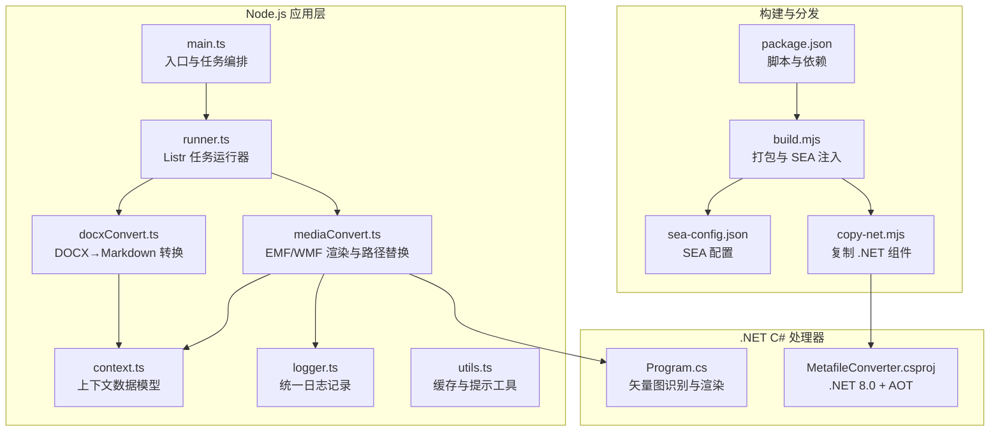
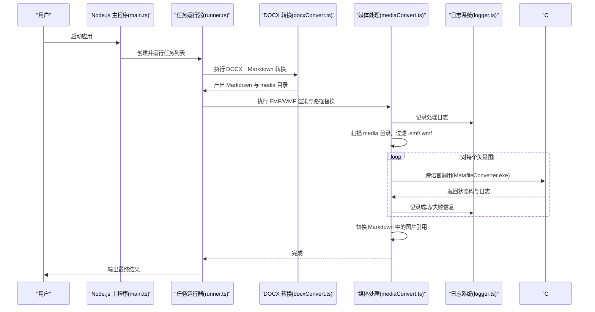
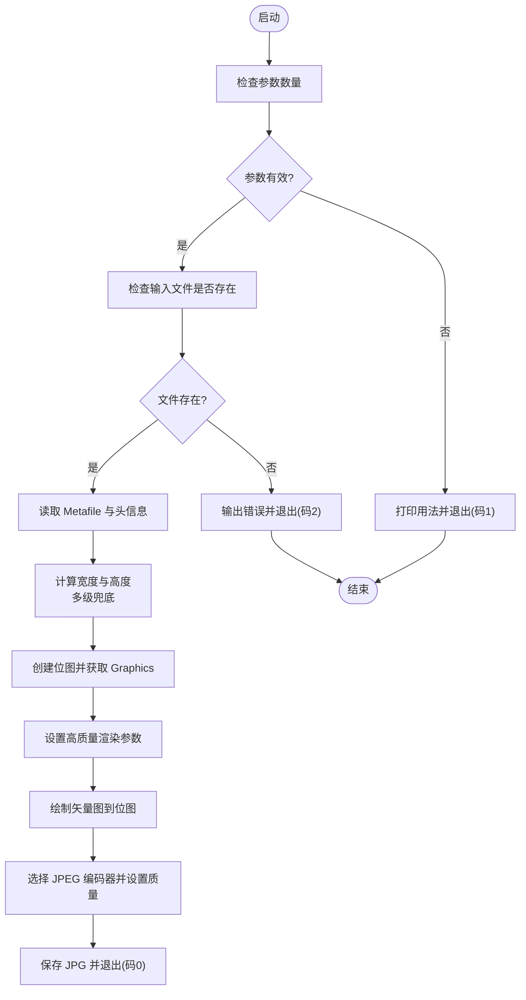
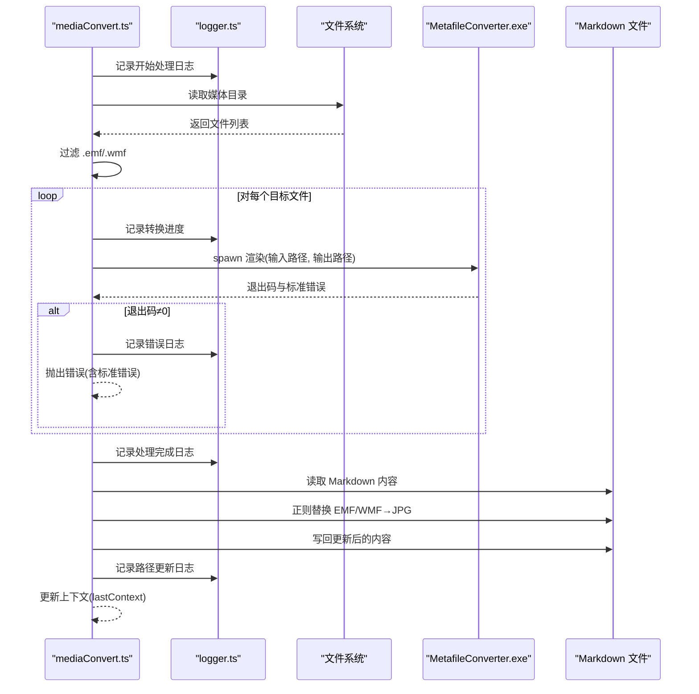
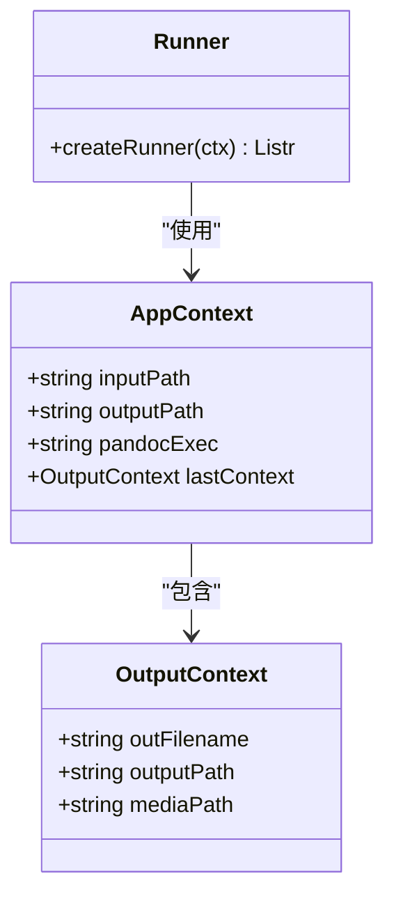
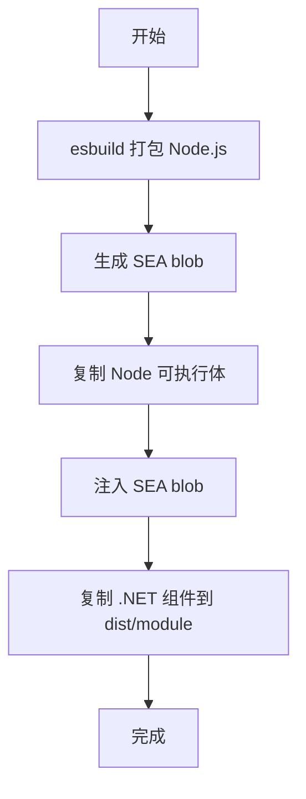
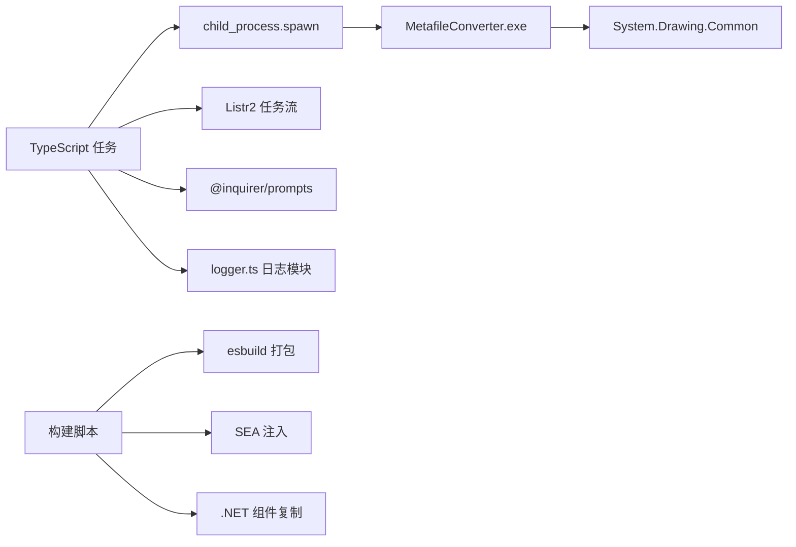

# 矢量媒体处理

<cite>
**本文引用的文件**
- [MetafileConverter.csproj](file://module/MetafileConverter/MetafileConverter/MetafileConverter.csproj)
- [Program.cs](file://module/MetafileConverter/MetafileConverter/Program.cs)
- [mediaConvert.ts](file://src/tasks/mediaConvert.ts)
- [context.ts](file://src/context.ts)
- [main.ts](file://src/main.ts)
- [runner.ts](file://src/runner.ts)
- [docxConvert.ts](file://src/tasks/docxConvert.ts)
- [docxInput.ts](file://src/tasks/docxInput.ts)
- [utils.ts](file://src/utils.ts)
- [build.mjs](file://scripts/build.mjs)
- [copy-net.mjs](file://scripts/copy-net.mjs)
- [package.json](file://package.json)
- [sea-config.json](file://sea-config.json)
- [logger.ts](file://src/logger.ts)
</cite>

## 目录
1. [简介](#简介)
2. [项目结构](#项目结构)
3. [核心组件](#核心组件)
4. [架构总览](#架构总览)
5. [详细组件分析](#详细组件分析)
6. [依赖关系分析](#依赖关系分析)
7. [性能考量](#性能考量)
8. [故障排查指南](#故障排查指南)
9. [结论](#结论)
10. [附录](#附录)

## 简介
本项目围绕"矢量媒体处理"目标，实现了对 EMF/WMF 矢量图的识别与转换：在 Node.js 流程中扫描并定位 EMF/WMF 文件，通过跨语言子进程调用 .NET 8.0 的 C# 可执行程序进行矢量渲染与栅格化，最终输出高质量 JPG 图像，并同步更新 Markdown 文档中的图片引用路径。该方案利用 .NET System.Drawing 的 Metafile 渲染能力，结合 Node.js 的文件系统与进程管理，形成端到端的自动化处理链路。

**更新** 增强了错误处理机制，改进了日志记录和调试能力，提升了转换过程的稳定性和可观测性。

## 项目结构
项目采用"前端 Node.js + 后端 .NET C#"双语言协作模式：
- Node.js 层负责任务编排、文件系统操作、跨语言调用与路径替换。
- C# 层负责矢量图识别、Metafile 渲染、图像编码与输出。
- 构建脚本负责将 Node.js 打包为 SEA 可执行体，并复制 .NET 组件到发布目录。

**图表来源**
- [main.ts:1-57](file://src/main.ts#L1-L57)
- [runner.ts:1-10](file://src/runner.ts#L1-L10)
- [docxConvert.ts:1-64](file://src/tasks/docxConvert.ts#L1-L64)
- [mediaConvert.ts:1-136](file://src/tasks/mediaConvert.ts#L1-L136)
- [context.ts:1-21](file://src/context.ts#L1-L21)
- [MetafileConverter.csproj:1-17](file://module/MetafileConverter/MetafileConverter/MetafileConverter.csproj#L1-L17)
- [Program.cs:1-88](file://module/MetafileConverter/MetafileConverter/Program.cs#L1-L88)
- [build.mjs:1-53](file://scripts/build.mjs#L1-L53)
- [copy-net.mjs:1-37](file://scripts/copy-net.mjs#L1-L37)
- [package.json:1-42](file://package.json#L1-L42)
- [sea-config.json:1-5](file://sea-config.json#L1-L5)

**章节来源**
- [main.ts:1-57](file://src/main.ts#L1-L57)
- [runner.ts:1-10](file://src/runner.ts#L1-L10)
- [docxConvert.ts:1-64](file://src/tasks/docxConvert.ts#L1-L64)
- [mediaConvert.ts:1-136](file://src/tasks/mediaConvert.ts#L1-L136)
- [context.ts:1-21](file://src/context.ts#L1-L21)
- [MetafileConverter.csproj:1-17](file://module/MetafileConverter/MetafileConverter/MetafileConverter.csproj#L1-L17)
- [Program.cs:1-88](file://module/MetafileConverter/MetafileConverter/Program.cs#L1-L88)
- [build.mjs:1-53](file://scripts/build.mjs#L1-L53)
- [copy-net.mjs:1-37](file://scripts/copy-net.mjs#L1-L37)
- [package.json:1-42](file://package.json#L1-L42)
- [sea-config.json:1-5](file://sea-config.json#L1-L5)

## 核心组件
- 矢量图识别与转换（C#）
  - 使用 System.Drawing.Metafile 读取 EMF/WMF 的元信息与边界，计算渲染尺寸；通过高质量渲染参数将矢量绘制到位图；使用 JPEG 编码器输出 JPG。
  - 关键点：尺寸兜底策略、白底填充、高质量插值与抗锯齿、JPEG 质量参数。
- Node.js 任务编排（TypeScript）
  - 定位并调用 .NET 可执行程序，批量处理 media 目录中的 EMF/WMF；将 Markdown 中的 EMF/WMF 引用替换为 JPG。
  - 关键点：跨语言进程调用、错误码与标准错误收集、路径解析与输出目录组织。
- 日志记录与错误处理
  - 统一的 ProcessLogger 单例提供彩色控制台输出和详细文件日志，支持 DEBUG/INFO/WARN/ERROR 等级别。
  - 增强的错误传播机制，包括子进程错误事件监听、非零退出码处理和标准错误聚合。
- 上下文与缓存
  - 统一的 AppContext 传递输出文件名、路径与媒体目录；缓存用户输入路径，提升交互体验。
- 构建与分发
  - 使用 esbuild 打包 Node.js，生成 SEA blob 并注入可执行体；复制 .NET 组件至 dist/module，保证运行时可用。

**更新** 新增了统一的日志记录系统，增强了错误处理的粒度和可追踪性。

**章节来源**
- [Program.cs:1-88](file://module/MetafileConverter/MetafileConverter/Program.cs#L1-L88)
- [mediaConvert.ts:1-136](file://src/tasks/mediaConvert.ts#L1-L136)
- [context.ts:1-21](file://src/context.ts#L1-L21)
- [utils.ts:1-50](file://src/utils.ts#L1-L50)
- [build.mjs:1-53](file://scripts/build.mjs#L1-L53)
- [copy-net.mjs:1-37](file://scripts/copy-net.mjs#L1-L37)
- [logger.ts:1-129](file://src/logger.ts#L1-L129)

## 架构总览
整体流程由 Node.js 任务驱动，核心步骤如下：
1. 输入 .docx 路径，调用 pandoc 输出 Markdown 与媒体目录。
2. 扫描媒体目录，筛选 EMF/WMF 文件。
3. 通过子进程调用 C# 可执行程序，将每个矢量图渲染为 JPG。
4. 更新 Markdown 内容，将 EMF/WMF 引用替换为 JPG。
5. 输出最终结果到统一的 out 目录。

**图表来源**
- [main.ts:1-57](file://src/main.ts#L1-L57)
- [runner.ts:1-10](file://src/runner.ts#L1-L10)
- [docxConvert.ts:1-64](file://src/tasks/docxConvert.ts#L1-L64)
- [mediaConvert.ts:1-136](file://src/tasks/mediaConvert.ts#L1-L136)
- [Program.cs:1-88](file://module/MetafileConverter/MetafileConverter/Program.cs#L1-L88)
- [logger.ts:1-129](file://src/logger.ts#L1-L129)

## 详细组件分析

### C# 矢量图渲染器（MetafileConverter）
- 功能职责
  - 参数校验与错误处理。
  - 读取矢量图头信息，计算渲染尺寸，提供多级兜底。
  - 设置高质量渲染参数，清空背景色，绘制到位图。
  - 使用 JPEG 编码器输出 JPG，设置质量参数。
- 关键实现要点
  - 尺寸获取与兜底：优先使用元信息边界，其次使用 Size，最后默认尺寸。
  - 渲染质量：插值、平滑、像素偏移等参数均设为高质量。
  - 输出控制：显式选择 JPEG 编码器并设置质量参数。
- 错误处理
  - 文件不存在、异常捕获、返回码与标准错误输出。

**图表来源**
- [Program.cs:8-76](file://module/MetafileConverter/MetafileConverter/Program.cs#L8-L76)

**章节来源**
- [Program.cs:1-88](file://module/MetafileConverter/MetafileConverter/Program.cs#L1-L88)

### Node.js 矢量图处理任务（mediaConvert.ts）
- 功能职责
  - 定位 .NET 可执行程序（区分 SEA 运行时与开发环境）。
  - 扫描媒体目录，筛选 EMF/WMF 文件并逐个调用 C# 渲染器。
  - 将 Markdown 中的 EMF/WMF 引用替换为 JPG，并更新上下文。
- 关键实现要点
  - 跨语言调用：spawn 子进程，收集标准错误，根据退出码判断成功与否。
  - 路径解析：兼容 SEA 运行时与开发目录布局。
  - 正则替换：匹配 media/xxx.emf 或 media/xxx.wmf 并替换为 jpg。
- 错误处理
  - 子进程错误事件、非零退出码抛出异常、标准错误聚合。
- 日志记录
  - 使用 logger 模块记录调试、信息、错误级别的日志，包含任务标识和详细上下文。

**图表来源**
- [mediaConvert.ts:29-102](file://src/tasks/mediaConvert.ts#L29-L102)
- [logger.ts:88-121](file://src/logger.ts#L88-L121)

**章节来源**
- [mediaConvert.ts:1-136](file://src/tasks/mediaConvert.ts#L1-L136)
- [logger.ts:1-129](file://src/logger.ts#L1-L129)

### 日志系统（logger.ts）
- 功能职责
  - 提供统一的日志记录接口，支持多种日志级别。
  - 自动创建带时间戳的日志文件，保存到系统临时目录。
  - 控制台彩色输出，便于区分不同级别的日志信息。
- 关键实现要点
  - 单例模式确保全局唯一日志实例。
  - 文件流写入保证日志持久化存储。
  - 支持 DEBUG/INFO/WARN/ERROR 等级别，DEBUG 级别在控制台不输出。
- 使用场景
  - 调试矢量图转换过程。
  - 记录错误详情和堆栈信息。
  - 追踪任务执行进度和状态。

**章节来源**
- [logger.ts:1-129](file://src/logger.ts#L1-L129)

### 上下文与任务编排（context.ts, runner.ts, main.ts）
- 上下文模型
  - AppContext 包含输入路径、输出目录、pandoc 可执行路径与 lastContext。
  - OutputContext 描述某一层输出的文件名、路径与媒体目录。
- 任务编排
  - main.ts 按顺序添加输入、pandoc 检查、DOCX 转换、媒体处理、Markdown 清理任务。
  - runner.ts 创建 Listr 实例，支持并发控制与子任务折叠显示。
- 交互与缓存
  - docxInput.ts 支持输入验证与缓存读写，提升用户体验。

**图表来源**
- [context.ts:1-21](file://src/context.ts#L1-L21)
- [runner.ts:1-10](file://src/runner.ts#L1-L10)
- [main.ts:1-57](file://src/main.ts#L1-L57)

**章节来源**
- [context.ts:1-21](file://src/context.ts#L1-L21)
- [runner.ts:1-10](file://src/runner.ts#L1-L10)
- [main.ts:1-57](file://src/main.ts#L1-L57)
- [docxInput.ts:1-52](file://src/tasks/docxInput.ts#L1-L52)
- [utils.ts:1-50](file://src/utils.ts#L1-L50)

### 构建与分发（build.mjs, copy-net.mjs, package.json, sea-config.json）
- 构建流程
  - 使用 esbuild 打包 Node.js 源码为 dist/bundle.cjs。
  - 生成 SEA blob 并注入到 Node 可执行体，输出可独立运行的 exe。
  - 复制 .NET 组件到 dist/module，确保运行时可用。
- 关键文件
  - package.json 定义构建脚本与依赖。
  - sea-config.json 指定 SEA 主入口与输出 blob 路径。
  - copy-net.mjs 列出必要 DLL 与运行时库，确保 Windows 平台上的 System.Drawing 可用。

**图表来源**
- [build.mjs:13-51](file://scripts/build.mjs#L13-L51)
- [copy-net.mjs:14-36](file://scripts/copy-net.mjs#L14-L36)
- [package.json:7-16](file://package.json#L7-L16)
- [sea-config.json:1-5](file://sea-config.json#L1-L5)

**章节来源**
- [build.mjs:1-53](file://scripts/build.mjs#L1-L53)
- [copy-net.mjs:1-37](file://scripts/copy-net.mjs#L1-L37)
- [package.json:1-42](file://package.json#L1-L42)
- [sea-config.json:1-5](file://sea-config.json#L1-L5)

## 依赖关系分析
- Node.js 侧
  - 依赖 listr2 与 @inquirer/prompts 实现交互式任务流。
  - 通过 child_process.spawn 调用 .NET 可执行程序。
  - 使用自定义 logger 模块进行统一日志管理。
- .NET 侧
  - 目标框架 .NET 8.0，启用 AOT 与全球化固定。
  - 引用 System.Drawing.Common 提供 Metafile 与图像编解码能力。
- 构建侧
  - esbuild 用于打包；postject 注入 SEA blob；copy-net.mjs 复制运行时依赖。

**图表来源**
- [mediaConvert.ts:29-40](file://src/tasks/mediaConvert.ts#L29-L40)
- [MetafileConverter.csproj:3-14](file://module/MetafileConverter/MetafileConverter/MetafileConverter.csproj#L3-L14)
- [build.mjs:13-51](file://scripts/build.mjs#L13-L51)
- [package.json:21-38](file://package.json#L21-L38)
- [logger.ts:124-129](file://src/logger.ts#L124-L129)

**章节来源**
- [mediaConvert.ts:1-136](file://src/tasks/mediaConvert.ts#L1-L136)
- [MetafileConverter.csproj:1-17](file://module/MetafileConverter/MetafileConverter/MetafileConverter.csproj#L1-L17)
- [build.mjs:1-53](file://scripts/build.mjs#L1-L53)
- [package.json:1-42](file://package.json#L1-L42)

## 性能考量
- 渲染质量与体积平衡
  - 高质量插值与抗锯齿提升视觉效果，但会增加内存与 CPU 占用；可根据场景调整。
  - JPEG 质量参数影响文件大小与加载速度，建议在 85–95 区间权衡。
- 批处理与并发
  - 当前媒体处理任务串行执行，避免资源争用；如需加速，可在保证稳定性的前提下评估并发度。
- 尺寸与分辨率
  - 自动尺寸兜底避免渲染失败，但过大尺寸会显著增加内存占用；建议根据实际展示需求设定上限。
- 跨语言调用开销
  - 子进程启动与 I/O 有额外成本；合并小文件或减少调用次数可优化吞吐。
- AOT 与运行时
  - .NET 8.0 AOT 启用减少 JIT 开销，但需确保运行时依赖齐全；Windows 平台需复制 System.Private.Windows.* 等 DLL。
- 日志性能影响
  - 统一日志系统可能增加 I/O 开销，但提供了重要的调试价值；建议在生产环境中适当调整日志级别。

**更新** 新增了日志系统对性能的影响分析。

## 故障排查指南
- 常见问题与定位
  - 输入参数不足：C# 程序会打印用法并返回码 1；检查 Node.js 调用是否传入两个路径参数。
  - 文件不存在：返回码 2；检查媒体目录与文件路径拼接逻辑。
  - 子进程非零退出：收集标准错误，定位具体异常；检查 .NET 组件是否完整复制。
  - 路径解析差异：SEA 运行时与开发环境路径不同，确认 exe 查找逻辑。
  - 日志文件未生成：检查临时目录权限和 logger 初始化。
- 调试技巧
  - 在 Node.js 中打印子进程的标准错误缓冲区，便于快速定位。
  - 逐步缩小范围：先单独测试单个 EMF/WMF 文件，再扩展到批量处理。
  - 校验 .NET 运行时依赖：确保 dist/module 下包含 System.Drawing.Common 与 Windows 平台 DLL。
  - 查看详细日志：运行完成后查看临时目录中的日志文件，获取完整错误堆栈。
- 错误处理与恢复
  - 任务层面对非零退出码抛出错误，便于中断并记录；可在上层重试或降级处理。
  - 使用 logger.error 记录详细的错误信息，包括时间戳、任务标识和错误描述。
- 日志分析
  - DEBUG 级别日志包含详细的处理步骤和中间状态。
  - ERROR 级别日志包含完整的错误堆栈信息，便于问题定位。

**更新** 增强了日志记录和错误处理的指导，新增了日志分析的具体方法。

**章节来源**
- [Program.cs:10-26](file://module/MetafileConverter/MetafileConverter/Program.cs#L10-L26)
- [mediaConvert.ts:29-40](file://src/tasks/mediaConvert.ts#L29-L40)
- [copy-net.mjs:14-36](file://scripts/copy-net.mjs#L14-L36)
- [logger.ts:88-121](file://src/logger.ts#L88-L121)

## 结论
本项目通过 Node.js 与 C# 的协同，实现了对 EMF/WMF 矢量图的可靠识别与高质量渲染。其优势在于：
- 明确的跨语言调用边界与清晰的错误传播。
- 多级尺寸兜底与高质量渲染参数，兼顾稳定性与视觉效果。
- 完整的构建与分发流程，支持 SEA 可执行体与 .NET 组件的统一交付。
- **新增** 统一的日志记录系统，提供全面的调试和监控能力。

建议后续扩展方向：
- 支持更多矢量格式（SVG、EPS 等），可引入第三方库或外部工具链。
- 引入缓存与增量处理，避免重复渲染。
- 增加并发与进度反馈，提升大体量文档的处理效率。
- **新增** 扩展日志系统，支持更细粒度的日志分类和过滤。

## 附录

### .NET 8.0 环境配置要点
- 目标框架与特性
  - 目标框架：net8.0；启用 AOT 与全球化固定，减小部署体积与启动开销。
- 图像处理依赖
  - System.Drawing.Common 提供 Metafile 与图像编解码能力；Windows 平台需复制 System.Private.Windows.Core 与 GdiPlus 相关 DLL。
- 构建与发布
  - 使用 dotnet build -c Release 生成可执行程序；配合 copy-net.mjs 复制运行时依赖。

**章节来源**
- [MetafileConverter.csproj:3-14](file://module/MetafileConverter/MetafileConverter/MetafileConverter.csproj#L3-L14)
- [copy-net.mjs:14-36](file://scripts/copy-net.mjs#L14-L36)

### C# 项目结构与跨语言调用机制
- 项目结构
  - MetafileConverter.sln 管理单项目解决方案；Program.cs 为入口；csproj 指定 .NET 8.0 与包引用。
- 跨语言调用
  - Node.js 使用 child_process.spawn 调用 MetafileConverter.exe，传入输入与输出路径；C# 读取参数并执行渲染；返回码与标准错误用于错误判定。

**章节来源**
- [MetafileConverter.csproj:1-17](file://module/MetafileConverter/MetafileConverter/MetafileConverter.csproj#L1-L17)
- [Program.cs:8-18](file://module/MetafileConverter/MetafileConverter/Program.cs#L8-L18)
- [mediaConvert.ts:29-40](file://src/tasks/mediaConvert.ts#L29-L40)

### 矢量图处理最佳实践
- 矢量图识别
  - 仅处理 .emf 与 .wmf 扩展名；对大小写不敏感，确保路径正确。
- 渲染质量
  - 保持高质量插值与抗锯齿；白底填充避免透明背景导致的渲染差异。
- 输出控制
  - 固定 JPEG 质量参数；命名规则与输出目录结构一致，便于后续处理。
- 错误处理
  - 统一收集标准错误；对文件不存在、渲染失败等情况给出明确提示。
- 日志记录
  - 使用 logger 模块记录关键操作和错误信息；合理设置日志级别。
- 扩展其他矢量格式
  - 引入外部工具（如 ImageMagick、libreoffice/headless）或第三方库，封装为独立可执行程序，复用现有跨语言调用模式。

**更新** 新增了日志记录的最佳实践建议。