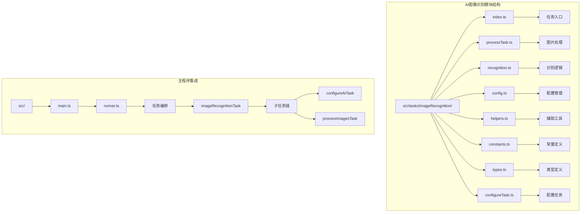
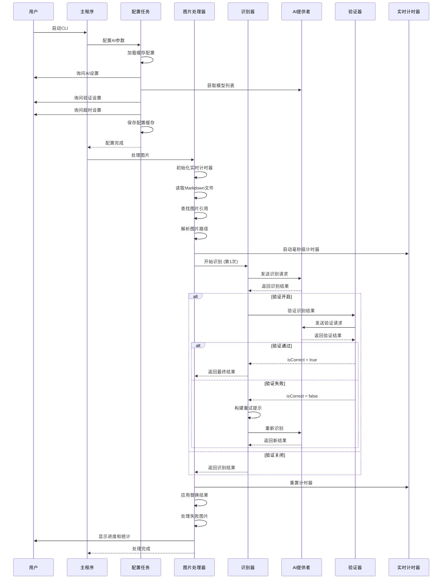
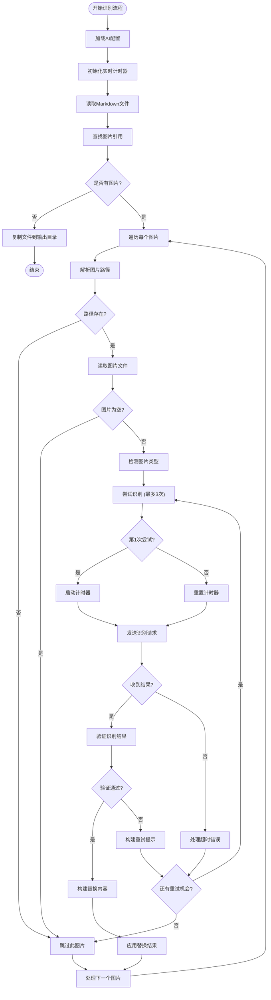
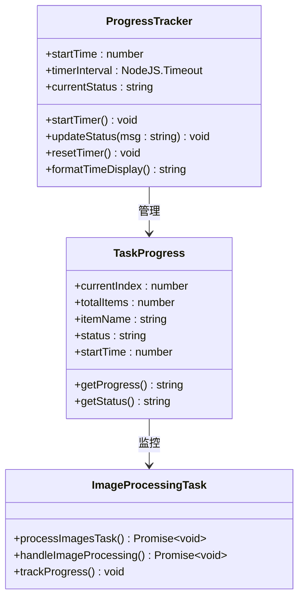
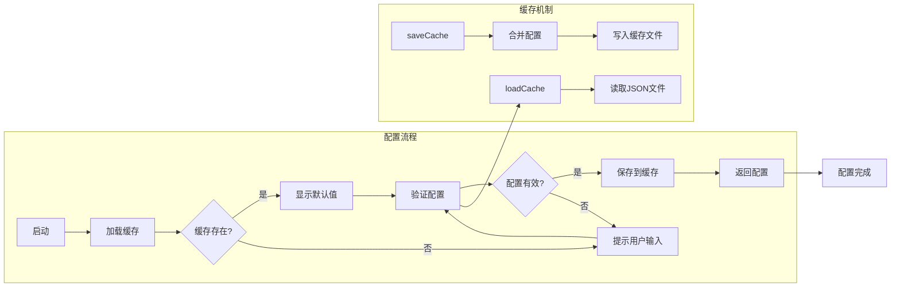
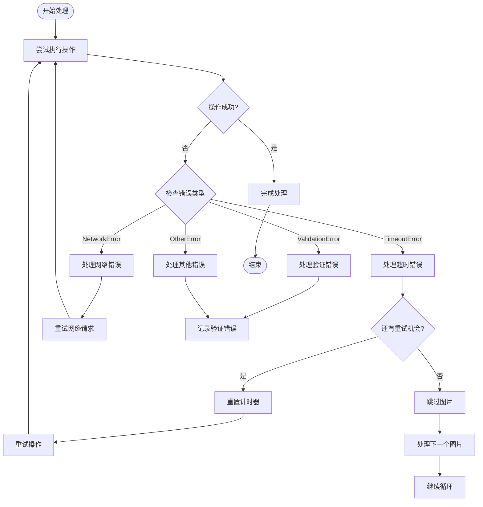

# AI图像识别模块

<cite>
**本文档引用的文件**
- [index.ts](file://src/tasks/imageRecognition/index.ts)
- [processTask.ts](file://src/tasks/imageRecognition/processTask.ts)
- [recognition.ts](file://src/tasks/imageRecognition/recognition.ts)
- [config.ts](file://src/tasks/imageRecognition/config.ts)
- [helpers.ts](file://src/tasks/imageRecognition/helpers.ts)
- [constants.ts](file://src/tasks/imageRecognition/constants.ts)
- [types.ts](file://src/tasks/imageRecognition/types.ts)
- [configureTask.ts](file://src/tasks/imageRecognition/configureTask.ts)
- [context.ts](file://src/context.ts)
- [main.ts](file://src/main.ts)
- [utils.ts](file://src/utils.ts)
- [logger.ts](file://src/logger.ts)
- [package.json](file://package.json)
</cite>

## 更新摘要
**变更内容**
- 重构为模块化架构，引入统一识别流程和智能重试机制
- 新增实时进度跟踪系统，提供毫秒级状态更新
- 增强错误处理能力，支持超时控制和优雅降级
- 优化配置管理系统，支持完整的AI参数配置
- 改进日志系统，提供详细的调试信息和性能监控

## 目录
1. [简介](#简介)
2. [项目结构](#项目结构)
3. [核心组件](#核心组件)
4. [架构概览](#架构概览)
5. [详细组件分析](#详细组件分析)
6. [依赖关系分析](#依赖关系分析)
7. [性能考虑](#性能考虑)
8. [故障排除指南](#故障排除指南)
9. [结论](#结论)

## 简介

AI图像识别模块是doc2xml-cli工具链中的关键组件，专门负责识别Markdown文档中的图片内容，将其转换为适当的Markdown表示形式。该模块能够区分数学公式和普通图片，对数学公式生成LaTeX格式，对普通图片生成描述性文本。

**更新** 模块已重构为现代化的模块化架构，引入统一识别流程和智能重试机制，显著提升了系统的稳定性和可靠性。**更新** 新增了实时进度跟踪系统，提供毫秒级的状态更新和性能监控，用户可以清晰地看到每个图片的处理进度。**更新** 增强了错误处理能力，支持超时控制、优雅降级和详细的错误恢复机制。**更新** 优化了配置管理系统，支持完整的AI参数配置，包括基础URL、API密钥、模型选择、验证开关和超时设置。

该模块基于OpenAI兼容的AI模型，通过视觉识别能力分析图片内容，并提供可选的结果验证机制来提高准确性。整个过程完全自动化，支持交互式配置、缓存管理和实时进度跟踪。

## 项目结构

doc2xml-cli是一个基于Node.js的CLI工具，采用模块化设计，包含多个处理阶段：



**图表来源**
- [index.ts:1-11](file://src/tasks/imageRecognition/index.ts#L1-L11)
- [processTask.ts:1-295](file://src/tasks/imageRecognition/processTask.ts#L1-L295)
- [configureTask.ts:1-126](file://src/tasks/imageRecognition/configureTask.ts#L1-L126)

**章节来源**
- [index.ts:1-11](file://src/tasks/imageRecognition/index.ts#L1-L11)
- [main.ts:1-61](file://src/main.ts#L1-L61)

## 核心组件

AI图像识别模块的核心功能由以下关键组件构成：

### 主要功能模块
- **统一识别流程**：模块化设计的识别流程，支持同步和异步处理
- **智能重试机制**：最多3次识别尝试，支持超时重试和验证重试
- **实时进度跟踪**：毫秒级状态更新，显示处理进度和性能指标
- **超时控制系统**：统一的超时管理机制，防止长时间阻塞
- **配置管理系统**：完整的AI参数配置，支持缓存和持久化
- **错误处理框架**：多层次的错误处理和优雅降级机制
- **日志监控系统**：详细的日志记录和性能监控功能

### 数据结构
- **AiConfig**：AI配置对象，包含基础URL、API密钥、模型ID、验证开关和超时设置
- **RecognitionResult**：识别结果对象，包含是否为公式和内容
- **ValidationResult**：验证结果对象，包含验证状态和原因
- **ImageMatch**：图片匹配对象，包含图片引用信息和位置
- **FailedImage**：失败图片对象，包含重试所需的所有信息
- **ProcessLogger**：日志记录器，提供统一的日志记录功能

**更新** 新增了模块化架构设计，将识别逻辑分离为独立的模块，提高了代码的可维护性和可测试性。**更新** 新增了智能重试机制，支持最多3次识别尝试，包括超时重试和验证重试，显著提升了识别成功率。**更新** 新增了实时进度跟踪系统，提供毫秒级的状态更新，用户可以清晰地看到每个图片的处理进度和性能指标。

**章节来源**
- [config.ts:1-16](file://src/tasks/imageRecognition/config.ts#L1-L16)
- [types.ts:5-29](file://src/tasks/imageRecognition/types.ts#L5-L29)
- [helpers.ts:74-79](file://src/tasks/imageRecognition/helpers.ts#L74-L79)
- [logger.ts:8-104](file://src/logger.ts#L8-L104)

## 架构概览

AI图像识别模块采用模块化架构设计，实现了统一的识别流程和智能重试机制：



**更新** 新增了实时计时器机制，提供毫秒级的状态更新，用户可以清晰地看到每个图片的处理进度。**更新** 新增了智能重试流程，支持超时重试和验证重试，最多3次尝试，显著提升了识别成功率。**更新** 新增了统一的识别流程，将配置、识别、验证、重试等步骤整合为标准化的工作流。

**图表来源**
- [processTask.ts:106-183](file://src/tasks/imageRecognition/processTask.ts#L106-L183)
- [processTask.ts:185-245](file://src/tasks/imageRecognition/processTask.ts#L185-L245)
- [recognition.ts:215-248](file://src/tasks/imageRecognition/recognition.ts#L215-L248)

**章节来源**
- [processTask.ts:66-294](file://src/tasks/imageRecognition/processTask.ts#L66-L294)
- [configureTask.ts:35-125](file://src/tasks/imageRecognition/configureTask.ts#L35-L125)

## 详细组件分析

### 统一识别流程

AI图像识别模块实现了统一的识别流程，支持智能重试和实时进度跟踪：



**更新** 新增了统一的识别流程，将配置加载、图片处理、识别验证、重试机制等步骤整合为标准化的工作流。**更新** 新增了实时计时器机制，提供毫秒级的状态更新，用户可以清晰地看到每个图片的处理进度。**更新** 新增了智能重试机制，支持超时重试和验证重试，最多3次尝试，显著提升了识别成功率。

**图表来源**
- [processTask.ts:21-64](file://src/tasks/imageRecognition/processTask.ts#L21-L64)
- [processTask.ts:153-183](file://src/tasks/imageRecognition/processTask.ts#L153-L183)
- [recognition.ts:215-248](file://src/tasks/imageRecognition/recognition.ts#L215-L248)

### 超时控制系统

AI图像识别模块实现了完整的超时控制机制，确保系统在各种网络条件下都能稳定运行：


**更新** 新增了通用的超时控制函数 `withTimeout`，支持所有AI请求操作的超时控制。**更新** 新增了 `TimeoutError` 类，继承自Error基类，提供专门的超时错误处理。**更新** 新增了超时配置的交互式设置，用户可以自定义超时时间（秒，0表示无限制）。

**图表来源**
- [recognition.ts:18-37](file://src/tasks/imageRecognition/recognition.ts#L18-L37)
- [recognition.ts:8-13](file://src/tasks/imageRecognition/recognition.ts#L8-L13)

### 实时进度跟踪系统

模块实现了毫秒级的实时进度跟踪系统，提供详细的处理状态信息：



**更新** 新增了毫秒级的实时计时器，提供精确的处理进度显示。**更新** 新增了状态消息系统，支持动态更新处理状态和进度信息。**更新** 新增了性能监控功能，显示每个图片的处理时间和超时状态。

**图表来源**
- [processTask.ts:112-116](file://src/tasks/imageRecognition/processTask.ts#L112-L116)
- [processTask.ts:206-209](file://src/tasks/imageRecognition/processTask.ts#L206-L209)
- [helpers.ts:74-79](file://src/tasks/imageRecognition/helpers.ts#L74-L79)

### 配置管理系统

模块提供了完整的配置管理功能，包括缓存、验证、超时和用户交互：



**更新** 缓存系统现已支持完整的AI配置项，包括基础URL、API密钥、模型ID、验证开关和超时设置。**更新** 新增了超时配置的交互式设置，用户可以在配置过程中设置超时时间。**更新** 新增了模型列表获取功能，支持自动检测可用的AI模型。

**图表来源**
- [configureTask.ts:35-125](file://src/tasks/imageRecognition/configureTask.ts#L35-L125)
- [utils.ts:33-54](file://src/utils.ts#L33-L54)

**章节来源**
- [configureTask.ts:35-125](file://src/tasks/imageRecognition/configureTask.ts#L35-L125)
- [utils.ts:33-54](file://src/utils.ts#L33-L54)

### 错误处理框架

模块实现了多层次的错误处理框架，支持超时控制和优雅降级：



**更新** 新增了统一的错误处理框架，支持多种错误类型的分类处理。**更新** 新增了超时错误的特殊处理机制，支持超时重试和优雅降级。**更新** 新增了详细的错误日志记录，便于问题诊断和性能监控。

**图表来源**
- [processTask.ts:174-182](file://src/tasks/imageRecognition/processTask.ts#L174-L182)
- [processTask.ts:237-243](file://src/tasks/imageRecognition/processTask.ts#L237-L243)
- [recognition.ts:54-61](file://src/tasks/imageRecognition/recognition.ts#L54-L61)

**章节来源**
- [processTask.ts:174-243](file://src/tasks/imageRecognition/processTask.ts#L174-L243)
- [recognition.ts:54-61](file://src/tasks/imageRecognition/recognition.ts#L54-L61)

## 依赖关系分析

AI图像识别模块依赖于多个外部库和内部组件：

```mermaid
graph TB
subgraph "外部依赖"
A[@ai-sdk/openai-compatible] --> B[OpenAI兼容API]
C[ai] --> D[generateText]
E[@inquirer/prompts] --> F[用户交互]
G[@listr2/prompt-adapter-inquirer] --> H[任务执行器]
I[listr2] --> J[任务编排]
K[原生fetch API] --> L[HTTP请求]
end
subgraph "内部模块"
M[context.ts] --> N[AppContext]
O[utils.ts] --> P[缓存管理]
Q[logger.ts] --> R[ProcessLogger]
S[main.ts] --> T[任务运行器]
end
subgraph "核心功能"
U[index.ts] --> V[任务入口]
W[processTask.ts] --> X[图片处理]
Y[recognition.ts] --> Z[识别逻辑]
AA[configureTask.ts] --> BB[配置管理]
CC[helpers.ts] --> DD[辅助工具]
EE[constants.ts] --> FF[常量定义]
GG[types.ts] --> HH[类型定义]
end
A --> U
C --> W
E --> AA
G --> AA
I --> AA
K --> W
M --> AA
O --> AA
Q --> AA
S --> AA
```

**更新** 依赖已从 `@ai-sdk/openai` 迁移到 `@ai-sdk/openai-compatible`，提供更好的兼容性和扩展性。**更新** 移除了对代理感知HTTP客户端库的依赖，现在直接使用原生fetch API进行网络通信。**更新** 新增了实时进度跟踪相关的依赖，包括定时器管理和状态更新功能。

**图表来源**
- [package.json:21-27](file://package.json#L21-L27)
- [index.ts:1-11](file://src/tasks/imageRecognition/index.ts#L1-L11)

**章节来源**
- [package.json:21-27](file://package.json#L21-L27)
- [index.ts:1-11](file://src/tasks/imageRecognition/index.ts#L1-L11)

## 性能考虑

AI图像识别模块在设计时充分考虑了性能优化：

### 并发处理
- **串行处理**：图片识别采用串行方式，避免AI服务过载
- **批量操作**：同一任务内的多个图片按顺序处理
- **资源管理**：合理控制内存使用，避免大文件导致的内存溢出

### 错误处理策略
- **容错机制**：单个图片失败不影响整体流程
- **重试逻辑**：最多3次识别尝试，逐步提高准确性
- **降级处理**：验证失败时自动降级为直接使用结果
- **超时保护**：所有AI请求都有超时控制，防止长时间阻塞
- **进度反馈**：实时显示处理进度和状态信息

### 缓存优化
- **配置缓存**：持久化AI配置，减少重复配置时间
- **快速启动**：从缓存加载配置，避免每次都进行网络请求
- **验证设置**：支持验证功能的持久化配置
- **超时设置**：支持超时配置的持久化存储

### 日志系统优化
- **单例模式**：确保日志系统的全局唯一性，避免重复初始化
- **异步写入**：日志文件采用异步写入，减少阻塞
- **文件持久化**：自动创建日志文件，支持长时间运行的任务

**更新** 新增了实时进度跟踪的性能优化，毫秒级的状态更新不会对系统性能造成显著影响。**更新** 新增了超时控制的性能考虑，防止长时间阻塞导致的资源浪费。**更新** 新增了智能重试机制的性能优化，避免不必要的重复请求。

## 故障排除指南

### 常见问题及解决方案

#### AI连接问题
**症状**：无法连接到AI服务
**原因**：
- 网络连接问题
- AI服务地址配置错误
- API密钥无效
- 超时设置过短

**解决方法**：
1. 检查网络连接状态
2. 验证AI服务地址格式
3. 确认API密钥正确性
4. 调整超时设置（增加超时时间）
5. 尝试重新配置AI设置

#### 图片识别失败
**症状**：某些图片无法识别或识别结果不准确
**原因**：
- 图片格式不受支持
- 图片损坏或为空
- AI模型不兼容
- 超时设置过短

**解决方法**：
1. 检查图片文件完整性
2. 确认图片格式支持性
3. 尝试启用结果验证功能
4. 更换AI模型
5. 增加超时设置以允许更长的处理时间

#### 超时控制问题
**症状**：AI请求经常超时或超时设置无效
**原因**：
- 超时时间设置过短
- 网络连接不稳定
- AI服务响应慢
- 超时控制机制故障

**解决方法**：
1. 增加超时时间设置（秒，0表示无限制）
2. 检查网络连接稳定性
3. 优化AI服务性能
4. 查看超时日志了解具体问题
5. 考虑使用更强大的AI服务

#### 实时进度跟踪问题
**症状**：进度显示异常或状态更新不及时
**原因**：
- 定时器设置错误
- 状态消息格式异常
- 计时器清理不彻底
- 性能监控数据丢失

**解决方法**：
1. 检查定时器配置和清理机制
2. 验证状态消息的格式和内容
3. 确保计时器在适当时候重置
4. 查看性能监控日志了解具体问题

#### 配置缓存问题
**症状**：配置无法保存或加载失败
**原因**：
- 权限不足
- 磁盘空间不足
- JSON格式错误
- 超时配置损坏

**解决方法**：
1. 检查用户权限
2. 确保磁盘空间充足
3. 手动删除损坏的缓存文件
4. 重新配置AI设置
5. 检查超时配置的有效性

#### 日志系统问题
**症状**：日志无法写入或格式异常
**原因**：
- 日志文件权限问题
- 临时目录不可写
- 日志文件被占用
- 超时错误日志过多

**解决方法**：
1. 检查临时目录权限
2. 确保有足够磁盘空间
3. 关闭可能占用日志文件的应用
4. 重启应用以重新初始化日志系统
5. 清理过期的日志文件

**更新** 新增了实时进度跟踪相关的故障排除指南，包括定时器设置和状态更新问题的解决方法。**更新** 新增了超时控制相关的故障排除指南，包括超时时间设置调整和超时错误处理方法。**更新** 新增了智能重试机制的故障排除指南，帮助用户诊断重试失败的根本原因。

**章节来源**
- [processTask.ts:121-127](file://src/tasks/imageRecognition/processTask.ts#L121-L127)
- [processTask.ts:134-140](file://src/tasks/imageRecognition/processTask.ts#L134-L140)
- [configureTask.ts:68-82](file://src/tasks/imageRecognition/configureTask.ts#L68-L82)
- [logger.ts:70-96](file://src/logger.ts#L70-L96)

## 结论

AI图像识别模块是doc2xml-cli工具链中的重要组成部分，经过重大重构后，它通过先进的AI技术和现代化的架构实现了智能化的图片内容识别和处理。该模块具有以下特点：

### 技术优势
- **模块化架构**：采用模块化设计，提高了代码的可维护性和可测试性
- **统一识别流程**：标准化的识别流程，支持智能重试和实时进度跟踪
- **智能重试机制**：最多3次识别尝试，支持超时重试和验证重试
- **实时进度监控**：毫秒级状态更新，提供详细的处理进度信息
- **超时保护机制**：完整的超时控制，防止长时间阻塞导致的进程挂起
- **用户友好配置**：直观的交互式配置界面，包含验证选项和超时设置
- **稳定可靠系统**：完善的错误处理和容错机制，提供详细的进度反馈
- **持久化配置**：支持完整AI配置的缓存存储，提升用户体验

### 应用价值
- **自动化处理**：大幅减少人工处理图片的工作量
- **格式标准化**：统一数学公式和图片的Markdown表示
- **质量保证**：通过验证机制确保输出质量
- **性能优化**：支持可选的验证功能和超时控制，平衡准确性和处理速度
- **实时监控**：提供详细的处理进度和性能监控
- **错误恢复**：完善的错误处理和重试机制，提升系统稳定性
- **用户体验**：统一的日志系统，便于问题诊断和性能监控

### 发展前景
随着AI技术的不断发展，该模块将继续提升识别准确性和处理效率，为用户提供更加智能化的文档处理体验。未来可能的改进方向包括支持更多AI模型、优化处理速度、增强错误诊断能力、提供更丰富的验证选项、扩展日志系统的功能、完善超时控制机制等。

**更新** 突出了模块化架构的技术优势，现代化的设计提高了系统的可维护性和可扩展性。**更新** 强调了统一识别流程在系统稳定性方面的重要作用，标准化的工作流减少了错误发生的可能性。**更新** 新增了实时进度跟踪在用户体验方面的价值，用户可以通过详细的进度信息了解处理状态。**更新** 新增了智能重试机制在系统可靠性方面的贡献，显著提升了识别成功率和用户体验。