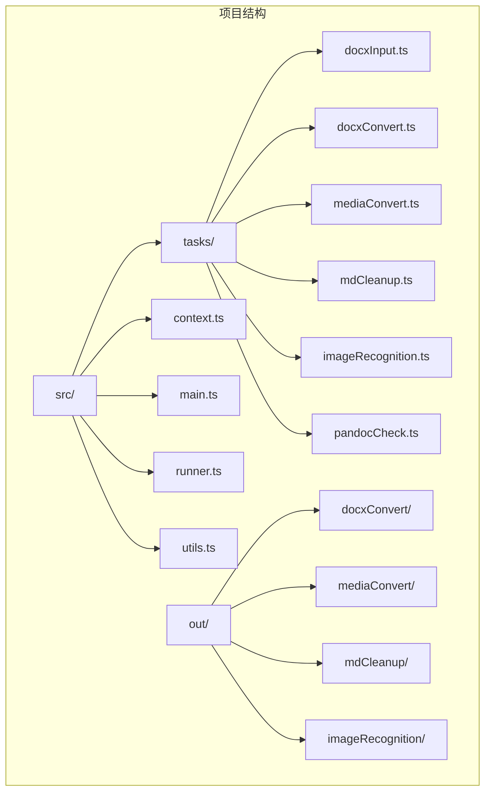
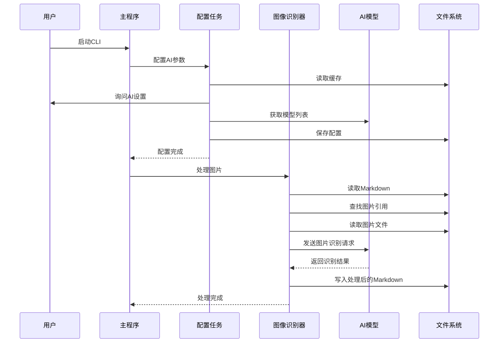
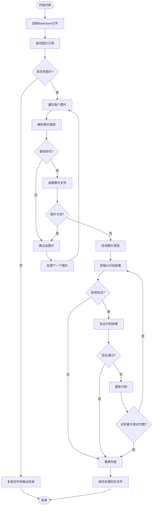
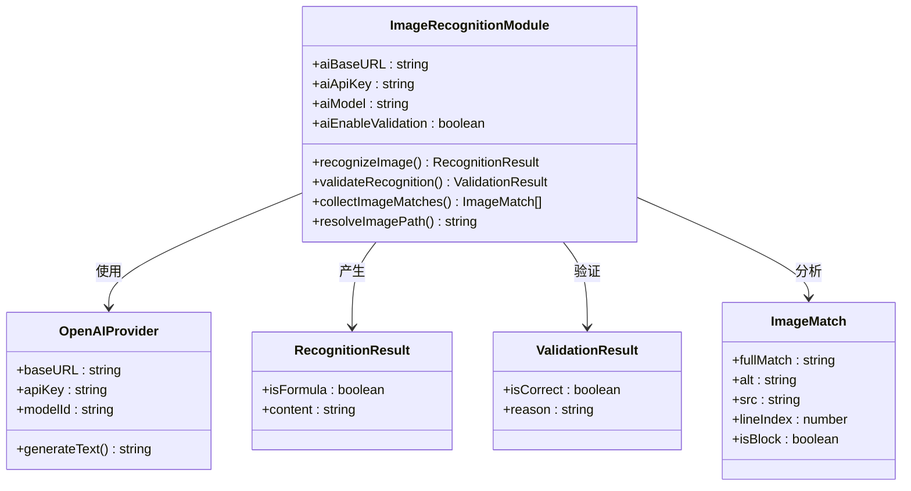
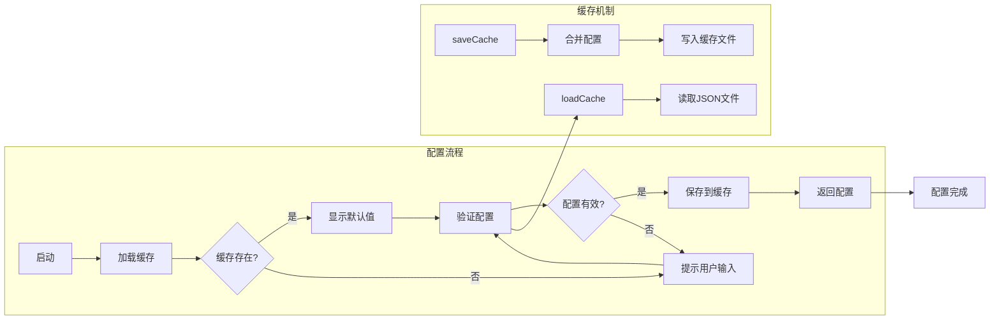

# AI图像识别模块

<cite>
**本文档引用的文件**
- [imageRecognition.ts](file://src/tasks/imageRecognition.ts)
- [context.ts](file://src/context.ts)
- [main.ts](file://src/main.ts)
- [utils.ts](file://src/utils.ts)
- [runner.ts](file://src/runner.ts)
- [package.json](file://package.json)
- [tsconfig.json](file://tsconfig.json)
- [docxInput.ts](file://src/tasks/docxInput.ts)
- [docxConvert.ts](file://src/tasks/docxConvert.ts)
- [mediaConvert.ts](file://src/tasks/mediaConvert.ts)
- [mdCleanup.ts](file://src/tasks/mdCleanup.ts)
- [pandocCheck.ts](file://src/tasks/pandocCheck.ts)
- [test.md（图像识别输出）](file://out/imageRecognition/test.md)
- [test.md（清理输出）](file://out/mdCleanup/test.md)
</cite>

## 目录
1. [简介](#简介)
2. [项目结构](#项目结构)
3. [核心组件](#核心组件)
4. [架构概览](#架构概览)
5. [详细组件分析](#详细组件分析)
6. [依赖关系分析](#依赖关系分析)
7. [性能考虑](#性能考虑)
8. [故障排除指南](#故障排除指南)
9. [结论](#结论)

## 简介

AI图像识别模块是doc2xml-cli工具链中的一个关键组件，专门负责识别Markdown文档中的图片内容，将其转换为适当的Markdown表示形式。该模块能够区分数学公式和普通图片，对数学公式生成LaTeX格式，对普通图片生成描述性文本。

该模块基于OpenAI的AI模型，通过视觉识别能力分析图片内容，并提供可选的结果验证机制来提高准确性。整个过程完全自动化，支持交互式配置和缓存管理。

## 项目结构

doc2xml-cli是一个基于Node.js的CLI工具，采用模块化设计，包含多个处理阶段：



**图表来源**
- [main.ts:1-43](file://src/main.ts#L1-L43)
- [package.json:1-42](file://package.json#L1-L42)

**章节来源**
- [main.ts:1-43](file://src/main.ts#L1-L43)
- [package.json:1-42](file://package.json#L1-L42)

## 核心组件

AI图像识别模块的核心功能由以下关键组件构成：

### 主要功能模块
- **图像识别引擎**：基于OpenAI模型的视觉识别能力
- **结果验证系统**：可选的双重验证机制
- **Markdown处理**：智能识别和替换图片引用
- **缓存管理**：持久化的配置存储
- **交互式配置**：用户友好的设置界面

### 数据结构
- **AppContext**：应用程序上下文，包含输入路径、输出路径和媒体路径
- **RecognitionResult**：识别结果对象，包含是否为公式和内容
- **OutputContext**：输出上下文，用于传递处理状态

**章节来源**
- [context.ts:1-21](file://src/context.ts#L1-L21)
- [imageRecognition.ts:104-107](file://src/tasks/imageRecognition.ts#L104-L107)
- [imageRecognition.ts:181-184](file://src/tasks/imageRecognition.ts#L181-L184)

## 架构概览

AI图像识别模块在整个处理流水线中扮演着关键角色，位于文档转换流程的后期阶段：



**图表来源**
- [main.ts:13-18](file://src/main.ts#L13-L18)
- [imageRecognition.ts:364-419](file://src/tasks/imageRecognition.ts#L364-L419)
- [imageRecognition.ts:421-541](file://src/tasks/imageRecognition.ts#L421-L541)

**章节来源**
- [main.ts:13-18](file://src/main.ts#L13-L18)
- [imageRecognition.ts:364-541](file://src/tasks/imageRecognition.ts#L364-L541)

## 详细组件分析

### 图像识别核心算法

AI图像识别模块实现了复杂的图像处理和识别算法：



**图表来源**
- [imageRecognition.ts:421-541](file://src/tasks/imageRecognition.ts#L421-L541)
- [imageRecognition.ts:239-262](file://src/tasks/imageRecognition.ts#L239-L262)

### AI模型集成

模块支持多种AI模型的集成，通过统一的接口处理不同的视觉识别需求：



**图表来源**
- [imageRecognition.ts:12-18](file://src/tasks/imageRecognition.ts#L12-L18)
- [imageRecognition.ts:104-107](file://src/tasks/imageRecognition.ts#L104-L107)
- [imageRecognition.ts:181-184](file://src/tasks/imageRecognition.ts#L181-L184)
- [imageRecognition.ts:335-341](file://src/tasks/imageRecognition.ts#L335-L341)

### 配置管理系统

模块提供了完整的配置管理功能，包括缓存、验证和用户交互：



**图表来源**
- [imageRecognition.ts:364-419](file://src/tasks/imageRecognition.ts#L364-L419)
- [utils.ts:31-52](file://src/utils.ts#L31-L52)

**章节来源**
- [imageRecognition.ts:364-541](file://src/tasks/imageRecognition.ts#L364-L541)
- [utils.ts:31-52](file://src/utils.ts#L31-L52)

## 依赖关系分析

AI图像识别模块依赖于多个外部库和内部组件：

```mermaid
graph TB
subgraph "外部依赖"
A[@ai-sdk/openai] --> B[OpenAI API]
C[ai] --> D[generateText]
E[@inquirer/prompts] --> F[用户交互]
G[@listr2/prompt-adapter-inquirer] --> H[任务执行器]
I[listr2] --> J[任务编排]
end
subgraph "内部模块"
K[context.ts] --> L[AppContext]
M[utils.ts] --> N[缓存管理]
O[runner.ts] --> P[任务运行器]
end
subgraph "核心功能"
Q[imageRecognition.ts] --> R[图像识别]
Q --> S[结果验证]
Q --> T[Markdown处理]
end
A --> Q
C --> Q
E --> Q
G --> Q
I --> Q
K --> Q
M --> Q
O --> Q
```

**图表来源**
- [package.json:21-26](file://package.json#L21-L26)
- [imageRecognition.ts:1-10](file://src/tasks/imageRecognition.ts#L1-L10)

**章节来源**
- [package.json:21-26](file://package.json#L21-L26)
- [imageRecognition.ts:1-10](file://src/tasks/imageRecognition.ts#L1-L10)

## 性能考虑

AI图像识别模块在设计时充分考虑了性能优化：

### 并发处理
- **串行处理**：图片识别采用串行方式，避免AI服务过载
- **批量操作**：同一任务内的多个图片按顺序处理
- **资源管理**：合理控制内存使用，避免大文件导致的内存溢出

### 错误处理策略
- **容错机制**：单个图片失败不影响整体流程
- **重试逻辑**：最多3次识别尝试，逐步提高准确性
- **降级处理**：验证失败时自动降级为直接使用结果

### 缓存优化
- **配置缓存**：持久化AI配置，减少重复配置时间
- **快速启动**：从缓存加载配置，避免每次都进行网络请求

## 故障排除指南

### 常见问题及解决方案

#### AI连接问题
**症状**：无法连接到AI服务
**原因**：
- 网络连接问题
- AI服务地址配置错误
- API密钥无效

**解决方法**：
1. 检查网络连接状态
2. 验证AI服务地址格式
3. 确认API密钥正确性
4. 尝试重新配置AI设置

#### 图片识别失败
**症状**：某些图片无法识别或识别结果不准确
**原因**：
- 图片格式不受支持
- 图片损坏或为空
- AI模型不兼容

**解决方法**：
1. 检查图片文件完整性
2. 确认图片格式支持性
3. 尝试启用结果验证功能
4. 更换AI模型

#### 配置缓存问题
**症状**：配置无法保存或加载失败
**原因**：
- 权限不足
- 磁盘空间不足
- JSON格式错误

**解决方法**：
1. 检查用户权限
2. 确保磁盘空间充足
3. 手动删除损坏的缓存文件
4. 重新配置AI设置

**章节来源**
- [imageRecognition.ts:386-401](file://src/tasks/imageRecognition.ts#L386-L401)
- [imageRecognition.ts:488-491](file://src/tasks/imageRecognition.ts#L488-L491)
- [utils.ts:44-51](file://src/utils.ts#L44-L51)

## 结论

AI图像识别模块是doc2xml-cli工具链中的重要组成部分，它通过先进的AI技术实现了智能化的图片内容识别和处理。该模块具有以下特点：

### 技术优势
- **高精度识别**：基于OpenAI模型的视觉识别能力
- **智能验证**：可选的双重验证机制确保结果准确性
- **用户友好**：直观的交互式配置界面
- **稳定可靠**：完善的错误处理和容错机制

### 应用价值
- **自动化处理**：大幅减少人工处理图片的工作量
- **格式标准化**：统一数学公式和图片的Markdown表示
- **质量保证**：通过验证机制确保输出质量
- **扩展性强**：模块化设计便于功能扩展

### 发展前景
随着AI技术的不断发展，该模块将继续提升识别准确性和处理效率，为用户提供更加智能化的文档处理体验。未来可能的改进方向包括支持更多AI模型、优化处理速度、增强错误诊断能力等。