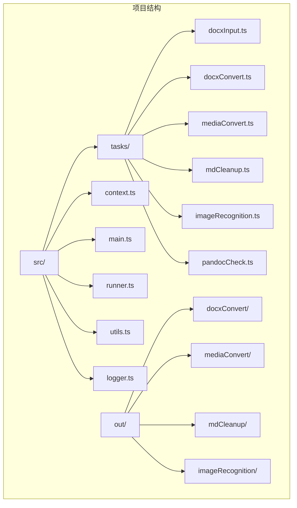
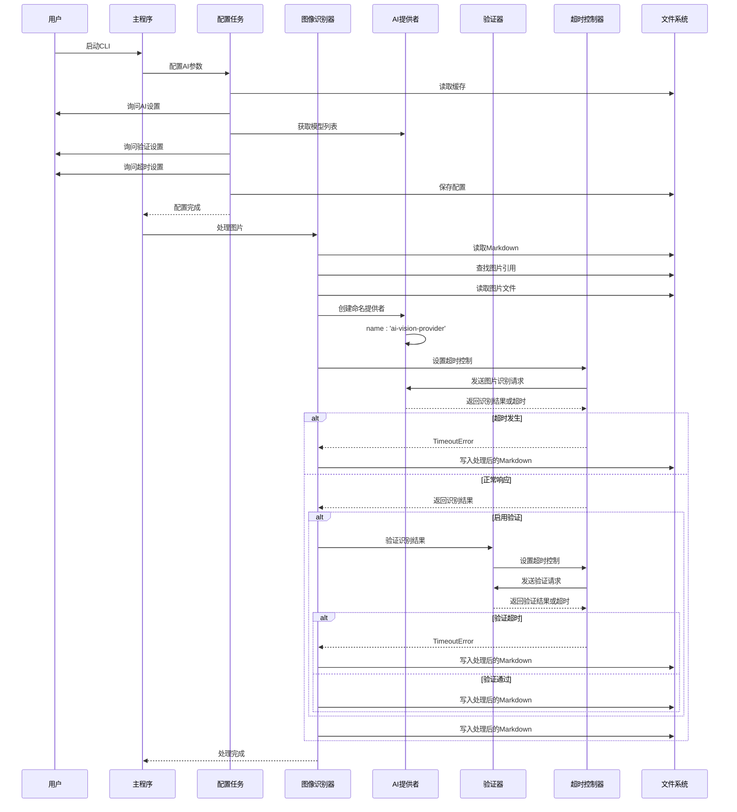
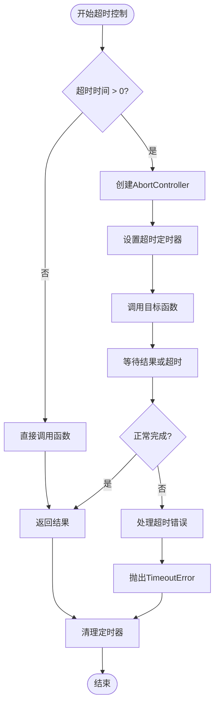
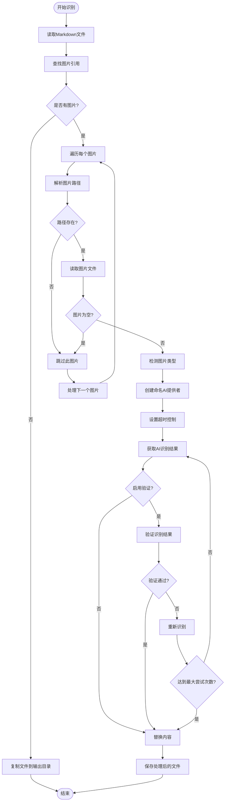
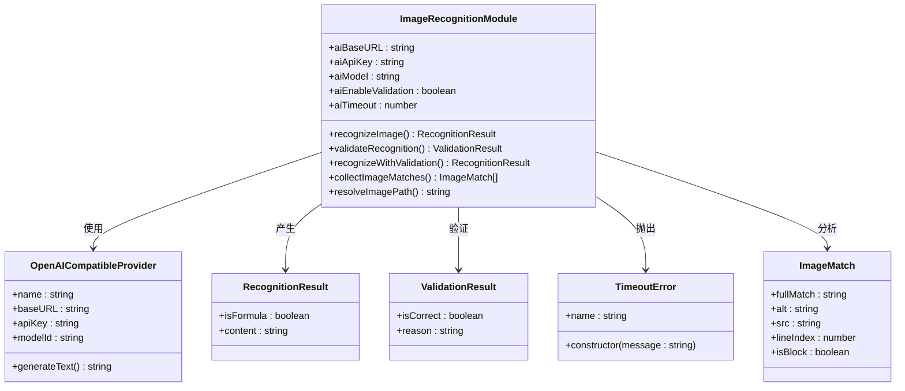
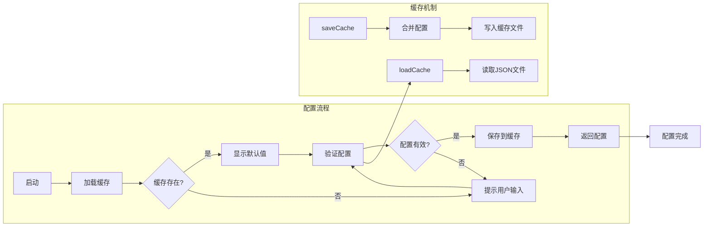
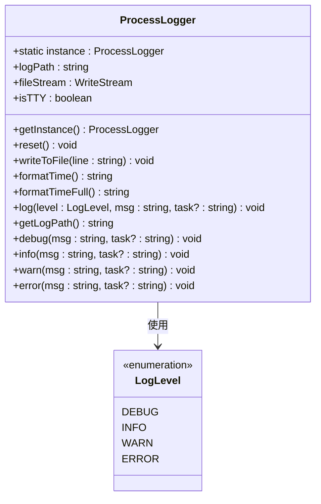

# AI图像识别模块

<cite>
**本文档引用的文件**
- [imageRecognition.ts](file://src/tasks/imageRecognition.ts)
- [context.ts](file://src/context.ts)
- [main.ts](file://src/main.ts)
- [utils.ts](file://src/utils.ts)
- [runner.ts](file://src/runner.ts)
- [package.json](file://package.json)
- [tsconfig.json](file://tsconfig.json)
- [docxInput.ts](file://src/tasks/docxInput.ts)
- [docxConvert.ts](file://src/tasks/docxConvert.ts)
- [mediaConvert.ts](file://src/tasks/mediaConvert.ts)
- [mdCleanup.ts](file://src/tasks/mdCleanup.ts)
- [pandocCheck.ts](file://src/tasks/pandocCheck.ts)
- [logger.ts](file://src/logger.ts)
</cite>

## 更新摘要
**变更内容**
- 新增完整的超时控制功能，包括 aiTimeout 配置、withTimeout 工具函数、TimeoutError 类
- 在所有AI请求操作中集成超时机制，包括图片识别、结果验证和重试识别
- 新增超时时间配置选项，支持用户自定义超时时间（秒，0表示无限制）
- 新增超时错误处理，防止长时间阻塞导致的进程挂起
- 更新AI识别流程以支持超时控制，提升系统稳定性

## 目录
1. [简介](#简介)
2. [项目结构](#项目结构)
3. [核心组件](#核心组件)
4. [架构概览](#架构概览)
5. [详细组件分析](#详细组件分析)
6. [依赖关系分析](#依赖关系分析)
7. [性能考虑](#性能考虑)
8. [故障排除指南](#故障排除指南)
9. [结论](#结论)

## 简介

AI图像识别模块是doc2xml-cli工具链中的一个关键组件，专门负责识别Markdown文档中的图片内容，将其转换为适当的Markdown表示形式。该模块能够区分数学公式和普通图片，对数学公式生成LaTeX格式，对普通图片生成描述性文本。

**更新** 新增了完整的超时控制功能，用户现在可以配置AI请求的超时时间，防止长时间阻塞导致的进程挂起。**更新** 新增了 `TimeoutError` 类和 `withTimeout` 工具函数，提供统一的超时控制机制。**更新** 在所有AI请求操作中集成了超时机制，包括图片识别、结果验证和重试识别，提升了系统的稳定性和可靠性。**更新** 新增了超时时间配置选项，支持用户自定义超时时间（秒，0表示无限制），提供更灵活的性能控制。

该模块基于OpenAI兼容的AI模型，通过视觉识别能力分析图片内容，并提供可选的结果验证机制来提高准确性。整个过程完全自动化，支持交互式配置、缓存管理和超时控制。

## 项目结构

doc2xml-cli是一个基于Node.js的CLI工具，采用模块化设计，包含多个处理阶段：



**图表来源**
- [main.ts:1-61](file://src/main.ts#L1-L61)
- [package.json:1-42](file://package.json#L1-L42)

**章节来源**
- [main.ts:1-61](file://src/main.ts#L1-L61)
- [package.json:1-42](file://package.json#L1-L42)

## 核心组件

AI图像识别模块的核心功能由以下关键组件构成：

### 主要功能模块
- **图像识别引擎**：基于OpenAI兼容模型的视觉识别能力
- **结果验证系统**：可选的双重验证机制，支持最多3次识别尝试
- **超时控制系统**：统一的超时管理机制，防止长时间阻塞
- **Markdown处理**：智能识别和替换图片引用
- **缓存管理**：持久化的配置存储，支持验证设置和超时配置
- **交互式配置**：用户友好的设置界面，包含验证选项和超时设置
- **日志系统**：简化实现的统一日志记录功能

### 数据结构
- **AppContext**：应用程序上下文，包含输入路径、输出路径和媒体路径
- **RecognitionResult**：识别结果对象，包含是否为公式和内容
- **ValidationResult**：验证结果对象，包含验证状态和原因
- **OutputContext**：输出上下文，用于传递处理状态
- **ProcessLogger**：日志记录器，提供DEBUG/INFO/WARN/ERROR级别的日志记录
- **TimeoutError**：超时错误类，继承自Error基类

**更新** 新增了 `TimeoutError` 类和 `withTimeout` 工具函数，提供统一的超时控制机制。**更新** 新增了 `aiTimeout` 配置项，支持用户自定义超时时间设置。**更新** 新增了超时错误处理机制，防止长时间阻塞导致的进程挂起。

**章节来源**
- [context.ts:1-21](file://src/context.ts#L1-L21)
- [imageRecognition.ts:106-109](file://src/tasks/imageRecognition.ts#L106-L109)
- [imageRecognition.ts:185-188](file://src/tasks/imageRecognition.ts#L185-L188)
- [imageRecognition.ts:14-18](file://src/tasks/imageRecognition.ts#L14-L18)
- [imageRecognition.ts:111-116](file://src/tasks/imageRecognition.ts#L111-L116)
- [logger.ts:8-104](file://src/logger.ts#L8-L104)

## 架构概览

AI图像识别模块在整个处理流水线中扮演着关键角色，位于文档转换流程的后期阶段：



**更新** 新增了超时控制流程，所有AI请求操作都通过 `withTimeout` 函数进行超时控制。**更新** 新增了 `TimeoutError` 类的处理逻辑，当超时发生时系统会优雅地处理错误并继续执行。**更新** 新增了超时配置的交互式设置，用户可以自定义超时时间（秒，0表示无限制）。

**图表来源**
- [main.ts:14-19](file://src/main.ts#L14-L19)
- [imageRecognition.ts:521-536](file://src/tasks/imageRecognition.ts#L521-L536)
- [imageRecognition.ts:533-607](file://src/tasks/imageRecognition.ts#L533-L607)
- [imageRecognition.ts:121-140](file://src/tasks/imageRecognition.ts#L121-L140)
- [imageRecognition.ts:111-116](file://src/tasks/imageRecognition.ts#L111-L116)

**章节来源**
- [main.ts:14-19](file://src/main.ts#L14-L19)
- [imageRecognition.ts:521-607](file://src/tasks/imageRecognition.ts#L521-L607)
- [imageRecognition.ts:121-140](file://src/tasks/imageRecognition.ts#L121-L140)

## 详细组件分析

### 超时控制系统

AI图像识别模块实现了完整的超时控制机制，确保系统在各种网络条件下都能稳定运行：



**更新** 新增了 `withTimeout` 工具函数，提供统一的超时控制机制。**更新** 新增了 `TimeoutError` 类，继承自Error基类，提供专门的超时错误处理。**更新** 新增了超时时间配置选项，支持用户自定义超时时间（秒，0表示无限制）。

**图表来源**
- [imageRecognition.ts:121-140](file://src/tasks/imageRecognition.ts#L121-L140)
- [imageRecognition.ts:111-116](file://src/tasks/imageRecognition.ts#L111-L116)

### 图像识别核心算法

AI图像识别模块实现了复杂的图像处理和识别算法，现已支持可选的验证机制和超时控制：



**更新** 新增了超时控制流程，在第148行使用 `withTimeout` 函数包装 `recognizeImage` 调用。**更新** 新增了超时错误处理机制，在第310-317行捕获 `TimeoutError` 并优雅地停止重试。**更新** 新增了超时配置的交互式设置，用户可以在配置过程中设置超时时间。

**图表来源**
- [imageRecognition.ts:533-607](file://src/tasks/imageRecognition.ts#L533-L607)
- [imageRecognition.ts:245-268](file://src/tasks/imageRecognition.ts#L245-L268)
- [imageRecognition.ts:148-171](file://src/tasks/imageRecognition.ts#L148-L171)
- [imageRecognition.ts:236-255](file://src/tasks/imageRecognition.ts#L236-L255)

### AI模型集成

模块支持多种AI模型的集成，通过统一的接口处理不同的视觉识别需求：



**更新** 新增了 `aiTimeout` 属性和超时控制机制。**更新** 新增了 `TimeoutError` 类，提供专门的超时错误处理。**更新** 所有AI请求操作都集成了超时控制，包括识别、验证和重试操作。

**图表来源**
- [imageRecognition.ts:14-18](file://src/tasks/imageRecognition.ts#L14-L18)
- [imageRecognition.ts:106-109](file://src/tasks/imageRecognition.ts#L106-L109)
- [imageRecognition.ts:185-188](file://src/tasks/imageRecognition.ts#L185-L188)
- [imageRecognition.ts:111-116](file://src/tasks/imageRecognition.ts#L111-L116)
- [imageRecognition.ts:343-349](file://src/tasks/imageRecognition.ts#L343-L349)

### 配置管理系统

模块提供了完整的配置管理功能，包括缓存、验证、超时和用户交互：



**更新** 缓存系统现已支持 `aiTimeout` 配置项的持久化存储，用户可以在后续使用中保持相同的超时设置。**更新** 新增了超时配置的交互式设置，用户可以在配置过程中设置超时时间。

**图表来源**
- [imageRecognition.ts:372-442](file://src/tasks/imageRecognition.ts#L372-L442)
- [utils.ts:32-53](file://src/utils.ts#L32-L53)

**章节来源**
- [imageRecognition.ts:372-607](file://src/tasks/imageRecognition.ts#L372-L607)
- [utils.ts:32-53](file://src/utils.ts#L32-L53)

### 日志系统实现

模块采用了简化的日志系统实现，提供统一的日志记录功能：



**更新** 新增了简化的日志系统实现，采用单例模式确保全局唯一性。**更新** 日志系统支持DEBUG/INFO/WARN/ERROR四个级别，提供统一的日志格式和文件持久化功能。

**图表来源**
- [logger.ts:8-104](file://src/logger.ts#L8-L104)

**章节来源**
- [logger.ts:8-104](file://src/logger.ts#L8-L104)

## 依赖关系分析

AI图像识别模块依赖于多个外部库和内部组件：

```mermaid
graph TB
subgraph "外部依赖"
A[@ai-sdk/openai-compatible] --> B[OpenAI兼容API]
C[ai] --> D[generateText]
E[@inquirer/prompts] --> F[用户交互]
G[@listr2/prompt-adapter-inquirer] --> H[任务执行器]
I[listr2] --> J[任务编排]
K[原生fetch API] --> L[HTTP请求]
end
subgraph "内部模块"
M[context.ts] --> N[AppContext]
O[utils.ts] --> P[缓存管理]
Q[runner.ts] --> R[任务运行器]
S[logger.ts] --> T[ProcessLogger]
end
subgraph "核心功能"
U[imageRecognition.ts] --> V[图像识别]
U --> W[结果验证]
U --> X[Markdown处理]
U --> Y[超时控制]
end
A --> U
C --> U
E --> U
G --> U
I --> U
K --> U
M --> U
O --> U
Q --> U
S --> U
```

**更新** 依赖已从 `@ai-sdk/openai` 迁移到 `@ai-sdk/openai-compatible`，提供更好的兼容性和扩展性。**更新** 移除了对代理感知HTTP客户端库的依赖，现在直接使用原生fetch API进行网络通信。**更新** 新增了超时控制相关的依赖，包括AbortController和setTimeout等原生API。

**图表来源**
- [package.json:21-27](file://package.json#L21-L27)
- [imageRecognition.ts:1-12](file://src/tasks/imageRecognition.ts#L1-L12)

**章节来源**
- [package.json:21-27](file://package.json#L21-L27)
- [imageRecognition.ts:1-12](file://src/tasks/imageRecognition.ts#L1-L12)

## 性能考虑

AI图像识别模块在设计时充分考虑了性能优化：

### 并发处理
- **串行处理**：图片识别采用串行方式，避免AI服务过载
- **批量操作**：同一任务内的多个图片按顺序处理
- **资源管理**：合理控制内存使用，避免大文件导致的内存溢出

### 错误处理策略
- **容错机制**：单个图片失败不影响整体流程
- **重试逻辑**：最多3次识别尝试，逐步提高准确性
- **降级处理**：验证失败时自动降级为直接使用结果
- **超时保护**：所有AI请求都有超时控制，防止长时间阻塞
- **进度反馈**：实时显示处理进度和状态信息

### 缓存优化
- **配置缓存**：持久化AI配置，减少重复配置时间
- **快速启动**：从缓存加载配置，避免每次都进行网络请求
- **验证设置**：支持验证功能的持久化配置
- **超时设置**：支持超时配置的持久化存储

### 日志系统优化
- **单例模式**：确保日志系统的全局唯一性，避免重复初始化
- **异步写入**：日志文件采用异步写入，减少阻塞
- **文件持久化**：自动创建日志文件，支持长时间运行的任务

**更新** 新增了超时控制的性能考虑，防止长时间阻塞导致的资源浪费。**更新** 新增了超时错误处理的性能优化，当超时发生时系统会优雅地处理错误并继续执行。**更新** 新增了超时配置的性能优化，用户可以通过合理的超时设置平衡准确性和性能。

## 故障排除指南

### 常见问题及解决方案

#### AI连接问题
**症状**：无法连接到AI服务
**原因**：
- 网络连接问题
- AI服务地址配置错误
- API密钥无效
- 超时设置过短

**解决方法**：
1. 检查网络连接状态
2. 验证AI服务地址格式
3. 确认API密钥正确性
4. 调整超时设置（增加超时时间）
5. 尝试重新配置AI设置

#### 图片识别失败
**症状**：某些图片无法识别或识别结果不准确
**原因**：
- 图片格式不受支持
- 图片损坏或为空
- AI模型不兼容
- 超时设置过短

**解决方法**：
1. 检查图片文件完整性
2. 确认图片格式支持性
3. 尝试启用结果验证功能
4. 更换AI模型
5. 增加超时设置以允许更长的处理时间

#### 超时控制问题
**症状**：AI请求经常超时或超时设置无效
**原因**：
- 超时时间设置过短
- 网络连接不稳定
- AI服务响应慢
- 超时控制机制故障

**解决方法**：
1. 增加超时时间设置（秒，0表示无限制）
2. 检查网络连接稳定性
3. 优化AI服务性能
4. 查看超时日志了解具体问题
5. 考虑使用更强大的AI服务

#### 验证功能问题
**症状**：验证功能无法正常工作或影响处理速度
**原因**：
- 验证模型不可用
- 网络连接不稳定
- 验证结果解析失败
- 超时设置过短

**解决方法**：
1. 检查验证模型的可用性
2. 确保稳定的网络连接
3. 关闭验证功能以提高处理速度
4. 增加超时设置以允许更长的验证时间
5. 查看验证日志了解具体问题

#### 配置缓存问题
**症状**：配置无法保存或加载失败
**原因**：
- 权限不足
- 磁盘空间不足
- JSON格式错误
- 超时配置损坏

**解决方法**：
1. 检查用户权限
2. 确保磁盘空间充足
3. 手动删除损坏的缓存文件
4. 重新配置AI设置
5. 检查超时配置的有效性

#### 日志系统问题
**症状**：日志无法写入或格式异常
**原因**：
- 日志文件权限问题
- 临时目录不可写
- 日志文件被占用
- 超时错误日志过多

**解决方法**：
1. 检查临时目录权限
2. 确保有足够磁盘空间
3. 关闭可能占用日志文件的应用
4. 重启应用以重新初始化日志系统
5. 清理过期的日志文件

**更新** 新增了超时控制相关的故障排除指南，包括超时时间设置调整和超时错误处理方法。**更新** 新增了超时配置的故障排除指南，包括超时设置验证和超时机制故障排查。**更新** 新增了超时错误日志的故障排除指南，帮助用户诊断超时问题的根本原因。

**章节来源**
- [imageRecognition.ts:386-401](file://src/tasks/imageRecognition.ts#L386-L401)
- [imageRecognition.ts:488-491](file://src/tasks/imageRecognition.ts#L488-L491)
- [utils.ts:44-53](file://src/utils.ts#L44-L53)
- [logger.ts:70-96](file://src/logger.ts#L70-L96)

## 结论

AI图像识别模块是doc2xml-cli工具链中的重要组成部分，它通过先进的AI技术实现了智能化的图片内容识别和处理。该模块具有以下特点：

### 技术优势
- **高精度识别**：基于OpenAI兼容模型的视觉识别能力
- **智能验证**：可选的双重验证机制确保结果准确性，支持最多3次重试
- **超时保护**：完整的超时控制机制，防止长时间阻塞导致的进程挂起
- **用户友好**：直观的交互式配置界面，包含验证选项和超时设置
- **稳定可靠**：完善的错误处理和容错机制，提供详细的进度反馈
- **持久化配置**：支持验证设置和超时配置的缓存存储，提升用户体验
- **简化架构**：移除代理感知HTTP客户端，使用原生fetch API直接连接AI服务，降低复杂度
- **统一日志**：采用单例模式的日志系统，提供一致的日志记录体验

### 应用价值
- **自动化处理**：大幅减少人工处理图片的工作量
- **格式标准化**：统一数学公式和图片的Markdown表示
- **质量保证**：通过验证机制确保输出质量
- **性能优化**：支持可选的验证功能和超时控制，平衡准确性和处理速度
- **架构简化**：移除代理层，提高网络请求效率和可靠性
- **日志管理**：统一的日志系统，便于问题诊断和性能监控
- **稳定性保障**：超时控制机制确保系统在各种网络条件下都能稳定运行

### 发展前景
随着AI技术的不断发展，该模块将继续提升识别准确性和处理效率，为用户提供更加智能化的文档处理体验。未来可能的改进方向包括支持更多AI模型、优化处理速度、增强错误诊断能力、提供更丰富的验证选项、扩展日志系统的功能、完善超时控制机制等。

**更新** 突出了超时控制的技术优势，完整的超时机制确保系统在各种网络条件下都能稳定运行。**更新** 强调了超时控制在系统稳定性方面的重要作用，防止长时间阻塞导致的资源浪费。**更新** 新增了超时控制在用户体验方面的价值，用户可以通过合理的超时设置获得更好的使用体验。