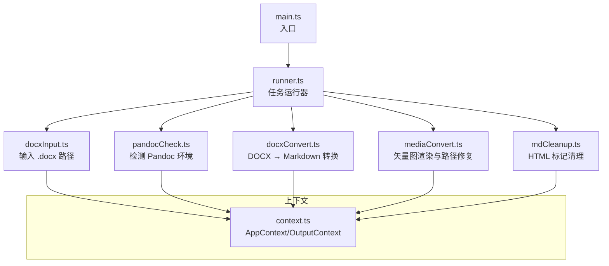
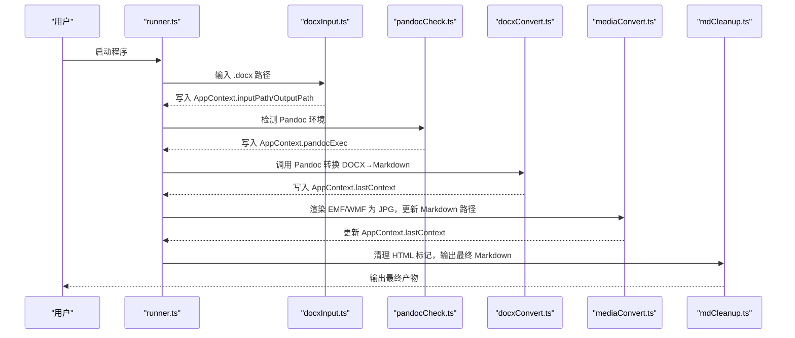
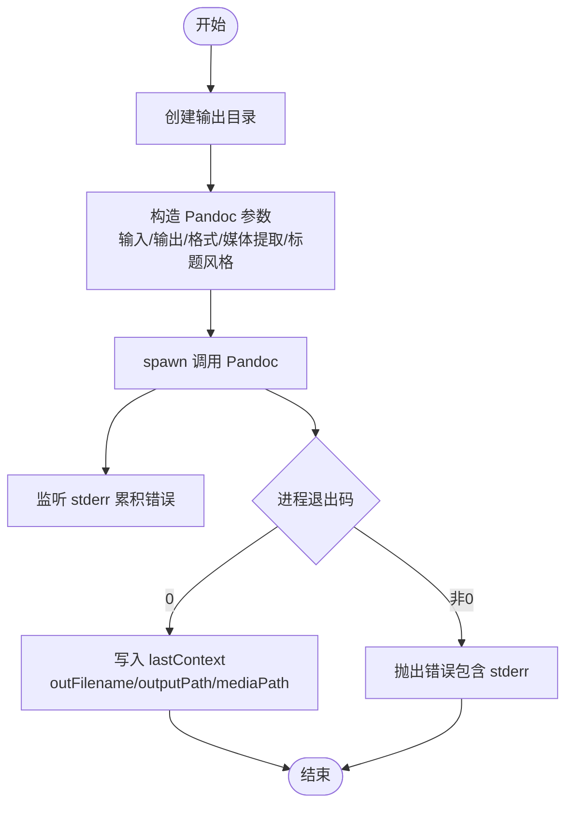
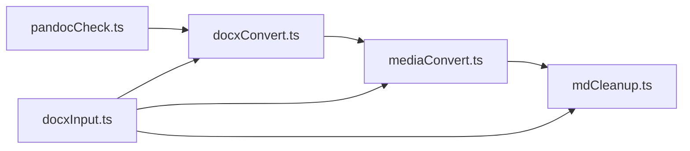

# DOCX 格式转换模块

<cite>
**本文引用的文件**
- [src/taks/docxConvert.ts](file://src/tasks/docxConvert.ts)
- [src/tasks/pandocCheck.ts](file://src/tasks/pandocCheck.ts)
- [src/tasks/docxInput.ts](file://src/tasks/docxInput.ts)
- [src/tasks/mediaConvert.ts](file://src/tasks/mediaConvert.ts)
- [src/tasks/mdCleanup.ts](file://src/tasks/mdCleanup.ts)
- [src/context.ts](file://src/context.ts)
- [src/runner.ts](file://src/runner.ts)
- [src/main.ts](file://src/main.ts)
- [src/utils.ts](file://src/utils.ts)
- [package.json](file://package.json)
</cite>

## 目录
1. [简介](#简介)
2. [项目结构](#项目结构)
3. [核心组件](#核心组件)
4. [架构总览](#架构总览)
5. [详细组件分析](#详细组件分析)
6. [依赖关系分析](#依赖关系分析)
7. [性能考量](#性能考量)
8. [故障排查指南](#故障排查指南)
9. [结论](#结论)
10. [附录](#附录)

## 简介
本文件面向“DOCX 格式转换模块”，系统性阐述 docxConvertTask 的实现原理与使用方法，涵盖：
- Pandoc 调用机制与参数配置
- DOCX 到 Markdown 的转换流程（文档结构解析、样式保持与内容提取）
- 错误处理策略（Pandoc 错误码、超时控制、重试机制）
- 转换参数完整配置说明（自定义过滤器、输出格式选项、性能优化）
- 实际转换示例与常见问题解决方案

## 项目结构
doc2md-cli 采用“任务流水线”架构，围绕 Listr2 组织多个独立任务，通过共享上下文在任务间传递数据。docxConvertTask 位于流水线中间阶段，负责将 .docx 转换为 Markdown，并抽取媒体资源。

图表来源
- [src/main.ts:1-41](file://src/main.ts#L1-L41)
- [src/runner.ts:1-10](file://src/runner.ts#L1-L10)
- [src/context.ts:1-21](file://src/context.ts#L1-L21)
- [src/tasks/docxInput.ts:1-52](file://src/tasks/docxInput.ts#L1-L52)
- [src/tasks/pandocCheck.ts:1-24](file://src/tasks/pandocCheck.ts#L1-L24)
- [src/tasks/docxConvert.ts:1-64](file://src/tasks/docxConvert.ts#L1-L64)
- [src/tasks/mediaConvert.ts:1-112](file://src/tasks/mediaConvert.ts#L1-L112)
- [src/tasks/mdCleanup.ts:1-373](file://src/tasks/mdCleanup.ts#L1-L373)

章节来源
- [src/main.ts:1-41](file://src/main.ts#L1-L41)
- [src/runner.ts:1-10](file://src/runner.ts#L1-L10)
- [src/context.ts:1-21](file://src/context.ts#L1-L21)

## 核心组件
- AppContext：承载输入路径、输出根目录、Pandoc 可执行文件路径以及最后阶段产出上下文。
- OutputContext：记录本次转换产生的 Markdown 输出文件名、路径与媒体目录。
- 任务流水线：按顺序执行输入收集、环境检测、转换、媒体处理、Markdown 清理。

章节来源
- [src/context.ts:1-21](file://src/context.ts#L1-L21)
- [src/tasks/docxInput.ts:1-52](file://src/tasks/docxInput.ts#L1-L52)
- [src/tasks/pandocCheck.ts:1-24](file://src/tasks/pandocCheck.ts#L1-L24)
- [src/tasks/docxConvert.ts:1-64](file://src/tasks/docxConvert.ts#L1-L64)
- [src/tasks/mediaConvert.ts:1-112](file://src/tasks/mediaConvert.ts#L1-L112)
- [src/tasks/mdCleanup.ts:1-373](file://src/tasks/mdCleanup.ts#L1-L373)

## 架构总览
docxConvertTask 作为流水线中的关键节点，负责：
- 基于输入 .docx 与输出根目录，计算转换层目录与输出文件名
- 调用 Pandoc，指定输入格式与输出格式，提取媒体资源
- 将转换结果写入上下文，供后续媒体与 Markdown 清理任务使用

图表来源
- [src/main.ts:1-41](file://src/main.ts#L1-L41)
- [src/runner.ts:1-10](file://src/runner.ts#L1-L10)
- [src/tasks/docxInput.ts:1-52](file://src/tasks/docxInput.ts#L1-L52)
- [src/tasks/pandocCheck.ts:1-24](file://src/tasks/pandocCheck.ts#L1-L24)
- [src/tasks/docxConvert.ts:1-64](file://src/tasks/docxConvert.ts#L1-L64)
- [src/tasks/mediaConvert.ts:1-112](file://src/tasks/mediaConvert.ts#L1-L112)
- [src/tasks/mdCleanup.ts:1-373](file://src/tasks/mdCleanup.ts#L1-L373)

## 详细组件分析

### docxConvertTask 实现原理
- 输入/输出路径计算
  - 输出目录：基于 AppContext.outputPath 下的“docxConvert”层
  - 输出文件名：将输入 .docx 名称替换为 .md
  - 媒体目录：输出目录下的 media 子目录
- Pandoc 调用参数
  - 输入格式：docx+styles（保留样式）
  - 输出格式：gfm（GitHub Flavored Markdown），并禁用 tex_math_gfm（避免数学块转 TeX）
  - 关键参数：
    - -o 指定输出文件名
    - --extract-media=. 提取媒体资源到当前目录
    - --markdown-headings=atx 使用 ATX 样式的标题
- 进程与错误处理
  - 使用 child_process.spawn 启动 Pandoc
  - 捕获 stderr 累积错误信息
  - close 事件中根据退出码决定成功或失败，成功时写入 AppContext.lastContext

图表来源
- [src/tasks/docxConvert.ts:10-64](file://src/tasks/docxConvert.ts#L10-L64)

章节来源
- [src/tasks/docxConvert.ts:1-64](file://src/tasks/docxConvert.ts#L1-L64)

### DOCX 到 Markdown 的转换过程
- 文档结构解析
  - 使用 docx+styles 输入格式，保留原文档样式信息，便于后续 Markdown 清理阶段进行语义识别
- 样式保持
  - gfm 输出格式配合 --markdown-headings=atx，确保标题层级与链接、列表等结构稳定
  - 禁用 tex_math_gfm，避免将数学表达式转换为 LaTeX 片段，便于后续统一处理
- 内容提取
  - 通过 --extract-media=. 将嵌入的 EMF/WMF 等矢量图导出到媒体目录，供后续媒体转换任务处理

章节来源
- [src/tasks/docxConvert.ts:7-8](file://src/tasks/docxConvert.ts#L7-L8)
- [src/tasks/docxConvert.ts:28-38](file://src/tasks/docxConvert.ts#L28-L38)

### 错误处理策略
- Pandoc 错误码处理
  - 退出码为 0 认为成功；非 0 时将 stderr 作为错误消息抛出
- 超时控制
  - 当前实现未设置超时；如需超时控制，可在 spawn 时增加超时逻辑并在超时后 kill 进程
- 重试机制
  - 当前实现未内置重试；可在上层任务包装中加入指数退避重试策略（例如最多重试 N 次）

章节来源
- [src/tasks/docxConvert.ts:48-61](file://src/tasks/docxConvert.ts#L48-L61)

### 转换参数完整配置说明
- 输入/输出格式
  - 输入：docx+styles（保留样式）
  - 输出：gfm（GitHub Flavored Markdown）
  - 数学公式：禁用 tex_math_gfm（避免 TeX 片段）
- 媒体处理
  - --extract-media=.：将媒体资源导出到输出目录的 media 子目录
- 标题风格
  - --markdown-headings=atx：使用 ATX 样式标题
- 自定义过滤器
  - 当前未使用 Pandoc 过滤器；如需，可在参数中追加 --lua-filter 或 --filter
- 性能优化建议
  - 使用 --extract-media 仅在需要时启用，避免不必要的媒体复制
  - 对大文档可考虑分段处理（若业务允许）

章节来源
- [src/tasks/docxConvert.ts:7-8](file://src/tasks/docxConvert.ts#L7-L8)
- [src/tasks/docxConvert.ts:28-38](file://src/tasks/docxConvert.ts#L28-L38)

### 媒体转换与 Markdown 清理（补充流程）
- 媒体转换（mediaConvertTask）
  - 定位并调用 MetafileConverter.exe，将 EMF/WMF 渲染为 JPG
  - 更新 Markdown 中的图片引用路径，使其指向 JPG
- Markdown 清理（mdCleanupTask）
  - 基于状态机与正则表达式，移除 HTML 包装与冗余标记，修复图片语法与标题层级
  - 支持中文数字标题映射为 ATX 标题

章节来源
- [src/tasks/mediaConvert.ts:1-112](file://src/tasks/mediaConvert.ts#L1-L112)
- [src/tasks/mdCleanup.ts:1-373](file://src/tasks/mdCleanup.ts#L1-L373)

## 依赖关系分析
- 任务耦合
  - docxConvertTask 依赖 pandocCheckTask 的执行结果（pandocExec）
  - mediaConvertTask 与 mdCleanupTask 依赖 docxConvertTask 写入的 lastContext
- 外部依赖
  - Pandoc：用于 DOCX 到 Markdown 的转换
  - MetafileConverter.exe：用于矢量图渲染（.NET 8.0 发布版本）

图表来源
- [src/tasks/pandocCheck.ts:14-23](file://src/tasks/pandocCheck.ts#L14-L23)
- [src/tasks/docxConvert.ts:10-64](file://src/tasks/docxConvert.ts#L10-L64)
- [src/tasks/mediaConvert.ts:104-112](file://src/tasks/mediaConvert.ts#L104-L112)
- [src/tasks/mdCleanup.ts:331-373](file://src/tasks/mdCleanup.ts#L331-L373)
- [src/tasks/docxInput.ts:27-52](file://src/tasks/docxInput.ts#L27-L52)

章节来源
- [src/tasks/pandocCheck.ts:14-23](file://src/tasks/pandocCheck.ts#L14-L23)
- [src/tasks/docxConvert.ts:10-64](file://src/tasks/docxConvert.ts#L10-L64)
- [src/tasks/mediaConvert.ts:104-112](file://src/tasks/mediaConvert.ts#L104-L112)
- [src/tasks/mdCleanup.ts:331-373](file://src/tasks/mdCleanup.ts#L331-L373)
- [src/tasks/docxInput.ts:27-52](file://src/tasks/docxInput.ts#L27-L52)

## 性能考量
- Pandoc 参数
  - 仅在必要时启用媒体提取，减少 I/O
  - 使用 ATX 标题风格，避免复杂标题解析开销
- 流水线并发
  - mediaConvertTask 与 mdCleanupTask 为独立任务，可在多核环境下并行执行（取决于 runner 配置）
- 缓存与复用
  - 使用缓存文件存储上次输入路径，减少重复输入

章节来源
- [src/utils.ts:17-50](file://src/utils.ts#L17-L50)
- [src/runner.ts:4-9](file://src/runner.ts#L4-L9)

## 故障排查指南
- 未检测到 Pandoc
  - 现象：pandocCheckTask 抛出“未检测到已安装的 pandoc”
  - 处理：安装 Pandoc 并确保其在系统 PATH 中可用
- 转换失败（非零退出码）
  - 现象：docxConvertTask 捕获 stderr 并抛出错误
  - 处理：查看 stderr 输出，确认 .docx 是否损坏、公式是否符合要求
- 媒体渲染失败
  - 现象：mediaConvertTask 报错“MetafileConverter 退出码 X”
  - 处理：确认 MetafileConverter.exe 可执行文件存在且与当前平台兼容
- Markdown 清理异常
  - 现象：mdCleanupTask 抛出读取/写入错误
  - 处理：检查输出目录权限与磁盘空间

章节来源
- [src/tasks/pandocCheck.ts:14-23](file://src/tasks/pandocCheck.ts#L14-L23)
- [src/tasks/docxConvert.ts:48-61](file://src/tasks/docxConvert.ts#L48-L61)
- [src/tasks/mediaConvert.ts:29-40](file://src/tasks/mediaConvert.ts#L29-L40)
- [src/tasks/mdCleanup.ts:334-372](file://src/tasks/mdCleanup.ts#L334-L372)

## 结论
docxConvertTask 通过明确的参数配置与稳健的错误处理，实现了从 DOCX 到 Markdown 的可靠转换。结合媒体渲染与 Markdown 清理，形成完整的端到端流水线。建议在生产环境中增加超时与重试机制，并根据文档规模调整 Pandoc 参数以提升性能。

## 附录

### 实际转换示例（步骤说明）
- 准备工作
  - 安装 Pandoc 并确保其在 PATH 中
  - 准备一个包含公式的 .docx 文档（公式需为 Office Math 格式）
- 执行流程
  - 运行程序，输入 .docx 路径
  - 程序自动检测 Pandoc 环境
  - 执行 DOCX → Markdown 转换，提取媒体资源
  - 渲染 EMF/WMF 为 JPG，并更新 Markdown 中的图片引用
  - 清理 HTML 标记，输出最终 Markdown
- 产物位置
  - 最终 Markdown 与媒体文件位于输出根目录下的各层子目录中

章节来源
- [src/main.ts:12-16](file://src/main.ts#L12-L16)
- [src/tasks/docxInput.ts:27-52](file://src/tasks/docxInput.ts#L27-L52)
- [src/tasks/pandocCheck.ts:14-23](file://src/tasks/pandocCheck.ts#L14-L23)
- [src/tasks/docxConvert.ts:10-64](file://src/tasks/docxConvert.ts#L10-L64)
- [src/tasks/mediaConvert.ts:104-112](file://src/tasks/mediaConvert.ts#L104-L112)
- [src/tasks/mdCleanup.ts:331-373](file://src/tasks/mdCleanup.ts#L331-L373)