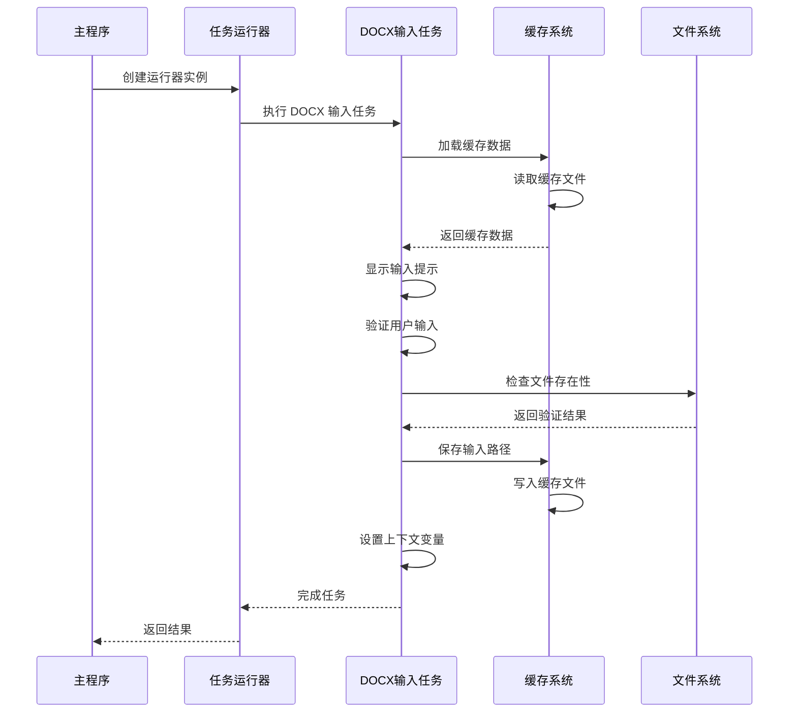
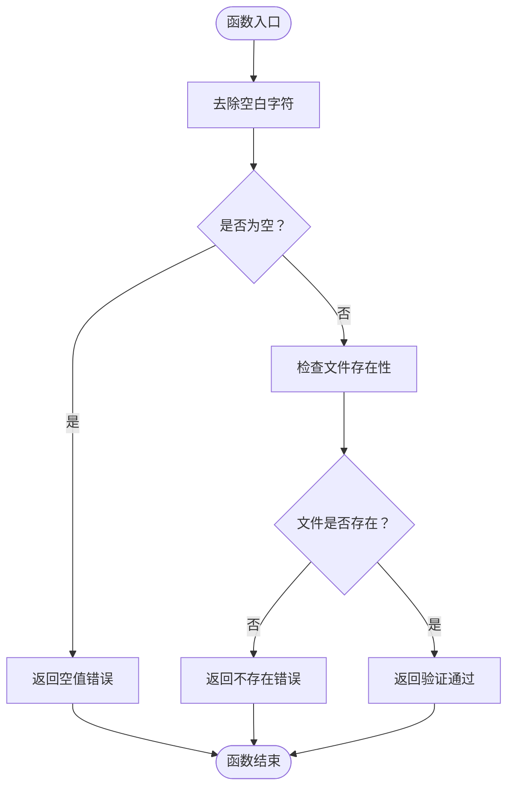
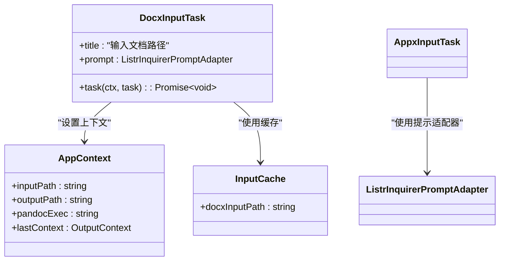
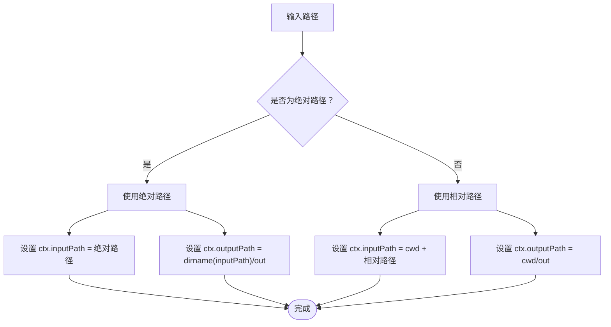
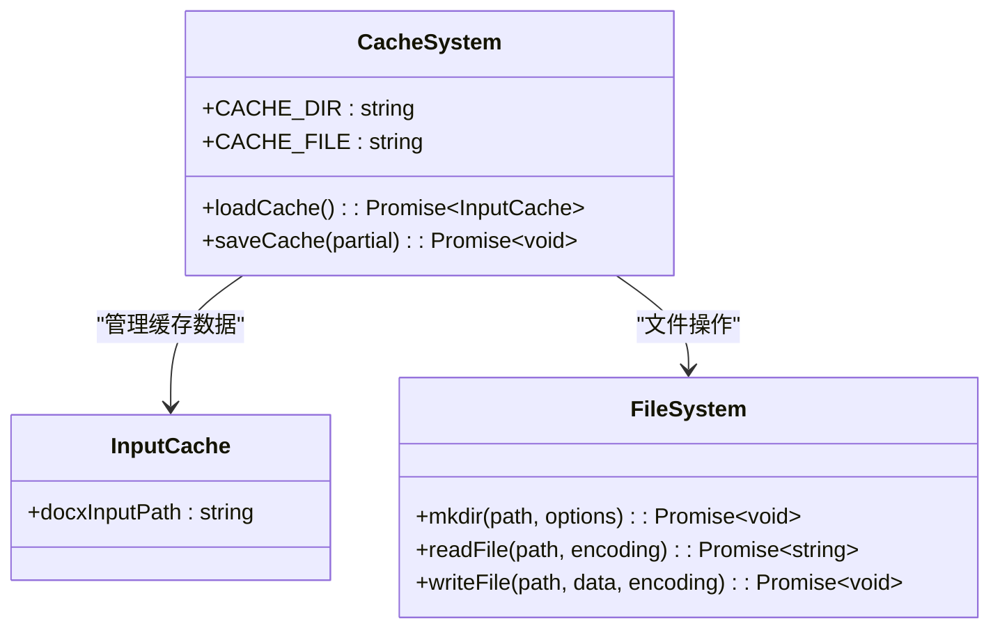

# DOCX 输入处理模块

<cite>
**本文档引用的文件**
- [src/tasks/docxInput.ts](file://src/tasks/docxInput.ts)
- [src/context.ts](file://src/context.ts)
- [src/utils.ts](file://src/utils.ts)
- [src/main.ts](file://src/main.ts)
- [src/runner.ts](file://src/runner.ts)
</cite>

## 目录
1. [简介](#简介)
2. [项目结构](#项目结构)
3. [核心组件](#核心组件)
4. [架构概览](#架构概览)
5. [详细组件分析](#详细组件分析)
6. [依赖关系分析](#依赖关系分析)
7. [性能考虑](#性能考虑)
8. [故障排除指南](#故障排除指南)
9. [结论](#结论)

## 简介

DOCX 输入处理模块是 doc2md-cli 项目中的关键组件，负责处理用户对 .docx 文档路径的输入。该模块实现了完整的用户交互界面、路径验证机制以及智能的缓存系统，确保用户能够高效地指定输入文件并获得一致的用户体验。

该模块的主要功能包括：
- 提供直观的命令行用户界面
- 实施严格的路径验证规则
- 支持绝对路径和相对路径的智能处理
- 维护用户输入缓存以提升用户体验
- 集成到整体的任务执行流程中

## 项目结构

DOCX 输入处理模块位于 `src/tasks/docxInput.ts` 文件中，与项目的其他核心组件协同工作：

```mermaid
graph TB
subgraph "项目结构"
A[src/main.ts] --> B[src/runner.ts]
B --> C[src/tasks/docxInput.ts]
C --> D[src/context.ts]
C --> E[src/utils.ts]
F[src/tasks/] --> C
G[src/context.ts] --> D
H[src/utils.ts] --> E
end
subgraph "外部依赖"
I[@inquirer/prompts]
J[@listr2/prompt-adapter-inquirer]
K[listr2]
end
C --> I
C --> J
B --> K
```

**图表来源**
- [src/main.ts:1-41](file://src/main.ts#L1-L41)
- [src/runner.ts:1-10](file://src/runner.ts#L1-L10)
- [src/tasks/docxInput.ts:1-52](file://src/tasks/docxInput.ts#L1-L52)

**章节来源**
- [src/main.ts:1-41](file://src/main.ts#L1-L41)
- [src/runner.ts:1-10](file://src/runner.ts#L1-L10)

## 核心组件

DOCX 输入处理模块由三个主要组件构成：

### 1. 路径验证组件
- `validateDocxPath` 函数：实施严格的路径验证规则
- 支持空值检查、文件存在性验证和错误消息处理

### 2. 用户交互组件
- `docxInputTask`：Listr 任务定义，管理用户输入流程
- 集成 Inquirer 提示系统和缓存机制

### 3. 缓存管理组件
- `loadCache` 和 `saveCache` 函数：实现用户输入缓存的持久化存储

**章节来源**
- [src/tasks/docxInput.ts:10-52](file://src/tasks/docxInput.ts#L10-L52)
- [src/utils.ts:20-50](file://src/utils.ts#L20-L50)

## 架构概览

DOCX 输入处理模块采用模块化架构设计，与项目的其他组件紧密集成：



**图表来源**
- [src/main.ts:9-16](file://src/main.ts#L9-L16)
- [src/tasks/docxInput.ts:27-51](file://src/tasks/docxInput.ts#L27-L51)
- [src/utils.ts:28-49](file://src/utils.ts#L28-L49)

## 详细组件分析

### 路径验证机制

#### validateDocxPath 函数

`validateDocxPath` 函数实现了三层验证机制：



**图表来源**
- [src/tasks/docxInput.ts:13-25](file://src/tasks/docxInput.ts#L13-L25)

验证规则详解：

1. **空值检查**：移除输入字符串两端的空白字符，如果结果为空，则返回中文错误消息"请输入有效的 .docx 文件路径"

2. **文件存在性验证**：使用异步文件系统访问检查，通过 Promise 的 then/catch 模式判断文件是否存在

3. **错误消息处理**：当文件不存在时，返回中文错误消息"路径不存在，请确认后重新输入"

**章节来源**
- [src/tasks/docxInput.ts:13-25](file://src/tasks/docxInput.ts#L13-L25)

### 用户交互界面设计

#### docxInputTask 任务

`docxInputTask` 是一个完整的 Listr 任务，负责管理整个用户输入流程：



**图表来源**
- [src/tasks/docxInput.ts:27-51](file://src/tasks/docxInput.ts#L27-L51)
- [src/context.ts:7-16](file://src/context.ts#L7-L16)
- [src/utils.ts:20-22](file://src/utils.ts#L20-L22)

用户界面特性：

1. **彩色提示信息**：使用 ANSI 颜色代码显示警告信息，提醒用户确保文档中所有公式已转换为 Office Math 格式

2. **智能默认值**：从缓存中加载上次使用的路径作为默认值

3. **实时验证**：在用户输入时进行实时验证，提供即时反馈

4. **路径处理逻辑**：区分绝对路径和相对路径，自动转换为适当的格式

**章节来源**
- [src/tasks/docxInput.ts:27-51](file://src/tasks/docxInput.ts#L27-L51)

### 绝对路径与相对路径处理

路径处理逻辑根据输入路径的性质自动选择不同的处理策略：



**图表来源**
- [src/tasks/docxInput.ts:43-49](file://src/tasks/docxInput.ts#L43-L49)

处理规则：

1. **绝对路径处理**：
   - 直接使用输入路径作为 `inputPath`
   - 输出目录设置为输入文件所在目录的 `out` 子目录

2. **相对路径处理**：
   - 将输入路径与当前工作目录连接
   - 输出目录设置为当前工作目录的 `out` 子目录

**章节来源**
- [src/tasks/docxInput.ts:43-49](file://src/tasks/docxInput.ts#L43-L49)

### 用户输入缓存机制

#### 缓存系统架构

缓存系统采用 JSON 文件持久化存储，提供以下功能：



**图表来源**
- [src/utils.ts:17-18](file://src/utils.ts#L17-L18)
- [src/utils.ts:20-22](file://src/utils.ts#L20-L22)
- [src/utils.ts:28-49](file://src/utils.ts#L28-L49)

#### loadCache 函数实现

`loadCache` 函数负责从磁盘读取缓存数据：

1. **文件读取**：尝试读取用户主目录下的 `.doc2md-cli/cache.json` 文件
2. **错误处理**：如果文件不存在或无法读取，返回空对象而不是抛出异常
3. **数据解析**：将 JSON 字符串解析为 JavaScript 对象

#### saveCache 函数实现

`saveCache` 函数负责将缓存数据写入磁盘：

1. **数据合并**：将新的缓存数据与现有缓存数据合并
2. **目录创建**：确保缓存目录存在，递归创建所需目录结构
3. **文件写入**：将合并后的数据写入 JSON 文件，格式化为可读格式
4. **容错处理**：缓存写入失败不会影响主流程执行

**章节来源**
- [src/utils.ts:28-49](file://src/utils.ts#L28-L49)

## 依赖关系分析

DOCX 输入处理模块的依赖关系清晰明确：

```mermaid
graph TB
subgraph "内部依赖"
A[docxInput.ts] --> B[context.ts]
A --> C[utils.ts]
A --> D[main.ts]
A --> E[runner.ts]
end
subgraph "外部依赖"
F[@inquirer/prompts]
G[@listr2/prompt-adapter-inquirer]
H[listr2]
I[fs/promises]
J[path]
end
A --> F
A --> G
A --> H
A --> I
A --> J
```

**图表来源**
- [src/tasks/docxInput.ts:1-8](file://src/tasks/docxInput.ts#L1-L8)
- [src/main.ts:1-8](file://src/main.ts#L1-L8)

**章节来源**
- [src/tasks/docxInput.ts:1-8](file://src/tasks/docxInput.ts#L1-L8)
- [src/main.ts:1-8](file://src/main.ts#L1-L8)

## 性能考虑

### 异步操作优化

1. **非阻塞文件系统操作**：使用 `fs/promises` API 进行异步文件检查，避免阻塞主线程

2. **Promise 链式调用**：通过 `then/catch` 模式简化异步操作，提高代码可读性

3. **缓存机制**：减少重复的文件系统访问，提升用户体验

### 错误处理策略

1. **优雅降级**：缓存读写失败时不会影响主流程执行
2. **用户友好**：提供清晰的中文错误消息
3. **异常捕获**：在关键操作点添加 try/catch 块

## 故障排除指南

### 常见问题及解决方案

#### 1. 路径验证失败

**问题**：输入路径被拒绝
**可能原因**：
- 路径为空或只包含空白字符
- 指定的文件不存在
- 文件权限不足

**解决方法**：
- 确保输入包含有效的 .docx 文件路径
- 使用绝对路径避免相对路径问题
- 检查文件权限和路径拼写

#### 2. 缓存功能异常

**问题**：缓存无法正常工作
**可能原因**：
- 用户主目录权限不足
- 磁盘空间不足
- 文件系统权限问题

**解决方法**：
- 检查用户主目录的写入权限
- 确保有足够的磁盘空间
- 验证文件系统的完整性

#### 3. 路径处理错误

**问题**：输出路径设置不正确
**可能原因**：
- 相对路径解析错误
- 工作目录发生变化
- 跨平台路径分隔符问题

**解决方法**：
- 使用绝对路径避免相对路径问题
- 在跨平台环境中使用 Node.js 路径模块
- 检查工作目录的正确性

**章节来源**
- [src/tasks/docxInput.ts:13-25](file://src/tasks/docxInput.ts#L13-L25)
- [src/utils.ts:28-49](file://src/utils.ts#L28-L49)

## 结论

DOCX 输入处理模块展现了优秀的软件工程实践，具有以下特点：

1. **模块化设计**：清晰的功能分离和职责划分
2. **用户友好**：直观的界面设计和及时的反馈机制
3. **健壮性**：完善的错误处理和容错机制
4. **可维护性**：简洁的代码结构和良好的文档注释
5. **性能优化**：异步操作和缓存机制提升用户体验

该模块成功地将复杂的输入处理逻辑封装在一个易于理解和扩展的接口后面，为整个 doc2md-cli 项目提供了可靠的输入处理基础。