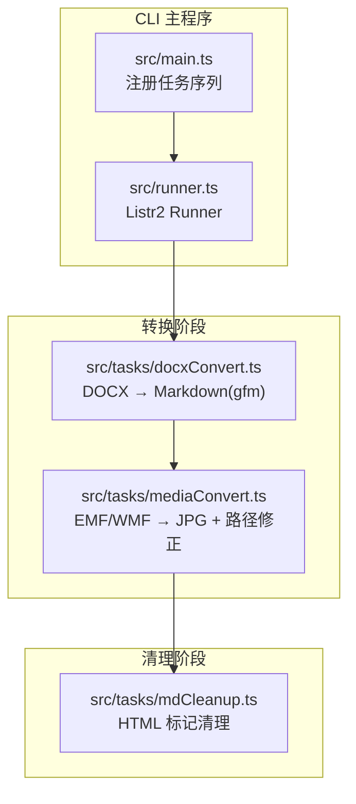
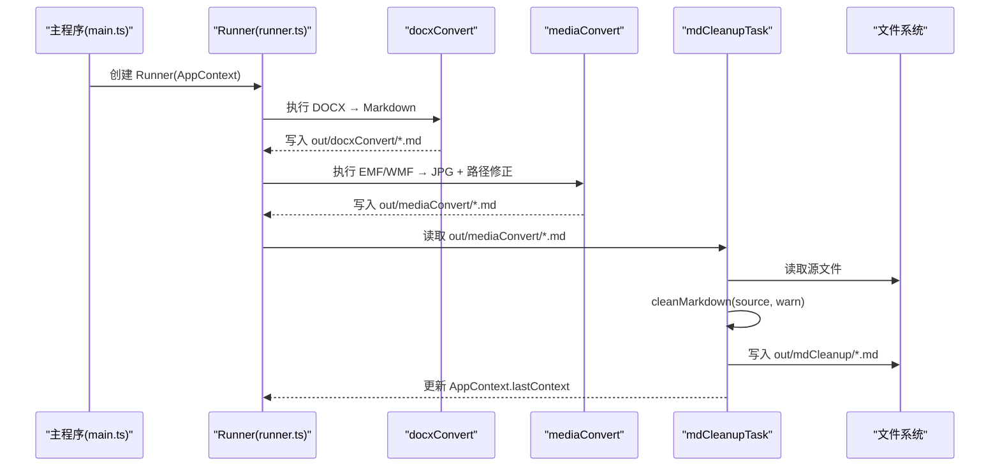
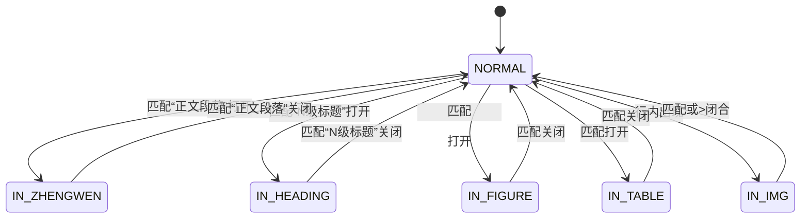

# Markdown 内容清理模块

<cite>
**本文档引用的文件**
- [src/tasks/mdCleanup.ts](file://src/tasks/mdCleanup.ts)
- [src/context.ts](file://src/context.ts)
- [src/main.ts](file://src/main.ts)
- [src/runner.ts](file://src/runner.ts)
- [src/taks/docxConvert.ts](file://src/tasks/docxConvert.ts)
- [.kiro/specs/md-html-cleanup/design.md](file://.kiro/specs/md-html-cleanup/design.md)
- [.kiro/specs/md-html-cleanup/requirements.md](file://.kiro/specs/md-html-cleanup/requirements.md)
- [.kiro/specs/md-html-cleanup/tasks.md](file://.kiro/specs/md-html-cleanup/tasks.md)
</cite>

## 目录
1. [简介](#简介)
2. [项目结构](#项目结构)
3. [核心组件](#核心组件)
4. [架构总览](#架构总览)
5. [详细组件分析](#详细组件分析)
6. [依赖关系分析](#依赖关系分析)
7. [性能考虑](#性能考虑)
8. [故障排查指南](#故障排查指南)
9. [结论](#结论)
10. [附录](#附录)

## 简介
本模块是 doc2xml-cli 工作流中的一个后处理任务，负责清理由 pandoc 从 Word 文档转换而来的 Markdown 中的 HTML 遗留标记，将其规范化为标准 Markdown。其核心目标包括：
- 移除正文段落包装器标签，保留内部文本
- 将中文标题样式转换为 ATX 标题
- 将 figure 块转换为标准 Markdown 图片语法
- 对独立的内联图片标签进行识别与替换
- 保持表格块原样透传
- 处理多行图片标签的跨行闭合与尾随文本

该模块采用“状态机 + 正则扫描”的轻量实现，确保在单次线性扫描中完成所有清理规则，同时具备幂等性与顺序不变性。

## 项目结构
该模块位于 src/tasks/mdCleanup.ts，配合上下文扩展与主流程注册，形成完整的流水线任务链。

图表来源
- [src/main.ts:12-16](file://src/main.ts#L12-L16)
- [src/tasks/docxConvert.ts:10-63](file://src/tasks/docxConvert.ts#L10-L63)
- [src/tasks/mediaConvert.ts:104-112](file://src/tasks/mediaConvert.ts#L104-L112)
- [src/tasks/mdCleanup.ts:329-373](file://src/tasks/mdCleanup.ts#L329-L373)

章节来源
- [src/main.ts:1-41](file://src/main.ts#L1-L41)
- [src/runner.ts:1-10](file://src/runner.ts#L1-L10)
- [src/tasks/docxConvert.ts:1-64](file://src/tasks/docxConvert.ts#L1-L64)
- [src/tasks/mediaConvert.ts:1-112](file://src/tasks/mediaConvert.ts#L1-L112)
- [src/tasks/mdCleanup.ts:1-373](file://src/tasks/mdCleanup.ts#L1-L373)

## 核心组件
- 状态枚举与中文标题映射
  - 状态机：NORMAL、IN_ZHENGWEN、IN_HEADING、IN_FIGURE、IN_TABLE、IN_IMG
  - 中文标题映射：将“一二三四五六”映射为“# 到 ######”
- 清理函数 cleanMarkdown
  - 单次线性扫描，逐行处理
  - 使用小缓冲区处理多行块
  - 提供 warn 回调用于记录警告
- 任务 mdCleanupTask
  - 读取上一阶段输出文件
  - 创建输出目录 out/mdCleanup/
  - 调用 cleanMarkdown 并写回标准 Markdown

章节来源
- [src/tasks/mdCleanup.ts:6-14](file://src/tasks/mdCleanup.ts#L6-L14)
- [src/tasks/mdCleanup.ts:17-24](file://src/tasks/mdCleanup.ts#L17-L24)
- [src/tasks/mdCleanup.ts:77-327](file://src/tasks/mdCleanup.ts#L77-L327)
- [src/tasks/mdCleanup.ts:329-373](file://src/tasks/mdCleanup.ts#L329-L373)

## 架构总览
mdCleanup 作为 Listr2 任务，串联在 docxConvert 与 mediaConvert 之后，负责最终输出干净的 Markdown 文件。其数据流如下：

图表来源
- [src/main.ts:12-16](file://src/main.ts#L12-L16)
- [src/tasks/docxConvert.ts:10-63](file://src/tasks/docxConvert.ts#L10-L63)
- [src/tasks/mediaConvert.ts:104-112](file://src/tasks/mediaConvert.ts#L104-L112)
- [src/tasks/mdCleanup.ts:331-373](file://src/tasks/mdCleanup.ts#L331-L373)

## 详细组件分析

### 状态机设计与实现
状态机用于识别与处理多行块，避免全量 HTML 解析带来的复杂度。核心状态与转换如下：

图表来源
- [src/tasks/mdCleanup.ts:6-14](file://src/tasks/mdCleanup.ts#L6-L14)
- [src/tasks/mdCleanup.ts:102-301](file://src/tasks/mdCleanup.ts#L102-L301)

章节来源
- [src/tasks/mdCleanup.ts:6-14](file://src/tasks/mdCleanup.ts#L6-L14)
- [src/tasks/mdCleanup.ts:102-301](file://src/tasks/mdCleanup.ts#L102-L301)

### HTML 标记清理算法
- 正文段落包装器移除
  - 打开与关闭标签分别在进入/退出 IN_ZHENGWEN 时丢弃
  - 保留内部文本与空白行
- 中文标题映射
  - 从列表项行提取中文序号，查表得到 ATX 前缀
  - 收集标题文本，去除空行后输出为 ATX 标题
- figure 块转 Markdown 图片
  - 收集内部行，抽取 src 与 caption 文本
  - 若无 src，发出警告并丢弃；否则输出标准 Markdown 图片
- 表格块透传
  - 将 table 及其子树原样输出
- 内联图片替换
  - 单行内完整  或  替换为 
  - 若无 src，保留原样并发出警告
- 多行图片处理
  - 记录起始行前缀与中间行，直到遇到闭合标签
  - 闭合后若存在尾随文本，先替换其中的完整内联图片，再决定是否继续留在 IN_IMG 状态

章节来源
- [src/tasks/mdCleanup.ts:27-58](file://src/tasks/mdCleanup.ts#L27-L58)
- [src/tasks/mdCleanup.ts:60-72](file://src/tasks/mdCleanup.ts#L60-L72)
- [src/tasks/mdCleanup.ts:104-160](file://src/tasks/mdCleanup.ts#L104-L160)
- [src/tasks/mdCleanup.ts:164-187](file://src/tasks/mdCleanup.ts#L164-L187)
- [src/tasks/mdCleanup.ts:190-209](file://src/tasks/mdCleanup.ts#L190-L209)
- [src/tasks/mdCleanup.ts:211-236](file://src/tasks/mdCleanup.ts#L211-L236)
- [src/tasks/mdCleanup.ts:238-248](file://src/tasks/mdCleanup.ts#L238-L248)
- [src/tasks/mdCleanup.ts:250-300](file://src/tasks/mdCleanup.ts#L250-L300)

### 中文标题映射机制
- 映射表定义
  - “一”到“六”分别映射为“#”到“######”
- 规则应用
  - 在进入 IN_HEADING 时，从匹配的样式字符串中提取首个汉字序号
  - 查表得到 ATX 前缀；未知样式发出警告并回退为直通输出
- 输出行为
  - 成功映射：输出形如“### 标题文本”的 ATX 标题
  - 未知样式：输出收集到的标题文本（不带 ATX 前缀）

章节来源
- [src/tasks/mdCleanup.ts:17-24](file://src/tasks/mdCleanup.ts#L17-L24)
- [src/tasks/mdCleanup.ts:111-125](file://src/tasks/mdCleanup.ts#L111-L125)
- [src/tasks/mdCleanup.ts:193-201](file://src/tasks/mdCleanup.ts#L193-L201)

### 图像标签优化策略
- 单行内联图片
  - 使用正则一次性替换完整  或  为 Markdown 语法
  - 从 src 属性提取 alt 文本（文件名去扩展名）
- 多行图片
  - 记录起始行前缀与中间行，直至闭合
  - 闭合后若存在尾随文本，先处理尾随文本中的内联图片，再决定状态转移
- 错误处理
  - 无 src 的图片：保留原样并发出警告
  - 未闭合的多行图片：保留原样并发出警告
- figure 块中的图片
  - 从内部行抽取 src 与 caption 文本，输出标准 Markdown 图片

章节来源
- [src/tasks/mdCleanup.ts:31-43](file://src/tasks/mdCleanup.ts#L31-L43)
- [src/tasks/mdCleanup.ts:49-58](file://src/tasks/mdCleanup.ts#L49-L58)
- [src/tasks/mdCleanup.ts:144-159](file://src/tasks/mdCleanup.ts#L144-L159)
- [src/tasks/mdCleanup.ts:250-300](file://src/tasks/mdCleanup.ts#L250-L300)
- [src/tasks/mdCleanup.ts:211-236](file://src/tasks/mdCleanup.ts#L211-L236)

### 清理规则优先级与执行顺序
- 规则顺序
  1) 进入正文段落块：丢弃包装器，保留内部文本
  2) 进入标题块：提取中文序号映射为 ATX 前缀，收集标题文本
  3) 进入 figure 块：抽取 src 与 caption，输出 Markdown 图片
  4) 进入 table 块：原样透传
  5) 其余行：先剥离引用块前缀，再替换内联图片，最后检测未闭合的 
- 优先级说明
  - 块级规则（正文、标题、figure、table）优先于行内替换
  - 行内替换按“完整内联图片 → 未闭合跨行图片”顺序处理
  - 未知标题样式与无 src 图片会发出警告但不中断流程

章节来源
- [src/tasks/mdCleanup.ts:104-160](file://src/tasks/mdCleanup.ts#L104-L160)
- [src/tasks/mdCleanup.ts:164-187](file://src/tasks/mdCleanup.ts#L164-L187)
- [src/tasks/mdCleanup.ts:190-209](file://src/tasks/mdCleanup.ts#L190-L209)
- [src/tasks/mdCleanup.ts:211-236](file://src/tasks/mdCleanup.ts#L211-L236)
- [src/tasks/mdCleanup.ts:238-248](file://src/tasks/mdCleanup.ts#L238-L248)
- [src/tasks/mdCleanup.ts:144-159](file://src/tasks/mdCleanup.ts#L144-L159)

### 配置选项与可扩展点
- 中文标题映射表
  - 可通过修改映射表扩展更多中文序号到 ATX 级别的映射
- 正则模式
  - 可根据 pandoc 输出变化调整匹配模式（如包装器属性、标题样式）
- 警告回调
  - 通过 warn 回调统一记录清理过程中的异常与风险提示
- 输出路径
  - 任务自动写入 out/mdCleanup/ 目录，文件名与上一阶段一致

章节来源
- [src/tasks/mdCleanup.ts:17-24](file://src/tasks/mdCleanup.ts#L17-L24)
- [src/tasks/mdCleanup.ts:60-72](file://src/tasks/mdCleanup.ts#L60-L72)
- [src/tasks/mdCleanup.ts:355-357](file://src/tasks/mdCleanup.ts#L355-L357)

### 性能优化策略
- 正则表达式优化
  - 使用锚定与非贪婪匹配，减少回溯
  - 对重复使用的模式进行常量化，避免重复构造
- 扫描策略
  - 单次线性扫描，按行处理，内存占用低
  - 小缓冲区处理多行块，避免一次性加载整文件
- 批量处理
  - 逐行替换内联图片，减少多次遍历
- 幂等性
  - cleanMarkdown 为纯函数，重复应用不会改变结果，适合重试与调试

章节来源
- [src/tasks/mdCleanup.ts:60-72](file://src/tasks/mdCleanup.ts#L60-L72)
- [src/tasks/mdCleanup.ts:77-327](file://src/tasks/mdCleanup.ts#L77-L327)

### 实际清理示例与效果对比
- 输入（示意）
  - 正文段落包装器、中文标题块、figure 块、table 块、内联图片标签
- 输出（示意）
  - 包装器被移除，标题转为 ATX，figure 转为 Markdown 图片，table 原样，内联图片替换为 Markdown 语法
- 注意
  - 本仓库未提供具体示例文件，请参考设计文档中的规则与属性测试描述进行验证

章节来源
- [.kiro/specs/md-html-cleanup/design.md:35-218](file://.kiro/specs/md-html-cleanup/design.md#L35-L218)
- [.kiro/specs/md-html-cleanup/tasks.md:14-40](file://.kiro/specs/md-html-cleanup/tasks.md#L14-L40)

## 依赖关系分析
- 模块内聚
  - mdCleanup.ts 自包含：状态机、正则、辅助函数、任务实现
- 外部依赖
  - Listr2：任务编排与进度输出
  - Node fs/promises：文件读写
- 上下文耦合
  - 依赖 AppContext.lastContext 提供上一阶段输出路径
  - 依赖 OutputContext 结构传递文件名、输出路径、媒体路径

图表来源
- [src/tasks/mdCleanup.ts:331-373](file://src/tasks/mdCleanup.ts#L331-L373)
- [src/context.ts:1-21](file://src/context.ts#L1-L21)
- [src/main.ts:12-16](file://src/main.ts#L12-L16)
- [src/runner.ts:1-10](file://src/runner.ts#L1-L10)

章节来源
- [src/tasks/mdCleanup.ts:331-373](file://src/tasks/mdCleanup.ts#L331-L373)
- [src/context.ts:1-21](file://src/context.ts#L1-L21)
- [src/main.ts:12-16](file://src/main.ts#L12-L16)
- [src/runner.ts:1-10](file://src/runner.ts#L1-L10)

## 性能考虑
- 时间复杂度
  - 单次线性扫描 O(n)，每行最多一次正则匹配与替换
- 空间复杂度
  - 输出数组累积，最坏 O(n)；状态机缓冲区较小，近似 O(1)
- I/O
  - 仅在任务入口与出口进行文件读写，避免频繁小块 I/O
- 可靠性
  - EOF 时对未闭合块进行兜底输出，避免数据丢失

章节来源
- [src/tasks/mdCleanup.ts:77-327](file://src/tasks/mdCleanup.ts#L77-L327)
- [src/tasks/mdCleanup.ts:304-324](file://src/tasks/mdCleanup.ts#L304-L324)

## 故障排查指南
- 无法读取源文件
  - 现象：任务抛出错误并终止
  - 处理：检查上一阶段输出路径是否正确，确认文件存在且可读
- 未知标题样式
  - 现象：输出中标题未带 ATX 前缀并伴随警告
  - 处理：检查 pandoc 输出的标题样式字符串是否符合预期
- figure 块无图片
  - 现象：警告“Figure 块不含  标签 — 块移除”
  - 处理：确认 figure 内是否包含有效图片标签
- 多行图片无 src
  - 现象：警告“多行  无 src — 保持原样”
  - 处理：检查图片标签是否包含 src 属性
- 未闭合的多行图片
  - 现象：警告“未闭合多行  无 src — 保持原样”
  - 处理：修复 HTML 标签闭合问题

章节来源
- [src/tasks/mdCleanup.ts:340-348](file://src/tasks/mdCleanup.ts#L340-L348)
- [src/tasks/mdCleanup.ts:289-297](file://src/tasks/mdCleanup.ts#L289-L297)
- [src/tasks/mdCleanup.ts:309-324](file://src/tasks/mdCleanup.ts#L309-L324)

## 结论
mdCleanup 模块通过简洁的状态机与正则扫描，在单次线性遍历中高效完成 HTML 标记清理，满足正文段落移除、中文标题映射、figure 转换、内联图片替换与表格透传等需求。其纯函数设计便于测试与维护，结合 warn 回调提供了良好的可观测性。建议在后续版本中增加配置化映射表与更丰富的过滤规则，以适配更多 pandoc 输出风格。

## 附录
- 设计文档要点
  - 规则覆盖：正文段落、标题、figure、table、内联图片
  - 正确性性质：内容顺序不变、幂等性、无包装器标签残留
- 实施计划
  - 扩展上下文类型、实现 cleanMarkdown、注册任务、集成测试

章节来源
- [.kiro/specs/md-html-cleanup/design.md:35-218](file://.kiro/specs/md-html-cleanup/design.md#L35-L218)
- [.kiro/specs/md-html-cleanup/tasks.md:7-59](file://.kiro/specs/md-html-cleanup/tasks.md#L7-L59)