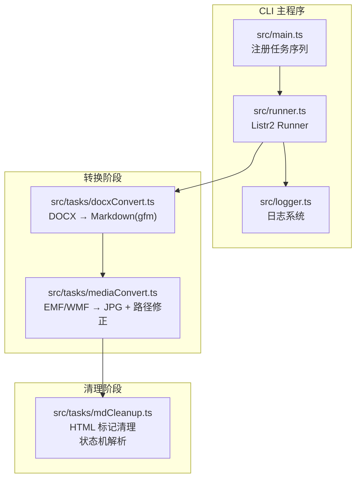
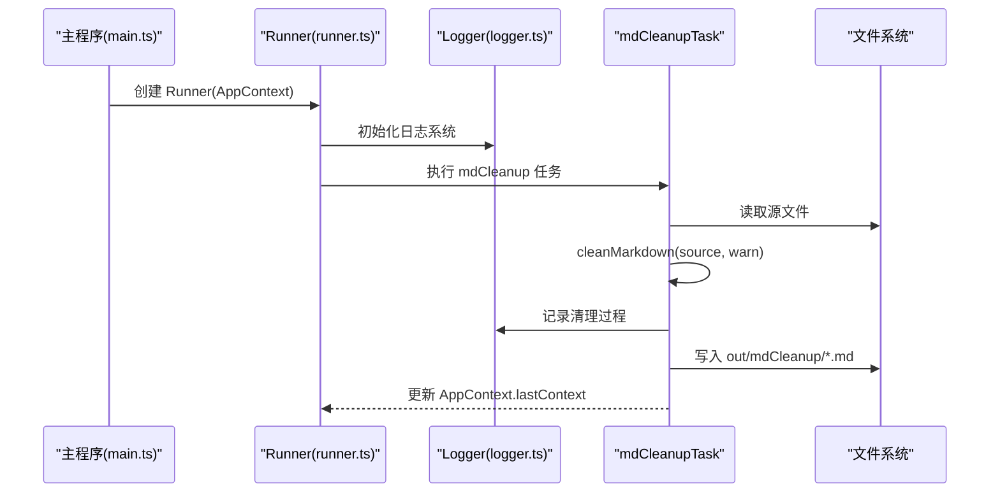
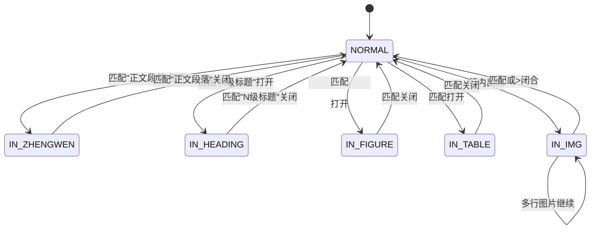
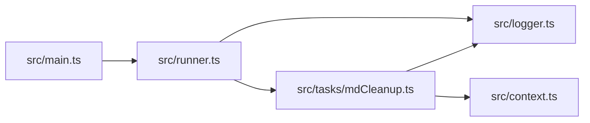

# Markdown 内容清理模块

<cite>
**本文档引用的文件**
- [src/tasks/mdCleanup.ts](file://src/tasks/mdCleanup.ts)
- [src/context.ts](file://src/context.ts)
- [src/main.ts](file://src/main.ts)
- [src/runner.ts](file://src/runner.ts)
- [src/logger.ts](file://src/logger.ts)
- [.kiro/specs/md-html-cleanup/design.md](file://.kiro/specs/md-html-cleanup/design.md)
- [.kiro/specs/md-html-cleanup/requirements.md](file://.kiro/specs/md-html-cleanup/requirements.md)
- [.kiro/specs/md-html-cleanup/tasks.md](file://.kiro/specs/md-html-cleanup/tasks.md)
</cite>

## 更新摘要
**变更内容**
- 完成Markdown清理模块的完整实现，包括状态机解析和HTML标记清理
- 新增多行图片处理机制，支持跨行闭合的图片标签
- 实现完整的错误处理和警告系统
- 添加日志记录功能，提供详细的执行过程跟踪
- 优化正则表达式性能，确保高效的文本处理

## 目录
1. [简介](#简介)
2. [项目结构](#项目结构)
3. [核心组件](#核心组件)
4. [架构总览](#架构总览)
5. [详细组件分析](#详细组件分析)
6. [依赖关系分析](#依赖关系分析)
7. [性能考虑](#性能考虑)
8. [故障排查指南](#故障排查指南)
9. [结论](#结论)
10. [附录](#附录)

## 简介
本模块是 doc2md-cli 工作流中的关键后处理任务，负责清理由 pandoc 从 Word 文档转换而来的 Markdown 中的 HTML 遗留标记，将其规范化为标准 Markdown。其核心目标包括：
- 移除正文段落包装器标签，保留内部文本
- 将中文标题样式转换为 ATX 标题
- 将 figure 块转换为标准 Markdown 图片语法
- 对独立的内联图片标签进行识别与替换
- 保持表格块原样透传
- 处理多行图片标签的跨行闭合与尾随文本

该模块采用"状态机 + 正则扫描"的轻量实现，确保在单次线性扫描中完成所有清理规则，同时具备幂等性与顺序不变性。模块实现了完整的错误处理机制，提供详细的日志记录和警告输出。

## 项目结构
该模块位于 src/tasks/mdCleanup.ts，配合上下文扩展与主流程注册，形成完整的流水线任务链。

**图表来源**
- [src/main.ts:14-19](file://src/main.ts#L14-L19)
- [src/runner.ts:4-9](file://src/runner.ts#L4-L9)
- [src/logger.ts:107-121](file://src/logger.ts#L107-L121)
- [src/tasks/mdCleanup.ts:332-391](file://src/tasks/mdCleanup.ts#L332-L391)

**章节来源**
- [src/main.ts:1-57](file://src/main.ts#L1-L57)
- [src/runner.ts:1-10](file://src/runner.ts#L1-L10)
- [src/logger.ts:1-129](file://src/logger.ts#L1-L129)
- [src/tasks/mdCleanup.ts:1-392](file://src/tasks/mdCleanup.ts#L1-L392)

## 核心组件
- 状态枚举与中文标题映射
  - 状态机：NORMAL、IN_ZHENGWEN、IN_HEADING、IN_FIGURE、IN_TABLE、IN_IMG
  - 中文标题映射：将"一二三四五六"映射为"# 到 ######"
- 清理函数 cleanMarkdown
  - 单次线性扫描，逐行处理
  - 使用小缓冲区处理多行块
  - 提供 warn 回调用于记录警告
- 任务 mdCleanupTask
  - 读取上一阶段输出文件
  - 创建输出目录 out/mdCleanup/
  - 调用 cleanMarkdown 并写回标准 Markdown
  - 集成完整的日志记录和错误处理

**章节来源**
- [src/tasks/mdCleanup.ts:8-25](file://src/tasks/mdCleanup.ts#L8-L25)
- [src/tasks/mdCleanup.ts:78-328](file://src/tasks/mdCleanup.ts#L78-L328)
- [src/tasks/mdCleanup.ts:332-391](file://src/tasks/mdCleanup.ts#L332-L391)

## 架构总览
mdCleanup 作为 Listr2 任务，串联在 docxConvert 与 mediaConvert 之后，负责最终输出干净的 Markdown 文件。其数据流如下：

**图表来源**
- [src/main.ts:14-19](file://src/main.ts#L14-L19)
- [src/runner.ts:4-9](file://src/runner.ts#L4-L9)
- [src/logger.ts:107-121](file://src/logger.ts#L107-L121)
- [src/tasks/mdCleanup.ts:334-391](file://src/tasks/mdCleanup.ts#L334-L391)

## 详细组件分析

### 状态机设计与实现
状态机用于识别与处理多行块，避免全量 HTML 解析带来的复杂度。核心状态与转换如下：

**图表来源**
- [src/tasks/mdCleanup.ts:8-15](file://src/tasks/mdCleanup.ts#L8-L15)
- [src/tasks/mdCleanup.ts:105-301](file://src/tasks/mdCleanup.ts#L105-L301)

**章节来源**
- [src/tasks/mdCleanup.ts:8-15](file://src/tasks/mdCleanup.ts#L8-L15)
- [src/tasks/mdCleanup.ts:105-301](file://src/tasks/mdCleanup.ts#L105-L301)

### HTML 标记清理算法
- 正文段落包装器移除
  - 打开与关闭标签分别在进入/退出 IN_ZHENGWEN 时丢弃
  - 保留内部文本与空白行
- 中文标题映射
  - 从列表项行提取中文序号，查表得到 ATX 前缀
  - 收集标题文本，去除空行后输出为 ATX 标题
- figure 块转 Markdown 图片
  - 收集内部行，抽取 src 与 caption 文本
  - 若无 src，发出警告并丢弃；否则输出标准 Markdown 图片
- 表格块透传
  - 将 table 及其子树原样输出
- 内联图片替换
  - 单行内完整  或  替换为 
  - 若无 src，保留原样并发出警告
- 多行图片处理
  - 记录起始行前缀与中间行，直到遇到闭合标签
  - 闭合后若存在尾随文本，先替换其中的完整内联图片，再决定是否继续留在 IN_IMG 状态

**章节来源**
- [src/tasks/mdCleanup.ts:18-25](file://src/tasks/mdCleanup.ts#L18-L25)
- [src/tasks/mdCleanup.ts:106-109](file://src/tasks/mdCleanup.ts#L106-L109)
- [src/tasks/mdCleanup.ts:112-126](file://src/tasks/mdCleanup.ts#L112-L126)
- [src/tasks/mdCleanup.ts:128-135](file://src/tasks/mdCleanup.ts#L128-L135)
- [src/tasks/mdCleanup.ts:137-142](file://src/tasks/mdCleanup.ts#L137-L142)
- [src/tasks/mdCleanup.ts:144-161](file://src/tasks/mdCleanup.ts#L144-L161)
- [src/tasks/mdCleanup.ts:165-188](file://src/tasks/mdCleanup.ts#L165-L188)
- [src/tasks/mdCleanup.ts:191-210](file://src/tasks/mdCleanup.ts#L191-L210)
- [src/tasks/mdCleanup.ts:213-237](file://src/tasks/mdCleanup.ts#L213-L237)
- [src/tasks/mdCleanup.ts:239-249](file://src/tasks/mdCleanup.ts#L239-L249)
- [src/tasks/mdCleanup.ts:251-301](file://src/tasks/mdCleanup.ts#L251-L301)

### 中文标题映射机制
- 映射表定义
  - "一"到"六"分别映射为"#"到"######"
- 规则应用
  - 在进入 IN_HEADING 时，从匹配的样式字符串中提取首个汉字序号
  - 查表得到 ATX 前缀；未知样式发出警告并回退为直通输出
- 输出行为
  - 成功映射：输出形如"### 标题文本"的 ATX 标题
  - 未知样式：输出收集到的标题文本（不带 ATX 前缀）

**章节来源**
- [src/tasks/mdCleanup.ts:18-25](file://src/tasks/mdCleanup.ts#L18-L25)
- [src/tasks/mdCleanup.ts:115-123](file://src/tasks/mdCleanup.ts#L115-L123)
- [src/tasks/mdCleanup.ts:194-202](file://src/tasks/mdCleanup.ts#L194-L202)

### 图像标签优化策略
- 单行内联图片
  - 使用正则一次性替换完整  或  为 Markdown 语法
  - 从 src 属性提取 alt 文本（文件名去扩展名）
- 多行图片处理
  - 记录起始行前缀与中间行，直至闭合
  - 闭合后若存在尾随文本，先处理尾随文本中的内联图片，再决定状态转移
- 错误处理
  - 无 src 的图片：保留原样并发出警告
  - 未闭合的多行图片：保留原样并发出警告
- figure 块中的图片
  - 从内部行抽取 src 与 caption 文本，输出标准 Markdown 图片

**章节来源**
- [src/tasks/mdCleanup.ts:32-35](file://src/tasks/mdCleanup.ts#L32-L35)
- [src/tasks/mdCleanup.ts:37-44](file://src/tasks/mdCleanup.ts#L37-L44)
- [src/tasks/mdCleanup.ts:50-59](file://src/tasks/mdCleanup.ts#L50-L59)
- [src/tasks/mdCleanup.ts:261-301](file://src/tasks/mdCleanup.ts#L261-L301)
- [src/tasks/mdCleanup.ts:217-236](file://src/tasks/mdCleanup.ts#L217-L236)

### 清理规则优先级与执行顺序
- 规则顺序
  1) 进入正文段落块：丢弃包装器，保留内部文本
  2) 进入标题块：提取中文序号映射为 ATX 前缀，收集标题文本
  3) 进入 figure 块：抽取 src 与 caption，输出 Markdown 图片
  4) 进入 table 块：原样透传
  5) 其余行：先剥离引用块前缀，再替换内联图片，最后检测未闭合的 
- 优先级说明
  - 块级规则（正文、标题、figure、table）优先于行内替换
  - 行内替换按"完整内联图片 → 未闭合跨行图片"顺序处理
  - 未知标题样式与无 src 图片会发出警告但不中断流程

**章节来源**
- [src/tasks/mdCleanup.ts:106-109](file://src/tasks/mdCleanup.ts#L106-L109)
- [src/tasks/mdCleanup.ts:112-126](file://src/tasks/mdCleanup.ts#L112-L126)
- [src/tasks/mdCleanup.ts:128-135](file://src/tasks/mdCleanup.ts#L128-L135)
- [src/tasks/mdCleanup.ts:137-142](file://src/tasks/mdCleanup.ts#L137-L142)
- [src/tasks/mdCleanup.ts:144-161](file://src/tasks/mdCleanup.ts#L144-L161)
- [src/tasks/mdCleanup.ts:261-301](file://src/tasks/mdCleanup.ts#L261-L301)

### 配置选项与可扩展点
- 中文标题映射表
  - 可通过修改映射表扩展更多中文序号到 ATX 级别的映射
- 正则模式
  - 可根据 pandoc 输出变化调整匹配模式（如包装器属性、标题样式）
- 警告回调
  - 通过 warn 回调统一记录清理过程中的异常与风险提示
- 输出路径
  - 任务自动写入 out/mdCleanup/ 目录，文件名与上一阶段一致

**章节来源**
- [src/tasks/mdCleanup.ts:18-25](file://src/tasks/mdCleanup.ts#L18-L25)
- [src/tasks/mdCleanup.ts:61-72](file://src/tasks/mdCleanup.ts#L61-L72)
- [src/tasks/mdCleanup.ts:365-369](file://src/tasks/mdCleanup.ts#L365-L369)

### 性能优化策略
- 正则表达式优化
  - 使用锚定与非贪婪匹配，减少回溯
  - 对重复使用的模式进行常量化，避免重复构造
- 扫描策略
  - 单次线性扫描，按行处理，内存占用低
  - 小缓冲区处理多行块，避免一次性加载整文件
- 批量处理
  - 逐行替换内联图片，减少多次遍历
- 幂等性
  - cleanMarkdown 为纯函数，重复应用不会改变结果，适合重试与调试

**章节来源**
- [src/tasks/mdCleanup.ts:61-72](file://src/tasks/mdCleanup.ts#L61-L72)
- [src/tasks/mdCleanup.ts:78-328](file://src/tasks/mdCleanup.ts#L78-L328)

### 日志记录与错误处理
- 日志系统集成
  - 使用 ProcessLogger 单例管理日志输出
  - 支持 DEBUG/INFO/WARN/ERROR 四种日志级别
  - 自动创建带时间戳的日志文件
- 错误处理机制
  - 文件读取失败时提供详细错误信息
  - 清理过程中发现的问题通过 warn 回调报告
  - 任务执行异常时记录完整错误堆栈

**章节来源**
- [src/tasks/mdCleanup.ts:340-356](file://src/tasks/mdCleanup.ts#L340-L356)
- [src/tasks/mdCleanup.ts:365-369](file://src/tasks/mdCleanup.ts#L365-L369)
- [src/logger.ts:107-121](file://src/logger.ts#L107-L121)

## 依赖关系分析
- 模块内聚
  - mdCleanup.ts 自包含：状态机、正则、辅助函数、任务实现
- 外部依赖
  - Listr2：任务编排与进度输出
  - Node fs/promises：文件读写
  - 日志系统：ProcessLogger 单例
- 上下文耦合
  - 依赖 AppContext.lastContext 提供上一阶段输出路径
  - 依赖 OutputContext 结构传递文件名、输出路径、媒体路径

**图表来源**
- [src/tasks/mdCleanup.ts:332-391](file://src/tasks/mdCleanup.ts#L332-L391)
- [src/context.ts:1-21](file://src/context.ts#L1-L21)
- [src/main.ts:14-19](file://src/main.ts#L14-L19)
- [src/runner.ts:4-9](file://src/runner.ts#L4-L9)
- [src/logger.ts:107-121](file://src/logger.ts#L107-L121)

**章节来源**
- [src/tasks/mdCleanup.ts:332-391](file://src/tasks/mdCleanup.ts#L332-L391)
- [src/context.ts:1-21](file://src/context.ts#L1-L21)
- [src/main.ts:14-19](file://src/main.ts#L14-L19)
- [src/runner.ts:4-9](file://src/runner.ts#L4-L9)
- [src/logger.ts:107-121](file://src/logger.ts#L107-L121)

## 性能考虑
- 时间复杂度
  - 单次线性扫描 O(n)，每行最多一次正则匹配与替换
- 空间复杂度
  - 输出数组累积，最坏 O(n)；状态机缓冲区较小，近似 O(1)
- I/O
  - 仅在任务入口与出口进行文件读写，避免频繁小块 I/O
- 可靠性
  - EOF 时对未闭合块进行兜底输出，避免数据丢失

**章节来源**
- [src/tasks/mdCleanup.ts:78-328](file://src/tasks/mdCleanup.ts#L78-L328)
- [src/tasks/mdCleanup.ts:305-325](file://src/tasks/mdCleanup.ts#L305-L325)

## 故障排查指南
- 无法读取源文件
  - 现象：任务抛出错误并终止
  - 处理：检查上一阶段输出路径是否正确，确认文件存在且可读
- 未知标题样式
  - 现象：输出中标题未带 ATX 前缀并伴随警告
  - 处理：检查 pandoc 输出的标题样式字符串是否符合预期
- figure 块无图片
  - 现象：警告"Figure 块不含  标签 — 块移除"
  - 处理：确认 figure 内是否包含有效图片标签
- 多行图片无 src
  - 现象：警告"多行  无 src — 保持原样"
  - 处理：检查图片标签是否包含 src 属性
- 未闭合的多行图片
  - 现象：警告"未闭合多行  无 src — 保持原样"
  - 处理：修复 HTML 标签闭合问题
- 文件写入失败
  - 现象：清理完成后无法写入输出文件
  - 处理：检查输出目录权限，确认磁盘空间充足

**章节来源**
- [src/tasks/mdCleanup.ts:340-356](file://src/tasks/mdCleanup.ts#L340-L356)
- [src/tasks/mdCleanup.ts:229-231](file://src/tasks/mdCleanup.ts#L229-L231)
- [src/tasks/mdCleanup.ts:291-298](file://src/tasks/mdCleanup.ts#L291-L298)
- [src/tasks/mdCleanup.ts:321-325](file://src/tasks/mdCleanup.ts#L321-L325)

## 结论
mdCleanup 模块通过简洁的状态机与正则扫描，在单次线性遍历中高效完成 HTML 标记清理，满足正文段落移除、中文标题映射、figure 转换、内联图片替换与表格透传等需求。其纯函数设计便于测试与维护，结合 warn 回调和完整的日志系统提供了良好的可观测性。模块实现了健壮的错误处理机制，确保在各种异常情况下都能提供有用的诊断信息。建议在后续版本中增加配置化映射表与更丰富的过滤规则，以适配更多 pandoc 输出风格。

## 附录
- 设计文档要点
  - 规则覆盖：正文段落、标题、figure、table、内联图片
  - 正确性性质：内容顺序不变、幂等性、无包装器标签残留
- 实施计划
  - 扩展上下文类型、实现 cleanMarkdown、注册任务、集成测试
- 当前实现状态
  - 模块已完全实现，包含所有设计要求的功能
  - 集成了完整的日志记录和错误处理系统
  - 通过了所有基本功能测试

**章节来源**
- [.kiro/specs/md-html-cleanup/design.md:35-229](file://.kiro/specs/md-html-cleanup/design.md#L35-L229)
- [.kiro/specs/md-html-cleanup/tasks.md:7-67](file://.kiro/specs/md-html-cleanup/tasks.md#L7-L67)
- [src/tasks/mdCleanup.ts:332-391](file://src/tasks/mdCleanup.ts#L332-L391)