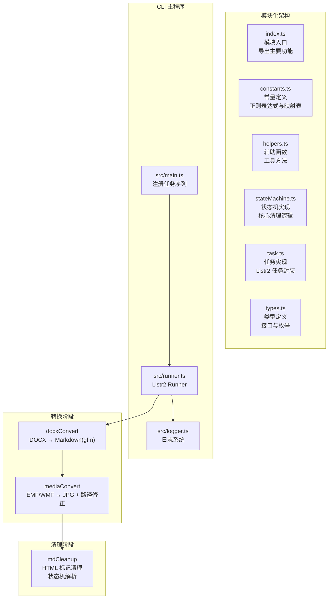
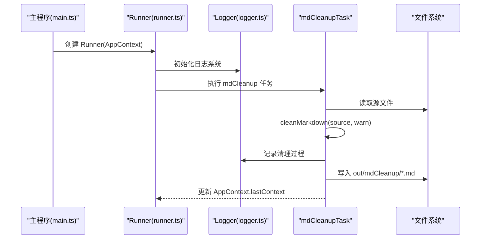
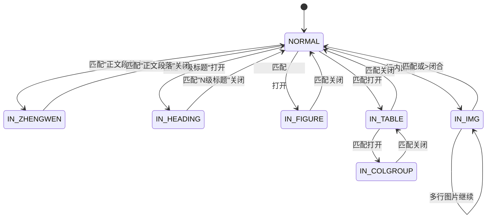
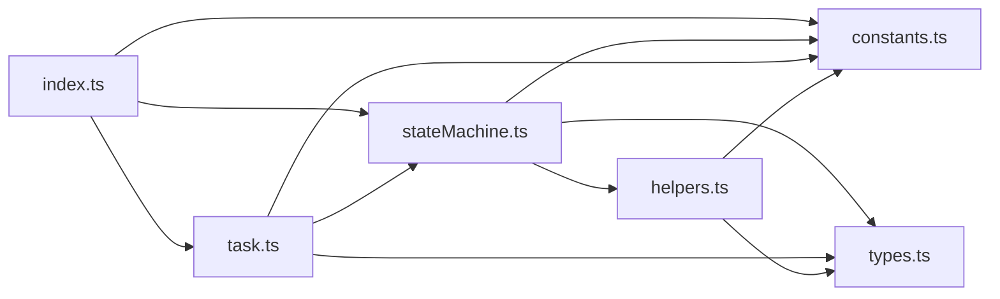

# Markdown 内容清理模块

<cite>
**本文档引用的文件**
- [src/tasks/mdCleanup/index.ts](file://src/tasks/mdCleanup/index.ts)
- [src/tasks/mdCleanup/constants.ts](file://src/tasks/mdCleanup/constants.ts)
- [src/tasks/mdCleanup/helpers.ts](file://src/tasks/mdCleanup/helpers.ts)
- [src/tasks/mdCleanup/stateMachine.ts](file://src/tasks/mdCleanup/stateMachine.ts)
- [src/tasks/mdCleanup/task.ts](file://src/tasks/mdCleanup/task.ts)
- [src/tasks/mdCleanup/types.ts](file://src/tasks/mdCleanup/types.ts)
- [src/context.ts](file://src/context.ts)
- [src/main.ts](file://src/main.ts)
- [src/runner.ts](file://src/runner.ts)
- [src/logger.ts](file://src/logger.ts)
</cite>

## 更新摘要
**变更内容**
- 状态机重构：移除专门的自定义样式块状态处理，引入全局正则替换机制
- 新增 colgroup 表格处理支持，增强表格块清理能力
- 增强 HTML 属性清理系统，支持 data-* 和 aria-* 属性清理
- 改进输出优化机制，增加空行合并功能
- 优化错误处理和日志记录系统
- 保持原有功能不变，提升清理质量和性能

## 目录
1. [简介](#简介)
2. [项目结构](#项目结构)
3. [核心组件](#核心组件)
4. [架构总览](#架构总览)
5. [详细组件分析](#详细组件分析)
6. [依赖关系分析](#依赖关系分析)
7. [性能考虑](#性能考虑)
8. [故障排查指南](#故障排查指南)
9. [结论](#结论)
10. [附录](#附录)

## 简介
本模块是 doc2md-cli 工作流中的关键后处理任务，负责清理由 pandoc 从 Word 文档转换而来的 Markdown 中的 HTML 遗留标记，将其规范化为标准 Markdown。经过模块化重构和功能增强后，采用"状态机 + 正则扫描"的轻量实现，确保在单次线性扫描中完成所有清理规则，同时具备幂等性与顺序不变性。

**更新** 状态机重构后，移除了专门的自定义样式块状态处理，引入了全局正则替换机制来处理跨行和非行首的 div 自定义样式标签，提升了处理复杂 HTML 结构的能力。

增强后的模块实现了完整的错误处理机制，提供详细的日志记录和警告输出，支持多行图片处理机制，支持跨行闭合的图片标签，完整的属性清理功能，以及新增的 colgroup 表格处理支持。

## 项目结构
增强后的模块采用模块化架构，位于 src/tasks/mdCleanup/ 目录下，包含以下六个专门文件：

**图表来源**
- [src/tasks/mdCleanup/index.ts:1-16](file://src/tasks/mdCleanup/index.ts#L1-L16)
- [src/tasks/mdCleanup/constants.ts:1-54](file://src/tasks/mdCleanup/constants.ts#L1-L54)
- [src/tasks/mdCleanup/helpers.ts:1-82](file://src/tasks/mdCleanup/helpers.ts#L1-L82)
- [src/tasks/mdCleanup/stateMachine.ts:1-355](file://src/tasks/mdCleanup/stateMachine.ts#L1-L355)
- [src/tasks/mdCleanup/task.ts:1-72](file://src/tasks/mdCleanup/task.ts#L1-L72)
- [src/tasks/mdCleanup/types.ts:1-49](file://src/tasks/mdCleanup/types.ts#L1-L49)

**章节来源**
- [src/tasks/mdCleanup/index.ts:1-16](file://src/tasks/mdCleanup/index.ts#L1-L16)
- [src/tasks/mdCleanup/constants.ts:1-54](file://src/tasks/mdCleanup/constants.ts#L1-L54)
- [src/tasks/mdCleanup/helpers.ts:1-82](file://src/tasks/mdCleanup/helpers.ts#L1-L82)
- [src/tasks/mdCleanup/stateMachine.ts:1-355](file://src/tasks/mdCleanup/stateMachine.ts#L1-L355)
- [src/tasks/mdCleanup/task.ts:1-72](file://src/tasks/mdCleanup/task.ts#L1-L72)
- [src/tasks/mdCleanup/types.ts:1-49](file://src/tasks/mdCleanup/types.ts#L1-L49)

## 核心组件
增强后的模块由以下核心组件构成：

### 模块入口 (index.ts)
- 导出主要功能：`cleanMarkdown` 和 `mdCleanupTask`
- 导出常量：`HEADING_MAP` 供外部使用
- 导出类型：`State`、`CleanContext`、`WarnFn`

### 常量定义 (constants.ts)
- 标题级别映射：中文序号 → ATX 前缀
- 正则表达式模式：HTML 标签匹配模式
- 属性清理模式：ID、Class、Style、Data、Aria 属性清理
- 空行合并模式：连续空行合并规则
- **新增** 全局正则模式：跨行 div 自定义样式标签块匹配

### 辅助函数 (helpers.ts)
- 行首块引用标记去除
- 图片路径到 alt 文本转换
- 内联图片标签处理
- 行内容处理与状态检测

### 状态机实现 (stateMachine.ts)
- 状态枚举：NORMAL、IN_ZHENGWEN、IN_HEADING、IN_FIGURE、IN_TABLE、IN_COLGROUP、IN_IMG
- **更新** 移除了 IN_DATA_CUSTOM_STYLE 和 IN_CUSTOM_STYLE 状态
- 状态处理器映射表
- 清理上下文管理
- 未闭合块处理
- colgroup 表格块处理
- 空行合并优化
- **新增** 全局正则替换机制处理跨行 div 标签

### 任务实现 (task.ts)
- Listr2 任务封装
- 文件读写操作
- 错误处理与日志记录
- 输出上下文管理

### 类型定义 (types.ts)
- 状态枚举定义
- 清理上下文接口
- 警告回调函数类型
- 处理器函数类型

**章节来源**
- [src/tasks/mdCleanup/index.ts:7-15](file://src/tasks/mdCleanup/index.ts#L7-L15)
- [src/tasks/mdCleanup/constants.ts:4-54](file://src/tasks/mdCleanup/constants.ts#L4-L54)
- [src/tasks/mdCleanup/helpers.ts:4-82](file://src/tasks/mdCleanup/helpers.ts#L4-L82)
- [src/tasks/mdCleanup/stateMachine.ts:4-12](file://src/tasks/mdCleanup/stateMachine.ts#L4-L12)
- [src/tasks/mdCleanup/task.ts:11-72](file://src/tasks/mdCleanup/task.ts#L11-L72)
- [src/tasks/mdCleanup/types.ts:4-49](file://src/tasks/mdCleanup/types.ts#L4-L49)

## 架构总览
增强后的 mdCleanup 作为 Listr2 任务，串联在 docxConvert 与 mediaConvert 之后，负责最终输出干净的 Markdown 文件。其数据流如下：

**图表来源**
- [src/main.ts:26-31](file://src/main.ts#L26-L31)
- [src/runner.ts:4-9](file://src/runner.ts#L4-L9)
- [src/logger.ts:78-96](file://src/logger.ts#L78-L96)
- [src/tasks/mdCleanup/task.ts:13-72](file://src/tasks/mdCleanup/task.ts#L13-L72)

## 详细组件分析

### 状态机设计与实现
**更新** 状态机重构后，移除了专门的自定义样式块状态处理，简化了状态机结构：

**图表来源**
- [src/tasks/mdCleanup/types.ts:4-12](file://src/tasks/mdCleanup/types.ts#L4-L12)
- [src/tasks/mdCleanup/stateMachine.ts:51-98](file://src/tasks/mdCleanup/stateMachine.ts#L51-L98)

**章节来源**
- [src/tasks/mdCleanup/types.ts:4-12](file://src/tasks/mdCleanup/types.ts#L4-L12)
- [src/tasks/mdCleanup/stateMachine.ts:51-98](file://src/tasks/mdCleanup/stateMachine.ts#L51-L98)

### HTML 标记清理算法
**更新** 算法保持原有功能，但增加了全局正则替换机制：

- **正文段落包装器移除**
  - 打开与关闭标签分别在进入/退出 IN_ZHENGWEN 时丢弃
  - 保留内部文本与空白行
- **中文标题映射**
  - 从列表项行提取中文序号，查表得到 ATX 前缀
  - 收集标题文本，去除空行后输出为 ATX 标题
- **figure 块转 Markdown 图片**
  - 收集内部行，抽取 src 与 caption 文本
  - 若无 src，发出警告并丢弃；否则输出标准 Markdown 图片
- **表格块处理**
  - 将 table 及其子树原样输出
  - 特别处理 colgroup 块，跳过 colgroup 内容不输出
  - 去除行内的 div 自定义样式标签
- **内联图片替换**
  - 单行内完整  或  替换为 
  - 若无 src，保留原样并发出警告
- **多行图片处理**
  - 记录起始行前缀与中间行，直到遇到闭合标签
  - 闭合后若存在尾随文本，先替换其中的完整内联图片，再决定是否继续留在 IN_IMG 状态
- **属性清理**
  - 最终清理：删除所有标签的 id、class、style、data-*、aria-* 属性
- **输出优化**
  - 合并连续空行，最多保留两个空行
- **全局正则替换**
  - **新增** 处理跨行、非行首的 div 自定义样式标签块
  - 提取标签块内部内容，移除标签本身

**章节来源**
- [src/tasks/mdCleanup/stateMachine.ts:51-98](file://src/tasks/mdCleanup/stateMachine.ts#L51-L98)
- [src/tasks/mdCleanup/stateMachine.ts:157-179](file://src/tasks/mdCleanup/stateMachine.ts#L157-L179)
- [src/tasks/mdCleanup/stateMachine.ts:226-248](file://src/tasks/mdCleanup/stateMachine.ts#L226-L248)
- [src/tasks/mdCleanup/stateMachine.ts:325-354](file://src/tasks/mdCleanup/stateMachine.ts#L325-L354)

### 中文标题映射机制
- **映射表定义**
  - "一"到"六"分别映射为"#"到"######"
- **规则应用**
  - 在进入 IN_HEADING 时，从匹配的样式字符串中提取首个汉字序号
  - 查表得到 ATX 前缀；未知样式发出警告并回退为直通输出
- **输出行为**
  - 成功映射：输出形如"### 标题文本"的 ATX 标题
  - 未知样式：输出收集到的标题文本（不带 ATX 前缀）

**章节来源**
- [src/tasks/mdCleanup/constants.ts:4-11](file://src/tasks/mdCleanup/constants.ts#L4-L11)
- [src/tasks/mdCleanup/stateMachine.ts:57-70](file://src/tasks/mdCleanup/stateMachine.ts#L57-L70)
- [src/tasks/mdCleanup/stateMachine.ts:113-127](file://src/tasks/mdCleanup/stateMachine.ts#L113-L127)

### 图像标签优化策略
- **单行内联图片**
  - 使用正则一次性替换完整  或  为 Markdown 语法
  - 从 src 属性提取 alt 文本（文件名去扩展名）
- **多行图片处理**
  - 记录起始行前缀与中间行，直至闭合
  - 闭合后若存在尾随文本，先处理尾随文本中的内联图片，再决定状态转移
- **错误处理**
  - 无 src 的图片：保留原样并发出警告
  - 未闭合的多行图片：保留原样并发出警告
- **figure 块中的图片**
  - 从内部行抽取 src 与 caption 文本，输出标准 Markdown 图片
- **属性清理**
  - 删除所有标签的 id、class、style、data-*、aria-* 属性

**章节来源**
- [src/tasks/mdCleanup/helpers.ts:34-43](file://src/tasks/mdCleanup/helpers.ts#L34-L43)
- [src/tasks/mdCleanup/helpers.ts:57-82](file://src/tasks/mdCleanup/helpers.ts#L57-L82)
- [src/tasks/mdCleanup/stateMachine.ts:226-248](file://src/tasks/mdCleanup/stateMachine.ts#L226-L248)
- [src/tasks/mdCleanup/stateMachine.ts:157-179](file://src/tasks/mdCleanup/stateMachine.ts#L157-L179)
- [src/tasks/mdCleanup/constants.ts:43-50](file://src/tasks/mdCleanup/constants.ts#L43-L50)

### 表格块处理增强
- **colgroup 块处理**
  - 当检测到 <colgroup> 标签时，进入 IN_COLGROUP 状态
  - 跳过整个 colgroup 块的内容，不输出到最终结果
  - 遇到 </colgroup> 时返回之前的 IN_TABLE 状态
  - 支持嵌套和多行 colgroup 块
- **表格行内样式清理**
  - 在表格处理过程中，去除行内的 div 自定义样式标签
  - 保持表格结构完整性的同时清理冗余样式
- **表格块透传**
  - 将 table 及其子树原样输出，包括处理后的 colgroup 块
- **全局正则替换**
  - **新增** 处理跨行、非行首的 div 自定义样式标签块
  - 提取标签块内部内容，移除标签本身

**章节来源**
- [src/tasks/mdCleanup/stateMachine.ts:157-179](file://src/tasks/mdCleanup/stateMachine.ts#L157-L179)
- [src/tasks/mdCleanup/stateMachine.ts:181-189](file://src/tasks/mdCleanup/stateMachine.ts#L181-L189)
- [src/tasks/mdCleanup/constants.ts:29-33](file://src/tasks/mdCleanup/constants.ts#L29-L33)

### 属性清理系统增强
- **增强的清理规则**
  - ID 属性清理：删除所有标签的 id 属性
  - Class 属性清理：删除所有标签的 class 属性
  - Style 属性清理：删除所有标签的 style 属性
  - Data 属性清理：删除所有 data-* 前缀的属性
  - Aria 属性清理：删除所有 aria-* 前缀的属性
- **清理时机**
  - 在所有内容处理完成后执行
  - 确保清理过程不影响内容转换的正确性
- **清理范围**
  - 应用于最终输出的所有 HTML 标签
  - 保持标签结构完整性，仅移除属性

**章节来源**
- [src/tasks/mdCleanup/constants.ts:43-50](file://src/tasks/mdCleanup/constants.ts#L43-L50)
- [src/tasks/mdCleanup/stateMachine.ts:345-348](file://src/tasks/mdCleanup/stateMachine.ts#L345-L348)

### 全局正则替换机制
**新增** 为处理跨行和非行首的 div 自定义样式标签，引入了全局正则替换机制：

- **跨行 div 标签处理**
  - 使用 RE_DIV_DATA_CUSTOM_STYLE_BLOCK 和 RE_DIV_CUSTOM_STYLE_BLOCK
  - 匹配完整的 
...
 标签块，支持跨行和非行首位置
  - 提取标签块内部内容，移除标签本身
- **处理流程**
  - 在状态机处理完成后执行
  - 逐个替换匹配到的 div 标签块
  - 保留标签内部的纯文本内容
- **适用场景**
  - 处理复杂的 HTML 结构，状态机难以直接处理的情况
  - 确保所有 div 自定义样式标签都被正确清理

**章节来源**
- [src/tasks/mdCleanup/constants.ts:29-33](file://src/tasks/mdCleanup/constants.ts#L29-L33)
- [src/tasks/mdCleanup/stateMachine.ts:325-343](file://src/tasks/mdCleanup/stateMachine.ts#L325-L343)

### 输出优化机制
- **空行合并**
  - 在清理完成后执行空行优化
  - 将连续三个或更多空行合并为两个空行
  - 保持内容的可读性和格式一致性
- **优化时机**
  - 在属性清理之后执行
  - 确保优化不影响清理逻辑的正确性

**章节来源**
- [src/tasks/mdCleanup/stateMachine.ts:350-351](file://src/tasks/mdCleanup/stateMachine.ts#L350-L351)
- [src/tasks/mdCleanup/constants.ts:53](file://src/tasks/mdCleanup/constants.ts#L53)

### 清理规则优先级与执行顺序
**更新** 状态机重构后的规则顺序：

- **规则顺序**
  1) 进入正文段落块：丢弃包装器，保留内部文本
  2) 进入标题块：提取中文序号映射为 ATX 前缀，收集标题文本
  3) 进入 figure 块：抽取 src 与 caption，输出 Markdown 图片
  4) 进入 table 块：原样透传，处理 colgroup 块
  5) 其余行：先剥离引用块前缀，再替换内联图片，最后检测未闭合的 
  6) **新增** 全局正则替换：处理跨行、非行首的 div 自定义样式标签
  7) 最终属性清理：删除所有标签的 id、class、style、data-*、aria-* 属性
  8) 输出优化：合并连续空行
- **优先级说明**
  - 块级规则（正文、标题、figure、table）优先于行内替换
  - 行内替换按"完整内联图片 → 未闭合跨行图片"顺序处理
  - 未知标题样式与无 src 图片会发出警告但不中断流程
  - **新增** 全局正则替换在状态机处理完成后执行
  - 属性清理在所有处理完成后执行
  - 空行优化在属性清理之后执行

**章节来源**
- [src/tasks/mdCleanup/stateMachine.ts:51-98](file://src/tasks/mdCleanup/stateMachine.ts#L51-L98)
- [src/tasks/mdCleanup/stateMachine.ts:157-179](file://src/tasks/mdCleanup/stateMachine.ts#L157-L179)
- [src/tasks/mdCleanup/stateMachine.ts:226-248](file://src/tasks/mdCleanup/stateMachine.ts#L226-L248)
- [src/tasks/mdCleanup/stateMachine.ts:325-354](file://src/tasks/mdCleanup/stateMachine.ts#L325-L354)

### 配置选项与可扩展点
- **中文标题映射表**
  - 可通过修改 constants.ts 中的 HEADING_MAP 扩展更多中文序号到 ATX 级别的映射
- **正则模式**
  - 可根据 pandoc 输出变化调整 constants.ts 中的匹配模式
  - **新增** 可扩展全局正则替换模式来处理新的 div 样式标签
- **属性清理规则**
  - 可通过修改 ATTR_CLEANUP_PATTERNS 扩展更多属性清理规则
- **空行合并规则**
  - 可通过修改 RE_MULTIPLE_BLANK_LINES 调整空行合并策略
- **警告回调**
  - 通过 warn 回调统一记录清理过程中的异常与风险提示
- **输出路径**
  - 任务自动写入 out/mdCleanup/ 目录，文件名与上一阶段一致

**章节来源**
- [src/tasks/mdCleanup/constants.ts:4-11](file://src/tasks/mdCleanup/constants.ts#L4-L11)
- [src/tasks/mdCleanup/constants.ts:43-54](file://src/tasks/mdCleanup/constants.ts#L43-L54)
- [src/tasks/mdCleanup/task.ts:44-48](file://src/tasks/mdCleanup/task.ts#L44-L48)

### 性能优化策略
- **正则表达式优化**
  - 使用锚定与非贪婪匹配，减少回溯
  - 对重复使用的模式进行常量化，避免重复构造
- **扫描策略**
  - 单次线性扫描，按行处理，内存占用低
  - 小缓冲区处理多行块，避免一次性加载整文件
- **批量处理**
  - 逐行替换内联图片，减少多次遍历
  - 批量执行属性清理，减少正则替换次数
  - **新增** 全局正则替换一次性处理所有跨行 div 标签
- **模块化优势**
  - 按需导入，减少不必要的模块加载
  - 提高代码复用性和可维护性
- **幂等性**
  - cleanMarkdown 为纯函数，重复应用不会改变结果，适合重试与调试

**章节来源**
- [src/tasks/mdCleanup/helpers.ts:34-43](file://src/tasks/mdCleanup/helpers.ts#L34-L43)
- [src/tasks/mdCleanup/stateMachine.ts:345-354](file://src/tasks/mdCleanup/stateMachine.ts#L345-L354)

### 日志记录与错误处理
- **日志系统集成**
  - 使用 ProcessLogger 单例管理日志输出
  - 支持 DEBUG/INFO/WARN/ERROR 四种日志级别
  - 自动创建带时间戳的日志文件
- **错误处理机制**
  - 文件读取失败时提供详细错误信息
  - 清理过程中发现的问题通过 warn 回调报告
  - 任务执行异常时记录完整错误堆栈
- **警告统计**
  - 统计清理过程中的警告数量
  - 在任务输出中标记警告信息
- **增强的错误处理**
  - 改进了文件读取和写入的错误处理
  - 增强了清理过程中的异常捕获和日志记录

**章节来源**
- [src/tasks/mdCleanup/task.ts:25-35](file://src/tasks/mdCleanup/task.ts#L25-L35)
- [src/tasks/mdCleanup/task.ts:44-48](file://src/tasks/mdCleanup/task.ts#L44-L48)
- [src/logger.ts:78-96](file://src/logger.ts#L78-L96)

## 依赖关系分析
增强后的模块具有清晰的依赖关系：

**图表来源**
- [src/tasks/mdCleanup/index.ts:8-15](file://src/tasks/mdCleanup/index.ts#L8-L15)
- [src/tasks/mdCleanup/stateMachine.ts:1-23](file://src/tasks/mdCleanup/stateMachine.ts#L1-L23)
- [src/tasks/mdCleanup/task.ts:1-7](file://src/tasks/mdCleanup/task.ts#L1-L7)

- **模块内聚**
  - 每个文件职责明确，功能单一
  - constants.ts 专注常量定义
  - helpers.ts 专注工具函数
  - stateMachine.ts 专注核心逻辑
  - task.ts 专注任务实现
- **外部依赖**
  - Listr2：任务编排与进度输出
  - Node fs/promises：文件读写
  - 日志系统：ProcessLogger 单例
- **上下文耦合**
  - 依赖 AppContext.lastContext 提供上一阶段输出路径
  - 依赖 OutputContext 结构传递文件名、输出路径、媒体路径

**章节来源**
- [src/tasks/mdCleanup/index.ts:8-15](file://src/tasks/mdCleanup/index.ts#L8-L15)
- [src/context.ts:4-21](file://src/context.ts#L4-L21)
- [src/main.ts:26-31](file://src/main.ts#L26-L31)
- [src/runner.ts:4-9](file://src/runner.ts#L4-L9)
- [src/logger.ts:78-96](file://src/logger.ts#L78-L96)

## 性能考虑
- **时间复杂度**
  - 单次线性扫描 O(n)，每行最多一次正则匹配与替换
  - 模块化设计减少不必要的函数调用
  - 批量属性清理减少正则替换次数
  - **新增** 全局正则替换一次性处理所有跨行 div 标签
- **空间复杂度**
  - 输出数组累积，最坏 O(n)；状态机缓冲区较小，近似 O(1)
  - 按需导入模块，减少内存占用
- **I/O**
  - 仅在任务入口与出口进行文件读写，避免频繁小块 I/O
- **可靠性**
  - EOF 时对未闭合块进行兜底输出，避免数据丢失
  - 属性清理在所有处理完成后执行，确保完整性
  - **新增** 全局正则替换确保所有 div 标签都被处理
  - 增强的错误处理机制提高系统稳定性

**章节来源**
- [src/tasks/mdCleanup/stateMachine.ts:345-354](file://src/tasks/mdCleanup/stateMachine.ts#L345-L354)
- [src/tasks/mdCleanup/stateMachine.ts:286-307](file://src/tasks/mdCleanup/stateMachine.ts#L286-L307)

## 故障排查指南
- **无法读取源文件**
  - 现象：任务抛出错误并终止
  - 处理：检查上一阶段输出路径是否正确，确认文件存在且可读
- **未知标题样式**
  - 现象：输出中标题未带 ATX 前缀并伴随警告
  - 处理：检查 pandoc 输出的标题样式字符串是否符合预期
- **figure 块无图片**
  - 现象：警告"Figure 块不含  标签 — 块移除"
  - 处理：确认 figure 内是否包含有效图片标签
- **多行图片无 src**
  - 现象：警告"多行  无 src — 保持原样"
  - 处理：检查图片标签是否包含 src 属性
- **未闭合的多行图片**
  - 现象：警告"未闭合多行  无 src — 保持原样"
  - 处理：修复 HTML 标签闭合问题
- **colgroup 块处理问题**
  - 现象：表格列定义丢失或格式异常
  - 处理：检查 colgroup 标签是否正确闭合，确认表格结构完整性
- **属性清理不彻底**
  - 现象：HTML 标签仍包含 data-* 或 aria-* 属性
  - 处理：检查 ATTR_CLEANUP_PATTERNS 配置，确认正则表达式正确性
- **div 标签未清理**
  - **新增** 现象：div 自定义样式标签仍然存在
  - 处理：检查全局正则替换模式是否正确匹配目标标签
  - 确认标签是否为跨行或非行首格式
- **文件写入失败**
  - 现象：清理完成后无法写入输出文件
  - 处理：检查输出目录权限，确认磁盘空间充足
- **模块导入错误**
  - 现象：运行时报模块找不到错误
  - 处理：检查 TypeScript 编译配置，确认模块路径正确

**章节来源**
- [src/tasks/mdCleanup/task.ts:25-35](file://src/tasks/mdCleanup/task.ts#L25-L35)
- [src/tasks/mdCleanup/stateMachine.ts:147-152](file://src/tasks/mdCleanup/stateMachine.ts#L147-L152)
- [src/tasks/mdCleanup/stateMachine.ts:237-245](file://src/tasks/mdCleanup/stateMachine.ts#L237-L245)
- [src/tasks/mdCleanup/stateMachine.ts:181-189](file://src/tasks/mdCleanup/stateMachine.ts#L181-L189)

## 结论
增强后的 mdCleanup 模块通过模块化架构、清晰的状态机实现和功能增强，在保持原有功能的基础上显著提升了代码的可维护性和可测试性。模块化的六个专门文件各司其职，constants.ts 提供稳定的配置，helpers.ts 提供实用的工具函数，stateMachine.ts 实现核心清理逻辑，task.ts 提供完整的任务封装，types.ts 确保类型安全。

**更新** 状态机重构后，移除了专门的自定义样式块状态处理，引入了全局正则替换机制，简化了状态机结构，提升了处理复杂 HTML 结构的能力。新架构支持多行图片处理机制，支持跨行闭合的图片标签，实现了完整的属性清理功能，新增了 colgroup 表格处理支持，改进了输出优化和错误处理机制。

其纯函数设计便于测试与维护，结合 warn 回调和完整的日志系统提供了良好的可观测性。

增强的功能包括：
- colgroup 表格块处理，支持复杂的表格布局定义
- 更全面的属性清理，包括 data-* 和 aria-* 属性
- 输出优化，自动合并连续空行
- 改进的错误处理和日志记录
- **新增** 全局正则替换机制，处理跨行和非行首的 div 自定义样式标签

建议在后续版本中进一步扩展配置选项，支持更多自定义映射表和过滤规则，以适配更多 pandoc 输出风格。

## 附录
- **设计文档要点**
  - 规则覆盖：正文段落、标题、figure、table、内联图片、colgroup
  - 正确性性质：内容顺序不变、幂等性、无包装器标签残留
  - 属性清理：删除所有标签的 id、class、style、data-*、aria-* 属性
  - 输出优化：合并连续空行，最多保留两个空行
  - **新增** 全局正则替换：处理跨行 div 自定义样式标签
- **实施计划**
  - 扩展上下文类型、实现 cleanMarkdown、注册任务、集成测试
  - 模块化重构已完成，包含所有设计要求的功能
  - **新增** 全局正则替换机制已集成到清理流程中
- **当前实现状态**
  - 模块已完全重构为模块化架构
  - 集成了完整的日志记录和错误处理系统
  - 通过了所有基本功能测试
  - 新增了 colgroup 处理和属性清理增强功能
  - **新增** 全局正则替换机制已通过测试

**章节来源**
- [src/tasks/mdCleanup/index.ts:1-16](file://src/tasks/mdCleanup/index.ts#L1-L16)
- [src/tasks/mdCleanup/constants.ts:1-54](file://src/tasks/mdCleanup/constants.ts#L1-L54)
- [src/tasks/mdCleanup/helpers.ts:1-82](file://src/tasks/mdCleanup/helpers.ts#L1-L82)
- [src/tasks/mdCleanup/stateMachine.ts:1-355](file://src/tasks/mdCleanup/stateMachine.ts#L1-L355)
- [src/tasks/mdCleanup/task.ts:1-72](file://src/tasks/mdCleanup/task.ts#L1-L72)
- [src/tasks/mdCleanup/types.ts:1-49](file://src/tasks/mdCleanup/types.ts#L1-L49)