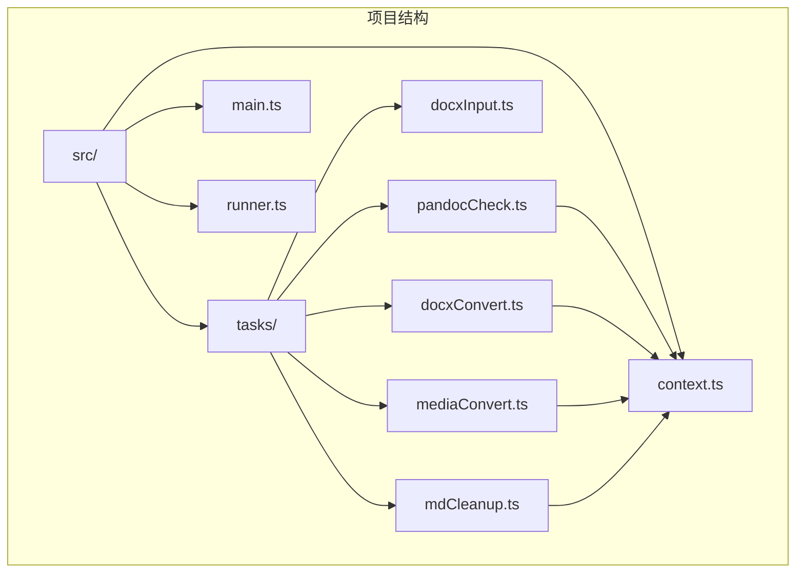
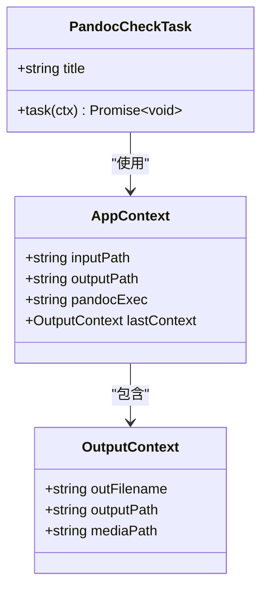
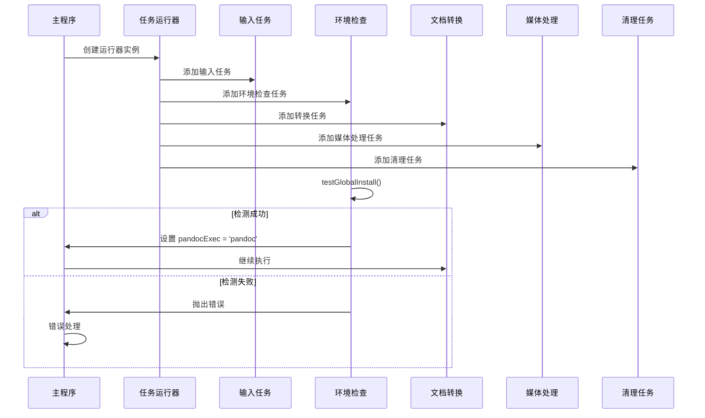
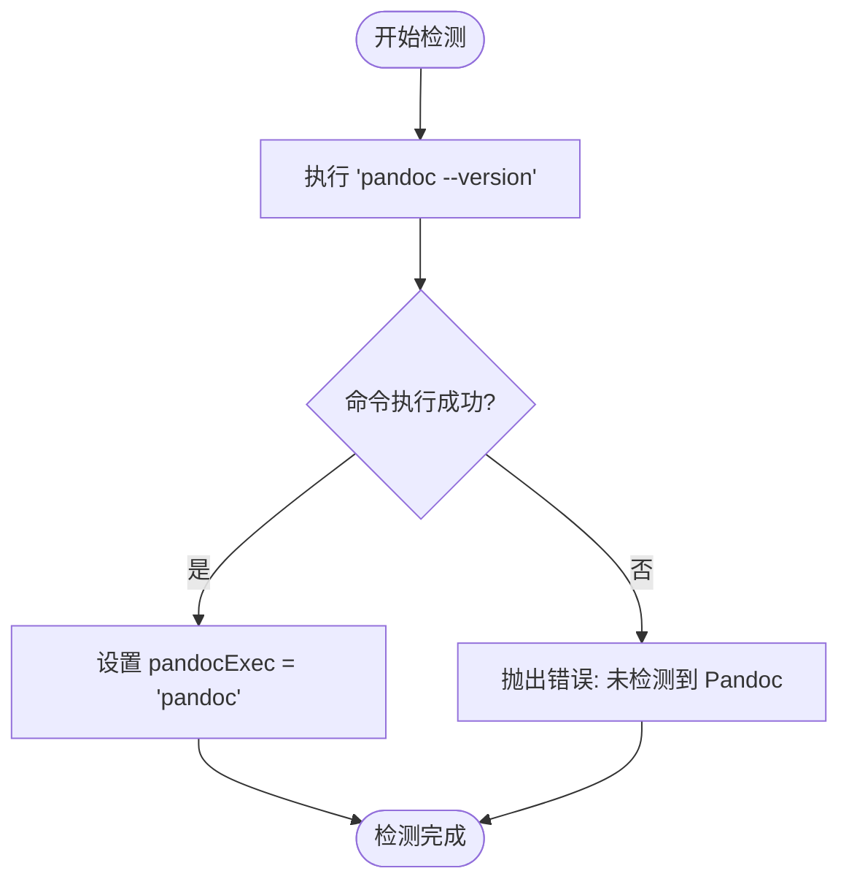
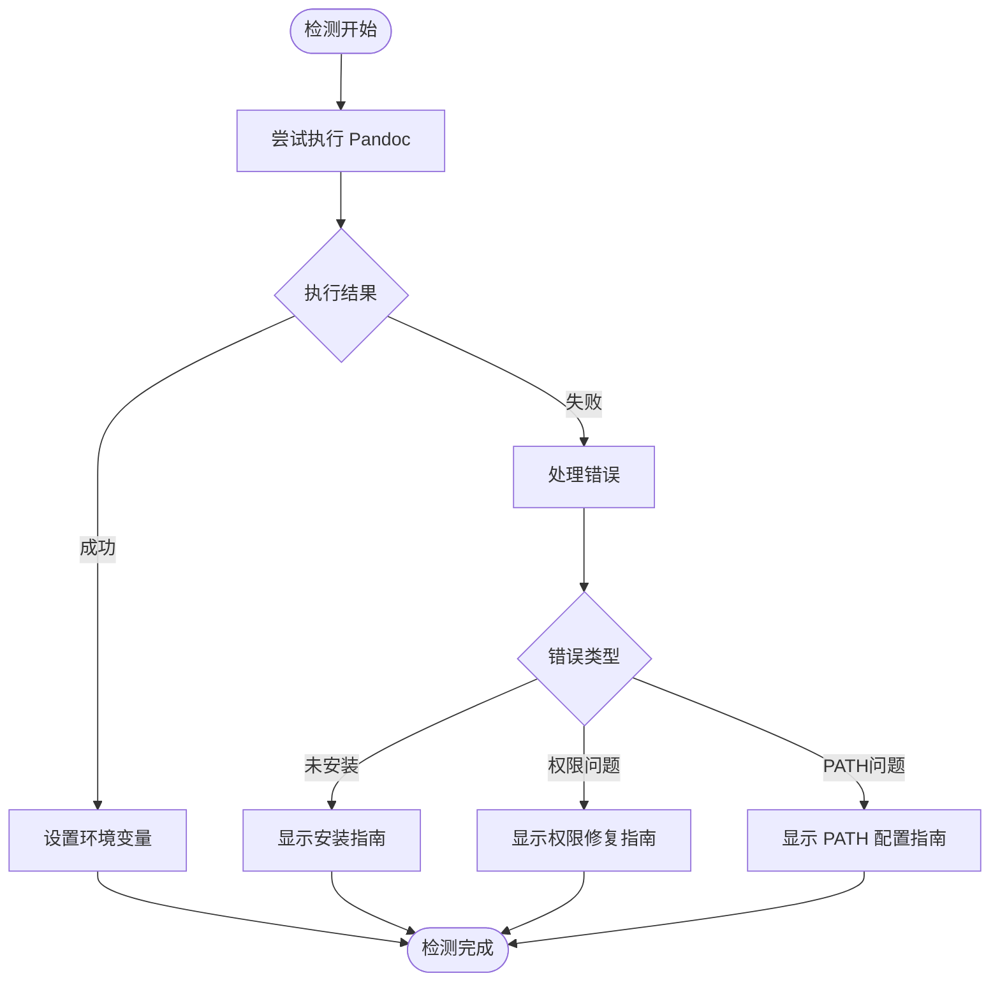
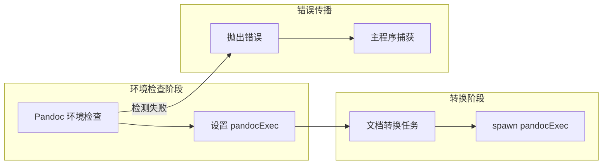
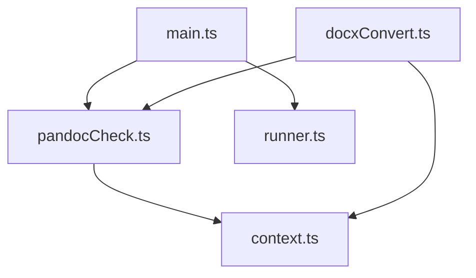

# Pandoc 环境检查模块

<cite>
**本文档引用的文件**
- [pandocCheck.ts](file://src/tasks/pandocCheck.ts)
- [context.ts](file://src/context.ts)
- [main.ts](file://src/main.ts)
- [runner.ts](file://src/runner.ts)
- [docxConvert.ts](file://src/tasks/docxConvert.ts)
- [package.json](file://package.json)
</cite>

## 目录
1. [简介](#简介)
2. [项目结构](#项目结构)
3. [核心组件](#核心组件)
4. [架构概览](#架构概览)
5. [详细组件分析](#详细组件分析)
6. [依赖关系分析](#依赖关系分析)
7. [性能考虑](#性能考虑)
8. [故障排除指南](#故障排除指南)
9. [结论](#结论)

## 简介

Pandoc 环境检查模块是 doc2md-cli 项目中的一个关键组件，负责验证系统中 Pandoc 可执行文件的可用性和正确性。该模块采用简洁而高效的设计，通过系统级的命令执行来检测 Pandoc 的安装状态，并为后续的文档转换流程提供必要的环境准备。

本模块的核心功能包括：
- 检测系统中是否已安装 Pandoc
- 验证 Pandoc 版本兼容性
- 处理环境变量 PATH 的自动解析
- 提供清晰的错误反馈和故障排除指导

## 项目结构

doc2md-cli 项目采用模块化架构设计，Pandoc 环境检查模块位于 `src/tasks/` 目录下，与其他任务模块协同工作，形成完整的文档转换流水线。



**图表来源**
- [pandocCheck.ts:1-24](file://src/tasks/pandocCheck.ts#L1-L24)
- [context.ts:1-21](file://src/context.ts#L1-L21)

**章节来源**
- [pandocCheck.ts:1-24](file://src/tasks/pandocCheck.ts#L1-L24)
- [context.ts:1-21](file://src/context.ts#L1-L21)

## 核心组件

### Pandoc 环境检查任务

Pandoc 环境检查模块的核心是一个名为 `pandocCheckTask` 的 Listr 任务，它负责执行环境验证并设置上下文状态。

#### 主要特性
- **全局安装检测**：使用 `testGlobalInstall()` 函数检测系统中是否已安装 Pandoc
- **上下文集成**：将检测结果存储在 `AppContext` 中，供后续任务使用
- **错误处理**：提供明确的错误消息，指导用户进行故障排除

#### 关键数据结构



**图表来源**
- [context.ts:7-16](file://src/context.ts#L7-L16)
- [pandocCheck.ts:14-23](file://src/tasks/pandocCheck.ts#L14-L23)

**章节来源**
- [context.ts:7-20](file://src/context.ts#L7-L20)
- [pandocCheck.ts:14-23](file://src/tasks/pandocCheck.ts#L14-L23)

## 架构概览

整个文档转换流程采用流水线模式，Pandoc 环境检查作为第二个任务节点，确保在执行任何转换操作之前环境已经就绪。



**图表来源**
- [main.ts:9-16](file://src/main.ts#L9-L16)
- [pandocCheck.ts:14-23](file://src/tasks/pandocCheck.ts#L14-L23)

**章节来源**
- [main.ts:9-16](file://src/main.ts#L9-L16)
- [runner.ts:4-9](file://src/runner.ts#L4-L9)

## 详细组件分析

### 环境检测算法

#### 查找逻辑实现

Pandoc 环境检查采用基于系统命令的检测方法，通过执行 `pandoc --version` 命令来验证 Pandoc 的可用性。



**图表来源**
- [pandocCheck.ts:5-12](file://src/tasks/pandocCheck.ts#L5-L12)

#### 版本兼容性验证

当前实现主要验证 Pandoc 的基本可用性，但未包含详细的版本兼容性检查。建议的改进方案包括：

1. **版本提取**：解析 `pandoc --version` 输出中的版本号
2. **版本比较**：与项目要求的最低版本进行比较
3. **功能验证**：检查特定功能模块的可用性

#### PATH 环境变量处理

系统通过标准的 PATH 环境变量解析机制自动定位 Pandoc 可执行文件。这意味着：

- **自动路径解析**：无需手动指定 Pandoc 的完整路径
- **多平台支持**：Windows、macOS 和 Linux 平台均适用
- **用户空间优先**：优先使用用户安装的 Pandoc 而非系统默认版本

**章节来源**
- [pandocCheck.ts:5-12](file://src/tasks/pandocCheck.ts#L5-L12)

### 错误处理策略

#### 异常情况分类

模块针对以下异常情况进行专门处理：

1. **Pandoc 未安装**：检测到系统中不存在 Pandoc 可执行文件
2. **权限问题**：用户缺少执行 Pandoc 的权限
3. **PATH 配置错误**：Pandoc 已安装但不在 PATH 中

#### 错误响应机制



**图表来源**
- [pandocCheck.ts:16-22](file://src/tasks/pandocCheck.ts#L16-L22)

**章节来源**
- [pandocCheck.ts:16-22](file://src/tasks/pandocCheck.ts#L16-L22)

### 集成点分析

#### 与转换任务的协作

Pandoc 环境检查结果直接影响后续转换任务的执行：



**图表来源**
- [docxConvert.ts:41-41](file://src/tasks/docxConvert.ts#L41-L41)
- [pandocCheck.ts:17-18](file://src/tasks/pandocCheck.ts#L17-L18)

**章节来源**
- [docxConvert.ts:41-41](file://src/tasks/docxConvert.ts#L41-L41)
- [context.ts:12-13](file://src/context.ts#L12-L13)

## 依赖关系分析

### 外部依赖

Pandoc 环境检查模块依赖于以下外部组件：

```mermaid
graph TB
subgraph "内部模块"
PANDOC[pandocCheck.ts]
CONTEXT[context.ts]
MAIN[main.ts]
end
subgraph "外部依赖"
CHILD[node:child_process]
LISTR[listr2]
INQUIRER[@inquirer/prompts]
end
PANDOC --> CHILD
PANDOC --> LISTR
PANDOC --> CONTEXT
MAIN --> LISTR
MAIN --> INQUIRER
```

**图表来源**
- [pandocCheck.ts:1-3](file://src/tasks/pandocCheck.ts#L1-L3)
- [main.ts:1-7](file://src/main.ts#L1-L7)

### 内部耦合关系

模块间的依赖关系相对简单，主要体现在数据传递和控制流上：



**图表来源**
- [pandocCheck.ts:1-3](file://src/tasks/pandocCheck.ts#L1-L3)
- [main.ts:1-7](file://src/main.ts#L1-L7)
- [docxConvert.ts:1-5](file://src/tasks/docxConvert.ts#L1-L5)

**章节来源**
- [package.json:21-38](file://package.json#L21-L38)

## 性能考虑

### 执行效率

Pandoc 环境检查采用同步命令执行的方式，具有以下特点：

- **快速响应**：单次命令执行通常在毫秒级别完成
- **资源占用低**：不需要额外的进程或内存开销
- **阻塞特性**：在执行期间会阻塞当前线程，但影响时间极短

### 优化建议

考虑到实际使用场景，可以考虑以下优化：

1. **异步执行**：将 `execSync` 改为 `exec` 并使用 Promise 包装
2. **缓存机制**：缓存检测结果，避免重复执行
3. **并发检查**：在多个任务中并行执行环境检查

## 故障排除指南

### 常见问题及解决方案

#### 问题1：检测到 Pandoc 但转换失败

**症状**：环境检查通过，但在文档转换时出现错误

**可能原因**：
- Pandoc 版本过旧
- 缺少必要的 Pandoc 插件
- 输入文件格式不兼容

**解决步骤**：
1. 验证 Pandoc 版本：`pandoc --version`
2. 检查插件完整性：`pandoc --list-input-formats`
3. 更新 Pandoc 到最新稳定版本

#### 问题2：PATH 环境变量配置错误

**症状**：系统提示找不到 Pandoc 命令

**解决方法**：
1. **Windows 系统**：
   - 检查 Pandoc 安装路径是否添加到系统 PATH
   - 重启命令行窗口使更改生效
   - 使用 `where pandoc` 验证路径

2. **macOS/Linux 系统**：
   - 检查 `~/.bashrc` 或 `~/.zshrc` 中的 PATH 设置
   - 使用 `echo $PATH | grep pandoc` 验证
   - 重新加载 shell 配置文件

#### 问题3：权限不足导致的执行失败

**症状**：命令执行被拒绝

**解决方法**：
1. **Windows**：以管理员身份运行命令提示符
2. **macOS/Linux**：使用 `sudo` 权限执行
3. **检查文件权限**：确保 Pandoc 可执行文件具有正确的权限

### 调试技巧

#### 详细日志记录

为了更好地诊断问题，可以在开发环境中启用详细日志：

```javascript
// 在测试函数中添加调试输出
function testGlobalInstallWithDebug(): boolean {
  try {
    console.log('正在执行: pandoc --version');
    const result = execSync('pandoc --version', { stdio: 'pipe' });
    console.log('Pandoc 版本:', result.toString());
    return true;
  } catch (error) {
    console.log('Pandoc 检测失败:', error.message);
    return false;
  }
}
```

#### 环境验证清单

执行以下命令验证环境配置：

```bash
# 验证 Pandoc 安装
pandoc --version

# 检查 PATH 配置
echo $PATH

# 验证可执行文件权限
ls -la $(which pandoc)

# 测试基本功能
echo "# Test" | pandoc -f markdown -t html
```

**章节来源**
- [pandocCheck.ts:5-12](file://src/tasks/pandocCheck.ts#L5-L12)

## 结论

Pandoc 环境检查模块通过简洁而高效的实现，为整个文档转换流程提供了可靠的环境保障。其设计特点包括：

### 设计优势
- **简单可靠**：基于系统命令的检测方法简单直观
- **跨平台兼容**：充分利用系统的 PATH 解析机制
- **错误友好**：提供清晰的错误信息和故障排除指导
- **集成良好**：与整体任务流水线无缝集成

### 改进建议
虽然当前实现已经能够满足基本需求，但仍有一些可以改进的地方：
1. **增强版本检查**：添加详细的 Pandoc 版本兼容性验证
2. **添加缓存机制**：避免重复的环境检测
3. **扩展错误类型**：区分不同类型的检测失败原因
4. **增加超时机制**：防止长时间的命令执行阻塞

该模块为 doc2md-cli 项目提供了坚实的环境基础，确保了后续文档转换任务的稳定执行。通过完善的错误处理和故障排除指南，用户可以快速定位和解决常见的环境配置问题。