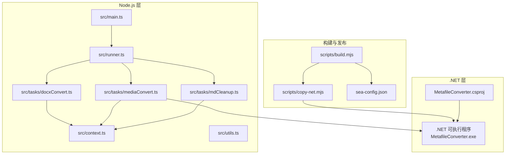
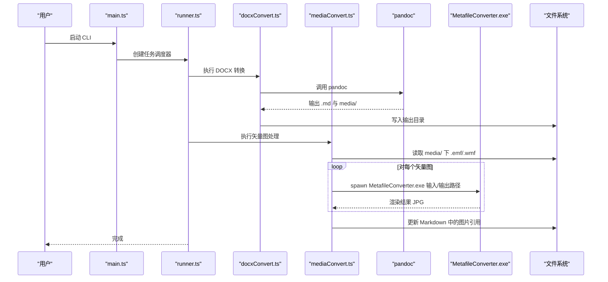
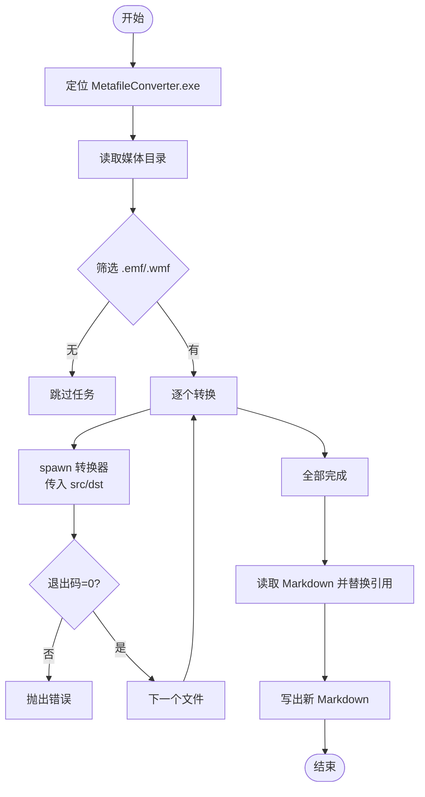
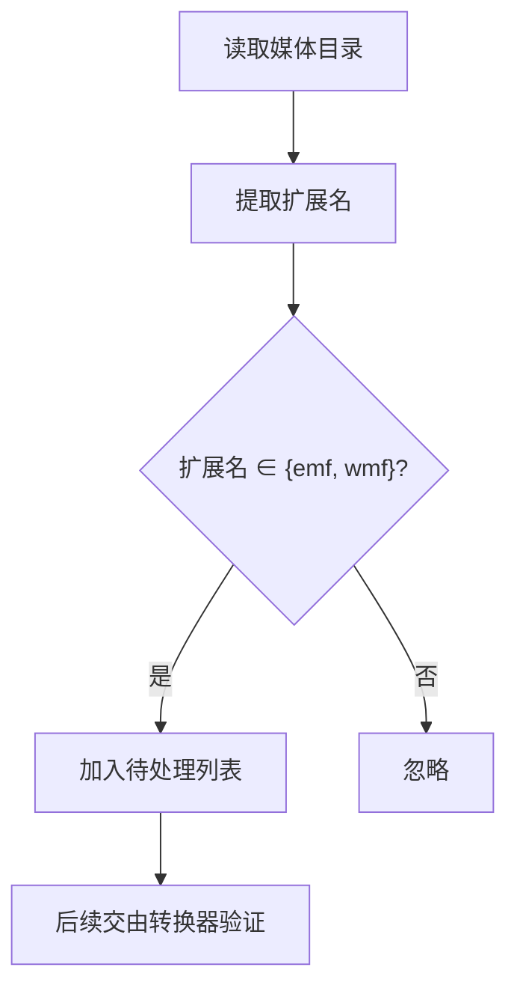
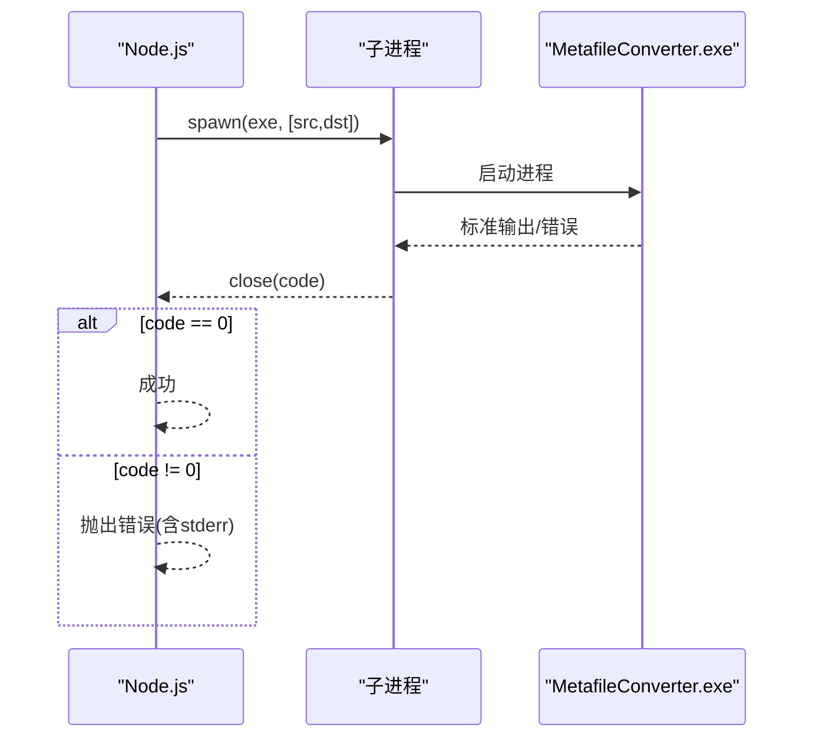
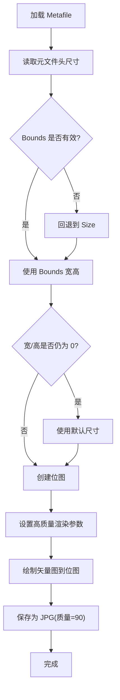
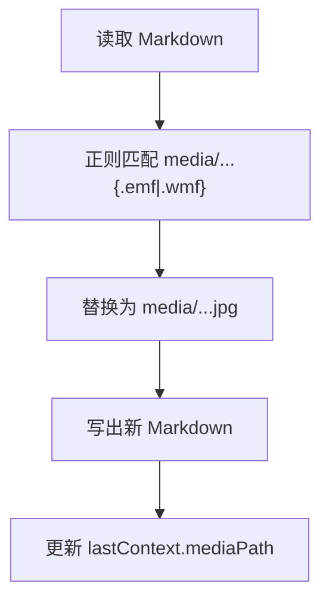
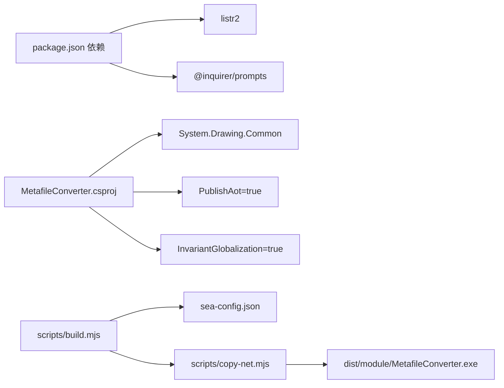

# 矢量图处理模块

<cite>
**本文引用的文件**
- [src/tasks/mediaConvert.ts](file://src/tasks/mediaConvert.ts)
- [module/MetafileConverter/MetafileConverter/Program.cs](file://module/MetafileConverter/MetafileConverter/Program.cs)
- [module/MetafileConverter/MetafileConverter/MetafileConverter.csproj](file://module/MetafileConverter/MetafileConverter/MetafileConverter.csproj)
- [src/context.ts](file://src/context.ts)
- [src/utils.ts](file://src/utils.ts)
- [package.json](file://package.json)
- [src/tasks/docxConvert.ts](file://src/tasks/docxConvert.ts)
- [src/tasks/mdCleanup.ts](file://src/tasks/mdCleanup.ts)
- [src/main.ts](file://src/main.ts)
- [scripts/build.mjs](file://scripts/build.mjs)
- [scripts/copy-net.mjs](file://scripts/copy-net.mjs)
- [src/runner.ts](file://src/runner.ts)
- [src/tasks/docxInput.ts](file://src/tasks/docxInput.ts)
- [src/tasks/pandocCheck.ts](file://src/tasks/pandocCheck.ts)
- [sea-config.json](file://sea-config.json)
</cite>

## 目录
1. [简介](#简介)
2. [项目结构](#项目结构)
3. [核心组件](#核心组件)
4. [架构总览](#架构总览)
5. [详细组件分析](#详细组件分析)
6. [依赖关系分析](#依赖关系分析)
7. [性能考量](#性能考量)
8. [故障排查指南](#故障排查指南)
9. [结论](#结论)
10. [附录](#附录)

## 简介
本文件面向“矢量图处理模块”，系统性阐述以下内容：
- mediaConvertTask 的实现原理与工作流
- 矢量图识别机制（EMF/WMF）与格式验证
- C# 转换器 MetafileConverter.exe 的集成与调用机制（进程管理、参数传递）
- 图像格式转换流程（EMF/WMF → JPG），含质量控制
- 路径更新机制（Markdown 中图片链接替换逻辑）
- 完整的 API 接口说明与错误处理策略

该模块是端到端文档转换流水线的一部分，负责在将 DOCX 转为 Markdown 并清理后，对媒体目录中的 EMF/WMF 矢量图进行渲染与替换，保证最终产物以光栅图为承载。

## 项目结构
该仓库采用“功能分层 + 模块化”的组织方式：
- src：核心业务逻辑与任务编排
  - tasks：各阶段任务（如 docxConvert、mediaConvert、mdCleanup 等）
  - context.ts：上下文类型定义
  - utils.ts：通用工具（缓存等）
  - main.ts、runner.ts：入口与任务调度
- module/MetafileConverter：独立的 .NET 控制台应用，提供矢量图渲染能力
- scripts：构建与打包脚本（含 SEA 打包与 .NET 模块复制）
- package.json：项目依赖与脚本命令

图表来源
- [src/main.ts:1-41](file://src/main.ts#L1-L41)
- [src/runner.ts:1-9](file://src/runner.ts#L1-L9)
- [src/tasks/mediaConvert.ts:104-112](file://src/tasks/mediaConvert.ts#L104-L112)
- [src/tasks/docxConvert.ts:10-64](file://src/tasks/docxConvert.ts#L10-L64)
- [src/tasks/mdCleanup.ts:329-373](file://src/tasks/mdCleanup.ts#L329-L373)
- [scripts/build.mjs:1-53](file://scripts/build.mjs#L1-L53)
- [scripts/copy-net.mjs:1-37](file://scripts/copy-net.mjs#L1-L37)
- [module/MetafileConverter/MetafileConverter/MetafileConverter.csproj:1-17](file://module/MetafileConverter/MetafileConverter/MetafileConverter.csproj#L1-L17)

章节来源
- [src/main.ts:1-41](file://src/main.ts#L1-L41)
- [src/runner.ts:1-9](file://src/runner.ts#L1-L9)
- [package.json:1-40](file://package.json#L1-L40)

## 核心组件
- mediaConvertTask：负责识别媒体目录中的 EMF/WMF，调用 C# 转换器渲染为 JPG，并更新 Markdown 中的图片引用路径。
- MetafileConverter.exe：.NET 控制台应用，接收输入/输出路径，读取矢量图元数据，按高质量参数渲染为 JPG。
- 上下文系统：AppContext/OutputContext 统一传递文件名、输出路径与媒体目录路径。
- 构建与分发：通过 SEA 打包 Node 代码，复制 .NET 运行时与可执行文件至 dist/module。

章节来源
- [src/tasks/mediaConvert.ts:29-112](file://src/tasks/mediaConvert.ts#L29-L112)
- [module/MetafileConverter/MetafileConverter/Program.cs:8-88](file://module/MetafileConverter/MetafileConverter/Program.cs#L8-L88)
- [src/context.ts:1-21](file://src/context.ts#L1-L21)
- [scripts/build.mjs:1-53](file://scripts/build.mjs#L1-L53)
- [scripts/copy-net.mjs:1-37](file://scripts/copy-net.mjs#L1-L37)

## 架构总览
矢量图处理模块在整体流水线中的位置如下：

图表来源
- [src/main.ts:1-41](file://src/main.ts#L1-L41)
- [src/runner.ts:1-9](file://src/runner.ts#L1-L9)
- [src/tasks/docxConvert.ts:10-64](file://src/tasks/docxConvert.ts#L10-L64)
- [src/tasks/mediaConvert.ts:43-112](file://src/tasks/mediaConvert.ts#L43-L112)
- [module/MetafileConverter/MetafileConverter/Program.cs:8-88](file://module/MetafileConverter/MetafileConverter/Program.cs#L8-L88)

## 详细组件分析

### mediaConvertTask 实现原理
- 功能目标：识别并渲染 EMF/WMF 为 JPG；更新 Markdown 中的图片引用为 JPG。
- 关键点：
  - 路径定位：根据运行环境（SEA 或开发）选择 MetafileConverter.exe 的实际路径。
  - 文件筛选：遍历媒体目录，仅保留 .emf/.wmf。
  - 进程调用：spawn 调用转换器，收集 stderr 并根据退出码判断成功或失败。
  - 质量控制：转换器内部使用高质量参数保存为 JPG。
  - 路径替换：正则匹配 Markdown 中 media/xxx.{emf,wmf} 并替换为 jpg。

图表来源
- [src/tasks/mediaConvert.ts:13-24](file://src/tasks/mediaConvert.ts#L13-L24)
- [src/tasks/mediaConvert.ts:43-112](file://src/tasks/mediaConvert.ts#L43-L112)

章节来源
- [src/tasks/mediaConvert.ts:13-24](file://src/tasks/mediaConvert.ts#L13-L24)
- [src/tasks/mediaConvert.ts:29-40](file://src/tasks/mediaConvert.ts#L29-L40)
- [src/tasks/mediaConvert.ts:43-112](file://src/tasks/mediaConvert.ts#L43-L112)

### 矢量图识别机制与格式验证
- 识别范围：仅处理 .emf 与 .wmf 文件扩展名。
- 识别逻辑：读取媒体目录，过滤扩展名为 emf/wmf 的文件。
- 格式验证：由 C# 转换器在运行时通过 System.Drawing.Metafile 加载并解析元文件头，若文件无效会返回错误码。

图表来源
- [src/tasks/mediaConvert.ts:51-60](file://src/tasks/mediaConvert.ts#L51-L60)
- [module/MetafileConverter/MetafileConverter/Program.cs:28-29](file://module/MetafileConverter/MetafileConverter/Program.cs#L28-L29)

章节来源
- [src/tasks/mediaConvert.ts:51-60](file://src/tasks/mediaConvert.ts#L51-L60)
- [module/MetafileConverter/MetafileConverter/Program.cs:28-29](file://module/MetafileConverter/MetafileConverter/Program.cs#L28-L29)

### C# 转换器集成与调用机制
- 进程管理：
  - Node.js 使用 child_process.spawn 调用 MetafileConverter.exe。
  - 收集 stderr 并在 close 事件中根据退出码决定成功或失败。
- 参数传递：
  - 传入两个参数：源路径与目标路径。
- 错误处理：
  - 参数不足、源文件不存在、异常均映射为非零退出码，便于上游统一处理。

图表来源
- [src/tasks/mediaConvert.ts:29-40](file://src/tasks/mediaConvert.ts#L29-L40)
- [module/MetafileConverter/MetafileConverter/Program.cs:8-15](file://module/MetafileConverter/MetafileConverter/Program.cs#L8-L15)

章节来源
- [src/tasks/mediaConvert.ts:29-40](file://src/tasks/mediaConvert.ts#L29-L40)
- [module/MetafileConverter/MetafileConverter/Program.cs:8-15](file://module/MetafileConverter/MetafileConverter/Program.cs#L8-L15)

### 图像格式转换流程与质量控制
- 输入：EMF/WMF 矢量图
- 渲染步骤：
  - 读取元文件头，获取原始尺寸；若为 0 则回退到 Size；仍为 0 则默认尺寸。
  - 创建位图并使用高质量渲染参数（插值、平滑、像素偏移）绘制。
  - 以 90 的质量参数保存为 JPG。
- 输出：JPG 光栅图，位于 mediaConvert/media 目录。

图表来源
- [module/MetafileConverter/MetafileConverter/Program.cs:28-67](file://module/MetafileConverter/MetafileConverter/Program.cs#L28-L67)

章节来源
- [module/MetafileConverter/MetafileConverter/Program.cs:28-67](file://module/MetafileConverter/MetafileConverter/Program.cs#L28-L67)

### 路径更新机制（Markdown 中图片链接替换）
- 目标：将 Markdown 中 media/xxx.emf 或 media/xxx.wmf 的引用替换为 media/xxx.jpg。
- 实现：使用正则表达式匹配形如 media/...{.emf|.wmf} 的片段，并替换为 .jpg。
- 结果：生成新的 Markdown 文件，同时更新 lastContext 的 mediaPath 指向 mediaConvert/media。

图表来源
- [src/tasks/mediaConvert.ts:75-102](file://src/tasks/mediaConvert.ts#L75-L102)

章节来源
- [src/tasks/mediaConvert.ts:75-102](file://src/tasks/mediaConvert.ts#L75-L102)

### API 接口文档
- mediaConvertTask
  - 类型：ListrTask<AppContext>
  - 行为：串行执行两个子任务
    - convertImagesTask：渲染 EMF/WMF 为 JPG
    - patchMarkdownTask：更新 Markdown 中的图片引用
  - 并发：false
  - 输出：更新 lastContext 的 outFilename、outputPath、mediaPath

- convertImagesTask
  - 输入：ctx.lastContext.mediaPath
  - 处理：筛选 .emf/.wmf，逐个调用 MetafileConverter.exe
  - 输出：JPG 文件写入 ctx.outputPath/mediaConvert/media

- patchMarkdownTask
  - 输入：ctx.lastContext.outputPath（原 Markdown）、ctx.lastContext.outFilename
  - 处理：正则替换 media/...{.emf|.wmf} 为 media/...jpg
  - 输出：写出新 Markdown 至 ctx.outputPath/mediaConvert/<原文件名>，并更新 lastContext.mediaPath

- 上下文接口
  - AppContext：inputPath、outputPath、pandocExec、lastContext?
  - OutputContext：outFilename、outputPath、mediaPath

章节来源
- [src/tasks/mediaConvert.ts:104-112](file://src/tasks/mediaConvert.ts#L104-L112)
- [src/tasks/mediaConvert.ts:43-72](file://src/tasks/mediaConvert.ts#L43-L72)
- [src/tasks/mediaConvert.ts:75-102](file://src/tasks/mediaConvert.ts#L75-L102)
- [src/context.ts:1-21](file://src/context.ts#L1-L21)

## 依赖关系分析
- Node.js 侧依赖：
  - listr2：任务编排
  - @inquirer/prompts：交互式输入
  - child_process：进程管理
  - fs/path：文件系统操作
- .NET 侧依赖：
  - System.Drawing.Common：Metafile、Bitmap、Graphics、编码器
  - 发布配置：AOT、全局化设置
- 构建与分发：
  - esbuild：打包 Node 代码
  - SEA：将打包产物嵌入可执行体
  - postject：注入 SEA Blob
  - copy-net：复制 .NET 运行时与可执行文件

图表来源
- [package.json:21-38](file://package.json#L21-L38)
- [module/MetafileConverter/MetafileConverter/MetafileConverter.csproj:1-17](file://module/MetafileConverter/MetafileConverter/MetafileConverter.csproj#L1-L17)
- [scripts/build.mjs:1-53](file://scripts/build.mjs#L1-L53)
- [scripts/copy-net.mjs:1-37](file://scripts/copy-net.mjs#L1-L37)
- [sea-config.json:1-6](file://sea-config.json#L1-L6)

章节来源
- [package.json:21-38](file://package.json#L21-L38)
- [module/MetafileConverter/MetafileConverter/MetafileConverter.csproj:1-17](file://module/MetafileConverter/MetafileConverter/MetafileConverter.csproj#L1-L17)
- [scripts/build.mjs:1-53](file://scripts/build.mjs#L1-L53)
- [scripts/copy-net.mjs:1-37](file://scripts/copy-net.mjs#L1-L37)
- [sea-config.json:1-6](file://sea-config.json#L1-L6)

## 性能考量
- 渲染质量与体积权衡：高质量参数提升视觉效果但可能增大 JPG 体积；质量参数固定为 90，兼顾清晰度与体积。
- 尺寸回退策略：当元文件头尺寸不可用时，回退到 Size，仍不可用时使用默认尺寸，避免渲染失败。
- 并发控制：矢量图转换任务串行执行，避免多进程竞争系统资源。
- I/O 优化：批量读取媒体目录，一次性筛选后再逐个转换，减少重复扫描。

## 故障排查指南
- 未检测到 pandoc
  - 现象：pandocCheck 任务抛错
  - 处理：安装 pandoc 并确保其在 PATH 中
  - 参考
    - [src/tasks/pandocCheck.ts:14-24](file://src/tasks/pandocCheck.ts#L14-L24)
- MetafileConverter.exe 路径问题
  - 现象：找不到可执行文件或无法启动
  - 处理：确认 SEA 运行时或开发环境下的路径定位逻辑是否正确；检查 dist/module 是否存在
  - 参考
    - [src/tasks/mediaConvert.ts:13-24](file://src/tasks/mediaConvert.ts#L13-L24)
    - [scripts/copy-net.mjs:1-37](file://scripts/copy-net.mjs#L1-L37)
- 转换器参数错误
  - 现象：转换器打印用法并返回 1
  - 处理：确保传入两个参数（源路径、目标路径）
  - 参考
    - [module/MetafileConverter/MetafileConverter/Program.cs:10-15](file://module/MetafileConverter/MetafileConverter/Program.cs#L10-L15)
- 源文件不存在
  - 现象：转换器返回 2
  - 处理：确认媒体目录中文件名与路径正确
  - 参考
    - [module/MetafileConverter/MetafileConverter/Program.cs:22-26](file://module/MetafileConverter/MetafileConverter/Program.cs#L22-L26)
- 转换异常
  - 现象：转换器捕获异常并返回 -1
  - 处理：查看 stderr 输出，检查矢量图有效性与系统绘图支持
  - 参考
    - [module/MetafileConverter/MetafileConverter/Program.cs:71-76](file://module/MetafileConverter/MetafileConverter/Program.cs#L71-L76)
    - [src/tasks/mediaConvert.ts:29-40](file://src/tasks/mediaConvert.ts#L29-L40)
- Markdown 路径替换未生效
  - 现象：引用未被替换
  - 处理：确认 Markdown 中引用格式符合 media/...{.emf|.wmf}；检查正则替换逻辑
  - 参考
    - [src/tasks/mediaConvert.ts:86-90](file://src/tasks/mediaConvert.ts#L86-L90)

章节来源
- [src/tasks/pandocCheck.ts:14-24](file://src/tasks/pandocCheck.ts#L14-L24)
- [src/tasks/mediaConvert.ts:13-24](file://src/tasks/mediaConvert.ts#L13-L24)
- [scripts/copy-net.mjs:1-37](file://scripts/copy-net.mjs#L1-L37)
- [module/MetafileConverter/MetafileConverter/Program.cs:10-15](file://module/MetafileConverter/MetafileConverter/Program.cs#L10-L15)
- [module/MetafileConverter/MetafileConverter/Program.cs:22-26](file://module/MetafileConverter/MetafileConverter/Program.cs#L22-L26)
- [module/MetafileConverter/MetafileConverter/Program.cs:71-76](file://module/MetafileConverter/MetafileConverter/Program.cs#L71-L76)
- [src/tasks/mediaConvert.ts:29-40](file://src/tasks/mediaConvert.ts#L29-L40)
- [src/tasks/mediaConvert.ts:86-90](file://src/tasks/mediaConvert.ts#L86-L90)

## 结论
本模块通过 Node.js 任务编排与 .NET 转换器协作，实现了从 EMF/WMF 到 JPG 的高质量渲染，并在最终产物中自动替换 Markdown 中的图片引用，确保输出一致且可用。其设计强调：
- 明确的职责分离：Node.js 负责流程与 I/O，.NET 负责渲染
- 稳健的错误处理：参数校验、文件存在性检查、异常捕获与错误码映射
- 可维护的构建链路：SEA 打包 + .NET 模块复制，便于分发

## 附录
- 相关任务与上下文
  - 文档输入与输出路径确定
    - [src/tasks/docxInput.ts:27-52](file://src/tasks/docxInput.ts#L27-L52)
  - pandoc 环境检测
    - [src/tasks/pandocCheck.ts:14-24](file://src/tasks/pandocCheck.ts#L14-L24)
  - DOCX 转换与媒体抽取
    - [src/tasks/docxConvert.ts:10-64](file://src/tasks/docxConvert.ts#L10-L64)
  - Markdown 清理（与媒体路径无关）
    - [src/tasks/mdCleanup.ts:329-373](file://src/tasks/mdCleanup.ts#L329-L373)
- 构建与发布
  - SEA 打包与注入
    - [scripts/build.mjs:1-53](file://scripts/build.mjs#L1-L53)
    - [sea-config.json:1-6](file://sea-config.json#L1-L6)
  - .NET 模块复制
    - [scripts/copy-net.mjs:1-37](file://scripts/copy-net.mjs#L1-L37)
- 工具函数
  - 输入缓存
    - [src/utils.ts:24-50](file://src/utils.ts#L24-L50)