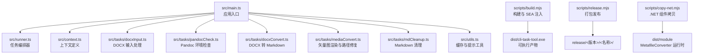
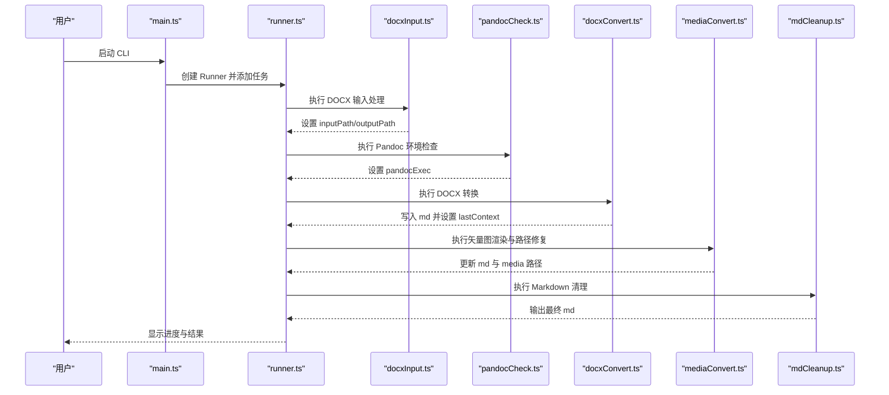
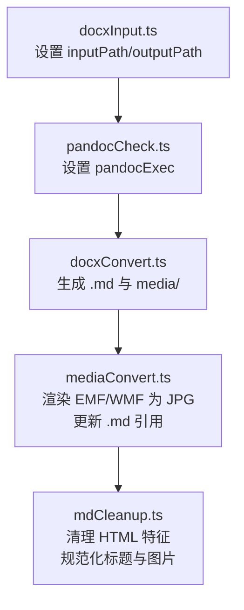
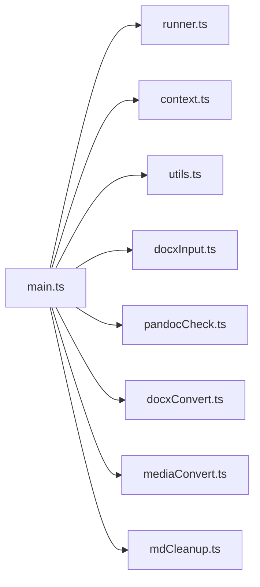

# 转换模块详解

<cite>
**本文引用的文件**
- [src/main.ts](file://src/main.ts)
- [src/context.ts](file://src/context.ts)
- [src/runner.ts](file://src/runner.ts)
- [src/utils.ts](file://src/utils.ts)
- [src/tasks/docxInput.ts](file://src/tasks/docxInput.ts)
- [src/tasks/pandocCheck.ts](file://src/tasks/pandocCheck.ts)
- [src/tasks/docxConvert.ts](file://src/tasks/docxConvert.ts)
- [src/tasks/mdCleanup.ts](file://src/tasks/mdCleanup.ts)
- [src/tasks/mediaConvert.ts](file://src/tasks/mediaConvert.ts)
- [package.json](file://package.json)
- [tsconfig.json](file://tsconfig.json)
- [eslint.config.js](file://eslint.config.js)
- [scripts/build.mjs](file://scripts/build.mjs)
- [scripts/release.mjs](file://scripts/release.mjs)
- [scripts/copy-net.mjs](file://scripts/copy-net.mjs)
- [sea-config.json](file://sea-config.json)
</cite>

## 目录
1. [简介](#简介)
2. [项目结构](#项目结构)
3. [核心组件](#核心组件)
4. [架构总览](#架构总览)
5. [详细组件分析](#详细组件分析)
6. [依赖分析](#依赖分析)
7. [性能考虑](#性能考虑)
8. [故障排除指南](#故障排除指南)
9. [结论](#结论)
10. [附录](#附录)

## 简介
本文件面向 Doc2XML CLI 转换模块，系统性阐述从 DOCX 输入到最终生成可编辑 Markdown 的完整流水线。重点覆盖以下模块与职责：
- DOCX 输入处理：交互式收集用户输入，解析输出目录，缓存最近输入路径
- Pandoc 环境检查：验证系统是否安装并可用 Pandoc
- 文档格式转换：基于 Pandoc 将 DOCX 转换为 GitHub 风格 Markdown，并抽取媒体资源
- 矢量图处理：识别并渲染 EMF/WMF 为 JPG，同时更新 Markdown 中的媒体引用
- Markdown 清理：去除 Pandoc 输出中的 HTML 特征标记，规范化标题层级与图片引用

文档还解释任务间的依赖关系、错误处理机制与性能优化策略，并提供各模块的 API 接口说明、参数与返回值定义，以及实际使用场景与示例。

## 项目结构
项目采用“入口脚本 + 上下文 + 任务编排 + 工具函数”的分层组织方式，核心文件如下：
- 入口与编排：main.ts、runner.ts、context.ts
- 任务模块：docxInput.ts、pandocCheck.ts、docxConvert.ts、mediaConvert.ts、mdCleanup.ts
- 工具与缓存：utils.ts
- 构建与发布：scripts/*.mjs、sea-config.json
- 配置：package.json、tsconfig.json、eslint.config.js

图表来源
- [src/main.ts:1-41](file://src/main.ts#L1-L41)
- [src/runner.ts:1-10](file://src/runner.ts#L1-L10)
- [src/context.ts:1-21](file://src/context.ts#L1-L21)
- [src/tasks/docxInput.ts:1-52](file://src/tasks/docxInput.ts#L1-L52)
- [src/tasks/pandocCheck.ts:1-24](file://src/tasks/pandocCheck.ts#L1-L24)
- [src/tasks/docxConvert.ts:1-64](file://src/tasks/docxConvert.ts#L1-L64)
- [src/tasks/mediaConvert.ts:1-112](file://src/tasks/mediaConvert.ts#L1-L112)
- [src/tasks/mdCleanup.ts:1-373](file://src/tasks/mdCleanup.ts#L1-L373)
- [scripts/build.mjs:1-53](file://scripts/build.mjs#L1-L53)
- [scripts/release.mjs:1-42](file://scripts/release.mjs#L1-L42)
- [scripts/copy-net.mjs:1-37](file://scripts/copy-net.mjs#L1-L37)

章节来源
- [src/main.ts:1-41](file://src/main.ts#L1-L41)
- [src/runner.ts:1-10](file://src/runner.ts#L1-L10)
- [src/context.ts:1-21](file://src/context.ts#L1-L21)
- [package.json:1-40](file://package.json#L1-L40)
- [tsconfig.json:1-19](file://tsconfig.json#L1-L19)
- [eslint.config.js:1-26](file://eslint.config.js#L1-L26)

## 核心组件
- 应用上下文 AppContext：承载输入路径、输出根目录、Pandoc 可执行路径及上一阶段输出上下文
- 输出上下文 OutputContext：记录当前阶段生成的 Markdown 文件名、输出路径与媒体目录
- 任务编排器：基于 listr2 创建任务列表，支持顺序执行与子任务并行控制
- 工具函数：输入缓存持久化、命令行提示样式化

章节来源
- [src/context.ts:1-21](file://src/context.ts#L1-L21)
- [src/runner.ts:1-10](file://src/runner.ts#L1-L10)
- [src/utils.ts:1-50](file://src/utils.ts#L1-L50)

## 架构总览
Doc2XML CLI 的转换流水线由五个任务组成，按顺序执行：
1) DOCX 输入处理 → 2) Pandoc 环境检查 → 3) DOCX 转换为 Markdown → 4) 矢量图渲染与路径修复 → 5) Markdown 清理

图表来源
- [src/main.ts:9-16](file://src/main.ts#L9-L16)
- [src/tasks/docxInput.ts:27-52](file://src/tasks/docxInput.ts#L27-L52)
- [src/tasks/pandocCheck.ts:14-24](file://src/tasks/pandocCheck.ts#L14-L24)
- [src/tasks/docxConvert.ts:10-64](file://src/tasks/docxConvert.ts#L10-L64)
- [src/tasks/mediaConvert.ts:104-112](file://src/tasks/mediaConvert.ts#L104-L112)
- [src/tasks/mdCleanup.ts:331-373](file://src/tasks/mdCleanup.ts#L331-L373)

## 详细组件分析

### DOCX 输入处理（docxInput.ts）
职责
- 交互式收集 .docx 文件路径，支持默认值与缓存回填
- 校验路径存在性与有效性
- 解析输出目录（与输入同级的 out 目录），并写入缓存

关键接口
- validateDocxPath(value: string): Promise<string | undefined>
  - 参数：用户输入字符串
  - 返回：无错误时返回 undefined；否则返回错误消息字符串
- docxInputTask: ListrTask<AppContext>
  - 执行时：读取缓存、显示提示、校验输入、设置 ctx.inputPath 与 ctx.outputPath

实现要点
- 使用 Inquirer 提示与 Listr 的 Prompt Adapter
- 支持绝对/相对路径，自动计算输出目录
- 缓存最近一次输入路径，提升用户体验

章节来源
- [src/tasks/docxInput.ts:1-52](file://src/tasks/docxInput.ts#L1-L52)
- [src/utils.ts:20-50](file://src/utils.ts#L20-L50)

### Pandoc 环境检查（pandocCheck.ts）
职责
- 检测系统是否已安装并可用 Pandoc
- 若不可用则抛出错误，阻止后续任务执行

关键接口
- testGlobalInstall(): boolean
  - 返回：true 表示可用；false 表示不可用
- pandocCheckTask: ListrTask<AppContext>
  - 执行时：若可用设置 ctx.pandocExec = 'pandoc'，否则抛错

实现要点
- 通过 child_process 调用 pandoc --version
- 错误即刻中断流水线，避免无效转换

章节来源
- [src/tasks/pandocCheck.ts:1-24](file://src/tasks/pandocCheck.ts#L1-L24)

### DOCX 转换为 Markdown（docxConvert.ts）
职责
- 使用 Pandoc 将 DOCX 转换为 GitHub 风格 Markdown（gfm）
- 抽取媒体资源至独立目录
- 记录转换产物路径与媒体目录，供后续任务使用

关键接口
- docxConvertTask: ListrTask<AppContext>
  - 执行时：创建输出目录、拼接 Pandoc 参数、启动子进程、监听 stderr、根据退出码决定成功或失败
  - 成功后设置 ctx.lastContext（包含 outFilename、outputPath、mediaPath）

Pandoc 参数要点
- 输入/输出：-f docx+styles -t gfm -o <文件名>
- 媒体抽取：--extract-media=.
- 标题风格：--markdown-headings=atx
- 数学公式：移除 TeX 数学包裹（-tex_math_gfm）

章节来源
- [src/tasks/docxConvert.ts:1-64](file://src/tasks/docxConvert.ts#L1-L64)

### 矢量图处理（mediaConvert.ts）
职责
- 识别 media 目录中的 EMF/WMF 文件
- 调用 .NET 工具 MetafileConverter.exe 将其渲染为 JPG
- 更新 Markdown 中的媒体引用，将 .emf/.wmf 替换为 .jpg

关键接口
- mediaConvertTask: ListrTask<AppContext>
  - 子任务1：convertImagesTask(ctx)
    - 列举 media 目录，过滤 .emf/.wmf，逐一调用转换器
  - 子任务2：patchMarkdownTask(ctx)
    - 读取上一阶段输出的 Markdown，替换媒体引用为 .jpg
    - 更新 ctx.lastContext.mediaPath 指向渲染后的 media 目录

定位转换器
- SEA 运行时：dist/module/MetafileConverter.exe
- 开发环境：module/MetafileConverter/MetafileConverter/bin/Release/net8.0/MetafileConverter.exe

章节来源
- [src/tasks/mediaConvert.ts:1-112](file://src/tasks/mediaConvert.ts#L1-L112)
- [scripts/copy-net.mjs:1-37](file://scripts/copy-net.mjs#L1-L37)

### Markdown 清理（mdCleanup.ts）
职责
- 去除 Pandoc 输出中的 HTML 特征标记，如 div 包裹、blockquote 前缀等
- 规范化中文标题层级映射（例如“一级标题”→“#”）
- 处理图片标签（含跨行 ）、表格块与图组块
- 以状态机驱动逐行解析，保证数据完整性与可追溯性

关键接口
- cleanMarkdown(source: string, warn: (msg: string) => void): string
  - 参数：原始 Markdown 字符串、警告回调
  - 返回：清理后的 Markdown 字符串
- mdCleanupTask: ListrTask<AppContext>
  - 执行时：读取上一阶段 Markdown、调用 cleanMarkdown、写出到新路径、更新 ctx.lastContext

状态机与规则
- NORMAL：进入正文/标题/图组/表格/图片等状态
- IN_ZHENGWEN：剥离正文容器标签，保留内容
- IN_HEADING：根据中文序号映射为 ATX 标题
- IN_FIGURE：提取图片 src 与 caption，输出 Markdown 图片
- IN_TABLE：原样输出表格块
- IN_IMG：处理跨行 ，补齐尾随文本并恢复前一状态

章节来源
- [src/tasks/mdCleanup.ts:1-373](file://src/tasks/mdCleanup.ts#L1-L373)

### 任务间依赖关系与数据流
- 顺序依赖：docxInput → pandocCheck → docxConvert → mediaConvert → mdCleanup
- 数据传递：通过 ctx.lastContext 在相邻任务间传递 outFilename、outputPath、mediaPath
- 错误传播：任一任务抛错即中断流水线，主入口捕获并提示用户

图表来源
- [src/tasks/docxInput.ts:27-52](file://src/tasks/docxInput.ts#L27-L52)
- [src/tasks/pandocCheck.ts:14-24](file://src/tasks/pandocCheck.ts#L14-L24)
- [src/tasks/docxConvert.ts:10-64](file://src/tasks/docxConvert.ts#L10-L64)
- [src/tasks/mediaConvert.ts:104-112](file://src/tasks/mediaConvert.ts#L104-L112)
- [src/tasks/mdCleanup.ts:331-373](file://src/tasks/mdCleanup.ts#L331-L373)

## 依赖分析
外部依赖
- listr2：任务编排与进度展示
- @inquirer/prompts 与 @listr2/prompt-adapter-inquirer：交互式输入
- Node.js 核心模块：fs/promises、child_process、path、os、url 等

内部模块耦合
- main.ts 仅负责组装任务，低耦合高内聚
- runner.ts 与 context.ts 提供统一上下文与编排能力
- utils.ts 为可复用的缓存与提示工具
- 任务模块彼此解耦，仅通过 ctx.lastContext 传递数据

图表来源
- [src/main.ts:1-7](file://src/main.ts#L1-L7)
- [src/runner.ts:1-10](file://src/runner.ts#L1-L10)
- [src/context.ts:1-21](file://src/context.ts#L1-L21)
- [src/utils.ts:1-50](file://src/utils.ts#L1-L50)
- [src/tasks/docxInput.ts:1-52](file://src/tasks/docxInput.ts#L1-L52)
- [src/tasks/pandocCheck.ts:1-24](file://src/tasks/pandocCheck.ts#L1-L24)
- [src/tasks/docxConvert.ts:1-64](file://src/tasks/docxConvert.ts#L1-L64)
- [src/tasks/mediaConvert.ts:1-112](file://src/tasks/mediaConvert.ts#L1-L112)
- [src/tasks/mdCleanup.ts:1-373](file://src/tasks/mdCleanup.ts#L1-L373)

章节来源
- [package.json:21-39](file://package.json#L21-L39)

## 性能考虑
- 串行执行：任务间严格顺序，避免并发 IO 冲突
- 子进程管理：Pandoc 与 MetafileConverter 通过 child_process 启动，stderr 汇总便于诊断
- 目录结构：每层任务输出独立目录，减少文件竞争与覆盖风险
- 缓存策略：输入路径缓存减少重复交互
- 构建优化：ESBuild 打包、SEA 注入，产物体积小、启动快

[本节为通用性能建议，无需具体文件分析]

## 故障排除指南
常见问题与处理
- Pandoc 未安装
  - 现象：pandocCheck 任务抛错
  - 处理：安装 Pandoc 并确保在 PATH 中可用
- DOCX 路径无效
  - 现象：validateDocxPath 返回错误消息
  - 处理：确认文件存在且为 .docx
- 转换失败（Pandoc 退出码非 0）
  - 现象：docxConvert 任务 reject，stderr 作为错误消息
  - 处理：检查 DOCX 是否包含复杂公式或特殊格式；必要时在外部先行清理
- MetafileConverter 失败
  - 现象：转换器返回非 0 退出码
  - 处理：确认 dist/module 下的 .NET 组件齐全；检查 EMF/WMF 文件是否损坏
- Markdown 清理告警
  - 现象：cleanMarkdown 调用 warn 回调输出警告
  - 处理：根据警告提示修正源文档或手动调整输出

章节来源
- [src/tasks/pandocCheck.ts:14-24](file://src/tasks/pandocCheck.ts#L14-L24)
- [src/tasks/docxConvert.ts:40-62](file://src/tasks/docxConvert.ts#L40-L62)
- [src/tasks/mediaConvert.ts:29-40](file://src/tasks/mediaConvert.ts#L29-L40)
- [src/tasks/mdCleanup.ts:355-357](file://src/tasks/mdCleanup.ts#L355-L357)

## 结论
Doc2XML CLI 通过清晰的任务划分与稳健的错误处理，实现了从 DOCX 到高质量 Markdown 的自动化转换。模块化设计便于扩展与维护，结合缓存与构建优化提升了用户体验与执行效率。建议在生产环境中：
- 确保 Pandoc 与 .NET 运行时完整部署
- 对复杂公式与矢量图进行预处理
- 使用 release 流水线产出便携可执行文件

[本节为总结性内容，无需具体文件分析]

## 附录

### API 接口文档

- 输入处理（docxInput.ts）
  - validateDocxPath(value: string): Promise<string | undefined>
    - 功能：校验 .docx 路径是否存在
    - 参数：value: string
    - 返回：无错误时 undefined；否则错误消息字符串
  - docxInputTask: ListrTask<AppContext>
    - 功能：交互式收集输入并设置 ctx.inputPath 与 ctx.outputPath

- 环境检查（pandocCheck.ts）
  - testGlobalInstall(): boolean
    - 功能：检测系统是否安装并可用 Pandoc
    - 返回：boolean
  - pandocCheckTask: ListrTask<AppContext>
    - 功能：设置 ctx.pandocExec 或抛错

- 文档转换（docxConvert.ts）
  - docxConvertTask: ListrTask<AppContext>
    - 功能：调用 Pandoc 转换 DOCX 为 Markdown，抽取媒体，设置 ctx.lastContext

- 矢量图处理（mediaConvert.ts）
  - mediaConvertTask: ListrTask<AppContext>
    - 功能：渲染 EMF/WMF 为 JPG 并更新 Markdown 引用
  - convertMetafile(srcPath: string, dstPath: string): Promise<void>
    - 功能：调用 MetafileConverter.exe 转换单个文件

- Markdown 清理（mdCleanup.ts）
  - cleanMarkdown(source: string, warn: (msg: string) => void): string
    - 功能：清理 HTML 特征、规范化标题与图片
    - 返回：清理后的 Markdown 字符串
  - mdCleanupTask: ListrTask<AppContext>
    - 功能：读取上一阶段 Markdown，调用 cleanMarkdown，写出并更新 ctx.lastContext

- 工具函数（utils.ts）
  - confirmDefaultAnswer(defaultYes: boolean): string
    - 功能：生成带颜色的确认提示文案
  - loadCache(): Promise<InputCache>
    - 功能：从用户主目录加载缓存
  - saveCache(partial: Partial<InputCache>): Promise<void>
    - 功能：合并并写入缓存

章节来源
- [src/tasks/docxInput.ts:13-52](file://src/tasks/docxInput.ts#L13-L52)
- [src/tasks/pandocCheck.ts:5-24](file://src/tasks/pandocCheck.ts#L5-L24)
- [src/tasks/docxConvert.ts:10-64](file://src/tasks/docxConvert.ts#L10-L64)
- [src/tasks/mediaConvert.ts:29-112](file://src/tasks/mediaConvert.ts#L29-L112)
- [src/tasks/mdCleanup.ts:77-373](file://src/tasks/mdCleanup.ts#L77-L373)
- [src/utils.ts:9-50](file://src/utils.ts#L9-L50)

### 参数与返回值定义

- validateDocxPath(value: string)
  - 输入：字符串
  - 输出：Promise<string | undefined>

- testGlobalInstall()
  - 输入：无
  - 输出：boolean

- convertMetafile(srcPath: string, dstPath: string)
  - 输入：源路径、目标路径
  - 输出：Promise<void>（异常时 reject）

- cleanMarkdown(source: string, warn: (msg: string) => void)
  - 输入：原始 Markdown、警告回调
  - 输出：清理后的 Markdown 字符串

- loadCache()
  - 输入：无
  - 输出：Promise<InputCache>

- saveCache(partial: Partial<InputCache>)
  - 输入：部分缓存对象
  - 输出：Promise<void>

章节来源
- [src/tasks/docxInput.ts:13-25](file://src/tasks/docxInput.ts#L13-L25)
- [src/tasks/pandocCheck.ts:5-12](file://src/tasks/pandocCheck.ts#L5-L12)
- [src/tasks/mediaConvert.ts:29-40](file://src/tasks/mediaConvert.ts#L29-L40)
- [src/tasks/mdCleanup.ts:77-77](file://src/tasks/mdCleanup.ts#L77-L77)
- [src/utils.ts:28-50](file://src/utils.ts#L28-L50)

### 使用场景与示例

- 场景一：标准转换
  - 步骤：运行 CLI → 输入 .docx 路径 → 确认 Pandoc 可用 → 转换为 Markdown → 渲染矢量图为 JPG → 清理 HTML 特征
  - 产物：out/docxConvert/test.md、out/mdCleanup/test.md、out/mediaConvert/media/

- 场景二：二次运行
  - 步骤：运行 CLI → 自动回填上次输入路径 → 跳过输入环节 → 继续后续任务
  - 依据：utils.ts 的缓存机制

- 场景三：发布与分发
  - 步骤：构建 → 生成 SEA 可执行文件 → 拷贝 .NET 组件 → 打包压缩
  - 产物：release/<版本>/doc2xml-cli-<版本>.zip

章节来源
- [src/utils.ts:28-50](file://src/utils.ts#L28-L50)
- [scripts/build.mjs:1-53](file://scripts/build.mjs#L1-L53)
- [scripts/release.mjs:1-42](file://scripts/release.mjs#L1-L42)
- [scripts/copy-net.mjs:1-37](file://scripts/copy-net.mjs#L1-L37)