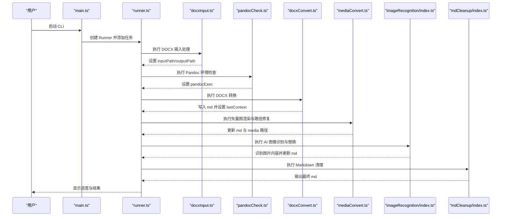
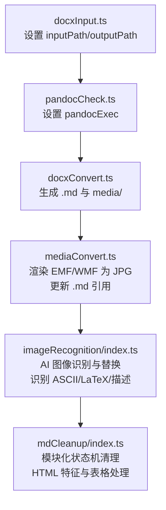

# 转换模块详解

<cite>
**本文引用的文件**
- [src/main.ts](file://src/main.ts)
- [src/context.ts](file://src/context.ts)
- [src/runner.ts](file://src/runner.ts)
- [src/utils.ts](file://src/utils.ts)
- [src/tasks/docxInput.ts](file://src/tasks/docxInput.ts)
- [src/tasks/pandocCheck.ts](file://src/tasks/pandocCheck.ts)
- [src/tasks/docxConvert.ts](file://src/tasks/docxConvert.ts)
- [src/tasks/mdCleanup/index.ts](file://src/tasks/mdCleanup/index.ts)
- [src/tasks/mdCleanup/stateMachine.ts](file://src/tasks/mdCleanup/stateMachine.ts)
- [src/tasks/mdCleanup/task.ts](file://src/tasks/mdCleanup/task.ts)
- [src/tasks/mdCleanup/helpers.ts](file://src/tasks/mdCleanup/helpers.ts)
- [src/tasks/mdCleanup/types.ts](file://src/tasks/mdCleanup/types.ts)
- [src/tasks/mdCleanup/constants.ts](file://src/tasks/mdCleanup/constants.ts)
- [src/tasks/mediaConvert.ts](file://src/tasks/mediaConvert.ts)
- [src/tasks/imageRecognition/index.ts](file://src/tasks/imageRecognition/index.ts)
- [src/tasks/imageRecognition/config.ts](file://src/tasks/imageRecognition/config.ts)
- [src/tasks/imageRecognition/configureTask.ts](file://src/tasks/imageRecognition/configureTask.ts)
- [src/tasks/imageRecognition/processTask.ts](file://src/tasks/imageRecognition/processTask.ts)
- [src/tasks/imageRecognition/recognition.ts](file://src/tasks/imageRecognition/recognition.ts)
- [src/tasks/imageRecognition/constants.ts](file://src/tasks/imageRecognition/constants.ts)
- [src/tasks/imageRecognition/helpers.ts](file://src/tasks/imageRecognition/helpers.ts)
- [src/tasks/imageRecognition/types.ts](file://src/tasks/imageRecognition/types.ts)
- [package.json](file://package.json)
- [tsconfig.json](file://tsconfig.json)
- [eslint.config.js](file://eslint.config.js)
- [scripts/build.mjs](file://scripts/build.mjs)
- [scripts/release.mjs](file://scripts/release.mjs)
- [scripts/copy-net.mjs](file://scripts/copy-net.mjs)
- [sea-config.json](file://sea-config.json)
</cite>

## 目录
1. [简介](#简介)
2. [项目结构](#项目结构)
3. [核心组件](#核心组件)
4. [架构总览](#架构总览)
5. [详细组件分析](#详细组件分析)
6. [依赖分析](#依赖分析)
7. [性能考虑](#性能考虑)
8. [故障排除指南](#故障排除指南)
9. [结论](#结论)
10. [附录](#附录)

## 简介
本文件面向 Doc2MD CLI 转换模块，系统性阐述从 DOCX 输入到最终生成可编辑 Markdown 的完整流水线。重点覆盖以下模块与职责：
- DOCX 输入处理：交互式收集用户输入，解析输出目录，缓存最近输入路径
- Pandoc 环境检查：验证系统是否安装并可用 Pandoc
- 文档格式转换：基于 Pandoc 将 DOCX 转换为 GitHub 风格 Markdown，并抽取媒体资源
- 矢量图处理：识别并渲染 EMF/WMF 为 JPG，同时更新 Markdown 中的媒体引用
- AI 图像识别：基于 OpenAI 兼容接口对图片内容进行智能识别与替换，支持 ASCII 字符、LaTeX 公式和描述性文本三种类型
- Markdown 清理：采用模块化状态机架构，去除 Pandoc 输出中的 HTML 特征标记，规范化标题层级与图片引用

文档还解释任务间的依赖关系、错误处理机制与性能优化策略，并提供各模块的 API 接口说明、参数与返回值定义，以及实际使用场景与示例。

## 项目结构
项目采用"入口脚本 + 上下文 + 任务编排 + 工具函数"的分层组织方式，核心文件如下：
- 入口与编排：main.ts、runner.ts、context.ts
- 任务模块：docxInput.ts、pandocCheck.ts、docxConvert.ts、mediaConvert.ts、mdCleanup（重构）、imageRecognition（新增）
- 工具与缓存：utils.ts
- 构建与发布：scripts/*.mjs、sea-config.json
- 配置：package.json、tsconfig.json、eslint.config.js

```mermaid
graph TB
A["src/main.ts<br/>应用入口"] --> B["src/runner.ts<br/>任务编排器"]
A --> C["src/context.ts<br/>上下文定义"]
A --> D["src/tasks/docxInput.ts<br/>DOCX 输入处理"]
A --> E["src/tasks/pandocCheck.ts<br/>Pandoc 环境检查"]
A --> F["src/tasks/docxConvert.ts<br/>DOCX 转 Markdown"]
A --> G["src/tasks/mediaConvert.ts<br/>矢量图渲染与路径修复"]
A --> H["src/tasks/mdCleanup/index.ts<br/>Markdown 清理模块化"]
H --> H1["stateMachine.ts<br/>状态机实现"]
H --> H2["task.ts<br/>任务执行逻辑"]
H --> H3["helpers.ts<br/>辅助函数"]
H --> H4["types.ts<br/>类型定义"]
H --> H5["constants.ts<br/>常量定义"]
A --> I["src/tasks/imageRecognition/index.ts<br/>AI 图像识别任务"]
I --> I1["configureTask.ts<br/>AI 接口配置"]
I --> I2["processTask.ts<br/>图片识别与替换"]
I --> I3["recognition.ts<br/>识别逻辑实现"]
I --> I4["helpers.ts<br/>辅助函数"]
I --> I5["constants.ts<br/>常量定义"]
I --> I6["types.ts<br/>类型定义"]
I --> I7["config.ts<br/>配置管理"]
J["scripts/build.mjs<br/>构建与 SEA 注入"] --> K["dist/cli-task-tool.exe<br/>可执行产物"]
L["scripts/release.mjs<br/>打包发布"] --> M["release/<版本>/<名称>/"]
N["scripts/copy-net.mjs<br/>.NET 组件拷贝"] --> O["dist/module<br/>MetafileConverter 运行时"]
```



**图表来源**
- [src/main.ts:1-73](file://src/main.ts#L1-L73)
- [src/runner.ts:1-10](file://src/runner.ts#L1-L10)
- [src/context.ts:1-21](file://src/context.ts#L1-L21)
- [src/tasks/docxInput.ts:1-52](file://src/tasks/docxInput.ts#L1-L52)
- [src/tasks/pandocCheck.ts:1-24](file://src/tasks/pandocCheck.ts#L1-L24)
- [src/tasks/docxConvert.ts:1-64](file://src/tasks/docxConvert.ts#L1-L64)
- [src/tasks/mediaConvert.ts:1-112](file://src/tasks/mediaConvert.ts#L1-L112)
- [src/tasks/mdCleanup/index.ts:1-16](file://src/tasks/mdCleanup/index.ts#L1-L16)
- [src/tasks/mdCleanup/stateMachine.ts:1-347](file://src/tasks/mdCleanup/stateMachine.ts#L1-L347)
- [src/tasks/mdCleanup/task.ts:1-72](file://src/tasks/mdCleanup/task.ts#L1-L72)
- [src/tasks/mdCleanup/helpers.ts:1-82](file://src/tasks/mdCleanup/helpers.ts#L1-L82)
- [src/tasks/mdCleanup/types.ts:1-50](file://src/tasks/mdCleanup/types.ts#L1-L50)
- [src/tasks/mdCleanup/constants.ts:1-41](file://src/tasks/mdCleanup/constants.ts#L1-L41)
- [src/tasks/imageRecognition/index.ts:1-11](file://src/tasks/imageRecognition/index.ts#L1-L11)
- [src/tasks/imageRecognition/configureTask.ts:1-126](file://src/tasks/imageRecognition/configureTask.ts#L1-L126)
- [src/tasks/imageRecognition/processTask.ts:1-298](file://src/tasks/imageRecognition/processTask.ts#L1-L298)
- [src/tasks/imageRecognition/recognition.ts:1-267](file://src/tasks/imageRecognition/recognition.ts#L1-L267)
- [src/tasks/imageRecognition/helpers.ts:1-119](file://src/tasks/imageRecognition/helpers.ts#L1-L119)
- [src/tasks/imageRecognition/constants.ts:1-51](file://src/tasks/imageRecognition/constants.ts#L1-L51)
- [src/tasks/imageRecognition/types.ts:1-31](file://src/tasks/imageRecognition/types.ts#L1-L31)
- [src/tasks/imageRecognition/config.ts:1-16](file://src/tasks/imageRecognition/config.ts#L1-L16)
- [scripts/build.mjs:1-53](file://scripts/build.mjs#L1-L53)
- [scripts/release.mjs:1-42](file://scripts/release.mjs#L1-L42)
- [scripts/copy-net.mjs:1-37](file://scripts/copy-net.mjs#L1-L37)

**章节来源**
- [src/main.ts:1-73](file://src/main.ts#L1-L73)
- [src/runner.ts:1-10](file://src/runner.ts#L1-L10)
- [src/context.ts:1-21](file://src/context.ts#L1-L21)
- [package.json:1-40](file://package.json#L1-L40)
- [tsconfig.json:1-19](file://tsconfig.json#L1-L19)
- [eslint.config.js:1-26](file://eslint.config.js#L1-L26)

## 核心组件
- 应用上下文 AppContext：承载输入路径、输出根目录、Pandoc 可执行路径及上一阶段输出上下文
- 输出上下文 OutputContext：记录当前阶段生成的 Markdown 文件名、输出路径与媒体目录
- 任务编排器：基于 listr2 创建任务列表，支持顺序执行与子任务并行控制
- 工具函数：输入缓存持久化、命令行提示样式化
- AI 图像识别配置：支持 OpenAI 兼容接口的 baseURL、apiKey、model、enableValidation、timeout 等配置项
- **Markdown 清理模块（重构）**：采用模块化状态机架构，包含状态定义、处理逻辑、辅助函数和常量配置

**章节来源**
- [src/context.ts:1-21](file://src/context.ts#L1-L21)
- [src/runner.ts:1-10](file://src/runner.ts#L1-L10)
- [src/utils.ts:1-50](file://src/utils.ts#L1-L50)
- [src/tasks/imageRecognition/config.ts:1-16](file://src/tasks/imageRecognition/config.ts#L1-L16)
- [src/tasks/mdCleanup/index.ts:1-16](file://src/tasks/mdCleanup/index.ts#L1-L16)

## 架构总览
Doc2MD CLI 的转换流水线由六个任务组成，按顺序执行：
1) DOCX 输入处理 → 2) Pandoc 环境检查 → 3) DOCX 转换为 Markdown → 4) 矢量图渲染与路径修复 → 5) AI 图像识别与替换 → 6) Markdown 清理



**图表来源**
- [src/main.ts:9-16](file://src/main.ts#L9-L16)
- [src/tasks/docxInput.ts:27-52](file://src/tasks/docxInput.ts#L27-L52)
- [src/tasks/pandocCheck.ts:14-24](file://src/tasks/pandocCheck.ts#L14-L24)
- [src/tasks/docxConvert.ts:10-64](file://src/tasks/docxConvert.ts#L10-L64)
- [src/tasks/mediaConvert.ts:104-112](file://src/tasks/mediaConvert.ts#L104-L112)
- [src/tasks/imageRecognition/index.ts:6-10](file://src/tasks/imageRecognition/index.ts#L6-L10)
- [src/tasks/mdCleanup/index.ts:8-9](file://src/tasks/mdCleanup/index.ts#L8-L9)

## 详细组件分析

### DOCX 输入处理（docxInput.ts）
职责
- 交互式收集 .docx 文件路径，支持默认值与缓存回填
- 校验路径存在性与有效性
- 解析输出目录（与输入同级的 out 目录），并写入缓存

关键接口
- validateDocxPath(value: string): Promise<string | undefined>
  - 参数：用户输入字符串
  - 返回：无错误时返回 undefined；否则返回错误消息字符串
- docxInputTask: ListrTask<AppContext>
  - 执行时：读取缓存、显示提示、校验输入、设置 ctx.inputPath 与 ctx.outputPath

实现要点
- 使用 Inquirer 提示与 Listr 的 Prompt Adapter
- 支持绝对/相对路径，自动计算输出目录
- 缓存最近一次输入路径，提升用户体验

**章节来源**
- [src/tasks/docxInput.ts:1-52](file://src/tasks/docxInput.ts#L1-L52)
- [src/utils.ts:20-50](file://src/utils.ts#L20-L50)

### Pandoc 环境检查（pandocCheck.ts）
职责
- 检测系统是否已安装并可用 Pandoc
- 若不可用则抛出错误，阻止后续任务执行

关键接口
- testGlobalInstall(): boolean
  - 返回：true 表示可用；false 表示不可用
- pandocCheckTask: ListrTask<AppContext>
  - 执行时：若可用设置 ctx.pandocExec = 'pandoc'，否则抛错

实现要点
- 通过 child_process 调用 pandoc --version
- 错误即刻中断流水线，避免无效转换

**章节来源**
- [src/tasks/pandocCheck.ts:1-24](file://src/tasks/pandocCheck.ts#L1-L24)

### DOCX 转换为 Markdown（docxConvert.ts）
职责
- 使用 Pandoc 将 DOCX 转换为 GitHub 风格 Markdown（gfm）
- 抽取媒体资源至独立目录
- 记录转换产物路径与媒体目录，供后续任务使用

关键接口
- docxConvertTask: ListrTask<AppContext>
  - 执行时：创建输出目录、拼接 Pandoc 参数、启动子进程、监听 stderr、根据退出码决定成功或失败
  - 成功后设置 ctx.lastContext（包含 outFilename、outputPath、mediaPath）

Pandoc 参数要点
- 输入/输出：-f docx+styles -t gfm -o <文件名>
- 媒体抽取：--extract-media=.
- 标题风格：--markdown-headings=atx
- 数学公式：移除 TeX 数学包裹（-tex_math_gfm）

**章节来源**
- [src/tasks/docxConvert.ts:1-64](file://src/tasks/docxConvert.ts#L1-L64)

### 矢量图处理（mediaConvert.ts）
职责
- 识别 media 目录中的 EMF/WMF 文件
- 调用 .NET 工具 MetafileConverter.exe 将其渲染为 JPG
- 更新 Markdown 中的媒体引用，将 .emf/.wmf 替换为 .jpg

关键接口
- mediaConvertTask: ListrTask<AppContext>
- 子任务1：convertImagesTask(ctx)
  - 列举 media 目录，过滤 .emf/.wmf，逐一调用转换器
- 子任务2：patchMarkdownTask(ctx)
  - 读取上一阶段输出的 Markdown，替换媒体引用为 .jpg
  - 更新 ctx.lastContext.mediaPath 指向渲染后的 media 目录

定位转换器
- SEA 运行时：dist/module/MetafileConverter.exe
- 开发环境：module/MetafileConverter/MetafileConverter/bin/Release/net8.0/MetafileConverter.exe

**章节来源**
- [src/tasks/mediaConvert.ts:1-112](file://src/tasks/mediaConvert.ts#L1-L112)
- [scripts/copy-net.mjs:1-37](file://scripts/copy-net.mjs#L1-L37)

### AI 图像识别（imageRecognition/index.ts）
职责
- 新增的 AI 图像识别模块，基于 OpenAI 兼容接口对图片内容进行智能识别与替换
- 支持 ASCII 字符、LaTeX 公式和描述性文本三种内容类型的识别
- 提供配置界面、识别逻辑、结果校验和替换功能

关键接口
- imageRecognitionTask: ListrTask<AppContext>
  - 主任务：包含配置任务和处理任务两个子任务
  - 配置任务：configureAiTask(ctx)
  - 处理任务：processImagesTask(ctx)

实现要点
- 基于 @ai-sdk/openai-compatible 和 ai 库实现 OpenAI 兼容接口
- 支持超时控制、重试机制和结果校验
- 自动识别图片类型并生成相应的 Markdown 内容

**章节来源**
- [src/tasks/imageRecognition/index.ts:1-11](file://src/tasks/imageRecognition/index.ts#L1-L11)

#### AI 接口配置（configureTask.ts）
职责
- 配置 AI 视觉识别接口的基本信息
- 获取并验证可用的模型列表
- 支持启用结果校验和设置超时时间

关键接口
- configureAiTask(ctx): ListrTask<AppContext>
  - 配置 baseURL、apiKey、model、enableValidation、timeout
  - 通过 fetch 获取模型列表并验证可用性
  - 支持用户交互式输入和缓存读取

实现要点
- 支持 OpenAI 兼容接口的 /models 端点
- 提供连接失败重试机制
- 缓存配置信息以便下次使用

**章节来源**
- [src/tasks/imageRecognition/configureTask.ts:1-126](file://src/tasks/imageRecognition/configureTask.ts#L1-L126)

#### 图片识别与替换（processTask.ts）
职责
- 识别并替换图片内容为相应的文本表示
- 支持 ASCII 字符直接替换、LaTeX 公式和描述性文本
- 实现超时控制、重试机制和用户确认重试

关键接口
- processImagesTask(ctx): ListrTask<AppContext>
  - 读取 Markdown 文件，识别图片引用
  - 调用 AI 接口进行图片内容识别
  - 根据识别结果生成相应的 Markdown 内容
  - 支持失败图片的用户确认重试

实现要点
- 使用正则表达式匹配 Markdown 图片语法
- 支持块级和行内两种 LaTeX 公式的不同包裹方式
- 实时显示识别进度和状态信息

**章节来源**
- [src/tasks/imageRecognition/processTask.ts:1-298](file://src/tasks/imageRecognition/processTask.ts#L1-L298)

#### 识别逻辑实现（recognition.ts）
职责
- 实现具体的图片识别和结果校验逻辑
- 支持超时控制和错误处理
- 提供识别结果解析和验证功能

关键接口
- recognizeImage(provider, modelId, imageBuffer, mimeType): Promise<RecognitionResult>
  - 基础图片识别功能
- recognizeWithValidation(provider, modelId, imageBuffer, mimeType, onStatus): Promise<RecognitionResult>
  - 带结果校验的识别功能
- validateRecognition(provider, modelId, imageBuffer, mimeType, recognition): Promise<ValidationResult>
  - 识别结果验证功能

实现要点
- 使用 withTimeout 函数实现超时控制
- 支持最多 MAX_RECOGNITION_ATTEMPTS 次重试
- 提供详细的错误处理和日志记录

**章节来源**
- [src/tasks/imageRecognition/recognition.ts:1-267](file://src/tasks/imageRecognition/recognition.ts#L1-L267)

#### 辅助函数（helpers.ts）
职责
- 提供图片识别过程中的各种辅助功能
- 包括 MIME 类型处理、路径解析、替换内容构建等

关键接口
- getMimeType(ext: string): string
  - 根据文件扩展名获取 MIME 类型
- resolveImagePath(src: string, mdDir: string, mediaPath: string): Promise<string | undefined>
  - 解析图片文件的实际路径
- collectImageMatches(lines: string[]): ImageMatch[]
  - 收集 Markdown 文件中的图片引用
- buildReplacement(match: ImageMatch, result: RecognitionResult, imgName: string): string
  - 根据识别结果构建替换内容

**章节来源**
- [src/tasks/imageRecognition/helpers.ts:1-119](file://src/tasks/imageRecognition/helpers.ts#L1-L119)

#### 常量定义（constants.ts）
职责
- 定义 AI 图像识别模块使用的各种常量
- 包括正则表达式、提示语模板、最大重试次数等

关键常量
- layer: 'imageRecognition'
- RE_MD_IMAGE: 匹配 Markdown 图片语法的正则表达式
- VISION_PROMPT: 图片识别的提示语模板
- VALIDATION_PROMPT: 结果验证的提示语模板
- MAX_RECOGNITION_ATTEMPTS: 最大识别尝试次数

**章节来源**
- [src/tasks/imageRecognition/constants.ts:1-51](file://src/tasks/imageRecognition/constants.ts#L1-L51)

#### 类型定义（types.ts）
职责
- 定义 AI 图像识别模块使用的各种类型
- 包括配置类型、识别结果类型、图片匹配类型等

关键类型
- AiConfig: AI 配置接口
- RecognitionResult: 识别结果接口
- ValidationResult: 验证结果接口
- ImageMatch: 图片匹配接口
- ContentType: 内容类型枚举

**章节来源**
- [src/tasks/imageRecognition/types.ts:1-31](file://src/tasks/imageRecognition/types.ts#L1-L31)

#### 配置管理（config.ts）
职责
- 管理 AI 图像识别模块的全局配置
- 提供默认配置和配置访问接口

**章节来源**
- [src/tasks/imageRecognition/config.ts:1-16](file://src/tasks/imageRecognition/config.ts#L1-L16)

### Markdown 清理（mdCleanup/index.ts）
**更新**：mdCleanup 模块已完全重构为模块化架构，采用状态机模式实现更清晰的处理逻辑

职责
- 采用模块化状态机架构，去除 Pandoc 输出中的 HTML 特征标记
- 规范化中文标题层级映射（例如"一级标题"→"#"）
- 处理图片标签（含跨行 ）、表格块与图组块
- 以状态机驱动逐行解析，保证数据完整性与可追溯性

模块化架构
- **index.ts**：导出主要功能和类型，作为模块入口
- **stateMachine.ts**：实现核心状态机逻辑和清理算法
- **task.ts**：封装任务执行逻辑，处理文件读写和上下文管理
- **helpers.ts**：提供辅助函数，包括行处理、图片提取等
- **types.ts**：定义状态枚举和上下文接口
- **constants.ts**：集中管理正则表达式和映射配置

状态机与规则
- **NORMAL**：进入正文/标题/图组/表格/图片等状态
- **IN_ZHENGWEN**：剥离正文容器标签，保留内容
- **IN_HEADING**：根据中文序号映射为 ATX 标题
- **IN_FIGURE**：提取图片 src 与 caption，输出 Markdown 图片
- **IN_TABLE**：原样输出表格块，**改进**：增加对行内 div 样式标签的处理
- **IN_IMG**：处理跨行 ，补齐尾随文本并恢复前一状态
- **IN_DATA_CUSTOM_STYLE**：处理 data-custom-style div 块
- **IN_CUSTOM_STYLE**：处理 custom-style div 块

**章节来源**
- [src/tasks/mdCleanup/index.ts:1-16](file://src/tasks/mdCleanup/index.ts#L1-L16)
- [src/tasks/mdCleanup/stateMachine.ts:1-347](file://src/tasks/mdCleanup/stateMachine.ts#L1-L347)
- [src/tasks/mdCleanup/task.ts:1-72](file://src/tasks/mdCleanup/task.ts#L1-L72)
- [src/tasks/mdCleanup/helpers.ts:1-82](file://src/tasks/mdCleanup/helpers.ts#L1-L82)
- [src/tasks/mdCleanup/types.ts:1-50](file://src/tasks/mdCleanup/types.ts#L1-L50)
- [src/tasks/mdCleanup/constants.ts:1-41](file://src/tasks/mdCleanup/constants.ts#L1-L41)

#### 状态机实现（stateMachine.ts）
**更新**：采用函数式状态机模式，每个状态都有专门的处理器函数

核心功能
- **handleNormal**：处理普通状态，识别进入各种块状态的条件
- **handleZhengwen**：处理正文段落，剥离容器标签
- **handleHeading**：处理标题，支持中文序号映射
- **handleFigure**：处理图组，提取图片和标题
- **handleTable**：处理表格，**改进**：移除行内 div 样式标签
- **handleImg**：处理跨行图片标签
- **handleDataCustomStyle/handleCustomStyle**：处理自定义样式块

状态处理器映射
```typescript
const stateHandlers: Record<State, (line: string, ctx: CleanContext, warn: WarnFn) => State> = {
  [State.NORMAL]: handleNormal,
  [State.IN_ZHENGWEN]: handleZhengwen,
  [State.IN_HEADING]: handleHeading,
  [State.IN_FIGURE]: handleFigure,
  [State.IN_TABLE]: handleTable,
  [State.IN_DATA_CUSTOM_STYLE]: handleDataCustomStyle,
  [State.IN_CUSTOM_STYLE]: handleCustomStyle,
  [State.IN_IMG]: handleImg,
}
```

**章节来源**
- [src/tasks/mdCleanup/stateMachine.ts:267-276](file://src/tasks/mdCleanup/stateMachine.ts#L267-L276)

#### 任务执行逻辑（task.ts）
职责
- 封装文件读取、清理和写出的完整流程
- 管理输出目录创建和上下文保存
- 处理错误和警告信息

关键流程
1. 读取上一阶段输出的 Markdown 文件
2. 调用 cleanMarkdown 函数进行清理
3. 创建输出目录并写出清理后的文件
4. 更新 ctx.lastContext 并保存输出上下文

**章节来源**
- [src/tasks/mdCleanup/task.ts:11-72](file://src/tasks/mdCleanup/task.ts#L11-L72)

#### 辅助函数（helpers.ts）
**更新**：增加了对跨行图片标签的处理能力

核心功能
- **stripBlockquote**：去除行首的块引用标记
- **srcToAlt**：从图片路径生成 alt 文本
- **extractImgTrailing**：提取 img 标签后的尾随文本
- **replaceCompleteImgs**：替换完整的行内图片标签
- **processLineContent**：处理整行内容，检测跨行图片

**章节来源**
- [src/tasks/mdCleanup/helpers.ts:1-82](file://src/tasks/mdCleanup/helpers.ts#L1-L82)

#### 类型定义（types.ts）
**更新**：新增状态枚举和上下文接口

状态枚举
```typescript
export const enum State {
  NORMAL,
  IN_ZHENGWEN,
  IN_HEADING,
  IN_FIGURE,
  IN_TABLE,
  IN_IMG,
  IN_DATA_CUSTOM_STYLE,
  IN_CUSTOM_STYLE,
}
```

上下文接口
- **CleanContext**：包含输出数组、当前状态和各种块的累积器
- **WarnFn**：警告回调函数类型
- **StateHandler**：状态处理器函数类型

**章节来源**
- [src/tasks/mdCleanup/types.ts:1-50](file://src/tasks/mdCleanup/types.ts#L1-L50)

#### 常量定义（constants.ts）
**更新**：增加了对行内 div 样式标签的正则表达式

核心常量
- **HEADING_MAP**：中文标题序号到 ATX 前缀的映射
- **RE_*_OPEN/RE_*_CLOSE**：各种块的开始和结束正则表达式
- **RE_INLINE_*_STYLE**：**新增**：行内 div 样式标签的正则表达式
- **ATTR_CLEANUP_PATTERNS**：最终清理时移除的属性模式

**章节来源**
- [src/tasks/mdCleanup/constants.ts:1-41](file://src/tasks/mdCleanup/constants.ts#L1-L41)

### 任务间依赖关系与数据流
- 顺序依赖：docxInput → pandocCheck → docxConvert → mediaConvert → imageRecognition → mdCleanup
- 数据传递：通过 ctx.lastContext 在相邻任务间传递 outFilename、outputPath、mediaPath
- 错误传播：任一任务抛错即中断流水线，主入口捕获并提示用户



**图表来源**
- [src/tasks/docxInput.ts:27-52](file://src/tasks/docxInput.ts#L27-L52)
- [src/tasks/pandocCheck.ts:14-24](file://src/tasks/pandocCheck.ts#L14-L24)
- [src/tasks/docxConvert.ts:10-64](file://src/tasks/docxConvert.ts#L10-L64)
- [src/tasks/mediaConvert.ts:104-112](file://src/tasks/mediaConvert.ts#L104-L112)
- [src/tasks/imageRecognition/index.ts:6-10](file://src/tasks/imageRecognition/index.ts#L6-L10)
- [src/tasks/mdCleanup/index.ts:8-9](file://src/tasks/mdCleanup/index.ts#L8-L9)

## 依赖分析
外部依赖
- listr2：任务编排与进度展示
- @inquirer/prompts 与 @listr2/prompt-adapter-inquirer：交互式输入
- @ai-sdk/openai-compatible：OpenAI 兼容接口支持
- ai：AI 模型调用库
- Node.js 核心模块：fs/promises、child_process、path、os、url 等

内部模块耦合
- main.ts 仅负责组装任务，低耦合高内聚
- runner.ts 与 context.ts 提供统一上下文与编排能力
- utils.ts 为可复用的缓存与提示工具
- 任务模块彼此解耦，仅通过 ctx.lastContext 传递数据
- AI 图像识别模块独立于其他模块，通过配置接口与主流程集成
- **mdCleanup 模块内部高度模块化**：各文件职责明确，通过 index.ts 统一导出

**章节来源**
- [package.json:21-39](file://package.json#L21-L39)

## 性能考虑
- 串行执行：任务间严格顺序，避免并发 IO 冲突
- 子进程管理：Pandoc 与 MetafileConverter 通过 child_process 启动，stderr 汇总便于诊断
- 目录结构：每层任务输出独立目录，减少文件竞争与覆盖风险
- 缓存策略：输入路径缓存减少重复交互，AI 配置缓存减少重复配置
- 构建优化：ESBuild 打包、SEA 注入，产物体积小、启动快
- AI 识别优化：支持超时控制、重试机制和结果校验，提高识别成功率
- **mdCleanup 性能优化**：状态机模式减少了条件判断的复杂度，模块化设计提高了代码复用率

## 故障排除指南
常见问题与处理
- Pandoc 未安装
  - 现象：pandocCheck 任务抛错
  - 处理：安装 Pandoc 并确保在 PATH 中可用
- DOCX 路径无效
  - 现象：validateDocxPath 返回错误消息
  - 处理：确认文件存在且为 .docx
- 转换失败（Pandoc 退出码非 0）
  - 现象：docxConvert 任务 reject，stderr 作为错误消息
  - 处理：检查 DOCX 是否包含复杂公式或特殊格式；必要时在外部先行清理
- MetafileConverter 失败
  - 现象：转换器返回非 0 退出码
  - 处理：确认 dist/module 下的 .NET 组件齐全；检查 EMF/WMF 文件是否损坏
- AI 接口连接失败
  - 现象：configureAiTask 无法连接到 AI 接口
  - 处理：检查 baseURL 是否正确，网络连接是否正常，AI 服务是否启动
- AI 识别超时
  - 现象：recognizeImage 抛出 TimeoutError
  - 处理：增加 timeout 时间，检查网络连接，确认 AI 服务性能
- **mdCleanup 处理异常**
  - 现象：状态机处理错误或未闭合块警告
  - 处理：检查源文档格式，确认 HTML 标签是否正确嵌套；查看警告信息定位问题
- Markdown 清理告警
  - 现象：cleanMarkdown 调用 warn 回调输出警告
  - 处理：根据警告提示修正源文档或手动调整输出

**章节来源**
- [src/tasks/pandocCheck.ts:14-24](file://src/tasks/pandocCheck.ts#L14-L24)
- [src/tasks/docxConvert.ts:40-62](file://src/tasks/docxConvert.ts#L40-L62)
- [src/tasks/mediaConvert.ts:29-40](file://src/tasks/mediaConvert.ts#L29-L40)
- [src/tasks/imageRecognition/configureTask.ts:63-83](file://src/tasks/imageRecognition/configureTask.ts#L63-L83)
- [src/tasks/imageRecognition/recognition.ts:18-37](file://src/tasks/imageRecognition/recognition.ts#L18-L37)
- [src/tasks/mdCleanup/stateMachine.ts:301-322](file://src/tasks/mdCleanup/stateMachine.ts#L301-L322)

## 结论
Doc2MD CLI 通过清晰的任务划分与稳健的错误处理，实现了从 DOCX 到高质量 Markdown 的自动化转换。新增的 AI 图像识别模块进一步增强了图片内容的理解和处理能力，支持 ASCII 字符、LaTeX 公式和描述性文本的智能识别与替换。**重构后的 mdCleanup 模块采用模块化状态机架构，提供了更清晰的处理逻辑和更强的可维护性**。模块化设计便于扩展与维护，结合缓存与构建优化提升了用户体验与执行效率。建议在生产环境中：
- 确保 Pandoc 与 .NET 运行时完整部署
- 对复杂公式与矢量图进行预处理
- 配置合适的 AI 接口参数以获得最佳识别效果
- 使用 release 流水线产出便携可执行文件
- **利用 mdCleanup 的模块化架构进行功能扩展和维护**

## 附录

### API 接口文档

- 输入处理（docxInput.ts）
  - validateDocxPath(value: string): Promise<string | undefined>
    - 功能：校验 .docx 路径是否存在
    - 参数：value: string
    - 返回：无错误时 undefined；否则错误消息字符串
  - docxInputTask: ListrTask<AppContext>
    - 功能：交互式收集输入并设置 ctx.inputPath 与 ctx.outputPath

- 环境检查（pandocCheck.ts）
  - testGlobalInstall(): boolean
    - 功能：检测系统是否安装并可用 Pandoc
    - 返回：boolean
  - pandocCheckTask: ListrTask<AppContext>
    - 功能：设置 ctx.pandocExec 或抛错

- 文档转换（docxConvert.ts）
  - docxConvertTask: ListrTask<AppContext>
    - 功能：调用 Pandoc 转换 DOCX 为 Markdown，抽取媒体，设置 ctx.lastContext

- 矢量图处理（mediaConvert.ts）
  - mediaConvertTask: ListrTask<AppContext>
    - 功能：渲染 EMF/WMF 为 JPG 并更新 Markdown 引用
  - convertMetafile(srcPath: string, dstPath: string): Promise<void>
    - 功能：调用 MetafileConverter.exe 转换单个文件

- AI 图像识别（imageRecognition/index.ts）
  - imageRecognitionTask: ListrTask<AppContext>
    - 功能：AI 图像识别与替换主任务，包含配置和处理两个子任务

- AI 接口配置（configureTask.ts）
  - configureAiTask(ctx): ListrTask<AppContext>
    - 功能：配置 AI 视觉识别接口，包括 baseURL、apiKey、model、enableValidation、timeout
  - fetchModels(baseURL: string): Promise<string[]>
    - 功能：获取可用的 AI 模型列表

- 图片识别与替换（processTask.ts）
  - processImagesTask(ctx): ListrTask<AppContext>
    - 功能：识别并替换图片内容，支持 ASCII、LaTeX、描述三种类型
  - attemptImageRecognition(provider, imageBuffer, mimeType, imgName, onStatus, onTimerReset): Promise<RecognitionResult>
    - 功能：尝试进行图片识别，支持重试和超时控制

- 识别逻辑实现（recognition.ts）
  - recognizeImage(provider, modelId, imageBuffer, mimeType): Promise<RecognitionResult>
    - 功能：基础图片识别
  - recognizeWithValidation(provider, modelId, imageBuffer, mimeType, onStatus): Promise<RecognitionResult>
    - 功能：带结果校验的识别
  - validateRecognition(provider, modelId, imageBuffer, mimeType, recognition): Promise<ValidationResult>
    - 功能：验证识别结果的准确性
  - withTimeout(fn, timeoutMs, operation): Promise<T>
    - 功能：带超时控制的异步操作

- **Markdown 清理（mdCleanup/index.ts）**
  - **cleanMarkdown(source: string, warn: (msg: string) => void): string**
    - **功能**：清理 HTML 特征、规范化标题与图片，采用模块化状态机实现
    - **参数**：source: string（原始 Markdown 字符串），warn: (msg: string) => void（警告回调）
    - **返回**：string（清理后的 Markdown 字符串）
  - **mdCleanupTask: ListrTask<AppContext>**
    - **功能**：读取上一阶段 Markdown，调用 cleanMarkdown，写出并更新 ctx.lastContext
  - **State 枚举**：定义状态机的各种状态
  - **CleanContext 接口**：清理上下文的数据结构
  - **ProcessLineResult 接口**：行处理结果的数据结构

- 工具函数（utils.ts）
  - confirmDefaultAnswer(defaultYes: boolean): string
    - 功能：生成带颜色的确认提示文案
  - loadCache(): Promise<InputCache>
    - 功能：从用户主目录加载缓存
  - saveCache(partial: Partial<InputCache>): Promise<void>
    - 功能：合并并写入缓存

**章节来源**
- [src/tasks/docxInput.ts:13-52](file://src/tasks/docxInput.ts#L13-L52)
- [src/tasks/pandocCheck.ts:5-24](file://src/tasks/pandocCheck.ts#L5-L24)
- [src/tasks/docxConvert.ts:10-64](file://src/tasks/docxConvert.ts#L10-L64)
- [src/tasks/mediaConvert.ts:29-112](file://src/tasks/mediaConvert.ts#L29-L112)
- [src/tasks/imageRecognition/index.ts:6-10](file://src/tasks/imageRecognition/index.ts#L6-L10)
- [src/tasks/imageRecognition/configureTask.ts:35-126](file://src/tasks/imageRecognition/configureTask.ts#L35-L126)
- [src/tasks/imageRecognition/processTask.ts:66-298](file://src/tasks/imageRecognition/processTask.ts#L66-L298)
- [src/tasks/imageRecognition/recognition.ts:76-267](file://src/tasks/imageRecognition/recognition.ts#L76-L267)
- [src/tasks/mdCleanup/index.ts:7-15](file://src/tasks/mdCleanup/index.ts#L7-L15)
- [src/tasks/mdCleanup/stateMachine.ts:327-346](file://src/tasks/mdCleanup/stateMachine.ts#L327-L346)
- [src/tasks/mdCleanup/task.ts:11-72](file://src/tasks/mdCleanup/task.ts#L11-L72)
- [src/tasks/mdCleanup/types.ts:4-13](file://src/tasks/mdCleanup/types.ts#L4-L13)
- [src/tasks/mdCleanup/types.ts:18-39](file://src/tasks/mdCleanup/types.ts#L18-L39)
- [src/tasks/mdCleanup/helpers.ts:49-81](file://src/tasks/mdCleanup/helpers.ts#L49-L81)
- [src/utils.ts:9-50](file://src/utils.ts#L9-L50)

### 参数与返回值定义

- validateDocxPath(value: string)
  - 输入：字符串
  - 输出：Promise<string | undefined>

- testGlobalInstall()
  - 输入：无
  - 输出：boolean

- convertMetafile(srcPath: string, dstPath: string)
  - 输入：源路径、目标路径
  - 输出：Promise<void>（异常时 reject）

- fetchModels(baseURL: string)
  - 输入：AI 接口地址
  - 输出：Promise<string[]>（模型 ID 数组）

- attemptImageRecognition(provider, imageBuffer, mimeType, imgName, onStatus, onTimerReset)
  - 输入：AI 提供者、图片缓冲区、MIME 类型、图片名称、状态回调、定时器重置回调
  - 输出：Promise<RecognitionResult>

- recognizeImage(provider, modelId, imageBuffer, mimeType)
  - 输入：AI 提供者、模型 ID、图片缓冲区、MIME 类型
  - 输出：Promise<RecognitionResult>

- recognizeWithValidation(provider, modelId, imageBuffer, mimeType, onStatus)
  - 输入：AI 提供者、模型 ID、图片缓冲区、MIME 类型、状态回调
  - 输出：Promise<RecognitionResult>

- validateRecognition(provider, modelId, imageBuffer, mimeType, recognition)
  - 输入：AI 提供者、模型 ID、图片缓冲区、MIME 类型、识别结果
  - 输出：Promise<ValidationResult>

- withTimeout(fn, timeoutMs, operation)
  - 输入：异步函数、超时时间（毫秒）、操作名称
  - 输出：Promise<T>

- **cleanMarkdown(source: string, warn: (msg: string) => void)**
  - **输入**：原始 Markdown、警告回调
  - **输出**：清理后的 Markdown 字符串

- **State 枚举**
  - **输入**：无
  - **输出**：状态枚举值（NORMAL、IN_ZHENGWEN、IN_HEADING、IN_FIGURE、IN_TABLE、IN_IMG、IN_DATA_CUSTOM_STYLE、IN_CUSTOM_STYLE）

- **CleanContext 接口**
  - **输入**：无
  - **输出**：清理上下文对象

- **ProcessLineResult 接口**
  - **输入**：无
  - **输出**：行处理结果对象

- loadCache()
  - 输入：无
  - 输出：Promise<InputCache>

- saveCache(partial: Partial<InputCache>)
  - 输入：部分缓存对象
  - 输出：Promise<void>

**章节来源**
- [src/tasks/docxInput.ts:13-25](file://src/tasks/docxInput.ts#L13-L25)
- [src/tasks/pandocCheck.ts:5-12](file://src/tasks/pandocCheck.ts#L5-L12)
- [src/tasks/mediaConvert.ts:29-40](file://src/tasks/mediaConvert.ts#L29-L40)
- [src/tasks/imageRecognition/recognition.ts:18-37](file://src/tasks/imageRecognition/recognition.ts#L18-L37)
- [src/tasks/imageRecognition/recognition.ts:76-108](file://src/tasks/imageRecognition/recognition.ts#L76-L108)
- [src/tasks/imageRecognition/recognition.ts:233-266](file://src/tasks/imageRecognition/recognition.ts#L233-L266)
- [src/tasks/mdCleanup/stateMachine.ts:327-346](file://src/tasks/mdCleanup/stateMachine.ts#L327-L346)
- [src/tasks/mdCleanup/types.ts:4-13](file://src/tasks/mdCleanup/types.ts#L4-L13)
- [src/tasks/mdCleanup/types.ts:18-39](file://src/tasks/mdCleanup/types.ts#L18-L39)
- [src/tasks/mdCleanup/helpers.ts:49-81](file://src/tasks/mdCleanup/helpers.ts#L49-L81)
- [src/utils.ts:28-50](file://src/utils.ts#L28-L50)

### 使用场景与示例

- 场景一：标准转换
  - 步骤：运行 CLI → 输入 .docx 路径 → 确认 Pandoc 可用 → 转换为 Markdown → 渲染矢量图为 JPG → 清理 HTML 特征
  - 产物：out/docxConvert/test.md、out/mdCleanup/test.md、out/mediaConvert/media/

- 场景二：AI 图像识别增强转换
  - 步骤：运行 CLI → 输入 .docx 路径 → 确认 Pandoc 可用 → 转换为 Markdown → 渲染矢量图为 JPG → 配置 AI 接口 → AI 图像识别 → 清理 HTML 特征
  - 产物：out/docxConvert/test.md、out/imageRecognition/test.md、out/mediaConvert/media/

- 场景三：二次运行
  - 步骤：运行 CLI → 自动回填上次输入路径 → 跳过输入环节 → 继续后续任务
  - 依据：utils.ts 的缓存机制

- 场景四：AI 接口配置
  - 步骤：运行 CLI → 选择 imageRecognition 任务 → 输入 AI 接口地址 → 输入 API Key → 选择模型 → 配置识别选项 → 设置超时时间
  - 产物：缓存 AI 配置信息

- 场景五：发布与分发
  - 步骤：构建 → 生成 SEA 可执行文件 → 拷贝 .NET 组件 → 打包压缩
  - 产物：release/<版本>/doc2md-cli-<版本>.zip

- **场景六：mdCleanup 模块化使用**
  - **步骤**：导入 mdCleanup 模块 → 调用 cleanMarkdown 函数 → 处理警告信息 → 获取清理后的 Markdown
  - **优势**：模块化设计便于单独测试和复用，状态机模式提供清晰的处理逻辑

**章节来源**
- [src/utils.ts:28-50](file://src/utils.ts#L28-L50)
- [src/tasks/imageRecognition/configureTask.ts:35-126](file://src/tasks/imageRecognition/configureTask.ts#L35-L126)
- [scripts/build.mjs:1-53](file://scripts/build.mjs#L1-L53)
- [scripts/release.mjs:1-42](file://scripts/release.mjs#L1-L42)
- [scripts/copy-net.mjs:1-37](file://scripts/copy-net.mjs#L1-L37)
- [src/tasks/mdCleanup/index.ts:7-15](file://src/tasks/mdCleanup/index.ts#L7-L15)