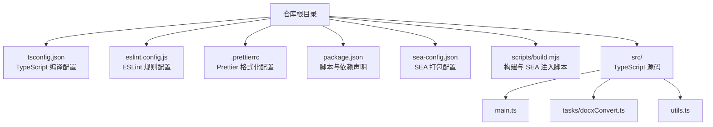
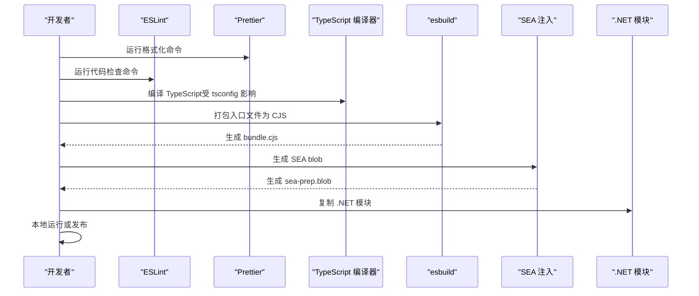
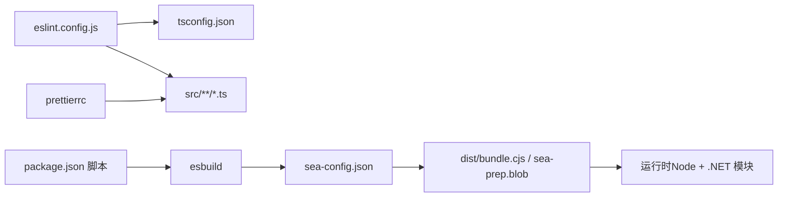

# 配置管理

<cite>
**本文引用的文件**
- [tsconfig.json](file://tsconfig.json)
- [eslint.config.js](file://eslint.config.js)
- [.prettierrc](file://.prettierrc)
- [package.json](file://package.json)
- [scripts/build.mjs](file://scripts/build.mjs)
- [sea-config.json](file://sea-config.json)
- [src/main.ts](file://src/main.ts)
- [src/tasks/docxConvert.ts](file://src/tasks/docxConvert.ts)
- [src/utils.ts](file://src/utils.ts)
</cite>

## 目录
1. [简介](#简介)
2. [项目结构](#项目结构)
3. [核心组件](#核心组件)
4. [架构总览](#架构总览)
5. [详细组件分析](#详细组件分析)
6. [依赖关系分析](#依赖关系分析)
7. [性能考量](#性能考量)
8. [故障排查指南](#故障排查指南)
9. [结论](#结论)
10. [附录](#附录)

## 简介
本文件系统性梳理本项目的配置管理体系，覆盖以下方面：
- TypeScript 编译配置：目标环境、模块系统、严格模式与产物生成策略
- ESLint 代码质量规则：解析器、插件、推荐规则与团队定制规则
- Prettier 代码格式化：缩进、分号、引号等风格统一
- 团队协作与 CI/CD 集成：如何在团队中同步配置、在流水线中执行校验与格式化
- 自定义指南：如何调整编译目标、新增 ESLint 规则、修改 Prettier 偏好

## 项目结构
本项目采用“配置文件 + 源码 + 构建脚本”的组织方式，核心配置文件位于仓库根目录，TypeScript 源码位于 src 目录，构建与打包脚本位于 scripts 目录。

图表来源
- [tsconfig.json:1-19](file://tsconfig.json#L1-L19)
- [eslint.config.js:1-26](file://eslint.config.js#L1-L26)
- [.prettierrc:1-8](file://.prettierrc#L1-L8)
- [package.json:1-40](file://package.json#L1-L40)
- [sea-config.json:1-6](file://sea-config.json#L1-L6)
- [scripts/build.mjs:1-53](file://scripts/build.mjs#L1-L53)
- [src/main.ts:1-41](file://src/main.ts#L1-L41)
- [src/tasks/docxConvert.ts:1-64](file://src/tasks/docxConvert.ts#L1-L64)
- [src/utils.ts:1-50](file://src/utils.ts#L1-L50)

章节来源
- [tsconfig.json:1-19](file://tsconfig.json#L1-L19)
- [eslint.config.js:1-26](file://eslint.config.js#L1-L26)
- [.prettierrc:1-8](file://.prettierrc#L1-L8)
- [package.json:1-40](file://package.json#L1-L40)
- [sea-config.json:1-6](file://sea-config.json#L1-L6)
- [scripts/build.mjs:1-53](file://scripts/build.mjs#L1-L53)
- [src/main.ts:1-41](file://src/main.ts#L1-L41)
- [src/tasks/docxConvert.ts:1-64](file://src/tasks/docxConvert.ts#L1-L64)
- [src/utils.ts:1-50](file://src/utils.ts#L1-L50)

## 核心组件
- TypeScript 编译配置（tsconfig.json）
  - 目标与模块系统：面向 ES2022，使用 NodeNext 模块与解析策略
  - 严格模式与类型检查：启用严格模式、跳过库检查、强制一致大小写
  - 产物与映射：输出到 dist，源码目录为 src；生成声明文件与 SourceMap
  - 包含/排除：仅包含 src 下的文件，排除 node_modules 与 dist
- ESLint 配置（eslint.config.js）
  - 解析器与插件：使用 TypeScript ESLint 解析器与插件
  - 规则来源：基于插件推荐规则，并进行团队定制
  - 定制规则：未使用变量忽略下划线前缀、显式返回类型警告、any 类型错误、分号禁用
  - 作用范围：仅对 src 下的 TypeScript 文件生效
- Prettier 配置（.prettierrc）
  - 风格统一：单引号、无分号、行长 100、Tab 宽度 2、尾随逗号遵循 es5
- 构建与打包（package.json + scripts/build.mjs + sea-config.json）
  - 脚本：开发、构建、复制 .NET 模块、发布、代码检查、格式化、测试
  - 构建流程：esbuild 打包入口文件为 CJS，生成 SEA blob 并注入到 Node 可执行文件
  - SEA 配置：指定主入口与输出 blob 路径

章节来源
- [tsconfig.json:2-17](file://tsconfig.json#L2-L17)
- [eslint.config.js:4-25](file://eslint.config.js#L4-L25)
- [.prettierrc:1-8](file://.prettierrc#L1-L8)
- [package.json:7-16](file://package.json#L7-L16)
- [scripts/build.mjs:14-47](file://scripts/build.mjs#L14-L47)
- [sea-config.json:1-6](file://sea-config.json#L1-L6)

## 架构总览
下图展示从开发到构建的关键流程，以及配置文件之间的耦合关系。

图表来源
- [package.json:13-14](file://package.json#L13-L14)
- [scripts/build.mjs:14-47](file://scripts/build.mjs#L14-L47)
- [sea-config.json:1-6](file://sea-config.json#L1-L6)

## 详细组件分析

### TypeScript 编译配置（tsconfig.json）
- 关键选项与影响
  - 目标与模块系统：ES2022 与 NodeNext 模块/解析确保与现代 Node 生态兼容，便于使用原生 ES 模块与动态导入
  - 严格模式：开启严格模式提升类型安全，减少隐式类型推断带来的风险
  - 映射与声明：生成声明文件与 SourceMap，便于调试与二次分发
  - 输出与输入：输出到 dist，源码根目录为 src，避免将第三方库与构建产物纳入编译范围
- 最佳实践
  - 在团队内保持一致的目标版本，避免在不同 Node 版本上出现行为差异
  - 若需要支持旧版 Node，可考虑降级目标版本并相应调整模块系统
  - 对于大型项目，建议拆分多个 tsconfig 以实现更细粒度的控制

章节来源
- [tsconfig.json:2-17](file://tsconfig.json#L2-L17)

### ESLint 配置（eslint.config.js）
- 规则来源与作用域
  - 使用 TypeScript ESLint 解析器与插件，结合推荐规则集
  - 仅对 src 下的 TypeScript 文件生效，避免污染第三方库
- 团队定制规则
  - 未使用变量：允许忽略以下划线开头的参数名
  - 显式函数返回类型：警告级别，鼓励明确返回类型
  - any 类型：错误级别，限制 any 的滥用
  - 分号：禁用分号，统一风格
- 最佳实践
  - 新增规则时先以 warn 级别引入，观察影响后再升级为 error
  - 对于复杂场景（如泛型、条件类型）可局部禁用或放宽规则
  - 将规则变更纳入 PR 审查流程，确保一致性

章节来源
- [eslint.config.js:4-25](file://eslint.config.js#L4-L25)

### Prettier 配置（.prettierrc）
- 风格选项
  - 单引号、无分号、行长 100、Tab 宽度 2、尾随逗号遵循 es5
- 最佳实践
  - 在 IDE 中启用保存时自动格式化，避免手动干预
  - 将 Prettier 与 ESLint 配置保持一致，减少冲突
  - 如需与团队其他工具（如 VS Code 插件）配合，统一配置文件位置与命名

章节来源
- [.prettierrc:1-8](file://.prettierrc#L1-L8)

### 构建与打包（package.json + scripts/build.mjs + sea-config.json）
- 脚本职责
  - 开发：构建 .NET 模块后通过 tsx 直接运行入口文件
  - 构建：构建 .NET 模块后执行构建脚本，生成可执行文件
  - 复制 .NET：将 .NET 模块复制到 dist/module
  - 发布：执行发布脚本
  - 代码检查与格式化：对 src 下的 TypeScript 文件执行 ESLint 与 Prettier
  - 测试：运行 Vitest 测试
- 构建流程
  - esbuild 将入口文件打包为 CJS，最小化并注入必要定义
  - 生成 SEA blob 并注入到 Node 可执行文件，形成自包含可执行程序
  - 复制 .NET 模块到 dist/module，供运行时使用

章节来源
- [package.json:7-16](file://package.json#L7-L16)
- [scripts/build.mjs:14-47](file://scripts/build.mjs#L14-L47)
- [sea-config.json:1-6](file://sea-config.json#L1-L6)

## 依赖关系分析
- 配置文件之间的耦合
  - ESLint 通过 tsconfig.json 的路径引用确保类型检查上下文一致
  - 构建脚本依赖 esbuild、postject 与 SEA 工具链，最终产物由 SEA 注入
  - Prettier 与 ESLint 共同维护代码风格，避免冲突
- 外部依赖
  - TypeScript、@typescript-eslint/*、eslint、prettier、esbuild、postject、vitest 等

图表来源
- [eslint.config.js:10-12](file://eslint.config.js#L10-L12)
- [tsconfig.json:1-19](file://tsconfig.json#L1-L19)
- [package.json:7-16](file://package.json#L7-L16)
- [scripts/build.mjs:14-47](file://scripts/build.mjs#L14-L47)
- [sea-config.json:1-6](file://sea-config.json#L1-L6)

章节来源
- [eslint.config.js:10-12](file://eslint.config.js#L10-L12)
- [tsconfig.json:1-19](file://tsconfig.json#L1-L19)
- [package.json:7-16](file://package.json#L7-L16)
- [scripts/build.mjs:14-47](file://scripts/build.mjs#L14-L47)
- [sea-config.json:1-6](file://sea-config.json#L1-L6)

## 性能考量
- 编译性能
  - 启用严格模式与跳过库检查有助于提升编译速度与稳定性
  - 仅包含 src 目录，避免不必要的文件参与编译
- 构建性能
  - esbuild 打包已启用最小化，可显著缩短构建时间
  - SEA 注入仅在构建阶段执行一次，运行时无需额外解析
- 格式化与检查
  - Prettier 与 ESLint 的执行时间与文件数量成正比，建议在 CI 中缓存依赖与产物

## 故障排查指南
- TypeScript 编译问题
  - 若出现模块解析失败，检查模块与解析策略是否匹配（当前为 NodeNext）
  - 若类型检查报错较多，优先从推荐规则入手，逐步放宽
- ESLint 规则冲突
  - 当 ESLint 与 Prettier 冲突时，优先以 Prettier 为准，或在 ESLint 中关闭相关规则
  - 新增规则时先以 warn 级别引入，确认不会阻塞开发
- 构建与 SEA 注入
  - 若 SEA 注入失败，检查 blob 路径与可执行文件路径是否正确
  - 若 .NET 模块缺失，确认复制脚本已执行且路径正确
- 常见命令
  - 代码检查：参考脚本定义
  - 格式化：参考脚本定义
  - 构建：参考脚本定义

章节来源
- [package.json:13-14](file://package.json#L13-L14)
- [scripts/build.mjs:33-47](file://scripts/build.mjs#L33-L47)

## 结论
本项目的配置体系围绕“严格的 TypeScript 编译、统一的 ESLint 规则与 Prettier 风格”展开，并通过构建脚本与 SEA 注入实现自包含可执行程序的产出。建议在团队中保持配置的一致性，将规则变更纳入审查流程，并在 CI 中统一执行检查与格式化，以保障代码质量与交付效率。

## 附录

### 配置自定义指南
- 调整 TypeScript 编译目标
  - 修改目标版本与模块系统，确保与运行环境一致
  - 如需支持旧版 Node，适当降低目标版本并调整模块解析策略
  - 参考路径：[tsconfig.json:3-4](file://tsconfig.json#L3-L4)
- 添加新的 ESLint 规则
  - 在规则对象中新增条目，建议先以 warn 级别引入
  - 如需与 Prettier 冲突，可在 ESLint 中关闭对应规则
  - 参考路径：[eslint.config.js:17-24](file://eslint.config.js#L17-L24)
- 修改代码格式化偏好
  - 在 Prettier 配置中调整风格选项，确保与团队约定一致
  - 参考路径：[.prettierrc:1-8](file://.prettierrc#L1-L8)

### 团队协作与 CI/CD 集成
- 配置同步策略
  - 将配置文件纳入版本控制，避免本地差异化
  - 在 PR 中对配置变更进行审查，确保一致性
- CI/CD 集成建议
  - 在流水线中安装依赖并执行代码检查与格式化
  - 构建阶段执行打包与 SEA 注入，确保产物完整
  - 参考脚本定义与构建流程：[package.json:7-16](file://package.json#L7-L16)，[scripts/build.mjs:14-47](file://scripts/build.mjs#L14-L47)