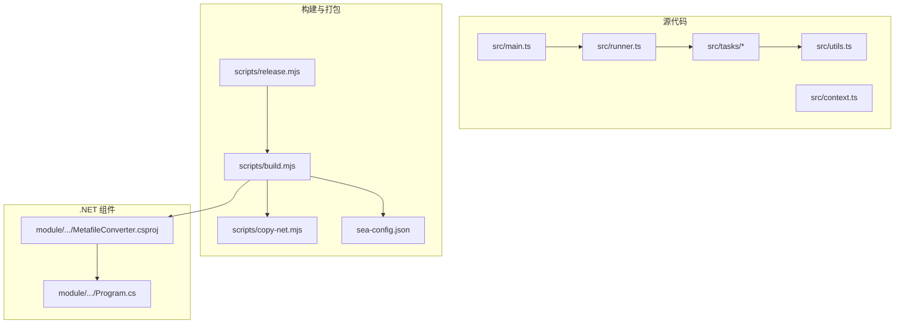
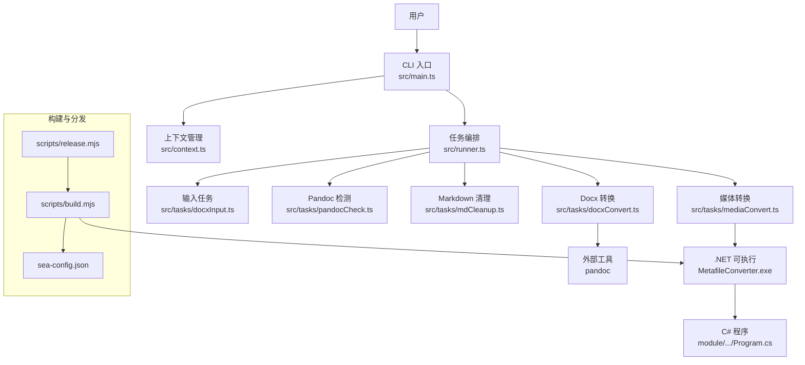
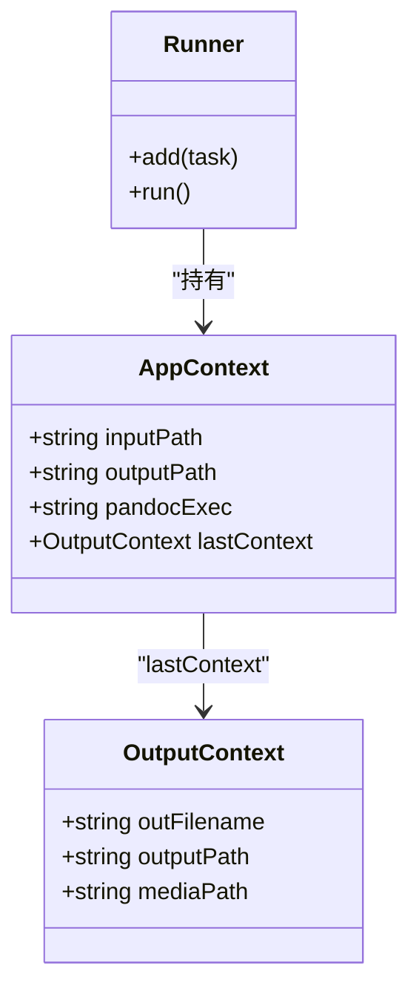
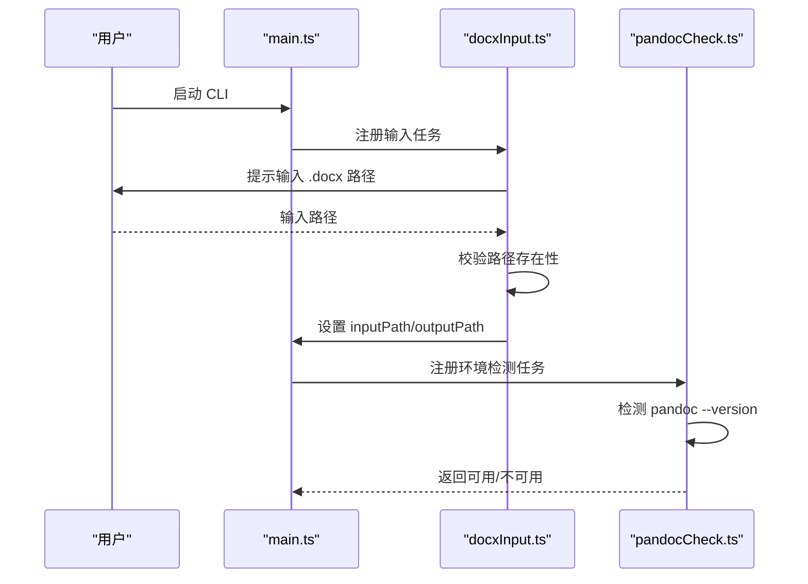
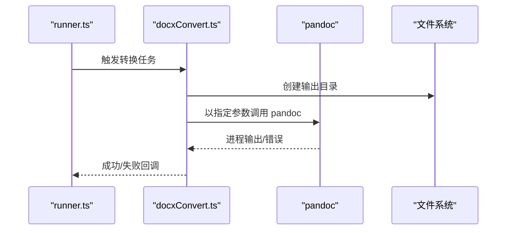
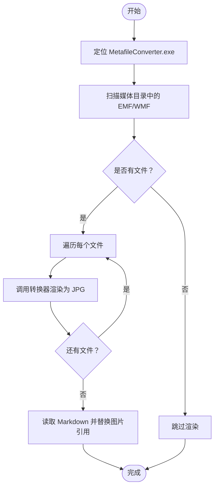
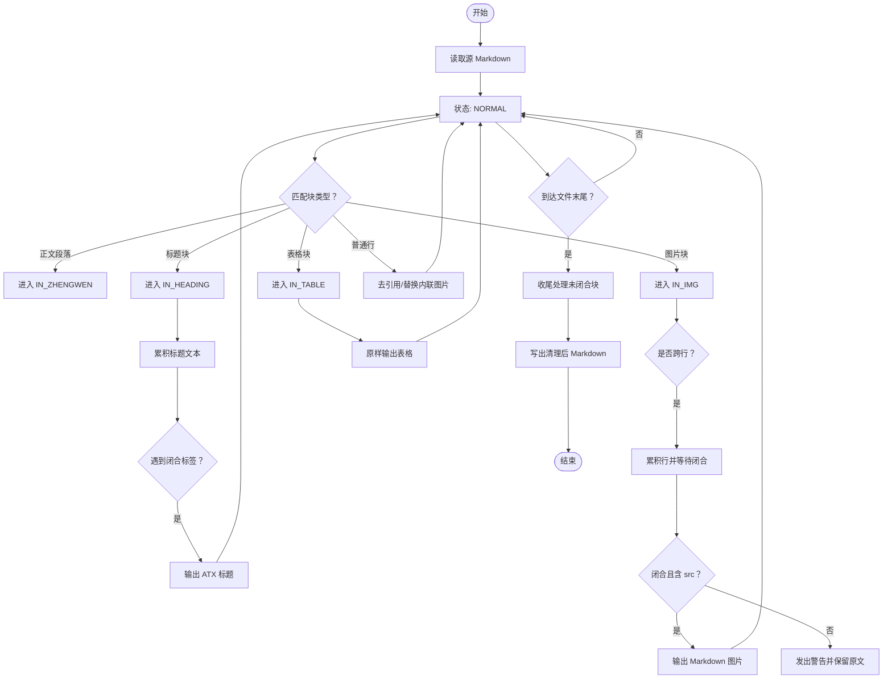
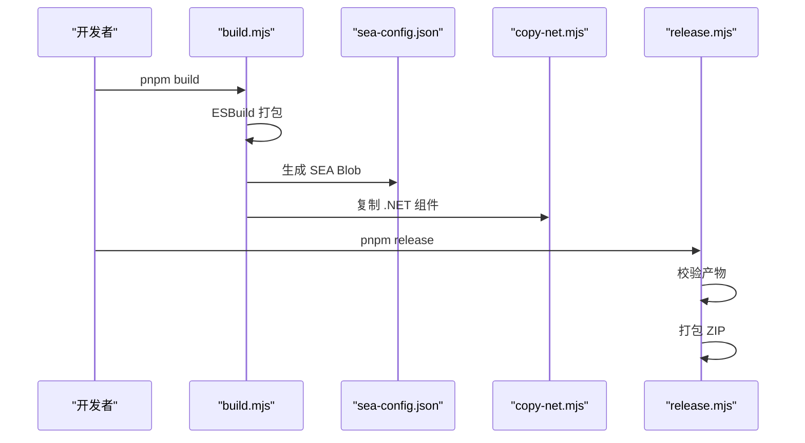
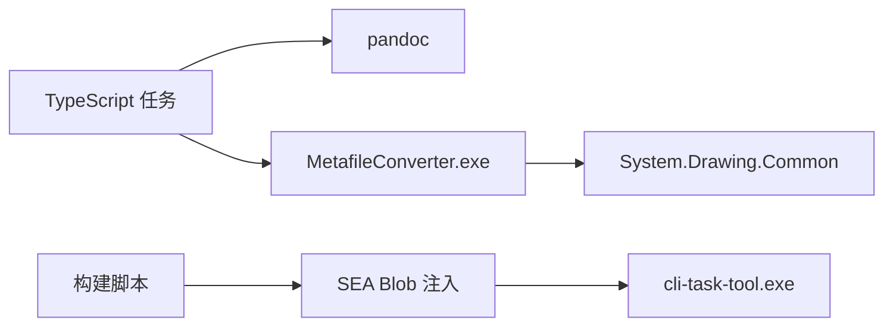

# 项目概述

<cite>
**本文引用的文件**
- [package.json](file://package.json)
- [sea-config.json](file://sea-config.json)
- [src/main.ts](file://src/main.ts)
- [src/context.ts](file://src/context.ts)
- [src/runner.ts](file://src/runner.ts)
- [src/tasks/docxInput.ts](file://src/tasks/docxInput.ts)
- [src/tasks/pandocCheck.ts](file://src/tasks/pandocCheck.ts)
- [src/tasks/docxConvert.ts](file://src/tasks/docxConvert.ts)
- [src/tasks/mediaConvert.ts](file://src/tasks/mediaConvert.ts)
- [src/tasks/mdCleanup.ts](file://src/tasks/mdCleanup.ts)
- [src/utils.ts](file://src/utils.ts)
- [scripts/build.mjs](file://scripts/build.mjs)
- [scripts/copy-net.mjs](file://scripts/copy-net.mjs)
- [scripts/release.mjs](file://scripts/release.mjs)
- [module/MetafileConverter/MetafileConverter/MetafileConverter.csproj](file://module/MetafileConverter/MetafileConverter/MetafileConverter.csproj)
- [module/MetafileConverter/MetafileConverter/Program.cs](file://module/MetafileConverter/MetafileConverter/Program.cs)
</cite>

## 目录
1. [引言](#引言)
2. [项目结构](#项目结构)
3. [核心组件](#核心组件)
4. [架构总览](#架构总览)
5. [详细组件分析](#详细组件分析)
6. [依赖关系分析](#依赖关系分析)
7. [性能考量](#性能考量)
8. [故障排查指南](#故障排查指南)
9. [结论](#结论)
10. [附录](#附录)

## 引言
Doc2XML CLI 是一个交互式命令行管道工具，用于将 Microsoft Word (.docx) 文档转换为 Markdown 格式。它在文档处理生态中的定位是“从富文本到纯文本 Markdown 的可靠转换器”，特别适用于需要保留结构化内容（如标题、表格、图片）并进行后续编辑或静态站点生成的场景。项目通过 TypeScript 编写主流程，结合 C# 编写的矢量图渲染器（MetafileConverter.exe），并通过 SEA（Single Executable App）技术打包为单一可执行文件，实现跨平台分发与部署。

- 主要目标
  - 将 .docx 转换为高质量 Markdown，保留中文标题层级与表格结构。
  - 自动处理 EMF/WMF 矢量图，将其渲染为 JPG 并更新 Markdown 引用。
  - 提供交互式 CLI 流程，支持缓存与错误提示，便于非技术用户使用。

- 应用场景
  - 教育与科研：讲义、论文、报告的 Markdown 化，便于版本控制与静态站点生成。
  - 内容创作：将 Word 文稿转为 Markdown，配合写作工作流与发布系统。
  - 文档迁移：将历史 Word 文档统一转换为 Markdown，降低维护成本。

- 目标用户
  - 需要批量或单次转换 .docx 的作者与编辑者。
  - 使用静态站点生成器（如 Hugo、Obsidian、Typora）的用户。
  - 希望在 CI/CD 中集成文档转换的团队与开发者。

- 差异化优势
  - 多语言协作开发：前端使用 TypeScript，后端使用 C#，发挥各自生态优势。
  - SEA 打包：单文件可执行，便于分发与部署，无需额外运行时。
  - 专业矢量图处理：内置 MetafileConverter.exe，专门处理 EMF/WMF 到 JPG 的高质量渲染。
  - 结构化清理：针对 Pandoc 输出的 HTML 特征进行状态机清理，提升 Markdown 可读性与一致性。

**章节来源**
- [package.json:1-40](file://package.json#L1-L40)
- [src/main.ts:1-41](file://src/main.ts#L1-L41)

## 项目结构
项目采用“模块化任务 + 构建脚本 + 多语言组件”的组织方式：
- src：TypeScript 主流程与任务定义，负责交互、上下文管理与任务编排。
- scripts：构建与发布脚本，负责打包、注入 SEA Blob、复制 .NET 组件。
- module/MetafileConverter：C# 控制台应用，提供 EMF/WMF 到 JPG 的高质量渲染。
- 配置文件：package.json、sea-config.json、tsconfig.json 等。

**图表来源**
- [src/main.ts:1-41](file://src/main.ts#L1-L41)
- [src/runner.ts:1-10](file://src/runner.ts#L1-L10)
- [scripts/build.mjs:1-53](file://scripts/build.mjs#L1-L53)
- [scripts/copy-net.mjs:1-37](file://scripts/copy-net.mjs#L1-L37)
- [scripts/release.mjs:1-42](file://scripts/release.mjs#L1-L42)
- [module/MetafileConverter/MetafileConverter/MetafileConverter.csproj:1-17](file://module/MetafileConverter/MetafileConverter/MetafileConverter.csproj#L1-L17)
- [module/MetafileConverter/MetafileConverter/Program.cs:1-88](file://module/MetafileConverter/MetafileConverter/Program.cs#L1-L88)

**章节来源**
- [package.json:1-40](file://package.json#L1-L40)
- [sea-config.json:1-6](file://sea-config.json#L1-L6)

## 核心组件
- 应用入口与流程编排
  - main.ts：创建上下文与 Runner，注册并执行转换任务序列。
  - runner.ts：基于 Listr2 创建任务执行器，支持子任务与进度展示。
  - context.ts：定义 AppContext 与 OutputContext，贯穿整个转换流程。

- 任务层
  - docxInput.ts：交互式输入 .docx 路径，校验存在性，计算输出目录。
  - pandocCheck.ts：检测系统是否安装 Pandoc，决定可执行文件路径。
  - docxConvert.ts：调用 Pandoc 将 .docx 转换为 Markdown，并提取媒体资源。
  - mediaConvert.ts：调用 MetafileConverter.exe 渲染 EMF/WMF 为 JPG，并更新 Markdown 引用。
  - mdCleanup.ts：对 Pandoc 输出进行状态机清理，去除 HTML 特征，规范化标题与图片。

- 构建与分发
  - build.mjs：ESBuild 打包、生成 SEA Blob、注入 Blob、复制 .NET 组件。
  - copy-net.mjs：将 .NET 运行时与依赖复制到 dist/module。
  - release.mjs：打包发行包，生成压缩归档。

- C# 转换器
  - MetafileConverter.csproj：AOT 发布配置，目标框架 net8.0。
  - Program.cs：接收输入/输出路径，高质量渲染 EMF/WMF 为 JPG。

**章节来源**
- [src/main.ts:1-41](file://src/main.ts#L1-L41)
- [src/runner.ts:1-10](file://src/runner.ts#L1-L10)
- [src/context.ts:1-21](file://src/context.ts#L1-L21)
- [src/tasks/docxInput.ts:1-52](file://src/tasks/docxInput.ts#L1-L52)
- [src/tasks/pandocCheck.ts:1-24](file://src/tasks/pandocCheck.ts#L1-L24)
- [src/tasks/docxConvert.ts:1-64](file://src/tasks/docxConvert.ts#L1-L64)
- [src/tasks/mediaConvert.ts:1-112](file://src/tasks/mediaConvert.ts#L1-L112)
- [src/tasks/mdCleanup.ts:1-373](file://src/tasks/mdCleanup.ts#L1-L373)
- [scripts/build.mjs:1-53](file://scripts/build.mjs#L1-L53)
- [scripts/copy-net.mjs:1-37](file://scripts/copy-net.mjs#L1-L37)
- [scripts/release.mjs:1-42](file://scripts/release.mjs#L1-L42)
- [module/MetafileConverter/MetafileConverter/MetafileConverter.csproj:1-17](file://module/MetafileConverter/MetafileConverter/MetafileConverter.csproj#L1-L17)
- [module/MetafileConverter/MetafileConverter/Program.cs:1-88](file://module/MetafileConverter/MetafileConverter/Program.cs#L1-L88)

## 架构总览
Doc2XML CLI 的整体架构由“TypeScript 主流程 + C# 渲染器 + SEA 打包”构成。TypeScript 层负责用户交互、任务编排与文件操作；C# 层负责矢量图渲染；构建脚本负责打包与分发。

**图表来源**
- [src/main.ts:1-41](file://src/main.ts#L1-L41)
- [src/context.ts:1-21](file://src/context.ts#L1-L21)
- [src/runner.ts:1-10](file://src/runner.ts#L1-L10)
- [src/tasks/docxInput.ts:1-52](file://src/tasks/docxInput.ts#L1-L52)
- [src/tasks/pandocCheck.ts:1-24](file://src/tasks/pandocCheck.ts#L1-L24)
- [src/tasks/docxConvert.ts:1-64](file://src/tasks/docxConvert.ts#L1-L64)
- [src/tasks/mediaConvert.ts:1-112](file://src/tasks/mediaConvert.ts#L1-L112)
- [src/tasks/mdCleanup.ts:1-373](file://src/tasks/mdCleanup.ts#L1-L373)
- [scripts/build.mjs:1-53](file://scripts/build.mjs#L1-L53)
- [sea-config.json:1-6](file://sea-config.json#L1-L6)
- [scripts/release.mjs:1-42](file://scripts/release.mjs#L1-L42)
- [module/MetafileConverter/MetafileConverter/Program.cs:1-88](file://module/MetafileConverter/MetafileConverter/Program.cs#L1-L88)

## 详细组件分析

### 任务编排与上下文
- 上下文设计
  - AppContext：存储输入路径、输出目录、Pandoc 可执行路径以及 lastContext。
  - OutputContext：记录当前层的输出文件名、输出路径与媒体路径。
- Runner 设计
  - 基于 Listr2，支持子任务链与进度展示，便于扩展更多转换步骤。

**图表来源**
- [src/context.ts:1-21](file://src/context.ts#L1-L21)
- [src/runner.ts:1-10](file://src/runner.ts#L1-L10)

**章节来源**
- [src/context.ts:1-21](file://src/context.ts#L1-L21)
- [src/runner.ts:1-10](file://src/runner.ts#L1-L10)

### 输入与环境检查
- 输入任务
  - 交互式收集 .docx 路径，支持缓存与默认值，校验路径存在性。
  - 计算输出目录为输入所在目录的 out 子目录。
- Pandoc 检测
  - 通过系统命令检测 Pandoc 是否可用，不可用则抛错中断流程。

**图表来源**
- [src/main.ts:1-41](file://src/main.ts#L1-L41)
- [src/tasks/docxInput.ts:1-52](file://src/tasks/docxInput.ts#L1-L52)
- [src/tasks/pandocCheck.ts:1-24](file://src/tasks/pandocCheck.ts#L1-L24)

**章节来源**
- [src/tasks/docxInput.ts:1-52](file://src/tasks/docxInput.ts#L1-L52)
- [src/tasks/pandocCheck.ts:1-24](file://src/tasks/pandocCheck.ts#L1-L24)

### Docx 转换与媒体提取
- 转换策略
  - 使用 Pandoc，输入格式为 docx+styles，目标格式为 gfm（GitHub Flavored Markdown）并禁用 LaTeX 数学转换。
  - 提取媒体资源到独立目录，便于后续处理。
- 错误处理
  - 捕获子进程错误与非零退出码，输出 stderr 作为错误信息。

**图表来源**
- [src/tasks/docxConvert.ts:1-64](file://src/tasks/docxConvert.ts#L1-L64)

**章节来源**
- [src/tasks/docxConvert.ts:1-64](file://src/tasks/docxConvert.ts#L1-L64)

### 媒体转换与路径修复
- 渲染策略
  - 定位 MetafileConverter.exe（SEA 运行时与开发环境不同路径），对 EMF/WMF 文件逐一渲染为 JPG。
  - 采用高质量插值与抗锯齿参数，保证输出清晰度。
- 路径修复
  - 读取转换后的 Markdown，将 media/xxx.emf(w) 替换为 media/xxx.jpg，更新 lastContext 指向新输出。

**图表来源**
- [src/tasks/mediaConvert.ts:1-112](file://src/tasks/mediaConvert.ts#L1-L112)
- [module/MetafileConverter/MetafileConverter/Program.cs:1-88](file://module/MetafileConverter/MetafileConverter/Program.cs#L1-L88)

**章节来源**
- [src/tasks/mediaConvert.ts:1-112](file://src/tasks/mediaConvert.ts#L1-L112)
- [module/MetafileConverter/MetafileConverter/Program.cs:1-88](file://module/MetafileConverter/MetafileConverter/Program.cs#L1-L88)

### Markdown 清理与结构化输出
- 清理策略
  - 使用状态机识别正文段落、标题块、图片块、表格等结构，去除 Pandoc 输出中的 HTML 特征。
  - 支持中文序数标题映射为 ATX 标题，规范化图片引用。
- 错误与警告
  - 对未知样式与异常情况发出警告，避免数据丢失。

**图表来源**
- [src/tasks/mdCleanup.ts:1-373](file://src/tasks/mdCleanup.ts#L1-L373)

**章节来源**
- [src/tasks/mdCleanup.ts:1-373](file://src/tasks/mdCleanup.ts#L1-L373)

### 构建与分发流程
- 构建步骤
  - ESBuild 打包 TypeScript 入口为 dist/bundle.cjs。
  - 生成 SEA Blob 并注入到 Node.js 可执行文件。
  - 复制 .NET 组件到 dist/module，确保运行时依赖齐全。
- 发行流程
  - 校验产物完整性，拷贝到 release/<version>/<name>，使用 PowerShell 打包为 ZIP。

**图表来源**
- [scripts/build.mjs:1-53](file://scripts/build.mjs#L1-L53)
- [sea-config.json:1-6](file://sea-config.json#L1-L6)
- [scripts/copy-net.mjs:1-37](file://scripts/copy-net.mjs#L1-L37)
- [scripts/release.mjs:1-42](file://scripts/release.mjs#L1-L42)

**章节来源**
- [scripts/build.mjs:1-53](file://scripts/build.mjs#L1-L53)
- [scripts/copy-net.mjs:1-37](file://scripts/copy-net.mjs#L1-L37)
- [scripts/release.mjs:1-42](file://scripts/release.mjs#L1-L42)

## 依赖关系分析
- 运行时依赖
  - @inquirer/prompts 与 listr2：提供交互式提示与任务执行器。
  - Node.js child_process：调用 Pandoc 与 MetafileConverter.exe。
- 构建与打包
  - esbuild：打包入口文件。
  - postject：将 SEA Blob 注入可执行文件。
  - PowerShell：打包发行归档。
- .NET 组件
  - System.Drawing.Common：提供 Metafile 与 Bitmap 渲染能力。
  - AOT 发布：提升启动性能与体积控制。

**图表来源**
- [package.json:21-38](file://package.json#L21-L38)
- [scripts/build.mjs:1-53](file://scripts/build.mjs#L1-L53)
- [module/MetafileConverter/MetafileConverter/MetafileConverter.csproj:12-14](file://module/MetafileConverter/MetafileConverter/MetafileConverter.csproj#L12-L14)

**章节来源**
- [package.json:21-38](file://package.json#L21-L38)
- [module/MetafileConverter/MetafileConverter/MetafileConverter.csproj:12-14](file://module/MetafileConverter/MetafileConverter/MetafileConverter.csproj#L12-L14)

## 性能考量
- SEA 打包
  - 单文件可执行，减少启动时间与依赖查找开销。
  - 通过 postject 注入 Blob，避免额外解压步骤。
- AOT 发布
  - C# 程序启用 PublishAot，减少 JIT 编译开销，提升首次渲染速度。
- 渲染质量
  - 使用高质量插值与抗锯齿参数，保证矢量图渲染清晰度。
- I/O 优化
  - 任务分层与目录隔离，避免重复读写，提高整体吞吐。

[本节为通用性能建议，不直接分析具体文件]

## 故障排查指南
- Pandoc 未安装
  - 症状：环境检测阶段抛出错误。
  - 处理：安装 Pandoc 并确保命令可用，或在 PATH 中正确配置。
  - 参考：[src/tasks/pandocCheck.ts:14-23](file://src/tasks/pandocCheck.ts#L14-L23)

- .docx 路径无效
  - 症状：输入任务校验失败。
  - 处理：确认路径存在且为 .docx 文件，必要时使用绝对路径。
  - 参考：[src/tasks/docxInput.ts:13-25](file://src/tasks/docxInput.ts#L13-L25)

- MetafileConverter 退出码异常
  - 症状：媒体转换阶段报错。
  - 处理：检查输入 EMF/WMF 文件是否存在，查看 stderr 输出。
  - 参考：[src/tasks/mediaConvert.ts:29-40](file://src/tasks/mediaConvert.ts#L29-L40)

- Markdown 清理警告
  - 症状：清理阶段输出警告信息。
  - 处理：根据警告提示调整源文档样式或手动修正 Markdown。
  - 参考：[src/tasks/mdCleanup.ts:355-357](file://src/tasks/mdCleanup.ts#L355-L357)

**章节来源**
- [src/tasks/pandocCheck.ts:14-23](file://src/tasks/pandocCheck.ts#L14-L23)
- [src/tasks/docxInput.ts:13-25](file://src/tasks/docxInput.ts#L13-L25)
- [src/tasks/mediaConvert.ts:29-40](file://src/tasks/mediaConvert.ts#L29-L40)
- [src/tasks/mdCleanup.ts:355-357](file://src/tasks/mdCleanup.ts#L355-L357)

## 结论
Doc2XML CLI 通过 TypeScript 与 C# 的协同、SEA 打包与专业的矢量图渲染能力，实现了从 .docx 到 Markdown 的高质量转换。其模块化的任务设计、完善的错误处理与发行流程，使其既适合个人用户快速转换，也适合团队在自动化流程中稳定使用。未来可在模板化输出、批量化处理与跨平台测试方面进一步增强。

[本节为总结性内容，不直接分析具体文件]

## 附录
- 关键特性清单
  - 交互式 CLI 流程，支持缓存与默认值。
  - Pandoc 驱动的 Docx 转换，提取媒体资源。
  - MetafileConverter 高质量渲染 EMF/WMF 为 JPG。
  - Markdown 清理与结构化输出，适配中文标题层级。
  - SEA 打包与一键发行，便于分发与部署。

- 与其他工具的差异化
  - 专注中文文档与中文标题层级的适配。
  - 内置矢量图渲染器，避免外部依赖复杂性。
  - 任务分层与状态机清理，提升输出质量与一致性。

[本节为概念性汇总，不直接分析具体文件]