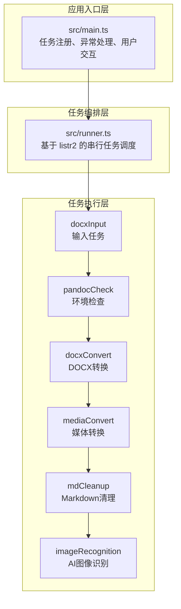
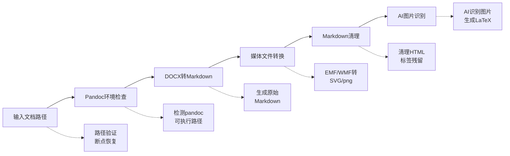

# doc2xml-cli

一个交互式 CLI 工具，用于将 DOCX 文档转换为 Markdown 格式，支持 AI 图像识别、矢量图转换等高级功能。

## 功能特性

- **DOCX 转 Markdown**: 基于 Pandoc 的高质量文档转换
- **矢量图处理**: 将 EMF/WMF 矢量图转换为 SVG 格式
- **AI 图像识别**: 使用大语言模型识别图片内容并生成 LaTeX/MathML 公式
- **断点续传**: 支持从任意步骤恢复执行，避免重复处理
- **单文件可执行**: 通过 Node.js SEA 技术打包为独立可执行文件

## 架构设计

### 整体架构

项目采用"入口控制 + 任务编排 + 任务实现"的分层架构：



### 核心组件

| 组件       | 文件             | 职责                                 |
| ---------- | ---------------- | ------------------------------------ |
| 上下文管理 | `src/context.ts` | 定义应用状态、断点恢复、上下文持久化 |
| 任务调度器 | `src/runner.ts`  | 基于 listr2 的任务编排与执行         |
| 日志系统   | `src/logger.ts`  | 结构化日志记录，支持文件持久化       |
| 工具函数   | `src/utils.ts`   | 输入缓存、提示样式等通用工具         |

### 任务流水线



### 混合技术栈

- **Node.js + TypeScript**: 核心 CLI 逻辑与任务编排
- **.NET (C#)**: EMF/WMF 矢量图转换模块 (`module/MetafileConverter/`)
- **Pandoc**: DOCX 到 Markdown 的基础转换

## 使用说明

### 环境要求

#### 开发环境

| 组件       | 版本   | 说明                                    |
| ---------- | ------ | --------------------------------------- |
| Node.js    | ≥ 20   | 运行时环境                              |
| pnpm       | ≥ 10   | 包管理器                                |
| .NET 8 SDK | 8.0.x  | 构建矢量图转换模块（MetafileConverter） |
| Pandoc     | 最新版 | DOCX 到 Markdown 的基础转换             |

> **注意**: .NET 8 SDK 包含运行时和构建工具，无需单独安装 Visual Studio 2022，使用命令行即可构建。

#### 运行环境

| 组件           | 版本   | 说明                                 |
| -------------- | ------ | ------------------------------------ |
| Node.js        | ≥ 20   | 运行开发版本                         |
| .NET 8 Runtime | 8.0.x  | 运行矢量图转换模块（SEA 打包后仍需） |
| Pandoc         | 最新版 | DOCX 转换依赖                        |

> **提示**: 如果通过 `pnpm build` 构建 SEA 可执行文件分发，目标机器只需安装 .NET 8 Runtime 和 Pandoc，无需 Node.js 开发环境。

### AI 模型推荐

用于图像识别（公式、图表转 LaTeX）的推荐模型：

| 模型               | 推荐度   | 说明                           |
| ------------------ | -------- | ------------------------------ |
| **gemma-4-31b-it** | ⭐⭐⭐ 首选 | 准确度相当高，公式识别效果优秀 |
| **gemma-4-e4b**    | ⭐⭐☆ 备选 | 表现尚可，资源占用较低         |

> 配置方式：运行程序时按提示输入兼容 OpenAI API 的服务地址和模型名称即可。

### 安装依赖

```bash
pnpm install
```

### 开发运行

```bash
# 开发模式（自动构建 .NET 模块并运行）
pnpm dev

# 或手动构建 .NET 模块后运行
pnpm build:net
pnpm tsx src/main.ts
```

### 构建可执行文件

```bash
# 构建完整发布包（包含 SEA 可执行文件和 .NET 模块）
pnpm build

# 输出目录
# dist/
#   ├── cli-task-tool.exe    # 主可执行文件
#   └── module/              # .NET 转换模块
```

### 使用流程

1. **启动程序**: 运行 `cli-task-tool.exe` 或 `pnpm dev`
2. **输入路径**: 输入要转换的 `.docx` 文件路径
3. **断点恢复**: 如果检测到已有输出，可选择从指定步骤恢复
4. **AI 配置** (可选): 配置 AI 服务用于图片识别
5. **等待完成**: 各任务自动串行执行，生成最终 Markdown 文件

### 输出结构

```
out/
├── docxConvert/
│   ├── context.json       # 任务上下文
│   └── <filename>.md      # Pandoc 原始输出
├── mediaConvert/
│   ├── context.json
│   ├── <filename>.md      # 更新媒体路径后的 Markdown
│   └── media/             # 提取的媒体文件
├── mdCleanup/
│   ├── context.json
│   ├── <filename>.md      # 清理后的 Markdown
│   └── media/             # 媒体文件引用
└── imageRecognition/
    ├── context.json
    └── <filename>.md      # 最终输出（含 AI 识别结果）
```

## 开发说明

### 项目结构

```
doc2xml-cli/
├── src/
│   ├── main.ts                    # 应用入口
│   ├── runner.ts                  # 任务调度器
│   ├── context.ts                 # 上下文管理
│   ├── logger.ts                  # 日志系统
│   ├── utils.ts                   # 工具函数
│   └── tasks/                     # 任务实现
│       ├── docxInput.ts           # 输入处理
│       ├── pandocCheck.ts         # Pandoc 检查
│       ├── docxConvert.ts         # DOCX 转换
│       ├── mediaConvert.ts        # 媒体转换
│       ├── mdCleanup.ts           # Markdown 清理
│       └── imageRecognition/      # AI 图像识别
│           ├── index.ts
│           ├── configureTask.ts
│           ├── processTask.ts
│           ├── recognition.ts
│           ├── config.ts
│           ├── helpers.ts
│           ├── types.ts
│           └── constants.ts
├── module/
│   └── MetafileConverter/         # .NET 矢量图转换模块
│       └── MetafileConverter/
│           ├── MetafileConverter.csproj
│           └── Program.cs
├── scripts/
│   ├── build.mjs                  # 构建脚本
│   ├── copy-net.mjs               # 复制 .NET 模块
│   └── release.mjs                # 发布脚本
├── package.json
├── tsconfig.json
├── sea-config.json                # Node.js SEA 配置
└── eslint.config.js
```

### 添加新任务

1. 在 `src/tasks/` 下创建任务文件
2. 实现 `ListrTask<AppContext>` 接口
3. 在 `src/main.ts` 中注册任务

示例：

```typescript
import type { ListrTask } from 'listr2'
import type { AppContext } from '../context.js'

export const myTask: ListrTask<AppContext> = {
  title: '我的任务',
  task: async (ctx, task) => {
    // 任务逻辑
    task.output = '处理中...'
    // ...
  },
}
```

### 断点恢复机制

支持从以下步骤恢复执行：

| 步骤 | 任务             | 说明                 |
| ---- | ---------------- | -------------------- |
| 3    | mediaConvert     | 从矢量图渲染开始     |
| 4    | mdCleanup        | 从 Markdown 清理开始 |
| 5    | imageRecognition | 从 AI 图片识别开始   |

恢复时自动加载前一步的上下文，确保数据连续性。

### 脚本命令

| 命令             | 说明                |
| ---------------- | ------------------- |
| `pnpm dev`       | 开发模式运行        |
| `pnpm build`     | 构建完整发布包      |
| `pnpm build:net` | 构建 .NET 模块      |
| `pnpm lint`      | ESLint 代码检查     |
| `pnpm format`    | Prettier 代码格式化 |
| `pnpm test`      | 运行测试            |

## 许可证

ISC
